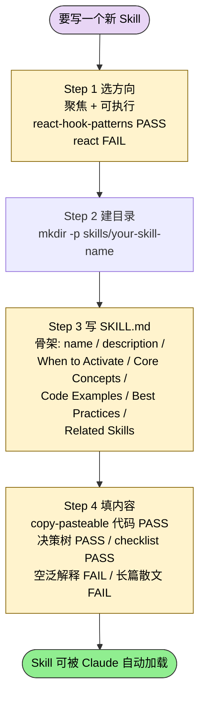
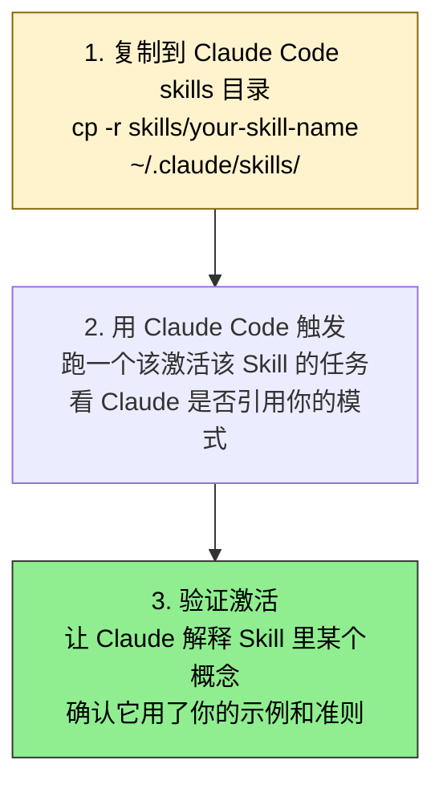
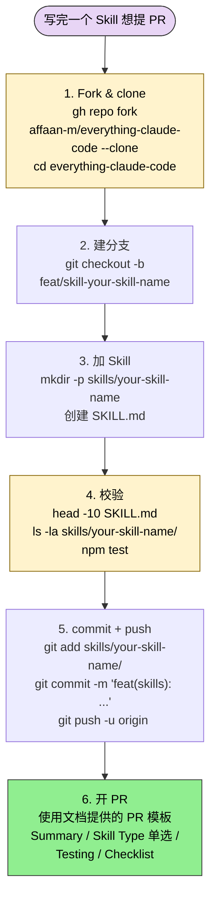

> 本文档是 **ecc** 套件的官方 Skill 开发指南（plugin-doc），不是某个具体 SKILL.md 的中文教程。如果你想看 ECC 内的具体 Skill，参见 [ECC 持续学习 Skills 大全](/articles/ecc-workflow)。

## 文档定位

> How to build, test, and ship a skill in ECC: file structure, frontmatter requirements, naming conventions, when to extract subagents, and ECC's "continuous learning" iteration loop. Reference for contributors and skill authors.

这是 Everything Claude Code (ECC) 仓库的 Skill 开发指南，目标读者是想给 ECC 贡献新 Skill 的开发者，或者想照 ECC 风格搭自己 Skill 集的人。文档系统讲清了"Skill 是什么 / 文件结构怎么放 / SKILL.md 怎么写 / 怎么本地测试 / 怎么提 PR"。

## Skill 在 ECC 里的角色

Skill 是 Claude Code 按上下文自动加载的**知识模块**，提供：

- **领域专家知识**：框架模式、语言习惯、最佳实践
- **工作流定义**：常见任务的分步流程
- **参考材料**：代码片段、checklist、决策树
- **上下文注入**：满足特定条件时激活

ECC 把 Skill 和其他几种 Claude Code 组件做了清晰区分：

| 组件 | 用途 | 激活方式 |
|------|------|---------|
| **Skill** | 知识仓库 | 上下文驱动（自动） |
| **Agent** | 任务执行体 | 显式 delegation |
| **Command** | 用户动作 | 用户调用 `/command` |
| **Hook** | 自动化 | 事件触发 |
| **Rule** | 始终在线的准则 | 永远激活 |

Skill 激活时机包括：用户任务匹配 Skill 领域、Claude Code 检测到相关上下文、某 command 引用了它、某 agent 需要领域知识。

## Skill 文件结构

ECC 规定的标准目录布局：

```
skills/
└── your-skill-name/
    ├── SKILL.md           # Required: Main skill definition
    ├── examples/          # Optional: Code examples
    │   ├── basic.ts
    │   └── advanced.ts
    └── references/        # Optional: External references
        └── links.md
```

`SKILL.md` 是唯一**必须**存在的文件；`examples/` 放可编译/可跑的代码示例；`references/` 放外部参考链接和补充材料。

## SKILL.md 格式

ECC 规定的 SKILL.md 骨架（带 YAML frontmatter）：

```markdown
---
name: skill-name
description: Brief description shown in skill list and used for auto-activation
origin: ECC
---

# Skill Title

Brief overview of what this skill covers.

## When to Activate

Describe scenarios where Claude should use this skill.

## Core Concepts

Main patterns and guidelines.

## Code Examples

​```typescript
// Practical, tested examples
​```

## Anti-Patterns

Show what NOT to do with concrete examples.

## Best Practices

- Actionable guidelines
- Do's and don'ts

## Related Skills

Link to complementary skills.
```

### YAML frontmatter 字段

| 字段 | 必填 | 说明 |
|------|------|------|
| `name` | 是 | 小写连字符标识，例如 `react-patterns` |
| `description` | 是 | 一句话描述，用于 Skill 列表 + 自动激活 |
| `origin` | 否 | 来源标识，例如 `ECC`、`community`、项目名 |
| `tags` | 否 | 分类用 tag 数组 |
| `version` | 否 | 版本号，便于跟踪更新 |

## 创建你的第一个 Skill

整体流程是"选方向 → 建目录 → 写骨架 → 填内容"四步串行：



### Step 1：选一个聚焦的方向

ECC 的核心观点是"聚焦 + 可执行"。对比示例：

| 通过：好的聚焦 | 不通过：太宽 |
|--------------|-------------|
| `react-hook-patterns` | `react` |
| `postgresql-indexing` | `databases` |
| `pytest-fixtures` | `python-testing` |
| `nextjs-app-router` | `nextjs` |

### Step 2：建目录

```bash
mkdir -p skills/your-skill-name
```

### Step 3：写 SKILL.md

按上面骨架模版填——`name` / `description` / "When to Activate" / "Core Concepts" / "Code Examples" / "Best Practices" / "Related Skills"。

### Step 4：填内容

ECC 的判分标准是"Claude 能立即用"：

- 通过：可复制粘贴的代码示例
- 通过：清晰的决策树
- 通过：可验证的 checklist
- 不通过：没有示例的空泛解释
- 不通过：没有可操作指引的长篇散文

## Skill 四种分类

ECC 把 Skill 分成四个大类，每个类有自己的模版：

### 1. 语言标准（Language Standards）

聚焦语言习惯、命名规范、语言特定模式。例如 `python-patterns` / `golang-patterns` / `typescript-standards`。

### 2. 框架模式（Framework Patterns）

聚焦框架特定约定、常见模式、反模式。例如 `django-patterns` / `nextjs-patterns` / `springboot-patterns`。

### 3. 工作流（Workflow Skills）

定义常见开发任务的分步流程。例如 `tdd-workflow` / `code-review-workflow` / `deployment-checklist`。文档给的 code-review-workflow 样例 Skill 的内部 step 表（属另一个 Skill 的内容、非本指南主流程）：

| Step | 名称 | 含义 |
|------|------|------|
| 1 | Understand Context | 读 PR 描述和相关 issue |
| 2 | Check Tests | 验证测试覆盖率和质量 |
| 3 | Review Logic | 分析实现正确性 |
| 4 | Check Security | 找漏洞 |
| 5 | Verify Style | 确保符合规范 |

### 4. 领域知识（Domain Knowledge）

特定领域（安全、性能等）的专门知识。例如 `security-review` / `performance-optimization` / `api-design`。

## 写好 Skill 内容的五条原则

### 1. 从 "When to Activate" 开始

这一节对自动激活**至关重要**。要写得具体：

```markdown
## When to Activate

- Creating new React components
- Refactoring existing components
- Debugging React state issues
- Reviewing React code for best practices
```

### 2. Show, Don't Tell

错误做法：

```markdown
## Error Handling

Always handle errors properly in async functions.
```

正确做法：放完整的代码 + 用 `### Key Points` 列具体要点（"Check response.ok before parsing / Log errors for debugging / Re-throw with user-friendly message"）。

### 3. 包含反模式（Anti-Patterns）

显式给出"什么不能做"，配可复制的代码示例：

```typescript
// NEVER do this
user.name = 'New Name'
items.push(newItem)

// ALWAYS do this
const updatedUser = { ...user, name: 'New Name' }
const updatedItems = [...items, newItem]
```

### 4. 提供 checklist

```markdown
## Pre-Deployment Checklist

- [ ] All tests passing
- [ ] No console.log in production code
- [ ] Environment variables documented
- [ ] Secrets not hardcoded
- [ ] Error handling complete
- [ ] Input validation in place
```

### 5. 用决策树

```
Need to fetch data?
├── Single request → use fetch directly
├── Multiple independent → Promise.all()
├── Multiple dependent → await sequentially
└── With caching → use SWR or React Query
```

## 最佳实践 DO / DON'T

ECC 给的对照表：

| DO | 示例 |
|------|------|
| **具体** | "Use `useCallback` for event handlers passed to child components" |
| **给示例** | 包含可复制可粘贴代码 |
| **解释为什么** | "Immutability prevents unexpected side effects in React state" |
| **链接相关 Skill** | "See also: `react-performance`" |
| **聚焦** | 一个 Skill = 一个领域 / 一个概念 |
| **用小节** | 清晰 header 便于扫读 |

| DON'T | 为什么 |
|------|------|
| **空泛** | "Write good code" 不可执行 |
| **长散文** | 难解析，不如代码 |
| **覆盖太多** | "Python、Django 和 Flask 模式" 太宽 |
| **跳过示例** | 没实践的理论价值低 |
| **忽略反模式** | 学"什么不能做"也很重要 |

### 内容规范

- **长度**：典型 200-500 行，最多 800 行
- **代码块**：必须带语言标识
- **header**：用 `##` 和 `###` 层级
- **list**：无序用 `-`、有序用 `1.`
- **表格**：用于对比和参考

## 三种常见模式

文档给了三个完整模版骨架：

1. **Standards Skill 模版**（带命名约定表、代码示例、lint 配置、Related Skills）
2. **Workflow Skill 模版**（带 Prerequisites、分步 Steps、Verification checklist、Troubleshooting 表）
3. **Reference Skill 模版**（带 Common Operations、Configuration、Error Handling）

详见源文件 "Common Patterns" 段——三个模版可直接复制改名用。

## 测试你的 Skill

### 本地测试

三步走流程：复制 → 触发 → 验证。



### 验证 checklist

- [ ] **YAML frontmatter 有效** - 无语法错误
- [ ] **name 符合约定** - 小写连字符
- [ ] **description 清晰** - 说明何时使用
- [ ] **示例能跑** - 代码编译运行
- [ ] **link 有效** - 引用的 Related Skill 存在
- [ ] **无敏感数据** - 无 API key / token / 私有路径

### 代码示例测试

按语言跑编译/语法检查：

```bash
# TypeScript
npx tsc --noEmit skills/your-skill-name/examples/*.ts

# Python
python -m py_compile skills/your-skill-name/examples/*.py

# Go
go build ./skills/your-skill-name/examples/...
```

## 提交流程

ECC 走 GitHub PR 流，整套六步串行：



各步详细命令：

### Step 1 Fork & clone

```bash
gh repo fork affaan-m/everything-claude-code --clone
cd everything-claude-code
```

### Step 2 建分支

```bash
git checkout -b feat/skill-your-skill-name
```

### Step 3 加 Skill

```bash
mkdir -p skills/your-skill-name
# Create SKILL.md
```

### Step 4 校验

```bash
head -10 skills/your-skill-name/SKILL.md
ls -la skills/your-skill-name/
npm test
```

### Step 5 commit + push

```bash
git add skills/your-skill-name/
git commit -m "feat(skills): add your-skill-name skill"
git push -u origin feat/skill-your-skill-name
```

### Step 6 开 PR

使用文档提供的 PR 模板（Summary / Skill Type 单选 / Testing / Checklist）。

## 示例画廊

文档末尾给了三个完整示例 SKILL.md 可参考：

- **Example 1：`rust-patterns`** — 语言标准类，包含所有权模式（borrow vs ownership）、`Result` + `thiserror` 错误处理
- **Example 2：`fastapi-patterns`** — 框架模式类，包含项目结构、Pydantic 模型、`Depends` 依赖注入
- **Example 3：`refactoring-workflow`** — 工作流类，包含 Prerequisites、Step 1-4、常见 refactoring 对照表、checklist

## 文档底线

ECC 的核心提示一句话：

> A good skill is focused, actionable, and immediately useful. Write skills you'd want to use yourself.

聚焦、可操作、立刻有用——三个标准都满足，才算合格。

## 适合人群

**适合：**

- 想给 ECC 仓库提交新 Skill 的贡献者
- 想照 ECC 风格搭自己 Skill 集（不一定贡献回上游）的开发者
- 第一次写 SKILL.md、需要一份标准骨架和示例画廊参考的人
- 已经写了几个 Skill 但发现"激活率低 / 描述模糊"的作者——重看 "When to Activate" 和 "Show Don't Tell" 两段

**不适合：**

- 只想用别人的 Skill、不打算写自己 Skill 的纯用户——读 [ECC 工作流总览](/articles/ecc-workflow)即可
- 在写 plugin 整体设计（多 SKILL.md 协作）的人——本指南只覆盖单个 SKILL.md，plugin 级别的放置策略见 [Skill 放置策略](/articles/ecc-skill-placement-policy)
- 在做特别复杂的 Skill 评测/盘点的人——这块见 ECC 的 [skill-stocktake](/articles/ecc-skill-stocktake) 和 [eval-harness](/articles/ecc-eval-harness)
- 期望本指南给出"动态 Skill 编排"高级模式的——这块见 [autonomous-loops](/articles/ecc-autonomous-loops)

---

本文基于 <https://github.com/affaan-m/ecc> 由 AI（claude-opus-4-7）辅助生成中文文档，原作者署名 affaan-m，许可证 MIT。

<!-- self-check
本文中提到的命令 / 文件 / URL 清单：
- 标准目录结构 `skills/<name>/SKILL.md` + `examples/` + `references/` — 源文件 "File Structure" 段原文
- YAML frontmatter 字段表（name / description / origin / tags / version）— 源文件 "YAML Frontmatter Fields" 表格原文
- `mkdir -p skills/your-skill-name` — 源文件 "Step 2" 原文
- `cp -r skills/your-skill-name ~/.claude/skills/` — 源文件 "Local Testing" 段原文
- `npx tsc --noEmit / python -m py_compile / go build` — 源文件 "Code Example Testing" 段原文
- `gh repo fork affaan-m/everything-claude-code --clone` — 源文件 "Fork and Clone" 原文
- `git checkout -b feat/skill-your-skill-name` — 源文件 "Create Branch" 原文
- `git commit -m "feat(skills): add your-skill-name skill"` — 源文件 "Commit and Push" 原文
- "200-500 lines typical, 800 lines maximum" 长度约定 — 源文件 "Content Guidelines" 段原文
- 三个示例 Skill 名（rust-patterns / fastapi-patterns / refactoring-workflow）— 源文件 "Examples Gallery" 段明示
- "A good skill is focused, actionable, and immediately useful" — 源文件结尾原文

内容支撑（plugin-doc 文档结构）：
- 文档定位段直接照抄 batch yaml 的 description_en
- 角色 / 文件结构 / SKILL.md 格式 / 五条原则 / DO-DONT / 三种模式 / 测试 / 提交 / 画廊 — 全部按源文件 Table of Contents 顺序覆盖，未漏章节
- 反模式直接引用源文件的代码片段，未改写

图 / 代码块处理：
- 所有 markdown 代码块、目录树、决策树（"Need to fetch data?" 三叉树）保留原文
- 表格按规则保留结构，按需翻译表头与单元格中文摘录
- 新增 3 张 mermaid 流程图：
  1. "创建你的第一个 Skill" 4 步走（Step 1 选方向 → Step 2 建目录 → Step 3 写 SKILL.md → Step 4 填内容）
  2. "本地测试" 3 步（复制 → 触发 → 验证）
  3. "提交流程" 6 步（Fork & clone → 建分支 → 加 Skill → 校验 → commit + push → 开 PR）
- "代码评审 Workflow Skills" 1-5 步是源文件给的另一个示例 Skill 的内部步骤（非本指南主流程），已改成表格保留结构
- 已检查全文所有编号列表 / "first X then Y" / "phase 1→2→3" 等流程性表达：本指南主流程（创建 / 本地测试 / 提交）全部已转 mermaid；其余编号列表（"五条原则" / "三种常见模式" / DO-DONT 对照）是 *guideline list* 非 *流程*，按 v3 规则保留 list/表格形式

依赖关系（plugin-doc，非 plugin-skill）：
- 本文 source_type 为 plugin-doc，不强制点名同 plugin sibling Skill 的搭配；在 "适合人群" 段引用了 ecc-workflow / ecc-skill-placement-policy / ecc-skill-stocktake / ecc-eval-harness / ecc-autonomous-loops 作为补充阅读链接

可疑项：
- 文档样例中三处 `PASS` / `FAIL` 标注是源文件原文（不是 emoji 也不是中文）— 直接保留，未改成 ✅ ❌
- 工作流示例中的 code-review-workflow 步骤是源文件给的示例 Skill 内容片段，不是本指南本身的步骤，已通过段首"文档给的 code-review-workflow 样例步骤"明示来源
-->
