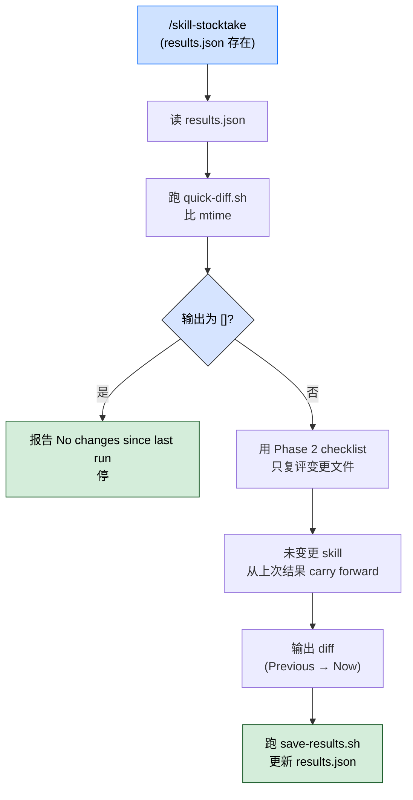
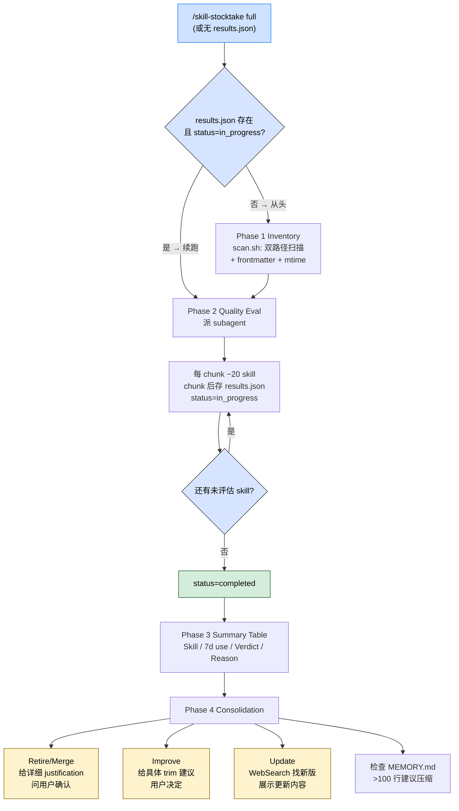

> 本 Skill 是 **ecc** 套件中的"Skill 元管理"SKILL，与 [continuous-learning-v2](/articles/ecc-continuous-learning-v2) / [search-first](/articles/ecc-search-first) 等共同构成 ECC 工具箱。完整工作流见 [ECC 持续学习 Skills 大全](/articles/ecc-workflow)。

## 一句话简介

`skill-stocktake` 是 ECC 给本机 / 项目 Claude Skills 做定期审计的 SKILL：`/skill-stocktake` slash command 跑两种模式——**Quick Scan**（5-10 分钟，只复评 `results.json` 之后变更过的 skill）和 **Full Stocktake**（20-30 分钟，4 阶段全量评估）；用 general-purpose subagent 按 20 个 / chunk 批处理 + 中途存 `results.json` 支持 resume，最终给每个 skill 出 Keep / Improve / Update / Retire / Merge into [X] 五选一裁定。

## 它解决什么问题

不同于"装一次 skill 就永远不管它"的累积式开发，本 Skill 解决的是 Claude Code 长期使用后"~/.claude/skills/ 里堆了 50+ skill，谁好谁差不知道、有没有重复 / 过期 / 没在用、CLAUDE.md 和 MEMORY.md 跟 skills 之间是否重复"的系统性混乱问题。SKILL.md 描述段提到适用场景，结合 Quick Scan / Full Stocktake 触发条件覆盖：

- **当你装了一堆 skill 几个月、不知道哪些还在用、哪些已经过时的时候**——SKILL.md "Phase 2" 段给 4 维评估（Actionability / Scope fit / Uniqueness / Currency），"Currency" 维度直接说"technical references work in the current environment"，过期的 skill 会被标 Update / Retire。
- **当你怀疑两个 skill 在做同样的事、想识别可以 merge 的的时候**——SKILL.md "Phase 2 Checklist" 第 1 条明示"Content overlap with other skills checked"；裁定里专门有 `Merge into [X]` 一类，merge 时还要求"name the target and describe what content to integrate"。
- **当你不确定 MEMORY.md / CLAUDE.md 和某个 skill 是否在做重复工作的时候**——SKILL.md "Phase 2 Checklist" 第 2 条"Overlap with MEMORY.md / CLAUDE.md checked"；"Uniqueness" 维度也强调"value not replaceable by MEMORY.md / CLAUDE.md / another skill"。
- **当你刚改了 2-3 个 skill、想只复评这几个而不是把全部 80 个重跑一遍的时候**——SKILL.md "Quick Scan Flow" 段明示靠 `quick-diff.sh` 跟 `results.json` 对比 mtimes，只评 diff，5-10 分钟搞定，没变的从上次结果 carry forward。
- **当你的 skills 里有"references to outdated CLI flags / 失效 API"想批量检测的时候**——SKILL.md "Phase 2" 段明示"Freshness of technical references verified (use WebSearch if tool names / CLI flags / APIs are present)"；判 Update 时要用 WebSearch 实查。
- **当你想给 80 个 skill 跑批量评估、又怕 subagent context 爆掉的时候**——SKILL.md "Phase 2 Chunk guidance" 段明示"Process ~20 skills per subagent invocation to keep context manageable"，并支持中途存 `status: "in_progress"` resume。
- **当你只想审 global 全局 skills、不带项目级的时候**——SKILL.md "Scope" 段明示"At the start of Phase 1, the command explicitly lists which paths were found and scanned"；若 `{cwd}/.claude/skills/` 不存在，只跑全局。
- **当你做完审计要 Retire 或 Merge、希望 reason 字段不是含糊的"重复了"而是带具体证据的时候**——SKILL.md "Reason quality requirements" 段对每个 verdict 都给了 Bad / Good 对照例，强制 reason 自包含、可决策。

## 安装方法

SKILL.md 没给独立 plugin 安装命令，本 Skill 通过 `ecc` plugin 分发，仓库主页：<https://github.com/affaan-m/ecc>。装好后用 slash command `/skill-stocktake` 触发：

```bash
# 默认（有 results.json → Quick Scan；没有 → Full Stocktake）
/skill-stocktake

# 强制 Full Stocktake
/skill-stocktake full
```

依赖的脚本（同 plugin 提供）：

- `~/.claude/skills/skill-stocktake/scripts/quick-diff.sh` — 比 mtime 找变更
- `~/.claude/skills/skill-stocktake/scripts/scan.sh` — 枚举 skill + 抽 frontmatter + 收 mtime
- `~/.claude/skills/skill-stocktake/scripts/save-results.sh` — 保存评估结果

要审项目级 skill，从项目根跑：

```bash
cd ~/path/to/my-project
/skill-stocktake
```

## 核心机制 / 流程

### Scope（审计范围）

| Path | 描述 |
|------|------|
| `~/.claude/skills/` | 全局 skill（所有项目共享） |
| `{cwd}/.claude/skills/` | 项目级 skill（目录存在时才扫） |

> SKILL.md 明示：Phase 1 开始时**显式列出**实际扫了哪些路径。

### Modes（两种模式）

| Mode | 触发 | 时长 |
|------|------|------|
| Quick Scan | `results.json` 存在（默认） | 5–10 分钟 |
| Full Stocktake | `results.json` 不存在 / 显式 `/skill-stocktake full` | 20–30 分钟 |

> 结果缓存：`~/.claude/skills/skill-stocktake/results.json`

### Quick Scan Flow（增量复评）



各步对应命令（按图节点）：

- 读：`~/.claude/skills/skill-stocktake/results.json`
- diff：`bash ~/.claude/skills/skill-stocktake/scripts/quick-diff.sh ~/.claude/skills/skill-stocktake/results.json`（项目目录自动从 `$PWD/.claude/skills` 识别）
- save：`bash ~/.claude/skills/skill-stocktake/scripts/save-results.sh ~/.claude/skills/skill-stocktake/results.json <<< "$EVAL_RESULTS"`

### Full Stocktake 4 阶段

4 阶段顺序流（含 chunk 循环 + Resume 分支 + Phase 4 用户确认门）：



#### Phase 1 — Inventory（清点）

跑 `bash ~/.claude/skills/skill-stocktake/scripts/scan.sh`，输出：

```text
Scanning:
  ✓ ~/.claude/skills/         (17 files)
  ✗ {cwd}/.claude/skills/    (not found — global skills only)
```

外加 inventory 表（Skill / 7d use / 30d use / Description）。

#### Phase 2 — Quality Evaluation（subagent 批评）

派 general-purpose subagent 跑：

```text
Agent(
  subagent_type="general-purpose",
  prompt="
Evaluate the following skill inventory against the checklist.

[INVENTORY]

[CHECKLIST]

Return JSON for each skill:
{ \"verdict\": \"Keep\"|\"Improve\"|\"Update\"|\"Retire\"|\"Merge into [X]\", \"reason\": \"...\" }
"
)
```

**Chunk guidance**：每次 subagent 处理 ~20 个 skill；每 chunk 后存 intermediate 到 `results.json`（`status: "in_progress"`）。全部完成后置 `status: "completed"`。

**Resume detection**：启动时若发现 `status: "in_progress"`，从第一个未评估的 skill 续跑。

**Checklist 4 条**：

```text
- [ ] Content overlap with other skills checked
- [ ] Overlap with MEMORY.md / CLAUDE.md checked
- [ ] Freshness of technical references verified (use WebSearch if tool names / CLI flags / APIs are present)
- [ ] Usage frequency considered
```

**Verdict 5 类**：

| Verdict | 含义 |
|---------|------|
| Keep | 有用且还新 |
| Improve | 值得留，但要具体改 |
| Update | 引用的技术过时（用 WebSearch 验证） |
| Retire | 质量低 / 过时 / 投产比差 |
| Merge into [X] | 与某 skill 大幅重叠；指名 merge 目标 |

**4 个 holistic 维度**（AI 综合判断，非数值打分）：

- **Actionability**：有代码 / 命令 / 步骤让人能立即行动
- **Scope fit**：name / trigger / 内容对齐，不过宽不过窄
- **Uniqueness**：价值不能被 MEMORY.md / CLAUDE.md / 另一 skill 替代
- **Currency**：技术引用在当前环境可用

**Reason 质量要求**——`reason` 必须自包含、可决策。SKILL.md 对每类 verdict 都给了 Bad / Good 对照：

- **Retire**：必须说 (1) 发现什么具体缺陷，(2) 同样需求由什么覆盖
  - Bad：`"Superseded"`
  - Good：`"disable-model-invocation: true already set; superseded by continuous-learning-v2 which covers all the same patterns plus confidence scoring. No unique content remains."`
- **Merge**：必须指名 target，说明要整合什么内容
  - Bad：`"Overlaps with X"`
  - Good：`"42-line thin content; Step 4 of chatlog-to-article already covers the same workflow. Integrate the 'article angle' tip as a note in that skill."`
- **Improve**：说具体改哪、为什么（章节 / 动作 / 目标行数）
  - Bad：`"Too long"`
  - Good：`"276 lines; Section 'Framework Comparison' (L80–140) duplicates ai-era-architecture-principles; delete it to reach ~150 lines."`
- **Keep**（Quick Scan 里 mtime-only 变更时）：重申原本判 Keep 的理由，不写 "Unchanged"
  - Bad：`"Unchanged"`
  - Good：`"mtime updated but content unchanged. Unique Python reference explicitly imported by rules/python/; no overlap found."`

#### Phase 3 — Summary Table

```text
| Skill | 7d use | Verdict | Reason |
|-------|--------|---------|--------|
```

#### Phase 4 — Consolidation（决策落地）

四类裁定的处理路径已在 4 阶段流程图右侧列出，每类的具体要求：

- **Retire / Merge**：逐文件给详细 justification 再让用户确认
   - 发现的具体问题（重叠 / 过时 / 失效引用）
   - 替代方案（Retire：哪个现有 skill / rule；Merge：目标文件 + 要整合的内容）
   - 移除影响（依赖 skill / MEMORY.md 引用 / workflow）
- **Improve**：给具体建议 + 理由（如"trim 430→200 lines because sections X/Y duplicate python-patterns"），用户决定是否执行
- **Update**：展示更新后内容 + 验证来源
- **MEMORY.md** 检查：行数 > 100 时建议压缩

### Results File Schema

`~/.claude/skills/skill-stocktake/results.json`：

```json
{
  "evaluated_at": "2026-02-21T10:00:00Z",
  "mode": "full",
  "batch_progress": {
    "total": 80,
    "evaluated": 80,
    "status": "completed"
  },
  "skills": {
    "skill-name": {
      "path": "~/.claude/skills/skill-name/SKILL.md",
      "verdict": "Keep",
      "reason": "Concrete, actionable, unique value for X workflow",
      "mtime": "2026-01-15T08:30:00Z"
    }
  }
}
```

> SKILL.md 明示：`evaluated_at` **必须**是评估完成的实际 UTC 时间。用 `date -u +%Y-%m-%dT%H:%M:%SZ` 获取；**不要**用 `T00:00:00Z` 这种 date-only 近似。

## 实战 demo

### Scenario A：第一次跑（Full Stocktake）

```text
$ /skill-stocktake

Phase 1 - Inventory:
Scanning:
  ✓ ~/.claude/skills/         (17 files)
  ✗ /Users/me/project/.claude/skills/    (not found — global skills only)

[inventory table with 17 rows]

Phase 2 - Quality Evaluation:
Spawning subagent (chunk 1/1, 17 skills)...
[subagent returns 17 verdicts]
Saved to results.json (status: "completed")

Phase 3 - Summary:
| Skill | 7d use | Verdict | Reason |
| skill-A | 12 | Keep | ... |
| skill-B | 0 | Retire | superseded by continuous-learning-v2... |
| skill-C | 5 | Merge into skill-A | 42-line thin content... |
...

Phase 4 - Consolidation:
[For each Retire/Merge/Improve, request user confirmation]
```

### Scenario B：3 天后再跑（Quick Scan）

```text
$ /skill-stocktake

Reading ~/.claude/skills/skill-stocktake/results.json...
Running quick-diff.sh...
Changed files: ["skill-A/SKILL.md", "skill-D/SKILL.md"]

Re-evaluating 2 skills with Phase 2 checklist...
[subagent returns 2 new verdicts]
Carry forward unchanged 15 skills from previous results.

Diff output:
| Skill | Previous | Now | Reason |
| skill-A | Keep | Improve | Added 200 lines that overlap with skill-B... |
| skill-D | Improve | Keep | Successfully trimmed to 180 lines as suggested |

Saved updated results.json.
```

## 与其他官方 Skills 的搭配建议

SKILL.md 未列 "Integration" 或 "Related" 章节明示 sibling 协作（仅在 "Notes" 段说"Evaluation is blind"）。下列搭配关系基于 yaml `sibling_skills` 字段 + SKILL.md "Phase 2 Reason quality" 段引用的合理推断：

- [`continuous-learning-v2`](/articles/ecc-continuous-learning-v2) — **源 SKILL.md Phase 2 Good Reason 示例直接命名引用**："superseded by continuous-learning-v2 which covers all the same patterns plus confidence scoring"；两者协同：observer 不断产 instinct → stocktake 定期评 / 清
- [`eval-harness`](/articles/ecc-eval-harness) — 推荐用法：把"skill 在 capability eval 上表现"作为 stocktake "Currency" / "Actionability" 维度的客观证据
- [`strategic-compact`](/articles/ecc-strategic-compact) — 推荐用法：subagent 跑 Phase 2 期间 / 之后 compact，避免审计 80 个 skill 后 context 被海量 SKILL.md 内容占满
- [`search-first`](/articles/ecc-search-first) — 推荐用法：发现 skill 引用过时工具时，用 search-first 找当前替代方案再给 Update 建议

> 上述协作除 continuous-learning-v2 是 SKILL.md 直接引用外，其余均为推荐做法（非源 SKILL.md 明示）。

## 常见坑 + 注意事项

按 SKILL.md "Notes" + "Reason quality" + "Phase 4" 提炼：

1. **审计是 blind 的，不看出处**——SKILL.md 明示"the same checklist applies to all skills regardless of origin (ECC, self-authored, auto-extracted)"；ECC 自家的 skill 也可能被 Retire
2. **Archive / delete 永远要用户确认**——SKILL.md "Notes" 明示，subagent 不能自作主张删
3. **reason 不能写"Unchanged" / "Superseded"**——SKILL.md 给的 Bad 例就是这两个；必须自包含、可决策
4. **Update 类 verdict 必须用 WebSearch**——SKILL.md "Phase 2 Checklist" 第 3 条 + Verdict 表都明示"verify with WebSearch"
5. **Chunk 20 个是上限不是建议**——超过会触 subagent context 风险；用 intermediate save + resume 处理大量 skill
6. **MEMORY.md > 100 行要压缩**——SKILL.md "Phase 4" 第 4 步明示，stocktake 同时帮你 watch MEMORY.md 膨胀
7. **`evaluated_at` 不能用 date-only**——SKILL.md 明示，必须 `date -u +%Y-%m-%dT%H:%M:%SZ` 取真实 UTC 时间
8. **Quick Scan 全没变也要报告**——SKILL.md Quick Scan Flow 第 3 步明示输出 `[]` 时要报 "No changes since last run." 而不是默默退出

## 适合人群

**适合：**

- ~/.claude/skills 已经堆了 20+ skill、想做一次大扫除的重度 Claude Code 用户
- 给团队定 "skill 质量门控" 工程规范的 tech lead
- 在跑 ECC 持续学习套件、需要配套元管理工具的 ecc plugin 用户
- 想用 results.json 跟踪 skill 健康度趋势的 metrics-driven 开发者

**不适合：**

- 只装了 3-5 个 skill 的新手——审计开销大于价值
- 不接受 subagent 抽象的人——Phase 2 强依赖 general-purpose subagent
- 没安装 ecc plugin（缺 quick-diff.sh / scan.sh / save-results.sh 三脚本）的用户
- 不愿意手动 confirm Retire / Merge 的"全自动派"——SKILL.md 明示 archive/delete 必须人确认

---

本文基于 <https://github.com/affaan-m/ecc> 由 AI（claude-opus-4-7）辅助生成中文教程，原作者署名 affaan-m，许可证 MIT。

<!-- self-check
本文中提到的命令 / 文件 / URL 清单：
- `/skill-stocktake` / `/skill-stocktake full` slash command — 源文件 "Modes" 段明示
- `~/.claude/skills/` + `{cwd}/.claude/skills/` 双路径 — 源文件 "Scope" 段明示
- `~/.claude/skills/skill-stocktake/results.json` 缓存路径 — 源文件 "Modes" 段明示
- `bash ~/.claude/skills/skill-stocktake/scripts/quick-diff.sh ~/.claude/skills/skill-stocktake/results.json` — 源文件 "Quick Scan Flow" 段明示
- `bash ~/.claude/skills/skill-stocktake/scripts/scan.sh` — 源文件 "Phase 1 Inventory" 段明示
- `bash ~/.claude/skills/skill-stocktake/scripts/save-results.sh` — 源文件 "Quick Scan Flow" 段明示
- Phase 1 Scanning ✓/✗ 输出格式 — 源文件 "Phase 1 Inventory" 段原文照抄
- Phase 2 Agent(subagent_type="general-purpose", prompt=...) 模板 — 源文件 "Phase 2" 段原文照抄
- Chunk guidance ~20 skills / chunk + status "in_progress" resume — 源文件 "Phase 2 Chunk guidance / Resume detection" 段明示
- Phase 2 Checklist 4 条 — 源文件原文
- Verdict 5 类 (Keep / Improve / Update / Retire / Merge) — 源文件 "Verdict criteria" 段原文照抄
- 4 holistic 维度 (Actionability / Scope fit / Uniqueness / Currency) — 源文件 "Phase 2 Guiding dimensions" 段原文照抄
- Reason quality Bad / Good 对照 4 组 — 源文件 "Reason quality requirements" 段原文照抄
- Phase 4 Consolidation 4 步 — 源文件 "Phase 4 Consolidation" 段原文照抄
- results.json schema (evaluated_at / mode / batch_progress / skills) — 源文件 "Results File Schema" 段原文照抄
- `date -u +%Y-%m-%dT%H:%M:%SZ` 取 UTC — 源文件 "Results File Schema" 段明示
- Notes 三条 (blind eval / confirm before delete / no origin branching) — 源文件 "Notes" 段明示

场景章节支撑：
- 场景 1 "skill 堆了不知谁好谁差" — 源文件 "Phase 2 Currency" 维度直接支撑
- 场景 2 "怀疑两 skill 在做同事" — 源文件 Checklist 第 1 条 + Merge verdict 直接支撑
- 场景 3 "MEMORY.md/CLAUDE.md 与 skill 重复" — 源文件 Checklist 第 2 条 + Uniqueness 维度直接支撑
- 场景 4 "只复评变更几个" — 源文件 "Quick Scan Flow" 段直接支撑
- 场景 5 "过期 CLI flags / API 批量检测" — 源文件 Checklist 第 3 条 + Update verdict 直接支撑
- 场景 6 "80 skill subagent context 爆掉" — 源文件 "Chunk guidance" 段直接支撑
- 场景 7 "只审 global 不带项目" — 源文件 "Scope" + Phase 1 Scanning 输出直接支撑
- 场景 8 "reason 要带证据" — 源文件 "Reason quality requirements" 段直接支撑

图 / 代码块处理：
- 源文件 markdown 表格 Scope / Modes / Verdict criteria — 全部按规则保留结构
- 源文件 bash 命令 — 全部原样
- 源文件 Agent 模板 / Checklist / Phase 1 Scanning text block / JSON schema — 全部原样
- 实战 demo 中 Scenario A / Scenario B 输出为按 SKILL.md 4 阶段范式串联的演示文本，使用合理示例数字
- 新增 mermaid #1：Quick Scan Flow 7 步（含 "[] → 报告 No changes 停" 决策菱形）
- 新增 mermaid #2：Full Stocktake 4 阶段含 chunk 循环 + Resume detection 分支 + Phase 4 4 类裁定 fan-out
- 已检查全文所有编号列表 / "first X then Y" / "phase 1→2→3" 表达：Quick Scan Flow 7 步 + Full Stocktake 4 阶段已转 mermaid；Phase 4 文字列表被流程图右侧节点覆盖，剩余 4 项作为"裁定要求"清单保留；Checklist 4 条 / Verdict 5 类 / 常见坑 8 条等属"非流程"清单或源文件原文 prompt，按规则保留

依赖关系（plugin-skill 必填）：
- 兄弟 continuous-learning-v2 — 源文件 "Phase 2 Reason quality requirements - Retire Good example" 直接命名引用
- 兄弟 eval-harness / strategic-compact / search-first 协作 — 文中已明确标注"非源 SKILL.md 明示，属推荐做法"

可疑项：
- License：batch yaml 给 MIT，SKILL.md frontmatter 无 license 字段，按 yaml 取值。
- 实战 demo 中 17 files / chunk 1/1 / 17 verdicts 等具体数字为示例值；Scenario A 全 Phase 演示 + Scenario B Quick Scan 流程基于 SKILL.md 描述自然延展，非源文件实际 case。
-->
