> 本 Skill 是 **ecc** 套件中的"战略性 context 压缩"SKILL，与 [continuous-learning-v2](/articles/ecc-continuous-learning-v2) / [iterative-retrieval](/articles/ecc-iterative-retrieval) 等共同构成 ECC 工具箱。完整工作流见 [ECC 持续学习 Skills 大全](/articles/ecc-workflow)。

## 一句话简介

`strategic-compact` 是 ECC 的 context 压缩节奏 SKILL：用 `suggest-compact.js` PreToolUse hook 跟踪 Edit / Write 工具调用次数，默认 50 次后提醒手动 `/compact`、之后每 25 次再提醒一次。配套 Phase Transition 决策表告诉你该不该压（Research→Plan ✅ / Mid-implementation ❌），Persists/Lost 表告诉你压完什么会留下（CLAUDE.md、TodoWrite、memory 文件、git state、磁盘文件保留；中间推理、文件内容、对话上下文丢失）。

## 它解决什么问题

不同于"context 满了 Claude Code 自动 compact"的被动模式，本 Skill 解决的是 auto-compaction 在"任意时机"触发，常常正好打断关键多步操作、丢掉宝贵中间状态的系统性问题。SKILL.md "When to Activate" 段列了触发条件，覆盖以下场景：

- **当你跑了一个长 session、context 接近 200K+ token、明显感觉响应变慢的时候**——SKILL.md "When to Activate" 第 1 条明示"Running long sessions that approach context limits (200K+ tokens)"；通过 hook 在固定工具调用数后提醒，比等"突然慢下来"主动得多。
- **当你做的是多 phase 任务（research → plan → implement → test），希望在 phase 之间清掉无用上下文的时候**——SKILL.md "Why Strategic Compaction?" 段明示"After exploration, before execution — Compact research context, keep implementation plan / After completing a milestone — Fresh start for next phase / Before major context shifts — Clear exploration context before different task"。
- **当你被 auto-compaction 在 mid-task 截断过、丢了关键变量名 / 文件路径 / 部分状态、不得不重做的时候**——SKILL.md "Compaction Decision Guide" 表里 Mid-implementation 一栏明示"No / Losing variable names, file paths, and partial state is costly"，本 Skill 教你避开这个陷阱。
- **当你试过几种实现都失败、想清掉死路推理再开新方向的时候**——SKILL.md "Best Practices" 第 2 条"Compact after debugging — Clear error-resolution context before continuing"+ Decision Guide 表 "After a failed approach: Yes — Clear the dead-end reasoning before trying a new approach"。
- **当你在同一 session 内频繁切换无关任务（早上修 auth bug、下午加分析图表）、每次切换前怕新任务受旧上下文污染的时候**——SKILL.md "When to Activate" 第 3 条"Switching between unrelated tasks within the same session"。
- **当你不知道 compact 完到底什么会留下、不敢压怕丢东西的时候**——SKILL.md "What Survives Compaction" 段给了 Persists / Lost 双栏表：CLAUDE.md / TodoWrite / `~/.claude/memory/` / git 状态 / 磁盘文件**会留**，中间推理 / 已读文件内容 / 多步对话上下文 / 口头偏好**会丢**。
- **当你的 CLAUDE.md / project 设置里有大量重复指令、想优化 baseline context 占用的时候**——SKILL.md "Token Optimization Patterns" 段教 Trigger-Table Lazy Loading（baseline 降 50%+）+ Context Composition Awareness（监控 4 类来源）+ Duplicate Instruction Detection。

## 安装方法

SKILL.md 没给独立 plugin 安装命令，本 Skill 通过 `ecc` plugin 分发，仓库主页：<https://github.com/affaan-m/ecc>。

核心组件是 `suggest-compact.js` 这个 PreToolUse hook。在 `~/.claude/settings.json` 加：

```json
{
  "hooks": {
    "PreToolUse": [
      {
        "matcher": "Edit",
        "hooks": [{ "type": "command", "command": "node ~/.claude/scripts/hooks/suggest-compact.js" }]
      },
      {
        "matcher": "Write",
        "hooks": [{ "type": "command", "command": "node ~/.claude/scripts/hooks/suggest-compact.js" }]
      }
    ]
  }
}
```

**配置环境变量**：

- `COMPACT_THRESHOLD` — 第一次提醒前的工具调用数（默认 50）

## 核心机制 / 流程逐项解释

### Hook 行为

`suggest-compact.js` 跑在 Edit / Write 的 PreToolUse 上：

1. **Tracks tool calls** — 数 session 内工具调用次数
2. **Threshold detection** — 到阈值（默认 50）时建议 compact
3. **Periodic reminders** — 阈值后每 25 次再提醒一次

### Compaction Decision Guide（关键决策表）

SKILL.md 给的 Phase Transition 表，用来决策该不该压：

| Phase Transition | Compact? | Why |
|-----------------|----------|-----|
| Research → Planning | Yes | Research context 量大；plan 是 distilled 输出 |
| Planning → Implementation | Yes | Plan 在 TodoWrite 或文件里；腾 context 给代码 |
| Implementation → Testing | Maybe | 测试引用近期代码就留；切换焦点就压 |
| Debugging → Next feature | Yes | Debug 痕迹会污染无关工作的 context |
| Mid-implementation | No | 丢变量名 / 文件路径 / 局部状态代价高 |
| After a failed approach | Yes | 清掉死路推理再开新方向 |

### What Survives Compaction（压缩生存表）

| Persists | Lost |
|----------|------|
| CLAUDE.md instructions | 中间推理和分析 |
| TodoWrite task list | 之前读过的文件内容 |
| Memory files (`~/.claude/memory/`) | 多步对话上下文 |
| Git state (commits, branches) | 工具调用历史和计数 |
| Files on disk | 口头表述的细致偏好 |

> 决策原则：靠"文件 + 任务列表 + memory + git"能恢复的状态可以压；靠"对话推理"才能恢复的状态压前先写到磁盘。

### Best Practices（6 条）

1. **Compact after planning** — Plan finalized 进 TodoWrite 后压，从清爽 context 开干
2. **Compact after debugging** — 修完 bug 清掉 error resolution context 再继续
3. **Don't compact mid-implementation** — 保留 context 给相关后续改动
4. **Read the suggestion** — Hook 告诉你 *什么时候*，你决定 *要不要*
5. **Write before compacting** — 重要 context 先存文件 / memory 再压
6. **Use `/compact` with a summary** — 加 custom message：`/compact Focus on implementing auth middleware next`

### Token Optimization Patterns

SKILL.md 给了三类常见 token 优化：

**Trigger-Table Lazy Loading**：不在 session start 加载全 skill 内容，用 trigger table 把关键词映射到 skill 路径，只在触发时加载，baseline context 可降 50%+。

| Trigger | Skill | Load When |
|---------|-------|-----------|
| "test", "tdd", "coverage" | tdd-workflow | 用户提测试时 |
| "security", "auth", "xss" | security-review | 安全相关工作 |
| "deploy", "ci/cd" | deployment-patterns | 部署上下文 |

**Context Composition Awareness**：监控 4 类 context 来源：

- CLAUDE.md 文件 —— 永远加载，保持精简
- 已加载 skill —— 每个 1-5K tokens
- 对话历史 —— 随每次交互增长
- 工具结果 —— 文件读 / 搜索结果都很占

**Duplicate Instruction Detection**：常见重复源：

- `~/.claude/rules/` 和项目 `.claude/rules/` 里同样规则
- skill 复述 CLAUDE.md 指令
- 多个 skill 覆盖重叠 domain

**Context Optimization Tools**（SKILL.md 提及但属外部）：

- `token-optimizer` MCP — 通过内容去重做 95%+ token 缩减
- `context-mode` — context 虚拟化（315KB 到 5.4KB 的实证）

## 实战 demo：从 research 切到 plan 再到 implement

**起始**：用户让你"为 SaaS 加 SSO 支持"。Session 初始，0 次工具调用。整个 session 的 hook 触发 + 决策路径如下：

```mermaid
flowchart TD
    s0["Session 起<br/>tool calls = 0<br/>任务: SaaS 加 SSO"]:::primary
    p1["Phase 1 Research<br/>30 次 Read/Grep/WebSearch<br/>读 auth 模块 + 查 SAML/OIDC"]
    h1{"Hook 检查<br/>>=50?"}:::warn
    p2["Phase 2 Plan<br/>+25 次工具调用<br/>累计 55, 产出 TodoWrite +<br/>docs/sso-plan.md"]
    h2["Hook 触发<br/>第一次 compact 建议"]:::warn
    d1{"Decision Guide<br/>Planning → Implementation?"}:::gate
    prep["预处理：把 SAMLProvider<br/>OIDCSession 命名 + npm 包名<br/>写进 docs/sso-plan.md"]
    cmd1["执行 /compact<br/>Focus on implementing SSO<br/>middleware next"]:::ok
    p3["Phase 3 Implementation<br/>清爽 context 写<br/>src/middleware/sso.ts"]
    h3["Hook 第二次提醒<br/>累计 +25"]:::warn
    d2{"Mid-implementation?<br/>(变量名 / 路径在用中)"}:::gate
    skip["忽略本次提醒<br/>继续 implementation"]
    p4["Phase 4 失败<br/>lib A prod 不行<br/>决定换 lib B"]:::warn
    d3{"After failed approach?<br/>(清死路推理)"}:::gate
    write["把 lib A 失败根因<br/>写进 docs/sso-plan.md"]
    cmd2["执行 /compact<br/>Switching from lib A to lib B"]:::ok
    next["从清爽 context<br/>开 lib B 实现"]:::ok

    s0 --> p1 --> h1
    h1 -->|"否，未提醒"| p2 --> h2 --> d1
    d1 -->|"Yes"| prep --> cmd1 --> p3 --> h3 --> d2
    d2 -->|"No"| skip --> p4 --> d3
    d3 -->|"Yes"| write --> cmd2 --> next

    classDef ok fill:#d4edda,stroke:#155724,color:#000
    classDef warn fill:#fff3cd,stroke:#856404,color:#000
    classDef primary fill:#cfe2ff,stroke:#0d6efd,color:#000
    classDef gate fill:#d6e4ff,stroke:#333,color:#000
```



> 说明：实线 = Claude 自主推进步骤，菱形 = 按 Decision Guide / Persists-Lost 表做的判断分叉，warn 色 = hook 自动触发或失败信号。两次 compact 命令均带 `<summary>` message（按 Best Practices 第 6 条）。

## 与其他官方 Skills 的搭配建议

SKILL.md "Related" 段明示：

- **The Longform Guide** — Token optimization section（外部链接）
- **Memory persistence hooks** — 用来保住能跨 compaction 的 state（外部 / 通用约定）
- **`continuous-learning` skill** — "Extracts patterns before session ends"（同 plugin sibling，明示）

下列 sibling 协作关系基于 yaml `sibling_skills` 字段 + SKILL.md "Related" 段引用的合理推断：

- [`continuous-learning-v2`](/articles/ecc-continuous-learning-v2) — **源 SKILL.md 明示引用**：让 observer 在 compact 前完成 instinct 提炼，避免压完丢掉学习信号
- [`iterative-retrieval`](/articles/ecc-iterative-retrieval) — 推荐用法：每轮 retrieval 后视情况 compact，避免低 relevance 候选污染主 context
- [`verification-loop`](/articles/ecc-verification-loop) — 推荐用法：完成一次 verification、准备进下一 feature 时按 "Debugging → Next feature: Yes" 决策 compact

## 常见坑 + 注意事项

按 SKILL.md "Best Practices" + Decision Guide + Persists/Lost 表提炼：

1. **不要在 mid-implementation 压**——按表上明示"No"，丢变量名 / 路径 / 部分状态代价高
2. **压前先写文件 / memory**——口头偏好、临时变量名、reasoning 都会丢，重要的存盘
3. **Hook 是建议不是命令**——`suggest-compact.js` 告诉你 *什么时候到点*，你按 Decision Guide 自己决定 *要不要*
4. **用 summary 加 message**——`/compact <message>` 让压完后 Claude 知道下一步焦点，比裸 compact 好
5. **重复指令检测**：跨 `~/.claude/rules/` 和 `.claude/rules/` 的同名规则 + skill 复述 CLAUDE.md + 多 skill 覆盖同 domain 是 baseline 膨胀三大源
6. **token-optimizer / context-mode 是外部工具**——SKILL.md 仅提及，不在本 plugin 内；如需启用要单独装
7. **CLAUDE.md 永远加载**——保持精简最重要，大文件直接拖垮 baseline

## 适合人群

**适合：**

- 跑长 session、frequently hit context limit 的工程师 / 研究者
- 做多 phase 长任务（spec → research → plan → implement → test → ship）的全栈开发者
- 容易被 auto-compaction 在 mid-task 截断后丢状态而焦虑的用户
- 想在团队内推 "phase-aware context hygiene" 文化的 tech lead

**不适合：**

- 只跑 5-10 分钟短任务的用户—— suggest 阈值 50 都触不到
- 不接受 hook 机制（拒绝在 settings.json 加东西）的用户—— 本 Skill 核心是 hook
- 在 web UI / 不支持 hook 的环境跑 Claude—— hook 只在 Claude Code CLI 生效
- 不愿意手动判断 "该不该压" 的用户—— SKILL.md 反复强调 "Hook tells you when, you decide if"，不接受这种 hybrid 控制就别用

---

本文基于 <https://github.com/affaan-m/ecc> 由 AI（claude-opus-4-7）辅助生成中文教程，原作者署名 affaan-m，许可证 MIT。

<!-- self-check
本文中提到的命令 / 文件 / URL 清单：
- `suggest-compact.js` 路径 `~/.claude/scripts/hooks/suggest-compact.js` — 源文件 "Hook Setup" 段明示
- PreToolUse matcher Edit / Write 配置 — 源文件 "Hook Setup" 段明示
- `COMPACT_THRESHOLD` 环境变量 + 默认 50 + 之后每 25 次 — 源文件 "Configuration" + "How It Works" 段明示
- Compaction Decision Guide 6 行表 — 源文件同名段明示
- What Survives Compaction Persists/Lost 表 — 源文件同名段明示
- Best Practices 6 条 — 源文件同名段明示
- Trigger-Table Lazy Loading 例表 — 源文件 "Token Optimization Patterns" 段明示
- Context Composition Awareness 4 类 — 源文件同段明示
- Duplicate Instruction Detection 3 类源 — 源文件同段明示
- `token-optimizer` MCP / `context-mode` 工具 — 源文件 "Context Optimization Tools" 段明示
- `/compact <summary>` 用法 — 源文件 Best Practices 第 6 条明示
- Related 段三条 (Longform Guide / Memory persistence hooks / continuous-learning) — 源文件 "Related" 段明示

场景章节支撑：
- 场景 1 "长 session 200K+ token" — 源文件 "When to Activate" 第 1 条直接支撑
- 场景 2 "phase 切换清上下文" — 源文件 "Why Strategic Compaction?" 段直接支撑
- 场景 3 "mid-task auto-compaction 丢状态" — 源文件 Decision Guide "Mid-implementation: No" 行直接支撑
- 场景 4 "失败方案后清死路" — 源文件 Decision Guide "After a failed approach: Yes" 行 + Best Practices 第 2 条支撑
- 场景 5 "同 session 切无关任务" — 源文件 "When to Activate" 第 3 条直接支撑
- 场景 6 "不知道压完什么留下" — 源文件 "What Survives Compaction" 段直接支撑
- 场景 7 "重复指令优化 baseline" — 源文件 "Token Optimization Patterns" 段直接支撑

图 / 代码块处理：
- 源文件 json hook 配置 — 完整保留
- 源文件 markdown 表格（Decision Guide / Persists-Lost / Trigger-Table）— 全部按规则保留结构
- 源文件无 dot 流程图
- 实战 demo 中 "/compact Focus on..." message 用法引用源文件 Best Practices 第 6 条原文
- 新增 mermaid：实战 demo 完整 session 路径（Research → Plan → Implementation → Failed → Switch lib B），含 3 个 Decision Guide 决策菱形 + 2 次 hook warn 节点 + 2 次 /compact 执行节点
- 已检查全文所有编号列表 / "first X then Y" / "phase 1→2→3" 表达：实战 demo 4 阶段流程已转 mermaid；Hook 行为 3 步 / Best Practices 6 条 / 常见坑等属"非流程"清单或单点行为描述，按规则保留

依赖关系（plugin-skill 必填）：
- 兄弟 continuous-learning skill — 源文件 "Related" 段明示
- 兄弟 Memory persistence hooks / Longform Guide — 源文件 "Related" 段明示（属外部）
- 兄弟 iterative-retrieval / verification-loop — 文中已明确标注"非源 SKILL.md 明示，属推荐做法"

可疑项：
- License：batch yaml 给 MIT，SKILL.md frontmatter 无 license 字段，按 yaml 取值。
- 实战 demo "SSO 实现"是按 SKILL.md Decision Guide / Best Practices 的端到端演示，非源文件实际 case；具体工具调用数（30 / 25 / 55）为示例数字。
- 每个 skill 1-5K tokens 引自源文件 "Context Composition Awareness" 段原文（"Each skill adds 1-5K tokens"），并非推测。
-->
