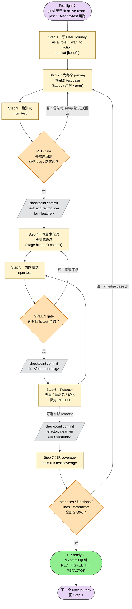

> 本 Skill 是 **ecc** 套件中的"测试驱动开发"强约束 SKILL，与 [continuous-learning-v2](/articles/ecc-continuous-learning-v2) / [security-review](/articles/ecc-security-review) / [verification-loop](/articles/ecc-verification-loop) / [eval-harness](/articles/ecc-eval-harness) 等共同构成 ECC 的"持续学习"工具箱。完整工作流见 [ECC 持续学习 Skills 大全](/articles/ecc-workflow)。

## 一句话简介

`tdd-workflow` 是 ECC 的 TDD 强制流程 SKILL：写新功能 / 修 bug / 重构时**必须**先写测试，按 RED → 验证 RED → checkpoint commit → minimal fix → GREEN → checkpoint commit → refactor → checkpoint commit 的 7 步走，目标覆盖率 80%（branches / functions / lines / statements 四项均 ≥ 80），覆盖 unit / integration / Playwright E2E 三层，并把 RED gate 的"编译 + 执行 + 失败原因"判据写得很硬。

## 它解决什么问题

不同于"先写代码后补测试"的常见做法，本 Skill 解决的是 Claude 在被要求 TDD 时"写了测试但没跑 / 跑了但没失败 / 失败原因不是业务 bug / Git 里看不出哪个 commit 对应 RED 哪个对应 GREEN"的系统性弱化问题。SKILL.md "When to Activate" 段列了触发条件，覆盖以下场景：

- **当你要新增一个 API endpoint、又怕忘了测 happy path 之外的 edge case 的时候**——SKILL.md "Coverage Requirements" 段明示"All edge cases covered / Error scenarios tested / Boundary conditions verified"；"API Integration Test Pattern"段直接给出"成功 200 / 参数错误 400 / 数据库错误"三段式样板。
- **当你修一个 bug、需要先写一个能复现它的失败测试、但又不知道"什么样的失败才算合格 RED"的时候**——SKILL.md "Step 3" 段对 RED 给了两条判据：**Runtime RED**（target 编译成功 + 新测被执行 + 结果 RED）或 **Compile-time RED**（新测引用 buggy 代码路径，编译失败本身就是 RED 信号），且明示"A test that was only written but not compiled and executed does not count as RED."
- **当你跑 TDD 但不清楚每个阶段要不要 commit、commit message 怎么写的时候**——SKILL.md "Git Checkpoints" 段给出推荐紧凑流：1 commit for RED reproducer (`test: add reproducer for <feature>`) + 1 commit for minimal fix (`fix: <feature or bug>`) + 1 optional refactor commit (`refactor: clean up after <feature>`)，且要求**验证每个 checkpoint commit 都在当前 active branch 上、属于当前任务序列**。
- **当你不确定一段代码该用 unit / integration / E2E 哪一层测的时候**——SKILL.md "Test Types" 段直接分了三类：单元（pure functions / utilities / component logic）/ 集成（API endpoints / 数据库 / 服务交互）/ E2E（关键用户流 / 完整 workflow / 浏览器自动化）。
- **当你写了测试发现测试用例之间互相依赖、删除一个其他都崩的时候**——SKILL.md "Common Testing Mistakes to Avoid" 段明示反模式：测内部 state / 用脆弱的 CSS class selector / 测试无隔离；并给出正例：测用户可见行为 / 用 semantic selector (`button:has-text("Submit")` 或 `data-testid`) / 每个测试独立建数据。
- **当你设了 CI 但希望 PR 必须达 80% 覆盖才能合的时候**——SKILL.md "Test Coverage Verification" 段给出 jest 的 `coverageThresholds.global` 四项 80% 配置 + CI 的 `npm test -- --coverage` + codecov upload action 模板。

## 安装方法

SKILL.md 没给独立 plugin 安装命令，本 Skill 通过 `ecc` plugin 分发，仓库主页：<https://github.com/affaan-m/ecc>。激活方式按 ECC 的 plugin 约定：装好 ecc plugin 后，在写新功能 / 修 bug / refactor 时由 description 触发关键词自动加载。

激活后 SKILL.md 描述的强制流程会接管 Claude 的开发节奏。配套 npm / pytest 等工具需在项目 package.json / requirements 里自行准备：

```bash
# JS/TS 项目
npm install --save-dev jest @testing-library/react @playwright/test
npm run test
npm run test:coverage

# Python 项目按 pytest / coverage.py 自行装
```

## 核心命令 / 流程逐项解释

### 三大核心原则

1. **Tests BEFORE Code** —— 永远先写测试，再写代码使测试通过
2. **Coverage Requirements** —— 80% 最低（unit + integration + E2E 合计），所有 edge case 覆盖
3. **Test Types** —— Unit（函数 / 组件逻辑 / 工具）/ Integration（API / DB / 外部服务）/ E2E（关键用户流，Playwright）

### Git Checkpoint 规则（关键约束）

SKILL.md 把这部分写得最硬：

- 在 Git 项目里，每个 TDD 阶段后**必须** checkpoint commit
- 工作流完成前**不要** squash / rewrite 这些 checkpoint
- commit message **必须**描述阶段 + 准确证据
- **只**算当前 active branch 上当前任务的 commit；其他分支 / 早期无关工作 / 远古历史**不算**有效 checkpoint
- 把某个 checkpoint 当成"已满足"前，必须验证它从当前 `HEAD` 可达且属于当前任务序列
- 推荐紧凑流：1 commit (RED 失败测) + 1 commit (minimal fix GREEN) + 1 commit (refactor，可选)
- 测试 commit 清晰对应 RED + 修复 commit 清晰对应 GREEN 时，**不需要**单独的 evidence-only commit

### 7 步 TDD 工作流

下面这张 mermaid 把 SKILL.md 的"User Journey → Test → RED → Implement → GREEN → Refactor → Coverage"全链路画成 flowchart，含 RED gate / GREEN gate 的失败回流箭头，呈现循环本质：



**读图三条线索：**

1. **两道 gate 是关键阀门**：RED gate 验证"失败原因是业务 bug 而非 setup 崩"，GREEN gate 验证"目标 test 真的从红变绿"；任一失败不进下一步。
2. **3 个 checkpoint commit 对应 3 个阶段**：`test:` / `fix:` / `refactor:` 的 commit message 让 reviewer 在 git log 里能 1 秒看出每个阶段对应哪段证据。
3. **循环本质**：Step 7 通过后，下一条 user journey 直接回 Step 1，整套流程是 multi-journey 的 outer loop + 每条 journey 内部 RED→GREEN→REFACTOR 的 inner loop。

#### Step 1：写 User Journey

```text
As a [role], I want to [action], so that [benefit]

Example:
As a user, I want to search for markets semantically,
so that I can find relevant markets even without exact keywords.
```

#### Step 2：为每个 journey 生成完整 test case

```typescript
describe('Semantic Search', () => {
  it('returns relevant markets for query', async () => { /* ... */ })
  it('handles empty query gracefully', async () => { /* ... */ })
  it('falls back to substring search when Redis unavailable', async () => { /* ... */ })
  it('sorts results by similarity score', async () => { /* ... */ })
})
```

#### Step 3：跑测试，应该失败（RED gate）

```bash
npm test
# Tests should fail - we haven't implemented yet
```

这一步是 mandatory 的 RED gate。改业务逻辑前必须满足以下之一：

- **Runtime RED**：target 编译成功 + 新测被执行 + 结果 RED
- **Compile-time RED**：新测引用 buggy 代码路径，编译失败本身就是 RED 信号
- 失败原因必须是**目标业务 bug / undefined behavior / 缺失实现**，**不是**无关语法错 / 测试 setup 崩 / 缺依赖 / 无关回归

> "A test that was only written but not compiled and executed does not count as RED."

RED 验证后立即 checkpoint commit：`test: add reproducer for <feature or bug>`。

#### Step 4：写最少代码让测试通过

```typescript
export async function searchMarkets(query: string) {
  // Implementation here
}
```

stage 最小修改，但**延后** commit 到 Step 5 GREEN 验证之后。

#### Step 5：再跑测试，应该通过（GREEN gate）

```bash
npm test
# Tests should now pass
```

重跑同一相关 test target，确认之前失败的现在 GREEN。只有有效 GREEN 才能进 refactor。GREEN 验证后立即 checkpoint commit：`fix: <feature or bug>`。

#### Step 6：Refactor（保持 GREEN）

去重 / 改名 / 优化性能 / 提可读性，跑测试确保仍 GREEN。refactor 完成后 checkpoint commit：`refactor: clean up after <feature or bug> implementation`。

#### Step 7：验证覆盖率

```bash
npm run test:coverage
# Verify 80%+ coverage achieved
```

```json
{
  "jest": {
    "coverageThresholds": {
      "global": {
        "branches": 80,
        "functions": 80,
        "lines": 80,
        "statements": 80
      }
    }
  }
}
```

### Test 文件组织约定

```text
src/
├── components/
│   ├── Button/
│   │   ├── Button.tsx
│   │   ├── Button.test.tsx          # Unit tests
│   │   └── Button.stories.tsx       # Storybook
│   └── MarketCard/
│       ├── MarketCard.tsx
│       └── MarketCard.test.tsx
├── app/
│   └── api/
│       └── markets/
│           ├── route.ts
│           └── route.test.ts         # Integration tests
└── e2e/
    ├── markets.spec.ts               # E2E tests
    ├── trading.spec.ts
    └── auth.spec.ts
```

### Mock 外部服务的范式

SKILL.md 给了 Supabase / Redis / OpenAI 三段 jest.mock 范式（详见源文件 "Mocking External Services" 段，本文不复制全文以避免冗余）。

## 实战 demo：给"语义搜索"加测试驱动实现

按 SKILL.md 完整 7 步，串成端到端：

**1. User journey**：

> As a user, I want to search markets semantically, so that I can find relevant markets even without exact keywords.

**2. Test case**：在 `src/lib/search.test.ts` 写 4 个 case（happy path / 空查询 / Redis 不可用回退 / 按相似度排序）。

**3. RED**：跑 `npm test -- src/lib/search.test.ts`，4 个全红，原因都是 `searchMarkets is not a function`——这是 Compile-time RED + 业务实现缺失，合格。
checkpoint：`git commit -m "test: add reproducer for semantic markets search"`。

**4. 最小实现**：写 `src/lib/search.ts` 把 4 个 case 都覆盖到，stage 但不 commit。

**5. GREEN**：再跑 `npm test -- src/lib/search.test.ts`，4 个全绿。
checkpoint：`git commit -m "fix: semantic markets search"`。

**6. Refactor**：把 Redis 调用抽到 `lib/redis.ts`、复用现有 embedding 工具；测试仍 GREEN。
checkpoint：`git commit -m "refactor: clean up after semantic markets search implementation"`。

**7. Coverage**：`npm run test:coverage` 报 branches 86% / functions 92% / lines 88% / statements 88%，全部 ≥ 80%，过关。

整个 PR 三个 commit 清晰对应 RED → GREEN → refactor，reviewer 能直接看出每个阶段证据。

## 与其他官方 Skills 的搭配建议

SKILL.md 未列 "Integration" 或 "Related" 章节明示 sibling 协作。下列搭配关系基于 yaml `sibling_skills` 字段 + 各 sibling 描述的合理推断（非源 SKILL.md 明示）：

- [`verification-loop`](/articles/ecc-verification-loop) — 推荐用法：完成 TDD 后，跑一次完整 verification（build / type / lint / tests / security / diff），把"局部 GREEN"升级为"全局 ready for PR"
- [`eval-harness`](/articles/ecc-eval-harness) — 推荐用法：定义阶段，把 user journey 转成 capability eval；TDD 完成后用 pass@3 / pass^3 衡量可靠性
- [`security-review`](/articles/ecc-security-review) — 推荐用法：涉及认证 / 用户输入 / payment 时，在 Step 4 实现期先走 security checklist 再 stage 修改
- [`continuous-learning-v2`](/articles/ecc-continuous-learning-v2) — 推荐用法：让 hook 自动学到 "TDD 时永远先验证 RED"、"checkpoint commit 必须在 active branch" 这类 instinct，沉淀成跨项目通用约定

> 上述协作均为推荐做法（非源 SKILL.md 明示），实际触发由 ECC plugin 的 description 关键词决定。

## 常见坑 + 注意事项

按 SKILL.md "Common Testing Mistakes to Avoid" + "Best Practices" 提炼：

**反模式（必避）**：

1. **测内部 state**：`expect(component.state.count).toBe(5)` ❌ → 测用户可见行为：`expect(screen.getByText('Count: 5')).toBeInTheDocument()` ✅
2. **脆弱 selector**：`await page.click('.css-class-xyz')` ❌ → 用 semantic：`button:has-text("Submit")` 或 `[data-testid="submit-button"]` ✅
3. **测试间依赖**：test A 创 user，test B 改它 ❌ → 每个测试自己 setup 数据 ✅
4. **写了测试但没跑 / 跑了但 RED 不是业务原因** ❌ → 不算合格 RED，不允许进 Step 4
5. **把其他分支的 commit 当 checkpoint 证据** ❌ → 必须从当前 HEAD 可达 + 当前任务序列

**Best Practices（10 条）**：

1. 永远 TDD（Tests First）
2. 一个测试一个 assert（单一职责）
3. 描述性测试名（说清楚测的是什么）
4. Arrange-Act-Assert（清晰结构）
5. Mock 外部依赖（隔离单元测）
6. 测 edge case（null / undefined / empty / large）
7. 测 error path（不只是 happy path）
8. 测试要快（unit test < 50ms / 个）
9. 测试后清理（不留副作用）
10. 看 coverage 报告找漏洞

**成功指标**：80%+ 覆盖 / 全 GREEN / 无 skip 或 disabled 测试 / unit test < 30s 跑完 / E2E 覆盖关键用户流 / 测试能在生产 bug 出现前抓到。

## 适合人群

**适合：**

- 想强制让 Claude 走 TDD、不再"先实现后补测试"的工程师
- review 别人的 AI 生成代码 PR 时希望看到清晰 RED → GREEN → refactor commit 序列的 reviewer
- 给团队建立 80%+ coverage 硬门控、需要标准化测试范式（unit / integration / Playwright E2E 三层）的 tech lead
- 修 bug 时想确保"先复现再修"的工程师——SKILL.md 的 RED gate 判据天然防止"猜着改"

**不适合：**

- 跑 prototype / hackathon、速度优先于正确性的场景——RED → GREEN → refactor 三个 commit 对小修改是过度
- 没有测试基建的遗留项目（连 `npm test` 命令都没接好）——本 Skill 假设 jest / vitest / pytest / Playwright 至少有一套可跑
- 完全 UI 探索、没有清晰 user journey 的设计阶段——SKILL.md 强制 Step 1 要写出 user journey，否则跑不动
- 不接受"测试是不可选的"前提的工程师——SKILL.md 结尾原话："Tests are not optional. They are the safety net..."，软化空间为零

---

本文基于 <https://github.com/affaan-m/ecc> 由 AI（claude-opus-4-7）辅助生成中文教程，原作者署名 affaan-m，许可证 MIT。

<!-- self-check
本文中提到的命令 / 文件 / URL 清单：
- `npm test` / `npm run test:coverage` / `npm run build` — 源文件 Step 3 / Step 5 / Step 7 段明示
- `npm install --save-dev jest @testing-library/react @playwright/test` — 推断自源文件 "Testing Patterns" + "E2E Test Pattern (Playwright)" 段引用的工具（属常规安装命令，非 SKILL.md 明示）
- `git commit -m "test: add reproducer for <feature>"` / `fix: <feature>` / `refactor: clean up after <feature> implementation` — 源文件 "Git Checkpoints" + Step 3/5/6 段明示
- `coverageThresholds.global { branches: 80, functions: 80, lines: 80, statements: 80 }` — 源文件 "Coverage Thresholds" 段明示
- jest mock 范式（Supabase / Redis / OpenAI）— 源文件 "Mocking External Services" 段明示
- 文件组织约定（components/<X>/<X>.test.tsx, app/api/<X>/route.test.ts, e2e/<X>.spec.ts）— 源文件 "Test File Organization" 段明示
- Playwright `page.goto / page.click / page.fill / expect.toHaveCount` API — 源文件 "E2E Test Pattern (Playwright)" 段明示
- semantic selector `button:has-text("Submit")` / `[data-testid="submit-button"]` — 源文件 "Common Testing Mistakes to Avoid → Brittle Selectors" 段明示
- codecov GitHub Action — 源文件 "Continuous Testing → CI/CD Integration" 段明示
- husky / lint-staged — 源文件未直接命名，仅给出 "Pre-Commit Hook" 段示例，文中未声称这些工具，仅引用 SKILL.md 的 `npm test && npm run lint` 流程

场景章节支撑：
- 场景 1 "新 API endpoint 覆盖 edge case" — 源文件 "Coverage Requirements" + "API Integration Test Pattern" 段直接支撑
- 场景 2 "什么样的失败才算合格 RED" — 源文件 Step 3 "Runtime RED / Compile-time RED" 判据 + "A test that was only written but not compiled and executed does not count as RED." 原文支撑
- 场景 3 "每个 TDD 阶段要不要 commit" — 源文件 "Git Checkpoints" 段直接支撑
- 场景 4 "unit / integration / E2E 哪一层" — 源文件 "Test Types" 段直接支撑
- 场景 5 "测试用例互相依赖" — 源文件 "Common Testing Mistakes to Avoid → No Test Isolation / Independent Tests" 段直接支撑
- 场景 6 "PR 必须达 80%" — 源文件 "Test Coverage Verification" + "CI/CD Integration" 段直接支撑

图 / 代码块处理：
- 源文件 typescript / bash / json / yaml / 目录树代码块 — 全部按规则保留原样
- 源文件无 dot 流程图
- 新增 1 张 mermaid（7 步 TDD 循环：Pre-flight → RED → checkpoint → GREEN → checkpoint → REFACTOR → checkpoint → Coverage → next iter，含 RED/GREEN/Coverage 三道 gate 的回流箭头）
- 实战 demo 中"semantic markets search"业务示例直接复用源文件 Step 1-2 给的 example
- 已检查全文所有编号列表 / "first X then Y" / "phase 1→2→3" 表达，均已转 mermaid 或保留源 ASCII 图

依赖关系（plugin-skill 必填）：
- 源 SKILL.md 没有 Integration / Related 章节，无 sibling 明示
- 兄弟 verification-loop / eval-harness / security-review / continuous-learning-v2 协作 — 文中已明确标注"非源 SKILL.md 明示，属推荐做法"

可疑项：
- License：batch yaml 给 MIT，SKILL.md frontmatter 无 license 字段，按 yaml 取值。
- "实战 demo" 中"semantic markets search"端到端串讲基于源文件 Step 1-2 范式延展，具体 commit message / coverage 数字为示例值，非源文件实际数据。
- npm install 一行命令为常规前置准备，源文件未明示，但属于"按源文件引用的工具反推的合理安装方式"，非 SKILL 专属指引。
-->
