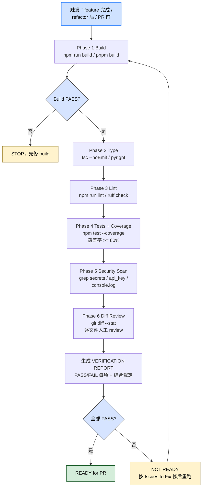
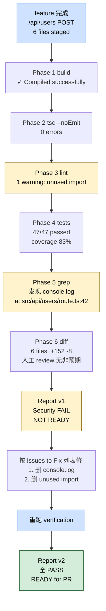

> 本 Skill 是 **ecc** 套件中的"会话收尾验证"SKILL，与 [tdd-workflow](/articles/ecc-tdd-workflow) / [security-review](/articles/ecc-security-review) / [eval-harness](/articles/ecc-eval-harness) 等共同构成 ECC 工具箱。完整工作流见 [ECC 持续学习 Skills 大全](/articles/ecc-workflow)。

## 一句话简介

`verification-loop` 是 ECC 给 Claude Code session 加的综合性收尾验证 SKILL：在 feature 完成 / 重大改动后 / PR 前 / refactor 后触发，按 Build → Type → Lint → Tests（80% coverage）→ Security Scan → Diff Review 6 个阶段顺序跑，每阶段 PASS / FAIL，最终生成 `VERIFICATION REPORT` 标注 READY / NOT READY；可在长 session 里每 15 分钟跑一次作为 continuous 模式，和 PostToolUse hook 形成"即时 + 综合"互补。

## 它解决什么问题

不同于"PostToolUse hook 每个 Edit 后跑点轻量 check"的即时反馈模式，本 Skill 解决的是 hook 只能抓单个工具调用层面的问题、抓不到"整个 feature 集成后是否还 build / 全套测试是否仍 GREEN / 改动里有没有顺手 console.log 进去"这种综合性 quality gate 的系统性问题。SKILL.md "When to Use" 段列了触发条件，覆盖以下场景：

- **当你刚写完一个 feature、改了 5 个文件，不确定有没有顺带改坏别的的时候**——SKILL.md "When to Use" 第 1 条明示"After completing a feature or significant code change"，6 阶段跑完一次就知道答案。
- **当你要发 PR、希望先在本地把所有质量门跑一遍而不是等 CI 红字打脸的时候**——SKILL.md "When to Use" 第 2 条明示"Before creating a PR"，整套 build / type / lint / tests / security / diff 跑通后再 push。
- **当你只想确认"quality gates pass"、不想自己一个一个手动跑命令的时候**——SKILL.md "When to Use" 第 3 条"When you want to ensure quality gates pass"，本 Skill 是统一入口。
- **当你做完 refactor、需要确认表面行为完全没变的时候**——SKILL.md "When to Use" 第 4 条"After refactoring"，跑 Phase 4 测试是验证 refactor 安全的标准做法。
- **当你跑一个超长 session、想每隔一段时间自动跑一次综合验证防止"积小错成大错"的时候**——SKILL.md "Continuous Mode" 段明示"For long sessions, run verification every 15 minutes or after major changes"，并给出"每完成一个 function / 每完成一个 component / 进入下一任务前"三个 mental checkpoint。
- **当你的 PostToolUse hook 抓到的是即时问题、还需要一层更深的综合 review 的时候**——SKILL.md "Integration with Hooks" 段明示"Hooks catch issues immediately; this skill provides comprehensive review"，互补关系明确。

## 安装方法

SKILL.md 没给独立 plugin 安装命令，本 Skill 通过 `ecc` plugin 分发，仓库主页：<https://github.com/affaan-m/ecc>。本 Skill 是**协议 / checklist**而不是可执行脚本，激活后由 Claude 按 6 阶段顺序跑 bash 命令并产出报告。

各阶段依赖的工具需在项目里准备：

```bash
# JS/TS 项目
npm run build              # Phase 1
npx tsc --noEmit           # Phase 2
npm run lint               # Phase 3
npm run test -- --coverage # Phase 4
git diff --stat            # Phase 6

# Python 项目
pyright .                  # Phase 2 类型检查
ruff check .               # Phase 3 lint
```

## 核心机制 / 6 阶段流程

6 阶段是**顺序门控**——Phase 1 失败必须停，后续无意义；其余 phase 失败要写进报告但不必立即终止。整体路径：



### Phase 1：Build Verification

```bash
# 检查 build 能不能过
npm run build 2>&1 | tail -20
# OR
pnpm build 2>&1 | tail -20
```

> **门控**：If build fails, STOP and fix before continuing.

Build 是最早门控——build 失败连其他阶段都没意义。

### Phase 2：Type Check

```bash
# TypeScript
npx tsc --noEmit 2>&1 | head -30

# Python
pyright . 2>&1 | head -30
```

> 报告所有 type 错；critical 的修完再继续。

### Phase 3：Lint Check

```bash
# JS/TS
npm run lint 2>&1 | head -30

# Python
ruff check . 2>&1 | head -30
```

### Phase 4：Test Suite

```bash
# 跑测试 + 覆盖率
npm run test -- --coverage 2>&1 | tail -50

# 覆盖率门槛：80% 最低
```

报告四项：

- Total tests: X
- Passed: X
- Failed: X
- Coverage: X%

### Phase 5：Security Scan

```bash
# 找硬编码 secrets
grep -rn "sk-" --include="*.ts" --include="*.js" . 2>/dev/null | head -10
grep -rn "api_key" --include="*.ts" --include="*.js" . 2>/dev/null | head -10

# 找漏的 console.log
grep -rn "console.log" --include="*.ts" --include="*.tsx" src/ 2>/dev/null | head -10
```

> 三大类目标：硬编码 secrets / 暴露 api_key / 留在生产代码里的 console.log。

### Phase 6：Diff Review

```bash
# 看改了什么
git diff --stat
git diff HEAD~1 --name-only
```

> Review 每个改动文件：是否有非预期改动 / 是否漏了错误处理 / 是否考虑了 edge case。

### Output Format（报告格式）

```text
VERIFICATION REPORT
==================

Build:     [PASS/FAIL]
Types:     [PASS/FAIL] (X errors)
Lint:      [PASS/FAIL] (X warnings)
Tests:     [PASS/FAIL] (X/Y passed, Z% coverage)
Security:  [PASS/FAIL] (X issues)
Diff:      [X files changed]

Overall:   [READY/NOT READY] for PR

Issues to Fix:
1. ...
2. ...
```

### Continuous Mode（持续模式）

长 session 里每 15 分钟或重大改动后跑一次：

```markdown
Set a mental checkpoint:
- After completing each function
- After finishing a component
- Before moving to next task

Run: /verify
```

### Integration with Hooks（与 hook 互补）

> SKILL.md 明示："Hooks catch issues immediately; this skill provides comprehensive review."

PostToolUse hook 是即时反馈，本 Skill 是综合 review；两者互补不冲突。

## 实战 demo：feature 完成后跑一次完整 verification

按 SKILL.md 6 阶段，串成端到端。实战路径（含一次"发现问题 → 修复 → 重跑"循环）：



**起始**：刚完成 `/api/users` POST endpoint 实现，改动涉及 6 个文件，stage 但未 commit。

**Phase 1 – Build**：

```bash
$ npm run build 2>&1 | tail -20
# ✓ Compiled successfully
```

**Phase 2 – Types**：

```bash
$ npx tsc --noEmit 2>&1 | head -30
# 输出空（无 type 错）
```

**Phase 3 – Lint**：

```bash
$ npm run lint 2>&1 | head -30
# warning: 'unused' is defined but never used (1 warning)
```

**Phase 4 – Tests**：

```bash
$ npm run test -- --coverage 2>&1 | tail -50
# Tests: 47 passed, 47 total
# Coverage: 83% branches / 89% functions / 88% lines / 88% statements
```

**Phase 5 – Security**：

```bash
$ grep -rn "sk-" --include="*.ts" --include="*.js" . | head -10
# 无输出
$ grep -rn "console.log" --include="*.ts" src/ | head -10
# src/api/users/route.ts:42:  console.log('debug:', user)
```

发现一个 debug `console.log` 漏在生产代码里——按 [security-review](/articles/ecc-security-review) "Sensitive Data Exposure" 应删除。

**Phase 6 – Diff Review**：

```bash
$ git diff --stat
# 6 files changed, 152 insertions(+), 8 deletions(-)
```

人工 review 改动文件，未发现非预期变更。

**最终报告**：

```text
VERIFICATION REPORT
==================

Build:     PASS
Types:     PASS (0 errors)
Lint:      PASS (1 warning)
Tests:     PASS (47/47 passed, 83% coverage)
Security:  FAIL (1 console.log in src/api/users/route.ts)
Diff:      6 files changed

Overall:   NOT READY for PR

Issues to Fix:
1. Remove debug console.log from src/api/users/route.ts:42
2. Remove unused import in <file from lint warning>
```

修完两条后再跑一遍，所有 PASS → READY。

## 与其他官方 Skills 的搭配建议

SKILL.md 未列 "Integration" 或 "Related" 章节明示 sibling 协作（仅在 "Integration with Hooks" 段提到 hook 互补）。下列搭配关系基于 yaml `sibling_skills` 字段 + 各 sibling 描述的合理推断（非源 SKILL.md 明示）：

- [`tdd-workflow`](/articles/ecc-tdd-workflow) — 推荐用法：TDD 跑完 Step 7 (Coverage) 后无缝衔接本 Skill 6 阶段，把"测试 GREEN + 80% coverage"升级为"整套质量门控 PASS"
- [`security-review`](/articles/ecc-security-review) — 推荐用法：把 17 项 pre-deployment 清单接入 Phase 5 "Security Scan"，Phase 5 不止跑 grep 还跑完整 security checklist
- [`eval-harness`](/articles/ecc-eval-harness) — 推荐用法：Phase 4 测试通过之外，再跑 capability eval 看 `pass@3` / `pass^3` 是否达发布阈值，verification 报告升级为 EDD 报告
- [`strategic-compact`](/articles/ecc-strategic-compact) — 推荐用法：Verification PASS 后按 Decision Guide "Debugging → Next feature: Yes" 决策 compact，清掉本次 session 的中间推理

> 上述协作均为推荐做法（非源 SKILL.md 明示）。

## 常见坑 + 注意事项

按 SKILL.md 各 Phase 提炼：

1. **Phase 1 build 失败必须停**——SKILL.md 明示"If build fails, STOP and fix before continuing"，硬约束
2. **Phase 4 覆盖率门槛 80%**——和 [tdd-workflow](/articles/ecc-tdd-workflow) 同一门槛；低于 80% 视为 Tests FAIL
3. **Phase 5 不是完整 security audit**——SKILL.md 只给了 grep secrets / api_key / console.log 三类，是"快速 sanity check"；完整 security 走 [security-review](/articles/ecc-security-review)
4. **Phase 6 是人肉环节**——`git diff --stat` 给的是统计，真正的 "unintended changes / missing error handling / edge cases" 检查需要 Claude 或 reviewer 逐文件看
5. **Continuous Mode 是 mental checkpoint 不是定时器**——SKILL.md "Continuous Mode" 段写的"每 15 分钟"是建议节奏，需要 Claude 自己记，没有真正的 timer 机制
6. **Hook 不能替代本 Skill**——SKILL.md "Integration with Hooks" 段明示"Hooks catch issues immediately; this skill provides comprehensive review"
7. **Output Format 报告里 "Issues to Fix" 是闭环关键**——只 PASS / FAIL 不给修复清单，工作流就断了；按报告模板列具体 actions

## 适合人群

**适合：**

- 在 PR 前希望本地跑完整 quality gate 而不是等 CI 红字打脸的工程师
- 跑长 session、做大规模改动、需要定期"健康检查"的 AI-assisted 开发者
- review 别人 AI 生成 PR 时希望看到统一格式 verification 报告的 reviewer
- 给团队建标准 "ready for PR" 判据、统一 build / type / lint / test / security 六项口径的 tech lead

**不适合：**

- 改一个 typo 或者一行小修——6 阶段对小改是过度
- 没有 build / type / lint / test 基建的项目——命令本身就跑不起来
- 不喜欢"按固定 checklist 走"的灵活派——Skill 是顺序协议，强制 Phase 1 失败必须停
- 只用 Web UI 跑 Claude 的用户——本 Skill 强依赖 bash 工具调用

---

本文基于 <https://github.com/affaan-m/ecc> 由 AI（claude-opus-4-7）辅助生成中文教程，原作者署名 affaan-m，许可证 MIT。

<!-- self-check
本文中提到的命令 / 文件 / URL 清单：
- Phase 1 `npm run build` / `pnpm build` 加 `2>&1 | tail -20` — 源文件 "Phase 1: Build Verification" 段明示
- Phase 2 `npx tsc --noEmit` / `pyright .` 加 `2>&1 | head -30` — 源文件 "Phase 2: Type Check" 段明示
- Phase 3 `npm run lint` / `ruff check .` 加 `2>&1 | head -30` — 源文件 "Phase 3: Lint Check" 段明示
- Phase 4 `npm run test -- --coverage` + 覆盖率 80% 门槛 + 4 项报告 — 源文件 "Phase 4: Test Suite" 段明示
- Phase 5 grep `"sk-"` / `"api_key"` / `"console.log"` — 源文件 "Phase 5: Security Scan" 段明示
- Phase 6 `git diff --stat` / `git diff HEAD~1 --name-only` + 3 项 review 维度 — 源文件 "Phase 6: Diff Review" 段明示
- VERIFICATION REPORT 模板 - PASS/FAIL/READY/NOT READY 全套字段 — 源文件 "Output Format" 段原文照抄
- Continuous Mode 每 15 分钟 + 3 个 mental checkpoint + `/verify` — 源文件 "Continuous Mode" 段明示
- "Hooks catch issues immediately; this skill provides comprehensive review" — 源文件 "Integration with Hooks" 段原文

场景章节支撑：
- 场景 1 "feature 完成不确定有没有改坏别的" — 源文件 "When to Use" 第 1 条直接支撑
- 场景 2 "发 PR 前本地跑质量门" — 源文件 "When to Use" 第 2 条直接支撑
- 场景 3 "确认 quality gates pass" — 源文件 "When to Use" 第 3 条直接支撑
- 场景 4 "refactor 后确认行为没变" — 源文件 "When to Use" 第 4 条直接支撑
- 场景 5 "长 session 每 15 分钟跑一次" — 源文件 "Continuous Mode" 段直接支撑
- 场景 6 "hook 即时 + 本 Skill 综合" — 源文件 "Integration with Hooks" 段直接支撑

图 / 代码块处理：
- 源文件 bash / markdown 代码块 — 全部按规则保留原样
- 源文件无 dot 流程图
- VERIFICATION REPORT 输出格式 ASCII — 完整保留
- 新增 mermaid #1：6 阶段顺序流程 + Phase 1 STOP gate + NOT READY 回环（覆盖核心机制段）
- 新增 mermaid #2：实战 demo 端到端路径（含 console.log 发现 → fix → 重跑 → READY 的修复循环）
- 已检查全文所有编号列表 / "first X then Y" / "phase 1→2→3" 表达：6 阶段主流程 + 实战 demo phase 串接均已转 mermaid；常见坑 7 条等属"非流程"清单，按规则保留

依赖关系（plugin-skill 必填）：
- 源 SKILL.md 仅在 "Integration with Hooks" 段提到 hook 互补，无具体 sibling Skill 名
- 兄弟 tdd-workflow / security-review / eval-harness / strategic-compact 协作 — 文中已明确标注"非源 SKILL.md 明示，属推荐做法"

可疑项：
- License：batch yaml 给 MIT，SKILL.md frontmatter 无 license 字段，按 yaml 取值。
- 实战 demo 中 "/api/users POST endpoint" 是按 6 阶段范式串联的演示，非源文件实际 case；具体 47 tests / 83% coverage 为示例数字。
-->
