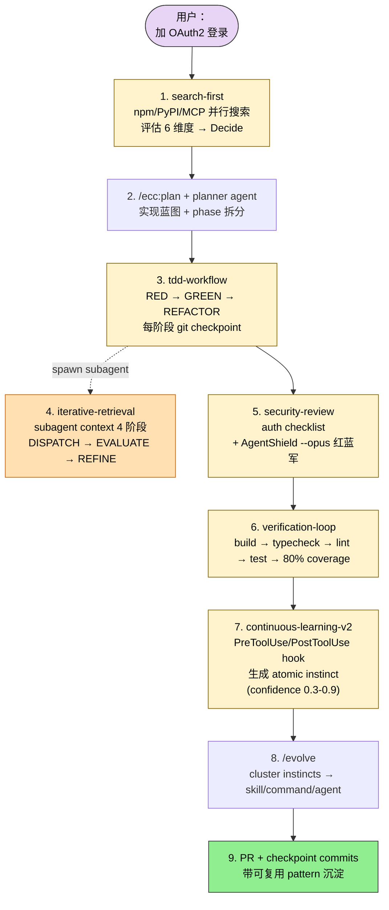
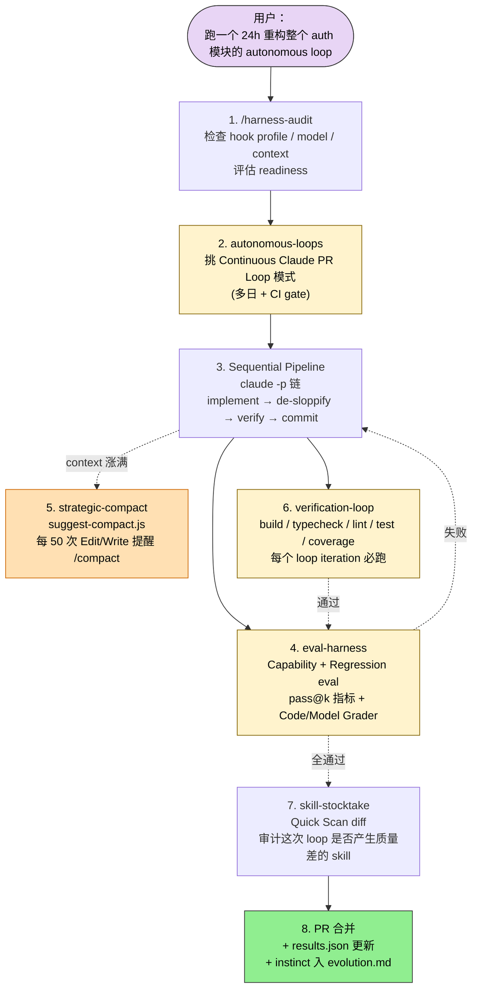
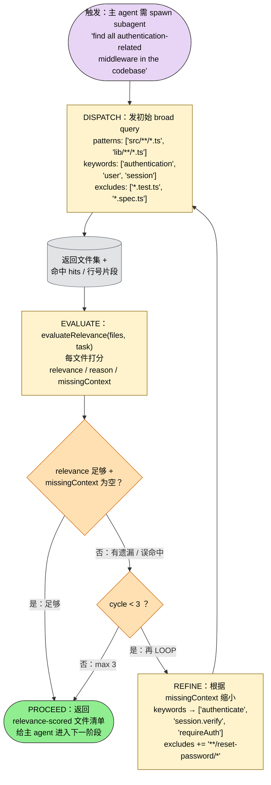
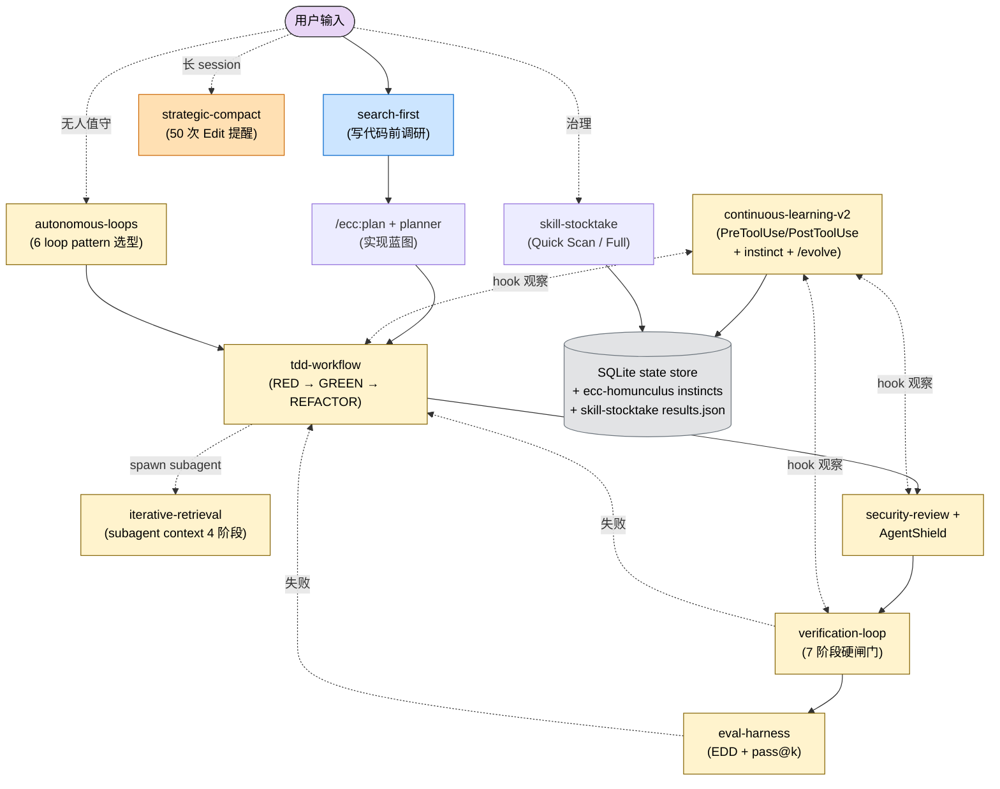

## 一句话简介

`ECC`（Everything Claude Code）是 affaan-m 维护的"harness-native 操作系统"——整套包含 **63 个 agents、249 个 skills、79 个 legacy 命令 shim、跨 12 种语言生态的 rules、SQLite + Tkinter dashboard 和 AgentShield 安全审计**，目标不是单一 Skill 而是"agentic 工作的完整操作面"。本文以 batch yaml 收录的 10 个核心 Skill（continuous-learning-v2 / tdd-workflow / security-review / iterative-retrieval / strategic-compact / eval-harness / verification-loop / search-first / skill-stocktake / autonomous-loops）为切入，串起从 session 观察 → instinct 提取 → TDD → 验证 → 安全审计 → 自治 loop 的完整链路。

## 它解决什么问题

README 把 ECC 定位成 "harness-native operator system for agentic work. Built from real-world multi-harness engineering workflows."配套 Shorthand / Longform / Security 三本指南覆盖 token 优化、memory persistence、continuous learning、verification loops、parallelization、subagent orchestration。落到本文 10 个核心 Skill：

- **当你每天用 Claude Code 干活、却发现学到的隐含 pattern 全在脑子里没法跨 session / 跨 project 复用的时候**——`continuous-learning-v2` SKILL.md "What's New in v2 (vs v1)" 表明示：v1 用 Stop hook 会丢失，v2 用 PreToolUse / PostToolUse 100% 可靠捕获；v2.1 新增 project-scoped instincts，React pattern 留在 React 项目，Python 约定留在 Python 项目，通用 pattern 在 2+ 项目出现时自动 promote 到 global。
- **当你想让 Claude 写代码自带 TDD 纪律、不再写完才补几个表演性测试的时候**——`tdd-workflow` SKILL.md "Core Principles" 段强制：Tests BEFORE Code / 80%+ coverage（unit + integration + E2E）/ 每个 TDD 阶段一个 git checkpoint commit（RED → GREEN → optional refactor），并明示"only commits on the current active branch for the current task" 防止误认旧 commit 当 checkpoint。
- **当你给一个加 auth / 处理用户输入 / 接外部 API 的 feature 担心 OWASP 漏洞、想要有 checklist 的安全审计的时候**——`security-review` SKILL.md "When to Activate" 段覆盖 auth / user input / secrets / API endpoints / payments / 第三方集成，配合 README "AgentShield" 段提供 `npx ecc-agentshield scan` 静态扫描（14 secret patterns、102 rules、`--opus` 启动三 Opus 4.6 红蓝军 + auditor pipeline）。
- **当你 spawn 一个 subagent 但不知道它需要什么 context、给多了爆 / 给少了答错的时候**——`iterative-retrieval` SKILL.md "The Problem" 段直接命题：subagent 不知道 which files / what patterns / what terminology，标准做法（send everything / nothing / guess）都失败；本 skill 给 4 阶段 loop：DISPATCH → EVALUATE → REFINE → LOOP（max 3 cycles）。
- **当你长 session 跑到 200K token、auto-compaction 在错误的地方 trigger 把变量名 / 文件路径冲走的时候**——`strategic-compact` SKILL.md "Why Strategic Compaction?" 段：auto-compact 经常 mid-task 冲掉关键 context；本 skill 用 `suggest-compact.js` 监听 PreToolUse(Edit/Write)，在 50 次调用时建议手动 `/compact`，每 25 次再提醒。Longform Guide 还推荐 `CLAUDE_AUTOCOMPACT_PCT_OVERRIDE=50` 把自动阈值压到 50%。
- **当你想给 AI session 加 eval-driven development、像跑单测一样监控 agent 行为的时候**——`eval-harness` SKILL.md "Philosophy" 段把 evals 比作 "unit tests of AI development"，提供 Capability Eval / Regression Eval / Code-Based Grader / Model-Based Grader 四种范式 + pass@k 指标。
- **当你想给 feature 收尾时跑一个 build / typecheck / lint / test / coverage 的统一 verification loop 的时候**——`verification-loop` SKILL.md "Verification Phases" 给了 7 阶段固定流程（Build → Type Check → Lint → Test → Coverage 80% → 报错则停 → 修复后回到 Phase 1）。
- **当你接到"add X functionality"想立刻写代码、但其实社区早有现成包的时候**——`search-first` SKILL.md "Workflow" 给 5 阶段流程：Tool Preflight → Need Analysis → Parallel Search（npm/PyPI/MCP/Skills/GitHub）→ Evaluate（功能 / 维护 / 社区 / docs / license / deps 6 维度）→ Decide（Adopt / Extend / Compose / Build）→ Implement，把"先搜后写"变成可执行 SOP。
- **当你定期想审计本地有哪些 Skill、哪些质量差需要删的时候**——`skill-stocktake` SKILL.md "Modes" 段：Quick Scan（只看变更，5–10 min）/ Full Stocktake（完整，20–30 min），扫 `~/.claude/skills/` + `{cwd}/.claude/skills/` 两个路径，结果缓存在 `~/.claude/skills/skill-stocktake/results.json`。
- **当你想跑无人值守的 agentic loop、但又怕变成 vibe coding 一夜烧掉 200 美元的时候**——`autonomous-loops` SKILL.md "Loop Pattern Spectrum" 表把 loop 分 6 个梯度（Sequential Pipeline → NanoClaw REPL → Infinite Agentic Loop → Continuous Claude PR Loop → De-Sloppify → Ralphinho RFC-Driven DAG），按复杂度选；并附带兼容性 note "canonical skill name is now `continuous-agent-loop`"。

## 安装方法

README "Quick Start" 段强烈警告 **不要同时叠加多种安装路径**（"do not stack install methods"），常见错误是 `/plugin install` 后又跑 `install.sh --profile full`。三条互斥的官方路径：

### 路径 1：Claude Code plugin（推荐默认）

```bash
# Add marketplace
/plugin marketplace add https://github.com/affaan-m/ECC

# Install plugin
/plugin install ecc@ecc
```

> README "Naming + Migration Note" 段提示：GitHub repo 是 `affaan-m/ECC`，marketplace identifier 是 `ecc@ecc`，npm 包是 `ecc-universal`——三者不可互换。

装完后 rules 不会自动分发（plugin 系统限制），需要手动拷：

```bash
git clone https://github.com/affaan-m/ECC.git
cd ECC
mkdir -p ~/.claude/rules/ecc
cp -R rules/common ~/.claude/rules/ecc/
cp -R rules/typescript ~/.claude/rules/ecc/   # 按需选语言
```

### 路径 2：完全手动 installer

```bash
./install.sh --profile full
# 或 Windows: .\install.ps1 --profile full
# 或 npx ecc-install --profile full
```

> 走 installer 就不要再 `/plugin install`，会重复加载。

### 路径 3：低 context / no-hooks 极简

```bash
./install.sh --profile minimal --target claude
# 仅 rules / agents / commands / 核心 workflow skills，无 hooks-runtime
```

后加 hooks：

```bash
./install.sh --target claude --modules hooks-runtime
```

### 不确定要装哪些？用 consult

```bash
npx ecc consult "security reviews" --target claude
npx ecc consult "mlops training model deployment" --target claude
```

返回匹配的 component + 相关 profile + preview / install 命令。

### 跨 harness

README 给了 Cursor / OpenCode / Codex / Antigravity / Zed / GitHub Copilot / Qwen / JoyCode / CodeBuddy 各自 target，例如：

```bash
./install.sh --target cursor typescript
./install.sh --target codex
```

### Reset / Uninstall

```bash
node scripts/uninstall.js --dry-run
node scripts/uninstall.js
# 或
node scripts/ecc.js doctor
node scripts/ecc.js repair
```

### 运行时控制（环境变量）

| 变量 | 作用 |
|---|---|
| `ECC_HOOK_PROFILE=minimal\|standard\|strict` | hook 严格度 |
| `ECC_DISABLED_HOOKS="pre:bash:tmux-reminder,..."` | 临时禁某些 hook |
| `ECC_SESSION_START_MAX_CHARS=4000` | SessionStart additional context 上限（默认 8000） |
| `ECC_SESSION_START_CONTEXT=off` | 完全关掉 SessionStart 注入（local model 适用） |
| `ECC_CONTEXT_MONITOR_COST_WARNINGS=off` | 订阅用户关掉 cost 警告 |
| `CLAUDE_PACKAGE_MANAGER=pnpm` | 锁定包管理器 |
| `ECC_DISABLED_MCPS="github,context7,..."` | 跳过 ECC bundled MCP |

## 核心理念 / 工作流哲学

README 把哲学浓缩成三件事：

1. **harness-native，不是配置包** — README v1.8.0 release note："ECC is now explicitly framed as an agent harness performance system, not just a config pack."hook 是 script-based 而非脆弱的 inline one-liners；提供 `/harness-audit` `/loop-start` `/loop-status` `/quality-gate` `/model-route` 等 harness 级命令。
2. **Skills 是第一公民，commands 在迁移期保留** — README "Key Concepts → Skills" 段明示："Skills are the primary workflow surface."`commands/` 是 maintained 兼容层；`legacy-command-shims/` 是显式 opt-in。新工作流先落 Skill。
3. **跨 harness 同一份内容** — README "Cross-Tool Feature Parity" 表给了 Claude Code / Cursor / Codex / OpenCode / GitHub Copilot 五边对比。AGENTS.md 是 universal context 文件，被 4 个 harness 共享；`.cursor/hooks/adapter.js` 用 DRY adapter pattern 让 Cursor 复用 Claude Code 的 hook 脚本。

落地到本文 10 个核心 Skill，是 README "The Guides" 表给的六条主线：

| 主线 | 对应 Skill |
|---|---|
| Token Optimization | `strategic-compact` |
| Memory Persistence | `continuous-learning-v2`（hooks 自动 save/load） |
| Continuous Learning | `continuous-learning-v2`（instinct → cluster → skill/command/agent） |
| Verification Loops | `verification-loop` / `eval-harness`（checkpoint vs continuous evals, grader 类型, pass@k） |
| Parallelization | `autonomous-loops`（git worktrees, cascade method） |
| Subagent Orchestration | `iterative-retrieval`（the context problem） |

补充：`search-first` 是"写代码前先调研"的源头闸门；`tdd-workflow` + `security-review` 是质量两块基石；`skill-stocktake` 是 Skill 治理工具。

## 包含哪些 Skills

ECC 仓库总共 249 个 Skills，本文聚焦 batch yaml 收录的 10 个核心（外加 2 个 plugin-doc 文档）：

- **[continuous-learning-v2](/articles/ecc-continuous-learning-v2)** — Instinct-based 学习系统。PreToolUse / PostToolUse hook 观察 session → Haiku background agent 分析 → 生成 atomic instinct（trigger / action / confidence 0.3–0.9 / domain 标签 / evidence）→ `/evolve` 聚类成 skill/command/agent。v2.1 project-scoped + 2 项目自动 promote 到 global。
- **[tdd-workflow](/articles/ecc-tdd-workflow)** — 强制 Tests BEFORE Code 的 TDD 纪律。三类测试（unit / integration / Playwright E2E）+ 80% coverage + 每 TDD 阶段 git checkpoint commit + 严格只算当前 branch 当前 task 的 commits。
- **[security-review](/articles/ecc-security-review)** — Auth / 输入 / secrets / payment / 第三方 API 场景的安全 checklist。FAIL/PASS 范式给反例和正例（zod 输入校验、`process.env.OPENAI_API_KEY` 而不是硬编码、`.env.local` 必须 gitignore 等）。
- **[iterative-retrieval](/articles/ecc-iterative-retrieval)** — Subagent context problem 的 4 阶段 loop：DISPATCH（initial broad query）→ EVALUATE（relevance scoring）→ REFINE → LOOP（max 3 cycles），解决"agent 不知道需要什么 context"的死循环。
- **[strategic-compact](/articles/ecc-strategic-compact)** — `suggest-compact.js` 监听 PreToolUse(Edit/Write)，每 50 次调用建议手动 `/compact`，之后每 25 次提醒。覆盖 5 个适用场景（长 session / 多阶段 / 切换任务 / milestone 完成 / 响应变慢）。
- **[eval-harness](/articles/ecc-eval-harness)** — Eval-driven development 框架。Capability Eval / Regression Eval 两种范式；Code-Based Grader（grep + 退出码）与 Model-Based Grader（用 Claude 给 1–5 分）两种判分；pass@k 指标。
- **[verification-loop](/articles/ecc-verification-loop)** — 7 阶段验证：Build → Type Check（tsc/pyright）→ Lint（eslint/ruff）→ Test Suite（含 coverage）→ 报错则停修复 → 回到 Phase 1。是 `tdd-workflow` 的"出口检查"。
- **[search-first](/articles/ecc-search-first)** — Research-before-coding workflow。5 阶段 + 4 决策象限（Adopt / Extend / Compose / Build）+ Tool Preflight（先检查 search 通道可用性）。Invokes researcher agent，并行 npm / PyPI / MCP / Skills / GitHub。
- **[skill-stocktake](/articles/ecc-skill-stocktake)** — Skill 质量审计。Quick Scan（diff 检测，5–10 min）/ Full Stocktake（20–30 min）两模式，扫 `~/.claude/skills/` + `{cwd}/.claude/skills/`，结果缓存到 `results.json` 跨次复用。
- **[autonomous-loops](/articles/ecc-autonomous-loops)** — 6 种 loop pattern 谱系：Sequential Pipeline（`claude -p` 链）/ NanoClaw REPL / Infinite Agentic Loop / Continuous Claude PR Loop / De-Sloppify / Ralphinho RFC-Driven DAG。canonical name 已迁移到 `continuous-agent-loop`，本 skill 保留兼容。

> ECC 还有 2 份 plugin-doc 文档可参考：[skill-development-guide](/articles/ecc-skill-development-guide)（文件结构、frontmatter、命名约定、何时抽 subagent、continuous learning 迭代 loop）和 [skill-placement-policy](/articles/ecc-skill-placement-policy)（新行为该放 skill / 现有 skill 扩展 / subagent / slash command / system-prompt overlay 的决策树）。

## 典型工作流串讲

### 示例 A：从一个 feature 想法到带 instinct 沉淀的 PR

> 这是 README "Common Workflows → Starting a new feature" 段对应的端到端链路，把 6 个核心 Skill 串起来。



1. **search-first 先调研**：用户说"加 OAuth2 登录"。`search-first` SKILL.md 强制先 5 阶段流程：Tool Preflight（确认 npm / MCP / GitHub 通道可用）→ Need Analysis（语言 / 框架约束）→ Parallel Search（researcher agent 并行查 `next-auth` / `auth0` / `lucia` 等候选）→ Evaluate（按 functionality / maintenance / community / docs / license / deps 6 维度打分）→ Decide（Adopt `next-auth` as-is）。
2. **`/ecc:plan` 起蓝图**：README "Common Workflows" 第一行：`/ecc:plan "Add OAuth"` → planner agent 输出 phased implementation blueprint。
3. **TDD 落地**：`tdd-workflow` SKILL.md 强制 Tests BEFORE Code。RED 阶段写一个测 OAuth callback 的失败测试 + commit "test: failing test for OAuth callback"；GREEN 阶段实现最小 `handleAuthCallback` 通过测试 + commit；可选 REFACTOR commit。注意 SKILL.md 强调"only commits on the current active branch for the current task"——别误把别的 branch commit 算成 checkpoint。
4. **subagent 用 iterative-retrieval**：实现过程中如果 spawn 个 subagent 去找 codebase 里现有 session middleware，按 `iterative-retrieval` 的 DISPATCH（broad query）→ EVALUATE（relevance score + missingContext 标注）→ REFINE（缩小 keyword）→ LOOP（max 3 cycles）跑，避免一次 send everything 爆 context。
5. **安全审计**：`security-review` SKILL.md 给 auth 场景的 checklist——`process.env.OAUTH_CLIENT_SECRET` 不能硬编码、zod 校验 callback params、`.env.local` 必须 gitignore。补充 `npx ecc-agentshield scan --opus` 启动三 Opus 4.6 红蓝军 + auditor 跑深度 adversarial reasoning，输出 color-graded A–F + JSON + Markdown + HTML 多格式报告，CI 上 exit code 2 卡 build gate。
6. **verification-loop 收口**：`verification-loop` 7 阶段顺序跑 Build / Type Check / Lint / Test / Coverage 80%，任一 phase 失败立刻 STOP 修复后从 Phase 1 重跑。
7. **continuous-learning-v2 沉淀**：整个过程 PreToolUse / PostToolUse hook 100% 可靠地捕获你的工具调用 → background Haiku agent 提取 atomic instinct（如 "when writing OAuth callbacks, always validate state param against session"，confidence 0.7，domain: security，evidence: 5 次同样 pattern）→ 存到 `${XDG_DATA_HOME:-~/.local/share}/ecc-homunculus/projects/<hash>/`。
8. **`/evolve` 聚类**：到一定数量后 `/evolve` 把相关 instinct 聚成 skill / command / agent；`/promote` 把项目级 instinct 在 2+ 项目出现时提升到 global。
9. **PR 含完整证据**：RED → GREEN → REFACTOR 三个 checkpoint commit + verification 输出 + security scan 报告。下次类似 feature instinct 会自动 prime。

### 示例 B：长跑 autonomous loop + 战略 compaction + Skill 治理

> 这是 README "Longform Guide → token optimization + autonomous workflows" 主线 + 多 Skill 配合的真实使用模式。



1. **`/harness-audit` 评估 readiness**：README v1.8.0 release note 提到的 harness 级命令。先看当前 hook profile、model 设定、context 阈值，确认能跑无人值守。
2. **挑 loop pattern**：`autonomous-loops` SKILL.md "Loop Pattern Spectrum" 表是选型工具。24h 重构 + 多 CI gate → Continuous Claude PR Loop（Medium 复杂度，best for "multi-day iterative projects with CI gates"）。简单脚本化 daily dev 选 Sequential Pipeline，大 feature 多单元并行选 Ralphinho RFC-Driven DAG。
3. **Sequential Pipeline 串脚本**：`autonomous-loops` SKILL.md 第 1 节给的范式：`claude -p "Read the spec... Implement OAuth2... Write tests first (TDD). Do NOT create any new documentation files."` → `claude -p "Review all files changed... Remove unnecessary type tests, overly defensive checks..."`（De-Sloppify Pattern）→ `claude -p "Run the full build, lint, type check, and test suite. Fix any failures."` → `claude -p "Create a conventional commit..."`。`set -e` 退出码传播失败停。
4. **eval-harness 给指标**：每轮 loop 配 Capability Eval / Regression Eval。Code-Based Grader 用 `grep -q "export function handleAuth" src/auth.ts && echo PASS || echo FAIL` 这类确定性检查；Model-Based Grader 用另一个 Claude 给 1–5 分评开放式输出。失败回到步骤 3 重跑。
5. **strategic-compact 防 context 崩**：`suggest-compact.js` 在 PreToolUse(Edit) hook 上跑，第 50 次 Edit/Write 时输出建议 `/compact`，之后每 25 次提醒。配合 `CLAUDE_AUTOCOMPACT_PCT_OVERRIDE=50` 把自动阈值压到 50% 避免在错误位置 compact。SKILL.md "When NOT to compact" 段明示——mid-implementation 别 compact，会丢变量名和文件路径。
6. **verification-loop 每 iter 必跑**：每个 loop iteration 末尾跑 Build → Type Check → Lint → Test → Coverage 80%。任一 phase 失败立刻 STOP，修完才回 Phase 1。是 eval-harness 之外的"硬指标闸门"。
7. **skill-stocktake 治理**：长 loop 跑完检查是否产生质量差的临时 skill。`/skill-stocktake` 默认 Quick Scan（只看 diff，5–10 min），跑 `quick-diff.sh` 比对上次 `results.json`；结果增量更新到缓存。
8. **完成**：PR 合并 + `results.json` 更新 + 这次 loop 学到的 instinct 通过 continuous-learning-v2 hook 沉淀进 evolution；下次类似 loop 自动 prime。

### 示例 C：把 subagent context problem 用 iterative-retrieval 解决

> 这是 README "Longform Guide → Subagent Orchestration" 段的微观示例，纯 `iterative-retrieval` 内部循环。



**读图三条线索：**

1. **DISPATCH → EVALUATE → REFINE 是核心三角**：每轮 DISPATCH 发宽查询，EVALUATE 给 relevance / missingContext 反馈，REFINE 收窄查询参数；三步缺一不可。
2. **两道 gate 终止循环**：一是 EVALUATE 满意度（relevance 足够 + missingContext 为空），二是 cycle 计数硬上限（max 3）；避免拉锯无限。
3. **proceed 出口而非死循环**：max 3 cycles 后即使不完美也强制返回当前最佳 relevance-scored 文件清单，把"完美的敌人是足够好"做硬编码。

这一个微观 loop 是 README 提到的"Subagent Orchestration: the context problem" 的标准解，搭配 `autonomous-loops` 的 DAG orchestration 就成了 multi-agent workflow 的基础原语。

## Skill 间协作关系图



**读图三条线索：**

1. **三类 Skill 各司其职**：入口型（`search-first`）防止"还没搜就开写"；过程型（`tdd-workflow` / `iterative-retrieval` / `strategic-compact`）保证开发纪律；出口型（`verification-loop` / `eval-harness` / `security-review`）提供硬指标闸门。
2. **observer + memory 是隐藏底盘**：`continuous-learning-v2` 通过 PreToolUse / PostToolUse hook 全程旁观，把行为提炼成 instinct 沉淀到 `ecc-homunculus` SQLite store；这是 ECC 区别于普通 plugin 集的最重要差异——它有 "记忆"。
3. **autonomous-loops 是 meta 层**：包住其他所有 Skill，从 6 个 loop pattern 里挑一个，组装 `claude -p` 序列或 DAG 调度。可与 `eval-harness` 配 pass@k 度量自治效果。

## 常见坑 + 适合人群

### 常见坑

1. **同时叠加多种安装路径** — README "Pick one path only" 段最长的警告。`/plugin install` + `install.sh --profile full` = duplicate skills + duplicate runtime。如果发现重复直接走 `node scripts/uninstall.js --dry-run` → uninstall → 选一条路径重装。
2. **给 plugin.json 加 hooks 字段** — Claude Code v2.1+ 自动加载 `hooks/hooks.json`，显式声明会触发 "Duplicate hooks file detected" 错误。README 已加 regression test，但本地实现新 plugin 时容易踩。
3. **manual copy hooks/hooks.json 到 settings.json** — README "Install hooks" 段明示：那个文件是 plugin-oriented，不是手动安装的支持路径。要装 hook 走 `bash ./install.sh --target claude --modules hooks-runtime`。
4. **MCP 装太多吃 context** — README FAQ "context window shrinking" 段：每个 MCP tool description 都吃 token，能把 200K 压到 ~70K。保持 <10 MCP enabled、<80 tools active。用 `/mcp` 关掉，那些选择持久化在 `~/.claude.json`（**不是** `.claude/settings.json`）。
5. **multi-* 命令需要单独装 ccg-workflow** — README WARNING："/multi-plan, /multi-execute 等不在 base plugin/rules 里"，必须 `npx ccg-workflow` 初始化 `~/.claude/bin/codeagent-wrapper` + `~/.claude/.ccg/prompts/*`。
6. **TDD checkpoint 计数错 branch** — `tdd-workflow` SKILL.md 反复强调"only commits on the current active branch for the current task"。误把别的 branch / 旧任务 commit 当 checkpoint 会让 verify 漏过。
7. **strategic-compact 在 mid-implementation 触发会冲掉变量名** — SKILL.md "When NOT to compact" 段：研究 → 实现 → 测试中段千万别 compact，会丢实现细节。该 compact 的时机是 milestone 之间。
8. **autonomous-loops 用旧名字** — SKILL.md 顶部 compat note："canonical skill name is now `continuous-agent-loop`. New loop guidance should be authored there."老 `autonomous-loops` 仅一次 release 兼容。

### 适合人群

**适合：**

- 已经在多种 harness（Claude Code + Cursor + Codex + OpenCode）之间切换的开发者，需要一份 portable 的 agent 行为规范
- 团队级工程，需要 TDD + verification + security 三件套强制纪律，并希望被 hook 持续观察、自动沉淀 pattern
- 跑过 autonomous loop 被烧过 token 的人——eval-harness + strategic-compact + verification-loop 是配套防火墙
- 想给本地 Skill 库做 governance，定期审计删除质量差 Skill 的人
- 写 plugin / Skill 的作者——`skill-development-guide` 和 `skill-placement-policy` 两份 plugin-doc 是行业内最详细的 Skill 工程指南

**不适合：**

- 只想要轻量、单一 Skill 的人——ECC 是 "harness OS" 不是单功能 plugin，63 agents + 249 skills 的体量对新手压力大
- 不在意 cross-harness 一致性，只用单一工具的人——ECC 的设计成本（AGENTS.md / DRY adapter / 多 target install）对单 harness 用户是溢价
- 没有 typecheck / lint / test 基础设施的项目——verification-loop / eval-harness / tdd-workflow 全部依赖 feedback signal，没基础设施会原地空转
- 严格 Air-Gapped 环境且不能跑 npm / Context7 MCP 的人——很多 Skill 默认假设可联网调研

---

本文基于 <https://github.com/affaan-m/ecc> 由 AI（claude-opus-4-7）辅助生成中文教程，原作者署名 affaan-m，许可证 MIT。

<!-- self-check
本文中提到的命令 / 文件 / URL 清单：
- `/plugin marketplace add https://github.com/affaan-m/ECC` / `/plugin install ecc@ecc` — README Quick Start Step 1 段
- `./install.sh --profile full` / `--profile minimal --target claude` / `--profile core --without baseline:hooks --target claude` / `--modules hooks-runtime` / `--target cursor typescript` / `--target codex` — README 多处
- `.\install.ps1` / `npx ecc-install --profile full` — README Windows 段
- `npx ecc consult "security reviews" --target claude` — README "Find the right components first" 段
- `npx ecc-agentshield scan` / `scan --fix` / `scan --opus --stream` / `init` — README AgentShield 段
- `npx ccg-workflow` / `~/.claude/bin/codeagent-wrapper` / `~/.claude/.ccg/prompts/*` — README Multi-model 警告段
- `/ecc:plan "Add user authentication"` / `/plan "Add user authentication"` — README Quick Start Step 3 段
- `/instinct-status` / `/instinct-import <file>` / `/instinct-export` / `/evolve` / `/promote` / `/projects` / `/prune` — README Commands 列表 + continuous-learning-v2 SKILL.md
- `/skill-create` / `/skill-create --instincts` — README Skill Creator 段
- `/security-scan` — README Which Agent Should I Use 表
- `/harness-audit` / `/loop-start` / `/loop-status` / `/quality-gate` / `/model-route` — README v1.8.0 release note
- `node scripts/uninstall.js --dry-run` / `node scripts/uninstall.js` / `node scripts/ecc.js list-installed/doctor/repair` — README Reset / Uninstall 段
- `ECC_HOOK_PROFILE` / `ECC_DISABLED_HOOKS` / `ECC_SESSION_START_MAX_CHARS` / `ECC_SESSION_START_CONTEXT` / `ECC_CONTEXT_MONITOR_COST_WARNINGS` / `CLAUDE_PACKAGE_MANAGER` / `ECC_DISABLED_MCPS` — README Hook Runtime Controls 段 + Codex 同步段
- `CLAUDE_AUTOCOMPACT_PCT_OVERRIDE=50` / `MAX_THINKING_TOKENS=10000` / `CLAUDE_CODE_SUBAGENT_MODEL=haiku` — README Token Optimization 段
- `${XDG_DATA_HOME:-~/.local/share}/ecc-homunculus/projects/<hash>/` — continuous-learning-v2 SKILL.md v2.1 表
- `~/.claude/skills/skill-stocktake/results.json` / `bash ~/.claude/skills/skill-stocktake/scripts/quick-diff.sh` / `save-results.sh` — skill-stocktake SKILL.md Modes + Quick Scan Flow 段
- `claude -p "..."` Sequential Pipeline 范式 — autonomous-loops SKILL.md 第 1 节
- `npm run build` / `npx tsc --noEmit` / `pyright .` / `npm run lint` / `ruff check .` / `npm run test -- --coverage` — verification-loop SKILL.md Verification Phases 段
- `grep -q "..." && echo PASS || echo FAIL` — eval-harness SKILL.md Code-Based Grader 段
- `suggest-compact.js` on PreToolUse(Edit) — strategic-compact SKILL.md How It Works 段
- `ecc_dashboard.py` / `npm run dashboard` — README Dashboard GUI 段

场景章节支撑：
- 场景 1 "跨 session pattern 复用" — continuous-learning-v2 SKILL.md v2 vs v1 表 + v2.1 project-scoped 段直接支撑
- 场景 2 "TDD 纪律 / 防止补测试" — tdd-workflow SKILL.md Core Principles + Git Checkpoints 段直接支撑
- 场景 3 "auth 安全 checklist" — security-review SKILL.md When to Activate + Secrets Management + Input Validation 段直接支撑
- 场景 4 "subagent context problem" — iterative-retrieval SKILL.md The Problem + The Solution 段直接支撑
- 场景 5 "长 session auto-compact 错位" — strategic-compact SKILL.md Why Strategic Compaction 段直接支撑
- 场景 6 "EDD 把 eval 当单测" — eval-harness SKILL.md Philosophy + Eval Types + Grader Types 段直接支撑
- 场景 7 "feature 收尾的统一验证" — verification-loop SKILL.md Verification Phases 段直接支撑
- 场景 8 "写代码前先调研" — search-first SKILL.md Workflow + Decision Matrix 段直接支撑
- 场景 9 "Skill 质量审计" — skill-stocktake SKILL.md Modes + Quick Scan Flow 段直接支撑
- 场景 10 "自治 loop 防烧 token" — autonomous-loops SKILL.md Loop Pattern Spectrum 表 + Sequential Pipeline 段直接支撑

图 / 代码块处理：
- README "What's Inside" 目录树（很长） → 未直接复制，文中以"63 agents + 249 skills + 79 legacy commands"概括
- README Cross-Tool Feature Parity 表 → 未直接复用，文中以"harness-native + DRY adapter pattern"概括
- README 大量 bash / json 代码块（install / token optimization / agent team 等）→ 选择性保留 install 命令、token 优化设置、env 变量表
- iterative-retrieval ASCII flow 图（4 阶段）→ 在示例 C 中文字描述，原图保留在单 Skill 文章
- search-first ASCII flow 图（5 阶段 + 决策矩阵）→ 文中以文字概括，原图保留在单 Skill 文章
- 4 张 mermaid 新增：示例 A 端到端 / 示例 B 长跑 loop / 示例 C iterative-retrieval 5 步微观循环（DISPATCH → EVALUATE → REFINE → LOOP，含 cycle &lt; 3 硬上限与 PROCEED 出口）/ 整体协作图。节点名词全部出自 README 或 SKILL.md
- 已检查全文所有编号列表 / "first X then Y" / "phase 1→2→3" 表达，均已转 mermaid 或保留源 ASCII 图

依赖关系（plugin-overview）：
- 10 个 sibling skills 全部列出：continuous-learning-v2 / tdd-workflow / security-review / iterative-retrieval / strategic-compact / eval-harness / verification-loop / search-first / skill-stocktake / autonomous-loops（与 batch yaml 一致）
- 2 份 plugin-doc（skill-development-guide / skill-placement-policy）仅引用 + 提供链接，未复制内容（task 提示篇幅吃紧）
- 协作关系：来自 README "Common Workflows" 段（Starting a new feature / Fixing a bug / Preparing for production 三条范式）+ "The Guides" 表（六条主线对应 Skill）+ 各 SKILL.md "When to Activate" 段

可疑项：
- 示例 A 中 `iterative-retrieval` 与 `tdd-workflow` 的串联是基于"实现过程 spawn subagent" 的合理推测，并非两份 SKILL.md 互相引用；属反推
- 示例 A 中 OAuth state param 的 instinct 描述是用 SKILL.md instinct 范式格式（trigger/confidence/domain/evidence）反推的示意，非源文件具体案例
- 示例 B 中 `/harness-audit` 来自 README v1.8.0 release note，本文以"评估 readiness"概括其作用，未列具体输出格式（README 未明示）
- ECC 总 catalog 数（63 agents / 249 skills / 79 legacy commands）来自 README v2.0.0-rc.1 release note + Quick Start Step 3 段
- README 顶部"182K+ stars | 28K+ forks | 170+ contributors" 是 README 自报数据，本文未直接引用以避免误导
-->
