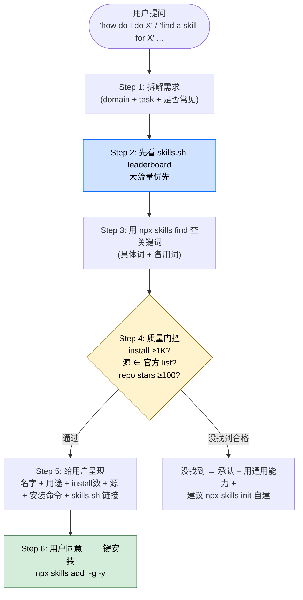

## 一句话简介

`find-skills` 是 Vercel Labs 在 `vercel-labs/skills` 仓库里维护的 Skill 发现 Skill：当用户说出"我想做 X / 有没有 Skill 能 X / 你能不能扩展个能力"这类话时，Claude 自动接入开放 agent skills 生态，先查 skills.sh leaderboard、再跑 `npx skills find`，按 install count 与源信誉过滤后呈现安装命令，并可一键 `npx skills add` 安装到全局。

## 它解决什么问题

不同于让用户自己去 GitHub / X 翻 Skill 仓库，本 Skill 解决的是"我不知道该装哪个 Skill、装错了/装到劣质 Skill 怎么办"这类发现链路上的痛点。SKILL.md description 段直接列触发条件——"how do I do X"、"find a skill for X"、"is there a skill that can…"、"想扩展能力"。覆盖以下场景：

- **当用户用自然语言问"怎么做 React 性能优化 / PR 评审 / 写 changelog"、其实生态里早就有现成 Skill 的时候**——SKILL.md "When to Use This Skill" 段明示这类提问就是触发点：「Asks 'how do I do X' where X might be a common task with an existing skill」。
- **当用户直接说"有没有 Skill 能搞 X"、不想自己去翻仓库的时候**——SKILL.md 第 14 行明示「Says 'find a skill for X' or 'is there a skill for X'」就是触发条件。
- **当用户表达"我希望 Claude 能帮我做 X 这种特定领域的事（设计 / 测试 / 部署 …）"的时候**——SKILL.md 第 16-18 行明示「Expresses interest in extending agent capabilities / Wants to search for tools, templates, or workflows / Mentions they wish they had help with a specific domain」。
- **当你担心装到一个 install 数为 0 / 来源不明 / GitHub stars 极少的劣质 Skill 的时候**——SKILL.md "Step 4: Verify Quality Before Recommending" 段强制要求**先验证 install count（优先 1K+，<100 警惕）、源信誉（`vercel-labs`、`anthropics`、`microsoft` 等官方源更可信）、GitHub stars（<100 慎用）**，不允许只凭搜索结果就推荐。
- **当生态里其实没有 Skill 命中你的需求、Claude 不知道怎么 graceful 落地的时候**——SKILL.md "When No Skills Are Found" 段明示标准话术：先承认没找到，再提议用通用能力直接处理，最后建议 `npx skills init my-xyz-skill` 自己造一个。

## 安装方法

SKILL.md 本身没有给"自己怎么安装 find-skills"的命令——但生态默认入口就是 Skills CLI（`npx skills`），并且 SKILL.md 第 22 行明示 `npx skills` **本身就是开放 agent skills 生态的包管理器**。本 Skill 的发布源 `vercel-labs/skills` 也走同一个机制。

SKILL.md 明示的核心入口：

- 浏览：<https://skills.sh/>
- 关键命令：
  - `npx skills find [query]` — 关键词或交互式搜索
  - `npx skills add <package>` — 安装 Skill（GitHub 或其他源）
  - `npx skills check` — 检查更新
  - `npx skills update` — 升级所有已装 Skill

## 核心流程逐项解释

SKILL.md "How to Help Users Find Skills" 段把 Claude 的推荐流程拆成 6 步：



### Step 1：拆解需求

SKILL.md 明示要识别 3 件事：

1. domain（如 React、testing、design、deployment）
2. specific task（如 写测试、做动画、评审 PR）
3. 是否常见到"很可能有现成 Skill"

### Step 2：先查 leaderboard

SKILL.md 明示：跑 CLI 之前先看 [skills.sh leaderboard](https://skills.sh/)，按 total installs 排序，是发现热门、久经考验 Skill 的捷径。SKILL.md 给的两个示例：

- `vercel-labs/agent-skills` — React、Next.js、web design（每个 100K+ installs）
- `anthropics/skills` — Frontend design、document processing（100K+ installs）

### Step 3：跑 `npx skills find`

SKILL.md 给的关键词映射示例：

- 用户："how do I make my React app faster?" → `npx skills find react performance`
- 用户："can you help me with PR reviews?" → `npx skills find pr review`
- 用户："I need to create a changelog" → `npx skills find changelog`

### Step 4：质量门控（必须）

SKILL.md "Step 4: Verify Quality Before Recommending" 段原文要求"不能只凭搜索结果就推荐"。3 条强制核查：

| 维度 | 阈值 / 提示 |
|------|------------|
| Install count | 优先 1K+；<100 警惕 |
| 源信誉 | 官方源（`vercel-labs`、`anthropics`、`microsoft`）更可信，未知作者要小心 |
| GitHub stars | 仓库 stars <100 时应谨慎对待 |

### Step 5：标准呈现格式

SKILL.md 给了一个示范回复（节选原文）：

```
I found a skill that might help! The "react-best-practices" skill provides
React and Next.js performance optimization guidelines from Vercel Engineering.
(185K installs)

To install it:
npx skills add vercel-labs/agent-skills@react-best-practices

Learn more: https://skills.sh/vercel-labs/agent-skills/react-best-practices
```

呈现里要带：Skill 名称 + 用途、install 数 + 源、安装命令、`skills.sh` 详情链接。

### Step 6：一键安装

用户同意后直接：

```bash
npx skills add <owner/repo@skill> -g -y
```

`-g` 全局（user-level），`-y` 跳过确认。

### 常见类别 + 关键词建议

SKILL.md "Common Skill Categories" 表保留并翻译：

| 类别 | 示例关键词 |
|------|----------|
| Web Development | react、nextjs、typescript、css、tailwind |
| Testing | testing、jest、playwright、e2e |
| DevOps | deploy、docker、kubernetes、ci-cd |
| Documentation | docs、readme、changelog、api-docs |
| Code Quality | review、lint、refactor、best-practices |
| Design | ui、ux、design-system、accessibility |
| Productivity | workflow、automation、git |

### 搜索小技巧

SKILL.md "Tips for Effective Searches" 段 3 条：

1. **关键词要具体**：`react testing` 比单独 `testing` 好得多
2. **换同义词**：`deploy` 没结果就试 `deployment` 或 `ci-cd`
3. **关注热门源**：很多 Skill 来自 `vercel-labs/agent-skills` 或 `ComposioHQ/awesome-claude-skills`

## 实战 demo

下面是一次典型对话（基于 SKILL.md 给的流程串起来，不臆造具体 Skill 是否存在）：

**用户请求**：

> Claude 你能不能帮我自动写每个 PR 的 changelog？

**Claude 行为**：

1. **Step 1 拆解**：domain = "documentation / release"，task = "changelog 自动化"，属于常见任务，"很可能存在 Skill"。
2. **Step 2 leaderboard**：先打开 <https://skills.sh/> 看 Documentation / Release 分类是否有人在做 changelog 类 Skill。
3. **Step 3 search**：跑 `npx skills find changelog`，把候选 Skill 列出来。
4. **Step 4 质量门控**：把候选按 install 数 + 源 + GitHub stars 过一遍，只保留 install ≥1K（理想 1K+）、来源是 `vercel-labs` / `anthropics` / `microsoft` 等官方账号或 stars ≥100 的开源仓库。
5. **Step 5 呈现**：按 SKILL.md 给的模板格式呈现给用户——Skill 名 + 用途 + install 数 + 源 + 安装命令 + skills.sh 详情链接。
6. **Step 6 安装**：用户说"装吧"，跑 `npx skills add <owner/repo@skill> -g -y`，全局安装、跳过 prompt。

如果 Step 3 跑下来确实没找到合格 Skill：

> 我搜了 "changelog" 相关的 Skill，没找到匹配。可以用我的通用能力直接帮你处理。
> 如果你经常做这件事，也可以自己造一个：
>
> ```bash
> npx skills init my-changelog-skill
> ```

## 常见坑 + 注意事项

1. **不要跳过质量门控**——SKILL.md 第 68 行原文："Do not recommend a skill based solely on search results."。看到名字漂亮就推荐用户安装是反模式。
2. **install <100 的 Skill 默认警惕**——可能是新发布 / 个人实验 / 没人维护，SKILL.md 把 <100 写在了 "Be cautious" 阈值里。
3. **GitHub stars 也要看**——SKILL.md 第 73 行明示："A skill from a repo with <100 stars should be treated with skepticism."。
4. **没找到要说"没找到"，不要硬塞**——SKILL.md "When No Skills Are Found" 段明示要先 acknowledge、再 offer 用通用能力、最后建议 `npx skills init`，不要为了"显得有用"乱推。
5. **`-g -y` 改写用户全局环境**——`npx skills add <pkg> -g -y` 会在用户 user-level 装 Skill 并跳过确认，安装前 SKILL.md 流程要求先把 Skill 信息呈现给用户、等用户同意。
6. **关键词差一个字搜不到**——SKILL.md "Tips" 段明示 `deploy` / `deployment` / `ci-cd` 这种同义词差异很常见，建议换 2-3 种说法。
7. **leaderboard 数据有时滞**——SKILL.md 没明示更新频率；遇到争议时按 `npx skills find` 当时输出为准。

## 适合人群

**适合：**

- 还在试 Claude Code / Agent SDK、不熟悉 agent skills 生态有哪些 Skill 的新用户
- 想让用户用自然语言"我要做 X"就能拿到推荐 Skill 的产品方
- 在 Skill marketplace 上买买买、需要"质量过滤"防止装到劣质 Skill 的团队
- 经常切场景（前端 / 测试 / 部署 / 文档），希望 Claude 能按 domain 自动跳到正确 Skill 的开发者

**不适合：**

- 已经清楚自己需要哪些 Skill、直接 `npx skills add` 就完事的资深用户——再走一遍发现流程是多余
- 不允许联网装第三方包 / 限制 `npx` 的合规环境
- Skill 生态没有覆盖的小众 / 私有业务领域——需要自己 `npx skills init` 造而不是搜
- 不信任 install count / star 数作为质量信号的人——本 Skill 的门控逻辑就建立在这上面

---

本文基于 <https://github.com/vercel-labs/skills> 由 AI（claude-opus-4-7）辅助生成中文教程，原作者署名 Vercel Labs，许可证 Apache-2.0。

<!-- self-check
本文中提到的命令 / 文件 / URL 清单：
- `npx skills find [query]` / `npx skills add <package>` / `npx skills check` / `npx skills update` / `npx skills init` — 源文件 "Key commands" + "When No Skills Are Found" 段明示
- `npx skills add <owner/repo@skill> -g -y` 及 `-g` `-y` 含义 — 源文件 "Step 6: Offer to Install" 段明示
- `npx skills find react performance` / `npx skills find pr review` / `npx skills find changelog` — 源文件 "Step 3: Search for Skills" 段明示
- `npx skills add vercel-labs/agent-skills@react-best-practices` — 源文件 "Example response" 块明示
- skills.sh 主站与 leaderboard — 源文件 "Browse skills at" / "Step 2" 段明示
- `vercel-labs/agent-skills` / `anthropics/skills` / `ComposioHQ/awesome-claude-skills` — 源文件 "Step 2" + "Tips" 段明示
- 质量门控 3 项（install count, source reputation, GitHub stars） — 源文件 "Step 4" 段明示
- `https://skills.sh/vercel-labs/agent-skills/react-best-practices` 详情页 URL 格式 — 源文件 "Example response" 块明示

场景章节支撑：
- 场景 1 "how do I do X" — 源文件 "When to Use This Skill" 段第 13 行明示
- 场景 2 "find a skill for X" — 源文件 "When to Use This Skill" 段第 14 行明示
- 场景 3 "expresses interest in extending capabilities / domain wishes" — 源文件 "When to Use This Skill" 段第 16-18 行明示
- 场景 4 "quality gating" — 源文件 "Step 4" 段明示
- 场景 5 "no skill found graceful fallback" — 源文件 "When No Skills Are Found" 段明示

图 / 代码块处理：
- 源文件无 dot 流程图；新增 1 张 mermaid 把 Step 1-6 + "没找到分支" 串成一张图，节点关键词均出自源 SKILL.md
- 源文件中的 "Example response" 文本块按规则保留原文
- 源文件 "Common Skill Categories" 表按规则保留结构 + 翻译表头
- 源文件 shell 命令块全部按规则保留原文

依赖关系：
- 不适用，source_type = single-skill, sibling_skills 为空

可疑项：
- 实战 demo 中提到的 changelog 案例是按 SKILL.md "npx skills find changelog" 示例反推的流程示意，没有声称生态里一定有/没有特定 Skill；具体命中结果以实际 `npx skills find` 输出为准。
- License 字段 batch yaml 给的是 Apache-2.0；SKILL.md 自身未直接出现 LICENSE 字段，按 batch yaml 使用 Apache-2.0。
-->
