> 本 Skill 是 **gstack** 套件中的"一键串联 CEO+Design+Eng+DX 4 视角评审"模块，作者是 YC 总裁 Garry Tan。它和 [office-hours](/articles/gstack-office-hours) / [plan-ceo-review](/articles/gstack-plan-ceo-review) / [plan-eng-review](/articles/gstack-plan-eng-review) / [review](/articles/gstack-review) / [qa](/articles/gstack-qa) / [ship](/articles/gstack-ship) / [investigate](/articles/gstack-investigate) / [design-shotgun](/articles/gstack-design-shotgun) / [spec](/articles/gstack-spec) 共同构成"从一个点子到上线"的全流程。完整工作流见 [gstack 创业全流程 Skills](/articles/gstack-workflow)。

## 一句话简介

`autoplan` 是 Garry Tan 在 gstack 套件里放的 **"一条命令把粗 plan 跑过 4 个评审视角"Skill**：核心创新是 **CEO → Design → Eng → DX 4 个 phase 严格串行**（NEVER 并行），每个 phase 加载对应 `plan-*-review/SKILL.md` 全深度执行，每个 phase 内部跑 **Claude subagent + Codex 两个独立模型** 做"dual voices"二审，把 AskUserQuestion 用 **6 决策原则** 自动答完，最后在 **Phase 4 Final Approval Gate** 只把 taste 决策 + user challenge（两个模型都不同意用户原方向）抛给用户拍板。

## 它解决什么问题

普通"AI 帮我评审 plan"对话最大的问题是只有一个视角（要么 CEO 要么 Eng）+ 等用户来回拍板"要不要这样改"打断思路。这个 Skill 解决"如何让 AI 自己跑完 CEO/Design/Eng/DX 全流程、有跨模型二审、只把真正需要你拍板的留到最后"。覆盖以下场景：

- **当你写了个粗 plan，但不想一个一个跑 plan-ceo-review / plan-design-review / plan-eng-review / plan-devex-review 的时候**——SKILL.md 一句话写明这个 Skill 的定位："One command. Rough plan in, fully reviewed plan out."Phase 1-3.5 串行，等价于手动跑 4 个 Skill。
- **当你想保证评审顺序"先战略、再设计、再工程、再 DX"而不是乱序的时候**——"Sequential Execution — MANDATORY" 段直接列规则："Phases MUST execute in strict order: CEO → Design → Eng → DX. Each phase MUST complete fully before the next begins. NEVER run phases in parallel — each builds on the previous."
- **当你怕 AI 自己"评审"实际上只是给个 one-liner 表格的时候**——"What 'Auto-Decide' Means" 段强制："compress a review section into a one-liner table row" 是禁止的；"write 'no issues found' without showing what you examined" 也禁止；每节 NO findings 也得 1-2 句说"examined X，nothing flagged"。
- **当你想要"Claude 一个意见 + Codex 一个意见"互相挑刺、找漏看的的时候**——每个 phase 都有 Dual Voices 段：先 Claude subagent（Agent tool foreground）跑一遍 + 再 Codex（Bash `codex exec`）跑一遍，生成 6 维度 consensus table，confirmed 全过、DISAGREE 就标为 TASTE DECISION 留到 Final Gate。
- **当 Codex 没装 / 没登录 / 卡住的时候**——Phase 0.5 Codex auth + version preflight 段先用 `_gstack_codex_auth_probe` 探测，失败就 `_CODEX_AVAILABLE=false`，后续所有 Codex voice 自动 degrade 为 `[codex-unavailable]`，省 token 也不阻塞。每个 phase 还有 10 分钟 timeout + 12 分钟 outer gate，超时单独 degrade 该 phase。
- **当 plan 里没 UI / 没 developer-facing 内容、不想白跑 Design 或 DX 评审的时候**——Phase 0 Step 2 用 grep 检测 UI scope（component / screen / form / button / modal 等需 2+ 命中）和 DX scope（API / endpoint / CLI / SDK / SKILL.md 等需 2+ 命中），不命中就跳过对应 phase。
- **当你担心 AI"自作主张"把你要的功能拆掉、合并、删了的时候**——"User Challenge" 概念：当两个模型**都**建议改用户原方向（merge / split / add / remove），**永远不自动决策**，必须到 Final Gate 给"What you said / What both models recommend / Why / What we might be missing / If we're wrong, the cost is"完整 framing 让用户拍板。"The user's original direction is the default. The models must make the case for change, not the other way around."
- **当你跑完后想直接进 ship 流程的时候**——Completion 段写 5 类 review log JSONL（plan-ceo-review / plan-design-review / plan-eng-review / plan-devex-review / autoplan-voices）到 `~/.gstack/projects/$SLUG/`，被 `/ship` 的 Review Readiness Dashboard 直接消费；Approval Gate 后建议 `/ship`。

## 安装方法

源 SKILL.md 没有独立安装命令，autoplan 通过 `gstack` plugin 分发。仓库：<https://github.com/garrytan/gstack>。常见落地路径：

- 用户级：`~/.claude/skills/gstack/autoplan/SKILL.md`
- 必需的兄弟 Skill 文件（autoplan 用 Read tool 加载）：
  - `~/.claude/skills/gstack/plan-ceo-review/SKILL.md`
  - `~/.claude/skills/gstack/plan-design-review/SKILL.md`（仅 UI scope detected）
  - `~/.claude/skills/gstack/plan-eng-review/SKILL.md`
  - `~/.claude/skills/gstack/plan-devex-review/SKILL.md`（仅 DX scope detected）
- 工具脚本：`~/.claude/skills/gstack/bin/gstack-slug` / `gstack-config` / `gstack-codex-probe` / `gstack-review-log`

Skill 依赖：

- **Claude Agent tool**（每个 phase Dual Voices 的 subagent）
- **Codex CLI**（可选，缺失自动 degrade）
- **Bash / Read / Edit / AskUserQuestion / WebSearch / Glob**

> 触发：`/autoplan`，或在 plan mode 完成后用户说"跑评审 pipeline"。

## 核心流程逐项解释

整个 Skill 由 **6 决策原则 → Phase 0 Intake + Restore + Skill 加载 → Phase 0.5 Codex preflight → Phase 1 CEO → Phase 2 Design (条件) → Phase 3 Eng → Phase 3.5 DX (条件) → Pre-Gate Verification → Phase 4 Final Approval Gate → Completion Write Review Logs** 构成。

```mermaid
flowchart TB
    p["6 Decision Principles<br/>1 Completeness / 2 Boil lakes / 3 Pragmatic<br/>4 DRY / 5 Explicit over clever / 6 Bias to action"]:::gate
    p0["Phase 0 Intake + Restore Point<br/>capture plan file 副本 +<br/>读 CLAUDE.md/TODOS.md/git log/diff<br/>+ UI scope detect (2+ matches)<br/>+ DX scope detect (2+ matches)<br/>+ 加载 plan-*-review SKILL.md from disk"]:::primary
    p05["Phase 0.5 Codex auth + version preflight<br/>missing/auth-fail → _CODEX_AVAILABLE=false<br/>所有 phase 自动 degrade 为 single-model"]
    p1["Phase 1 CEO Review<br/>plan-ceo-review/SKILL.md 全 10 节<br/>+ 0A-0F Premise/Leverage/Dream/Alt/Mode/Temporal<br/>+ Dual Voices (Claude subagent + Codex)<br/>+ Consensus Table 6 dim<br/>+ Premise Gate (用户必须确认)"]:::primary
    p2["Phase 2 Design Review (conditional)<br/>仅 UI scope detected<br/>plan-design-review/SKILL.md 7 dimensions<br/>+ Dual Voices + 7 dim litmus scorecard<br/>+ Codex prompt 含 CEO 摘要<br/>+ Claude subagent 不传 CEO context (保持独立)"]:::warn
    p3["Phase 3 Eng Review + Dual Voices<br/>plan-eng-review/SKILL.md 全节<br/>+ Section 3 Test Review NEVER SKIP<br/>+ Dual Voices + Consensus 6 dim<br/>+ Codex prompt 含 CEO+Design 摘要<br/>+ ASCII dependency graph<br/>+ test plan artifact 写入磁盘"]:::primary
    p35["Phase 3.5 DX Review (conditional)<br/>仅 DX scope detected<br/>plan-devex-review/SKILL.md 8 DX dimensions<br/>+ Dual Voices + Consensus 6 dim<br/>+ Codex prompt 含 CEO+Eng 摘要<br/>+ DX Scorecard + TTHW + journey map"]:::warn
    pgv["Pre-Gate Verification<br/>逐 phase 强制 checklist<br/>缺 output 回去补 (最多 2 次重试)"]:::gate
    p4["Phase 4 Final Approval Gate<br/>Implementation Tasks aggregator (jq dedup)<br/>+ Plan Summary / Decisions Made<br/>+ User Challenges (B2 单列)<br/>+ Your Choices (taste)<br/>+ Auto-Decided / Review Scores<br/>+ Cross-Phase Themes / Deferred TODOS<br/>+ AskUserQuestion 6 选项 (A/B/B2/C/D/E)"]:::ok
    done["Completion Write Review Logs<br/>5 类 JSONL 写入<br/>(ceo / design / eng / devex / autoplan-voices)<br/>+ 建议 /ship"]

    p --> p0 --> p05 --> p1 --> p2 --> p3 --> p35 --> pgv --> p4 --> done

    classDef ok fill:#d4edda,stroke:#155724,color:#000
    classDef warn fill:#fff3cd,stroke:#856404,color:#000
    classDef primary fill:#cfe2ff,stroke:#0d6efd,color:#000
    classDef gate fill:#d6e4ff,stroke:#333,color:#000
```



### 6 决策原则（auto-answer 的依据）

| # | 原则 | 含义 |
|---|---|---|
| P1 | Choose completeness | 选覆盖更多 edge case 的方案 |
| P2 | Boil lakes | blast radius 内的扩展 + <1 day CC effort（<5 文件 + 无新基建）自动批准 |
| P3 | Pragmatic | 两个方案都修同一个事就挑干净的，"5 秒选好不要花 5 分钟" |
| P4 | DRY | 重复已有能力 → reject |
| P5 | Explicit over clever | 10 行直白胜过 200 行抽象，新人 30 秒能读懂 |
| P6 | Bias toward action | merge > review cycles > stale deliberation，flag 但不 block |

**冲突 tiebreaker**（按 phase 分）：

- CEO phase：P1 (completeness) + P2 (boil lakes) dominate
- Eng phase：P5 (explicit) + P3 (pragmatic) dominate
- Design phase：P5 (explicit) + P1 (completeness) dominate

### 决策分类 3 档

| 档 | 处理方式 | 例子 |
|---|---|---|
| **Mechanical** | 静默自动决策 | run codex (always yes) / run evals (always yes) / reduce scope on complete plan (always no) |
| **Taste** | 自动决策 + 留到 Final Gate 让用户看 | 两个 approach 同样可行 / 边界 scope (3-5 文件) / Codex 不同意且有道理 |
| **User Challenge** | **永远不自动决策** | 两个模型都建议改用户原方向（merge / split / add / remove），必须到 Final Gate |

User Challenge 的 Gate framing 含 5 行：What you said / What both models recommend / Why / What we might be missing / If we're wrong, the cost is。Exception：两个模型都标 security/feasibility risk（不是 preference）→ AskUserQuestion 显式 warn "Both models believe this is a security/feasibility risk, not just a preference."

### Sequential Execution 为何必须串行

源段原话："Phases MUST execute in strict order: CEO → Design → Eng → DX. Each phase MUST complete fully before the next begins. NEVER run phases in parallel — each builds on the previous."

四个 phase 不是平行视角，是**层层 build up**：

1. **CEO**：定义"对的问题 + scope"——后续 phase 不应再质疑这个层面
2. **Design**：在 CEO 拍定的 scope 内决定"信息结构 + 交互态"——Codex 的 prompt 会含 CEO 摘要
3. **Eng**：在 CEO scope + Design 模型下定"架构 + 测试 + 性能 + 安全"——Codex prompt 会含 CEO + Design 摘要
4. **DX**：在 CEO/Design/Eng 落地的接口上定"开发者体验"——Codex prompt 会含 CEO + Eng 摘要

**关键约束**：每个 phase 的 **Claude subagent** 不传上游 context（保持独立 fresh-eyes），**Codex** 传上游摘要（不重复挑同一件事）。

Phase 之间还有 **phase-transition summary** 强制 emit + **Pre-Phase checklist** 强制验证：必须确认上一 phase 所有 output 已写入 plan file 才能进下一 phase。

### Phase 1 CEO 的"premise gate"是 5 个 phase 中唯一的人类拍板点

Phase 1 整套 0A-0F + section 1-10 全自动跑，**但 premise 必须用户确认**——这是源文件原话："**GATE: Present premises to user for confirmation** — this is the ONE AskUserQuestion that is NOT auto-decided. Premises require human judgment."

CEO Dual Voices consensus 6 dim：

```text
CEO DUAL VOICES — CONSENSUS TABLE:
═══════════════════════════════════════════════════════════════
  Dimension                           Claude  Codex  Consensus
  ──────────────────────────────────── ─────── ─────── ─────────
  1. Premises valid?                   —       —      —
  2. Right problem to solve?           —       —      —
  3. Scope calibration correct?        —       —      —
  4. Alternatives sufficiently explored?—      —      —
  5. Competitive/market risks covered? —       —      —
  6. 6-month trajectory sound?         —       —      —
═══════════════════════════════════════════════════════════════
CONFIRMED = both agree. DISAGREE = models differ (→ taste decision).
Missing voice = N/A (not CONFIRMED). Single critical finding from one voice = flagged regardless.
```

### Phase 2 Design 的条件性 + Codex 含 CEO 上下文

Phase 0 grep 检查 UI scope：

> grep the plan for view/rendering terms (component, screen, form, button, modal, layout, dashboard, sidebar, nav, dialog). **Require 2+ matches.** Exclude false positives ("page" alone, "UI" in acronyms).

无 UI scope 直接跳过整个 Phase 2，log "skipped, no UI scope"。

跑的话：Codex prompt 强制 include `<insert CEO dual voice findings summary — key concerns, disagreements>`，Claude subagent 不传，保持独立。7 dimension litmus scorecard 是 plan-design-review/SKILL.md 的产物。

### Phase 3 Eng 的 Section 3 "NEVER SKIP" 硬要求

源段原文："Section 3 (Test Review) — **NEVER SKIP OR COMPRESS.** This section requires reading actual code, not summarizing from memory."

强制做的事：

1. 读 diff / plan affected files
2. 写 test diagram：列每个 NEW UX flow / data flow / codepath / branch
3. 每项问：什么 type test 覆盖？已存在？gap？
4. LLM/prompt 改动 → 哪个 eval suite 必须跑
5. test gap 自动决策 = identify gap → decide add/defer + log；**不等于 skip analysis**
6. **test plan artifact 写入磁盘** `~/.gstack/projects/$SLUG/{user}-{branch}-test-plan-{datetime}.md`

Eng Dual Voices consensus 也是 6 dim：Architecture / Test coverage / Performance / Security / Error paths / Deployment risk。

### Phase 3.5 DX 的条件性 + 8 dimension scorecard

DX scope grep 检测词列表非常宽：API / endpoint / REST / GraphQL / gRPC / webhook / CLI / command / flag / argument / terminal / shell / SDK / library / package / npm / pip / import / require / SKILL.md / skill template / Claude Code / MCP / agent / OpenClaw / action / developer docs / getting started / onboarding / integration / debug / implement / error message。**2+ matches** 触发，或"product IS a developer tool"或"AI agent is the primary user"自动触发。

DX Dual Voices consensus 6 dim：Getting started <5 min / API CLI naming guessable / Error messages actionable / Docs findable & complete / Upgrade path safe / Dev environment friction-free。Mandatory outputs：9-stage developer journey map + 第一人称 empathy narrative + 8 dim DX Scorecard + DX Implementation Checklist + TTHW assessment (Time To Hello World)。

### Pre-Gate Verification + Phase 4 Aggregator

**Pre-Gate** 段是 5 个 phase 的 output checklist 合一：每个 box 缺就回去补，**最多 2 次重试**，仍缺就 proceed 到 Gate + warning 标出哪些 incomplete。

**Implementation Tasks aggregator** 用 `jq` 把 4 个 phase 各自写的 `tasks-<phase>-*.jsonl` 合并：

1. 按 branch + 最近 5 commit filter
2. 每个 phase 只保留 latest `run_id`
3. exact match dedup by `(component, sorted(files), title)`
4. sort by `{P1:0, P2:1, P3:2}` priority + phase order
5. 渲染成 markdown list 进 Final Gate 输出块

### Phase 4 Final Approval Gate 输出结构

```text
## /autoplan Review Complete

### Plan Summary
### Decisions Made: [N] total ([M] auto-decided, [K] taste choices, [J] user challenges)

### User Challenges (both models disagree with your stated direction)
[per challenge: You said / Both models recommend / Why / What we might be missing / If we're wrong, the cost is]
[security/feasibility 加 ⚠️ warn]

### Your Choices (taste decisions)
[per taste: I recommend X (principle). But Y is also viable: <downstream impact>]

### Auto-Decided: [M] decisions [see Decision Audit Trail in plan file]

### Review Scores
- CEO / CEO Voices Codex+subagent consensus
- Design (or "skipped")
- Eng / Eng Voices consensus
- DX (or "skipped")

### Cross-Phase Themes
[concerns that appeared in 2+ phases' dual voices independently — high-confidence signal]

### Deferred to TODOS.md
### Implementation Tasks (aggregated across phases)
```

**Cognitive load management**：0 user challenge → skip；0 taste → skip；8+ taste → group by phase + warning。

AskUserQuestion 6 选项：

| 选项 | 含义 |
|---|---|
| A | Approve as-is（接受全部 recommendation） |
| B | Approve with overrides（指定哪几个 taste 改） |
| B2 | Approve with user challenge responses（一个一个 accept/reject） |
| C | Interrogate（问任意一条决策） |
| D | Revise（plan 本身需要改）→ 重跑受影响 phase，**最多 3 cycle** |
| E | Reject（重来） |

### Completion: 5 类 review log JSONL

```bash
gstack-review-log '{"skill":"plan-ceo-review","status":"...","via":"autoplan","commit":"..."}'
gstack-review-log '{"skill":"plan-eng-review","status":"...","via":"autoplan","commit":"..."}'
# UI scope:
gstack-review-log '{"skill":"plan-design-review","status":"...","via":"autoplan","commit":"..."}'
# DX scope:
gstack-review-log '{"skill":"plan-devex-review","status":"...","via":"autoplan","commit":"..."}'
# 每个 phase 跑了 dual voices:
gstack-review-log '{"skill":"autoplan-voices","phase":"ceo","source":"codex+subagent","consensus_confirmed":N,"consensus_disagree":N,...}'
```

`source` 4 档：`codex+subagent` / `codex-only` / `subagent-only` / `unavailable`。最后提示 `/ship`。

## 实战 demo

下面是一次典型 `/autoplan` 流水线示意：

**用户操作**：在 `feat/team-invites` 分支跑 `/autoplan`，plan 文件含"团队邀请 + 邀请管理 dashboard + 后端 API + CLI 命令 + 错误码"。

**Phase 0 Intake**：写 restore point 到 `~/.gstack/projects/my-saas/feat-team-invites-autoplan-restore-20260602-120311.md`。UI scope grep 命中 4 处 (dashboard, modal, form, button) → **UI scope = yes**。DX scope grep 命中 6 处 (CLI, command, flag, API, endpoint, error message) → **DX scope = yes**。读 4 个 plan-*-review SKILL.md from disk。

**Phase 0.5 Codex preflight**：`codex` 装了 + auth 通过 + 版本 OK → `_CODEX_AVAILABLE=true`。

**Phase 1 CEO Review**：
- 0A-0F 全跑，premise 3 条："邀请走 email + magic link / 邀请 7 天过期 / 邀请者必须是 team owner"
- AskUserQuestion premise gate → 用户确认前两条 OK，第三条改成"team owner OR billing admin"
- Dual Voices：Claude subagent 提 5 issue（rate limit / spam / token leak / orphan invites / GDPR delete）+ Codex 提 4 issue（pricing tier limit / SSO conflict / spam / 邀请废止流程）
- Consensus 6 dim：4 CONFIRMED, 2 DISAGREE（competitive risk + 6-month trajectory）→ 2 taste decision
- Mandatory output 全写：Error & Rescue Registry + Failure Modes Registry + NOT in scope + What already exists + Dream state delta + Completion Summary
- Phase transition summary emit："Phase 1 complete. Codex: 4 concerns. Claude subagent: 5 issues. Consensus: 4/6 confirmed, 2 disagreements → surfaced at gate. Passing to Phase 2."

**Phase 2 Design Review**：UI scope = yes，跑。Codex prompt 含 CEO consensus 摘要，Claude subagent 独立。7 dimension litmus scorecard 跑完，2 个 critical（empty state 缺 / mobile 邀请 deep link 没设计）→ auto-fix 写进 plan。Phase transition emit。

**Phase 3 Eng Review**：
- Section 3 Test Review NEVER SKIP → 读 affected file → 写 test diagram 6 个 codepath → identify 4 个 test gap，2 个 add（rate limit + token expire）/ 2 个 defer 到 TODOS.md
- test plan artifact 写到 `~/.gstack/projects/my-saas/alice-feat-team-invites-test-plan-20260602-120511.md`
- Dual Voices Codex prompt 含 CEO + Design 摘要
- Consensus 6 dim：5 CONFIRMED, 1 DISAGREE（Performance risk）→ 1 taste
- ASCII dependency graph + Failure modes registry + Completion Summary 写入

**Phase 3.5 DX Review**：DX scope = yes，跑。Codex prompt 含 CEO + Eng 摘要。8 dim scorecard 跑完，TTHW = 8 min → target 4 min。Developer journey map 9 stage + empathy narrative。1 User Challenge：两个模型都说"CLI flag `--admin-only` 应改成 `--require-owner`，更明确"——**不自动决策**。

**Pre-Gate Verification**：全部 checkbox 过。

**Phase 4 Final Approval Gate**：

```text
## /autoplan Review Complete

### Plan Summary
团队邀请功能：dashboard + API + CLI + 错误码，加 owner/billing-admin 两层授权。

### Decisions Made: 18 total (12 auto-decided, 5 taste choices, 1 user challenges)

### User Challenges (both models disagree with your stated direction)
**Challenge 1: CLI flag naming** (from DX)
You said: --admin-only
Both models recommend: --require-owner
Why: 语义更明确 + 与 plan 的 "owner OR billing admin" 授权模型一致
What we might be missing: 也许用户故意要保持向后兼容
If we're wrong, the cost is: alias 一个 deprecation warning 即可

Your call — your original direction stands unless you explicitly change it.

### Your Choices (taste decisions)
**Choice 1: invite 过期时长** (from CEO)
I recommend 7 days — P3 pragmatic. But 14 days is also viable: 减少 re-invite 摩擦但 spam 风险略高。

[... 4 more taste decisions]

### Auto-Decided: 12 decisions [see Decision Audit Trail in plan file]

### Review Scores
- CEO: 8/10
- CEO Voices: Codex 4 concerns, Claude subagent 5 issues, Consensus 4/6 confirmed
- Design: 7/10
- Design Voices: Codex 2 issues, Claude subagent 3 issues, Consensus 5/7 confirmed
- Eng: 8.5/10
- Eng Voices: Codex 3 concerns, Claude subagent 4 issues, Consensus 5/6 confirmed
- DX: 6/10 (TTHW 8 min → 4 min)
- DX Voices: Codex 2 concerns, Claude subagent 3 issues, Consensus 4/6 confirmed

### Cross-Phase Themes
**Theme: spam abuse** — flagged in CEO + Eng. High-confidence signal.

### Deferred to TODOS.md
- SSO conflict 处理 (P2)
- 邀请废止 audit log (P3)

### Implementation Tasks (aggregated across phases)
- [ ] T-001 (P1, human: 0.5d / CC: 2h) — backend — rate limit on /invites endpoint
  - Surfaced by: eng-review — Section 3 test gap
  - Files: app/api/invites/route.ts, lib/rate-limit.ts
- [ ] T-002 (P1, human: 0.5d / CC: 1h) — design — empty state for invites dashboard
  - Surfaced by: design-review — Pass 3 missing states
  - Files: app/team/invites/page.tsx
[... more]
```

用户选 **B2** 拒绝 User Challenge（保持 `--admin-only`）+ 接受 5 个 taste recommendation。Skill 写 5 类 review log JSONL，建议 `/ship`。

## 与其他官方 Skills 的搭配建议

源 SKILL.md 直接点名的搭配：

- **`/office-hours`** —— 源 "Prerequisite Skill Offer" 段明示：plan 文件不存在 design doc 时主动 offer office-hours 先跑，"takes about 10 minutes... gives this review much sharper input to work with"。对应文章 [gstack-office-hours](/articles/gstack-office-hours)。
- **`/plan-ceo-review` + `/plan-design-review` + `/plan-eng-review` + `/plan-devex-review`** —— autoplan 直接 Read 这 4 个 Skill from disk 并 follow at full depth，**autoplan = 4 Skill 的自动化串联 + Dual Voices + 6 决策原则 auto-answer**。对应文章 [gstack-plan-ceo-review](/articles/gstack-plan-ceo-review) / [gstack-plan-eng-review](/articles/gstack-plan-eng-review)。
- **`/ship`** —— Completion 段最后明示 "Suggest next step: `/ship` when ready to create the PR"；autoplan 写的 5 类 review log 直接被 ship 的 Review Readiness Dashboard 消费。对应文章 [gstack-ship](/articles/gstack-ship)。

其它兄弟 Skill：

- **`/design-shotgun`** —— Phase 2 Design Review 可能引用 design-shotgun 作 design exploration；本 SKILL.md 未直接点名。对应文章 [gstack-design-shotgun](/articles/gstack-design-shotgun)。
- **`/review`** —— autoplan 是 plan 阶段；`/review` 是 PR 阶段；流程不重叠。对应文章 [gstack-review](/articles/gstack-review)。
- **`/qa`** / **`/investigate`** —— PR / 生产阶段才用。对应文章 [gstack-qa](/articles/gstack-qa) / [gstack-investigate](/articles/gstack-investigate)。

## 常见坑 + 注意事项

源 SKILL.md "Important Rules" 段 + 各 phase 硬约束：

1. **Never abort** —— 用户选了 autoplan 就把它跑完，永远不要 redirect 回 interactive review（源明示，Rule 1）。
2. **Two gates only** —— 全流程只有两处真正问用户：① Phase 1 premise confirmation，② Final Gate 的 user challenge。其余全 auto-decide（源明示，Rule 2）。
3. **Log every decision** —— 不允许 silent auto-decision，每个决策必须写一行 Decision Audit Trail（源明示，Rule 3）。
4. **Full depth means full depth** —— 不许把 review section 压缩成一行表格；"if you catch yourself writing fewer than 3 sentences for any review section, you are likely compressing"（源明示，Rule 4）。
5. **Artifacts are deliverables** —— test plan / failure modes registry / error rescue table / ASCII diagram 必须落盘或写进 plan file（源明示，Rule 5）。
6. **Sequential order** —— CEO → Design → Eng → DX，每 phase build on 上一个，**NEVER 并行**（源明示，Rule 6 + Sequential Execution 段）。
7. **Claude subagent 不传上游 context, Codex 传** —— 保证 subagent fresh-eyes 独立性，Codex 通过摘要避免重复评同一件事（源明示，每个 phase Dual Voices 段）。
8. **User Challenge 不能自动决策** —— 即使是 taste 看似可批准，只要两个模型都建议改用户原方向就必须留到 Gate；framing 5 行要齐（源明示，Decision Classification 段）。
9. **Codex prompt 第一段必须 filesystem boundary** —— "Do NOT read or execute any SKILL.md files or files in skill definition directories (paths containing skills/gstack)"，否则 Codex 会跑去读 gstack skill 文件浪费时间（源明示，Filesystem Boundary 段 + 每个 Codex prompt 顶部）。
10. **Codex 10 分钟 timeout + 12 分钟 outer gate** —— 超时只 degrade 该 phase 的 Codex voice，不阻塞整个 pipeline；degradation matrix 有 4 档（源明示，Phase 0.5 + 每个 Dual Voices 段）。
11. **scope detect 需 2+ match** —— UI scope 和 DX scope 单一关键词命中不算（源明示，Phase 0 Step 2）。

## 适合人群

**适合：**

- 写完 plan 一键想跑 CEO+Design+Eng+DX 4 视角评审、不想串 4 个命令的工程师
- 重视跨模型二审（Claude + Codex 同时挑刺）的团队
- 想保留"完整 audit trail"的——每个 auto decision 一行
- plan 涉及 UI + 接口 + CLI 多面的产品（容易触发条件 phase）
- 担心 AI"自作主张"改用户原方向的人——User Challenge 机制专治此痛
- 用 `/ship` 流程作为下游、需要前置 review log 全集的团队

**不适合：**

- 不想跑 dual voices（Codex + Claude 两个）烧 token 的预算敏感型用户
- 反感"sequential 4 phase"流程、想自己挑只跑 Eng 的——直接跑 plan-eng-review 即可
- plan 本身没成形、还在脑暴阶段的人——先跑 `/office-hours`
- 不接受 6 决策原则 auto-decide 的人——希望每个决定都问的可直接跑各 plan-*-review
- 跑过一遍就直接想 ship 不想看 Final Gate 详细 review 报告的人

---

本文基于 <https://github.com/garrytan/gstack> 由 AI（claude-opus-4-7）辅助生成中文教程，原作者署名 Garry Tan，许可证 MIT。

<!-- self-check
本文中提到的命令 / 文件 / URL 清单：
- `~/.claude/skills/gstack/plan-ceo-review/SKILL.md` / `plan-design-review/SKILL.md` / `plan-eng-review/SKILL.md` / `plan-devex-review/SKILL.md` — 源 Phase 0 Step 3 段明示加载
- `~/.claude/skills/gstack/bin/gstack-slug` / `gstack-config` / `gstack-codex-probe` / `gstack-review-log` — 源各段明示
- `~/.gstack/projects/$SLUG/{branch}-autoplan-restore-{datetime}.md` — 源 Phase 0 Step 1 明示
- `~/.gstack/projects/$SLUG/{user}-{branch}-test-plan-{datetime}.md` — 源 Phase 3 段明示
- `tasks-<phase>-*.jsonl` 4 phase 各自 — 源 Phase 4 aggregator 段明示
- 6 决策原则 — 源 "The 6 Decision Principles" 段明示
- 3 档决策分类 (Mechanical/Taste/User Challenge) — 源 "Decision Classification" 段明示
- 4 phase 的 6 dim consensus table — 源各 phase Step 0.5 段明示
- 5 类 review log JSONL — 源 Completion 段明示
- Codex filesystem boundary prompt — 源 "Filesystem Boundary — Codex Prompts" 段明示

场景章节支撑：
- 场景 1 "一键跑完 4 phase" — 源 SKILL 顶部 "/autoplan reads the full CEO, design, eng, and DX review skill files from disk" 段直接支撑
- 场景 2 "MANDATORY sequential" — 源 "Sequential Execution — MANDATORY" 段直接支撑
- 场景 3 "禁止 one-liner 压缩" — 源 "What 'Auto-Decide' Means" 段直接支撑
- 场景 4 "Dual Voices" — 源每个 phase Step 0.5 段直接支撑
- 场景 5 "Codex 不可用 degrade" — 源 Phase 0.5 段直接支撑
- 场景 6 "scope detect 跳过 Design/DX" — 源 Phase 0 Step 2 段直接支撑
- 场景 7 "User Challenge 不自动" — 源 Decision Classification 段直接支撑
- 场景 8 "下游 /ship 消费 review log" — 源 Completion 段直接支撑

图 / 代码块处理：
- 源文件无 dot 流程图；CEO Dual Voices consensus table 按 v3 规则保留原 ASCII
- 新增 1 张 mermaid 流程图把 6 Principles → Phase 0-4 → Completion 全链路串成主线
- 6 Principles 表 + 3 决策分类表 + 6 选项表 + DX scope detect 表均为源段落的中文摘录
- Final Gate 输出 schema + Completion review log JSONL 直接照搬源原文，未自行编造字段

依赖关系（plugin-skill 必填）：
- 兄弟 `office-hours` — 源 Prerequisite Skill Offer 段明示主动 offer
- 兄弟 `plan-ceo-review` / `plan-design-review` / `plan-eng-review` / `plan-devex-review` — 源 Phase 0 Step 3 明示 Read from disk
- 兄弟 `ship` — 源 Completion 段明示 "Suggest next step: /ship"
- 其余兄弟（review / qa / investigate / design-shotgun / spec）— 本 SKILL 未直接点名搭配；frontmatter sibling_skills 中列出

可疑项：
- 实战 demo 中的 team-invites 案例为构造示意，不是源文件案例
- 6 dim consensus table 中的 dimension 名称直接来自源 Phase 1/3/3.5 段原文
- "User Challenge" 概念 + 5 行 framing 来自源 Decision Classification 段原文
- 实战 demo Implementation Tasks 列表格式直接照搬源 aggregator jq 输出格式
-->
