> 本 Skill 是 **gstack** 套件中的"视觉设计头脑风暴"模块，作者是 YC 总裁 Garry Tan。它和 [office-hours](/articles/gstack-office-hours) / [plan-ceo-review](/articles/gstack-plan-ceo-review) / [plan-eng-review](/articles/gstack-plan-eng-review) / [review](/articles/gstack-review) / [qa](/articles/gstack-qa) / [ship](/articles/gstack-ship) / [investigate](/articles/gstack-investigate) / [autoplan](/articles/gstack-autoplan) / [spec](/articles/gstack-spec) 共同构成"从一个点子到上线"的全流程。完整工作流见 [gstack 创业全流程 Skills](/articles/gstack-workflow)。

## 一句话简介

`design-shotgun` 是 Garry Tan 在 gstack 套件里放的 **"AI 设计霰弹枪"Skill**：在 Steve Krug 风格 UX Principles 框架下，按 **Step 0 Session Detection → Step 1 Context Gathering（5 维度）→ Step 2 Taste Memory（跨会话 taste-profile.json 偏好积累 + 5%/周衰减）→ Step 3 Generate Variants（3a 概念 → 3b 确认 → 3c 并行 Agent 生成 → 3d 结果 inline）→ Step 4 Comparison Board（HTTP 服务器 + 浏览器并排打分 + Submit/Regenerate/Remix 三路反馈）→ Step 5 Feedback Confirmation → Step 6 Save & Next Steps** 串完，自带 `design` binary 调 AI 文生图 + `browse` binary 截图 + 反趋同硬规则（每个变体必须不同字体 + 不同色板 + 不同布局），把"展示几个设计让你挑"做成生产级流水线。

## 它解决什么问题

普通"AI 帮我画几个设计稿"对话最大的问题是给出几张看起来"很像"的图、然后没了。这个 Skill 解决"如何让 AI 真的生成**风格差异化**的 N 个变体 → 用本地 HTTP server 在浏览器里并排打分 → 把你的偏好沉淀成跨会话的 taste profile"。覆盖以下场景：

- **当你 PM 说"做个 dashboard 但没想好长什么样"、想先看几版的时候**——Step 1 Context Gathering 段强制收集 5 维度（Who / Job to be done / What exists / User flow / Edge cases），最多 2 轮 AskUserQuestion 收齐就开干。
- **当你之前在同一项目跑过 design-shotgun、不想再从零开始的时候**——Step 0 Session Detection 段先 `find ~/.gstack/projects/$SLUG/designs/ -name "approved.json"` → 命中后 AskUserQuestion 给 A 回到之前 board / B 全新开 / C 别的，避免你重复输入 context。
- **当你想让 AI"知道你不喜欢圆角粉色按钮"并下次自动避免的时候**——Step 2 Taste Memory 段读 `~/.gstack/projects/$SLUG/taste-profile.json`（schema v1: dimensions = fonts / colors / layouts / aesthetics × approved[] / rejected[]，confidence 字段 5%/周衰减），把强信号写进 brief、对冲突项给出"要不要更新 taste profile"提示。
- **当 AI 生成的 3 个变体长得几乎一样的时候**——Step 3a "Anti-convergence directive (hard requirement)" 段原文要求"each variant MUST use a different font family, color palette, and layout approach"，具体测试："if someone could swap the headline text between two variants without noticing, they're too similar"——发现就要重生成弱的那个。
- **当你不想 sequentially 等 3 个 60s 的生成、希望 1 分钟出 3 张的时候**——Step 3c 段把 N 个 variant 各派一个 Agent subagent 并行跑（"single message" 触发 parallel execution），每个 Agent 独立处理 generation / quality check / 重试 / cp 到最终目录，60s 总时长。
- **当你想用浏览器里并排 + 可点击打分的方式选设计、而不是在 chat 里看图片的时候**——Step 4 Comparison Board 段开 `$D compare ... --serve` 起本地 HTTP 服务器，浏览器自动开 → 在 UI 里 rate / 写 comment / Remix（取 A 的布局 + B 的颜色）/ Submit；Skill 这边用 AskUserQuestion 阻塞等用户行动。
- **当用户在 board 上点 Regenerate 而不是 Submit、想看新一轮的时候**——Step 4 feedback-pending.json 处理路径：读 regenerateAction（`different` / `match` / `more_like_B` / `remix` / 自定义文本）+ remixSpec → `$D iterate` 或 `$D variants` 再生成 → 在原 tab POST `/api/reload` 热更新 board，循环直到 feedback.json（Submit）出现。
- **当你担心 AI 解读你的反馈是错的、改了一通是你不想要的方向的时候**——Step 5 Feedback Confirmation 段强制 echo 一份"PREFERRED / RATINGS / YOUR NOTES / DIRECTION"摘要 + AskUserQuestion 让你确认；只有确认后才落 `approved.json` 进 Step 6。
- **当你想要"design 拍完板直接进生产 HTML/CSS / 落进 plan / 继续微调"几条路径的时候**——Step 6 Save & Next Steps 段给 4 个 AskUserQuestion 选项：A 继续 iterate / B `/design-html` 生产 Pretext-native HTML/CSS / C 写进 plan / D 我自己看着办。

## 安装方法

源 SKILL.md 没有独立安装命令，design-shotgun 通过 `gstack` plugin 分发。仓库：<https://github.com/garrytan/gstack>。

Skill 依赖两个 binary：

```bash
# design binary（AI 设计生成）
_ROOT=$(git rev-parse --show-toplevel 2>/dev/null)
D=""
[ -n "$_ROOT" ] && [ -x "$_ROOT/.claude/skills/gstack/design/dist/design" ] && D="$_ROOT/.claude/skills/gstack/design/dist/design"
[ -z "$D" ] && D="$HOME/.claude/skills/gstack/design/dist/design"

# browse binary（截图，用于 evolve 路径）
B=""
[ -n "$_ROOT" ] && [ -x "$_ROOT/.claude/skills/gstack/browse/dist/browse" ] && B="$_ROOT/.claude/skills/gstack/browse/dist/browse"
[ -z "$B" ] && B="$HOME/.claude/skills/gstack/browse/dist/browse"
```

- `DESIGN_NOT_AVAILABLE` 时 fall back 到 HTML wireframe（`DESIGN_SKETCH`），不阻塞
- `BROWSE_NOT_AVAILABLE` 时用 `open file://` 替代 `$B goto`

源 frontmatter `triggers`：`explore design variants`、`show me design options`、`visual design brainstorm`。`allowed-tools`：`Bash, Read, Glob, Grep, Agent, AskUserQuestion`。

> 触发：`/design-shotgun`，或 proactive 在用户说 "explore designs" / "show me options" / "I don't like how this looks" 时召唤。

## 核心流程逐项解释

整套 Skill 围绕 7 步（Step 0-6）+ 顶层 UX Principles 章 + DESIGN SETUP gate 展开：

```mermaid
flowchart TB
    setup["DESIGN SETUP<br/>D binary detect (REPO-vendored 优先 / HOME fallback)<br/>+ B binary detect<br/>+ artifacts 必须落 ~/.gstack/projects/$SLUG/designs/"]:::gate
    ux["UX Principles<br/>3 Laws of Usability (Don't make me think /<br/>Clicks don't matter thinking does /<br/>Omit then omit again)<br/>+ Goodwill Reservoir + Navigation as Wayfinding<br/>+ Mobile higher stakes"]
    s0["Step 0 Session Detection<br/>find approved.json → A Revisit / B New / C Else"]:::primary
    s1["Step 1 Context Gathering<br/>5 维度 (Who/Job/What exists/User flow/Edge cases)<br/>+ DESIGN.md + ls src/app/pages/components/<br/>+ live site evolve 检测<br/>+ AskUserQuestion (2 rounds max)"]
    s2["Step 2 Taste Memory<br/>~/.gstack/projects/$SLUG/taste-profile.json (v1)<br/>+ 5%/week decay + 冲突 flag<br/>+ legacy approved.json merge"]
    s3a["Step 3a Concept Generation<br/>N 个文字概念 (lettered list)<br/>+ Anti-convergence hard requirement"]:::warn
    s3b["Step 3b Concept Confirmation<br/>AskUserQuestion (A 全生成 / B 改 / C 加 / D 减)"]
    s3c["Step 3c Parallel Generation<br/>N Agent subagents 并行<br/>(/tmp/ 然后 cp,sandbox 规避)"]
    s3d["Step 3d Results<br/>Read 每张 PNG inline<br/>+ 失败 fallback sequential"]
    s4["Step 4 Comparison Board<br/>$D compare --serve 起 HTTP server<br/>+ AskUserQuestion 阻塞等 Submit/Regenerate/Remix<br/>+ feedback.json vs feedback-pending.json 分支"]:::warn
    s5["Step 5 Feedback Confirmation<br/>echo 摘要 + AskUserQuestion 验证"]
    s6["Step 6 Save & Next Steps<br/>写 approved.json<br/>+ gstack-taste-update approved <path><br/>+ 4 选项 (Iterate/HTML/Plan/Done)"]:::ok

    setup --> ux --> s0 --> s1 --> s2 --> s3a --> s3b --> s3c --> s3d --> s4 --> s5 --> s6

    classDef ok fill:#d4edda,stroke:#155724,color:#000
    classDef warn fill:#fff3cd,stroke:#856404,color:#000
    classDef primary fill:#cfe2ff,stroke:#0d6efd,color:#000
    classDef gate fill:#d6e4ff,stroke:#333,color:#000
```



### UX Principles：Steve Krug 的"Don't Make Me Think"被搬进了 Skill

源文件把 8 页 UX 经验直接写进 Skill 让 AI 内化，关键四组：

| 组 | 关键点 |
|---|---|
| Three Laws of Usability | 1) Don't make me think；2) Clicks don't matter, thinking does（3 次无脑点击胜过 1 次烧脑点击）；3) Omit, then omit again |
| How Users Actually Behave | scan not read / satisfice / muddle through / don't read instructions |
| Billboard Design | 用约定（logo 左上、nav 顶/左、search = 放大镜）/ visual hierarchy / clickable obviously clickable / eliminate noise / clarity trumps consistency |
| Goodwill Reservoir | 隐藏 pricing/contact、强制 phone format、splash screen 都消耗 goodwill；apologize when in doubt |

源文件 "If everything shouts, nothing is heard" + "guilty until proven innocent" 等表述都是原文照搬，作为 Skill 输出 design brief 的隐含 lens。

### Step 1 的 5 维度上下文 + 2 轮收集上限

| 维度 | 含义 |
|---|---|
| Who | persona / audience / expertise level |
| Job to be done | 用户在这屏想完成什么 |
| What exists | 现有 component / page / pattern |
| User flow | 怎么到这屏 / 之后去哪 |
| Edge cases | 长名字 / 0 结果 / 错误态 / 移动端 / 首次 vs 重度 |

自动 gather 顺序：先 `cat DESIGN.md | head -80` + `ls src/ app/ pages/ components/` + `~/.gstack/projects/$SLUG/*office-hours*` → 用 AskUserQuestion 把缺的一次问完（含"How many variants? default 3, up to 8"）。**两轮收集上限**，第三轮强制 proceed + 注明 assumption。

`curl -s -o /dev/null -w "%{http_code}" http://localhost:3000` 检测本地服务在跑 + 用户说"I don't like how this looks" → 切到 `$D evolve` 路径（先截当前页 → 基于截图生成 improvement variants）。

### Step 2 Taste Memory 的 schema v1

```text
~/.gstack/projects/$SLUG/taste-profile.json
{
  "version": 1,
  "dimensions": {
    "fonts":      { "approved": [...], "rejected": [...] },
    "colors":     { "approved": [...], "rejected": [...] },
    "layouts":    { "approved": [...], "rejected": [...] },
    "aesthetics": { "approved": [...], "rejected": [...] }
  },
  "sessions": [...]
}
```

每条 entry 含 `{ value, confidence, approved_count, rejected_count, last_seen }`。**Confidence 5%/周衰减**——"a font approved 6 months ago with 10 approvals has less weight than one approved last week"。衰减在 **read 时计算**，文件只在 change 时增长。

冲突处理：当前 request 与 strong persistent signal 矛盾（如"make it playful"但 taste profile strongly prefers minimal）→ 立刻 flag："Note: your taste profile strongly prefers minimal. ... want me to update the taste profile, or treat this as a one-off?"

Legacy `approved.json` 仍兼容；schema migration 在下次 `gstack-taste-update` 写入时自动跑。

### Step 3 反趋同硬规则 + 并行生成

**3a 概念生成**先文字描述 N 个方向（不烧 API credit）；**反趋同**原话："Each variant MUST use a different font family, color palette, and layout approach"；具体测试："if someone could swap the headline text between two variants without noticing, they're too similar. Variants should feel like they came from three different design teams, not the same team at three different coffee levels."

**3b 概念确认** AskUserQuestion 4 选项（A 全部生成 / B 改某些概念 / C 加变体 / D 减变体），最多 2 轮 refine 再 proceed。

**3c 并行生成**：单消息内派 N 个 Agent subagent（subagent_type: general-purpose），每个独立 retry 3 次 rate limit、quality check 重生成 1 次。注意两点 footgun：

1. **`$D` 路径不会被子 Agent 继承**——必须把绝对路径硬塞进每个 Agent prompt
2. **`/tmp/` 然后 `cp`**——观察到 `$D generate --output ~/.gstack/...` 报 "operation was aborted"（沙盒限制），先写 `/tmp/` 再 `cp` 到 `$_DESIGN_DIR`

**3d 结果**强制 Read 每张 PNG inline 让用户当场看到，再进 Step 4 board。`_IMAGES` 动态构造（用 `ls "$_DESIGN_DIR"/variant-*.png` 不硬编码 A/B/C），失败 fall back 到 sequential。

### Step 4 Comparison Board 的 HTTP server 模型

`$D compare --images "..." --output board.html --serve` 在 background 起本地 HTTP server，浏览器自动开。Daemon 默认从 stderr 输出 `BOARD_URL: http://127.0.0.1:N/boards/<id>/`，Skill 用这个 URL 写进 AskUserQuestion 让用户能 click 回去：

> "I've opened a comparison board with the design variants:<br/>
> &lt;BOARD_URL&gt; — Rate them, leave comments, remix elements you like, and click Submit when you're done. Let me know when you've submitted your feedback (or paste your preferences here). If you clicked Regenerate or Remix on the board, tell me and I'll generate new variants."

源文件强调 **"Do NOT use AskUserQuestion to ask which variant the user prefers. The comparison board IS the chooser. AskUserQuestion is just the blocking wait mechanism."**

AskUserQuestion 返回后检查两类文件：

| 文件 | 含义 | Skill 行为 |
|---|---|---|
| `feedback.json` | 用户 Submit 了最终选择 | 进 Step 5 Confirmation |
| `feedback-pending.json` | 用户 Regenerate/Remix/More Like B | 读 `regenerateAction` + `remixSpec` → `$D iterate` 重生成 → POST `/api/reload` 热更新原 tab → 再 AskUserQuestion 阻塞等下一轮 |

feedback.json schema：

```json
{
  "preferred": "A",
  "ratings": { "A": 4, "B": 3, "C": 2 },
  "comments": { "A": "Love the spacing" },
  "overall": "Go with A, bigger CTA",
  "regenerated": false
}
```

POLLING FALLBACK：`$D serve` 起不来（端口占用）→ Read PNG inline + AskUserQuestion 问偏好。

### Step 5 Feedback Confirmation 必有一步

源文件强制 echo 摘要：

```text
Here's what I understood from your feedback:

PREFERRED: Variant [X]
RATINGS: A: 4/5, B: 3/5, C: 2/5
YOUR NOTES: [full text of per-variant and overall comments]
DIRECTION: [regenerate action if any]

Is this right?
```

AskUserQuestion 验证后才能落 `approved.json`，避免理解错误的方向被沉淀进 taste profile。

### Step 6 Save 后的 4 条出路

```bash
echo '{"approved_variant":"<V>","feedback":"<FB>","date":"...","screen":"<SCREEN>","branch":"..."}' > "$_DESIGN_DIR/approved.json"
```

如果是其他 Skill 调来的（如 `/plan-design-review` 或 `/design-consultation`），直接 return；如果是 standalone：

| 选项 | 含义 |
|---|---|
| A) Iterate more | 用 `$D iterate` 加 specific feedback 微调 |
| B) Finalize | 跑 `/design-html` 生成生产 Pretext-native HTML/CSS |
| C) Save to plan | 把这次 approved mockup 写进当前 plan 作 reference |
| D) Done | 我自己看着办 |

## 实战 demo

下面是一次典型 `/design-shotgun` 流水线示意：

**用户操作**：`/design-shotgun`，"我想给 SaaS 的 settings 页换个皮"。

**DESIGN SETUP**：`DESIGN_READY: ~/.claude/skills/gstack/design/dist/design` + `BROWSE_READY: ~/.claude/skills/gstack/browse/dist/browse`。

**Step 0 Session Detection**：`find ~/.gstack/projects/my-saas/designs/ -name "approved.json"` 命中 1 条 30 天前的 "billing" 设计 → "Previous design explorations for this project: 2026-05-01: billing — chose variant B, feedback: 'love the spacing'" + AskUserQuestion → 用户选 B 全新开（settings 不是 billing）。

**Step 1 Context Gathering**：自动 `cat DESIGN.md | head -80` → 现有 design system tokens 找到。`ls src/` → React + Tailwind。`ls ~/.gstack/projects/my-saas/*office-hours*` 命中 1 篇 7 天前 office-hours，提到"用户反馈 settings 太隐蔽"。AskUserQuestion 一次问齐 5 维度 + 变体数（用户答 4 个变体）。

**Step 2 Taste Memory**：读 `~/.gstack/projects/my-saas/taste-profile.json`——4 sessions 累积，强信号"fonts: Inter (conf 8.5)；colors: cool grays (conf 9)；layouts: sidebar left + content right (conf 7.5)；aesthetics: minimal (conf 9)"。冲突检查无。Bias 写进 brief。

**Step 3a Concept Generation**：

```text
I'll explore 4 directions:

A) "Quiet Library" — sidebar list of sections, generous whitespace, no card chrome
B) "Cockpit" — dense grid of cards each with status indicator, monospace numbers
C) "Conversational" — single-column form-like flow, friendly hint text below each row
D) "Two-Pane Inspector" — clickable left nav + live preview right pane
```

反趋同检查：4 个方向 font / palette / layout 都不同 ✓。

**Step 3b Concept Confirmation**：AskUserQuestion → 用户选 A 全生成。

**Step 3c Parallel Generation**：单消息派 4 个 Agent，每个跑 `$D generate --brief "..." --output /tmp/variant-X.png` → cp 到 `$_DESIGN_DIR/variant-X.png` → quality check 通过。60s 后 4 张都 DONE。

**Step 3d Results**：Read 4 张 PNG inline。"All 4 variants generated in 58s. 4 succeeded, 0 failed."

**Step 4 Comparison Board**：

```bash
$D compare --images "$_DESIGN_DIR/variant-A.png,...,variant-D.png" --output "$_DESIGN_DIR/design-board.html" --serve &
```

stderr 输出 `BOARD_URL: http://127.0.0.1:53891/boards/abc123/`。AskUserQuestion 阻塞 + 含 URL。

**用户操作**：浏览器打开 board，给 A 5 分、B 3 分、C 4 分、D 2 分，留 comment "B 的 status indicator 想要 + A 的 spacing"，点 **Remix** 把 layout=A / aesthetic from B。Skill 检测 `feedback-pending.json` → `regenerateAction: "remix"`, `remixSpec: {"layout":"A","aesthetic":"B"}` → `$D iterate --feedback "layout from A + status indicator from B"` 生成 2 个新 variant → POST `/api/reload` 热刷新 board → 再 AskUserQuestion。

**第 2 轮**：用户对 variant-E（remix 结果）打 5 分、Submit。`feedback.json` 写入。

**Step 5 Feedback Confirmation**：echo 摘要 → 用户确认 yes。

**Step 6 Save & Next Steps**：写 `~/.gstack/projects/my-saas/designs/settings-20260602/approved.json`；调 `gstack-taste-update approved variant-E.png` 更新 taste profile（confidence + 1，session_count + 1）。AskUserQuestion → 用户选 B 走 `/design-html` 直接生产 HTML/CSS。

## 与其他官方 Skills 的搭配建议

源 SKILL.md 在 Step 1 + Step 6 直接点出几个上下游 Skill：

- **`/plan-design-review` / `/design-consultation`** —— 源 Step 1 段明示这两个 Skill 可作为 caller，传 `$_DESIGN_BRIEF` 直接跳到 Step 2。本仓未单列 SKILL.md。
- **`/design-html`** —— 源 Step 6 选项 B 明示推荐，把 approved variant 转成生产 Pretext-native HTML/CSS。
- **`/autoplan`** —— autoplan 的 Phase 2 Design Review 会条件性 dispatch design-shotgun 作为 design exploration；详见 [gstack-autoplan](/articles/gstack-autoplan)。
- **`/qa`** —— 把 design-shotgun 出的视觉方向落地后，用 qa 在浏览器跑 visual / responsive 检查。对应文章 [gstack-qa](/articles/gstack-qa)。本 SKILL 未直接点名搭配。

其余兄弟 Skill（[office-hours](/articles/gstack-office-hours) / [plan-ceo-review](/articles/gstack-plan-ceo-review) / [plan-eng-review](/articles/gstack-plan-eng-review) / [review](/articles/gstack-review) / [ship](/articles/gstack-ship) / [investigate](/articles/gstack-investigate) / [spec](/articles/gstack-spec)）属于规划 / 实施链路，本 SKILL.md 未直接点名搭配关系。

## 常见坑 + 注意事项

源 SKILL.md "Important Rules" 段 + 各步骤里的硬约束：

1. **Never save to `.context/`, `docs/designs/`, or `/tmp/`** —— 所有 design artifact 必须落 `~/.gstack/projects/$SLUG/designs/`，是 USER data 不是 project file（源明示，CRITICAL PATH RULE）。
2. **Show variants inline before opening the board** —— 用户应该在 terminal 立刻看到设计，board 是给详细反馈用（源明示，Important Rules 2）。
3. **Confirm feedback before saving** —— Step 5 必跑 echo 摘要 + AskUserQuestion 验证（源明示，Important Rules 3）。
4. **Taste memory is automatic** —— 不用问用户，自动 bias 生成；冲突时 flag（源明示，Important Rules 4）。
5. **Two rounds max on context gathering** —— 不要无限问；够了就 proceed + 注明 assumption（源明示，Important Rules 5）。
6. **DESIGN.md is the default constraint** —— 除非用户说"go off the reservation"，否则跟着设计系统走（源明示，Important Rules 6）。
7. **反趋同硬规则** —— 每个变体必须不同 font + palette + layout，"swap headline test" 不通过就重生成（源明示，Step 3a hard requirement）。
8. **`$D` 路径不能继承到 Agent subagent** —— 必须把绝对路径硬塞进每个 Agent prompt（源明示，Step 3c "$D path propagation"）。
9. **`/tmp/` 先 cp** —— 不能直接 `--output ~/.gstack/...`，沙盒限制；先写 `/tmp/` 再 `cp`（源明示，Step 3c "Why /tmp/ then cp?"）。
10. **Comparison board IS the chooser** —— 不要用 AskUserQuestion 问偏好；AskUserQuestion 只用来阻塞等用户行动（源明示，Step 4）。

## 适合人群

**适合：**

- 想"先看 3-8 个完全不同的设计方向再决定"的 PM / 设计师 / 全栈开发者
- 项目已经有 `DESIGN.md` 但偶尔想探索 off-reservation 方向的团队
- 重视跨会话偏好沉淀（fonts / colors / layouts / aesthetics）的设计系统维护者
- 想用浏览器并排打分 + Remix（取 A 的布局 + B 的颜色）的工作流的人
- Steve Krug "Don't Make Me Think" 信徒，对 UX Principles 自带框架感兴趣的人

**不适合：**

- 想要 AI 直接出生产 HTML/CSS 的人——design-shotgun 出 PNG mockup，HTML 走下游 `/design-html`
- 不想跑本地 HTTP server 的环境
- 不接受"taste profile 自动积累"的人——5%/周衰减虽然温和，仍是 implicit memory
- 已经有完整设计稿、只想要 AI review 的人——这种场景更适合 `/plan-design-review`
- 反感 4-8 个并行 Agent 调用 API 烧 credit 的预算敏感型用户

---

本文基于 <https://github.com/garrytan/gstack> 由 AI（claude-opus-4-7）辅助生成中文教程，原作者署名 Garry Tan，许可证 MIT。

<!-- self-check
本文中提到的命令 / 文件 / URL 清单：
- `~/.claude/skills/gstack/design/dist/design` + `~/.claude/skills/gstack/browse/dist/browse` — 源 DESIGN SETUP 段明示
- `~/.gstack/projects/$SLUG/designs/<screen>-YYYYMMDD/` — 源 Step 3 + CRITICAL PATH RULE 明示
- `~/.gstack/projects/$SLUG/taste-profile.json` v1 schema — 源 Step 2 明示
- `~/.gstack/projects/$SLUG/designs/*/approved.json` — 源 Step 0 + Step 6 明示
- `$D generate / variants / compare / serve / check / iterate / evolve` — 源 DESIGN SETUP 段明示
- `feedback.json` + `feedback-pending.json` schema — 源 Step 4 段明示
- `BOARD_URL: http://127.0.0.1:N/boards/<id>/` daemon path — 源 Step 4 段明示
- `POST /api/reload` 热刷新 — 源 Step 4 段明示
- `~/.claude/skills/gstack/bin/gstack-slug` / `gstack-taste-update` — 源 Step 2 + Step 6 段明示

场景章节支撑：
- 场景 1 "PM 没想好" — 源 Step 1 段直接支撑
- 场景 2 "Session Detection 复用" — 源 Step 0 段直接支撑
- 场景 3 "Taste Memory v1 + 衰减" — 源 Step 2 段直接支撑
- 场景 4 "反趋同硬规则" — 源 Step 3a Anti-convergence 段直接支撑
- 场景 5 "Parallel Agent 生成" — 源 Step 3c 段直接支撑
- 场景 6 "Comparison Board HTTP server" — 源 Step 4 段直接支撑
- 场景 7 "Regenerate/Remix 热刷新" — 源 Step 4 段直接支撑
- 场景 8 "Feedback Confirmation 防误解" — 源 Step 5 段直接支撑
- 场景 9 "4 条出路" — 源 Step 6 段直接支撑

图 / 代码块处理：
- 源文件无 dot 流程图；taste-profile.json schema 按 v3 规则保留原 JSON 结构
- 新增 1 张 mermaid 流程图把 DESIGN SETUP → UX Principles → Step 0-6 全链路串成主线
- UX Principles 4 组关键点摘录为表格
- Feedback JSON schema 直接照搬源 Step 4 段

依赖关系（plugin-skill 必填）：
- 兄弟 `autoplan` — 源 SKILL 未直接点名，但 autoplan 的 Phase 2 Design Review 会调 design-shotgun（跨 SKILL 引用）
- 兄弟 `/design-html` — 源 Step 6 明示推荐下游
- 兄弟 `/plan-design-review` / `/design-consultation` — 源 Step 1 明示可作为 caller
- 其余兄弟（office-hours / plan-ceo-review / plan-eng-review / review / qa / ship / investigate / spec）— 本 SKILL 未直接点名搭配

可疑项：
- 实战 demo 中的 settings 页 + variant E 案例为构造示意，不是源文件案例
- UX Principles 表中的"3 Laws of Usability"原文出自 Steve Krug 名著《Don't Make Me Think》，被 Garry Tan 写进 Skill body 内化
- "5%/週衰减"为源 Step 2 段原话；具体公式未公开（在 gstack-taste-update CLI 里）
-->
