> 本 Skill 是 **gstack** 套件中的"系统化调试"模块，作者是 YC 总裁 Garry Tan。它和 [office-hours](/articles/gstack-office-hours) / [plan-ceo-review](/articles/gstack-plan-ceo-review) / [plan-eng-review](/articles/gstack-plan-eng-review) / [review](/articles/gstack-review) / [qa](/articles/gstack-qa) / [ship](/articles/gstack-ship) / [design-shotgun](/articles/gstack-design-shotgun) / [autoplan](/articles/gstack-autoplan) / [spec](/articles/gstack-spec) 共同构成"从一个点子到上线"的全流程。完整工作流见 [gstack 创业全流程 Skills](/articles/gstack-workflow)。

## 一句话简介

`investigate` 是 Garry Tan 在 gstack 套件里放的 **5 阶段根因调试 Skill**：开篇就立"**NO FIXES WITHOUT ROOT CAUSE INVESTIGATION FIRST**"的 Iron Law，按 **Phase 1 收集症状 + 读代码 + git log + 复现 → Phase 2 模式分析（6 类已知 pattern + sanitized WebSearch）→ Phase 3 假设测试 + 3-strike rule → Phase 4 最小 diff 实施 + 强制回归测试 + >5 文件爆炸半径 AskUserQuestion → Phase 5 Fresh verification + 结构化 DEBUG REPORT** 一路串完，配 Scope Lock（freeze 目录）+ Prior Learnings 跨项目检索 + 投递到 learnings JSONL，专治"打地鼠式"调试。

## 它解决什么问题

普通"AI 帮我修这个 bug"对话最大的问题是 AI 先动手再思考，结果一边修一边出新 bug。这个 Skill 解决的就是"如何让 AI 像有经验的工程师一样**先找根因再动手**"。覆盖以下场景：

- **当你看到错误就想立刻 fix、结果改完一个又冒出第二个的时候**——SKILL.md 顶部 Iron Law 段直接写了"NO FIXES WITHOUT ROOT CAUSE INVESTIGATION FIRST. Fixing symptoms creates whack-a-mole debugging."Phase 1-5 强制串行，必须找到 root cause 才能进 Phase 4。
- **当你描述"昨天还好今天就 500"、不知道哪个 commit 出问题的时候**——Phase 1 第 3 步强制 `git log --oneline -20 -- <affected-files>`，"A regression means the root cause is in the diff."源文件原话。
- **当你想让 Claude 借鉴你过去在同一 codebase 调试过的类似 bug 的经验的时候**——Prior Learnings 段会跑 `gstack-learnings-search`，命中后显示 **"Prior learning applied: [key] (confidence N/10, from [date])"**，源文件原话"This makes the compounding visible. The user should see that gstack is getting smarter on their codebase over time."
- **当你担心 Claude 调着调着把无关代码也改了的时候**——Scope Lock 段在确认 root cause 假设后调 `freeze/check-freeze.sh`，把编辑限制在最窄目录里："Edits restricted to `<dir>/` for this debug session. This prevents changes to unrelated code."
- **当你想要 Claude 先按已知模式（race / null / state corruption / integration / config drift / stale cache）匹配的时候**——Phase 2 给了 6 行 known pattern 表 + `TODOS.md` + `git log` 查"同一文件反复 bug 即架构 smell"+ sanitized WebSearch（先去掉 hostname / IP / 路径 / SQL 再搜）。
- **当你试了几个 hypothesis 都不对、不想让 AI 无限猜下去的时候**——Phase 3 的 **3-strike rule**：3 个假设都失败立即 STOP，AskUserQuestion 给 A 继续 / B 升级人工 / C 加 log 等下次。源文件直说 "This may be an architectural issue rather than a simple bug."
- **当你担心 fix 一改改了 10 个文件、风险炸开的时候**——Phase 4 第 5 步"If the fix touches >5 files: AskUserQuestion to flag the blast radius"。给 A Proceed / B Split / C Rethink 三选项。
- **当 fix 完想留下一个清晰可读的"修了什么 / 怎么知道修好了"的报告的时候**——Phase 5 强制写 DEBUG REPORT（Symptom / Root cause / Fix / Evidence / Regression test / Related / Status），同时落 learnings JSONL `type: "investigation"`。

## 安装方法

源 SKILL.md 没有独立安装命令，investigate 通过 `gstack` plugin 分发。仓库：<https://github.com/garrytan/gstack>。常见落地形式：

- 用户级路径：`~/.claude/skills/gstack/investigate/SKILL.md`
- 全局配置目录：`~/.gstack/`（含 `projects/<slug>/learnings.jsonl`、`analytics/skill-usage.jsonl` 等）

Skill 的 frontmatter 明示 `allowed-tools`：`Bash, Read, Write, Edit, Grep, Glob, AskUserQuestion, WebSearch`。源 frontmatter `triggers`：`debug this`、`fix this bug`、`why is this broken`、`root cause analysis`、`investigate this error`。

> 触发：用户报错、500、stack trace、"it was working yesterday"、问"为啥停了"等情境，proactive 召唤 investigate；SKILL.md "When to invoke" 段原文："do NOT debug directly"。

## 核心流程逐项解释

整套 Skill 围绕 5 个 Phase + 几个并列守门员（Iron Law / Prior Learnings / Scope Lock / Capture Learnings）展开：

```mermaid
flowchart TB
    iron["Iron Law<br/>NO FIXES WITHOUT ROOT CAUSE<br/>INVESTIGATION FIRST"]:::gate
    p1["Phase 1 Root Cause Investigation<br/>1 Collect symptoms<br/>2 Read code (Grep + Read)<br/>3 git log --oneline -20 -- &lt;files&gt;<br/>4 Reproduce<br/>5 Check prior investigations"]:::primary
    pl["Prior Learnings<br/>gstack-learnings-search (可选 cross-project)<br/>命中显示 'Prior learning applied (conf N/10)'"]
    sl["Scope Lock<br/>freeze/check-freeze.sh<br/>把 edits 限制在最窄 dir"]:::warn
    p2["Phase 2 Pattern Analysis<br/>6 类已知 pattern 表<br/>+ TODOS.md + git log architectural smell<br/>+ sanitized WebSearch"]
    p3["Phase 3 Hypothesis Testing<br/>临时 log/assertion 验证<br/>3-strike rule → STOP + AskUserQuestion"]:::gate
    p4["Phase 4 Implementation<br/>1 Fix root cause not symptom<br/>2 Minimal diff<br/>3 Regression test (fail without/pass with)<br/>4 Full test suite<br/>5 >5 files → AskUserQuestion blast radius"]:::ok
    p5["Phase 5 Verification & Report<br/>Fresh verification + 测试输出<br/>DEBUG REPORT (Symptom/Root cause/Fix/<br/>Evidence/Regression test/Related/Status)"]:::ok
    cl["Capture Learnings<br/>gstack-learnings-log JSONL<br/>type: investigation + files[]"]

    iron --> p1 --> pl --> sl --> p2 --> p3 --> p4 --> p5 --> cl

    classDef ok fill:#d4edda,stroke:#155724,color:#000
    classDef warn fill:#fff3cd,stroke:#856404,color:#000
    classDef primary fill:#cfe2ff,stroke:#0d6efd,color:#000
    classDef gate fill:#d6e4ff,stroke:#333,color:#000
```



### Phase 1：Root Cause Investigation（先看现场再说话）

5 个 substep 一字排开：

| Substep | 动作 | 工具 |
|---|---|---|
| 1 Collect symptoms | 读 error message / stack trace / repro 步骤 | AskUserQuestion 补缺 |
| 2 Read code | 从 symptom 反向 trace code path | Grep + Read |
| 3 Check recent changes | `git log --oneline -20 -- <affected-files>` | Bash |
| 4 Reproduce | 能否 deterministic 触发？不能就回头补证据 | Bash |
| 5 Check investigation history | 同一区域 prior investigations 提示**架构 smell** | learnings 检索 |

源文件强调 substep 5 的判断："Recurring bugs in the same area are an architectural smell. If prior investigations exist, note patterns and check if the root cause was structural."

### Prior Learnings + Refresh：两轮检索

Prior Learnings 段先跑一遍宽泛 query `"debug investigation root cause hypothesis bug fix"`（`cross_project_learnings` 配置项决定是否跨项目），然后在 Phase 1 名出 hypothesis 之后还要 **Refresh** 一次——这次 query 收窄到具体 keyword（alphanumeric/hyphen only，源文件举例好 keyword：`auth-cookie`、`session-expiry`、`redirect-loop`；坏 keyword：`auth.ts:47`、`fix the auth bug`）。命中后显示：

> Prior learning applied: [key] (confidence N/10, from [date])

源文件原话："This makes the compounding visible. The user should see that gstack is getting smarter on their codebase over time."

### Scope Lock：用 freeze 锁住调试范围

```bash
_FREEZE_SCRIPT="${CLAUDE_SKILL_DIR}/../freeze/bin/check-freeze.sh"
[ -x "$_FREEZE_SCRIPT" ] || _FREEZE_SCRIPT="${CLAUDE_SKILL_DIR}/../gstack-freeze/bin/check-freeze.sh"
```

如果 FREEZE 可用，找到包含受影响文件的最窄目录，写入 `freeze-dir.txt`，提示用户"Edits restricted to `<dir>/` for this debug session. Run `/unfreeze` to remove the restriction."如果 bug 跨全仓或 scope 不清，源文件允许跳过并注明原因——不要强制。

### Phase 2：6 类 Pattern 模式分析

| Pattern | Signature | 看哪里 |
|---|---|---|
| Race condition | 时序敏感、间歇性 | 共享状态的并发访问 |
| Nil/null propagation | NoMethodError / TypeError | 可选值上缺 guard |
| State corruption | 不一致 / 部分更新 | transactions / callbacks / hooks |
| Integration failure | timeout / 异常响应 | 外部 API / service boundary |
| Configuration drift | 本地通过 staging/prod 挂 | env vars / feature flags / DB state |
| Stale cache | 显示旧数据 / 清 cache 就好 | Redis / CDN / browser cache / Turbo |

模式都不匹配时才走 sanitized WebSearch："**sanitize first:** strip hostnames, IPs, file paths, SQL, customer data. Search the error category, not the raw message."WebSearch 不可用就直接跳过进入 Phase 3，不阻塞。

### Phase 3：Hypothesis Testing + 3-strike rule

写 fix 之前必须先用临时 log / assertion 验证假设；如果假设错了，**回 Phase 1 收集更多证据，不要瞎猜**（源文件原话"Do not guess"）。

**3-strike rule**：3 个 hypothesis 都失败立即 STOP，AskUserQuestion：

```text
3 hypotheses tested, none match. This may be an architectural issue
rather than a simple bug.

A) Continue investigating — I have a new hypothesis: [describe]
B) Escalate for human review — this needs someone who knows the system
C) Add logging and wait — instrument the area and catch it next time
```

源文件还有 3 条 **Red flags** 段："Quick fix for now"（"there is no 'for now.'"）、"Proposing a fix before tracing data flow"（"you're guessing"）、"Each fix reveals a new problem elsewhere"（"wrong layer, not wrong code"）。

### Phase 4：Implementation + 强制回归测试

5 条必做：

1. Fix root cause, not symptom——"the smallest change that eliminates the actual problem"
2. **Minimal diff** —— 文件最少、行数最少，不顺手 refactor
3. **写回归测试**——必须 **fail without the fix**（证明 test 有意义）+ **pass with the fix**（证明 fix 有效）
4. 跑全套测试，paste output，No regressions allowed
5. **>5 文件触发 AskUserQuestion** 让用户选 A Proceed / B Split / C Rethink

### Phase 5：Verification + DEBUG REPORT

强制 **Fresh verification**（再复现一次原 bug 场景确认修好了），跑测试 paste output，输出固定格式：

```text
DEBUG REPORT
════════════════════════════════════════
Symptom:         [what the user observed]
Root cause:      [what was actually wrong]
Fix:             [what was changed, with file:line references]
Evidence:        [test output, reproduction attempt showing fix works]
Regression test: [file:line of the new test]
Related:         [TODOS.md items, prior bugs in same area, architectural notes]
Status:          DONE | DONE_WITH_CONCERNS | BLOCKED
════════════════════════════════════════
```

最后落 `gstack-learnings-log` JSONL，`type: "investigation"` + `files` 字段写受影响文件路径（用于未来 staleness detection——文件被删时 learning 自动 flag 过时）。

## 实战 demo

下面是一次典型 `/investigate` 流水线示意：

**用户报告**：

> 生产 `/api/orders` 路径今天早上 9 点开始报 500，stack trace 指向 `app/services/order_calculator.rb:142` 的 `NoMethodError: undefined method 'discount' for nil:NilClass`。请帮我 debug 这个 bug。

**Phase 1 — Root Cause Investigation**：

1. Collect symptoms：5xx 率 0.3% → 12%，从 8:57 UTC 起。
2. Read code：`order_calculator.rb:142` 调 `promotion.discount`，但 `promotion` 没有 nil check。
3. `git log --oneline -20 -- app/services/order_calculator.rb` → 看到 6 小时前的 commit `feat: add seasonal promotion lookup`。
4. Reproduce：在本地 dev console 跑 `Order.find(...).calculate_total` → 触发同样异常。
5. Prior investigations：`gstack-learnings-search --query "order_calculator"` → 命中 1 条 30 天前 learning "promotion lookup returns nil when start_at is in the future"，confidence 8/10。**Prior learning applied: promotion-future-start (confidence 8/10, from 2026-05-03)**。

**Refresh learnings**：用 keyword `promotion-lookup` 再搜，命中 confidence 9/10 的"Active scope misses future-dated promotions"。

**Scope Lock**：FREEZE_AVAILABLE → 锁到 `app/services/`，写 `freeze-dir.txt`。

**Phase 2 — Pattern Analysis**：匹配 "Nil/null propagation" pattern。`TODOS.md` 无相关项。`git log app/services/order_calculator.rb` 在过去 3 个月里有 4 次 fix 都在 promotion 相关行 → 标 **architectural smell**：promotion lookup 设计缺 invariant。

**Phase 3 — Hypothesis Testing**：

- Hypothesis 1（root cause hypothesis）：seasonal promotion 的 `start_at` 在未来，`active` scope 过滤掉了它，但 lookup 已经先取到 promotion 对象赋给变量，传给 calculator 时是 nil。
- 临时加 `Rails.logger.warn` 在 lookup 处验证 → 日志 confirm。
- Hypothesis 通过，无需 3-strike。

**Phase 4 — Implementation**：

1. Fix root cause：在 `Promotion.lookup_for_order` 里加 fallback：当 promotion 不在 active window 时返回 `NullPromotion.new`（discount = 0）。
2. Minimal diff：3 文件改动（`promotion.rb` + `null_promotion.rb` 新建 + `order_calculator.rb` 修类型注释）。
3. 写回归测试 `spec/services/order_calculator_spec.rb`：构造未来 start_at 的 promotion → 期望 calculate_total 不抛、用 0 折扣。先确认测试**红**，再加 fix 让它**绿**。
4. `bin/rspec spec/services/` paste 输出 372 examples, 0 failures。
5. 文件数 3 ≤ 5，跳过 blast-radius AskUserQuestion。

**Phase 5 — Verification & Report**：dev console 再复现原 bug → 已修复，输出：

```text
DEBUG REPORT
════════════════════════════════════════
Symptom:         /api/orders 500 NoMethodError for nil:NilClass since 8:57 UTC
Root cause:      Promotion.lookup_for_order returned nil when promotion is
                 outside active window; order_calculator.rb:142 had no guard
Fix:             Added NullPromotion fallback; promotion.rb:88, +null_promotion.rb,
                 order_calculator.rb:142 type comment
Evidence:        spec/services/order_calculator_spec.rb 新增 case 绿;
                 全 372 examples 通过
Regression test: spec/services/order_calculator_spec.rb:204
Related:         TODOS.md 无；同区 3 个月内 4 次 fix（标 architectural smell）
Status:          DONE
════════════════════════════════════════
```

**Capture Learnings**：调 `gstack-learnings-log` 写入：

```json
{"skill":"investigate","type":"architecture","key":"promotion-needs-null-object",
 "insight":"Promotion lookup must never return nil; use NullPromotion as
 invariant. Same area had 4 fixes in 3 months — design-level fix.",
 "confidence":9,"source":"observed",
 "files":["app/models/promotion.rb","app/models/null_promotion.rb"]}
```

## 与其他官方 Skills 的搭配建议

源 SKILL.md 自身未给独立的 "Next Steps" 段，但通过 learnings + DEBUG REPORT 串联：

- **`/ship`** —— DEBUG REPORT Status = DONE 之后通常下一步走 ship，把回归测试和修复一起发布；本 SKILL.md 未直接点名搭配关系。对应文章 [gstack-ship](/articles/gstack-ship)。
- **`/review`** —— fix 完准备发 PR 时跑 review 做最后一道差异评审，review 的 Scope Drift Detection 会看 investigate 留下的 plan / commit 信息；本 SKILL.md 未直接点名搭配关系。对应文章 [gstack-review](/articles/gstack-review)。
- **`/qa`** —— investigate 修的 bug 如果有用户可见行为，建议下一步跑 qa 在浏览器里 verify；本 SKILL.md 未直接点名搭配关系。对应文章 [gstack-qa](/articles/gstack-qa)。
- **`/plan-eng-review`** —— 当 architectural smell 重复出现，应该把"该区域需要重构"作为新 plan 走 plan-eng-review；本 SKILL.md 未直接点名搭配关系。对应文章 [gstack-plan-eng-review](/articles/gstack-plan-eng-review)。

其余兄弟 Skill（[office-hours](/articles/gstack-office-hours) / [plan-ceo-review](/articles/gstack-plan-ceo-review) / [design-shotgun](/articles/gstack-design-shotgun) / [autoplan](/articles/gstack-autoplan) / [spec](/articles/gstack-spec)）属于 plan / 上游链路，本 SKILL.md 未直接点名搭配关系，但都列在 frontmatter sibling_skills 中。

## 常见坑 + 注意事项

源 SKILL.md "Important Rules" 段 + Iron Law + 各 Phase 直接 / 隐含约束：

1. **NO FIXES WITHOUT ROOT CAUSE INVESTIGATION FIRST**——Iron Law 段顶部明示，是整个 Skill 的灵魂（源明示）。
2. **3+ failed fix attempts → STOP，质问架构而不是再换 hypothesis**——Important Rules + Phase 3 明示（源明示）。
3. **Never apply a fix you cannot verify**——Important Rules 段明示，无法 reproduce + confirm 不要 ship（源明示）。
4. **禁止说 "this should fix it"**——Important Rules 段明示，必须 verify and prove，跑测试（源明示）。
5. **回归测试必须 fail without fix + pass with fix**——Phase 4 明示，否则 test 没意义（源明示）。
6. **>5 files 必须 AskUserQuestion blast radius**——Phase 4 + Important Rules 明示（源明示）。
7. **WebSearch 必须 sanitize**——Phase 2 + Phase 3 明示，先去 hostname / IP / 路径 / SQL / customer data；过于 specific 无法 sanitize 就直接跳过搜索（源明示）。
8. **3 个 completion status 不能乱用**——DONE / DONE_WITH_CONCERNS / BLOCKED 三档定义在 Important Rules，源文件给出每档的边界条件（源明示）。
9. **Refresh learnings keyword 必须 alphanumeric + hyphen only**——Phase 1 Refresh 段明示，举例好 / 坏 keyword（源明示）。
10. **同一区域反复 bug 不是巧合是 architectural smell**——Phase 2 + Phase 1 明示，应该把它升级到 plan-eng-review 层（源明示）。

## 适合人群

**适合：**

- 不想再陷入"打地鼠式"调试的工程师
- 团队 codebase 跨项目 / 跨人员，希望 learnings 复用沉淀的人
- 重视回归测试纪律（fail without / pass with）的人
- 想把 debug 过程留下结构化报告供 retro 复盘的团队
- 多次踩同一区域 bug、希望系统能识别 architectural smell 并给出 escalation 选项的人

**不适合：**

- 想"快快 patch 一下立刻 ship"的人——Iron Law 会卡住
- 不接受 Scope Lock 把改动限制在窄目录的人
- 不愿意写回归测试的人——Phase 4 第 3 步是硬要求
- 反感"3-strike 就 stop 升级"流程的人——希望 AI 无限重试的场景不适合

---

本文基于 <https://github.com/garrytan/gstack> 由 AI（claude-opus-4-7）辅助生成中文教程，原作者署名 Garry Tan，许可证 MIT。

<!-- self-check
本文中提到的命令 / 文件 / URL 清单：
- `git log --oneline -20 -- <affected-files>` — 源 Phase 1 第 3 步明示
- `~/.claude/skills/gstack/bin/gstack-learnings-search` / `gstack-learnings-log` / `gstack-config` — 源 Prior Learnings + Capture Learnings 段明示
- `${CLAUDE_SKILL_DIR}/../freeze/bin/check-freeze.sh` (or `gstack-freeze/bin/check-freeze.sh`) — 源 Scope Lock 段明示
- `freeze-dir.txt` 写入路径 — 源 Scope Lock 段明示
- WebSearch sanitize 规则 — 源 Phase 2 + Phase 3 明示
- 触发词 "debug this" / "fix this bug" / "why is this broken" / "root cause analysis" / "investigate this error" — 源 frontmatter triggers 字段明示
- DEBUG REPORT 模板（Symptom/Root cause/Fix/Evidence/Regression test/Related/Status） — 源 Phase 5 段明示
- 3 completion status (DONE/DONE_WITH_CONCERNS/BLOCKED) — 源 Important Rules 段明示

场景章节支撑：
- 场景 1 "打地鼠式调试" — 源 Iron Law 段直接支撑
- 场景 2 "git log 找回归 commit" — 源 Phase 1 第 3 步直接支撑
- 场景 3 "Prior learning applied 复用" — 源 Prior Learnings 段直接支撑
- 场景 4 "Scope Lock 限制改动范围" — 源 Scope Lock 段直接支撑
- 场景 5 "6 类已知 pattern + sanitized WebSearch" — 源 Phase 2 段直接支撑
- 场景 6 "3-strike rule 不让 AI 无限猜" — 源 Phase 3 段直接支撑
- 场景 7 "blast radius >5 files AskUserQuestion" — 源 Phase 4 第 5 步直接支撑
- 场景 8 "结构化 DEBUG REPORT" — 源 Phase 5 段直接支撑

图 / 代码块处理：
- 源文件无 dot 流程图；DEBUG REPORT 模板按 v3 规则保留原文
- 新增 1 张 mermaid 流程图把 Iron Law → Phase 1-5 → Capture Learnings 全链路串成主线
- Phase 2 模式表 6 行 + Phase 1 substep 表 5 行均为源段落的中文摘录，红 flag 段以引用形式保留
- 实战 demo 中 NoMethodError + Promotion lookup 案例为构造示意，不是源文件案例

依赖关系（plugin-skill 必填）：
- 本 SKILL.md 在 "When to invoke" 段未给独立 next-skill 推荐；下游搭配（ship/review/qa/plan-eng-review）均明确标"非源文件明示"
- 其它兄弟（office-hours / plan-ceo-review / design-shotgun / autoplan / spec）也未在源文件直接点名搭配

可疑项：
- 实战 demo 中的 Promotion lookup 案例为构造示意；DEBUG REPORT 模板字段名直接来自源 Phase 5 段
- Prior Learnings 段 cross_project_learnings 配置项 / "Prior learning applied" 显示格式均来自源文件原文
- "architectural smell" 概念在源 Phase 1 substep 5 + Phase 2 + Phase 3 反复出现，未自行编造
-->
