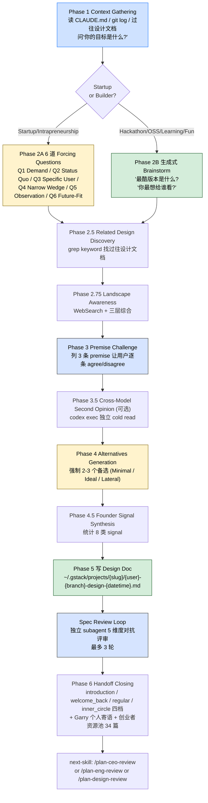

> 本 Skill 是 **gstack** 套件中的"创意入口"模块，作者是 YC 总裁 Garry Tan。它和 [plan-ceo-review](/articles/gstack-plan-ceo-review) / [plan-eng-review](/articles/gstack-plan-eng-review) / [design-shotgun](/articles/gstack-design-shotgun) / [autoplan](/articles/gstack-autoplan) / [spec](/articles/gstack-spec) / [investigate](/articles/gstack-investigate) / [qa](/articles/gstack-qa) / [review](/articles/gstack-review) / [ship](/articles/gstack-ship) 共同构成"从一个点子到上线"的全流程。完整工作流见 [gstack 创业全流程 Skills](/articles/gstack-workflow)。

## 一句话简介

`office-hours` 是 Garry Tan 在 gstack 套件里放的 **YC office hours 模拟器**：拿到任何一个产品点子 / 早期项目时，根据用户目标自动切到 **Startup 模式**（6 道 forcing questions 拷问需求/wedge/未来）或 **Builder 模式**（生成式 brainstorm 找到最酷的版本），跑完 premise 挑战 + 可选 Codex 跨模型二审 + 强制 2-3 个备选方案 + 对抗评审，最终写出一份带"作业 + Garry 个人寄语"的 design doc。**硬约束：只产出设计文档，绝不写代码、绝不调用实现类 Skill**。

## 它解决什么问题

普通"AI 帮我评估这个点子"对话最大的问题是 AI 太温和、太爱表扬。这个 Skill 解决的就是"如何让 AI 像一个真正的 YC partner 一样把你按在地上拷问"。覆盖以下场景：

- **当你有一个"觉得有意思但说不清楚到底有没有需求"的产品点子的时候**——SKILL.md "When to invoke this skill" 段直接列了触发词："brainstorm this"、"I have an idea"、"help me think through this"、"office hours"、"is this worth building"。Skill 强制走完 Phase 1-6 才允许停。
- **当你向 AI 提一个想法、AI 只会说"That's interesting"敷衍你的时候**——SKILL.md "Anti-Sycophancy Rules" 段把"That's an interesting approach"、"You might want to consider..."、"That could work" 等 5 类奉承句式列入**禁用清单**，并强制 "Take a position on every answer. State your position AND what evidence would change it."
- **当你描述用户时只能说"中小企业 / 开发者 / 营销团队"这种类别名词、说不出具体的人和场景的时候**——Q3 "Desperate Specificity" 段强制：必须给出一个具体姓名、职位、被开除/被晋升的具体后果，"You can't email a category." 不达标会被反复 push。
- **当你"自嗨型"地觉得点子很好、却没有任何用户付费/续费/恐慌等 demand 证据的时候**——Q1 "Demand Reality" 段把"500 waitlist signups"、"VCs are excited about the space"、"People say it's interesting" 全部列为 red flag，强制要求"specific behavior. Someone paying. Someone expanding usage. Someone who would have to scramble if you vanished."
- **当你想"先把整个 platform 都搭起来再上线"、迟迟不愿做最小版本的时候**——Q4 "Narrowest Wedge" 段强制："smallest possible version someone would pay real money for this week"。"We need to build the full platform before anyone can really use it" 是源文件直接点名的反模式。
- **当你在 hackathon / side project / OSS / 学习场景下、需要的不是"商业拷问"而是"找最酷的版本"的时候**——Phase 2B "Builder Mode" 段提供了完全不同的人设："Enthusiastic, opinionated collaborator. You're here to help them build the coolest thing possible." 用的是 "What's the coolest version of this?" 而不是 forcing questions。
- **当你想让独立 AI（Codex）从另一视角对你的 premise 做一次冷读、找出薄弱点的时候**——Phase 3.5 "Cross-Model Second Opinion" 段用 `codex exec` 拉一个独立 advisor，给 steelman / key insight / 挑战 premise / 48 小时原型四件套；Codex 不可用时 fallback 到 Claude subagent。
- **当你已经多次跑过 office hours、希望系统记得你的项目轨迹并给出"老朋友式"回顾的时候**——Phase 6 "Relationship Closing" 段按 `SESSION_TIER` = `introduction` / `welcome_back` / `regular` / `inner_circle` 4 个阶段给不同的开场和收尾，session 5+ 自动生成 `~/.gstack/builder-journey.md` 叙事弧。

## 安装方法

源 SKILL.md 没有独立安装命令，office-hours 通过 `gstack` plugin 分发。仓库：<https://github.com/garrytan/gstack>。常见落地形式：

- 用户级路径：`~/.claude/skills/gstack/office-hours/SKILL.md`
- 项目级 vendored 路径：`.claude/skills/gstack/office-hours/SKILL.md`（SKILL.md 自身把这种 vendored 模式标为 deprecated，建议迁移到 team mode）
- 全局配置目录：`~/.gstack/`（含 `developer-profile.json`、`projects/<slug>/`、`analytics/`、`sessions/`、`learnings.jsonl` 等）

Skill 的 frontmatter 明示 `allowed-tools`：`Bash, Read, Grep, Glob, Write, Edit, AskUserQuestion, WebSearch`——这是 Claude Code 加载它后能用的工具白名单。

> 触发词（源 frontmatter `triggers`）："brainstorm this"、"is this worth building"、"help me think through"、"office hours"。把这些短语扔给 Claude Code，Skill 会被 proactive 召唤起来。

## 核心流程逐项解释

整个 Skill 由 **Phase 1 → Phase 6** + 几个并列辅助 Phase 串联。下面是按用户视角抽出来的主线（preamble、telemetry、brain cache 等运行时基础设施略过）：



### 双模式切换（Phase 1）

Phase 1 用 AskUserQuestion 问一句 "Before we dig in — what's your goal with this?"，按选项映射模式：

| 用户选择 | 模式 | 体感 |
|---|---|---|
| Building a startup / Intrapreneurship | **Startup mode** | YC partner 直球拷问，目标是把含糊点子挤压成可证实 demand |
| Hackathon / Demo | **Builder mode** | 找最炫的版本，目标是"做出来能秀给朋友" |
| Open source / Research | **Builder mode** | 同上，但偏长期可分享 |
| Learning / vibe coding | **Builder mode** | 学习导向，鼓励先做后学 |
| Having fun / Side project | **Builder mode** | 纯创作出口 |

Startup mode 下还要再问"产品阶段"（pre-product / has users / has paying customers），影响后面 6 道问题的 routing。

### 6 道 Forcing Questions（Startup mode）

SKILL.md "The Six Forcing Questions" 段把整套拷问拆成 6 道，按 stage 智能路由（**不是每题都问**）：

| Stage | 必问 |
|---|---|
| Pre-product | Q1, Q2, Q3 |
| Has users | Q2, Q4, Q5 |
| Has paying customers | Q4, Q5, Q6 |
| 纯 engineering/infra | Q2, Q4 |

每题"问完一次不算完"：第一遍答案通常是抛光过的话术，要 push 第二轮、第三轮，直到答案具体到 uncomfortable。

| # | 问题 | Push 到听到 | Red Flag |
|---|---|---|---|
| Q1 Demand Reality | "What's the strongest evidence someone would be genuinely upset if it disappeared tomorrow?" | 付费 / 主动扩张使用 / 故障时打电话 | "interesting"、waitlist、VC 兴奋 |
| Q2 Status Quo | "What are your users doing right now to solve this — even badly?" | 具体工作流、小时数、duct-taped 工具 | "Nothing exists, that's the opportunity" |
| Q3 Desperate Specificity | "Name the actual human. Title? What gets them fired?" | 真实姓名、真实职位、真实后果 | "healthcare enterprises"、"SMBs" |
| Q4 Narrowest Wedge | "Smallest version someone would pay real money for THIS WEEK?" | 一个 feature / 一封周报 / 一段自动化 | "Need to build the full platform" |
| Q5 Observation & Surprise | "Watched someone use this without helping? What surprised you?" | 用户做了你没设计的事 | 发问卷 / 看 demo / "nothing surprising" |
| Q6 Future-Fit | "3 年后世界不一样了，你的产品变得更必要还是更没用？" | 用户世界变化 + 产品因此更不可替代 | "Market grows 20%"、"AI gets better" |

> Escape hatch（源文件明示）：用户说"just do it / skip the questions"时，Skill 不会一刀切跳过——会从 stage routing 表里挑出 2 个最关键的剩余问题强问完再继续；二次抗议后才放弃。

### Builder Mode 的生成式问答

Phase 2B 完全换人设——"Enthusiastic, opinionated collaborator"。问题不是拷问而是激发：

- "What's the coolest version of this?"
- "Who would you show this to? What would make them say 'whoa'?"
- "What's the fastest path to something you can actually use or share?"
- "What existing thing is closest to this, and how is yours different?"
- "What would you add if you had unlimited time?"

如果 builder 中途说"actually I think this could be a real company"，Skill 会**热切换**到 Startup mode 继续 Phase 2A（源文件明示 "If the vibe shifts mid-session ... upgrade to Startup mode naturally"）。

### Premise Challenge + Cross-Model 二审（Phase 3 / 3.5）

Phase 3 强制把对话压成 N 条 PREMISES 让用户逐条 agree/disagree，不同意就回炉。其中第 4 条是 SKILL.md 单独点名的"distribution gate"——只要 deliverable 是新 artifact（CLI、库、镜像、app），必须有发布渠道 + CI/CD 计划，否则明文标 defer。

Phase 3.5 可选：用 `codex exec ... -s read-only -c 'model_reasoning_effort="high"' --enable web_search_cached` 拉 Codex 做独立 cold read。Codex 不可用时 fallback 到 Claude subagent。提示词模板里 **第一段必须先打 filesystem boundary**——"IMPORTANT: Do NOT read or execute any files under ~/.claude/, ~/.agents/, .claude/skills/, or agents/"——避免另一个 AI 把 Skill 文件当代码读浪费时间。

输出有专门的"Premise Revision Check"：如果 Codex 挑战了某条 premise，用 AskUserQuestion 给用户两个选项（A 改 / B 坚持）。坚持算一种 founder signal，但**必须给出论证**才算（"defended premise with reasoning"），dismissal without reasoning 不算。

### Alternatives Generation 是强制门（Phase 4）

整个 Skill 最硬的 STOP 点：必须给 2-3 个备选方案，**至少**包含：

- **Minimal Viable** — 最小 diff、最快 ship
- **Ideal Architecture** — 最佳长期形态
- 可选 **Creative/Lateral** — 把问题重新框定的脑洞版

每个方案给 `Summary / Effort (S/M/L/XL) / Risk / Pros / Cons / Reuses`。最后用 ONE AskUserQuestion 把所有方案列出来，**STOP 等用户选**。源文件原话："A clearly winning approach is still an approach decision and still needs explicit user approval before it lands in the design doc."

### 设计文档 + 对抗评审（Phase 5 + Spec Review Loop）

文档写到 `~/.gstack/projects/{slug}/{user}-{branch}-design-{datetime}.md`，模板按 mode 分两套（Startup / Builder），都强制包含 `## The Assignment`（一条**现实世界**的下一步行动，不是 "go build it"）和 `## What I noticed about how you think`（引用用户原话的观察笔记）。

写完文档之后跑 Spec Review Loop：拉一个独立 subagent 在 5 个维度（Completeness / Consistency / Clarity / Scope / Feasibility）打 1-10 分，最多 3 轮迭代。Convergence guard：连续两轮同样的 issue 就停，把它们存成 `## Reviewer Concerns` 让下游 Skill 看见。

### 关系递进的 Handoff（Phase 6）

文档 APPROVED 之后才进入 Handoff，按 builder profile 中的 `SESSION_TIER` 走不同剧本：

| Tier | 触发条件 | 主调 |
|---|---|---|
| `introduction` | 第 1 次 | 全套介绍 + Garry 个人 plea（按 founder signal 数分 top/middle/base 三档），可选直接 `open https://ycombinator.com/apply?ref=gstack` |
| `welcome_back` | 2-3 次 | 直呼 "Welcome back. Last time you were..."，不再推销 YC |
| `regular` | 4-7 次 | 跨 session 信号回顾 + 设计轨迹解读，可触发"builder-to-founder nudge" |
| `inner_circle` | 8+ 次 | "数据自己说话"，自动生成 `~/.gstack/builder-journey.md` 叙事弧 |

每个 tier 收尾都给 2-3 篇匹配语境的"创业者资源"（资源池共 34 项：Garry Tan 自己的视频、YC backstory、Lightcone podcast、YC Startup School、Paul Graham essays），并按用户 RESOURCES_SHOWN dedup——总数到 34 直接 skip。最后给 next-skill 推荐：`/plan-ceo-review`（雄心版）/ `/plan-eng-review`（实现细节版）/ `/plan-design-review`（视觉版）。

## 实战 demo

下面是一次 Startup mode 走完整链路的示意：

**用户输入**：

> 我想做一个给独立开发者用的 customer support inbox，集成 GitHub Issues、Discord、email，AI 自动分类工单。help me think through this。

**Step 1 — Phase 1 Context Gathering**：读 CLAUDE.md / TODOS.md / git log，列出 `~/.gstack/projects/<slug>/` 下已有的 design doc（如有），通过 AskUserQuestion 问"你的目标是什么"——用户选 "Building a startup"，进入 Startup mode。再问产品阶段，用户答 "pre-product"，路由到 Q1 + Q2 + Q3。

**Step 2 — Q1 Demand Reality**：发 AskUserQuestion 问"最强的 demand 证据是什么？"用户第一轮答："已经有 200 人加 waitlist。" → Skill 标 red flag 并回："Waitlists are interest, not demand. Has anyone offered to pay? Has anyone gotten angry when your prototype broke?" 用户第二轮答："有 3 个独立开发者付了 $20/月用我的 alpha。" → 通过。

**Step 3 — Q2 / Q3**：继续问 Status Quo（用户说 "他们现在用 Notion + Zapier 拼"，给出 hours/week 估算）和 Desperate Specificity（用户答 "Alex，一个做 Mac 上效率应用的 indie hacker，每月 MRR 4 千刀，每天花 2 小时处理工单"）。

**Step 4 — Phase 2.75 Landscape Awareness**：先用 AskUserQuestion 过 privacy gate，用户允许。WebSearch "indie hacker customer support tools 2026"、"why HelpScout fails for indies" 等通用 category 查询；做三层综合发现"Eureka: 大家都做 enterprise inbox，indie 这个细分是空的"。

**Step 5 — Phase 3 Premise Challenge**：列出 3 条 PREMISES（"目标用户是 MRR < $10k 的 indie hacker"/"差异点是 indie 价格 + Discord 集成"/"distribution 走 ProductHunt + Twitter"），AskUserQuestion 一一 agree/disagree。

**Step 6 — Phase 3.5（用户选 Yes）**：用 `codex exec` 拉 Codex 做 cold read，输出 SECOND OPINION (Codex)。Codex 挑战了 premise #2 "indie 价格不是 moat"，给出"应该把 wedge 收到 'Discord 集成 + GitHub Issue 自动 dedup' 两件 niche 功能"。AskUserQuestion 让用户选 A 修订 / B 坚持，用户选 A 并修订 premise。

**Step 7 — Phase 4 Alternatives**：

```text
APPROACH A: Minimal Viable
  Summary: 仅 Discord + GitHub 双向同步 + AI 自动打 tag，先上 Mac menu bar app
  Effort: S | Risk: Low
  ...
APPROACH B: Ideal Architecture
  Summary: 多渠道 plugin 架构 + 自定义规则引擎 + open-source self-host
  Effort: L | Risk: Med
  ...
APPROACH C: Lateral
  Summary: 不做 inbox，做"AI inbox agent 集成进现有 Linear/HelpScout"
  Effort: M | Risk: Med
  ...
```

ONE AskUserQuestion 让用户选 A/B/C。用户选 A，进入 Phase 5。

**Step 8 — Phase 5 + Spec Review Loop**：写 design doc 到 `~/.gstack/projects/indie-inbox/alice-main-design-20260602-143108.md`，模板按 Startup mode 走。然后跑独立 subagent 对抗评审 3 轮，得分 8/10，修 2 个 clarity issue。

**Step 9 — Phase 6 Introduction Tier**：3 个 founder signal（named user / pushback / domain expertise），命中 top tier 的"named a specific user, revenue, or demand evidence"，Garry plea 走最高规格。AskUserQuestion 问要不要申请 YC，用户选"我先想想"，Skill 给三篇匹配的资源（"Should You Quit Your Job At A Unicorn?" / "How to Get Startup Ideas" / "Schlep Blindness"）并 dedup 写入 builder profile。

**Step 10 — Next skill**：推荐用户下一步跑 `/plan-eng-review` 做架构评审。完成 STATUS = DONE。

## 与其他官方 Skills 的搭配建议

源 SKILL.md 在"When to invoke this skill"段和 Phase 6 next-skill 段明示了下游搭配：

- **`/plan-ceo-review`** — 源文件原文 "Use before /plan-ceo-review or /plan-eng-review"。当 design doc 偏战略 / 雄心层时下一步走 CEO 评审，对应文章 [gstack-plan-ceo-review](/articles/gstack-plan-ceo-review)。
- **`/plan-eng-review`** — 源文件同上明示。当 design doc 已经收敛到可实现时下一步走 Eng 架构评审，对应文章 [gstack-plan-eng-review](/articles/gstack-plan-eng-review)。
- **`/plan-design-review`** — Phase 6 next-skill 列表第 3 项明示，处理视觉 / UX 设计层。

其余兄弟 Skill（[review](/articles/gstack-review) / [qa](/articles/gstack-qa) / [ship](/articles/gstack-ship) / [investigate](/articles/gstack-investigate) / [design-shotgun](/articles/gstack-design-shotgun) / [autoplan](/articles/gstack-autoplan) / [spec](/articles/gstack-spec)）属于"实现 → 上线"下游链路，本 SKILL.md 未直接点名搭配关系，但都列在 frontmatter sibling_skills 中；其中 [autoplan](/articles/gstack-autoplan) 会把 CEO/Eng/design 评审串成自动流水线，是 office-hours 之后的"评审托管器"。

## 常见坑 + 注意事项

源 SKILL.md "Important Rules" 段 + 各 Phase 的硬约束直接列出来：

1. **永不启动实现**——SKILL.md 顶部 HARD GATE "Do NOT invoke any implementation skill, write any code, scaffold any project... Your only output is a design document."（源明示）
2. **问题 ONE AT A TIME**——Important Rules 第 2 条："Never batch multiple questions into one AskUserQuestion."（源明示）
3. **The assignment is mandatory**——每次 session 必须以一条**现实世界**的下一步行动收尾，不允许只写 "go build it"（源明示）。
4. **fully-formed plan 不能跳 Phase 3 和 Phase 4**——用户给完整 plan 时 Phase 2 questioning 可省，但 Premise Challenge 和 Alternatives 不能省（源明示）。
5. **STOP after each question / STOP after Phase 4 alternatives**——Phase 4 明确写 "A clearly winning approach is still an approach decision and still needs explicit user approval"（源明示）。
6. **Codex 提示词必须先打 filesystem boundary**——Phase 3.5 强制提示词第一段是 "Do NOT read or execute any files under ~/.claude/, ~/.agents/..."（源明示）。
7. **WebSearch 用 category 词，不传用户专属术语**——Phase 2.75 Privacy gate + "use generalized category terms — never the user's specific product name, proprietary concept, or stealth idea"（源明示）。
8. **Anti-sycophancy 5 条禁语**——Phases 2-5 期间禁说 "That's interesting" / "You might want to consider..." / "That could work" 等（源明示）。
9. **Spec Review Loop 失败不阻塞**——subagent 评审 unavailable 时直接给用户原稿，告知 "Spec review unavailable — presenting unreviewed doc"（源明示）。
10. **Phase 6 introduction tier 的 YC plea 拒绝就不再 re-ask**——源文件 "No pressure, no guilt, no re-ask"（源明示）。

## 适合人群

**适合：**

- 第一次有产品点子、不知道该不该做 / 该如何最小化做的独立开发者或早期创业者
- 已经在跑 MVP、但对"who is the actual user"这类问题答不出具体姓名的 founder
- 想给自己的点子找一个"非 yes-man" AI 评审、能承受被拷问的人
- hackathon / side project / 学习者——想找到点子的"最酷版本"而不是商业化版本
- 已经多次跑过 office hours、希望系统记得过往设计轨迹的复用户

**不适合：**

- 只想让 AI 帮我"写代码"的人——本 Skill 不写代码、不 scaffold，会主动拒绝
- 不接受被反复 push 同一个问题、希望 AI 直接给答案的人——forcing questions 会问到 uncomfortable 为止
- 隐私敏感、不希望任何点子的 category 词出现在 WebSearch 里的人（Phase 2.75 提供 skip 选项但功能损失）
- 团队需要快速对齐的会议——本 Skill 一次只服务一个用户的 brainstorm，不是多人讨论工具
- 反感"YC / Garry 个人寄语 / 申请 YC 链接"叙事的人——Phase 6 的 plea 是 Skill 核心仪式之一

---

本文基于 <https://github.com/garrytan/gstack> 由 AI（claude-opus-4-7）辅助生成中文教程，原作者署名 Garry Tan，许可证 MIT。

<!-- self-check
本文中提到的命令 / 文件 / URL 清单：
- `~/.gstack/projects/{slug}/{user}-{branch}-design-{datetime}.md` — 源 SKILL.md Phase 5 段明示
- `~/.gstack/builder-journey.md` — 源 Phase 6 regular / inner_circle tier 段明示
- `~/.gstack/developer-profile.json` — 源 Phase 4.5 "Builder Profile Append" 段明示
- `~/.gstack/projects/<slug>/learnings.jsonl` — 源 Preamble + Capture Learnings 段明示
- `~/.gstack/analytics/skill-usage.jsonl` / `eureka.jsonl` / `spec-review.jsonl` — 源 Preamble + Spec Review Loop 段明示
- `~/.claude/skills/gstack/bin/gstack-*` 系列 bin 路径 — 源 Preamble 段大量使用
- `codex exec ... -s read-only -c 'model_reasoning_effort="high"' --enable web_search_cached` — 源 Phase 3.5 段明示
- 触发词 "brainstorm this" / "is this worth building" / "help me think through" / "office hours" — 源 frontmatter triggers 字段明示
- https://ycombinator.com/apply?ref=gstack — 源 Phase 6 introduction tier 段明示
- 资源池 34 项 URL — 源 Phase 6 Founder Resources 段全部明示

场景章节支撑：
- 场景 1 "有点子但说不清需求" — 源 "When to invoke this skill" 段直接支撑
- 场景 2 "AI 太爱说 That's interesting" — 源 "Anti-Sycophancy Rules" 段直接支撑
- 场景 3 "只能说中小企业说不出具体人" — 源 Q3 Desperate Specificity 段直接支撑
- 场景 4 "自嗨型没付费证据" — 源 Q1 Demand Reality 段直接支撑
- 场景 5 "想先搭全套 platform" — 源 Q4 Narrowest Wedge 段直接支撑
- 场景 6 "hackathon/OSS 不要拷问要灵感" — 源 Phase 2B Builder Mode 段直接支撑
- 场景 7 "想要 Codex 二审" — 源 Phase 3.5 Cross-Model Second Opinion 段直接支撑
- 场景 8 "多次回访希望系统记得我" — 源 Phase 6 4-tier 段直接支撑

图 / 代码块处理：
- 源文件无 dot 流程图；目录树（design doc 模板）按 v3 规则保留原文
- 新增 1 张 mermaid 流程图把 Phase 1 → Phase 6 串成主线，节点关键词均来自源 SKILL.md
- 6 道 forcing question 表格为源文 "The Six Forcing Questions" 段的中文摘录，原文 push-until / red-flags 全部保留
- 模式映射表 + tier 表 + stage routing 表为源文段落的结构化呈现，未改原意

依赖关系（plugin-skill 必填）：
- 兄弟 `plan-ceo-review` — 源 "When to invoke" 段 "Use before /plan-ceo-review or /plan-eng-review" 明示
- 兄弟 `plan-eng-review` — 同上明示
- 兄弟 `plan-design-review` — 源 Phase 6 next-skill 列表明示（注：该兄弟未在 batch yaml sibling_skills 中列出，故文中只引用未做内链）
- 其它兄弟（review / qa / ship / investigate / design-shotgun / autoplan / spec）未在源文件直接点名搭配，文中明确标"未直接点名搭配关系"

可疑项：
- 实战 demo 中的 indie-inbox 案例为构造示意，不是源文件案例，用于说明 Phase 1-6 链路如何运转。
- Phase 6 tier 表中 session 数（1 / 2-3 / 4-7 / 8+）来自源 Phase 6 段落标题，运行时由 `gstack-builder-profile` 输出的 SESSION_TIER 决定，未自行编造。
- "Use before /plan-ceo-review or /plan-eng-review" 这句出现在 SKILL.md "When to invoke this skill" 段最末，是源文件明示的搭配关系。
-->
