> 本 Skill 是 **gstack** 套件中的"战略评审"模块，作者是 YC 总裁 Garry Tan。它和 [office-hours](/articles/gstack-office-hours) / [plan-eng-review](/articles/gstack-plan-eng-review) / [review](/articles/gstack-review) / [qa](/articles/gstack-qa) / [ship](/articles/gstack-ship) / [investigate](/articles/gstack-investigate) / [design-shotgun](/articles/gstack-design-shotgun) / [autoplan](/articles/gstack-autoplan) / [spec](/articles/gstack-spec) 共同构成"从一个点子到上线"的全流程。完整工作流见 [gstack 创业全流程 Skills](/articles/gstack-workflow)。

## 一句话简介

`plan-ceo-review` 是 Garry Tan 在 gstack 套件里放的 **CEO 视角 Plan 评审 Skill**：拿到任何一个工程 plan / 设计文档时，先做系统审计（git log / TODOS.md / 已有 design doc / 上次 handoff），然后在 **SCOPE EXPANSION / SELECTIVE EXPANSION / HOLD SCOPE / SCOPE REDUCTION** 4 种 mode 中选一种 posture，按 18 条 CEO 认知模式驱动 11 个评审 section，强制 2-3 个 implementation alternatives + Outside Voice 跨模型二审 + Plan File Review Report 必须是 plan 文件的**最后一节**。**硬约束：只评审，不写代码、不进 ExitPlanMode 直到 Report gate 全部通过**。

## 它解决什么问题

普通"AI review my plan" 对话的问题是 AI 会逐条点赞、给一份"通用 best practice"清单。这个 Skill 解决的是"如何让 AI 像一个有 taste 的 CEO + 资深架构师那样，把 plan 按场景 push 到正确的雄心 / 收敛区间"。覆盖以下场景：

- **当你有一个"工程 plan / Markdown 设计文档"但不确定应该再加点东西还是该砍掉一半的时候**——SKILL.md "Philosophy" 段直接列了 4 种 mode：EXPANSION (push UP, 建大教堂) / SELECTIVE (持平 + cherry-pick) / HOLD (持平 + bulletproof) / REDUCTION (push DOWN)。Skill 在 Step 0F 让用户显式 commit 一种 posture，全程不允许 silent drift。
- **当你害怕"AI 偷偷给我加了一堆没说过的范围 / 砍掉了我想要的功能"的时候**——SKILL.md Philosophy "Critical rule" 段明示："In ALL modes, the user is 100% in control. Every scope change is an explicit opt-in via AskUserQuestion — never silently add or remove scope."每个 scope 增删都必须走单独的 AskUserQuestion。
- **当你想给 plan 找出"什么会让它沉默失败 / 错误路径名字叫什么 / 数据流的影子路径在哪"的时候**——Prime Directive 1-3 强制"Zero silent failures / Every error has a name / Data flows have shadow paths"。Section 2 Error & Rescue Map 段强制对每个新 method / codepath 都填一张 `WHAT CAN GO WRONG | EXCEPTION CLASS` 表，禁止 catch-all。
- **当 plan 涉及到 UI / UX 但 plan 本身没写设计细节、想让评审顺便覆盖前端的时候**——Frontend/UI Scope Detection 段自动判别 DESIGN_SCOPE，Section 11 自动跑设计与 UX 评审；评审完还可以推到 `/plan-design-review`。
- **当你想让独立 AI（Codex）从另一个视角对你的 plan 做一次冷读、找出 review 自己漏看的盲点的时候**——"Outside Voice — Independent Plan Challenge" 段用 `codex exec` 拉一个独立 reviewer，要求"NOT to repeat that review. Instead, find what it missed"。Codex 不可用时 fallback 到 Claude subagent；找到 cross-model tension 用 AskUserQuestion 让用户做选择。
- **当你想把"plan 评审结果"作为下次回看的依据、并被下游 `/plan-eng-review` 和 `/ship` 看见的时候**——Plan File Review Report 段强制把 GSTACK REVIEW REPORT 写到 plan 文件**最后一节**（不是 mid-file），并通过 `gstack-review-log` JSONL 给下游 Skill 读。EXIT PLAN MODE GATE 段把这条做成 blocking 自检——不通过不允许 ExitPlanMode。
- **当 plan 是个 greenfield feature / 重大架构变更、需要"梦想态 mapping"的时候**——0C Dream State Mapping 段强制写 `CURRENT → THIS PLAN → 12-MONTH IDEAL` 三段，0D EXPANSION 模式还会跑 10x check + Platonic Ideal + 至少 5 个 Delight Opportunities，最后通过 0D-POST 把 CEO Plan 持久化到 `~/.gstack/projects/$SLUG/ceo-plans/{date}-{feature-slug}.md`。

## 安装方法

源 SKILL.md 没有独立安装命令，plan-ceo-review 通过 `gstack` plugin 分发。仓库：<https://github.com/garrytan/gstack>。常见落地形式：

- 用户级路径：`~/.claude/skills/gstack/plan-ceo-review/SKILL.md`
- 项目级 vendored 路径：`.claude/skills/gstack/plan-ceo-review/SKILL.md`
- 全局配置目录：`~/.gstack/`（含 `projects/<slug>/ceo-plans/`、`analytics/`、`learnings.jsonl` 等）

Skill frontmatter `allowed-tools` 含 `Bash, Read, Grep, Glob, Write, Edit, AskUserQuestion, WebSearch, Agent`。注意需要 `Agent` 工具——Spec Review Loop 和 Outside Voice fallback 都依赖 subagent dispatch。

> 触发：当用户处于 plan mode + 给出一个 plan / design doc + 调用 `/plan-ceo-review`（或 sibling `/autoplan` 自动串联到它）时启动。

## 核心流程逐项解释

整个 Skill 由 **Pre-Audit → Step 0 (Premise / Alternatives / Mode) → 11 Sections → Outside Voice → Required Outputs → Review Readiness Dashboard → Plan File Review Report → EXIT GATE** 串联。下面是按用户视角抽出来的主线（telemetry、brain cache、calibration write-back 略过）：

```mermaid
flowchart TB
    audit["Pre-Review System Audit<br/>git log / TODOS.md / 已有 design doc /<br/>handoff note"]:::primary
    offer{无 design doc?<br/>Offer /office-hours}
    s0a["0A Premise Challenge<br/>3 问 (right problem / outcome / do-nothing)"]
    s0b["0B Existing Code Leverage<br/>把每个 sub-problem 映射到已有代码"]
    s0c["0C Dream State Mapping<br/>CURRENT → THIS PLAN → 12-MONTH IDEAL"]
    s0c2["0C-bis Implementation Alternatives<br/>强制 2-3 个 (Minimal / Ideal / Lateral)"]:::warn
    s0d["0D Mode-Specific Analysis<br/>10x check + Platonic Ideal + Delight ops"]
    s0d2["0D-POST Persist CEO Plan<br/>~/.gstack/projects/$SLUG/ceo-plans/<br/>{date}-{slug}.md + Spec Review Loop"]:::ok
    s0e["0E Temporal Interrogation<br/>HOUR 1 / 2-3 / 4-5 / 6+"]
    s0f["0F Mode Selection<br/>EXPANSION / SELECTIVE / HOLD / REDUCTION"]:::gate
    sec["Sections 1-11<br/>(Arch / Error / Sec / Data / Code /<br/>Test / Perf / Obs / Deploy / Long-Term / Design)"]:::warn
    voice["Outside Voice (optional)<br/>codex exec --enable web_search_cached<br/>filesystem boundary + cross-model tension"]:::gate
    out["Required Outputs<br/>NOT in scope / What exists / Dream delta /<br/>Error & Rescue Registry / Diagrams"]
    dash["Review Readiness Dashboard +<br/>GSTACK REVIEW REPORT 写到 plan 末尾"]
    gate["EXIT PLAN MODE GATE<br/>Report 必须是文件最后一节"]:::gate
    next["next: /plan-eng-review (required)<br/>or /plan-design-review (UI scope)"]

    audit --> offer
    offer -- skip --> s0a
    offer -- /office-hours --> s0a
    s0a --> s0b --> s0c --> s0c2 --> s0d --> s0d2 --> s0e --> s0f --> sec --> voice --> out --> dash --> gate --> next

    classDef ok fill:#d4edda,stroke:#155724,color:#000
    classDef warn fill:#fff3cd,stroke:#856404,color:#000
    classDef primary fill:#cfe2ff,stroke:#0d6efd,color:#000
    classDef gate fill:#d6e4ff,stroke:#333,color:#000
```



### 4 种 Mode（Step 0F + Mode Quick Reference 表）

SKILL.md "Mode Quick Reference" 段给了一张完整对照表（节选自源 SKILL.md）：

| 维度 | EXPANSION | SELECTIVE | HOLD SCOPE | REDUCTION |
|---|---|---|---|---|
| Scope posture | Push UP（opt-in） | Hold + offer cherry-picks | Maintain | Push DOWN |
| Recommend 态度 | Enthusiastic | Neutral | N/A | N/A |
| 10x check | Mandatory | Surface as cherry-pick | Optional | Skip |
| Platonic ideal | Yes | No | No | No |
| Delight opps | Opt-in ceremony | Cherry-pick ceremony | Note if seen | Skip |
| 复杂度问题 | "Is it big enough?" | "Is it right + what else is tempting?" | "Is it too complex?" | "Is it the bare minimum?" |
| Taste calibration | Yes | Yes | No | No |
| Temporal interrogate | Full (hr 1-6) | Full (hr 1-6) | Key decisions only | Skip |
| 可观测性 | "Joy to operate" | "Joy to operate" | "Can we debug it?" | "Can we see if it's broken?" |
| Deploy 标准 | Infra as feature scope | Safe deploy + cherry-pick risk check | Safe deploy + rollback | Simplest possible deploy |
| Error map | Full + chaos scenarios | Full + chaos for accepted | Full | Critical paths only |
| CEO plan | Written | Written | Skipped | Skipped |
| Design (Sec 11) | "Inevitable" UI review | If UI scope detected | If UI scope detected | Skip |

**Context-dependent 默认**（0F 段）：

- Greenfield feature → 默认 EXPANSION
- 已有系统 enhancement → 默认 SELECTIVE EXPANSION
- Bug fix / hotfix / refactor → 默认 HOLD SCOPE
- Plan 触及 > 15 个文件 → 建议 REDUCTION
- 用户说 "go big" / "cathedral" → 直接 EXPANSION 不再问
- 用户说 "hold scope but tempt me" / "cherry-pick" → 直接 SELECTIVE EXPANSION

### 9 条 Prime Directives + 18 条 CEO 认知模式

Prime Directives 段（钉死的硬约束）：

1. Zero silent failures——可静默就是 critical defect
2. Every error has a name——禁止 "handle errors" 这种泛泛而谈
3. Data flows have shadow paths——happy / nil / empty / upstream error 四条都要 trace
4. Interactions have edge cases——double-click / navigate-away / 慢网 / stale state / back button
5. Observability is scope, not afterthought
6. Diagrams are mandatory——非 trivial 流程必须 ASCII 画出来
7. Everything deferred must be written down——TODOS.md or it doesn't exist
8. Optimize for the 6-month future, not just today
9. **You have permission to say "scrap it and do this instead."**

18 条 CEO Cognitive Patterns（"Cognitive Patterns — How Great CEOs Think" 段，节选）：

| # | Pattern | 一句话 |
|---|---|---|
| 1 | Classification instinct | Bezos one-way / two-way doors，多数事是 two-way |
| 2 | Paranoid scanning | Grove: "Only the paranoid survive" |
| 3 | Inversion reflex | Munger: "what would make us fail?" |
| 4 | Focus as subtraction | Jobs: 350 → 10 个产品 |
| 5 | People-first sequencing | Horowitz: 人 → 产品 → 利润 |
| 6 | Speed calibration | Bezos: 70% 信息就可以决策 |
| 7 | Proxy skepticism | Bezos Day 1: 指标是否还在服务用户 |
| 8 | Narrative coherence | 难决策需要清晰 framing |
| 9 | Temporal depth | Bezos: 80 岁后悔最小化 |
| 10 | Founder-mode bias | Chesky/Graham: 深度参与 vs 微管理 |
| 11 | Wartime awareness | Horowitz: 别拿和平时期习惯打仗 |
| 12 | Courage accumulation | "The struggle IS the job" |
| 13 | Willfulness as strategy | Altman: 大多数人放弃太早 |
| 14 | Leverage obsession | Altman: 技术是终极杠杆 |
| 15 | Hierarchy as service | UI: "用户该先看到什么、再看到什么" |
| 16 | Edge case paranoia (design) | 47 字符名字、零结果、网络中断 |
| 17 | Subtraction default | Rams: "As little design as possible" |
| 18 | Design for trust | 每个 UI 决策要么建立要么侵蚀信任 |

源 SKILL.md 反复强调："These are not checklist items. They are thinking instincts."不要逐条勾选，要内化成 review 时的思维反射。

### 11 节评审 Section（强制全跑）

"Review Sections" 段开门见山一条"Anti-skip rule"：**Never condense, abbreviate, or skip any review section (1-11) regardless of plan type**。即使 plan 只是策略文档也要走 11 节，"strategy doc 所以不评 implementation" 永远是错的。

| # | 名字 | 重点 |
|---|---|---|
| 1 | Architecture | dependency graph / 4 条 data flow / state machine / coupling / scaling / SPoF / rollback |
| 2 | Error & Rescue Map | 每个新 method 填表 (WHAT CAN GO WRONG \| EXCEPTION CLASS)，禁止 catch-all |
| 3 | Security & Threat Model | auth boundaries / data access / new endpoints |
| 4 | Data Flow & Interaction Edge Cases | 4 路径 + 交互边界 |
| 5 | Code Quality | DRY / 命名 / 抽象层次 / 测试性 |
| 6 | Test Review | 单元 / 集成 / e2e 覆盖 + 失败场景 |
| 7 | Performance | 10x / 100x 负载下首先坏掉的地方 |
| 8 | Observability & Debuggability | logs / metrics / traces / dashboards |
| 9 | Deployment & Rollout | feature flag / 渐进发布 / rollback |
| 10 | Long-Term Trajectory | 6 个月后还能不能维护 |
| 11 | Design & UX | 自动按 DESIGN_SCOPE 判断是否跑 |

每节强制 STOP 规则：**One issue = one AskUserQuestion call**，不允许把多个 findings 合并到一个问题。零发现可以说 "No issues, moving on"，但有发现就必须 AskUserQuestion——"obvious fix" 也算 finding。

> "Anti-shortcut clause"：把所有 findings 一次性写进 plan 文件然后直接 ExitPlanMode 是源文件明确点名的 **May 2026 transcript bug**——发现问题 → 倒进 plan → 略过用户交互，是该 Skill 反对的核心错误模式。

### 0C-bis Implementation Alternatives（强制门）

Step 0C-bis 是另一道硬 STOP：必须给 2-3 个 implementation approaches，**两个必有**：

- **Minimal viable**（最少文件、最小 diff）
- **Ideal architecture**（最佳长期形态）
- 可选第三种（脑洞 / lateral）

每个 approach 给 `Summary / Effort (S/M/L/XL) / Risk / Pros / Cons / Reuses`，然后 ONE AskUserQuestion 让用户拍板。源文件明示："These two approaches have equal weight. Don't default to 'minimal viable' just because it's smaller."

### 0D-POST 持久化 CEO Plan + Spec Review Loop

EXPANSION 和 SELECTIVE EXPANSION 模式下，opt-in ceremony 跑完必须把 CEO Plan 写到 `~/.gstack/projects/$SLUG/ceo-plans/{date}-{feature-slug}.md`，模板含 frontmatter `status: ACTIVE`、Vision (10x Check + Platonic Ideal)、Scope Decisions 表、Accepted / Deferred 两段。

写完跑 Spec Review Loop：拉独立 subagent 在 5 维度（Completeness / Consistency / Clarity / Scope / Feasibility）打 1-10 分，最多 3 轮。Convergence guard：连续两轮同样的 issue 就停，写入 `## Reviewer Concerns`。Subagent 失败时直接告诉用户 "Spec review unavailable — presenting unreviewed doc"，**不阻塞**。

### Outside Voice 跨模型二审

11 节跑完后用 AskUserQuestion 提供选项 "想要 Outside Voice 吗"。RECOMMENDATION 直接写明：A=9/10, B=7/10，强烈推荐 A。

选 A 时构造 prompt——**第一段必须是 filesystem boundary**："IMPORTANT: Do NOT read or execute any files under ~/.claude/, ~/.agents/, .claude/skills/, or agents/."然后用：

```bash
codex exec "<prompt>" -C "$_REPO_ROOT" -s read-only \
  -c 'model_reasoning_effort="high"' --enable web_search_cached
```

5 分钟 timeout。Codex 输出完整 verbatim 贴出来（不允许 summarize），然后扫描 cross-model tension：review 说 X、outside voice 说 Y 的地方逐条用 AskUserQuestion 让用户选 A 接受 / B 拒绝 / C 再查 / D defer 到 TODOS.md。

> "User Sovereignty"：Do NOT auto-incorporate outside voice recommendations into the plan. 不允许"我同意 outside voice 所以我直接改"——必须让用户点头。

### Review Readiness Dashboard + Plan File Review Report

跑完所有 section + outside voice 后，从 `~/.gstack/analytics/review-log.jsonl` 读最近 7 天的 reviews，按 verdict 规则：

- **CLEARED**：Eng Review 在 7 天内有 status="clean"（或 skip_eng_review=true）
- **NOT CLEARED**：Eng Review missing / 过期 / 有 open issues
- CEO / Design / Codex 只展示，永不 block

然后把 GSTACK REVIEW REPORT 写到 plan 文件——按 SKILL.md "Plan File Review Report" 段，**必须是文件最后一节**：

1. 读 plan 找已有的 `## GSTACK REVIEW REPORT`
2. 找到则 Edit 删除整段（从 heading 到下个 `## ` 或文件末尾）
3. 删完（或本来就没）再 append 新的 section 到文件末尾
4. Read 验证 `## GSTACK REVIEW REPORT` 确实是最后的 `## ` heading

> "Do NOT replace the section in place. The 'replace mid-file' path is what allowed prior versions to leave the report mid-file when an older report already lived there — the user then sees a plan whose review report is not at the bottom and (correctly) rejects it."这是源文件明确点名的反模式。

### EXIT PLAN MODE GATE（BLOCKING）

最后一道关。在 ExitPlanMode 前必须自检：

1. Read plan 文件确认最新内容
2. 确认 LAST `## ` heading 是 `## GSTACK REVIEW REPORT`（in-body prose mention 不算）
3. 确认 report 含 Runs / Status / Findings 表 + VERDICT 行 + CODEX / CROSS-MODEL / UNRESOLVED 行
4. 如果 plan 文件在 context 中，确认 `gstack-review-log` 已调用、`gstack-review-read` 至少跑过一次

任何一条失败都不允许 ExitPlanMode。源文件原话："Failing this gate and calling ExitPlanMode anyway is a contract violation."

## 实战 demo

下面是一次 SCOPE EXPANSION 模式跑完整链路的示意：

**用户请求**：

> 我在 plan mode 里有一份"加一个团队协作的实时白板"的 plan，帮我跑 `/plan-ceo-review`。

**Step 1 — Pre-Audit**：跑 git log -30 / git diff --stat / TODOS.md / CLAUDE.md，运行 design doc check 发现 `~/.gstack/projects/whiteboard-app/alice-feat-realtime-design-20260601-110203.md` 存在（office-hours 跑过），读它作为 source of truth。无 handoff note，跳过 Prerequisite Skill Offer。

**Step 2 — 0A Premise Challenge**：3 问 ("right problem?" / "actual outcome?" / "do nothing?")。用户说"用户痛点是异步设计协作慢"，pass。

**Step 3 — 0B Existing Code Leverage**：grep 找已有 WebSocket infra，发现项目已经有 `lib/realtime/channel.ts`。映射 "实时同步" sub-problem → 复用现有 channel。

**Step 4 — 0C Dream State Mapping**：写出 `CURRENT (异步 Figma 嵌入) → THIS PLAN (Liveblocks-style 协作) → 12-MONTH IDEAL (full real-time canvas + presence + voice chat)`。

**Step 5 — 0C-bis Implementation Alternatives**：

```text
APPROACH A: Minimal Viable
  Summary: 复用现有 channel + 单一画布层，无 presence
  Effort: S | Risk: Low | Reuses: lib/realtime/channel.ts
APPROACH B: Ideal Architecture
  Summary: Yjs CRDT + presence + 自定义 cursor 渲染层
  Effort: L | Risk: Med
APPROACH C: Lateral
  Summary: 不自建，集成 Liveblocks SaaS
  Effort: M | Risk: Low (vendor lock-in)
```

ONE AskUserQuestion 让用户选。用户选 B，进入 0D。

**Step 6 — 0D EXPANSION 分析**：跑 10x check（"是否能变成 collaborative product canvas，跨页面同步"）、Platonic Ideal（"零延迟、零冲突、感觉像本地"）、至少 5 个 Delight Opportunities（cursor 名字 hover / 选区颜色 / replay 模式 / voice memo / 心跳脉冲）。Expansion opt-in ceremony 每条单独 AskUserQuestion。用户接受 3 条加入 scope，2 条 defer 到 TODOS.md。

**Step 7 — 0D-POST 写 CEO Plan**：写到 `~/.gstack/projects/whiteboard-app/ceo-plans/2026-06-02-realtime-whiteboard.md`，跑 Spec Review Loop 3 轮，得分 8/10，修 2 个 clarity issue。

**Step 8 — 0E Temporal Interrogation**：HOUR 1 决定 CRDT 库（Yjs vs Automerge）、HOUR 2-3 决定 presence 数据 schema、HOUR 4-5 决定 reconnect 策略、HOUR 6+ 决定 e2e 测试矩阵。每条 AskUserQuestion 让用户拍板。

**Step 9 — 0F Mode Selection**：用户已经走 EXPANSION 流程，确认 commit。

**Step 10 — Sections 1-11**：逐节跑。Section 1 画 dependency graph 发现"presence service 和 storage service 没有 boundary"，AskUserQuestion 让用户决定加 boundary。Section 2 给 Yjs document update / presence broadcast / reconnect 三类写 Error & Rescue 表，flag 一条 catch-all：`catch (e) { /* swallow */ }`。Section 11（DESIGN_SCOPE 触发）评审 cursor 与 selection 的视觉一致性。

**Step 11 — Outside Voice**：用户选 A，跑 Codex 5 分钟。Codex 挑战："你们 Yjs 的 awareness payload 没有限速，恶意客户端可以 DOS。"AskUserQuestion 让用户决定加 rate limit。

**Step 12 — Review Readiness Dashboard + Plan File Review Report**：dashboard 显示 CEO 已跑 / Eng Review 未跑 / Design 未跑；verdict = NOT CLEARED (需要 eng review)。GSTACK REVIEW REPORT 写到 plan 文件末尾。

**Step 13 — EXIT GATE**：自检 4 条都过，允许 ExitPlanMode。Next-step 推荐 `/plan-eng-review`。

## 与其他官方 Skills 的搭配建议

源 SKILL.md 在 "Next Steps — Review Chaining" 段明示了下游搭配：

- **`/plan-eng-review`** — 源文件原文 "Recommend /plan-eng-review if eng review is not skipped globally"。除非用户设了 `skip_eng_review=true`，否则 plan-ceo-review 跑完必须推荐 plan-eng-review，因为它是 shipping gate。对应文章 [gstack-plan-eng-review](/articles/gstack-plan-eng-review)。
- **`/plan-design-review`** — 源文件原文 "Recommend /plan-design-review if UI scope was detected"。Section 11 没跳过或者 EXPANSION 接受了 UI 范围时推荐。
- **`/office-hours`** — 源文件 "Prerequisite Skill Offer" 段明示上游搭配：design doc 缺失时主动 offer office-hours 先跑，把 premise / alternatives / specific user 都问清楚再回来。对应文章 [gstack-office-hours](/articles/gstack-office-hours)。
- **`/autoplan`** — 源文件未直接点名，但 [gstack-autoplan](/articles/gstack-autoplan) 是官方的"评审托管器"，把 CEO / Eng / Design 三视角评审自动串成流水线。

其余兄弟 Skill（[review](/articles/gstack-review) / [qa](/articles/gstack-qa) / [ship](/articles/gstack-ship) / [investigate](/articles/gstack-investigate) / [design-shotgun](/articles/gstack-design-shotgun) / [spec](/articles/gstack-spec)）属于实现 → 上线下游链路，本 SKILL.md 未直接点名搭配关系，但都列在 frontmatter sibling_skills 中。

## 常见坑 + 注意事项

SKILL.md 各段直接 / 隐含列出来的硬约束：

1. **永不写代码**——Philosophy 段 "Do NOT make any code changes. Do NOT start implementation. Your only job right now is to review the plan with maximum rigor."（源明示）
2. **不允许 mode silent drift**——Philosophy "Critical rule" 段：选了 EXPANSION 就不能后面 silent 砍 scope；选了 REDUCTION 就不能 silent 加 scope（源明示）。
3. **问题 ONE AT A TIME**——CRITICAL RULE "How to ask questions" 段："One issue = one AskUserQuestion call."（源明示）
4. **不能写一份带所有 findings 的 plan 然后 ExitPlanMode**——Anti-shortcut clause 段把这条列为 May 2026 transcript bug 的反模式（源明示）。
5. **0C-bis Alternatives 是强制门**——至少 2 个 approach，不许用 "clearly winning" 当借口跳过 AskUserQuestion（源明示）。
6. **Section 1-11 不允许任何一节跳过**——Anti-skip rule "Never condense, abbreviate, or skip any review section (1-11) regardless of plan type"（源明示）。
7. **Outside Voice prompt 第一段必须 filesystem boundary**——"IMPORTANT: Do NOT read or execute any files under ~/.claude/, ~/.agents/..."（源明示）。
8. **Outside Voice 输出禁止 truncate / summarize**——必须 verbatim 贴（源明示）。
9. **Outside Voice 的 recommendation 不允许自动落地**——User Sovereignty 段：必须 AskUserQuestion 让用户决定（源明示）。
10. **Plan File Review Report 必须是 plan 最后一节**——禁止 in-place 替换，强制 delete + append（源明示）。
11. **EXIT PLAN MODE GATE 失败不允许 ExitPlanMode**——4 条自检任一不过都是 contract violation（源明示）。
12. **catch-all error handling 是 code smell**——Prime Directive 2 段明示 `catch Exception` / `rescue StandardError` / `except Exception` 都要 call out（源明示）。

## 适合人群

**适合：**

- 有完整 plan / Markdown 设计文档、想被 Garry Tan 视角的 CEO 拷问 scope 的工程师
- 跑过 office-hours 拿到 design doc、希望 plan-ceo-review 接力做战略评审的 founder
- 团队 lead——4 种 mode 给"该放手 / 该收紧 / 该保持 / 该砍"四档明确指引
- 想用 Codex 跨模型二审找盲点的人——Outside Voice 是开箱即用的
- 重视 audit trail / 可追溯 review 历史的团队——Plan File Review Report + analytics jsonl 全自动

**不适合：**

- 只想"让 AI 把 plan 改成它觉得最好的样子"的人——本 Skill 把控制权全交给用户，任何改动都要 AskUserQuestion
- 不接受 11 节都要跑、想"快速过一遍"的人——Anti-skip rule 不允许
- 在 plan mode 之外用——很多步骤（plan 文件检测 / ExitPlanMode gate）依赖 plan mode 上下文
- plan 是"5 行 bug fix" 的人——会过度，更适合直接 `/plan-eng-review` 或 `/review`
- 反感"CEO 思维 / 大教堂叙事"的人——18 条 cognitive patterns 是该 Skill 的灵魂

---

本文基于 <https://github.com/garrytan/gstack> 由 AI（claude-opus-4-7）辅助生成中文教程，原作者署名 Garry Tan，许可证 MIT。

<!-- self-check
本文中提到的命令 / 文件 / URL 清单：
- `~/.gstack/projects/$SLUG/ceo-plans/{date}-{feature-slug}.md` — 源 0D-POST 段明示
- `~/.gstack/projects/$SLUG/ceo-plans/archive/` — 源 0D-POST 段明示
- `~/.gstack/analytics/spec-review.jsonl` / `review-log.jsonl` — 源 Spec Review Loop + Plan File Review Report 段明示
- `docs/designs/{FEATURE}.md` — 源 docs/designs Promotion 段明示
- `codex exec ... -s read-only -c 'model_reasoning_effort="high"' --enable web_search_cached` — 源 Outside Voice 段明示
- `~/.claude/skills/gstack/bin/gstack-review-log` / `gstack-review-read` / `gstack-learnings-log` / `gstack-learnings-search` / `gstack-brain-cache` / `gstack-config` / `gstack-slug` — 源各段明示
- frontmatter `status: ACTIVE` / `status: PROMOTED` — 源 0D-POST + docs/designs Promotion 段明示
- `gstack-config set skip_eng_review true` — 源 Review Readiness Dashboard 段明示
- `gstack-config set cross_project_learnings true/false` — 源 Prior Learnings 段明示

场景章节支撑：
- 场景 1 "不确定加 vs 砍 scope" — 源 Philosophy 4 种 mode 段直接支撑
- 场景 2 "怕 AI 偷加 / 偷砍 scope" — 源 Critical rule 段直接支撑
- 场景 3 "silent failure / catch-all" — 源 Prime Directives 1-3 + Section 2 段直接支撑
- 场景 4 "UI / UX 评审" — 源 Frontend/UI Scope Detection + Section 11 段直接支撑
- 场景 5 "Codex 跨模型二审" — 源 Outside Voice 段直接支撑
- 场景 6 "审计可追溯" — 源 Plan File Review Report + EXIT GATE 段直接支撑
- 场景 7 "Greenfield 梦想态" — 源 0C Dream State + 0D EXPANSION + 0D-POST 段直接支撑

图 / 代码块处理：
- 源文件无 dot 流程图；Mode Quick Reference 文本框图保留为 Markdown 表格
- 新增 1 张 mermaid 流程图把 Pre-Audit → 0A...0F → 11 sections → Outside Voice → Dashboard → Report → EXIT GATE 串成主线，所有节点关键词均来自源 SKILL.md
- Implementation Alternatives 模板代码块（APPROACH A/B/C）保留原结构，仅以中文添加示例
- Cognitive Patterns 18 条表格为源 "Cognitive Patterns — How Great CEOs Think" 段的中文摘录，未改原意
- 11 sections 概览表为源 Review Sections 段的中文摘录

依赖关系（plugin-skill 必填）：
- 兄弟 `office-hours` — 源 Prerequisite Skill Offer 段明示上游
- 兄弟 `plan-eng-review` — 源 Next Steps — Review Chaining 段明示下游
- 兄弟 `plan-design-review` — 源 Next Steps — Review Chaining 段明示下游（注：未在 batch yaml sibling_skills 中列出，文中只引用未做内链）
- 兄弟 `autoplan` — 文中标注"未直接点名"，归类为下游评审托管器
- 其它兄弟（review / qa / ship / investigate / design-shotgun / spec）未在源文件直接点名搭配，frontmatter sibling_skills 中列出

可疑项：
- 实战 demo 中的 whiteboard-app 案例为构造示意，不是源文件案例，用于说明流程链路。
- "May 2026 transcript bug" 是源文件 Anti-shortcut clause 段直接点名的反模式，按原文引用。
- 跨模型 tension / 5 维 Spec Review 都来自源 SKILL.md 原段落，未自行编造。
-->
