> 本 Skill 是 **gstack** 套件中的"工程评审 / shipping gate"模块，作者是 YC 总裁 Garry Tan。它和 [office-hours](/articles/gstack-office-hours) / [plan-ceo-review](/articles/gstack-plan-ceo-review) / [review](/articles/gstack-review) / [qa](/articles/gstack-qa) / [ship](/articles/gstack-ship) / [investigate](/articles/gstack-investigate) / [design-shotgun](/articles/gstack-design-shotgun) / [autoplan](/articles/gstack-autoplan) / [spec](/articles/gstack-spec) 共同构成"从一个点子到上线"的全流程。完整工作流见 [gstack 创业全流程 Skills](/articles/gstack-workflow)。

## 一句话简介

`plan-eng-review` 是 Garry Tan 在 gstack 套件里放的 **工程视角 plan 评审 Skill / 唯一 shipping gate**：拿到一份 plan / design doc 后，先跑 Step 0（已有代码复用、最小变更、复杂度、Search-Before-Building、TODOS 交叉引用、Completeness、Distribution 6 件套），然后 4 节硬评审（Architecture / Code Quality / Test / Performance），中间叠加 Confidence Calibration 1-10 + Pre-emit verification gate 杀掉假阳性，强制 Test Plan Artifact + E2E Decision Matrix 覆盖每条 branch，最后跑 Outside Voice 跨模型二审，并产出供 `/autoplan` 串联的 Implementation Tasks JSONL。**它是 Review Readiness Dashboard 里唯一能 block shipping 的 review**。

## 它解决什么问题

普通"AI review my plan"评审最大的痛点是不分场景给一份通用建议、给完就当结束。这个 Skill 解决的是"如何让 AI 工程评审带 confidence 数、带每条 finding 的代码定位、带可被下游 `/autoplan` 真正用起来的 Implementation Tasks"。覆盖以下场景：

- **当你拿到的 plan 触及 8+ 文件 / 引入 2+ 新 class，担心 silently over-build 的时候**——Step 0 Complexity check 段直接 trigger："STOP before any review-section work. Call AskUserQuestion: name what's overbuilt, propose a minimal version that achieves the core goal."不让 AI 自己跳过去 review。
- **当 plan 要发新 artifact（CLI / 库 / Docker image / mobile app）但没写 CI/CD 的时候**——Step 0 Distribution check 段强制问 4 件事（build/publish pipeline / 目标平台 / 用户下载方式 / 是否被 silently defer），把"没 distribution 的代码 = 没人能用"做成硬约束。
- **当 plan 自己 roll 了一个并发 / 缓存 / 状态机方案，但运行时其实有 built-in 的时候**——Step 0 Search check 段强制用 WebSearch 找 framework built-in + 当前 best practice + 已知 pitfalls，发现 built-in 就 flag 成 scope reduction opportunity，annotate `[Layer 1] / [Layer 2] / [Layer 3] / [EUREKA]`。
- **当你被 AI 给的"P1 此处可能空指针"假阳性 (false positive) 反复折磨的时候**——Confidence Calibration 段把每条 finding 都打 1-10 分；Pre-emit verification gate (`#1539`) 强制"必须 quote 触发 finding 的具体代码行"才能上正式报告，quote 不出来的强制压到 4-5 分进 appendix。源文件明示这条 gate 是用来杀掉 "field doesn't exist on model" / "dict.get() might be None" / "save() might lose fields" / "update_fields might miss X" 4 个 FP 类。
- **当你想确保 plan 的 100% 测试覆盖、并且让 plan 自己描出"哪些 branch / 哪些用户流 / 哪些 error state 需要测"的时候**——Section 3 Test Review 段强制走 5 步：检测测试框架 → trace 每条 codepath → 画 ASCII coverage diagram（含 user flows / interaction edge cases / error states / empty boundary states）→ 按 E2E Decision Matrix 标注 `[→E2E] / [→EVAL]` → 给每个 GAP 加 plan-level test 要求。还有 REGRESSION RULE：发现回归不用 AskUserQuestion 直接加测试。
- **当 plan 涉及到的实现步骤其实可以分多个 worktree 并行跑、但没人帮你算出依赖关系的时候**——"Worktree parallelization strategy" 段产出一张 Step / Modules touched / Depends on 表 + 分 Lane 的执行顺序 + 冲突 flag，可以直接配合 Claude Code 的 `isolation: "worktree"` 起多个并行 agent。
- **当你希望评审完了能直接被 `/autoplan` 串联到 `/ship` 流水线、不用手动复制粘贴 task list 的时候**——Implementation Tasks 段强制同时产 Markdown 段（人读）+ JSONL artifact（写到 `~/.gstack/projects/$SLUG/tasks-eng-review-{datetime}.jsonl`，用 `jq -nc` 序列化），`/autoplan` 跨 phase 聚合就靠它。

## 安装方法

源 SKILL.md 没有独立安装命令，plan-eng-review 通过 `gstack` plugin 分发。仓库：<https://github.com/garrytan/gstack>。常见落地形式：

- 用户级路径：`~/.claude/skills/gstack/plan-eng-review/SKILL.md`
- 项目级 vendored 路径：`.claude/skills/gstack/plan-eng-review/SKILL.md`
- 全局配置目录：`~/.gstack/`（含 `projects/<slug>/tasks-eng-review-*.jsonl`、`analytics/review-log.jsonl` 等）

Skill frontmatter `allowed-tools` 含 `Bash, Read, Grep, Glob, Write, Edit, AskUserQuestion, WebSearch, Agent`。WebSearch 用于 Step 0 Search check，Agent 用于 Outside Voice fallback 与 Spec Review Loop。

> 触发：用户在 plan mode 给一份 plan + 跑 `/plan-eng-review`；或由上游 `/plan-ceo-review` 在 Next Steps — Review Chaining 段推荐过来；或由 `/autoplan` 自动串到这一步。

## 核心流程逐项解释

整个 Skill 由 **Design Doc Check / Prerequisite Skill Offer → Step 0 Scope Challenge (6 件套) → Sections 1-4 (每节 AskUserQuestion + STOP gate) → Outside Voice → Required Outputs (NOT in scope / What exists / TODOs / Diagrams / Failure modes / Worktree parallelization) → Implementation Tasks (Markdown + JSONL) → Review Readiness Dashboard → Plan File Review Report → EXIT GATE** 串联。

```mermaid
flowchart TB
    pre["Brain Context preflight +<br/>Design Doc Check<br/>Prerequisite Skill Offer (/office-hours)"]:::primary
    s0["Step 0 Scope Challenge<br/>1) 已有代码 2) 最小变更 3) 复杂度 (>=8 files trigger)<br/>4) Search check (Layer 1/2/3/EUREKA)<br/>5) TODOS 交叉 6) Completeness + Distribution"]:::gate
    sec1["Section 1 Architecture<br/>+ 1 个生产失败场景 + Distribution arch"]:::warn
    cc["Confidence Calibration 1-10 +<br/>Pre-emit verification gate (#1539)<br/>必须 quote 触发行"]
    sec2["Section 2 Code Quality<br/>DRY / error handling / 过/欠工程"]
    sec3["Section 3 Test Review<br/>5 步: framework detect → trace branch →<br/>coverage diagram → E2E matrix → 补 gap<br/>REGRESSION RULE 直接加测试"]:::warn
    sec4["Section 4 Performance<br/>N+1 / 内存 / 缓存 / 慢路径"]
    voice["Outside Voice (recommended)<br/>codex exec --enable web_search_cached<br/>filesystem boundary + cross-model tension"]:::gate
    out["Required Outputs<br/>NOT in scope / What exists / TODOS /<br/>Diagrams / Failure modes / Worktree lanes"]
    tasks["Implementation Tasks<br/>Markdown 人读 +<br/>JSONL (jq -nc) 给 /autoplan"]:::ok
    dash["Review Readiness Dashboard +<br/>GSTACK REVIEW REPORT 写到 plan 末尾"]
    gate["EXIT PLAN MODE GATE<br/>Report 必须是文件最后一节"]:::gate
    next["next: /codex review or /ship"]

    pre --> s0 --> sec1 --> cc --> sec2 --> sec3 --> sec4 --> voice --> out --> tasks --> dash --> gate --> next

    classDef ok fill:#d4edda,stroke:#155724,color:#000
    classDef warn fill:#fff3cd,stroke:#856404,color:#000
    classDef primary fill:#cfe2ff,stroke:#0d6efd,color:#000
    classDef gate fill:#d6e4ff,stroke:#333,color:#000
```



### Step 0 Scope Challenge 6 件套

源 "BEFORE YOU START → Step 0: Scope Challenge" 段（原文 6 项）：

| 项 | 内容 |
|---|---|
| 1 已有代码复用 | 每个 sub-problem 映射到已有代码；能复用就别 build parallel |
| 2 最小变更 | 砍 scope creep；可 defer 的 flag 出来 |
| 3 复杂度 trigger | 8+ files 或 2+ 新 classes/services → STOP，提出 minimal 版本，AskUserQuestion 让用户拍板 |
| 4 Search check | 对每个引入的 pattern / infra / 并发方案搜 "built-in / best practice / pitfalls"，发现 built-in 标 EUREKA |
| 5 TODOS 交叉 | 读 TODOS.md，把 plan 与 deferred items 对齐，列依赖与可 bundle 项 |
| 6 Completeness + Distribution | AI 让 completeness 便宜 10-100x，倾向"boil the lake"；新 artifact 没 CI/CD 就 flag 到 NOT in scope |

Step 0 trigger Complexity 后必须 **STOP 等用户回答**，源原文："Naming the 80% solution in chat prose and continuing — or loading the AskUserQuestion schema via ToolSearch and then never invoking it — is the failure mode this gate exists to prevent."

### Confidence Calibration + Pre-emit verification gate

每条 finding 强制带 confidence：

| 分 | 含义 | 显示规则 |
|---|---|---|
| 9-10 | 已读具体代码，有 concrete bug / exploit | 正常展示 |
| 7-8 | 高置信 pattern match | 正常展示 |
| 5-6 | 中等，可能是 FP | 加 caveat "Medium confidence, verify" |
| 3-4 | 低置信 | 主报告隐藏，只进 appendix |
| 1-2 | 投机 | 仅 P0 severity 才报 |

**Finding 格式**：`[SEVERITY] (confidence: N/10) file:line — description`

示例：`[P1] (confidence: 9/10) app/models/user.rb:42 — SQL injection via string interpolation in where clause`

**Pre-emit verification gate (#1539)**：每条 finding 在写入主报告前必须 quote 触发的代码行（具体 file:line + verbatim 文本）。如果 finding 是 "field X doesn't exist on model Y"，必须 quote 类 Y 的代码体；如果是 "dict.get() might return None"，必须 quote dict 初始化处。无法 quote 的强制压到 4-5 分进 appendix。源文件还给出 framework-meta nudge：Django Meta / Rails has_many / SQLAlchemy relationship 等 metaclass / migration history 应 quote meta-construct 而不是类 body。

### Section 3 Test Review 五步法

源 "3. Test review" 段是整个 Skill 信息密度最高的一节：

**Step 1**：跑 Test Framework Detection（读 CLAUDE.md `## Testing` 段或检测 Gemfile / package.json / requirements.txt / go.mod / Cargo.toml + jest/vitest/playwright/cypress/rspec/pytest/phpunit 配置）

**Step 2**：trace 每条 codepath——entry point → 数据来源 → 转换 → 输出 → 每步 nil/invalid/network/empty 可能性，画 ASCII diagram 列出每个函数 + 每个 conditional branch + 每个 error path + 每个 cross-function call

**Step 3**：用户视角——map user flows（"user clicks Pay → form validates → API call → success/failure screen"）、interaction edge cases（double-click / navigate-away / stale data / slow connection / concurrent tabs）、error states（清晰 vs silent / 可恢复 vs 卡住）、empty/zero/boundary states

**Step 4**：用 quality scoring 评每条已存在的 test（★★★ = 行为+边界+错误 / ★★ = happy path / ★ = smoke）

**Step 5**：按 E2E Decision Matrix 标注：

- `[→E2E]`：3+ component 用户流 / mock 会掩盖真实失败的集成点 / auth/payment/data-destruction 流程
- `[→EVAL]`：关键 LLM call / prompt 模板修改 / system instruction / tool definition 变化
- 普通 unit test：纯函数 / 内部 helper / 单函数边界

最后输出 ASCII coverage 图（源原例）：

```text
CODE PATHS                                            USER FLOWS
[+] src/services/billing.ts                           [+] Payment checkout
  ├── processPayment()                                  ├── [★★★ TESTED] Complete purchase — checkout.e2e.ts:15
  │   ├── [★★★ TESTED] happy + declined + timeout      ├── [GAP] [→E2E] Double-click submit
  │   ├── [GAP]         Network timeout                 └── [GAP]        Navigate away mid-payment
  │   └── [GAP]         Invalid currency
  └── refundPayment()                                 [+] Error states
      ├── [★★  TESTED] Full refund — :89                ├── [★★  TESTED] Card declined message
      └── [★   TESTED] Partial (non-throw only) — :101  └── [GAP]        Network timeout UX

LLM integration: [GAP] [→EVAL] Prompt template change — needs eval test

COVERAGE: 5/13 paths tested (38%)  |  Code paths: 3/5 (60%)  |  User flows: 2/8 (25%)
QUALITY: ★★★:2 ★★:2 ★:1  |  GAPS: 8 (2 E2E, 1 eval)
```

**REGRESSION RULE**（源原文 "IRON RULE"）：覆盖审计发现回归（已有行为被 diff 破坏）时**直接加 regression test 作为 critical 要求，不用 AskUserQuestion 不允许跳过**。

### Test Plan Artifact 模板

每个 plan 必须产出一份 Test Plan，含 4 段 Markdown：

```markdown
## Affected Pages/Routes
## Key Interactions to Verify
## Edge Cases
## Critical Paths
```

这块给 `/qa` Skill 当作输入清单。

### Outside Voice（同 plan-ceo-review）

11 节跑完后用 AskUserQuestion 提供"想要 Outside Voice 吗"（A=9/10 推荐 / B=7/10 跳过）。选 A 时构造 prompt——**第一段必须是 filesystem boundary**，然后用：

```bash
codex exec "<prompt>" -C "$_REPO_ROOT" -s read-only \
  -c 'model_reasoning_effort="high"' --enable web_search_cached
```

5 分钟 timeout，Codex 输出完整 verbatim 贴出来。扫 cross-model tension 用 AskUserQuestion 让用户决定 A 接受 / B 拒绝 / C 再查 / D defer。Codex 不可用 fallback 到 Claude subagent。Outside voice **永远不 block**，只是信息性的。

### Implementation Tasks（Markdown + JSONL 双写）

源 "Implementation Tasks" 段：先写 Markdown（人读，每条 task 含 P1/P2/P3 / 人 vs CC effort / Surfaced by / Files / Verify），然后**强制**用 `jq -nc` 写一份 JSONL artifact 到 `~/.gstack/projects/$SLUG/tasks-eng-review-{datetime}.jsonl`，字段含 phase / run_id / branch / commit / id / priority / component / files / effort_human / effort_cc / title / source_finding。

源文件原话："Build each line with `jq -nc` so titles and source findings containing quotes, newlines, or backslashes serialize cleanly — never use hand-rolled `echo` / `printf`."零任务也要 touch 一份空文件（`: > "$TASKS_FILE"`），让 `/autoplan` aggregator 区分 "ran, no findings" vs "didn't run"。

### Review Readiness Dashboard + Plan File Review Report + EXIT GATE

最后 3 段与 `/plan-ceo-review` 一致——按 verdict 规则判 CLEARED / NOT CLEARED，把 GSTACK REVIEW REPORT 用 delete + append 模式写到 plan 文件**最后一节**，EXIT PLAN MODE GATE 自检 4 条全过才允许 ExitPlanMode。详见 [gstack-plan-ceo-review](/articles/gstack-plan-ceo-review)。

> **Eng Review 是唯一的 shipping gate**——CEO / Design / Codex review 都只展示不阻塞，只有 Eng Review CLEARED 才能 ship。可用 `gstack-config set skip_eng_review true` 全局关闭。

## 实战 demo

下面是一次典型 plan-eng-review 跑完整链路的示意：

**用户请求**：

> 在 plan mode 里有一份"加 stripe payment 模块"的 plan，跑 `/plan-eng-review`。

**Step 1 — Brain Context preflight + Design Doc Check**：读 product / recent-decisions digest，发现已有 design doc `~/.gstack/projects/my-saas/alice-feat-stripe-design-20260601.md`，读它当 source of truth。

**Step 2 — Step 0 Scope Challenge**：

- 已有代码：项目有 `lib/billing/` 但只支持手动开发票，stripe 是新增
- 复杂度：plan 触及 14 files + 引入 3 个新 service —— **TRIGGER**，STOP！AskUserQuestion 提"是否拆成 minimal MVP (4 file) + follow-up"
- 用户选 keep 完整 scope（"我要在这个 PR 内一次到位"），承认 commit
- Search check：搜 "stripe webhook idempotency best practice 2026"，发现 stripe SDK 自带 `stripe.Webhook.constructEvent`，flag 一个 EUREKA：plan 自 roll signature verify 是 reinvent wheel
- Distribution check：plan 是 backend route，不涉及新 artifact，pass

**Step 3 — Section 1 Architecture**：画 dependency graph 发现 webhook handler 直接调 OrderService，违反单向数据流。Confidence 9/10 quote 了 `app/billing/webhook_handler.ts:42`。AskUserQuestion 让用户决定是否引入 queue 解耦。用户选"加 BullMQ"，进入下一节。

**Step 4 — Section 2 Code Quality**：发现 `app/billing/utils.ts` 已有 `formatAmount`，但 plan 准备再加 `convertCents`。DRY 违反，confidence 8/10。AskUserQuestion 让用户决定复用 vs rename。

**Step 5 — Section 3 Test Review**：

- 检测到 vitest + playwright
- trace `processStripeWebhook` → `verifySignature` → `parseEvent` → `dispatchToHandler` → 4 个具体 handler
- 画 coverage diagram，发现 8 GAP，其中 2 个 [→E2E]（"checkout 全流程"、"webhook 重放 idempotency"）、1 个 REGRESSION（manual invoice 走的旧路径在 diff 中被改但没测）→ **REGRESSION RULE 触发，直接加 regression test 不用 AskUserQuestion**
- Test Plan Artifact 写出来

**Step 6 — Section 4 Performance**：N+1 查 `Order.includes(:line_items, :customer)` ok，没发现重大性能问题，"No issues, moving on"。

**Step 7 — Outside Voice**：用户选 A。Codex 跑 5 分钟，给出"webhook 没设置 max retry，stripe 会无限重试拖垮 worker"——cross-model tension（review 没提）。AskUserQuestion 让用户决定 A 接受加 retry limit / B 维持。用户选 A。

**Step 8 — Required Outputs**：

- NOT in scope：subscription 续费、3DS 强 SCA 流程
- What exists：`lib/billing/manual_invoice.ts` 可复用 amount formatting
- TODOS.md：4 条候选，逐条 AskUserQuestion，2 条进 TODOS.md
- Failure modes：webhook signature 错验为 silent failure 是 **CRITICAL GAP**，必须修
- Worktree parallelization：拆成 Lane A (webhook handler + queue) + Lane B (test plan + e2e) 两路并行

**Step 9 — Implementation Tasks**：写 Markdown 含 6 条 task (3 P1 / 2 P2 / 1 P3)，同时 JSONL 写到 `~/.gstack/projects/my-saas/tasks-eng-review-20260602-143108.jsonl`。

**Step 10 — Dashboard + Report + EXIT GATE**：dashboard 显示 Eng Review CLEARED，verdict = CLEARED ready to ship；GSTACK REVIEW REPORT 写到 plan 末尾；4 条自检全过，ExitPlanMode。Next-step 推荐 `/codex review` 或直接 `/ship`。

## 与其他官方 Skills 的搭配建议

源 SKILL.md 在 "Next Steps — Review Chaining" 段 + "Implementation Tasks" 段明示了搭配：

- **`/office-hours`** — 源文件 "Prerequisite Skill Offer" 段明示上游：design doc 缺失时主动 offer。对应文章 [gstack-office-hours](/articles/gstack-office-hours)。
- **`/plan-ceo-review`** — 源文件未直接点名，但 plan-ceo-review 自己的 Next Steps 段会把用户引导到这里。两者搭配是"CEO 战略 + Eng 工程"双视角评审。
- **`/codex review`** — 源 Outside Voice + Dashboard 段隐含，是下游独立二审。
- **`/autoplan`** — 源 "Implementation Tasks" 段明示："`/autoplan` reads this file to aggregate across phases."JSONL 是给它的接口。对应文章 [gstack-autoplan](/articles/gstack-autoplan)。
- **`/ship`** — 源 Review Readiness Dashboard "verdict logic" 段明示：Eng Review CLEARED 是 ship gate。对应文章 [gstack-ship](/articles/gstack-ship)。
- **`/qa`** — Section 3 Test Plan Artifact 段写的 4 节 Markdown 是 qa 的输入清单。对应文章 [gstack-qa](/articles/gstack-qa)。
- **`/plan-design-review`** — 源文件未直接点名（design 是 plan-ceo-review 的下游）。

其余兄弟 Skill（[review](/articles/gstack-review) / [investigate](/articles/gstack-investigate) / [design-shotgun](/articles/gstack-design-shotgun) / [spec](/articles/gstack-spec)）属于实现 → 上线下游链路，本 SKILL.md 未直接点名搭配关系，但都列在 frontmatter sibling_skills 中。

## 常见坑 + 注意事项

源 SKILL.md 各段直接 / 隐含列出来的硬约束：

1. **永不写代码**——前置 "Do NOT make any code changes. Do NOT start implementation."（源明示）
2. **Section 1-4 任何一节都不允许跳过**——Anti-skip rule（源明示）。
3. **每节有 finding 就必须 AskUserQuestion，不许直接写进 plan**——Anti-shortcut clause 把这条列为 May 2026 transcript bug 反模式（源明示）。
4. **One issue = one AskUserQuestion call**——CRITICAL RULE 段明示，不允许 batch（源明示）。
5. **complexity check trigger 后必须 STOP**——Step 0 段明示，"in chat prose and continuing" 是 the failure mode this gate exists to prevent（源明示）。
6. **confidence < 7 + 不能 quote 触发行 = 不上主报告**——Pre-emit verification gate (#1539)（源明示）。
7. **REGRESSION RULE 不允许 AskUserQuestion 跳过**——Section 3（源明示）。
8. **JSONL 必须用 jq -nc 不允许 hand-roll echo/printf**——Implementation Tasks 段明示（源明示）。
9. **零 task 也要 touch 一份空 JSONL 文件**——给 `/autoplan` 区分 "ran" vs "didn't run"（源明示）。
10. **Outside Voice prompt 第一段必须 filesystem boundary**——禁止读 ~/.claude/、~/.agents/、.claude/skills/、agents/（源明示）。
11. **Outside Voice 输出禁止 truncate / summarize**——必须 verbatim 贴（源明示）。
12. **Outside Voice 的 recommendation 不允许自动落地**——User Sovereignty 必须 AskUserQuestion（源明示）。
13. **Eng Review 是 shipping gate；其他 review 都只展示不阻塞**——Review Readiness Dashboard verdict logic（源明示）。
14. **Plan File Review Report 必须 plan 文件最后一节 + delete-then-append**（源明示）。
15. **EXIT PLAN MODE GATE 失败不允许 ExitPlanMode**（源明示）。

## 适合人群

**适合：**

- 想把工程评审做成"可被 `/autoplan` 串联消费"的团队，重视 JSONL artifact + 可追溯的 review log
- 被 AI 假阳性折磨的人——Confidence Calibration + Pre-emit verification gate 是该 Skill 最独特的卖点
- 重视 test coverage 完整性的开发者——Section 3 五步法 + REGRESSION RULE + E2E Decision Matrix 是 plan-eng-review 最重的部分
- 跑过 `/plan-ceo-review` 或 `/office-hours` 想接力做工程 gate 的人
- 多 worktree 并行开发的团队——Worktree parallelization strategy 段直接产出可执行的 lane 划分

**不适合：**

- 只想"AI 给我读完 plan 就总结一下"的人——本 Skill 强制 4 节 STOP，没法 fast skim
- 不接受 confidence 数 / 假阳性压制的人——Section 1-4 每条 finding 都带 confidence + quote 要求
- plan 是 1 行 bug fix 的人——会过度，改用 `/review`
- 不在 plan mode 用的人——plan 文件检测、ExitPlanMode gate 都依赖 plan mode
- 反感"必须跑测试矩阵 + 必须画 coverage diagram"的人——Section 3 是硬约束

---

本文基于 <https://github.com/garrytan/gstack> 由 AI（claude-opus-4-7）辅助生成中文教程，原作者署名 Garry Tan，许可证 MIT。

<!-- self-check
本文中提到的命令 / 文件 / URL 清单：
- `~/.gstack/projects/$SLUG/tasks-eng-review-{datetime}.jsonl` — 源 Implementation Tasks JSONL 段明示
- `~/.gstack/analytics/review-log.jsonl` — 源 Review Readiness Dashboard 段明示
- `~/.claude/skills/gstack/bin/gstack-slug` / `gstack-review-log` / `gstack-config` — 源各段明示
- `gstack-config set skip_eng_review true` — 源 Dashboard 段明示
- `gstack-config set cross_project_learnings true/false` — 源 Prior Learnings 段明示
- `codex exec "<prompt>" -C "$_REPO_ROOT" -s read-only -c 'model_reasoning_effort="high"' --enable web_search_cached` — 源 Outside Voice 段明示
- `jq -nc` 序列化 JSONL — 源 Implementation Tasks JSONL 段明示
- `: > "$TASKS_FILE"` 零任务空文件 touch — 源同段明示
- Test Plan Artifact 4 节 Markdown (Affected Pages/Routes / Key Interactions / Edge Cases / Critical Paths) — 源 Test Plan Artifact 段明示
- coverage diagram 完整模板 (★★★/★★/★ + [→E2E]/[→EVAL] + COVERAGE 行) — 源原文照搬

场景章节支撑：
- 场景 1 "8+ files / 2+ classes complexity" — 源 Step 0 复杂度 trigger 段直接支撑
- 场景 2 "distribution 没写 CI/CD" — 源 Step 0 Distribution check 段直接支撑
- 场景 3 "自 roll concurrency 但有 built-in" — 源 Step 0 Search check + Layer 1/2/3/EUREKA 段直接支撑
- 场景 4 "AI 假阳性" — 源 Confidence Calibration + Pre-emit verification gate (#1539) 段直接支撑
- 场景 5 "100% test coverage + branch + user flow" — 源 Section 3 Test Review 5 步法 + REGRESSION RULE 段直接支撑
- 场景 6 "worktree 并行" — 源 Worktree parallelization strategy 段直接支撑
- 场景 7 "/autoplan 串联接口" — 源 Implementation Tasks JSONL 段直接支撑

图 / 代码块处理：
- 源文件无 dot 流程图；ASCII coverage diagram 完整保留为原代码块
- 新增 1 张 mermaid 流程图把 preflight → Step 0 → 4 sections → Outside Voice → Outputs → Tasks → Dashboard → Report → EXIT GATE 串成主线
- Confidence Calibration 5 级表 + Step 0 6 件套表为源段落的中文摘录
- finding 格式 / E2E Decision Matrix 都来自源原文

依赖关系（plugin-skill 必填）：
- 兄弟 `office-hours` — 源 Prerequisite Skill Offer 段明示上游
- 兄弟 `autoplan` — 源 Implementation Tasks JSONL 段明示下游消费者
- 兄弟 `ship` — 源 Review Readiness Dashboard verdict 段明示下游 shipping gate
- 兄弟 `qa` — 源 Test Plan Artifact 段隐含下游
- 兄弟 `plan-ceo-review` — 文中标注"源 SKILL 未直接点名但通过 plan-ceo-review 的 Next Steps 段引导过来"
- 其它兄弟（review / investigate / design-shotgun / spec）— 未在源文件直接点名搭配，frontmatter sibling_skills 中列出

可疑项：
- 实战 demo 中的 stripe-payment 案例为构造示意，不是源文件案例，用于说明流程链路。
- "May 2026 transcript bug" 与 plan-ceo-review 同源，是 Anti-shortcut clause 段明示。
- "Eng Review 是唯一 shipping gate" 来自 Review Readiness Dashboard verdict logic 段原文，未自行强化。
-->
