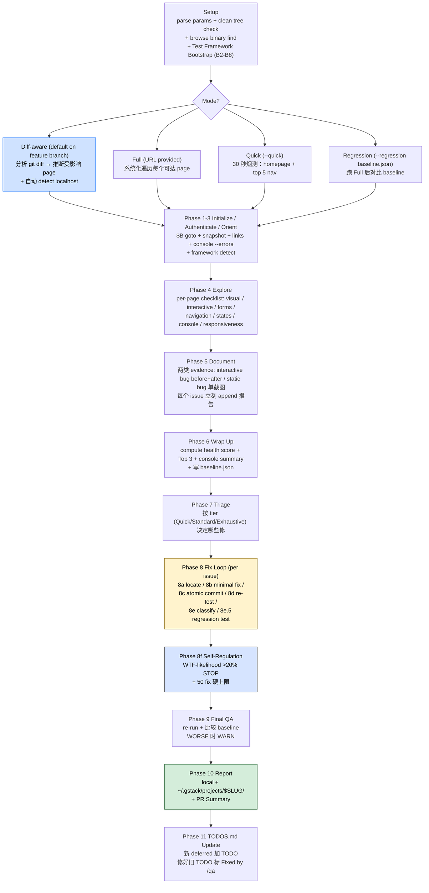

> 本 Skill 是 **gstack** 套件中的"浏览器自动化 QA + 自动改 bug"模块，作者是 YC 总裁 Garry Tan。它和 [office-hours](/articles/gstack-office-hours) / [plan-ceo-review](/articles/gstack-plan-ceo-review) / [plan-eng-review](/articles/gstack-plan-eng-review) / [review](/articles/gstack-review) / [ship](/articles/gstack-ship) / [investigate](/articles/gstack-investigate) / [design-shotgun](/articles/gstack-design-shotgun) / [autoplan](/articles/gstack-autoplan) / [spec](/articles/gstack-spec) 共同构成"从一个点子到上线"的全流程。完整工作流见 [gstack 创业全流程 Skills](/articles/gstack-workflow)。

## 一句话简介

`qa` 是 Garry Tan 在 gstack 套件里放的 **"QA 工程师 + bug-fix 工程师"双角色 Skill**：用自带的 `browse` CLI 像真人一样把 web 应用每个页面、表单、按钮点一遍，每个发现的问题都先截图存证（before/after）→ 触发 Phase 7-8 fix loop（minimal diff + atomic commit + 自动写回归测试 + WTF-likelihood 刹车），最终落一份带 health score 的结构化报告。支持 4 个 mode（**Diff-aware** branch 默认 / **Full** 全站 / **Quick** 30 秒烟测 / **Regression** 对比 baseline）。

## 它解决什么问题

普通"AI 帮我测一下网站"对话最大的问题是只能跑 unit test 看绿，对真实用户路径无感。这个 Skill 解决"如何让 AI 真的开浏览器点完一遍 + 发现问题立刻修 + 写回归测试 + 写报告"。覆盖以下场景：

- **当你 feature 分支写完代码、想看"在真浏览器里到底有没有坏"的时候**——SKILL.md "Diff-aware mode" 段是默认入口："This is the **primary mode** for developers verifying their work. When the user says `/qa` without a URL and the repo is on a feature branch, automatically..."自动分析 branch diff → 识别受影响 page/route → 自动 detect localhost dev server 端口 (3000/4000/8080) → 浏览器逐一访问 + 截图 + console 检查。
- **当你的项目根本没装测试框架、想让 AI 一次性把 vitest / playwright / RSpec / pytest 都 bootstrap 好的时候**——"Test Framework Bootstrap" 段 (B2-B8) 完整跑 detect runtime → WebSearch 找当下最佳实践 → AskUserQuestion 让你选框架 → 安装 → 写 3-5 条 real test → 跑通 → 写 TESTING.md + 更新 CLAUDE.md + 提交。源文件给了 8 种 runtime 的推荐表。
- **当你想要一份"按类别打分、汇总成单个 health score"的 QA 报告的时候**——Health Score Rubric 段把 Console (15%) / Links (10%) / Visual (10%) / Functional (20%) / UX (15%) / Performance (10%) / Content (5%) / Accessibility (15%) 8 类按权重加权，每类按 Critical -25 / High -15 / Medium -8 / Low -3 扣分；落 `baseline.json` 供下次 regression mode 对比。
- **当你想让 AI 不只是"找 bug"还要"立刻动手改"的时候**——Phase 7-8 fix loop：先按 tier (Quick/Standard/Exhaustive) triage → 8a 定位源文件 → 8b minimal fix（**不准 refactor / 加 feature / improve 无关代码**）→ 8c atomic commit `fix(qa): ISSUE-NNN — desc` → 8d 浏览器 re-test before/after → 8e classify (verified / best-effort / reverted) → 8e.5 自动写回归测试。
- **当你担心 AI 越改越多、改飞了的时候**——8f Self-Regulation 段定义 WTF-likelihood 公式：revert +15% / fix touch >3 files +5% / fix 15 后每条 +1% / 全是 Low severity 还在改 +10% / 改无关文件 +20%。**>20% 立即 STOP** 让用户决定继续与否；硬上限 50 fix。
- **当你跑过一次 baseline 后想看"这次改进 vs 上次"的时候**——`--regression baseline.json` mode 在 Phase 6 写完报告后 diff health score / issues fixed / issues new，append regression 段到报告。
- **当你的项目是 Next.js / Rails / WordPress / SPA 之一、有特定 known issue 模式的时候**——Framework-Specific Guidance 段为这 4 个框架各列了 4 条专属检查（hydration error / CSRF / 插件冲突 / client-side routing 等）。
- **当 PR 描述需要一行漂亮的 QA 摘要贴上去的时候**——Phase 10 写 PR Summary："QA found N issues, fixed M, health score X → Y."

## 安装方法

源 SKILL.md 没有独立安装命令，qa 通过 `gstack` plugin 分发。仓库：<https://github.com/garrytan/gstack>。

Skill 依赖一个自带 binary `browse`（源 Setup 段明示路径优先级）：

```bash
# 优先用 repo 内 vendored
_ROOT=$(git rev-parse --show-toplevel 2>/dev/null)
B=""
[ -n "$_ROOT" ] && [ -x "$_ROOT/.claude/skills/gstack/browse/dist/browse" ] && B="$_ROOT/.claude/skills/gstack/browse/dist/browse"
[ -z "$B" ] && B="$HOME/.claude/skills/gstack/browse/dist/browse"
```

如果显示 `NEEDS_SETUP`，Skill 会引导 `cd <SKILL_DIR> && ./setup`；缺 `bun` 时按固定 SHA256（`bab8ac...`）下载 `bun@1.3.10`。源 frontmatter `allowed-tools`：`Bash, Read, Write, Edit, Grep, Glob, AskUserQuestion, WebSearch`。

> 触发：`/qa <url>`（指定 URL 走 Full mode）或 feature 分支上裸跑 `/qa`（走 Diff-aware mode，自动 detect localhost）。

## 核心流程逐项解释

整套 Skill 串成 11 个 phase，外加 Setup / Bootstrap / Prior Learnings 等门控：



### Setup 阶段的 3 道前置门

1. **Clean working tree 检查**：`git status --porcelain` 非空时 STOP + AskUserQuestion 给 A 提交 / B stash / C abort——"每个 bug fix 要走 atomic commit，所以现有未提交改动必须先处理"。
2. **CDP mode detect**：`$B status | grep "Mode: cdp"` 命中时跳过 cookie import / user-agent 覆盖 / headless 兼容——"the real browser already has cookies"。
3. **Test Framework Bootstrap**：detect runtime（Ruby / Node / Python / Go / Rust / PHP / Elixir）→ 检测是否已有 jest / vitest / playwright / RSpec / pytest / phpunit 等 → 已有就 skip + 读 2-3 个现有 test 学风格；没有就跑 B2-B8 全流程（WebSearch best practices → AskUserQuestion 选框架 → 装包 → 生成 3-5 real test → 写 TESTING.md + 更新 CLAUDE.md + GitHub Actions workflow + commit）。源文件给了 8 种 runtime × 推荐 + 替代框架的表。

### 4 个 Mode 的边界

| Mode | 触发 | 行为 |
|---|---|---|
| **Diff-aware** | feature 分支裸跑 `/qa` | 分析 `git diff main...HEAD --name-only` + `git log main..HEAD` → 识别受影响 page → 自动 detect localhost 3000/4000/8080 → 仅测改动相关页 |
| **Full** | 提供 URL | 系统化遍历每个可达 page，5-15 分钟，5-10 条详尽 issue + health score |
| **Quick** | `--quick` | 30 秒烟测：homepage + top 5 nav，只看 load / console / broken link |
| **Regression** | `--regression baseline.json` | 跑 Full 后对比 baseline 给 fixed / new / score delta |

源文件强调 Diff-aware 即使 diff 没有 UI 改动也 **不能 skip 浏览器**："Backend, config, and infrastructure changes affect app behavior — always verify the app still works." Fall back 到 Quick mode 也要开浏览器。

### Phase 4 per-page exploration 7 件套

每访问一个页面都要按顺序跑 7 项：

| # | 内容 |
|---|---|
| 1 | Visual scan：看 annotated screenshot 找布局问题 |
| 2 | Interactive elements：点按钮 / 链接 / 控件 |
| 3 | Forms：填 + 提交，测 empty / invalid / edge case |
| 4 | Navigation：进出该页所有路径 |
| 5 | States：empty / loading / error / overflow |
| 6 | Console：交互后是否有新 JS error |
| 7 | Responsiveness：`$B viewport 375x812` 切到移动 viewport 看一次再切回 |

**Depth judgment**：核心页（homepage / dashboard / checkout / search）多花时间，次级页（about / terms / privacy）少花。

### Health Score Rubric 完整公式

```text
score = Σ (category_score × weight)
```

每类初始 100，按 finding 扣分：Critical -25 / High -15 / Medium -8 / Low -3，最低 0。

| Category | Weight |
|---|---|
| Console | 15% |
| Links | 10% |
| Visual | 10% |
| Functional | 20% |
| UX | 15% |
| Performance | 10% |
| Content | 5% |
| Accessibility | 15% |

Console 单独有特殊规则：0 error → 100；1-3 → 70；4-10 → 40；10+ → 10。Links：0 broken → 100，每个 broken 链接 -15。

### Phase 8 Fix Loop 的 atomic commit 纪律

每个修复都走 **6 步**：

1. **8a Locate**——Grep error message / 组件名 / route，**只动直接相关文件**
2. **8b Fix**——minimal fix，**不准 refactor / 加 feature / "improve" 无关代码**
3. **8c Commit**——`git commit -m "fix(qa): ISSUE-NNN — short description"`，**一 fix 一 commit，不准捆绑**
4. **8d Re-test**——`$B goto` → before/after screenshot → console 检查 → `snapshot -D` 验差异
5. **8e Classify**——verified / best-effort / reverted（regression 检测到立即 `git revert HEAD`）
6. **8e.5 Regression Test**——纯 CSS 跳过；其他必写 + 全套属性注释（`// Regression: ISSUE-NNN — what broke / Found by /qa on YYYY-MM-DD / Report: ...`）+ auto-incrementing 命名避免冲突 + 跑过则 `git commit -m "test(qa): regression test for ISSUE-NNN"`

回归测试要求："Set up the precondition that triggered the bug + Perform the action that exposed the bug + Assert the correct behavior (NOT 'it renders' or 'it doesn't throw')"——源文件原话拒收 `expect(x).toBeDefined()` 类水测试。

### WTF-likelihood 自我刹车公式

```text
WTF-LIKELIHOOD:
  Start at 0%
  Each revert:                +15%
  Each fix touching >3 files: +5%
  After fix 15:               +1% per additional fix
  All remaining Low severity: +10%
  Touching unrelated files:   +20%
```

每 5 fix 或任一 revert 后 compute；**>20% 立即 STOP** 让用户决定继续与否；**硬上限 50 fix**，到了不管还剩多少 issue 都停。

### Framework-Specific Guidance

| 框架 | 专属检查 |
|---|---|
| Next.js | hydration error (`Hydration failed`, `Text content did not match`)；`_next/data` 404；client-side navigation 测试；CLS |
| Rails | N+1 query 警告；CSRF token；Turbo/Stimulus 过渡；flash message 显隐 |
| WordPress | 插件冲突 JS error；admin bar；REST API (`/wp-json/`)；mixed content 警告 |
| SPA | `snapshot -i` 替代 `links` 因 client routes；stale state（来回切看数据 refresh）；back/forward；扩展使用后的内存泄漏 |

## 实战 demo

下面是一次典型 Diff-aware mode 流水线示意：

**用户操作**：在 `feat/billing-revamp` 分支上裸跑 `/qa`，clean tree。

**Setup**：clean tree 通过；CDP_MODE=false；test framework detected = vitest (87 tests)，skip bootstrap。

**Mode 自动判定**：feature 分支 + 无 URL → Diff-aware。`git diff main...HEAD --name-only` 显示改了 `app/billing/page.tsx` / `app/api/checkout/route.ts` / `components/PriceCard.tsx`。

**Phase 1-3 Initialize / Orient**：未指定 URL → 探测 `localhost:3000` → 拿到。`$B goto` + `snapshot -i -a` + `links` + `console --errors`。framework detect = Next.js。

**Phase 4 Explore**：先访问 `/billing`（最相关）→ 按 7 件套：

- Visual：PriceCard 间距错乱（mobile）→ 截 `issue-001-step-1.png`
- Interactive：点 "Upgrade" 按钮 → 200ms 后控制台跳出 `Hydration failed: Text content did not match server-rendered HTML` → 截 `issue-002-step-1.png`，hydration error 命中 Next.js framework-specific check
- Forms：信用卡表单填非法卡号 → 没有 error message → 截 `issue-003-step-1.png`
- 响应式：`$B viewport 375x812` → CTA 按钮溢出屏幕 → 截 `issue-001-step-1.png` 已覆盖
- 同上访问 `/checkout`（API route 改了）→ 触发 POST → 看到 console 报 `Cannot read properties of undefined (reading 'tax')`

**Phase 5 Document**：5 个 issue 一一写入 `qa-report-localhost-3000-2026-06-02.md`：

| ID | severity | category |
|---|---|---|
| ISSUE-001 | High | Visual + Responsive |
| ISSUE-002 | Critical | Functional (Hydration) |
| ISSUE-003 | High | UX (无 form 反馈) |
| ISSUE-004 | Critical | Functional (API error) |
| ISSUE-005 | Medium | Content (price typo) |

**Phase 6 Wrap Up**：Console = 70 (3 errors)；Functional = 100 - 25 - 25 = 50；UX = 100 - 15 = 85；Visual = 100 - 15 = 85；Content = 100 - 8 = 92；其他 100。weighted = 0.15·70 + 0.10·100 + 0.10·85 + 0.20·50 + 0.15·85 + 0.10·100 + 0.05·92 + 0.15·100 ≈ **82**。写 `baseline.json`。

**Phase 7 Triage**（Standard tier）：修 Critical + High + Medium 全部 5 个，Low 0 个。

**Phase 8 Fix Loop**：

- ISSUE-002 → 定位 `app/billing/page.tsx`，root cause = SSR 用 `new Date().toString()`，加 `suppressHydrationWarning` + 改用 `<ClientOnly>` → atomic commit `fix(qa): ISSUE-002 — hydration mismatch in billing page time display` → re-test verified → 8e.5 写 vitest 回归测试 → pass → commit `test(qa): regression test for ISSUE-002 — hydration consistency`
- ISSUE-004 → 定位 `app/api/checkout/route.ts:42` undefined tax → 加 nullable check + default 0 → atomic commit → re-test verified → 写回归测试
- ISSUE-001 → CSS-only → 跳过回归测试
- ISSUE-003 → 加 form validation message → verified
- ISSUE-005 → 改 typo → verified

**Phase 8f Self-Regulation**：5 fix 后 compute WTF-likelihood = 0% + (0 revert × 15) + (0 fix touch >3 files × 5) + (5 ≤ 15 所以不加) + (0 还剩 Low × 10) + (0 无关文件 × 20) = **0%**，继续无需 STOP。

**Phase 9 Final QA**：5 个 fix re-run on affected pages → Functional 100、UX 100、Visual 100 → 新 score **96**，比 baseline 82 高 → 不 WARN。

**Phase 10 Report**：写 `.gstack/qa-reports/qa-report-localhost-3000-2026-06-02.md` + `~/.gstack/projects/my-saas/alice-feat-billing-revamp-test-outcome-20260602-150311.md`。PR Summary：

> QA found 5 issues, fixed 5, health score 82 → 96.

**Phase 11 TODOS.md Update**：TODOS.md 里原有 "checkout undefined tax" 条目 → 标 "Fixed by /qa on feat/billing-revamp, 2026-06-02"。

## 与其他官方 Skills 的搭配建议

源 SKILL.md 自身未给独立 "Next Steps" 段，下游搭配按典型工作流推断（**逐条标注**）：

- **`/ship`** —— qa Phase 10 PR Summary 直接喂给 ship 作 PR description；qa Phase 9 final score 优于 baseline 是 ship 心安的前置条件。本 SKILL.md 未直接点名搭配关系。对应文章 [gstack-ship](/articles/gstack-ship)。
- **`/review`** —— qa 找的是 runtime 行为问题，review 找静态代码问题，两者互补；review 的 Specialist Army 段提到 qa 与前端 specialist 互补——见 [gstack-review](/articles/gstack-review) 的"与其他官方 Skills"段。
- **`/investigate`** —— qa 找到的 critical bug 如果根因复杂（>1 文件），可以升级 `/investigate` 走 root cause + 3-strike rule；本 SKILL.md 未直接点名搭配关系。对应文章 [gstack-investigate](/articles/gstack-investigate)。
- **`/plan-eng-review`** —— qa 第 5 章 Test Plan Context 段会主动找 `*-test-plan-*.md`（plan-eng-review 的产物）作为 richer source；这是源文件**明示**的下游消费关系。对应文章 [gstack-plan-eng-review](/articles/gstack-plan-eng-review)。

其余兄弟 Skill（[office-hours](/articles/gstack-office-hours) / [plan-ceo-review](/articles/gstack-plan-ceo-review) / [design-shotgun](/articles/gstack-design-shotgun) / [autoplan](/articles/gstack-autoplan) / [spec](/articles/gstack-spec)）属于 plan 上游或并列工具，本 SKILL.md 未直接点名搭配关系，但都列在 frontmatter sibling_skills 中。

## 常见坑 + 注意事项

源 SKILL.md "Important Rules" + "Additional Rules (qa-specific)" 段直接列出来 + Phase 内硬约束：

1. **每个 issue 必须至少一张截图，不允许例外**——Important Rules 1（源明示）。
2. **Verify before documenting**——retry 一次确认不是 fluke（源明示）。
3. **永不在 repro 步骤里写真密码**——用 `[REDACTED]`（源明示）。
4. **incrementally append issue 到报告，不准 batch**——Important Rules 4（源明示）。
5. **永不读源代码做 QA**——"Test as a user, not a developer"（源明示）。
6. **clean working tree 必须**——脏 tree 时 AskUserQuestion 强制 commit / stash / abort（Additional Rules 11）。
7. **一 fix 一 commit，禁捆绑**——Additional Rules 12（源明示）。
8. **不准改 CI / 不准改现有 test，只能新建回归 test 文件**——Additional Rules 13（源明示）。
9. **Regression 立即 revert**——8e classify reverted 时 `git revert HEAD`，标 deferred（Additional Rules 14）。
10. **WTF-likelihood 自我刹车 + 50 fix 硬上限**——Additional Rules 15 + Phase 8f 公式（源明示）。
11. **Show screenshot to user**：每个 `$B screenshot` 后必须 Read 那个文件展示给用户看，否则用户看不到（Important Rules 11，源明示）。
12. **Never refuse to use the browser**——即使 diff 看起来无 UI 改动也要开浏览器（Important Rules 12，源明示）。
13. **回归测试不能是水测试**——禁止 `expect(x).toBeDefined()` 类断言，必须 assert correct behavior（Phase 8e.5，源明示）。

## 适合人群

**适合：**

- 在 feature 分支 ship 前想"开个浏览器把改动相关页都点一遍"的开发者
- 项目还没装测试框架、希望 AI 一次性 bootstrap + 写起头 3-5 个真测试的团队
- 想拿 health score 量化"今天的 web 健康度"并跑 regression 看进步的人
- 重视 atomic commit + 自动回归测试纪律的工程师
- 跑 Next.js / Rails / WordPress / SPA 的人——有专属 checklist
- 想让 PR description 自动带 "QA found N, fixed M, score X→Y" 一行摘要的人

**不适合：**

- 不想让 AI 直接动手改代码的人——Phase 8 Fix Loop 默认会改 + commit
- 不接受 atomic commit + auto-generated test 写进 repo 的人
- 反感"WTF-likelihood 刹车"机制的人——会在某些激进 fix 场景被卡
- 项目是纯 backend / CLI / 没有 web UI 的——Skill 设计前提是 web app
- 不能装 `bun` 或 `browse` binary 的环境

---

本文基于 <https://github.com/garrytan/gstack> 由 AI（claude-opus-4-7）辅助生成中文教程，原作者署名 Garry Tan，许可证 MIT。

<!-- self-check
本文中提到的命令 / 文件 / URL 清单：
- `.gstack/qa-reports/qa-report-{domain}-{YYYY-MM-DD}.md` + `screenshots/` + `baseline.json` — 源 Output Structure 段明示
- `~/.gstack/projects/{slug}/{user}-{branch}-test-outcome-{datetime}.md` — 源 Phase 10 段明示
- `~/.claude/skills/gstack/browse/dist/browse` + `$HOME/.claude/skills/gstack/browse/dist/browse` — 源 SETUP 段明示
- `~/.claude/skills/gstack/bin/gstack-config` / `gstack-learnings-search` / `gstack-learnings-log` / `gstack-slug` — 源 Prior Learnings + Capture Learnings 段明示
- 4 mode 触发条件 (Diff-aware/Full/Quick/Regression) — 源 Modes 段明示
- 8 类 Health Score Rubric 权重 — 源 Health Score Rubric 段明示
- 8 runtime × test framework 推荐表 — 源 B2 段明示
- WTF-likelihood 公式 — 源 Phase 8f 段明示，原文 5 条加法规则照搬
- 4 框架专属指引 (Next.js/Rails/WordPress/SPA) — 源 Framework-Specific Guidance 段明示
- PR Summary "QA found N issues, fixed M, health score X → Y." — 源 Phase 10 段明示

场景章节支撑：
- 场景 1 "feature 分支裸跑 /qa" — 源 Diff-aware mode 段直接支撑
- 场景 2 "Test Framework Bootstrap" — 源 B2-B8 段直接支撑
- 场景 3 "Health Score" — 源 Health Score Rubric 段直接支撑
- 场景 4 "Phase 8 Fix Loop 直接改代码" — 源 Phase 8a-8e 段直接支撑
- 场景 5 "WTF-likelihood 刹车" — 源 Phase 8f 段直接支撑
- 场景 6 "Regression mode 对比 baseline" — 源 Modes 段 + Phase 6 baseline.json 段直接支撑
- 场景 7 "Framework-Specific Guidance" — 源 Framework-Specific Guidance 段直接支撑
- 场景 8 "PR Summary 一行摘要" — 源 Phase 10 段直接支撑

图 / 代码块处理：
- 源文件无 dot 流程图；Output Structure 目录树按 v3 规则保留原文
- 新增 1 张 mermaid 流程图把 Setup → Mode → Phase 1-11 全链路串成主线
- Health Score Rubric 表 + Framework-Specific Guidance 表 + Mode 表均为源段落的中文摘录
- WTF-likelihood 公式代码块照搬源 Phase 8f 原文

依赖关系（plugin-skill 必填）：
- 兄弟 `plan-eng-review` — 源 Test Plan Context 段明示 qa 会主动找 plan-eng-review 产物 `*-test-plan-*.md`（上游消费关系，源明示）
- 其它兄弟（office-hours / plan-ceo-review / review / ship / investigate / design-shotgun / autoplan / spec）— 本 SKILL 未直接点名搭配关系，文中已逐条标"非源文件明示"或写"按典型工作流推断"

可疑项：
- 实战 demo 中的 billing-revamp 案例为构造示意，不是源文件案例
- Health Score 计算示例 (~82) 为基于公式的构造演算，公式本身照搬源文件
- "browse binary" 名 + bun 1.3.10 + SHA256 校验逻辑来自源 SETUP 段原文
-->
