> 本 Skill 是 **gstack** 套件中的"diff 评审"模块，作者是 YC 总裁 Garry Tan。它和 [office-hours](/articles/gstack-office-hours) / [plan-ceo-review](/articles/gstack-plan-ceo-review) / [plan-eng-review](/articles/gstack-plan-eng-review) / [qa](/articles/gstack-qa) / [ship](/articles/gstack-ship) / [investigate](/articles/gstack-investigate) / [design-shotgun](/articles/gstack-design-shotgun) / [autoplan](/articles/gstack-autoplan) / [spec](/articles/gstack-spec) 共同构成"从一个点子到上线"的全流程。完整工作流见 [gstack 创业全流程 Skills](/articles/gstack-workflow)。

## 一句话简介

`review` 是 Garry Tan 在 gstack 套件里放的 **pre-landing diff 评审 Skill**：拿到当前分支 vs base 的 diff 后，先做 Scope Drift Detection + 计划完成度审计（DIFF-VERIFIABLE / CROSS-REPO / EXTERNAL-STATE 三种核验模式），然后跑 Critical Pass + Confidence Calibration + Pre-emit verification gate 杀假阳性、Specialist Dispatch（Testing / Maintainability / Security / Performance / Data Migration / API Contract / Design 7 类专家并行）+ 多模型 dedup boost、可选 Red Team 二审、Always-on Adversarial（Claude subagent + Codex），最后 Fix-First 自动修 + Batch ASK 走完一次 PR 体检。

## 它解决什么问题

普通 "AI review my PR" 对话最大的问题是给一份"中庸不踩雷"的清单 + 大量假阳性。这个 Skill 解决的是"如何让 PR 评审带 confidence 数、按代码 stack 路由专家、找回'你计划要做的但其实没做'的事"。覆盖以下场景：

- **当你的分支偷偷加了 plan 没说要做的东西、或者漏了 plan 说要做的东西，PR 没人帮你对一下的时候**——Step 1.5 Scope Drift Detection 段强制读 TODOS.md / PR description / commit messages，对比 stated intent vs delivered diff，给出 `Scope Check: [CLEAN / DRIFT DETECTED / REQUIREMENTS MISSING]`。HIGH-impact discrepancy 会用 AskUserQuestion 卡住让你选 "Stop 补 / Ship + 建 P1 TODO / Intentionally dropped"。
- **当 plan 里写了"在 sibling-repo 加一份 docs/dashboard.md"或"配 Cloudflare DNS"这种**跨仓 / 外部状态**的事、`git diff` 看不见的时候**——Verification Mode 段把每条 plan 项分成 DIFF-VERIFIABLE / CROSS-REPO / EXTERNAL-STATE / CONTENT-SHAPE 4 类，跨仓项会去 `~/Development/<repo>/` 试 `[ -f <path> ]`，外部状态直接 UNVERIFIABLE 并列出具体手工核验步骤。"Honesty rule"：宁可 UNVERIFIABLE 也不轻易 DONE。
- **当你被 AI 给的"P1 这里可能空指针"假阳性反复折磨的时候**——Confidence Calibration 段把每条 finding 打 1-10 分；Pre-emit verification gate (#1539) 强制"必须 quote 触发 finding 的具体代码行"才能上正式报告。源文件明示这条 gate 杀掉 "field doesn't exist on model" / "dict.get() might be None" / "save() might lose fields" / "update_fields might miss X" 4 类 FP。
- **当 diff 涉及 auth / migration / API / 前端 / 性能，你希望对应专家去 review 而不是一个 generalist 评所有事的时候**——Step 4.5 "Review Army — Specialist Dispatch" 段按 SCOPE_AUTH / SCOPE_BACKEND / SCOPE_FRONTEND / SCOPE_MIGRATIONS / SCOPE_API 信号选择对应 specialist，全部并行 dispatch 独立 subagent。多个 specialist 都 hit 同一 fingerprint 时自动 dedup + 标 "MULTI-SPECIALIST CONFIRMED" + confidence + 1。
- **当某些 specialist 在你的项目上从来没 catch 过有效问题的时候**——Adaptive gating 段读 `gstack-specialist-stats`，标 `[GATE_CANDIDATE]`（10+ dispatch 0 finding）就自动跳过；标 `[NEVER_GATE]` 的（Security / Data Migration）即使 silent 也总是跑——insurance policy。
- **当 diff 较大（>200 行）或者有 critical finding，你想加一次 Red Team 检查特意找前面 specialist 漏看的东西的时候**——Red Team dispatch 段在那两个条件下自动触发，subagent prompt 是 "specialists who found X. Your job is to find what they MISSED"。
- **当你想要每次 PR 都有一个独立 AI（Claude subagent + Codex）做 chaos engineer 式攻击审视的时候**——Step 5.7 Always-on Adversarial 段强制 Claude adversarial subagent 总是跑（free + fast），Codex adversarial 在 `OLD_CFG` 不为 disabled 时也跑；大 diff (>=200 lines) 额外跑 Codex structured review 带 P1 gate。Codex prompt 第一段必须 filesystem boundary。
- **当评审找了 5 条 informational + 2 条 critical、你不想手动一个一个改的时候**——Step 5 Fix-First 把所有 finding 分成 AUTO-FIX（直接动手）和 ASK（一次 batch 问用户），critical 倾向 ASK、informational 倾向 AUTO-FIX；有 test_stub 字段的 finding 强制 ASK（让你确认是否要写测试）。

## 安装方法

源 SKILL.md 没有独立安装命令，review 通过 `gstack` plugin 分发。仓库：<https://github.com/garrytan/gstack>。常见落地形式：

- 用户级路径：`~/.claude/skills/gstack/review/SKILL.md` + `~/.claude/skills/gstack/review/checklist.md` + `~/.claude/skills/gstack/review/specialists/*.md` + `~/.claude/skills/gstack/review/design-checklist.md` + `~/.claude/skills/gstack/review/greptile-triage.md`
- 全局配置目录：`~/.gstack/`（含 `analytics/review-log.jsonl` 等）

Skill 依赖 `Agent` 工具（specialist + Red Team + adversarial subagent 都要 dispatch）、`Bash`、`Read`、`Grep`、`WebSearch`，可选 `codex` CLI、可选 `gh` CLI（Greptile triage）、可选 `bun run slop:diff`。

> 触发：在 feature 分支上跑 `/review`，Skill 会自动检测 base branch、计算 merge-base、拿 diff、跑全套流水线。

## 核心流程逐项解释

整个 Skill 按阶段串：**1) Branch / Diff 准备 → 2) Scope Drift Detection + Plan 完成度审计 → 3) Critical Pass + Confidence Calibration → 4) Specialist Army Dispatch + Red Team → 5) Fix-First (AUTO-FIX + ASK) → 6) Always-on Adversarial (Claude + Codex) → 7) Persist Review Log**。

```mermaid
flowchart TB
    s1["Step 1 Check branch + diff base<br/>(merge-base origin/<base> HEAD)"]:::primary
    s15["Step 1.5 Scope Drift Detection<br/>+ Plan Completion Audit<br/>(DIFF-VERIFIABLE / CROSS-REPO / EXTERNAL-STATE)"]:::warn
    s2["Step 2 Read checklist.md"]
    s25["Step 2.5 Greptile triage (optional)"]
    s3["Step 3 git diff (+queue status + slop:diff)"]
    s4["Step 4 Critical Pass<br/>SQL / Concurrency / LLM trust /<br/>Shell injection / Enum completeness"]
    cc["Confidence Calibration 1-10<br/>+ Pre-emit verification gate (#1539)"]:::gate
    s45["Step 4.5 Specialist Army<br/>Testing + Maintainability (always-on >=50 lines)<br/>Security / Perf / Data Mig / API / Design (scope-gated)<br/>+ Adaptive gating + Force flags"]:::warn
    s46["Step 4.6 Merge + dedup + MULTI-SPECIALIST CONFIRMED +1 conf<br/>+ PR Quality Score"]
    rt["Red Team (if >200 lines OR any CRITICAL)"]
    s5["Step 5 Fix-First<br/>5a classify / 5b AUTO-FIX / 5c batch ASK"]:::ok
    s57["Step 5.7 Always-on Adversarial<br/>Claude subagent + Codex adversarial<br/>+ Codex structured review (>=200 lines, P1 gate)"]:::gate
    persist["gstack-review-log JSONL 持久化<br/>(skill / status / source / gate / commit)"]

    s1 --> s15 --> s2 --> s25 --> s3 --> s4 --> cc --> s45 --> s46 --> rt --> s5 --> s57 --> persist

    classDef ok fill:#d4edda,stroke:#155724,color:#000
    classDef warn fill:#fff3cd,stroke:#856404,color:#000
    classDef primary fill:#cfe2ff,stroke:#0d6efd,color:#000
    classDef gate fill:#d6e4ff,stroke:#333,color:#000
```

### Scope Drift Detection + Plan 完成度审计（核心创新）

源 Step 1.5 + Plan File Discovery + Actionable Item Extraction + Verification Mode + Cross-Reference Against Diff + Output Format + Fallback Intent Sources + Investigation Depth 段加起来近 200 行。整体逻辑：

**1) Plan File Discovery**：先从 conversation context 找（plan mode 系统消息），再 fallback 内容搜索 `~/.gstack/projects/$SLUG`、`~/.claude/plans`、`~/.codex/plans`、`.gstack/plans` 四个目录，按分支名 / repo 名 grep + 最近 24h 时间排序。

**2) Actionable Item Extraction**：从 plan 中抽至多 50 个可执行项，类型分 CODE / TEST / MIGRATION / CONFIG / DOCS。**忽略** Context、Background、TBD、已 defer 项、CEO Review Decisions 这些段落。

**3) Verification Mode 4 类**：

| 类 | 含义 | 验证方式 |
|---|---|---|
| DIFF-VERIFIABLE | 本仓代码改 | cross-reference 当前 diff |
| CROSS-REPO | 别仓的文件 / 内容 | 在 `~/Development/<repo>/` 等位置 `[ -f <path> ]` 探测 |
| EXTERNAL-STATE | Supabase / Cloudflare / Vercel / OAuth / DNS / SaaS | UNVERIFIABLE，列具体手工核验 |
| CONTENT-SHAPE | 文件要符合某种 convention | 本仓 diff 验；别仓尝试 validator (`validate-wiki` 等 npm script) |

源文件明示 "Path concreteness rule"：plan 项点名一个具体路径，必须 DONE 或 NOT DONE，UNVERIFIABLE 只在路径抽象或 sibling 不可达时才用——"I don't want to check" 不算 unreachable。

**4) Cross-Reference Against Diff 输出**：DONE / PARTIAL / NOT DONE / CHANGED / UNVERIFIABLE 五档，每项必引具体文件证据。

**5) Investigation Depth**：对 PARTIAL / NOT DONE 项必须查 `git log --oneline` 找原因，分 Scope cut / Context exhaustion / Misunderstood requirement / Blocked by dependency / Genuinely forgotten 5 类，并标 IMPACT HIGH/MEDIUM/LOW。HIGH 触发 AskUserQuestion 卡住。

**6) Learnings Logging**：plan 文件来源的 discrepancy 才落 `gstack-learnings-log`，commit-message / TODOS-derived 不落（信息太噪）。

### Confidence Calibration + Pre-emit verification gate

与 `/plan-eng-review` 同源（详见 [plan-eng-review 文](/articles/gstack-plan-eng-review)），每个 finding 必带 1-10 分；不能 quote 触发行的 finding 强制压到 4-5 进 appendix；framework-meta nudge 让 Django Meta / Rails has_many / SQLAlchemy 等元构造写法被正确处理。

### Specialist Army 7 类专家 + 多模型 dedup

源 Step 4.5 段定义：

| Specialist | 触发条件 |
|---|---|
| Testing | 50+ 行 always-on |
| Maintainability | 50+ 行 always-on |
| Security | SCOPE_AUTH 或 (SCOPE_BACKEND + 100+ 行) |
| Performance | SCOPE_BACKEND 或 SCOPE_FRONTEND |
| Data Migration | SCOPE_MIGRATIONS |
| API Contract | SCOPE_API |
| Design | SCOPE_FRONTEND (用 design-checklist.md) |

每个 specialist 是独立 Agent dispatch，**单消息内多 Agent 并行**。Prompt 含 specialist checklist + stack 上下文 + 历史相关 learnings + 输出 schema（JSON one per line：severity / confidence / path / line / category / summary / fix / fingerprint / specialist / 可选 test_stub）。

**Adaptive gating**（源段明示）：

- `[GATE_CANDIDATE]`：10+ dispatch 0 finding，自动跳过
- `[NEVER_GATE]`：Security / Data Migration 即使 silent 也跑
- `--security` / `--performance` / `--all-specialists` 等 flag 强制 include

**Merge + dedup**（Step 4.6）：fingerprint = `{path}:{line}:{category}`，同 fingerprint 保留 highest confidence + 标 "MULTI-SPECIALIST CONFIRMED ({s1} + {s2})" + confidence +1。

**PR Quality Score**：`max(0, 10 - (critical_count * 2 + informational_count * 0.5))`，落入 review log。

### Red Team 二审（条件性）

DIFF_LINES > 200 OR 任意 specialist 给 CRITICAL → 派一个 Red Team subagent，prompt 把前面 N specialist 找到的 issue 列给它，让它"找他们漏看的"。Red Team 用 `"specialist":"red-team"` 标签。

### Fix-First 流水线

**Step 5a 分类**：每个 finding 标 AUTO-FIX 或 ASK，critical 倾向 ASK，informational 倾向 AUTO-FIX。有 `test_stub` 字段的强制 ASK，让用户确认是否要写测试 + 写到对应框架的测试目录（spec/ for RSpec、`__tests__/` for Jest/Vitest、`test_` for pytest、`_test.go` for Go）。

**Step 5b**：AUTO-FIX 直接动手，输出 `[AUTO-FIXED] [file:line] Problem → 修复内容`。

**Step 5c**：ASK 用 ONE AskUserQuestion 列出所有 ASK item（≤3 个可用单独 AskUserQuestion），每条 A) Fix B) Skip。

**Step 5.0 Cross-review dedup**：先调 `gstack-review-read` 读历史 review log，把之前被用户 `action: "skipped"` 的 fingerprint 且文件未变化的，直接 suppress。**只 suppress `skipped`，不 suppress `fixed` / `auto-fixed`（可能回归）**。

### Always-on Adversarial（Claude + Codex）

**Claude adversarial subagent**：始终跑，prompt 让 Claude 当 attacker + chaos engineer，输出 FIXABLE / INVESTIGATE 两类，最后强制一行 canonical `Recommendation: <action> because <one-line reason naming the most exploitable finding>`，泛泛理由（"because safer"）不算合格。

**Codex adversarial challenge**：`OLD_CFG` 不为 disabled 时跑，5 分钟 timeout，Bash `timeout: 300000`（源明示别用 macOS 没有的 shell `timeout`）。Codex prompt 第一段强制 filesystem boundary。

**Codex structured review**：仅 DIFF_TOTAL >= 200 时跑，扫 `[P1]` marker → GATE: PASS / FAIL。FAIL 时 AskUserQuestion 让用户选 A 投入修 / B 继续。

**Persistence**：跑完用 `gstack-review-log` JSONL 落 `{"skill":"adversarial-review","status":"...","source":"both/claude","tier":"always","gate":"pass/fail/skipped/informational","commit":"..."}`。

### 其他附加步骤

- **Step 2.5 Greptile triage**：有 PR 且能拉 Greptile comments 时，按 VALID & ACTIONABLE / VALID BUT ALREADY FIXED / FALSE POSITIVE / SUPPRESSED 四类分类，进入 Fix-First；FALSE POSITIVE 用 reply template 回复 + 存 greptile-history（per-project + global）。
- **Step 3.4 Workspace-aware queue status**：advisory，看 PR 的 VERSION 是否还指向自由 slot。
- **Step 3.5 Slop scan**：`bun run slop:diff` 找 AI 垃圾代码模式（空 catch / 多余 `return await`），advisory。
- **Step 5.5 TODOS cross-reference + Step 5.6 Documentation staleness check**：发现 PR 关掉了某个 TODO 或某文档对应代码已改但文档没改时，标 informational + 建议 `/document-release`。

## 实战 demo

下面是一次典型 `/review` 流水线示意：

**用户操作**：在 `feat/stripe-payments` 分支跑 `/review`。

**Step 1 — branch + diff**：base = main，diff 共 320 行变更。

**Step 2 — Scope Drift + Plan 完成度审计**：找到 plan `~/.gstack/projects/my-saas/feat-stripe-payments-design.md`。抽取 12 项，其中 1 项是"在 domain-hq 仓加 `/docs/billing.md`"（CROSS-REPO）。验证：`[ -f ~/Development/domain-hq/docs/billing.md ]` → false → **NOT DONE**。1 项"Supabase RLS 允许 service-role 读 webhook 表"（EXTERNAL-STATE）→ **UNVERIFIABLE**。其他 10 项 DIFF-VERIFIABLE：8 DONE + 1 PARTIAL（webhook handler 加了但缺 idempotency）+ 1 CHANGED（"Redis queue" → "BullMQ"）。COMPLETION: 8 DONE, 1 PARTIAL, 1 NOT DONE, 1 CHANGED, 1 UNVERIFIABLE。HIGH-impact discrepancy AskUserQuestion 卡住，用户选 B "Ship anyway + 建 P1 TODO"。

**Step 3 — Critical Pass**：扫到 SQL injection 一处 (confidence 9/10 quote 了 `app/billing/repo.ts:88`)、Enum incompleteness 一处（新增 `status: 'refunded'` 但 `app/views/orders.tsx` 没处理）。

**Step 4 — Specialist Army**：STACK=node，DIFF_LINES=320，SCOPE_AUTH=true、SCOPE_BACKEND=true、SCOPE_API=true。Dispatch Testing / Maintainability / Security / Performance / API Contract 5 个 specialist。Adaptive gating 把 Performance 跳了（hit rate 0/12）。4 个 specialist 并行跑完，merge 后 12 个 finding，其中 2 个 MULTI-SPECIALIST CONFIRMED（Security + API Contract 都 hit "webhook 没校验签名超时窗口"）。PR Quality Score = max(0, 10 - (2*2 + 8*0.5)) = 2/10。

**Step 5 — Red Team**：DIFF_LINES > 200 触发，subagent prompt 含前面 12 个 finding，让它找漏看。Red Team 输出 1 个新 finding："webhook 接收速率没限速，stripe burst 100/s 会 OOM。"

**Step 6 — Fix-First**：13 个 finding 分类 → 5 AUTO-FIX 直接修 + 8 ASK 走 batch AskUserQuestion。用户选 6 个 Fix / 2 个 Skip。

**Step 7 — Always-on Adversarial**：Claude subagent 输出 4 个 INVESTIGATE + 1 个 FIXABLE，canonical Recommendation："Fix the unbounded retry at webhook.ts:42 because stripe 会无限重试拖垮 BullMQ worker."Codex adversarial 同意。DIFF=320 >= 200 → Codex structured review 跑，找到 1 个 `[P1]` → GATE: FAIL。AskUserQuestion 选 A 投入修。修完 re-run Codex review → PASS。

**Step 8 — Persistence**：`gstack-review-log` 写 adversarial-review JSONL entry 含 status=issues_found / source=both / gate=pass / commit=abc123。

## 与其他官方 Skills 的搭配建议

源 SKILL.md 自身未给独立的搭配段（不像 plan-ceo-review 有 "Next Steps — Review Chaining"），但通过 `gstack-review-log` JSONL 写入会被下游 `/ship` 的 Review Readiness Dashboard 消费：

- **`/ship`** — 源 plan-eng-review SKILL 的 Review Readiness Dashboard verdict logic 段明示：Eng Review CLEARED + Adversarial Review entry 不阻塞 ship。**review 的输出是 ship 流水线的关键 input**。对应文章 [gstack-ship](/articles/gstack-ship)。
- **`/plan-ceo-review`** + **`/plan-eng-review`** — 通常在 plan 阶段先跑这两个评审，PR 临 land 时跑 `/review`。本 SKILL.md 未直接点名，但通过 review-log JSONL 串联。
- **`/qa`** — 本 SKILL.md 未直接搭配，但前端 specialist 与 qa 互补（前者代码静态、后者 runtime 浏览器自动化）。对应文章 [gstack-qa](/articles/gstack-qa)。
- **`/document-release`** — 源 Step 5.6 Documentation staleness check 段明示推荐。
- **`/investigate`** — 本 SKILL.md 未直接点名，但 INVESTIGATE 类 adversarial finding 可以 dispatch 到 investigate。对应文章 [gstack-investigate](/articles/gstack-investigate)。

其余兄弟 Skill（[office-hours](/articles/gstack-office-hours) / [design-shotgun](/articles/gstack-design-shotgun) / [autoplan](/articles/gstack-autoplan) / [spec](/articles/gstack-spec)）属于 plan 上游或并列工具，本 SKILL.md 未直接点名搭配关系，但都列在 frontmatter sibling_skills 中。

## 常见坑 + 注意事项

源 SKILL.md 各段直接 / 隐含列出来的硬约束：

1. **不要把 NOT DONE / UNVERIFIABLE 凑成 DONE**——Honesty rule + Path concreteness rule 段明示（源明示）。
2. **plan 项是具体路径就必须 DONE/NOT DONE，不能逃成 UNVERIFIABLE**——Path concreteness rule 段明示（源明示）。
3. **不能 quote 触发行的 finding 强制压到 confidence 4-5**——Pre-emit verification gate (#1539)（源明示）。
4. **Codex 调用必须用 Bash 的 `timeout: 300000`，不允许 shell `timeout` 命令**——源明示原因："macOS 没有 timeout 命令"（源明示）。
5. **Codex prompt 第一段必须 filesystem boundary**——源明示禁止读 ~/.claude/、~/.agents/、.claude/skills/、agents/（源明示）。
6. **Adversarial subagent 的 Recommendation 必须 canonical 格式 + 不能用 generic 理由**——"because safer" 不算合格（源明示）。
7. **Specialist 派出失败不阻塞**——partial results 优于无结果（源明示）。
8. **Cross-review dedup 只 suppress `skipped` 不 suppress `fixed` / `auto-fixed`**——后者可能回归（源明示）。
9. **Plan-file 来源的 discrepancy 才落 learning，commit/TODOS-derived 不落**——避免 memory 噪音（源明示）。
10. **Codex structured review 仅 DIFF_TOTAL >= 200 跑**——小 diff 用 Claude + Codex adversarial 已经足够（源明示）。

## 适合人群

**适合：**

- 重视 plan 落地完成度的团队——Step 1.5 + Plan Completion Audit 是该 Skill 最独特的卖点
- 被假阳性折磨的人——Confidence Calibration + Pre-emit gate + Adaptive gating 三件套
- 跑多 stack（auth / migration / API / frontend）的全栈团队——Specialist Army 按 scope 路由专家
- 想用 Codex 跨模型二审保证一致性的人——Always-on Adversarial 把它做成 default
- 重视 audit trail 的团队——`gstack-review-log` 全程 JSONL 持久化

**不适合：**

- diff 只有几行 typo 的 PR——50 行以下 specialist 都跳过，但 Critical Pass + Confidence Calibration 仍要跑，对小 typo 偏重
- 不接受"AI 自动修一部分代码"的人——Fix-First 的 AUTO-FIX 直接动手（critical 走 ASK 不会自动）
- 反感"必须读 plan 文件 / 找跨仓证据"的人——Plan Completion Audit 是 review 的核心步骤
- 完全英文 / 不熟悉 specialist + Red Team 这种"评审军团"叙事的人

---

本文基于 <https://github.com/garrytan/gstack> 由 AI（claude-opus-4-7）辅助生成中文教程，原作者署名 Garry Tan，许可证 MIT。

<!-- self-check
本文中提到的命令 / 文件 / URL 清单：
- `~/.gstack/projects/$SLUG`、`~/.claude/plans`、`~/.codex/plans`、`.gstack/plans` — 源 Plan File Discovery 段明示
- `~/Development/<repo>/`、`~/code/<repo>/` — 源 Verification dispatch 段明示
- `~/.gstack/analytics/review-log.jsonl` — 源 Persistence 段明示
- `~/.claude/skills/gstack/bin/gstack-config` / `gstack-learnings-search` / `gstack-learnings-log` / `gstack-review-log` / `gstack-review-read` / `gstack-diff-scope` / `gstack-specialist-stats` — 源各段明示
- `~/.claude/skills/gstack/review/checklist.md` / `specialists/{testing,maintainability,security,performance,data-migration,api-contract,red-team}.md` / `design-checklist.md` / `greptile-triage.md` — 源各段明示
- `codex exec ... -s read-only -c 'model_reasoning_effort="high"' --enable web_search_cached` — 源 Always-on Adversarial / Codex structured review 段明示
- `bun run slop:diff` — 源 Step 3.5 段明示
- `bun run bin/gstack-next-version` — 源 Step 3.4 段明示
- finding JSON schema (severity / confidence / path / line / category / summary / fix / fingerprint / specialist / test_stub) — 源 Specialist subagent prompt 段明示

场景章节支撑：
- 场景 1 "scope drift / 计划完成度" — 源 Step 1.5 + Plan Completion Audit 段直接支撑
- 场景 2 "跨仓 / EXTERNAL-STATE 项" — 源 Verification Mode + Path concreteness rule + Honesty rule 段直接支撑
- 场景 3 "假阳性折磨" — 源 Confidence Calibration + Pre-emit verification gate (#1539) 段直接支撑
- 场景 4 "按 stack 路由专家" — 源 Specialist Dispatch + scope flag 段直接支撑
- 场景 5 "Adaptive gating" — 源 Adaptive gating + NEVER_GATE 段直接支撑
- 场景 6 "Red Team 找漏" — 源 Red Team dispatch 段直接支撑
- 场景 7 "Always-on Adversarial" — 源 Step 5.7 Always-on Adversarial 段直接支撑
- 场景 8 "Fix-First 自动修 + Batch ASK" — 源 Step 5 Fix-First 段直接支撑

图 / 代码块处理：
- 源文件无 dot 流程图；plan 完成度审计 Output Format 完整保留为原代码块
- 新增 1 张 mermaid 流程图把 Step 1 → 5.7 → persist 全链路串成主线
- Specialist 表 / Verification Mode 表 / Confidence 表是源段落的中文摘录
- finding JSON schema 来自源原文，未自行编造字段

依赖关系（plugin-skill 必填）：
- 兄弟 `ship` — 源 review-log 持久化 + plan-eng-review 的 Dashboard verdict 段明示下游消费者（跨 SKILL 引用）
- 兄弟 `document-release` — 源 Step 5.6 明示推荐
- 其它兄弟（office-hours / plan-ceo-review / plan-eng-review / qa / investigate / design-shotgun / autoplan / spec）— 本 SKILL 未直接点名搭配关系，frontmatter sibling_skills 中列出

可疑项：
- 实战 demo 中的 feat/stripe-payments 案例为构造示意，不是源文件案例，用于说明流水线运转。
- "PR Quality Score" 公式 `max(0, 10 - (critical_count * 2 + informational_count * 0.5))` 直接照搬源 Step 4.6 段。
- "[GATE_CANDIDATE]" / "[NEVER_GATE]" tag 来自源 Adaptive gating 段原文，未自行编造。
-->
