> 本 Skill 是 **gstack** 套件中的"完全自动化发版"模块，作者是 YC 总裁 Garry Tan。它和 [office-hours](/articles/gstack-office-hours) / [plan-ceo-review](/articles/gstack-plan-ceo-review) / [plan-eng-review](/articles/gstack-plan-eng-review) / [review](/articles/gstack-review) / [qa](/articles/gstack-qa) / [investigate](/articles/gstack-investigate) / [design-shotgun](/articles/gstack-design-shotgun) / [autoplan](/articles/gstack-autoplan) / [spec](/articles/gstack-spec) 共同构成"从一个点子到上线"的全流程。完整工作流见 [gstack 创业全流程 Skills](/articles/gstack-workflow)。

## 一句话简介

`ship` 是 Garry Tan 在 gstack 套件里放的 **完全非交互全自动 PR 流水线 Skill**：用户说 `/ship` 就意味着 "DO IT"，Skill 串行跑 **21 个 Step**（Pre-flight + Review Readiness Dashboard → Distribution Pipeline → merge base → tests/eval/coverage/plan-completion/review-army/greptile/adversarial 一路体检 → 自动决 version bump → CHANGELOG 自动生成 → TODOS.md 自动 close → WIP 安全 squash + bisectable 拆 commit → Verification Gate Iron Law 再跑一遍 → push → 同步 docs → 创建 / 更新 PR → 落 reviews JSONL → 一次性 plan-tune 推荐），全程**只为 9 种硬场景**停下来问用户。

## 它解决什么问题

普通"AI 帮我发个 PR"对话最大的问题是中间各种"要不要 push?"的小确认，最后 commit 不漂亮 / TODOS 没 close / VERSION 没 bump / PR description 干干巴巴。这个 Skill 解决的就是"如何让 AI 串完整个 ship 流水线、产物达到工程师级别"。覆盖以下场景：

- **当你只想敲 `/ship` 就看到 PR URL、不想再被各种 confirm 打断的时候**——SKILL.md 顶部 "Fully Automated Ship Workflow" 段直接写了 "non-interactive, fully automated. Do NOT ask for confirmation at any step. The user said `/ship` which means DO IT."只有 9 种硬场景才允许 stop（详见下文）。
- **当你想在 ship 前看到"上次评审到底过没过、是否需要补"的统一面板的时候**——Step 1 Pre-flight 调 `gstack-review-read` 拿 review log，画出 **Review Readiness Dashboard** 表格（Eng / CEO / Design / Adversarial / Outside Voice 5 行 × Runs/Last Run/Status/Required 4 列），最后给出 **VERDICT: CLEARED / NOT CLEARED**。**只有 Eng Review 是 gating**，CEO/Design/Outside Voice 都是 informational。
- **当 PR 引入新的 CLI / 二进制 / 库 artifact、但 CI 没有 release pipeline 的时候**——Step 2 Distribution Pipeline Check 段会 grep `cmd/.*/main.go` / `bin/` / `Cargo.toml` / `setup.py` / `package.json`，没找到 release workflow 时 AskUserQuestion 给 A 现加 release workflow / B 加 TODO / C 不需要——避免 ship 完用户没法下载。
- **当你不知道这次该 bump MICRO / PATCH / MINOR / MAJOR、还想避免和队友的工作版本号冲突的时候**——Step 12 用 `gstack-version-bump` CLI 4 类状态机决策（FRESH / ALREADY_BUMPED / DRIFT_STALE_PKG / DRIFT_UNEXPECTED），bump level 按 diff 大小自动判（<50 行 MICRO / 50+ PATCH / 有 feature signal 或 500+ 行 ASK MINOR / MAJOR ASK），slot 用 `gstack-next-version` 做 workspace-aware queue-collision detection。
- **当你的分支里有一堆 `WIP:` checkpoint 提交、想发 PR 前 squash 但又怕一不小心把真 commit 也 reset 掉的时候**——Step 15.0 给了**两套非破坏性 squash 策略**：Option 1 用 `git rebase -i ... --exec 'true' -X ours` 把 WIP 标 fixup；Option 2 检查 `NON_WIP=0` 才允许 `git reset --soft`。**Anti-footgun 段直接禁止盲 reset**，源文件原话 "Codex flagged this as destructive"。
- **当你希望最终 commit 历史能跑 `git bisect`、每个 commit 都是 logical change 的时候**——Step 15.1 给了完整 commit ordering：infrastructure → models/services → controllers/views → 最后 VERSION+CHANGELOG+TODOS。**每个 commit 必须 independently valid**，没有 broken import。
- **当你担心 review 已经过去几天、改了一堆代码后 ship 直接 push、跳过最后一次测试的时候**——Step 16 Verification Gate **Iron Law**："NO COMPLETION CLAIMS WITHOUT FRESH VERIFICATION EVIDENCE."只要 Step 4-6 后有代码动过（review fix），就必须重跑测试 + paste 新输出；"Should work now / I'm confident / It's a trivial change" 全部禁止。
- **当你想 ship 完后自动把 TODOS.md 里相关项标完成 + 把 review 指标落 JSONL 供未来 `/retro` 趋势分析的时候**——Step 14 自动检测 TODO 是否被 PR 解决（保守策略，diff 不清楚就不动）；Step 20 自动 append `~/.gstack/projects/$SLUG/$BRANCH-reviews.jsonl` 含 coverage_pct / plan_items_total / plan_items_done / verification_result / version / branch。
- **当用户初次 successful ship 后、Skill 想推一次 plan-tune（学 AskUserQuestion 偏好）的时候**——Step 21 用 `~/.gstack/.plan-tune-nudge-shown` marker 保证 at-most-once per machine，非阻塞。

## 安装方法

源 SKILL.md 没有独立安装命令，ship 通过 `gstack` plugin 分发。仓库：<https://github.com/garrytan/gstack>。常见落地形式：

- 用户级路径：`~/.claude/skills/gstack/ship/SKILL.md` + `~/.claude/skills/gstack/ship/sections/{tests,test-coverage,plan-completion,review-army,greptile,adversarial,changelog,pr-body}.md`（**Section index** 段把整个 ship 拆成 8 个按需 Read 的子节）
- 全局配置：`~/.gstack/projects/$SLUG/`（含 `$BRANCH-reviews.jsonl`、`wip-context-before-squash.md` 等）

Skill 依赖：`Bash` + `Read`、可选 `gh` / `glab`（PR / MR 创建）、`bun run gstack-version-bump|gstack-next-version|gstack-review-read|gstack-diff-scope|gstack-slug`、可选 `codex` CLI（adversarial）。

> 触发：在 feature 分支跑 `/ship`，**不能在 base 分支上跑**（Step 1 会 abort："You're on the base branch. Ship from a feature branch."）。

## 核心流程逐项解释

整套 Skill 是一个 21 步决策树，关键步是 STOP 强制读 sections 子文件再执行：

```mermaid
flowchart TB
    s0["Step 0 Detect platform + base branch<br/>(GitHub/GitLab/git-native fallback)"]:::primary
    s1["Step 1 Pre-flight<br/>+ Review Readiness Dashboard<br/>(Eng/CEO/Design/Adversarial/Outside Voice)"]:::primary
    s2["Step 2 Distribution Pipeline Check<br/>(新 artifact 无 release workflow → AskUserQuestion)"]
    s3["Step 3 Merge base BEFORE tests"]
    s46["Step 4-6 Tests + Eval (read sections/tests.md)"]:::warn
    s7["Step 7 Coverage audit (read sections/test-coverage.md)"]:::warn
    s8["Step 8 Plan completion (read sections/plan-completion.md)"]:::warn
    s9["Step 9 Pre-landing review (read sections/review-army.md)"]:::warn
    s10["Step 10 Greptile (read sections/greptile.md)"]
    s11["Step 11 Adversarial (read sections/adversarial.md)"]
    s12["Step 12 Version bump (FRESH/ALREADY_BUMPED/<br/>DRIFT_STALE_PKG/DRIFT_UNEXPECTED)<br/>+ queue-aware pick"]
    s13["Step 13 CHANGELOG (read sections/changelog.md)"]
    s14["Step 14 TODOS.md auto-update<br/>(创建/重组/保守 close)"]
    s15["Step 15 Commit<br/>15.0 WIP 安全 squash (Option 1/2 + anti-footgun)<br/>15.1 Bisectable chunks 排序"]
    s16["Step 16 Verification Gate<br/>Iron Law: NO COMPLETION WITHOUT FRESH VERIFY"]:::gate
    s17["Step 17 Push (ALREADY_PUSHED idempotent)"]
    s1819["Step 18-19 Sync docs + create/update PR (read sections/pr-body.md)"]:::ok
    s20["Step 20 Persist ship metrics<br/>~/.gstack/projects/$SLUG/$BRANCH-reviews.jsonl"]
    s21["Step 21 Plan-tune discoverability nudge<br/>(at-most-once per machine)"]

    s0 --> s1 --> s2 --> s3 --> s46 --> s7 --> s8 --> s9 --> s10 --> s11 --> s12 --> s13 --> s14 --> s15 --> s16 --> s17 --> s1819 --> s20 --> s21

    classDef ok fill:#d4edda,stroke:#155724,color:#000
    classDef warn fill:#fff3cd,stroke:#856404,color:#000
    classDef primary fill:#cfe2ff,stroke:#0d6efd,color:#000
    classDef gate fill:#d6e4ff,stroke:#333,color:#000
```



### "Only stop for" 的 9 种硬场景（源文件明示）

| # | 触发 |
|---|---|
| 1 | 当前在 base 分支（abort） |
| 2 | merge 冲突无法自动解 |
| 3 | branch in-tree test 失败（pre-existing 失败仅 triage 不阻塞） |
| 4 | Pre-landing review 找到 ASK item 需要用户判断 |
| 5 | MINOR / MAJOR version bump 需要用户决定 |
| 6 | Greptile review 评论需要用户决（复杂修 / 误报） |
| 7 | AI-assessed coverage 低于阈值（Step 7 hard gate，可 override） |
| 8 | Plan item NOT DONE 且没有 user override（Step 8） |
| 9 | TODOS.md 缺失 / 散乱用户要否创建 / 重组（Step 14） |

### "Never stop for" 的 8 种自动决场景（源文件明示）

未提交改动（自动包含）、version bump 选择（自动 MICRO/PATCH）、CHANGELOG（自动 diff 生成）、commit message（自动）、多文件 changeset（自动拆 bisectable）、TODOS 完成检测（自动）、auto-fixable review finding（dead code / N+1 / 失效注释 自动修）、coverage gap 在阈值内（自动生成 / commit 或在 PR body 标记）。

### Review Readiness Dashboard 的 verdict 逻辑

```text
+====================================================================+
|                    REVIEW READINESS DASHBOARD                       |
+====================================================================+
| Review          | Runs | Last Run            | Status    | Required |
|-----------------|------|---------------------|-----------|----------|
| Eng Review      |  1   | 2026-03-16 15:00    | CLEAR     | YES      |
| CEO Review      |  0   | —                   | —         | no       |
| Design Review   |  0   | —                   | —         | no       |
| Adversarial     |  0   | —                   | —         | no       |
| Outside Voice   |  0   | —                   | —         | no       |
+--------------------------------------------------------------------+
| VERDICT: CLEARED — Eng Review passed                                |
+====================================================================+
```

- **CLEARED**：Eng Review 7 天内有 ≥1 clean 条（`review` DIFF-scoped 或 `plan-eng-review` PLAN-stage 取较新），或 `skip_eng_review=true`
- **NOT CLEARED**：Eng Review missing / >7 天 stale / open issues
- **CEO / Design / Adversarial / Outside Voice 永不阻塞 ship**
- **Source attribution**：`via` 字段会显示在 status，例如 `CLEAR (PLAN via /autoplan)`
- **Staleness detection**：每条 review 的 `commit` 字段对比当前 HEAD，不同则 `git rev-list --count` 给出"N commits since review"提示

### Step 12 Version bump 四态机

| State | 含义 | 行为 |
|---|---|---|
| FRESH | VERSION 与 base 一致 | 跑 bump (step 2-4) |
| ALREADY_BUMPED | VERSION 已 bump | 跳 bump 但跑 queue-drift check；queue 移动了就 AskUserQuestion rebump |
| DRIFT_STALE_PKG | package.json 落后于 VERSION | 跑 `gstack-version-bump repair` 同步，复用 currentVersion |
| DRIFT_UNEXPECTED | package.json 与 VERSION 矛盾、VERSION 又同 base | **STOP**，手工 reconcile（manual edit bypassed /ship） |

**Bump level 决策**（agent judgment）：

- **MICRO**：<50 行，trivial tweaks/config
- **PATCH**：50+ 行，无 feature 信号
- **MINOR**：**ASK** if 有 feature signal（新 route/page、migration、新 module），或 500+ 行
- **MAJOR**：**ASK** —— 里程碑或 breaking change only

**Queue-aware pick**：用 `gstack-next-version --base <base> --bump $BUMP_LEVEL --current-version $BASE_VERSION`，offline 时 fallback 本地 bump 算术 + 打印 `⚠ workspace-aware ship offline`；若 sibling workspace 占了 `>= NEW_VERSION` → AskUserQuestion 让用户选 advance / abort sync。

### Step 15.0 WIP 安全 squash + Anti-footgun

源文件直接禁止盲 `git reset --soft <merge-base>`——会把非 WIP 的 landed commit 也 uncommit，**force-push 风险**。两个 option：

| Option | 条件 | 命令 |
|---|---|---|
| 1（首选） | 有 non-WIP commit 混合 | `git rebase -i $(git merge-base HEAD origin/<base>) --exec 'true' -X ours` |
| 2（仅 WIP-only 分支） | `NON_WIP=0` 验证后 | `git reset --soft $(git merge-base HEAD origin/<base>)` |

WIP context 在 squash 前先导出到 `.gstack/wip-context-before-squash.md`（`[gstack-context]` block 抽取），便于喂给 CHANGELOG 或 PR body。**rebase conflict → 自动 abort + 输出 BLOCKED 状态**。

### Step 15.1 Bisectable 提交规则

- **Ordering**：infrastructure → models & services → controllers & views → VERSION+CHANGELOG+TODOS（始终最后一个）
- **Split rules**：model + 其 test 同 commit；service + test 同 commit；controller + view + test 同 commit；migration 独立 commit 或与对应 model 一起
- 总 diff 小（<50 行、<4 文件）单 commit 可以
- 每个 commit **independently valid**——不能有 broken import / 引用还不存在的代码
- 只有**最后一个 commit**（VERSION + CHANGELOG）带 version tag 和 `Co-Authored-By: Claude Opus 4.7 <noreply@anthropic.com>` trailer

### Step 16 Verification Gate（Iron Law）

> **IRON LAW: NO COMPLETION CLAIMS WITHOUT FRESH VERIFICATION EVIDENCE.**

只要 Step 4-6 之后代码改过（CHANGELOG 编辑不算），就必须：

1. 重跑 test suite → paste 新输出
2. 项目有 build step 就跑 build → paste 输出
3. **Rationalization prevention** 4 句话——"Should work now" / "I'm confident" / "I already tested earlier" / "It's a trivial change" 全部禁止，必须重跑

源文件原话："Claiming work is complete without verification is dishonesty, not efficiency."

### Step 14 TODOS.md 自动 close 的保守规则

- **存在性检查**：缺则 AskUserQuestion 提供 skeleton（# TODOS heading + ## Completed section）
- **结构检查**：缺 `## <Component>` 分组 / `**Priority:** P0-P4` / `## Completed` 段时 AskUserQuestion 是否重组（仅重组、不删项）
- **完成检测保守**：仅在 diff **明确**显示完成时才标，**不确定就不动**——源文件原话"Be conservative"
- **标完成格式**：移到 `## Completed`，append `**Completed:** vX.Y.Z (YYYY-MM-DD)`
- **失败防御**：TODOS 写不进就 warn + continue，**永不阻塞 ship**

### Step 20 Persist ship metrics

每次 ship 完追加 1 行 JSONL：

```json
{"skill":"ship","timestamp":"...","coverage_pct":N,"plan_items_total":N,
 "plan_items_done":N,"verification_result":"pass|fail|skipped",
 "version":"...","branch":"..."}
```

写到 `~/.gstack/projects/$SLUG/$BRANCH-reviews.jsonl`，供未来 `/retro` 趋势分析；源文件强调"automatic — never skip, never ask"。

## 实战 demo

下面是一次典型 `/ship` 流水线示意：

**用户操作**：在 `feat/checkout-improvement` 分支上裸跑 `/ship`。

**Step 0**：detect platform = GitHub，base = main。

**Step 1 Pre-flight**：`git status` 显示无 untracked / 有 3 提交未推。`gstack-review-read` 显示 Eng Review 2 天前 CLEAR (DIFF via /review)，CEO Review 5 天前 CLEAR (PLAN via /autoplan)，Adversarial 2 天前 CLEAR，Outside Voice none。

```text
| VERDICT: CLEARED — Eng Review passed |
```

**Step 2 Distribution**：未引入新 binary，silent skip。

**Step 3 Merge base**：`git merge origin/main --no-edit` 已 up to date。

**Step 4-6**：Read sections/tests.md 跑 vitest 全 218 用例 0 失败；prompt 文件未改，跳过 eval。

**Step 7 Coverage audit**：Read sections/test-coverage.md，diff 1 文件未覆盖（`app/billing/utils.ts` 新增 30 行），自动生成 2 个测试 → pass → commit `test: add coverage for billing utils helpers`。

**Step 8 Plan completion**：Read sections/plan-completion.md，plan 5 项中 5 DONE，无 NOT DONE → PASS。

**Step 9 Pre-landing review**：Read sections/review-army.md（同 `/review` Skill），输出 3 个 informational + 0 critical + 0 ASK，全 AUTO-FIX 修完。

**Step 10 Greptile**：无 PR，跳过。

**Step 11 Adversarial**：Read sections/adversarial.md，Claude + Codex adversarial 跑完 status=clean。

**Step 12 Version**：FRESH state，BASE_VERSION=1.4.2.7。diff 87 行无 feature signal → PATCH。`gstack-next-version` 给 NEW_VERSION=1.4.2.8，无 queue collision。写 VERSION + package.json。

**Step 13 CHANGELOG**：Read sections/changelog.md，自动从 diff + commits 生成"Improve checkout error handling + add tax calc null check"。

**Step 14 TODOS**：1 个 TODO "checkout undefined tax" 被 diff 解决 → 移到 Completed 段标 `**Completed:** v1.4.2.8 (2026-06-02)`。

**Step 15.0 WIP squash**：CHECKPOINT_MODE=continuous，WIP_COUNT=2，NON_WIP=3。走 Option 1 `git rebase -i ... -X ours`，把 2 个 WIP 标 fixup 折进对应 logical commit。

**Step 15.1 Bisectable**：拆成 4 commit——`feat: tax calc null-safety / fix: checkout error message / test: billing utils coverage / chore: bump version and changelog (v1.4.2.8)`。最后一个带 Co-Author trailer。

**Step 16 Verification Gate**：Step 9 的 AUTO-FIX 改了代码 → 必须重跑测试。`bun test` → 220 用例 0 失败。**Iron Law 满足**。

**Step 17 Push**：`git fetch` LOCAL ≠ REMOTE → `git push -u origin feat/checkout-improvement`。

**Step 18-19**：Read sections/pr-body.md 同步 docs（README 中 API table 自动更新 1 处），`gh pr create` 用模板拼 PR body 含 CHANGELOG entry + QA Summary（如有 `/qa` 跑过的话） + TODOS update。

**Step 20 Persist**：

```json
{"skill":"ship","timestamp":"2026-06-02T15:32:11Z","coverage_pct":94,
 "plan_items_total":5,"plan_items_done":5,"verification_result":"pass",
 "version":"1.4.2.8","branch":"feat/checkout-improvement"}
```

写到 `~/.gstack/projects/my-saas/feat-checkout-improvement-reviews.jsonl`。

**Step 21 Plan-tune nudge**：用户首次 successful ship，marker 不存在，输出 1 行 plan-tune 推荐 + touch marker。

**输出**：PR URL `https://github.com/myorg/my-saas/pull/847`。

## 与其他官方 Skills 的搭配建议

源 SKILL.md 明示 + 强暗示的搭配关系：

- **`/review`** — 源 Step 1 Review Readiness Dashboard 段直接消费 review 的 JSONL 输出（status=clean, source/via 字段）。Eng Review 是 ship 唯一 gating review。对应文章 [gstack-review](/articles/gstack-review)。
- **`/plan-eng-review`** — 同上，作为 Eng Review 的 PLAN-stage 替代源，dashboard 取较新的一个。对应文章 [gstack-plan-eng-review](/articles/gstack-plan-eng-review)。
- **`/plan-ceo-review`** — CEO Review 行的源，**informational only never blocks**。对应文章 [gstack-plan-ceo-review](/articles/gstack-plan-ceo-review)。
- **`/autoplan`** — `via:"autoplan"` 字段会在 dashboard 显示来源；ship dashboard 段直接命名了这一 attribution 路径。对应文章 [gstack-autoplan](/articles/gstack-autoplan)。
- **`/plan-tune`** — Step 21 一次性 nudge 推荐；marker 防止重复（源明示）。
- **`/retro`** — Step 20 落 reviews JSONL 的下游消费者；源 Step 20 段原话"so `/retro` can track trends"。
- **`/qa`** — qa 的 Phase 10 PR Summary 通常会喂给 ship 的 PR body；本 SKILL.md 未直接点名，但通过 PR body section（pr-body.md）消费，推断关系。对应文章 [gstack-qa](/articles/gstack-qa)。

其余兄弟 Skill（[office-hours](/articles/gstack-office-hours) / [investigate](/articles/gstack-investigate) / [design-shotgun](/articles/gstack-design-shotgun) / [spec](/articles/gstack-spec)）属于 plan / 调试 / 设计上游，本 SKILL.md 未直接点名搭配关系，但都列在 frontmatter sibling_skills 中。

## 常见坑 + 注意事项

源 SKILL.md "Important Rules" 段 + 各 Step 内硬约束：

1. **永不跳过测试**——Important Rules 1（源明示）。
2. **永不跳过 pre-landing review**——checklist.md 不可读就 stop（源明示）。
3. **永不 force push**——只用 `git push`（源明示）。
4. **永不问"trivial confirmation"**——但 MINOR/MAJOR / review ASK / Codex [P1] finding 必须停（源明示）。
5. **必须用 4 位 VERSION 格式**——`MAJOR.MINOR.PATCH.MICRO`，CHANGELOG 日期 YYYY-MM-DD（源明示）。
6. **commit 必须 bisectable**——每 commit 一个 logical change（源明示）。
7. **TODOS.md close 必须保守**——diff 不清楚不动（源明示）。
8. **Greptile 回复必须用 template + 含 evidence**——禁止 vague 回复（源明示）。
9. **Verification Gate Iron Law**——Step 5 后改过代码必须重跑（源明示）。
10. **Step 7 生成的 coverage test 必须 pass 才提交**——禁交失败 test（源明示）。
11. **WIP squash 绝对不能盲 `git reset --soft`**——Anti-footgun 段明示原因，Codex 提醒（源明示）。
12. **Step 20 metrics 必须落，永不 skip / 永不 ask**（源明示）。

> 最终目标（源原话）："The goal is: user says `/ship`, next thing they see is the review + PR URL + auto-synced docs."

## 适合人群

**适合：**

- 想"一键 ship、AI 把 PR 描述 / CHANGELOG / TODOS / VERSION / commit 拆分一次都搞完"的开发者
- 团队有 workspace queue（多人 ship 同时）担心 version 冲突的项目
- 用 checkpoint 模式跑 WIP commit 习惯的人——Step 15.0 安全 squash 直接救命
- 想强制 bisectable commit + Iron Law verification 纪律的工程团队
- 已经在用 `/review` / `/plan-eng-review` / `/autoplan` 的人——Dashboard 直接消费它们的输出

**不适合：**

- 习惯手动写 CHANGELOG / commit message / PR description 的人——ship 全自动接管
- 担心 AI 自动 close TODO / 自动 bump version 的项目（虽然保守，但不接受任何 AI 决定就别用）
- 不接受 commit history 被 rebase / fixup 的团队
- 在 base 分支上想 ship 的人——Step 1 直接 abort
- 想看每一步 confirm 的人——Skill 本质就是 non-interactive

---

本文基于 <https://github.com/garrytan/gstack> 由 AI（claude-opus-4-7）辅助生成中文教程，原作者署名 Garry Tan，许可证 MIT。

<!-- self-check
本文中提到的命令 / 文件 / URL 清单：
- `~/.claude/skills/gstack/ship/sections/{tests,test-coverage,plan-completion,review-army,greptile,adversarial,changelog,pr-body}.md` — 源 Section index 段明示
- `~/.claude/skills/gstack/bin/gstack-review-read` / `gstack-version-bump` / `gstack-next-version` / `gstack-diff-scope` / `gstack-slug` / `gstack-config` — 源各步明示
- `~/.gstack/projects/$SLUG/$BRANCH-reviews.jsonl` — 源 Step 20 段明示
- `~/.gstack/.plan-tune-nudge-shown` — 源 Step 21 段明示
- `.gstack/wip-context-before-squash.md` — 源 Step 15.0 段明示
- VERSION + package.json 4 位 `MAJOR.MINOR.PATCH.MICRO` 格式 — 源 Step 12 段明示
- Review Readiness Dashboard 5 行表 (Eng/CEO/Design/Adversarial/Outside Voice) — 源 Step 1 段明示
- "Only stop for" 9 条 + "Never stop for" 8 条 — 源 SKILL.md 顶部段明示
- Bump 决策（MICRO<50/PATCH 50+/MINOR ASK feature 或 500+/MAJOR ASK） — 源 Step 12 段明示
- "Co-Authored-By: Claude Opus 4.7 <noreply@anthropic.com>" trailer — 源 Step 15.1 段明示

场景章节支撑：
- 场景 1 "non-interactive 一键 ship" — 源顶部段直接支撑
- 场景 2 "Review Readiness Dashboard" — 源 Step 1 段直接支撑
- 场景 3 "Distribution Pipeline 新 artifact 检查" — 源 Step 2 段直接支撑
- 场景 4 "Version bump 四态机 + queue-aware" — 源 Step 12 段直接支撑
- 场景 5 "WIP 安全 squash + anti-footgun" — 源 Step 15.0 段直接支撑
- 场景 6 "Bisectable commit ordering" — 源 Step 15.1 段直接支撑
- 场景 7 "Verification Gate Iron Law" — 源 Step 16 段直接支撑
- 场景 8 "TODOS 自动 close + metrics JSONL" — 源 Step 14 + Step 20 段直接支撑
- 场景 9 "Plan-tune nudge at-most-once per machine" — 源 Step 21 段直接支撑

图 / 代码块处理：
- 源文件无 dot 流程图；Review Readiness Dashboard ASCII 表保留原文；JSONL schema 来自源 Step 20 原文
- 新增 1 张 mermaid 流程图把 Step 0 → 21 全链路串成主线
- Version 四态机表 / WIP squash option 表 / "Only stop / Never stop" 表均为源段落的中文摘录
- 实战 demo 中 commit 命名 / version 号 / coverage 比例为构造示意，模板字段名均来自源 Step 20 原文

依赖关系（plugin-skill 必填）：
- 兄弟 `review` / `plan-eng-review` — 源 Step 1 Dashboard 直接消费（源明示）
- 兄弟 `plan-ceo-review` — 源 Step 1 informational 行 (源明示)
- 兄弟 `autoplan` — 源 Step 1 via 字段 attribution (源明示)
- 兄弟 `plan-tune` — 源 Step 21 nudge (源明示)
- 兄弟 `retro` — 源 Step 20 趋势消费者 (源明示)
- 其它兄弟（qa / office-hours / investigate / design-shotgun / spec）— 本 SKILL 未直接点名搭配关系，文中已逐条标"非源文件明示"或"推断"

可疑项：
- 实战 demo 中 feat/checkout-improvement 案例为构造示意，不是源文件案例
- Dashboard 表格 ASCII 直接来自源 Step 1 段原文
- "9 种 Only stop for" + "8 种 Never stop for" 列表从源顶部段精确照搬
- Anti-footgun 段引用"Codex flagged this as destructive"为源原文
-->
