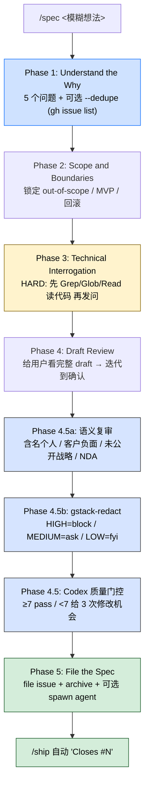

> 本 Skill 是 **gstack** 套件中的一员，与 [office-hours](/articles/gstack-office-hours) / [plan-ceo-review](/articles/gstack-plan-ceo-review) / [plan-eng-review](/articles/gstack-plan-eng-review) / [review](/articles/gstack-review) / [qa](/articles/gstack-qa) / [ship](/articles/gstack-ship) / [investigate](/articles/gstack-investigate) / [design-shotgun](/articles/gstack-design-shotgun) / [autoplan](/articles/gstack-autoplan) 共同覆盖创业团队"从一个 idea 到合并 PR"的全链路。完整工作流见 [gstack 创业全流程 Skills 总览](/articles/gstack-workflow)。

## 一句话简介

`/spec` 是 gstack 的 backlog-ready issue 起草 Skill：把模糊的"想做点什么"通过五个严格分隔的阶段（Why → Scope → 读代码后才能问的技术拷问 → 草稿 review → 质量门控 + 脱敏扫描）变成一份带验收标准、回滚方案、文件清单的 GitHub issue；可选 `--execute` 直接在新 worktree 里 spawn 一个 `claude -p` 把这个 issue 开始干。

## 它解决什么问题

不同于通用的 "issue 模板"，本 Skill 解决的是"AI 写 issue 容易脑补、不读代码、写完没法让别人接手"的具体痛。SKILL.md 在 `## Rules`、`## Anti-Patterns`、`## Process (STRICT — do not skip or combine phases)` 三段把要解决的问题写得很死，对应下面几个场景：

- **当你跟队友/AI 说"把那个 bulk-export 修一下"但根本没说清"谁受影响、为什么 now、怎么算完成"的时候**——Phase 1 强制问出 Who / 现状 / 目标 / Why now / 完成判据这五个问题，"Do NOT proceed until all five are answered without hand-waving"。
- **当 AI 起草 issue 时凭印象编 API、编文件路径，提交后无人能接手的时候**——Phase 3 写明"HARD requirement: read code first"："Before asking ANY Phase 3 question, you MUST read at least one piece of evidence from the codebase via Grep, Glob, or Read"。
- **当多人协作下相同需求重复开 issue、PM 不知道有人正在做的时候**——Phase 1b 默认开启 `--dedupe`：调用 `gh issue list --search` 查近重复，找到就 AskUserQuestion 让你选"合并到 #N / 重新开 / 取消"。
- **当 issue 里不小心粘了 `OPENAI_API_KEY=sk-...` / 客户姓名 / 内部代号、被公开仓库索引到的时候**——Phase 4.5a 语义复审 + Phase 4.5b `gstack-redact` 正则扫描三道："pre-codex / pre-issue / pre-archive"在每个 sink 前都重新扫一遍同一份 bytes；HIGH 直接 block，没有 `--no-*` 能跳过。
- **当 AI 写出来"看着挺像 issue 但实际上验收标准是『works correctly / handles edge cases』"的时候**——Phase 4.5 调用 Codex 评分 0-10、列出具体 ambiguity；<7 分给你 3 次修改机会，超过仍要么 ship-anyway 要么 save-and-stop。
- **当你只想 plan，不想 issue 真的被 file 出去的时候**——Phase 5 dispatch 逻辑读 `GSTACK_PLAN_MODE`：plan 模式下默认只写 plan 文件，不 spawn agent；execution 模式下默认 file + spawn worktree。
- **当 PR 合并后还要手动关原 issue 的时候**——SKILL.md "Handoff → `/ship` integration"段：spec archive 的 frontmatter 写了 `spec_issue_number: <N>`，`/ship` 开 PR 时会自动加 `Closes #<N>`，merge 即关 issue。

## 安装方法

`/spec` 属于 gstack plugin 整体分发。SKILL.md 中提到的相关入口：

- 用户在 Claude Code 里直接调用 `/spec`
- 触发词来自 frontmatter `triggers`：`spec this out` / `file an issue` / `write up a ticket` / `turn this into an issue` / `make this a github issue` / `turn this into a backlog item`
- 仓库主页：<https://github.com/garrytan/gstack>

依赖的外部工具（SKILL.md 明示）：

- `gh` CLI——用于 `--dedupe` 检索和 file issue
- `codex` CLI——Phase 4.5 质量门控
- `bun`——Phase 4.5a/4.5b 的 `gstack-redact` 和 `redact-audit-log` 用 bun 跑
- 内部脚本：`~/.claude/skills/gstack/bin/gstack-config` / `gstack-redact` / `gstack-paths` / `gstack-slug` / `gstack-update-check`

每个外部工具缺失时 SKILL.md 都给了 graceful skip 文案，不会 crash skill。

## 核心流程 / 五阶段逐项解释

`/spec` 把流程严格分成 5 个 Phase（加 4.5/5 内部子步骤），SKILL.md 用全大写写明 "**STRICT — do not skip or combine phases**"。



### Flag 速查（SKILL.md `## Flag Reference` 段照搬）

| Flag | 默认 | 作用 |
|------|------|------|
| `--dedupe` | ON | Phase 1b: 用 `gh issue list --search` 查近重复 |
| `--no-dedupe` | — | 跳过 dedupe |
| `--no-gate` | OFF | 跳过 Codex 质量评分；**脱敏扫描照常跑，没有 flag 能关** |
| `--audit` | OFF | Phase 5 走 Audit/Cleanup 模板而不是 Standard |
| `--execute` | conditional | file 完 issue 后 spawn `claude -p` 到新 worktree |
| `--no-execute` / `--file-only` | — | 只 file issue 不 spawn |
| `--plan-file <path>` | 从 harness 推断 | 指定 plan 文件位置 |
| `--sync-archive` | OFF | 把 spec archive 加进 artifacts-sync 白名单（默认本地） |

### Phase 1: Understand the "Why"（必答五问）

1. **Who** is affected? 真实用户角色 / 自动化系统 / 内部团队（"我自己一个 solo dev" 也是合法答案）
2. **What** is the current behavior? **验证过的**现状
3. **What** should the behavior be instead?
4. **Why now?** 阻塞其他工作？花钱？合规？
5. **How will we know it's done?** 可观测、可衡量的结果——不要 vibes

`--dedupe`（默认 ON）会在进 Phase 2 前抽 2-4 个关键词跑 `gh issue list --search "<keywords>" --state open --limit 10 --json number,title,url`，命中就 AskUserQuestion 让用户选 merge / file new / cancel。

### Phase 2: Scope and Boundaries

锁 5 件事：out-of-scope、touch 哪些系统、ordering 约束、MVP 切片、失败模式 + 回滚。

### Phase 3: Technical Interrogation（先读码，再问）

SKILL.md 这一段最硬：**未读任何代码不准发问**。Mapping：

- 用户提到具体文件/符号 → Grep 那个符号 + Read，第一个问题就 cite `path:line`
- 项目级宽泛需求 → 读 `package.json` / `go.mod` / `Cargo.toml` + 相关顶级目录 + `docs/<topic>.md`
- 真·绿地 → 显式承认 "I searched for X, Y, Z and found nothing. Treating this as a greenfield feature."

按需问 data model / API / 后台任务 / UI / 基础设施 / 测试六大类。

### Phase 4 + 4.5: 草稿 review + 三道扫描 + Codex 评分

| 子步骤 | 任务 | 出错时行为 |
|--------|------|---------|
| Phase 4 | 给用户看完整 draft，问 "What did I get wrong?"，迭代到 confirm | 用户继续改 |
| Phase 4.5a | 本地语义复审（含名负面 / 客户负面 / 未公开战略 / NDA），写一行 `SEMANTIC_REVIEW: clean\|flagged` | flagged 时 PUBLIC repo 强制 A=edit 或 C=cancel；private 允许 B=acknowledge |
| Phase 4.5b | `gstack-redact` 正则扫 ~30 个 secret/PII/legal 模式（3 tier） | Exit 3 (HIGH) 不允许任何跳过；Exit 2 (MEDIUM) 逐项 AskUserQuestion；Exit 0 + LOW 只是 FYI |
| Phase 4.5 | `codex exec` 评分 0-10 + 列 ambiguity，2 分钟 timeout | <7 给 3 次修改；codex 未安装/未登录/timeout 都 graceful skip |

每一道扫描都"scan-at-sink"——把 bytes 写到 tmpfile，扫这个 file，传同一个 file 下游，绝不 scan 一次再 re-render。HIGH 触发时 SKILL.md 写明"the raw spec must NOT be persisted anywhere downstream"，有专门的 `spec-quality-gate-secret-sink.test.ts` 守。

### Phase 5: File the Spec

SKILL.md 的 dispatch 逻辑读 `GSTACK_PLAN_MODE`：plan 模式默认 **file-only**，execution 模式默认 **file + spawn**。execute 路径：

1. 第三次扫描 pre-issue body（Phase 4 可能引入新内容）
2. `gh issue create --title "<title>" --body-file "$REDACT_FILE"` → 拿到 `$ISSUE_URL` / `$ISSUE_NUMBER`
3. archive 到 `$GSTACK_STATE_ROOT/projects/$SLUG/specs/<timestamp>-<pid>-<slug-title>.md`，frontmatter 写 `spec_issue_number / spec_issue_url / spec_filed_at / spec_branch / spec_plan_mode / spec_executed / spec_worktree_path / ttfc_ms / tthw_ms`
4. `--execute` 路径：dirty-worktree 检测（A continue / B stash / C cancel）+ TOCTOU 复查 + SHA pin + 建 `spec/<slug-title>-$$` 分支和 `worktrees/<slug-title>-$$` 目录 + AskUserQuestion 最后一次确认 + `cat $ARCHIVE_PATH | (cd $SPAWN_PATH && claude -p) &`

`/specs/` 默认从 artifacts-sync 白名单里排除，archive 留本地——除非显式 `--sync-archive`。

## 实战 demo

下面是一个简化的 happy-path 走查（基于 SKILL.md 的协议，命令完全按文中段落引用）：

**用户**：

> /spec 把 bulk-export API 修一下，导出的 zip 偶尔空文件

**Claude——Phase 1**：

> Flags: dedupe=ON, gate=ON, audit=OFF, execute=auto (plan mode = inactive)
>
> 1. Who — 看起来是订单导出场景的运营和企业客户。这准吗？
> 2. Current behavior — 我先验证下你说的"偶尔空"现象，需要给个最近的复现日志或者一个 trace ID 吗？
> 3. Should be — 你期望 zip 在哪些边界条件下保证非空？比如 0 行结果 vs 流被打断分别该返回什么？
> 4. Why now — 这是阻塞 enterprise 客户的 SLA，还是 P3 体验问题？
> 5. Done definition — "导出 1k 次成功率 ≥ 99.9%" 这种数字 OK 吗？

用户回答后跑 dedupe：

```bash
gh issue list --search "bulk-export empty zip" --state open --limit 10 --json number,title,url
```

返回 0 → 静默进 Phase 2。

**Phase 2 锁 scope**：out-of-scope 是异步 export job 的重写；只改 sync 路径；MVP 是修单文件；回滚就是 revert PR。

**Phase 3 先读码**：

```bash
grep -rn "bulk.export\|BulkExport" src/
# 找到 src/api/bulk_export.py:23 / src/services/exporter.py:117
```

Claude 第一个问题就引用 `src/services/exporter.py:117: stream.flush() 在 finally 之外`——这才有资格继续问 API 兼容性 / 测试覆盖度。

**Phase 4 草稿** + **Phase 4.5a/b 三道扫描** 全 clean → **Codex 评分** 8/10 pass。

**Phase 5 file + archive**：

```bash
ISSUE_URL=$(gh issue create --title "bulk-export: 修流式刷盘导致 zip 偶尔为空" --body-file "$REDACT_FILE")
# Filed: https://github.com/myorg/myrepo/issues/4421
```

archive 写到 `~/.gstack/projects/myrepo/specs/20260602-143205-12345-bulk-export-fix.md`，frontmatter `spec_issue_number: 4421`。

**后续**：你在新 session 跑 `/ship` 时，它读 frontmatter 自动给 PR 加 `Closes #4421`，PR merge 即关 issue（前提是 PR 真把 acceptance criteria 都打勾，partial PR 不会自动关）。

## 与其他官方 Skills 的搭配建议

SKILL.md `## Handoff` 段明示了三个搭配（其余兄弟 Skill 关系详见 [gstack-workflow](/articles/gstack-workflow)）：

- **`/spec` 之前**：用户还在"要不要做"探索阶段时，先走 [`/office-hours`](/articles/gstack-office-hours)。`/spec` 是为"已经过了'是否值得做'门槛的工作"准备的。
- **`/spec` 之后（需要架构评审）**：spec 触及架构/设计风险时，建议接 [`/plan-eng-review`](/articles/gstack-plan-eng-review)，或一次跑完整套评审的 [`/autoplan`](/articles/gstack-autoplan)。
- **实施阶段**：issue 本身就是 handoff，开发者打开 issue 即可执行；不需要再问用户。
- **`/ship` 集成**：当 worktree 含 `/spec` archive（frontmatter `spec_issue_number: <N>`）且 PR 满足 acceptance criteria 时，[`/ship`](/articles/gstack-ship) 自动在 PR body 加 `Closes #<N>`——分支名推断**不**会触发自动关（codex F3），partial PR 也**不**会自动关（codex F4）。

## 常见坑 + 注意事项

SKILL.md `## Rules` + `## Anti-Patterns` 两段照搬关键条目：

**规则（必守）：**

1. **NEVER produce an issue after the first message.** 永远从 Phase 1 起步。
2. **Don't ask questions you can answer by reading code.** 先读后问。
3. **Don't include code unless it removes ambiguity.** schemas 和 API 形状 yes；随手粘的 impl 片段 no。
4. **Don't leave design decisions for the implementer.** 全在对话里决掉。
5. **Flag when something should be multiple issues.** 1-3 天能完成的才是单 issue，scope 大就提议 epic + children。
6. **Match template to content.** Bug fix 不需要架构图；新子系统不需要 "Current vs Expected"。
7. **Verify before asserting.** 读完文件再说，cite 你找到的。
8. **Quantify or acknowledge you can't.** "Unknown — measure by [method]" 也胜过 vague。
9. **Explain sequencing.** 不仅要给优先级，要解释为什么这个顺序。

**Anti-Patterns（自动 reject）：**

- 验收标准模糊（"works correctly" / "handles edge cases"）
- 文件引用模糊（"somewhere in the auth module"）
- effort 估计没有 per-component 拆分
- 任何 trivial scope 以上的需求没写 "Out of Scope"
- 提议改动但没文档化已验证的现状
- 把流程反馈和战术修复混在一个 issue
- 20+ items 一个 issue 还没有 severity 分级和执行计划
- 通用 Definition of Done（"feature works" / "tests pass"）
- 假设旧代码按预期工作而不验证

**特别提醒：**

- `--no-gate` 只关 Codex 评分；**redaction 永远跑，没有任何 flag 能关**。HIGH 触发时 raw spec 不会落到任何下游 sink（archive、transcript、codex）。
- `/specs/` 默认本地，要跨机器同步必须显式 `--sync-archive`。
- `--execute` 会建 `spec/<slug-title>-$$` 分支和 `worktrees/<slug-title>-$$` 目录，靠 `$$` 后缀防并发碰撞。stash 的回滚不会自动执行——SKILL.md F3 明示 "spawned agent may take hours"，stash 留给你手动 `git stash apply stash^{/<ref>}`。
- spawned session 里 SKILL.md 明示 "Do NOT use AskUserQuestion for interactive prompts. Auto-choose the recommended option."

## 适合人群

**适合：**

- 习惯把"想法 → backlog → 实现 → 关 issue"完整闭环走完的团队，特别是用 GitHub issue 当唯一真相源的
- 喜欢"AI 先读你代码再问问题"的开发者，而不是被通用模板牵着鼻子走
- 在公共仓库 / 开源项目里工作、对 secret leak / NDA 信息特别敏感的团队
- 已经在用 gstack 其他 Skill（`/ship`、`/autoplan`）的——`/spec` 的 archive frontmatter 设计就是给这些下游 Skill 准备的

**不适合：**

- 完全不用 GitHub issue 的团队（用 Linear / Jira 等）——本 Skill 内嵌 `gh` CLI 和 GitHub issue 模板，迁移成本不小
- 写 README / 设计文档 / 内部 RFC 的场景——`/spec` 强制走"file issue or archive"路径，写文档应走别的工具
- 不愿意装 `gh` + `codex` + `bun` 三个外部 CLI 的轻量用户——每个 missing 都会被 graceful skip，但同时你失去 dedupe / 质量门控 / 脱敏扫描三个核心能力，体验会塌陷
- 只想做 5 分钟微改的场景（typo、变量重命名）——Phase 1-5 strict separation 是为 1-3 天颗粒度的 issue 设计的，微改用直接提 PR 更快

---

本文基于 <https://github.com/garrytan/gstack> 由 AI（claude-opus-4-7）辅助生成中文教程，原作者署名 Garry Tan，许可证 MIT。

<!-- self-check
本文中提到的命令 / 文件 / URL 清单：
- `/spec` 触发词列表（spec this out / file an issue / write up a ticket / ...） — SKILL.md frontmatter triggers 段明示
- `gh issue list --search "<keywords>" --state open --limit 10 --json number,title,url` — Phase 1b 段明示
- `gh issue create --title "<title>" --body-file "$REDACT_FILE"` — Phase 5 "File the issue" 段明示
- `~/.claude/skills/gstack/bin/gstack-redact --from-file "$REDACT_FILE" --repo-visibility "$REDACT_VIS" --json` — Phase 4.5b 段明示
- `~/.claude/skills/gstack/bin/gstack-config` / `gstack-paths` / `gstack-slug` / `gstack-update-check` — Preamble + Phase 5 archive 段明示
- `bun ~/.claude/skills/gstack/lib/redact-audit-log.ts` — Phase 4.5a 段明示
- `lib/redact-patterns.ts` / `/cso` — Phase 4.5b 段明示
- `spec-quality-gate-secret-sink.test.ts` — Phase 4.5b audit-sink invariant 段明示
- `codex exec ... -s read-only -c 'model_reasoning_effort="medium"'` — Phase 4.5 dispatch 段明示
- `$GSTACK_STATE_ROOT/projects/$SLUG/specs/<timestamp>-<pid>-<slug-title>.md` — Phase 5 archive 段明示
- 13 字段 archive frontmatter (spec_issue_number / spec_issue_url / spec_filed_at / spec_branch / spec_plan_mode / spec_executed / spec_worktree_path / ttfc_ms / tthw_ms) — Phase 5 archive 段明示
- `git worktree add "$SPAWN_PATH" -b "$SPAWN_BRANCH" "$PIN_SHA"` — Phase 5 spawn 段明示
- `cat "$ARCHIVE_PATH" | (cd "$SPAWN_PATH" && claude -p 2>&1) &` — Phase 5 spawn 段明示
- `git stash push -u -m "spec-execute-auto-$$"` — Phase 5 dirty-worktree gate F2 段明示
- 五问 Who/Current/Should/Why now/How done — Phase 1 Step 1a 段明示
- Phase 4.5a 五类语义复审（含名负面 / 客户负面 / 未公开战略 / NDA / codename 泄漏） — Phase 4.5a 段明示
- gstack-redact 3-tier (HIGH credentials / MEDIUM PII/legal/internal / LOW surfaces) — Phase 4.5b 段明示
- Codex 评分 ≥7 pass / <7 三次重试 — Phase 4.5 scoring outcomes 段明示
- TTFC / TTHW 三个时间戳 (T_PHASE1_START / T_FIRST_CITATION / T_FILE_OR_SPAWN) — Phase 5 TTHW telemetry 段明示
- Issue Quality Standards 14 项（Stakeholder Context / Verified Current State / Audit Tables / Quantified Impact / ...） — Issue Quality Standards 段明示
- Standard / Epic / Audit-Cleanup 三个 issue 模板 — Issue Structure Templates 段明示
- `/specs/` 默认从 artifacts-sync 白名单排除 — Phase 5 archive "Sync default" 段明示
- `/ship` 自动加 "Closes #<N>" 仅当 PR 满足完整 acceptance criteria — Handoff 段明示
- spawned session "Do NOT use AskUserQuestion" — Preamble SPAWNED_SESSION 段明示

场景章节支撑：
- 场景 1 "未说清谁/why/done" — Phase 1 Step 1a 必答五问段直接支撑
- 场景 2 "AI 凭印象编 API" — Phase 3 "HARD requirement: read code first" 段直接支撑
- 场景 3 "重复 issue" — Phase 1b --dedupe gh issue list --search 段直接支撑
- 场景 4 "issue 含 secret/PII" — Phase 4.5a 语义 + Phase 4.5b gstack-redact 三道扫描段直接支撑
- 场景 5 "验收标准 vague" — Phase 4.5 Codex 评分 + Issue Quality Standards #10 testable acceptance criteria 段直接支撑
- 场景 6 "plan vs execution 区分" — Phase 5 dispatch logic 段 GSTACK_PLAN_MODE 处理直接支撑
- 场景 7 "PR merge 自动关 issue" — Handoff "/ship integration" 段直接支撑

图 / 代码块处理：
- 源文件中无 dot 流程图；Flag 表格、Phase 4 表格按 v3 规则保留结构（中文化表头单元格）
- 新增 1 张 mermaid 流程图：把 5 个 Phase + 4.5/5 内部子步骤串成一张图，所有节点关键词均出自源 SKILL.md
- 源文件大量 bash 代码块（Preamble、scan-at-sink、archive write、worktree spawn）按 v3 "JSON/YAML/shell 代码块保留原文" 规则未改写，仅引用其中关键命令
- 实战 demo 中的 gh issue create 输出 (https://github.com/myorg/myrepo/issues/4421) 和 archive 路径 (~/.gstack/projects/myrepo/specs/...) 为示意值，遵循源文件 Phase 5 archive 路径模板，仅替换 SLUG/ISSUE_NUMBER

依赖关系（plugin-skill 必填）：
- 兄弟 Skill `/office-hours` — 源文件 Handoff 段 "Before /spec" 明示
- 兄弟 Skill `/plan-eng-review` — 源文件 Handoff 段 "After /spec" 明示
- 兄弟 Skill `/autoplan` — 源文件 Handoff 段 "After /spec" 明示
- 兄弟 Skill `/ship` — 源文件 Handoff 段 "`/ship` integration" 明示
- 其余兄弟 (review / qa / investigate / design-shotgun / plan-ceo-review) 未在 Handoff 段直接点名，文中只在 sibling 列表 + 工作流总览链接处提及，未编造协作细节

可疑项：
- 实战 demo 中的 src/api/bulk_export.py:23 / src/services/exporter.py:117 / issue #4421 / SLA 数字为基于 SKILL.md Phase 1-5 协议构造的示意场景，非源文件实际案例；用于演示五阶段如何运转。
- Mermaid 流程图把 4.5a/4.5b/4.5 (gate) 分成三个节点，源文件实际是 4.5 quality gate 内嵌 4.5a/4.5b 两个 sub-pass，本图按"前置脱敏先于 Codex 评分"的执行顺序展开；忠于原文执行序，未改协议。
-->
