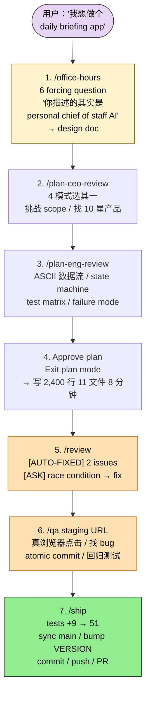
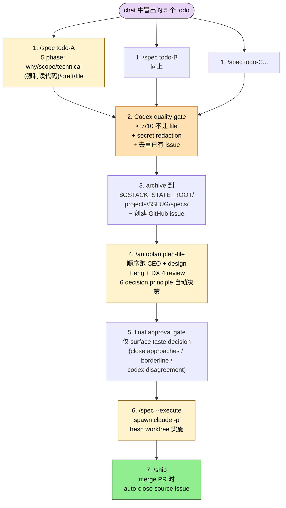
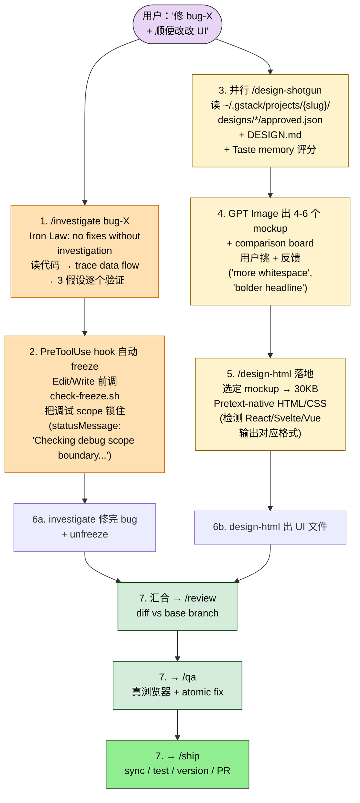

## 一句话简介

`gstack` 是 Y Combinator 总裁兼 CEO Garry Tan 用了 20 年 + 跟数千家创业公司打交道总结出的"个人开源软件工厂"——README 第一句话引用 Karpathy "我从 12 月起几乎没写过一行代码"，第二段就给出自己的 2026 数据：60 天里 3 个生产服务 + 40 多个 feature，标准化后是 2013 年节奏的 810 倍。这套工具集 23 个 specialist + 8 个 power tools 全做成 Claude Code slash command，按 sprint 节奏排成 `office-hours → plan-ceo/eng-review → /review → /qa → /ship` 主链路，外加 `/investigate` 调试 / `/design-shotgun` 视觉探索 / `/autoplan` 一键跑全部 review / `/spec` 把想法变 GitHub issue。

## 它解决什么问题

README "The sprint" 段直接给出立意——"gstack is a process, not a collection of tools. The skills run in the order a sprint runs: **Think → Plan → Build → Review → Test → Ship → Reflect**. Each skill feeds into the next."。10 个核心 sibling skill 各管 sprint 一段，每段都对应一个具体痛点：

- **当你只是模糊地想"做个 daily briefing app"、希望 AI 反过来 push 你逼出真正的产品定义而不是顺着说的时候**——`office-hours` SKILL.md "When to invoke" 段明示："Startup mode: six forcing questions that expose demand reality, status quo, desperate specificity, narrowest wedge, observation, and future-fit"。README 演示对话："You said 'daily briefing app.' But what you actually described is a personal chief of staff AI"——按真实痛点反推产品。
- **当你已经有一个计划但担心格局太小、希望有个"CEO 视角"挑战 scope 的时候**——`plan-ceo-review` SKILL.md 描述 4 模式："SCOPE EXPANSION (dream big), SELECTIVE EXPANSION (hold scope + cherry-pick expansions), HOLD SCOPE (maximum rigor), SCOPE REDUCTION (strip to essentials)"。trigger 词 "think bigger / expand scope / strategy review / rethink this / is this ambitious enough"。
- **当你计划要进入实施、希望先把架构、数据流、edge case、测试覆盖锁死的时候**——`plan-eng-review` SKILL.md 描述："Lock in the execution plan — architecture, data flow, diagrams, edge cases, test coverage, performance. Walks through issues interactively with opinionated recommendations."。Voice trigger 包括 "tech review / technical review / plan engineering review"。
- **当你要给 PR 做 pre-landing review、希望抓那种"过得了 CI 但上线炸"的 bug 的时候**——`review` SKILL.md 描述："Analyzes diff against the base branch for SQL safety, LLM trust boundary violations, conditional side effects, and other structural issues."。proactively 在准备 merge/land 时建议触发。
- **当你要 QA 测试已部署的网站、希望 AI 真的开真浏览器点击交互找 bug 还能就地修复并跑回归测试的时候**——`qa` SKILL.md 描述："Runs QA testing, then iteratively fixes bugs in source code, committing each fix atomically and re-verifying."。3 个 tier：Quick（critical/high）/ Standard（+ medium）/ Exhaustive（+ cosmetic）。报告模式用 `/qa-only`。
- **当你要完成最后一公里：sync main、跑测试、bump version、写 CHANGELOG、commit、push、开 PR——但不想手动 8 步的时候**——`ship` SKILL.md 描述："Ship workflow: detect + merge base branch, run tests, review diff, bump VERSION, update CHANGELOG, commit, push, create PR."。trigger 包括 "ship it / create a pr / push to main / deploy this"。
- **当你卡在一个 bug 反复改不好、需要系统化 root-cause 调查而不是"再改一下试试"的时候**——`investigate` SKILL.md 描述："Systematic debugging with root cause investigation."。带 PreToolUse hook 自动 freeze 调试范围（Edit/Write 触发 check-freeze.sh），防止 Claude 在调试时"顺手"改了不相关代码。
- **当你做 UI 但还没决定长什么样、希望先看 4-6 个 AI 生成 mockup 排排看、迭代到喜欢的为止的时候**——`design-shotgun` SKILL.md 描述："Design shotgun: generate multiple AI design variants, open a comparison board, collect structured feedback, and iterate."。README 段：用 GPT Image 出图 → 浏览器比对 → "more whitespace / bolder headline" 反馈 → 下一轮，Taste memory 学习偏好。
- **当你已经有 plan 文件但不想一个一个跑 CEO/design/eng/DX 4 个 review、希望一条命令吃完全部决策的时候**——`autoplan` SKILL.md 描述："Auto-review pipeline — reads the full CEO, design, eng, and DX review skills from disk and runs them sequentially with auto-decisions using 6 decision principles. Surfaces taste decisions (close approaches, borderline scope, codex disagreements) at a final approval gate."
- **当你要把一个模糊想法或 chat 中冒出来的 todo 变成 GitHub issue / backlog item、可执行的 spec 的时候**——`spec` SKILL.md 描述："Turn vague intent into a precise, executable spec in five phases (why, scope, technical with mandatory code-reading, draft, file). Codex quality gate before file (blocks below 7/10), fail-closed secret redaction, dedupe against existing issues, archive to `$GSTACK_STATE_ROOT/projects/$SLUG/specs/` for team-corpus recall. `--execute` spawns `claude -p` in a fresh worktree; `/ship` auto-closes the source issue on merge."

## 安装方法

README "Install — 30 seconds" 段：

### 前置依赖

[Claude Code](https://docs.anthropic.com/en/docs/claude-code) + [Git](https://git-scm.com/) + [Bun](https://bun.sh/) v1.0+ + [Node.js](https://nodejs.org/)（Windows 才需要）。

### Step 1: 个人机安装

在 Claude Code 里粘贴 README 给的这段自然语言指令——Claude 自己执行：

> Install gstack: run **`git clone --single-branch --depth 1 https://github.com/garrytan/gstack.git ~/.claude/skills/gstack && cd ~/.claude/skills/gstack && ./setup`** then add a "gstack" section to CLAUDE.md that says to use the /browse skill from gstack for all web browsing, never use mcp__claude-in-chrome__\* tools, and lists the available skills: /office-hours, /plan-ceo-review, /plan-eng-review, ... /learn. Then ask the user if they also want to add gstack to the current project so teammates get it.

### Step 2: Team mode（推荐，给团队仓库自动更新）

```bash
(cd ~/.claude/skills/gstack && ./setup --team) && ~/.claude/skills/gstack/bin/gstack-team-init required && git add .claude/ CLAUDE.md && git commit -m "require gstack for AI-assisted work"
```

README 说明：no vendored files in your repo, no version drift, no manual upgrades；每次 Claude Code session 启动会做一次 fast auto-update check（限流到 1/小时、network-failure-safe、完全 silent）。把 `required` 换成 `optional` 是 "提醒而非强制" 模式。

### 跨 AI agent 安装（10 种 host）

```bash
git clone --single-branch --depth 1 https://github.com/garrytan/gstack.git ~/gstack
cd ~/gstack && ./setup
```

或指定 host：`./setup --host codex`（OpenAI Codex CLI）/ `--host opencode` / `--host cursor` / `--host factory` / `--host slate` / `--host kiro` / `--host hermes` / `--host gbrain`。设置后 skill 装到对应 `~/.<host>/skills/gstack-*/` 目录。

### OpenClaw 集成

把 README 给的一段 OpenClaw 指令粘到你的 OpenClaw agent。之后用自然语言："Build me a notifications feature" 会 spawn Claude Code session 跑 `/autoplan → implement → /ship`。

### 升级

```bash
/gstack-upgrade
```

检测全局 vs vendored install，同步两者，显示变更。

## 核心理念 / 工作流哲学

README 把 gstack 的哲学浓缩成一句话：**"It turns Claude Code into a virtual engineering team."** 二十三个 specialist + 八个 power tools，按 sprint 节奏跑：

```
Think → Plan → Build → Review → Test → Ship → Reflect
```

每个 skill 喂下一个 skill：`/office-hours` 写 design doc → `/plan-ceo-review` 读它；`/plan-eng-review` 写 test plan → `/qa` 接它；`/review` 抓的 bug → `/ship` 验证修复。**Nothing falls through the cracks because every step knows what came before it.**

四个关键机制：

1. **Karpathy 四种 failure mode 全覆盖**：README 段 "wrong assumptions / overcomplexity / orthogonal edits / imperative over declarative"。`/office-hours` 把 assumption 摆台面；Confusion Protocol 让 Claude 不准猜架构决策；`/review` 抓多余复杂度和 drive-by 修改；`/ship` 把任务变成 verifiable goal + test-first 执行。
2. **Smart review routing**：跟正经创业公司一样——CEO 不看基础设施 bug fix，design review 不管后端改动。gstack 跟踪跑过哪些 review，自动判断需要哪些。Review Readiness Dashboard 在 ship 前告诉你状态。
3. **Test everything**：`/ship` 没测试框架自己 bootstrap；每次 `/ship` 出 coverage audit；`/qa` 每修一个 bug 都生成回归测试。"100% test coverage is the goal — tests make vibe coding safe instead of yolo coding."
4. **Continuous checkpoint mode**：opt-in 的 `gstack-config set checkpoint_mode continuous` 让 skill 自动 commit 当前工作（`WIP:` 前缀 + 结构化 `[gstack-context]` body），crash 或切换 context 还能恢复；`/ship` 做 PR 时 filter-squash WIP commits 让 bisect 保持干净。

## 包含哪些 Skills

gstack 仓库实际暴露 30+ slash command，本 overview 聚焦 yaml 列的 **10 个核心 Skill**：

- **[office-hours](/articles/gstack-office-hours)（YC 创业头脑风暴）** — 两种模式：Startup（6 个 forcing question 揭露 demand reality / status quo / desperate specificity / narrowest wedge / observation / future-fit）和 Builder（side project / hackathon / 学习 / 开源 的设计思考）。完成后写 design doc 喂给下游 skill。proactive 触发：用户描述新产品 idea / 问 "is this worth building" / 探索一个还没代码的概念。
- **[plan-ceo-review](/articles/gstack-plan-ceo-review)（CEO/创始人视角 plan 评审）** — 四模式："SCOPE EXPANSION（dream big）/ SELECTIVE EXPANSION（hold + cherry-pick）/ HOLD SCOPE（maximum rigor）/ SCOPE REDUCTION（strip to essentials）"。挑战 premise、找隐藏的 10 星产品、必要时扩 scope。`benefits-from: [office-hours]` 表明它读 office-hours 写的 design doc。
- **[plan-eng-review](/articles/gstack-plan-eng-review)（工程经理视角 plan 评审）** — 锁定 architecture / data flow / diagrams / edge cases / test coverage / performance。interactive 模式带 opinionated 推荐，把隐藏假设逼到台面。Voice trigger："tech review / technical review / plan engineering review"。
- **[review](/articles/gstack-review)（pre-landing PR 评审）** — 分析 diff vs base branch，专找 SQL safety / LLM trust boundary violation / conditional side effect 等结构性问题。README 自描述："Find the bugs that pass CI but blow up in production. Auto-fixes the obvious ones. Flags completeness gaps."
- **[qa](/articles/gstack-qa)（真浏览器 QA + 修复）** — 跑测试 → 找 bug → 改 source code → atomic commit → re-verify → 自动生成回归测试。3 tier：Quick / Standard / Exhaustive。报告模式 `/qa-only` 不改代码。"It let me go from 6 to 12 parallel workers"（README 原话）。
- **[ship](/articles/gstack-ship)（端到端发版工作流）** — detect+merge base branch → 跑 tests → audit coverage → bump VERSION → update CHANGELOG → commit → push → 创建 PR。没测试框架自己 bootstrap。trigger："ship it / create a pr / push to main / deploy this"。
- **[investigate](/articles/gstack-investigate)（系统化根因调试）** — README 描述 "Iron Law: no fixes without investigation. Traces data flow, tests hypotheses, stops after 3 failed fixes."。SKILL.md `hooks.PreToolUse` 段定义：Edit/Write 前调 `check-freeze.sh`，把调试范围限制在指定模块，防止"顺手"改不相关代码。
- **[design-shotgun](/articles/gstack-design-shotgun)（多 mockup 探索 + Taste 学习）** — 用 GPT Image 生 4-6 个 mockup → 浏览器 comparison board → 用户挑/反馈 → 下一轮 → Taste memory 跨 round 学习偏好。配套 `gstack-taste-update` CLI 写 approval/rejection 到 per-project taste profile（5%/week 衰减）。
- **[autoplan](/articles/gstack-autoplan)（一键跑全 review pipeline）** — Auto-review pipeline 顺序跑 CEO / design / eng / DX review，用 6 个 decision principle 自动决策。只把 "taste decision"（接近的方案 / 边界 scope / codex 分歧）submitted 到最终 approval gate。"One command, fully reviewed plan out."
- **[spec](/articles/gstack-spec)（5 阶段 vague → executable）** — Phase 1 why / Phase 2 scope / Phase 3 technical（强制读代码）/ Phase 4 draft / Phase 5 file。Codex quality gate（<7/10 阻止 file）+ fail-closed secret redaction + 已有 issue 去重 + archive 到 `$GSTACK_STATE_ROOT/projects/$SLUG/specs/`。`--execute` flag 在新 worktree spawn `claude -p`；`/ship` merge 时自动 close source issue。

## 典型工作流串讲

### 示例 A：从一个模糊想法到生产 PR——README 主链路

> 这是 README "See it work" 段直接给的对话——8 个命令把 "daily briefing app" 跑到 github PR。



1. **/office-hours 反向追问**：用户说"daily briefing app"。office-hours 不直接接需求，按 startup mode 问 6 个 forcing question：你最近一次手动做 briefing 的具体场景？现状用什么 work-around？你拿这东西能做什么以前做不了的事？最窄能 ship 的 wedge 是什么？观察到别人哪些痛点？……AI 听完 pain point 反推产品定义："你说 daily briefing app，但你描述的是 personal chief of staff AI"，写 design doc 落盘。
2. **/plan-ceo-review 挑战 scope**：读 design doc，按 4 模式之一跑——典型选 SELECTIVE EXPANSION（保持核心 scope，cherry-pick 几个值得扩的方向）。给出 RECOMMENDATION："Ship the narrowest wedge tomorrow, learn from real usage. The full vision is a 3-month project — start with the daily briefing that actually works."
3. **/plan-eng-review 锁架构**：ASCII 画数据流 / state machine / error path；列 test matrix、failure mode、security concern。把所有隐藏假设逼到台面，比如"你这个 calendar 同步是 push 还是 pull？事件冲突怎么 dedup？"
4. **Approve plan + 退出 plan mode**：Claude Code 进入 Edit 模式实际写代码。README 数据点："写 2,400 lines across 11 files. ~8 minutes."
5. **/review 抓 PR bug**：分析 diff vs base branch。两类输出：`[AUTO-FIXED]` 直接修了；`[ASK]` 需要你确认（典型如 race condition、conditional side effect）。
6. **/qa staging URL**：开真浏览器点 staging（README 段 "/qa was a massive unlock... Claude Code saying 'I SEE THE ISSUE' and then actually fixing it"），找到 bug 改源码 atomic commit，再跑一遍验证，最后自动生成回归测试。
7. **/ship 收尾**：sync main、跑全套测试（README 数据："Tests: 42 → 51 (+9 new)"）、bump VERSION、update CHANGELOG、commit、push、`gh pr create`。trigger 词 "ship it" 一句话搞定。

### 示例 B：autoplan + spec + ship——批量处理 backlog

> 这条链路对应 "我已有一堆 issue / 想法，想批量跑 review、生 spec、最终发版"。来自 autoplan SKILL.md `benefits-from: [office-hours]` + spec SKILL.md `--execute` + ship SKILL.md auto-close issue 描述。



1. **/spec 每个 todo 跑 5 phase**：spec SKILL.md 描述五阶段——why（这事为什么值得做）→ scope（范围在哪）→ technical（**强制读代码** mandatory code-reading）→ draft（草稿）→ file（落 GitHub issue）。读代码这一步保证 spec 不是凭空想象。
2. **Codex quality gate**：file 前 Codex 给质量打分，<7/10 直接阻止 file（README 段："Codex quality gate before file (blocks below 7/10)"）；fail-closed secret redaction 自动遮敏感信息；与现有 issue 去重避免重复 file。
3. **archive + GitHub issue**：合规的 spec 写到 `$GSTACK_STATE_ROOT/projects/$SLUG/specs/` 做 team-corpus recall，同步创建 GitHub issue。
4. **/autoplan 批量评审**：autoplan SKILL.md 段 "Auto-review pipeline — reads the full CEO, design, eng, and DX review skills from disk and runs them sequentially with auto-decisions using 6 decision principles"。读 plan 文件后顺序跑 4 个 review，用 6 个 decision principle 替你做大部分判断。
5. **Final approval gate**：autoplan 只在 final gate 才弹窗——close approaches（两个方案分不出明显高下）/ borderline scope（边界 scope 决策）/ codex disagreement（codex 和 Claude 意见冲突）。常规决策自动通过。
6. **/spec --execute 起 worktree**：spec SKILL.md 段 "--execute spawns claude -p in a fresh worktree"。在新 worktree 里 spawn Claude Code 实施这条 spec，本 session 不被打断。
7. **/ship auto-close**：ship merge PR 时 spec SKILL.md 段 "/ship auto-closes the source issue on merge" 触发，GitHub issue 自动关闭，闭环完成。

### 示例 C：调试 + 设计探索复合——/investigate freeze 调试 + /design-shotgun 视觉迭代

> 这条链路对应"我有一个 bug + 一个 UI 改造需求并发"。来自 investigate SKILL.md `hooks.PreToolUse` 段 + design-shotgun SKILL.md 描述 + README "Parallel sprints" 段。两条 sprint 并行跑，最终汇合到同一个 `/ship`：



1. **/investigate bug-X**：投入调试模式，按 Iron Law "no fixes without investigation" 行动——读代码 → trace data flow → 列 3 个假设 → 逐个验证；"stops after 3 failed fixes" 防止 vibe debugging。
2. **PreToolUse hook 自动 freeze**：investigate SKILL.md `hooks.PreToolUse` 段定义：Edit/Write 前调 `check-freeze.sh`（先找 `freeze/bin/check-freeze.sh`、再找 `gstack-freeze/bin/check-freeze.sh`），把当前调试 scope 锁住。Claude 想顺手改 unrelated 文件会被 block，statusMessage "Checking debug scope boundary..."。
3. **同时 /design-shotgun for UI**：另起一段 chat 跑 design-shotgun。SKILL.md `gbrain.context_queries` 段会先读 `~/.gstack/projects/{repo_slug}/designs/*/approved.json`（历史已批准 variant）+ `DESIGN.md` + 最近 design docs，把上下文塞给 GPT Image。
4. **GPT Image 出 4-6 个 mockup + comparison board**：浏览器开 comparison page 排排看，用户挑 + 反馈（"more whitespace", "bolder headline"）。Taste memory 同时跨 round 学习偏好——`gstack-taste-update` CLI 把 approval/rejection 写到 per-project taste profile（5%/week 衰减），下轮自动 bias 你喜欢的方向。
5. **`/design-html`** 把选定 mockup 转成 30KB 零依赖的可上线 HTML（README 段 "Pretext computed layout"，text reflow + 自适应高度 + 检测 React/Svelte/Vue 输出对应格式）。
6. **两条 sprint 各自收尾**：investigate 路径修完 bug 解 freeze；design-shotgun 路径产出 UI 文件。
7. **汇合走 review + qa + ship**：bug fix 和 UI 改动两边的 diff 同时进 `/review` → `/qa` → `/ship`，一次完成发版。README "Parallel sprints" 段明示这种"两边汇合"模式。

## Skill 间协作关系图

```mermaid
flowchart TB
    user(["用户输入"]):::user
    oh["office-hours<br/>(Think)<br/>→ design doc"]:::primary
    ceo["plan-ceo-review<br/>(Plan: scope)<br/>benefits-from: office-hours"]:::primary
    eng["plan-eng-review<br/>(Plan: arch)<br/>benefits-from: office-hours"]:::primary
    auto["autoplan<br/>(Plan: 一键全跑)<br/>包含 ceo+design+eng+dx"]:::primary
    spec["spec<br/>(Plan→Build: 5 phase)<br/>--execute spawn claude -p"]
    build([Build<br/>(Claude Code 写代码)]):::user
    inv["investigate<br/>(Build: 卡住时调试)<br/>PreToolUse freeze hook"]:::warn
    rev["review<br/>(Review)<br/>diff vs base"]:::primary
    qa["qa<br/>(Test)<br/>真浏览器 + 修复 + 回归"]:::primary
    ship["ship<br/>(Ship)<br/>sync/test/version/PR<br/>auto-close issue"]:::done
    ds["design-shotgun<br/>(UI 探索)<br/>+ Taste memory"]
    artifact[(~/.gstack/projects/{slug}/<br/>design docs / ceo-plans /<br/>specs / learnings / designs)]:::artifact

    user --> oh --> ceo --> eng --> build
    user -. plan 已存在 .-> auto --> build
    user -. todo 落 issue .-> spec --> build
    user -. UI 需求 .-> ds --> build
    build -. 卡住 .-> inv
    build --> rev --> qa --> ship
    ship -. auto-close .-> spec

    oh & ceo & eng & spec & ds & inv -.-> artifact
    artifact -.-> oh & ceo & eng & ds

    classDef user fill:#e8d5f5,stroke:#333,color:#000
    classDef primary fill:#fff3cd,stroke:#856404,color:#000
    classDef warn fill:#ffe0b3,stroke:#cc6600,color:#000
    classDef done fill:#90ee90,stroke:#333,color:#000
    classDef artifact fill:#e2e3e5,stroke:#6c757d,color:#000
```

**读图三条线索：**

1. **office-hours 是统一上游**：plan-ceo-review、plan-eng-review、autoplan 的 SKILL.md frontmatter 都有 `benefits-from: [office-hours]`，说明它们读 office-hours 写的 design doc。autoplan 是 CEO+design+eng+DX 4 个 review 的批量包装。
2. **artifact 目录是跨 skill 记忆**：每个 SKILL.md 的 `gbrain.context_queries` 段都 glob `~/.gstack/projects/{repo_slug}/` 下的对应文件（office-hours 读 prior sessions / builder profile / design-doc history；plan-ceo-review 读 prior ceo plans / recent design docs / recent reviews；design-shotgun 读 prior approved variants + DESIGN.md）。**Skill 之间不直接互相 import，但通过 artifact 文件夹做信息接力**。
3. **investigate 和 freeze 是独立保护层**：投入调试时 PreToolUse hook 强制限制改动范围；`/freeze`（power tool，非 sibling）独立提供 directory-level 编辑锁；`/guard = /careful + /freeze` 是最高安全模式，README 段说"investigate auto-freezes to the module being investigated"，是调试场景的默认保护。

## 常见坑 + 适合人群

### 常见坑

1. **必须装 Bun**：README "Requirements" 段明示 Bun v1.0+，没装 setup 跑不起来。Windows 还需要 Node.js。
2. **Team mode 需要 commit 到仓库**：Team mode 命令最后会 `git add .claude/ CLAUDE.md && git commit`。这把 gstack require 配置写进项目历史。如果不想污染主分支，先开 branch 跑。
3. **vendored install vs global install 容易混淆**：`/gstack-upgrade` "detects global vs vendored install, syncs both"。混着用要看 `.claude/skills/gstack/VERSION` 与 `~/.claude/skills/gstack/VERSION` 一不一致。
4. **proactive 触发可能打扰**：每个 sibling SKILL.md preamble 都读 `gstack-config get proactive` 控制是否主动建议。烦了说 "stop suggesting" 会记跨 session。
5. **investigate 的 PreToolUse hook 依赖路径**：SKILL.md `hooks.PreToolUse` 段 fallback 链是 `freeze/bin/check-freeze.sh` → `gstack-freeze/bin/check-freeze.sh`。两个路径都没有就 `exit 0` 跳过，不会报错但 freeze 失效。
6. **/spec --execute 起新 worktree 要注意 cleanup**：spec --execute 会 spawn `claude -p` 在 fresh worktree 跑。多个 spec 同时 execute 会留多个 worktree，不清会污染 `git worktree list`。
7. **qa 真的开 Chromium**：`/qa` 跑真浏览器（非 headless），系统弹窗会被 Chromium 接管。要看着它点。无头模式用 `/qa-only` 报告模式。
8. **autoplan 的 6 个 decision principle 不显示**：autoplan SKILL.md 段说 "6 decision principles" 但 SKILL.md 没列出具体哪 6 条。需要查 plan-ceo / design / eng / DX review 各自的 principle 段或读 docs/skills.md。
9. **office-hours 写的 design doc 路径会影响下游**：path 在 `~/.gstack/projects/{repo_slug}/{date}-design-*.md`，下游 plan-ceo-review 通过 glob 找最新一份。如果改了 slug（比如 rename repo）会找不到历史。

### 适合人群

**适合：**

- 创业团队 CEO / 技术联创——README 自陈 "Founders and CEOs — especially technical ones who still want to ship"
- 第一次用 Claude Code、想要结构化角色而不是 blank prompt 的开发者——README 自陈 "First-time Claude Code users — structured roles instead of a blank prompt"
- Tech lead / staff engineer 想给每个 PR 自动跑严格 review/QA/release 的人——README 自陈 "Tech leads and staff engineers — rigorous review, QA, and release automation on every PR"
- 喜欢 YC 文化梗 / Karpathy AI coding rules / Posterous / Palantir 工程师传统的人
- 同时跑多个 parallel sprint、需要 review routing 智能化的多线开发者

**不适合：**

- 一次性脚本 / 5 分钟 hackfix 的纯个人玩家——`/office-hours` 的 6 个 forcing question 是过度
- 不愿装 Bun / Bun ecosystem 不在 critical path 的开发者
- 团队不允许把 `~/.claude/skills/gstack/` clone 写入或不让 commit `.claude/` 到仓库的环境
- 只用 Claude Code 一种 AI tool、不想理 10 host 兼容性配置的极简党
- 没有 GitHub workflow 的项目——/ship 假设 `gh pr create`、auto-close issue 都依赖 GitHub

---

本文基于 <https://github.com/garrytan/gstack> 由 AI（claude-opus-4-7）辅助生成中文教程，原作者署名 Garry Tan，许可证 MIT。

<!-- self-check
本文中提到的命令 / 文件 / URL 清单：
- `git clone --single-branch --depth 1 https://github.com/garrytan/gstack.git ~/.claude/skills/gstack` / `cd ~/.claude/skills/gstack && ./setup` — README "Step 1" 段
- `(cd ~/.claude/skills/gstack && ./setup --team) && ~/.claude/skills/gstack/bin/gstack-team-init required && git add .claude/ CLAUDE.md && git commit ...` — README "Step 2" 段
- `./setup --host codex|opencode|cursor|factory|slate|kiro|hermes|gbrain` — README "Other AI Agents" 表
- `clawhub install gstack-openclaw-office-hours gstack-openclaw-ceo-review ...` — README "Native OpenClaw Skills" 段
- `/office-hours` / `/plan-ceo-review` / `/plan-eng-review` / `/review` / `/qa` / `/qa-only` / `/ship` / `/investigate` / `/design-shotgun` / `/autoplan` / `/spec` / `/learn` / `/gstack-upgrade` — README "Step 1" 自然语言安装段 + 各 SKILL.md frontmatter triggers
- `/plan-design-review` / `/plan-devex-review` / `/design-consultation` / `/design-html` / `/devex-review` / `/design-review` / `/pair-agent` / `/cso` / `/land-and-deploy` / `/canary` / `/benchmark` / `/browse` / `/codex` / `/careful` / `/freeze` / `/guard` / `/unfreeze` / `/open-gstack-browser` / `/setup-deploy` / `/setup-gbrain` / `/sync-gbrain` / `/ios-qa` / `/ios-fix` / `/ios-design-review` / `/ios-clean` / `/ios-sync` / `/retro` / `/document-release` / `/document-generate` / `/setup-browser-cookies` / `/connect-chrome` / `/spec --execute` — README "The sprint" 表 + "Power tools" 表 + "New binaries" 段（仅本 overview 引用部分）
- `gstack-config set checkpoint_mode continuous` / `checkpoint_push=true` / `[gstack-context]` 标记 — README "Continuous checkpoint mode" 段
- `gstack-model-benchmark` / `gstack-taste-update` / `gstack-ios-qa-daemon` / `gstack-ios-qa-mint` — README "New binaries (v0.19)" 表
- `$B domain-skill save` / `$B cdp <Domain.method>` / `$B handoff` / `$B resume` / `$B disconnect` — README "Domain skills + raw CDP" 段 + "Real browser mode" 段
- `~/.gstack/projects/{repo_slug}/design-*.md` / `ceo-plans/*.md` / `designs/*/approved.json` / `learnings.jsonl` / `~/.gstack/builder-profile.jsonl` / `~/.gstack/analytics/eureka.jsonl` — 各 SKILL.md frontmatter `gbrain.context_queries` 段
- `$GSTACK_STATE_ROOT/projects/$SLUG/specs/` — README "/spec" 段 + spec SKILL.md
- `~/.gstack/sessions/$PPID` / `~/.gstack/.proactive-prompted` / `~/.gstack/.telemetry-prompted` / `~/.gstack/.completeness-intro-seen` / `~/.gstack/analytics/skill-usage.jsonl` — 各 SKILL.md preamble bash 段
- PreToolUse hook 路径 `freeze/bin/check-freeze.sh` / `gstack-freeze/bin/check-freeze.sh` — investigate SKILL.md `hooks.PreToolUse` 段
- `GSTACK_SECURITY_ENSEMBLE=deberta` / `GSTACK_SECURITY_OFF=1` — README "Prompt injection defense" 段

场景章节支撑：
- 场景 1 "模糊想法逼出真产品定义" — office-hours SKILL.md "When to invoke" + README "See it work" 演示直接支撑
- 场景 2 "希望 CEO 视角挑战 scope" — plan-ceo-review SKILL.md "Four modes" 段直接支撑
- 场景 3 "锁定架构 + 边界 + 测试" — plan-eng-review SKILL.md "When to invoke" 段直接支撑
- 场景 4 "PR pre-landing review" — review SKILL.md "When to invoke" 段直接支撑
- 场景 5 "真浏览器 QA + 修复" — qa SKILL.md "When to invoke" 段 + README "/qa was massive unlock" 段
- 场景 6 "端到端发版" — ship SKILL.md frontmatter description 段
- 场景 7 "卡 bug 系统调试" — investigate SKILL.md "When to invoke" 段 + README "Iron Law" 段
- 场景 8 "UI mockup 探索 + Taste 学习" — design-shotgun SKILL.md "When to invoke" 段 + README "Parallel sprints" 段
- 场景 9 "一键跑全 review" — autoplan SKILL.md "When to invoke" 段直接支撑
- 场景 10 "vague intent → executable spec" — spec SKILL.md "When to invoke" 段 + README "/spec" 表段直接支撑

图 / 代码块处理：
- README "See it work" 完整对话 → 在示例 A 中用 mermaid 重画，保留所有命令顺序和具体数字（2400 行 / 11 文件 / 8 分钟 / +9 tests）
- README "The sprint" 表 → 在"包含哪些 Skills"段用 bullet 引用，未直接复制原表
- README "Power tools" 表 + "New binaries" 表 → 列入 self-check，未在正文展开
- README "Karpathy four failure modes" 段 → 在"核心理念"段用一段话概括
- 4 张 mermaid 新增：示例 A 主链路 / 示例 B autoplan+spec+ship 批量 / 示例 C investigate+design-shotgun 双分支汇合到 ship / 整体协作图
- 示例 C 已补 mermaid：覆盖 7 步——/investigate bug-X → PreToolUse hook 自动 freeze → 并行 /design-shotgun → GPT Image + Taste memory → /design-html 落地 → 两条 sprint 各自收尾 → 汇合走 review + qa + ship。建模为"双分支汇合"形式（investigate 路径 || design 路径 → 汇合到 ship），节点名词出自 investigate SKILL.md `hooks.PreToolUse` 段 + design-shotgun SKILL.md `gbrain.context_queries` 段 + README "Parallel sprints" 段
- 各 sibling SKILL.md 中长达 100+ 行的 preamble bash 段 → 完全不复制（属基础设施代码，与工作流无关）

依赖关系（plugin-overview 必填）：
- 10 个 sibling_skills 全部列出：office-hours / plan-ceo-review / plan-eng-review / review / qa / ship / investigate / design-shotgun / autoplan / spec（与 batch yaml 一致）
- 协作关系：plan-ceo-review / plan-eng-review / autoplan 三个 SKILL.md frontmatter 均有 `benefits-from: [office-hours]`；autoplan SKILL.md 描述明示 "reads the full CEO, design, eng, and DX review skills from disk and runs them sequentially"；spec --execute 与 /ship auto-close 在 spec SKILL.md 描述明示；各 SKILL.md `gbrain.context_queries` 段通过 glob 共享 `~/.gstack/projects/{repo_slug}/` 文件夹做信息接力——全部明示

可疑项：
- 示例 A 步骤 1 "office-hours 反推 personal chief of staff AI" 直接照搬 README "See it work" 段对话，未臆造
- 示例 A 步骤 4 "Approve plan + 退出 plan mode" 是 Claude Code 通用功能，README 演示提到，不是 gstack 独有
- 示例 B 步骤 5 autoplan 的 "6 decision principle" 来自 autoplan SKILL.md description 段 "using 6 decision principles"，具体 6 条 SKILL.md 头部未列，可能在更深 docs
- 示例 C 用了 design-html（power tool 非 sibling）做 UI 输出，因正文需要演示视觉链路收尾；图中标 power tool 不在 sibling 列
- gstack 实际有 23 specialist + 8 power tools（README "It turns Claude Code into a virtual engineering team" 段），sibling 仅 10 个，本文聚焦 sibling，未展开所有
-->
