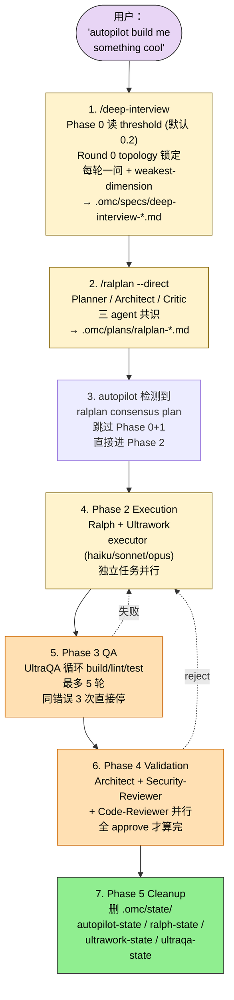
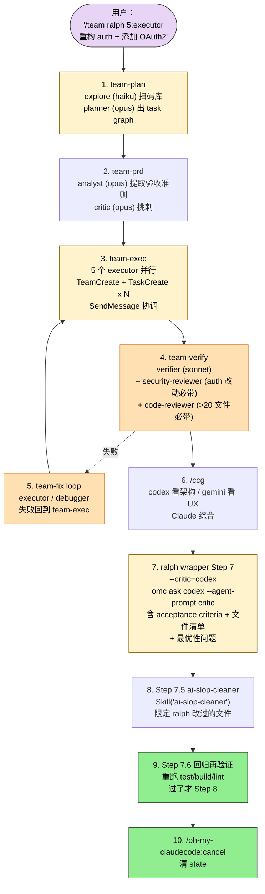
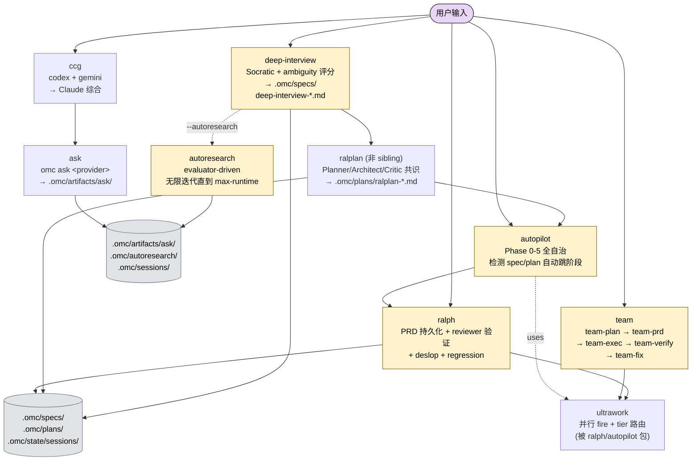

## 一句话简介

`oh-my-claudecode`（简称 OMC）是韩国独立开发者 Yeachan-Heo 维护的"零学习成本"Claude Code 多代理编排 plugin，README 第一句话就摆明态度——"Don't learn Claude Code. Just use OMC."。8 个核心 Skill（autopilot / ralph / ultrawork / team / deep-interview / ccg / ask / autoresearch）按"想法 → Socratic 澄清 → 共识规划 → 并行执行 → 验证收尾"装成完整流水线，自带 19 个 specialist agent、HUD 状态栏、PRD 持久化、自动 deslop 清理和 tmux CLI workers，让单条 `/autopilot "build a REST API"` 就能跑完整个 feature。

## 它解决什么问题

OMC README "Why oh-my-claudecode" 段把痛点压成 8 句话："zero configuration / team-first orchestration / natural language / automatic parallelization / persistent execution / cost optimization / learn from experience / real-time visibility"。每个核心 Skill 都能在 README 找到对应支撑：

- **当你被 Claude Code 原生命令、subagent 类型、model tier 选择搞得头大、想找一个"natural language interface"直接说人话的时候**——README "Why" 段第 3 句明示 "Natural language interface — No commands to memorize, just describe what you want"，autopilot SKILL.md 的 trigger 词覆盖 "autopilot / build me / create me / make me / full auto / handle it all / I want a/an..."，普通人讲话就能触发。
- **当你已经知道要做什么 feature、希望 Agent 一条命令端到端把活干完、不想手动调度每一步的时候**——`autopilot` SKILL.md `<Steps>` 段明示 5 个阶段全自动跑完：Phase 0 Expansion（Analyst+Architect 把想法变 spec）→ Phase 1 Planning（Architect+Critic 出实施计划）→ Phase 2 Execution（Ralph+Ultrawork 实施）→ Phase 3 QA（UltraQA 循环 build/lint/test 最多 5 轮）→ Phase 4 Validation（Architect / Security-Reviewer / Code-Reviewer 多视角批准）。
- **当你想跑一个必须完成、不能半路偷懒说"差不多了"的任务的时候**——`ralph` SKILL.md `<Purpose>` 段明示 "PRD-driven persistence loop that keeps working on a task until ALL user stories in prd.json have passes: true and are reviewer-verified"，trigger 词包含 "ralph / don't stop / must complete / finish this / keep going until done"，Step 7 还强制走 architect/critic/codex 三选一的 reviewer 验证 + Step 7.5 的 deslop 清理。
- **当你想把多个独立子任务并行跑、避免 sequential 等 LLM 一个一个出结果的时候**——`ultrawork` SKILL.md `<Execution_Policy>` 第一条："Fire all independent agent calls simultaneously — never serialize independent work"，按任务复杂度自动路由 Haiku / Sonnet / Opus 三个 tier，长任务用 `run_in_background: true` 跑。
- **当你有一个模糊想法、又不想让 Agent 拿着错误前提自己脑补半天的时候**——`deep-interview` SKILL.md 实现 Ouroboros-inspired Socratic 提问 + 数学化 ambiguity scoring，必须降到 threshold（默认 0.2）以下才允许进入执行。Phase 0 强制读 `omc.deepInterview.ambiguityThreshold` 设置，weakest-dimension targeting 每轮显式说明本轮问的是哪个维度。
- **当你需要让 Claude Code 一次性管 N 个 agent 干同一件事、还要互相通信和任务依赖的时候**——`team` SKILL.md 用 Claude Code 原生 team 工具替换了之前的 SQLite-based swarm，按 "team-plan → team-prd → team-exec → team-verify → team-fix (loop)" 5 阶段跑，每个阶段路由到 explore/planner/analyst/architect/executor/verifier/critic 等 specialist agent。
- **当你想同时拉 Codex 和 Gemini 出意见、又不想搞 tmux 那套 worker 编排的时候**——`ccg` SKILL.md "How It Works" 段：Claude 把请求拆成 Codex prompt（架构/后端/正确性）+ Gemini prompt（UX/设计/替代方案），通过 `omc ask codex` / `omc ask gemini` 各自跑一遍，最后 Claude 合成统一结论。
- **当你只想丢一句话给 Codex / Gemini / Claude 任一 advisor 拿建议、不需要架构编排的时候**——`ask` SKILL.md 提供 `omc ask <claude|codex|gemini> <question>` 单一入口，禁止手动拼 provider CLI flags（"Do NOT manually construct raw provider CLI commands"），所有输出落到 `.omc/artifacts/ask/<provider>-<slug>-<timestamp>.md`。
- **当你想跑一个长时间的"自我改进"任务、每轮跑 evaluator 看是否通过、不通过继续迭代的时候**——`autoresearch` SKILL.md `<Purpose>` 段明示 "stateful skill for bounded, evaluator-driven iterative improvement"，evaluator 必须输出包含 `pass` boolean 的 JSON，non-passing iteration 不停止；max-runtime 是主要的硬性 stop hook。配套 `/deep-interview --autoresearch` 做 mission 与 evaluator 的初始化设置。

## 安装方法

README "Quick Start" 段给了两条主线：

### 选项 1：Claude Code marketplace（推荐）

```bash
/plugin marketplace add https://github.com/Yeachan-Heo/oh-my-claudecode
```

**逐行输入**（README 明示 "enter them one at a time"，一次粘两行会失败）：

```bash
/plugin install oh-my-claudecode
```

### 选项 2：npm CLI / runtime

```bash
npm i -g oh-my-claude-sisyphus@latest
```

> README "Package naming" 段提醒：仓库 / plugin / 命令都叫 oh-my-claudecode，但 npm 包名是 `oh-my-claude-sisyphus`，升级时用后者。
>
> 安装可能出现 `deprecated prebuild-install@7.1.3` 警告，来源是 `better-sqlite3` 的 prebuild-install 依赖，不影响安装成功（issue #2913）。

### Setup（任选其一）

```bash
# 在 Claude Code / OMC session 中
/setup
/omc-setup

# 或终端跑
omc setup
```

如果用 `omc --plugin-dir <path>` 或 `claude --plugin-dir <path>` 启动，加 `--plugin-dir-mode` 或导出 `OMC_PLUGIN_ROOT`，避免 installer 重复装 skill/agent。

### 启用 Claude Code 原生 team

写入 `~/.claude/settings.json`：

```json
{
  "env": {
    "CLAUDE_CODE_EXPERIMENTAL_AGENT_TEAMS": "1"
  }
}
```

> README "Team Mode (Recommended)" 段：v4.1.7 起 team 取代 swarm 作为 canonical orchestration surface；没开实验开关 OMC 会警告并回退到非 team 执行。

### tmux CLI workers 前置依赖

```bash
# macOS
brew install tmux
# Ubuntu/Debian
sudo apt install tmux
# Windows
winget install psmux
```

可选外部 advisor：

```bash
npm install -g @openai/codex   # Codex CLI
npm install -g @google/gemini-cli  # Gemini CLI
```

### 更新

marketplace 安装：

```bash
/plugin marketplace update omc
/setup
```

npm 安装：

```bash
npm i -g oh-my-claude-sisyphus@latest
```

升级出问题清缓存：`/omc-doctor`。

## 核心理念 / 工作流哲学

README 把哲学浓缩成"Orchestration Modes"表，本质是**让用户用一句自然语言进入合适模式，OMC 负责自动选 specialist agent 和 model tier**：

| 模式 | 定位 | README 描述 |
|---|---|---|
| **Team** (推荐) | Canonical 多 agent 阶段化流水线 | `team-plan → team-prd → team-exec → team-verify → team-fix` |
| **omc team** (CLI) | tmux split-pane 跑 claude/codex/gemini 真进程 | 按需启动、跑完即灭 |
| **ccg** | 三模型 advisor 综合（Claude+Codex+Gemini） | 混合后端+UI 工作 |
| **Autopilot** | 单 lead agent 自治端到端 | "I want a..." 直接触发 |
| **Ultrawork** | 最大并行（非 team） | burst 模式批量改 |
| **Ralph** | verify/fix loop 直到 PRD 全过 | "must complete" / "don't stop" |
| **UltraQA** | 反复跑 build/lint/test 直到通过 | quality gate 反复跑 |
| **Pipeline** | sequential 阶段处理 | 严格顺序的多步转换 |

> README "Goal Workflow Guidance" 段：**session 内同一时刻只能有一个主 loop authority**——Claude Code `/goal` 是 native cross-turn completion；Ralph 是 single-agent verified completion；Team 是并行阶段化执行；UltraQA 是 quality-gate 反复循环。Artifact-only Ultragoal 是没有合适 loop 时的安全 fallback。

机制层面四件套：

1. **19 个 specialist agent + tier 路由**：architecture / research / design / testing / data science 各有专精，按任务复杂度自动选 Haiku/Sonnet/Opus。Model × Agent compatibility matrix 在 `docs/agents/model-compatibility.md`。
2. **Magic keywords**：`ralph` / `ulw` / `ralplan` 等自然语言关键字自动触发对应模式，team 仍走显式 `/team`。
3. **HUD statusline**：实时显示编排指标，需要 `OMC_PLUGIN_ROOT` 指向同一 checkout。
4. **Skill 学习与自动注入**：`.omc/skills/`（项目级）/ `~/.omc/skills/`（用户级）；项目级优先；`/skillify` 从 session 中抽取 reusable pattern，匹配 trigger 自动注入新 context。

## 包含哪些 Skills

OMC 仓库的 sibling_skills 列出 **8 个核心 Skill**（plugin 实际包含更多 agent / sub-skill，这里只覆盖 sibling 列）：

- **[autopilot](/articles/oh-my-claudecode-autopilot)（端到端自治执行）** — Phase 0 Expansion → Phase 1 Planning → Phase 2 Execution → Phase 3 QA → Phase 4 Validation 五阶段全自动。trigger 词覆盖 "autopilot / build me / create me / make me / full auto / handle it all"；检测到 `.omc/plans/ralplan-*.md` 或 `.omc/specs/deep-interview-*.md` 会跳过对应前置阶段；max QA 5 轮、validation 3 轮，cancel 用 `/oh-my-claudecode:cancel`。
- **[ralph](/articles/oh-my-claudecode-ralph)（PRD 驱动持久化循环）** — 自动生成或读 `prd.json`（session-scoped 在 `.omc/state/sessions/{sessionId}/prd.json`），逐 story 实施 → 验收准则验证 → 标 `passes: true` → 走到下一条。Step 7 选 architect / critic / codex 三种 reviewer 验证；Step 7.5 必跑 ai-slop-cleaner deslop pass（除非 `--no-deslop`）；Step 7.6 验证回归测试再通过一次。
- **[ultrawork](/articles/oh-my-claudecode-ultrawork)（并行执行引擎）** — 不带 persistence/verification，只管多 agent 并行 + tier 路由 + dependency-aware task graph。明确告诉用户 "Use `run_in_background: true` for operations over ~30 seconds"；轻量验收只跑 build/typecheck/affected tests。ralph 和 autopilot 都把 ultrawork 包在内层。
- **[deep-interview](/articles/oh-my-claudecode-deep-interview)（Socratic 澄清 + 数学化 ambiguity 评分）** — Phase 0 强制读 `omc.deepInterview.ambiguityThreshold`（默认 0.2）；Phase 1 自动检测 brownfield/greenfield；Round 0 topology 枚举锁定 components；每轮一个问题 + 显式 weakest-dimension targeting + ambiguity 分数透明展示。完成后写 `.omc/specs/deep-interview-{slug}.md` 喂给 ralplan 或 autopilot。
- **[team](/articles/oh-my-claudecode-team)（N 个 agent 共享任务列表）** — `team-plan → team-prd → team-exec → team-verify → team-fix` 五阶段；每阶段路由到 explore/planner/analyst/architect/executor/debugger/designer/writer/test-engineer/verifier/security-reviewer/code-reviewer 等 specialist；`/team` 跑 in-session native team；`omc team` 跑 tmux CLI workers（claude/codex/gemini）。
- **[ccg](/articles/oh-my-claudecode-ccg)（Claude-Codex-Gemini 三模型综合）** — 将一个请求拆成 Codex prompt（架构/后端）和 Gemini prompt（UX/设计），通过 `omc ask codex` + `omc ask gemini` 各自跑一遍，artifact 落到 `.omc/artifacts/ask/`，最后 Claude 综合统一回答。任一 CLI 不可用时降级到可用 provider 并标注限制。
- **[ask](/articles/oh-my-claudecode-ask)（单 advisor 路由）** — 唯一执行路径 `omc ask {{ARGUMENTS}}`，禁止手动拼 provider CLI flags。artifact 路径 `.omc/artifacts/ask/<provider>-<slug>-<timestamp>.md`。CLI 可用性校验：`claude --version` / `codex --version` / `gemini --version`。
- **[autoresearch](/articles/oh-my-claudecode-autoresearch)（有状态单 mission 改进 loop）** — 评估器必须输出含 `pass: bool` 的结构化 JSON；non-passing iteration **不停止**；max-runtime 是主硬性 stop hook。mission 设置必须先走 `/deep-interview --autoresearch`，artifact 默认在 `.omc/autoresearch/<mission-slug>/`，支持 Claude Code native cron 周期触发。`omc autoresearch` CLI 已 hard-deprecated。

## 典型工作流串讲

### 示例 A：3-Stage Pipeline——从一个模糊 idea 跑到验证完成

> 这是 README "Recommended Workflows" + autopilot SKILL.md "3-Stage Pipeline" 段直接支撑的主链路：deep-interview → ralplan → autopilot，三道质量门串起来。



1. **/deep-interview 澄清需求**：用户讲一句模糊的 "autopilot build me something cool"。deep-interview Phase 0 先打印 threshold 标记行（默认 0.2，来源是 user/project settings 或 default），Phase 1 用 `explore` agent 判断 brownfield/greenfield，Round 0 枚举顶层 components 并锁定，之后每轮单问一个最弱维度的问题，ambiguity 评分降到 threshold 以下且用户显式批准才能进入执行。
2. **/ralplan 共识规划**：deep-interview 写完 `.omc/specs/deep-interview-*.md` 后，autopilot SKILL.md 段说 "If deep-interview spec exists: Skip analyst+architect expansion, use the pre-validated spec directly as Phase 0 output. Continue to Phase 1"。再加一道 ralplan 让 Planner / Architect / Critic 三个 agent 共识后输出 `.omc/plans/ralplan-*.md`，这是质量最高的 plan。
3. **autopilot 检测到 ralplan plan 直接跳 Phase 2**：autopilot SKILL.md Step 1 明示——"If ralplan consensus plan exists (.omc/plans/ralplan-*.md or .omc/plans/consensus-*.md from the 3-stage pipeline): Skip BOTH Phase 0 and Phase 1 — jump directly to Phase 2 (Execution). The plan has already been Planner/Architect/Critic validated."
4. **Phase 2 Execution**：Ralph + Ultrawork 实际干活。Executor 按任务复杂度走 Haiku（简单查询）/ Sonnet（标准实现）/ Opus（复杂分析）。独立任务并行 fire（ultrawork SKILL.md `<Execution_Policy>` 第一条）。
5. **Phase 3 QA (UltraQA)**：循环跑 build、lint、test，最多 5 轮；**同一错误连续 3 轮存在**直接停下报告 fundamental issue。
6. **Phase 4 Validation**：Architect 看功能完整性 / Security-Reviewer 看安全 / Code-Reviewer 看质量，三家并行；任何一家 reject 都要修，最多 3 轮 re-validation。
7. **Phase 5 Cleanup**：删 `.omc/state/autopilot-state.json` / `ralph-state.json` / `ultrawork-state.json` / `ultraqa-state.json`，跑 `/oh-my-claudecode:cancel` 收尾。

### 示例 B：Ralph + Team + CCG 复合——并行修复 + 三模型 review

> 这条链路对应"一个跨模块大改、希望并行干活、最后要 Claude + Codex + Gemini 多模型 review"。来自 team SKILL.md 5 阶段流水线 + ralph SKILL.md "Tool_Usage" 段对 critic 选项的描述 + ccg SKILL.md。



1. **/team ralph 触发**：team SKILL.md "Usage" 段明示 `ralph` 是 team 的可选 modifier，"wraps the team pipeline in Ralph's persistence loop (retry on failure, architect verification before completion)"。`5:executor` 表示 team-exec 阶段用 5 个 executor worker；其他阶段仍按 routing 表选 specialist。
2. **team-plan**：`explore` (haiku) 扫码库相关区域，`planner` (opus) 出可运行的 task graph。复杂任务可加 `analyst` 处理不清晰的需求或 `architect` 处理复杂边界。
3. **team-prd**：scope 不清楚或验收准则缺失时入此阶段。`analyst` 提取需求，`critic` 挑战 scope。
4. **team-exec**：lead 跑 `TeamCreate("auth-refactor")` → `TaskCreate x 5` → `TaskUpdate` 预分配 owner → `Task(team_name=..., name="worker-1") x 5` spawn worker。worker 之间用 `SendMessage` 通信，lead 用 `TaskList` 轮询进度。
5. **team-verify**：`verifier` (sonnet) 默认走；auth/crypto 改动自动加 `security-reviewer`；>20 文件或架构改动自动加 `code-reviewer` (opus)。失败生成 fix task 进 team-fix。
6. **team-fix loop**：`executor` 修常规 / `debugger` 修 type & build error / `executor (opus)` 修复杂多文件 issue。修完回 team-exec → team-verify。
7. **/ccg 跑外部 advisor**：team-verify 通过后用户跑 `/ccg`，Claude 拆 Codex prompt（架构/正确性/后端）+ Gemini prompt（UX/可读性/替代方案）→ `omc ask codex` + `omc ask gemini` → artifact 落 `.omc/artifacts/ask/codex-*.md` 与 `gemini-*.md` → Claude 综合。
8. **Ralph Step 7 critic=codex**：ralph SKILL.md `<Steps>` 段 7 明示 `--critic=codex` 时用 `omc ask codex --agent-prompt critic` 走 approval pass，prompt 必须包含 (1) prd.json 完整 acceptance criteria、(2) 评估实现是否 **OPTIMAL**（不只对，是不是有显著更简单/更快/更易维护的方案）、(3) 评估所有相关代码（callers/callees/shared types/adjacent modules）、(4) 本次 ralph session 改动的文件清单。
9. **Step 7.5 deslop**：无条件跑 ai-slop-cleaner（除非 `--no-deslop`）。**注意 ai-slop-cleaner 是 skill 不是 agent**——`Skill("ai-slop-cleaner")` 而不是 `Task(subagent_type="oh-my-claudecode:ai-slop-cleaner")`，搞错会报 "Agent type not found"，且不能找名字相似的 agent（比如 code-simplifier）替代。
10. **Step 7.6 回归再验证**：deslop pass 可能引入 follow-up 修改，必须把 test/build/lint 全部重跑一遍，过了才进 Step 8 `/oh-my-claudecode:cancel` 收尾清 state。

### 示例 C：Autoresearch 一夜跑评估器驱动的自我改进

> 这条链路对应"我想让 Agent 持续跑直到 evaluator 通过、跑通了写决策日志、不通过继续迭代"。来自 deep-interview SKILL.md `<Autoresearch_Mode>` 段 + autoresearch SKILL.md 完整工作流。

1. **`/deep-interview --autoresearch improve startup performance`**：deep-interview 进入 autoresearch 模式，第一个问题强制问 "What should autoresearch improve or prove for this repo?"，之后收 evaluator 命令（如 `python perf/eval.py --json`），把 mission 和 evaluator 设为硬性 readiness gate（除了正常 ambiguity threshold 之外）。
2. **handoff 给 autoresearch skill**：deep-interview SKILL.md 明示 "do not bridge into omc-plan / autopilot / ralph / team / 旧的 omc autoresearch CLI"，必须走 `Skill("oh-my-claudecode:autoresearch")` 真正的 stateful skill。handoff 成功后宣布 mission slug、evaluator 命令、max-runtime ceiling、artifact 位置。
3. **autoresearch 迭代循环**：autoresearch SKILL.md `<Workflow>` 段每轮——跑一次 experiment/change → 跑 evaluator → 落 `.omc/autoresearch/<mission-slug>/runs/<run-id>/evaluations/iteration-NNNN.json` → append 人读 markdown 决策日志 → **non-passing 不停止，继续下一轮**。
4. **stop 条件**：达到 max-runtime；用户显式取消；runtime 记录的其他 explicit terminal condition。
5. **周期触发**：可选用 Claude Code native cron 周期跑同一 mission，append 新 run artifact 而不是覆盖旧实验。

## Skill 间协作关系图



**读图三条线索：**

1. **autopilot ⊃ ralph ⊃ ultrawork 包含关系**：ultrawork SKILL.md `<Advanced>` 段明示——"ralph (persistence wrapper) -- includes: ultrawork; autopilot (autonomous execution) -- includes: ralph -- includes: ultrawork"。三层依赖，顶层 autopilot 自动带后两层能力。
2. **deep-interview 是统一前置**：autopilot Phase 0 检测 `.omc/specs/deep-interview-*.md` 自动复用；autoresearch 模式专门有 `/deep-interview --autoresearch` 做 mission/evaluator 设置；ralplan（非 sibling 但 README 提到）也接 deep-interview spec 做 3-stage pipeline。
3. **ccg 套 ask**：ccg SKILL.md "How It Works" 段明示 step 2 "Claude 运行 `omc ask codex` / `omc ask gemini`"，artifact 落到同一 `.omc/artifacts/ask/` 目录。ask 是更基础的单 advisor 入口，ccg 是它的多 advisor 综合 wrapper。

## 常见坑 + 适合人群

### 常见坑

1. **粘贴多行 slash 命令会失败**：README "Step 1" 段明示 `/plugin marketplace add ...` 和 `/plugin install ...` 必须 "enter them one at a time"，一次粘两行会失败。
2. **npm 包名 vs 项目名不同**：repo / plugin / 命令都叫 oh-my-claudecode，npm 包是 `oh-my-claude-sisyphus`。装错包名会找不到 CLI。
3. **Team 模式必须开实验开关**：`CLAUDE_CODE_EXPERIMENTAL_AGENT_TEAMS=1` 未设置时 OMC 警告并降级到非 team 执行；session 内同时只能有一个主 loop authority（README "Goal Workflow Guidance"），混用 `/goal` + Ralph + Team 是反模式。
4. **ai-slop-cleaner 是 skill 不是 agent**：ralph SKILL.md `<Tool_Usage>` 段警告：调成 `Task(subagent_type="oh-my-claudecode:ai-slop-cleaner")` 会报 "Agent type not found"；必须用 `Skill("ai-slop-cleaner")`；**不能找 code-simplifier 当 closest match 替代**。
5. **deep-interview Phase 0 threshold 必须先打印**：deep-interview SKILL.md "Native Plugin Invocation Guard" 段强调，不管走 `/deep-interview` 还是 `/oh-my-claudecode:deep-interview`，Phase 0 都是 blocking——必须先打印 `Deep Interview threshold: <pct> (source: <where>)` 这一行才能继续。
6. **ccg 真的需要 codex / gemini CLI**：ccg SKILL.md "Requirements" 段：`npm install -g @openai/codex` + `npm install -g @google/gemini-cli`。任一缺失会降级或失败。
7. **autopilot 在 vague 输入时会卡 Phase 0**：autopilot SKILL.md Step 1 明示——"If input is vague (no file paths, function names, or concrete anchors): Offer redirect to /deep-interview for Socratic clarification before expanding"。建议先走 `/deep-interview` 把模糊想法澄清成 spec 再 autopilot。
8. **`omc autoresearch` CLI 已 hard-deprecated**：autoresearch SKILL.md `<Do_Not_Use_When>` 段 + README "Autoresearch (stateful skill)" 段均明示——authoritative workflow 是 `/deep-interview --autoresearch` + `/oh-my-claudecode:autoresearch`，旧 CLI 只是 shim。
9. **--plugin-dir 启动要导 OMC_PLUGIN_ROOT**：README "Step 2" 段提醒，用 `omc --plugin-dir <path>` 或 `claude --plugin-dir <path>` 启动时要加 `--plugin-dir-mode` 或导出 `OMC_PLUGIN_ROOT`，避免 installer 重复装 skill/agent。

### 适合人群

**适合：**

- 想用 Claude Code 又不想学一堆原生 subagent / model tier 概念的"零学习成本"用户
- 喜欢"一句自然语言进入合适模式"的开发者——`/autopilot`、`ralph`、`ulw`、`/team` 各管一摊
- 有多模型订阅（Claude + Codex + Gemini）、希望用 ccg 做交叉验证的人
- 长跑式任务需求：autoresearch 跑 evaluator-driven 迭代、ralph 跑 PRD 持久化、team 跑并行修复
- 韩国开发者社区 / Discord 活跃用户（README 顶部链接 Discord）

**不适合：**

- 只想要一个原子化、显式控制每一步的开发者——OMC 把大量决策交给自动 routing
- 不愿意装 tmux / Codex CLI / Gemini CLI 这套外部依赖的人——team / omc team / ccg 都依赖
- Claude Code session 内已经用别的主 loop authority（比如 native `/goal`）——README 明示 session 内只能有一个 loop authority
- 喜欢极简、只用核心 Claude Code 而避免 plugin 注入的 minimalist

---

本文基于 <https://github.com/Yeachan-Heo/oh-my-claudecode> 由 AI（claude-opus-4-7）辅助生成中文教程，原作者署名 Yeachan-Heo，许可证 MIT。

<!-- self-check
本文中提到的命令 / 文件 / URL 清单：
- `/plugin marketplace add https://github.com/Yeachan-Heo/oh-my-claudecode` / `/plugin install oh-my-claudecode` — README "Step 1: Install" 段
- `npm i -g oh-my-claude-sisyphus@latest` — README "Step 1: Install" 与 "Updating" 段
- `/setup` / `/omc-setup` / `omc setup` — README "Step 2: Setup" 段
- `omc --plugin-dir <path>` / `claude --plugin-dir <path>` / `OMC_PLUGIN_ROOT` — README "Step 2" 段 + "Step 3" 段
- `/autopilot "build a REST API for managing tasks"` / `autopilot: ...` — README "Step 3" 段
- `~/.claude/settings.json` 中 `CLAUDE_CODE_EXPERIMENTAL_AGENT_TEAMS: 1` — README "Team Mode" 段
- `brew install tmux` / `sudo apt install tmux` / `winget install psmux` — README "Platform & tmux" 表
- `npm install -g @openai/codex` / `npm install -g @google/gemini-cli` — README "Optional: Multi-AI Orchestration" 表 + ccg SKILL.md "Requirements" 段
- `/plugin marketplace update omc` / `/omc-doctor` — README "Updating" 段
- `/team N:agent-type "..."` / `/team ralph "..."` / `/team 5:executor "..."` — team SKILL.md "Usage" 段 + README "Team Mode" 段
- `omc team N:codex "..."` / `omc team N:gemini "..."` / `omc team N:claude "..."` / `omc team status` / `omc team shutdown` — README "tmux CLI Workers" 段
- `/ccg <task>` / `/oh-my-claudecode:ccg <task>` — ccg SKILL.md "Invocation" 段
- `/ask <claude|codex|gemini> <task>` / `omc ask <provider> <task>` — ask SKILL.md "Usage" 段 + README "Provider Advisor" 段
- `/ralph "..."` / `/ralph --no-deslop` / `--critic=architect|critic|codex` — ralph SKILL.md frontmatter + `<PRD_Mode>` 段
- `/deep-interview "..."` / `/deep-interview --autoresearch ...` — deep-interview SKILL.md frontmatter + `<Autoresearch_Mode>` 段
- `/oh-my-claudecode:autoresearch` — README "Autoresearch (stateful skill)" 段 + autoresearch SKILL.md
- `/oh-my-claudecode:cancel` — autopilot SKILL.md Step 5 + ralph SKILL.md Step 8
- `/skill list|add|remove|edit|search` / `/skillify` — README "Custom Skills" 段
- `.omc/state/sessions/{sessionId}/prd.json` / `prd.json` / `.omc/prd.json` — ralph SKILL.md `<PRD_Mode>` 段
- `.omc/specs/deep-interview-{slug}.md` / `.omc/plans/ralplan-*.md` / `.omc/plans/consensus-*.md` — autopilot SKILL.md Step 1 + deep-interview SKILL.md frontmatter
- `.omc/autopilot/spec.md` / `.omc/plans/autopilot-impl.md` — autopilot SKILL.md Steps 1-2
- `.omc/state/autopilot-state.json` / `ralph-state.json` / `ultrawork-state.json` / `ultraqa-state.json` — autopilot SKILL.md Step 5
- `.omc/artifacts/ask/<provider>-<slug>-<timestamp>.md` — ask SKILL.md "Artifacts" 段 + ccg SKILL.md
- `.omc/autoresearch/<mission-slug>/mission.md` / `evaluator.json` / `runs/<run-id>/evaluations/iteration-NNNN.json` / `decision-log.md` — autoresearch SKILL.md `<Required_Artifacts>` 段
- `.omc/sessions/*.json` / `.omc/state/agent-replay-*.jsonl` / `omc hud` — README "Monitoring & Observability" 段
- `omc.deepInterview.ambiguityThreshold`（默认 0.2）— deep-interview SKILL.md Phase 0 段
- `Skill("ai-slop-cleaner")` / `Skill("oh-my-claudecode:autoresearch")` — ralph SKILL.md Step 7.5 + deep-interview SKILL.md `<Autoresearch_Mode>` 段
- `Task(subagent_type="oh-my-claudecode:architect"|"critic"|"executor"|"debugger"|"designer"|"verifier"|"security-reviewer"|"code-reviewer")` — ralph/autopilot/team SKILL.md `<Tool_Usage>` 各段

场景章节支撑：
- 场景 1 "natural language interface" — README "Why" 段第 3 句 + autopilot SKILL.md trigger 词
- 场景 2 "端到端自治执行" — autopilot SKILL.md `<Purpose>` + `<Steps>` 段直接支撑
- 场景 3 "必须完成不能偷懒" — ralph SKILL.md `<Purpose>` + `<Use_When>` 段直接支撑
- 场景 4 "并行跑独立子任务" — ultrawork SKILL.md `<Execution_Policy>` 第一条直接支撑
- 场景 5 "模糊想法 Socratic 澄清" — deep-interview SKILL.md `<Purpose>` + Phase 0 段直接支撑
- 场景 6 "N 个 agent 互通信" — team SKILL.md "Architecture" + "Staged Pipeline" 段直接支撑
- 场景 7 "三模型综合" — ccg SKILL.md `<Purpose>` + "How It Works" 段直接支撑
- 场景 8 "单 advisor 问问题" — ask SKILL.md "Usage" + "Routing" 段直接支撑
- 场景 9 "evaluator-driven 自改进" — autoresearch SKILL.md `<Purpose>` + `<Workflow>` 段直接支撑

图 / 代码块处理：
- README "Orchestration Modes" 表 → 在"核心理念"段引用，未直接复制原表
- README "tmux CLI Workers" 表 → 安装段引用了 `omc team N:...` 命令，未复制原表
- team SKILL.md "Stage Agent Routing" 表 → 在示例 B 文字中引用 agent 类型，未直接复制原大表
- README 多处 bash 代码块（install / setup / update / team / ask）→ 完整保留原文
- 3 张 mermaid 新增：示例 A 3-stage pipeline / 示例 B Team+CCG+Ralph 复合 / 整体协作图
- autopilot SKILL.md `<Steps>` 段完整 5 阶段 → 在示例 A 中按 1-7 步串讲，未原文复制整段
- deep-interview SKILL.md Phase 0/1 细节 → 仅引用关键约束（threshold 来源、Round 0 topology、weakest-dimension），未原文复制

依赖关系（plugin-overview 必填）：
- 8 个 sibling_skills 全部列出：autopilot / ralph / ultrawork / deep-interview / team / ccg / ask / autoresearch（与 batch yaml 一致）
- 协作关系：ultrawork SKILL.md `<Advanced>` 段明示 autopilot⊃ralph⊃ultrawork；autopilot SKILL.md Step 1 明示读 `.omc/specs/deep-interview-*.md` 与 `.omc/plans/ralplan-*.md`；ccg SKILL.md "How It Works" 段明示通过 `omc ask` 调用 ask 路径；deep-interview SKILL.md `<Autoresearch_Mode>` 段明示 handoff 到 autoresearch skill；team SKILL.md "Usage" 段明示 `ralph` 是 team 的 modifier。全部 sibling 互相协作关系均来自源文件明示。

可疑项：
- 示例 B 提到 ralplan 是"非 sibling 但 README 提到"——准确：ralplan 不在本 plugin sibling_skills 列，但 README "In-session shortcuts" 表与 deep-interview "3-stage pipeline" 描述均提到 ralplan 是 OMC 提供的 skill，本文以"非 sibling 链接"形式标注
- 示例 C 中 deep-interview --autoresearch 后必须走 `Skill("oh-my-claudecode:autoresearch")`，这点直接来自 deep-interview SKILL.md `<Autoresearch_Mode>` 段最后一行，原文照搬
- "19 specialized agents" 来自 README "Intelligent Orchestration" 段；19 不是 sibling 列的 8 个 Skill，是 plugin 内部 agent 数量
- HUD "preset focused" 来自 README "Step 2" 段，本文未详细展开使用方法
- "ralplan / ralplan --direct" 触发 Planner/Architect/Critic 共识——来自 autopilot SKILL.md Step 1 "the plan has already been Planner/Architect/Critic validated" + deep-interview SKILL.md 3-stage pipeline 描述
-->
