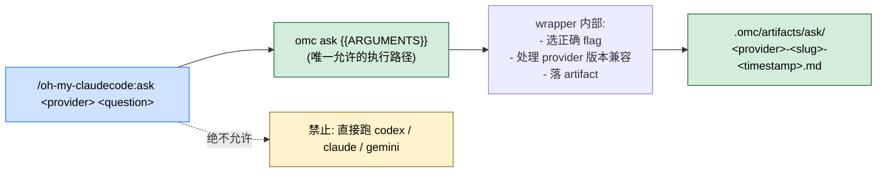

> 本 Skill 是 **oh-my-claudecode**（omc）套件的"统一 advisor 入口"，是 [ccg](/articles/omc-ccg) 和 [ralph](/articles/omc-ralph) 的 `--critic=codex` 路径共享的底层；与 [autopilot](/articles/omc-autopilot) / [ultrawork](/articles/omc-ultrawork) / [deep-interview](/articles/omc-deep-interview) / [team](/articles/omc-team) / [autoresearch](/articles/omc-autoresearch) 共同构成 omc 的"长跑式"自治矩阵。完整工作流见 [oh-my-claudecode 个人工作流总览](/articles/oh-my-claudecode-workflow)。

## 一句话简介

`ask` 是 Yeachan-Heo 在 omc 里的薄包装 Skill：把对 Claude / Codex / Gemini 三家本地 CLI 的调用统一收到 `omc ask <provider> <question>` 这一条命令背后，所有结果按 `.omc/artifacts/ask/<provider>-<slug>-<timestamp>.md` 自动落盘做 artifact，**禁止**直接裸调 `codex` / `claude` / `gemini`——因为 wrapper 帮你管 flag 选择、artifact 持久化、provider 版本兼容性。

## 它解决什么问题

不同于 `ccg` 那种"两家并行综合"或 `team` 那种"多 agent 编排"，ask 解决的是"**单次问一个 advisor 但要规范化**"的底层问题。覆盖以下场景：

- **当你想用 Claude / Codex / Gemini 任意一家做一次性 advisor 咨询的时候**——SKILL.md "Usage" 段直接给的 3 个示例：`/oh-my-claudecode:ask codex "review this patch from a security perspective"` / `gemini "suggest UX improvements"` / `claude "draft an implementation plan"`。
- **当你不想记三家 CLI 各自的 flag 名 / 不想踩"版本不同 flag 改名"的坑的时候**——SKILL.md "Routing" 段明示 `omc ask` wrapper "handles correct flag selection, artifact persistence, and provider-version compatibility automatically"；裸调会产生 "incorrect or outdated invocations"。
- **当你需要 advisor 输出可被后续 Skill 自动读取（比如 ccg 综合 / ralph critic）的时候**——SKILL.md "Artifacts" 段把落盘路径固化为 `.omc/artifacts/ask/<provider>-<slug>-<timestamp>.md`，是 ccg Step 3 直接消费的同一路径。
- **当你想在调用前先确认 CLI 可用、不被运行时"command not found"打断的时候**——SKILL.md "Requirements" 段给了 `claude --version` / `codex --version` / `gemini --version` 三条预检命令。
- **当你已经在 `team` / `ccg` / `ralph --critic=codex` 这种上层 Skill 里间接用 ask 的时候**——ask 是它们共享的标准底层，理解它能让上层调用行为更可预期。

## 安装方法

SKILL.md "Requirements" 段直接给的依赖：

| 项目 | 要求 |
|---|---|
| `omc ask` 命令 | 来自 oh-my-claudecode plugin 自身 |
| 至少一个 provider CLI | `claude` / `codex` / `gemini` 任选已装 + 已 authenticated |
| 预检命令 | `claude --version` / `codex --version` / `gemini --version` |

> SKILL.md frontmatter 没有 `argument-hint`，但 "Usage" 段给了形态 `/oh-my-claudecode:ask <claude|codex|gemini> <question or task>`。

## 核心机制 / 流程逐项解释

整套 Skill 极简，本质是"把 slash command 的参数直接传给 `omc ask` CLI"。



### 强制执行路径（Routing 段）

SKILL.md "Routing" 段是 ask 的核心契约：

> **Required execution path — always use this command:** `omc ask {{ARGUMENTS}}`
>
> **Do NOT manually construct raw provider CLI commands.** Never run `codex`, `claude`, or `gemini` directly to fulfill this skill.

也就是说**所有**调用必须通过 `omc ask` wrapper。绕过会导致：

- flag 选错（不同 provider 版本 flag 不一样）
- artifact 落不到位（后续 Skill 找不到）
- provider-version 兼容性问题

### Artifact 命名规则（"Artifacts" 段）

```text
.omc/artifacts/ask/<provider>-<slug>-<timestamp>.md
```

- `<provider>` ∈ {claude, codex, gemini}
- `<slug>` 是 wrapper 从 question 生成的短标识
- `<timestamp>` 是调用时刻

这个命名约定让 ccg 能用通配符 `codex-*.md` / `gemini-*.md` 取到最新 artifact，也让 ralph 在 `--critic=codex` 时能定位 critic 输出。

### 3 个 provider 的典型分工

| Provider | 典型适用 | 来自 SKILL.md 的示例 |
|---|---|---|
| codex | 安全 / 架构 / 后端正确性向 review | `"review this patch from a security perspective"` |
| gemini | UX / 文档 / 替代方案向建议 | `"suggest UX improvements for this flow"` |
| claude | 实现计划 / 草稿 / 内部 second opinion | `"draft an implementation plan for issue #123"` |

> 注：这只是 SKILL.md 给的示例倾向，不是硬约束，你可以让 codex 写 UX、让 gemini 做安全——但默认分工沿用上面三类能减小决策成本。

### {{ARGUMENTS}} 占位符

SKILL.md 底部留了 `Task: {{ARGUMENTS}}` 占位行——表示 slash command 的全部参数（含 provider 名）原样传给 `omc ask` CLI。不需要 Claude 在中间做参数重排或拆解。

## 实战 demo

SKILL.md "Usage" + "Examples" 段给的 3 个示例（原文）：

```bash
/oh-my-claudecode:ask codex "review this patch from a security perspective"
/oh-my-claudecode:ask gemini "suggest UX improvements for this flow"
/oh-my-claudecode:ask claude "draft an implementation plan for issue #123"
```

**Skill 内部活动**（基于源契约）：

```text
1. Claude 收到 slash command,提取 ARGUMENTS = "codex \"review this patch...\""
2. 通过 Bash 跑: omc ask codex "review this patch from a security perspective"
3. wrapper 内部:
   - 验证 codex CLI 可用 (相当于 codex --version)
   - 选择正确 flag (比如 codex 当前版本的非交互式选项)
   - 跑 codex 拿结果
   - 落 .omc/artifacts/ask/codex-review-this-patch-2026-06-02T14-22-08.md
4. Claude 把 artifact 内容 (或摘要) 回给用户
```

**预检示例**（"Requirements" 段原文）：

```bash
claude --version
codex --version
gemini --version
```

如果其中一个返回 "command not found"，说明对应 provider 不可用——ask Skill 调用前应该先做这一步预检（或在上层 Skill 如 ccg 中走 Fallback 策略）。

## 与其他官方 Skills 的搭配建议

ask 是 omc 内部多个上层 Skill 的共享底层：

- [`omc-ccg`](/articles/omc-ccg) — **源文件未直接点名**，但 ccg SKILL.md 明示 ccg 通过 `omc ask codex` + `omc ask gemini` 调用本 Skill 的底层 CLI。两者是"底层 CLI + 上层编排"的关系。
- [`omc-ralph`](/articles/omc-ralph) — **源文件未直接点名**，但 ralph 的 `--critic=codex` 路径通过 `omc ask codex --agent-prompt critic` 调本底层。
- [`omc-team`](/articles/omc-team) — sibling skill，team 可在 worker 内调用 `omc ask` 做单次 advisor 咨询（**非源文件明示**）。
- [`omc-autopilot`](/articles/omc-autopilot) / [`omc-ultrawork`](/articles/omc-ultrawork) / [`omc-deep-interview`](/articles/omc-deep-interview) / [`omc-autoresearch`](/articles/omc-autoresearch) — sibling skills，**非源文件明示**搭配。

> 反幻觉提示：本 SKILL.md 本身没有"搭配使用"段，所有上层关系都是"上层 Skill 的 SKILL.md 反向引用 ask"得出的——ask 自己只是个底层薄壳。

## 常见坑 + 注意事项

源 SKILL.md "Routing" / "Requirements" / "Artifacts" 段给的注意点：

1. **绝不能裸调 `claude` / `codex` / `gemini`**——"Routing" 段明示 "Do NOT manually construct raw provider CLI commands. Manually assembling provider CLI flags will produce incorrect or outdated invocations."（源明示）
2. **provider CLI 必须先装 + authenticated**——"Requirements" 段明示，没装的话 wrapper 会失败（源明示）
3. **artifact 路径是约定**——上层 Skill 依赖 `.omc/artifacts/ask/<provider>-*.md` 形态，自己定制 artifact 路径会破坏 ccg / ralph 的下游消费（源 "Artifacts" 段明示）
4. **provider-version 兼容性由 wrapper 管**——升级 provider CLI 后由 wrapper 适配，不需要修改 Skill 调用（源 "Routing" 段明示）
5. **slug 由 wrapper 生成**——你不需要也不应该在 prompt 里塞 "slug=xxx" 之类参数（基于 artifact 命名约定反推，非源原文）
6. **预检不是必须，但出错时有用**——"Requirements" 段给了 `--version` 命令，遇到 "command not found" 时先跑它定位问题（源明示）
7. **本 Skill 不做 prompt 工程**——ask 只是路由层，不会改你的 question；要做"为 codex 裁剪 prompt"应该在上层（如 ccg）做（基于全文反推，非源原文）
8. **artifact 不自动清理**——`.omc/artifacts/ask/` 会持续累积；周期清理由用户自己负责（基于全文反推，非源原文）

## 适合人群

**适合：**

- 在 Claude Code 里想统一调三家 CLI、不想记 flag 的工程师
- 已经在 omc 跑 ccg / ralph --critic=codex 等上层 Skill、想理解底层路由的人
- 喜欢 advisor 输出有持久化 artifact 可复盘的洁癖用户
- 多 provider 都装了、希望按问题类型挑 advisor 的 power user

**不适合：**

- 只用一家 LLM、不需要跨 provider 路由的人——直接在那家 CLI 里聊
- 没装 codex / gemini 也不打算装的人——ask 对你来说只能调 claude，价值有限
- 想做长跑 / 持久任务的人——用 `ralph` / `autopilot`
- 想做多 advisor 并行综合的人——用 `ccg`

---

本文基于 <https://github.com/Yeachan-Heo/oh-my-claudecode> 由 AI（claude-opus-4-7）辅助生成中文教程，原作者署名 Yeachan-Heo，许可证 MIT。

<!-- self-check
本文中提到的命令 / 文件 / URL 清单：
- `/oh-my-claudecode:ask <claude|codex|gemini> <question or task>` — 源 "Usage" 段原文
- `omc ask {{ARGUMENTS}}` — 源 "Routing" 段原文
- `.omc/artifacts/ask/<provider>-<slug>-<timestamp>.md` — 源 "Artifacts" 段原文
- 3 个示例调用 (codex security review / gemini UX / claude impl plan) — 源 "Usage" 段原文
- `claude --version` / `codex --version` / `gemini --version` — 源 "Requirements" 段原文
- "Do NOT manually construct raw provider CLI commands" — 源 "Routing" 段原文

场景章节支撑：
- 场景 1 单次 advisor 咨询 — 源 "Usage" + "Examples" 直接支撑
- 场景 2 不裸调 CLI — 源 "Routing" 段直接支撑
- 场景 3 artifact 可被下游消费 — 源 "Artifacts" 段直接支撑
- 场景 4 预检 CLI 可用 — 源 "Requirements" 段直接支撑
- 场景 5 作为上层 Skill 底层 — 基于 ccg / ralph SKILL.md 反向引用 ask 的事实 (本 SKILL.md 未直接点名)

图 / 代码块处理：
- 源文件中无 dot / mermaid;本文新增 1 张 mermaid 把 wrapper 强制路径 + artifact 落盘 + 禁裸调串成图,节点关键词全部来自源文件原文
- 源文件 3 个 bash code block (Usage / Routing / Requirements) 全部按 v3 规则保留原文
- 实战 demo "Skill 内部活动" 步骤是基于 Routing 契约的反推示意,具体 flag 选择和 slug 生成细节非源文件原文

依赖关系（plugin-skill 必填）：
- 兄弟 `omc-ccg` — 源文件未直接点名,但本文已标注"反向引用关系" (ccg SKILL.md 明示 omc ask 是其底层)
- 兄弟 `omc-ralph` — 源文件未直接点名,但本文已标注"反向引用关系" (ralph SKILL.md 明示 --critic=codex 走 omc ask codex)
- 其他兄弟 (`autopilot` / `ultrawork` / `deep-interview` / `team` / `autoresearch`) — 源文件未直接点名搭配关系,文中已逐条标注"非源文件明示"

可疑项：
- "3 个 provider 的典型分工" 表格中给出的 codex=安全、gemini=UX、claude=实现计划 分工是源 "Examples" 段示例的归纳,不是源文件硬约束,文中已明示"只是 SKILL.md 给的示例倾向"
- "Slug 由 wrapper 生成" / "artifact 不自动清理" / "本 Skill 不做 prompt 工程" 等几条注意事项是基于全文反推的,文中已标注"非源原文"
-->
