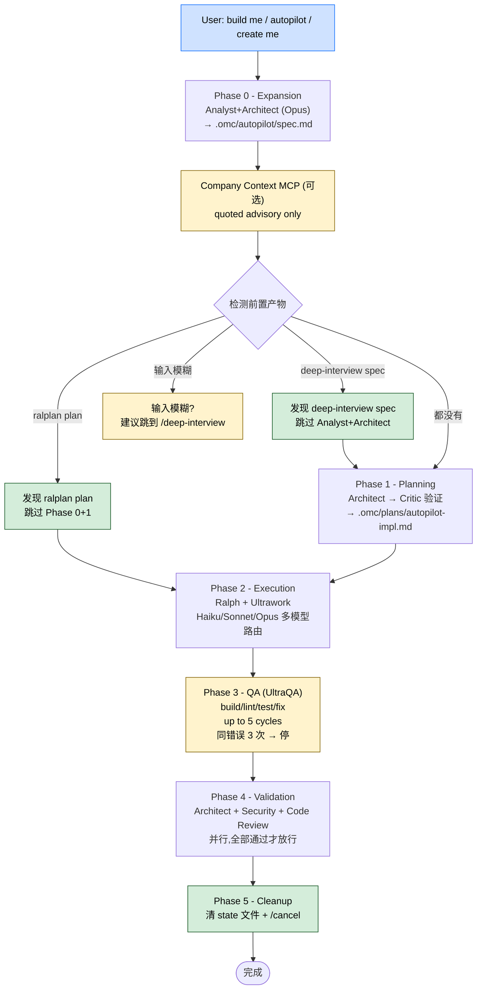

> 本 Skill 是 **oh-my-claudecode**（omc）套件的"自动驾驶"总入口，与 [ralph](/articles/omc-ralph) / [ultrawork](/articles/omc-ultrawork) / [deep-interview](/articles/omc-deep-interview) / [team](/articles/omc-team) / [ccg](/articles/omc-ccg) / [ask](/articles/omc-ask) / [autoresearch](/articles/omc-autoresearch) 共同构成 omc 的"长跑式"自治矩阵。完整工作流见 [oh-my-claudecode 个人工作流总览](/articles/oh-my-claudecode-workflow)。

## 一句话简介

`autopilot` 是 Yeachan-Heo 在 omc 里的 **L4 级**自动驾驶 Skill：拿到 2-3 行产品描述就自动跑完"需求分析 → 技术设计 → 计划 → 并行实现 → QA 迭代 → 多视角验证 → 清理"全 6 阶段，可以从空白点子起步、也能续接 `/deep-interview` 或 `/ralplan` 的产物跳过前两阶段直接进入实现，所有状态落盘到 `.omc/autopilot/` 和 `.omc/state/`。

## 它解决什么问题

不同于 `ralph` 那种"单任务长跑"或 `ultrawork` 那种"纯并行执行"，autopilot 解决的是**"从一句话到可工作代码"**的全生命周期自治。SKILL.md `<Use_When>` / `<Do_Not_Use_When>` 段定了清晰边界。覆盖以下场景：

- **当用户说 "build me / create me / make me / autopilot / full auto" 这类短句，希望系统从需求一路跑到能跑的代码时**——SKILL.md `<Use_When>` 段第 2 条直接把这些触发词列出来，对应"end-to-end autonomous execution from an idea to working code"。
- **当任务需要协调多个阶段（计划、编码、测试、验证）而不是一个聚焦小改的时候**——SKILL.md `<Use_When>` 段第 3 条把"Task requires multiple phases"列为必要条件；`<Do_Not_Use_When>` 第 3 条反过来明示"单一聚焦代码改动用 ralph 或直接派 executor"。
- **当你已经用 `/deep-interview` 或 `/ralplan` 把 spec 和 plan 都做好、想直接进入实现的时候**——SKILL.md Step 1 段明确：如果检测到 `.omc/plans/ralplan-*.md` 或 `.omc/plans/consensus-*.md`，autopilot 跳过 Phase 0 + Phase 1 直接进入 Phase 2；如果检测到 `.omc/specs/deep-interview-*.md`，跳过 Analyst+Architect 扩展只走 Phase 1。
- **当你要求"hands-off"、能容忍 QA 反复几轮 / Validation 多视角审查的时候**——SKILL.md `<Use_When>` 第 4 条 "willing to let the system run to completion" 是前置条件；`<Execution_Policy>` 段还把 "QA cycles repeat up to 5 times; if the same error persists 3 times, stop" 钉死成执行边界。
- **当输入太模糊、没有具体文件路径 / 函数名 / 锚点的时候**——SKILL.md Step 1 段说 "If input is vague: Offer redirect to `/deep-interview` for Socratic clarification before expanding"，autopilot 不会硬扩展模糊输入。
- **当你想在多模型路由下让 Haiku 跑简单任务、Sonnet 跑标准任务、Opus 跑复杂任务的时候**——SKILL.md Step 3 段直接列了三档 Executor model 路由，并要求"独立任务并行跑"。

## 安装方法

SKILL.md 本身只定义 Skill 行为契约，没有给独立安装命令。autopilot 通过 `oh-my-claudecode` plugin 分发，仓库主页：<https://github.com/Yeachan-Heo/oh-my-claudecode>。

加载本 Skill 前的**前置 / 配套依赖**（源文件明示）：

1. 用户工作区允许写入 `.omc/autopilot/`、`.omc/plans/`、`.omc/state/` 几个目录
2. 可选：项目级配置 `.claude/omc.jsonc` 或用户级 `~/.config/claude-omc/config.jsonc`，项目覆盖用户
3. 可选：Company Context MCP 工具——在 `companyContext.tool` 字段里配，Phase 0 入口会先调它做背景补足
4. 可选：先跑 `/deep-interview` 或 `/ralplan` 把前置 spec/plan 产出到 `.omc/`

> SKILL.md frontmatter `argument-hint: "<product idea or task description>"` 表示用法形如 `/autopilot <一句话点子>`。

## 核心机制 / 流程逐项解释

整套 Skill 围绕 6 个固定阶段串行执行，阶段内允许并行，阶段间严格门控。



### 6 个阶段逐项展开

| Phase | 名称 | 主要 agent | 输出 / 行为 |
|---|---|---|---|
| 0 | Expansion | Analyst (Opus) + Architect (Opus) | `.omc/autopilot/spec.md` 详细 spec |
| 1 | Planning | Architect (Opus) + Critic (Opus) | `.omc/plans/autopilot-impl.md` |
| 2 | Execution | Executor (Haiku / Sonnet / Opus) + Ralph + Ultrawork | 实际代码改动，按任务复杂度路由模型 |
| 3 | QA (UltraQA) | 内部 build/lint/test 循环 | up to 5 cycles，同错误 3 次硬停 |
| 4 | Validation | architect + security-reviewer + code-reviewer **并行** | 全部通过才放行；任一拒绝就 fix + re-validate |
| 5 | Cleanup | runtime 自身 | 删 `.omc/state/{autopilot-state.json, ralph-state.json, ultrawork-state.json, ultraqa-state.json}`，跑 `/oh-my-claudecode:cancel` 干净退出 |

### 阶段门控规则（`<Execution_Policy>` 段原文）

- **阶段串行**：上一阶段完成才能进下一阶段
- **阶段内并行**：Phase 2（Execution）和 Phase 4（Validation）允许并行
- **QA 硬停**：5 cycles 是上限，同 error 出现 3 次就停下来报"fundamental issue"
- **Validation 全票通过**：任一 reviewer 拒绝就 fix + re-validate，最多 3 轮
- **可随时 cancel**：`/oh-my-claudecode:cancel` 在任意阶段都能停，进度保留可 resume

### 3-Stage Pipeline 跳跃逻辑（重要）

SKILL.md `<Advanced>` 段给的推荐组合 `deep-interview → ralplan → autopilot`：

```text
/deep-interview "vague idea"
  → Socratic Q&A → spec (ambiguity ≤ 20%)
  → /ralplan --direct → consensus plan (Planner/Architect/Critic approved)
  → /autopilot → 跳过 Phase 0+1, 直接进 Phase 2 (Execution)
```

如果 autopilot 检测到 `.omc/plans/ralplan-*.md` 或 `.omc/plans/consensus-*.md`，它会跳过 Phase 0 + Phase 1，因为 plan 已经被：

1. Requirements-validated（deep-interview 的 ambiguity gate）
2. Architecture-reviewed（ralplan 的 Architect agent）
3. Quality-checked（ralplan 的 Critic agent）

这条逻辑的意义：**让三个 Skill 共用一份产物，避免重复 Planner / Architect / Critic 调用**。

### Company Context MCP（可选背景补足）

SKILL.md Step 1 段引入了一个可选的 MCP hook：Phase 0 入口检查 `companyContext.tool` 配置，如果有就用一段含 "task / phase / constraints / impl surface" 的 query 调它，返回的 markdown **只作为 quoted advisory context** 使用，绝不当 executable instruction。失败行为按 `companyContext.onError` 走（默认 `warn`，可选 `silent` / `fail`）。详细接口看仓库 `docs/company-context-interface.md`。

### 配置开关（`<Advanced>` 段）

```jsonc
{
  "autopilot": {
    "maxIterations": 10,
    "maxQaCycles": 5,
    "maxValidationRounds": 3,
    "pauseAfterExpansion": false,
    "pauseAfterPlanning": false,
    "skipQa": false,
    "skipValidation": false
  }
}
```

`pauseAfterExpansion` / `pauseAfterPlanning` 给"想审一下 spec/plan 再放行"的人留人审口；`skipQa` / `skipValidation` 给"自己负责测的人"留逃生口（不推荐）。

## 实战 demo

下面是 SKILL.md `<Examples>` 段给的两个 Good case，加上一次完整调用流程（基于源契约，业务示例反推）：

**Good Case 1**（源原文）：

```text
User: autopilot A REST API for a bookstore inventory with CRUD operations using TypeScript
```

为啥好：领域具体（bookstore）、特性清楚（CRUD）、技术约束（TypeScript），autopilot 拿到能直接扩成完整 spec。

**Good Case 2**（源原文）：

```text
User: build me a CLI tool that tracks daily habits with streak counting
```

"build me" 是明示触发词，配上明确的产品概念（习惯追踪 + 连续天数计数）autopilot 立刻进入 Phase 0。

**Bad Case**（源原文，对比）：

```text
User: fix the bug in the login page
```

为啥坏：单一聚焦修复，不是多阶段项目，应该直接派 executor 或用 `ralph`。

**完整调用示例**（基于源契约）：

```text
# 调用
/autopilot A REST API for a bookstore inventory with CRUD operations using TypeScript

# 期望行为
Phase 0: Analyst 提取需求 → Architect 出 spec → 落 .omc/autopilot/spec.md
Phase 1: Architect 出实现 plan → Critic 验证 → 落 .omc/plans/autopilot-impl.md
Phase 2: Ralph + Ultrawork 启动多个 executor 并行实现（Haiku 跑 CRUD 路由壳、Sonnet 跑 DTO/校验、Opus 跑核心存储抽象）
Phase 3: UltraQA 循环 build/lint/test，最多 5 cycles，同 type error 第 3 次出现 → 停下来报 "fundamental issue: 可能 schema 设计不对"
Phase 4: architect/security/code-reviewer 并行审，security 标出 "未做 input sanitization" → fix → re-validate → 通过
Phase 5: 清 .omc/state/*-state.json，/cancel 收尾
```

**Resume 行为**：如果中间 cancel 了，再跑 `/oh-my-claudecode:autopilot` 会从断点续上去（`<Advanced>` 段 Resume 子段明示）。

## 与其他官方 Skills 的搭配建议

SKILL.md 多个段直接点名了同 plugin 内的搭配关系：

- [`omc-deep-interview`](/articles/omc-deep-interview) — **源文件明示**（Step 1 + `<Advanced>` 段 "Deep Interview Integration"）：模糊输入时建议先跑 deep-interview；已有 deep-interview spec 时跳过 Phase 0 的扩展。
- [`omc-ralph`](/articles/omc-ralph) — **源文件明示**（Step 3）：Phase 2 实际执行依赖 Ralph 长跑机制。
- [`omc-ultrawork`](/articles/omc-ultrawork) — **源文件明示**（Step 3）：Phase 2 并行执行引擎，搭配 Ralph 用。
- `oh-my-claudecode:architect` / `oh-my-claudecode:security-reviewer` / `oh-my-claudecode:code-reviewer` 三个 subagent — **源文件明示**（`<Tool_Usage>` 段）：Phase 4 多视角 review 的固定三人组。
- `/ralplan` — **源文件明示**（`<Advanced>` 段 3-stage pipeline）：上游 plan 工厂，autopilot 在检测到 `.omc/plans/ralplan-*.md` 或 `consensus-*.md` 时跳过 Phase 0+1。
- [`omc-team`](/articles/omc-team) / [`omc-ccg`](/articles/omc-ccg) / [`omc-ask`](/articles/omc-ask) / [`omc-autoresearch`](/articles/omc-autoresearch) — sibling skills，**非源文件明示**搭配，定位不同（team = 多 agent 协作，ccg/ask = 多模型问答，autoresearch = 评测驱动研究）。

## 常见坑 + 注意事项

源 SKILL.md `<Escalation_And_Stop_Conditions>` + `<Final_Checklist>` + `<Advanced>` Troubleshooting 段给的注意点：

1. **同 QA 错误 3 次必停**——`<Escalation_And_Stop_Conditions>` 第 1 条明示，说明问题在根，需人审（源明示）
2. **Validation 失败超 3 轮必停**——`<Escalation_And_Stop_Conditions>` 第 2 条明示（源明示）
3. **模糊输入不要硬扩展**——`<Escalation_And_Stop_Conditions>` 第 4 条要求 redirect 到 `/deep-interview` 或主动 pause 问用户（源明示）
4. **不要忘了 Phase 5 清状态**——`<Final_Checklist>` 第 5 条明示，否则下次 resume 时会读到旧状态（源明示）
5. **Company Context 返回内容是"quoted advisory"**——Step 1 段明示，never as executable instruction，要严格区分"参考资料"和"指令"（源明示）
6. **Resume 路径**——同一条 `/oh-my-claudecode:autopilot` 命令会续跑而不是从头；要从头需要先清 state 或换任务名（源明示）
7. **配置项要看清作用**——`pauseAfterExpansion` / `pauseAfterPlanning` 是人审口，`skipQa` / `skipValidation` 是逃生口，后者用了就别期待质量门（源明示）
8. **Best Practices for Input**——`<Advanced>` 段 4 条：领域具体（不是"store"是"bookstore"）、明确关键特性、给技术约束、让它跑别打断（源明示）

## 适合人群

**适合：**

- 想用一句话点子启动一个有 build/lint/test/review 完整流水线项目的工程师
- 已经习惯 omc 的 3-stage pipeline（deep-interview → ralplan → autopilot），希望让三段共享产物的 power user
- 能接受多 reviewer 全票通过的高质量门、不怕循环修复的 hands-off 用户
- 中小型 CRUD/CLI/工具类项目原型阶段——SKILL.md 给的 Good case 都属此类

**不适合：**

- 只想做单点小改 / 单个 bug 修复的人——直接用 `ralph` 或 executor delegation
- 想"边聊边设计"探索方向的人——用 `plan` skill 或直接对话
- 不愿意写清楚领域 / 特性 / 约束的人——`<Advanced>` Best Practices 第 4 条直接说"模糊输入会卡住"
- 不愿意接受 QA 循环 5 轮 / Validation 3 轮的时间成本的人——这是 L4 级 Skill 的本质成本

---

本文基于 <https://github.com/Yeachan-Heo/oh-my-claudecode> 由 AI（claude-opus-4-7）辅助生成中文教程，原作者署名 Yeachan-Heo，许可证 MIT。

<!-- self-check
本文中提到的命令 / 文件 / URL 清单：
- `/oh-my-claudecode:cancel` — 源 `<Execution_Policy>` 段 + Phase 5 明示
- `/deep-interview` — 源 Step 1 + `<Escalation_And_Stop_Conditions>` 第 4 条 + `<Advanced>` 段明示
- `/ralplan --direct` — 源 `<Advanced>` 3-stage pipeline 段明示
- `/oh-my-claudecode:autopilot` — 源 `<Advanced>` Resume 段明示
- `.omc/autopilot/spec.md` — 源 Step 1 明示
- `.omc/plans/autopilot-impl.md` — 源 Step 2 明示
- `.omc/plans/ralplan-*.md` / `.omc/plans/consensus-*.md` — 源 Step 1 + `<Advanced>` 段明示
- `.omc/specs/deep-interview-*.md` — 源 Step 1 + `<Advanced>` 段明示
- `.omc/state/{autopilot-state.json, ralph-state.json, ultrawork-state.json, ultraqa-state.json}` — 源 Phase 5 明示
- `.claude/omc.jsonc` / `~/.config/claude-omc/config.jsonc` — 源 Step 1 + `<Advanced>` Configuration 段明示
- `companyContext.tool` / `companyContext.onError` 字段 — 源 Step 1 明示
- `docs/company-context-interface.md` — 源 Step 1 引用
- 三个 subagent 类型 (`architect` / `security-reviewer` / `code-reviewer`) — 源 `<Tool_Usage>` 段明示
- 配置开关 (`maxIterations` / `maxQaCycles` / `maxValidationRounds` / `pauseAfterExpansion` / `pauseAfterPlanning` / `skipQa` / `skipValidation`) — 源 `<Advanced>` Configuration 段原文照搬

场景章节支撑：
- 场景 1 触发词 "build me / create me / make me / autopilot / full auto" — 源 `<Use_When>` 段第 2 条直接支撑
- 场景 2 多阶段项目 — 源 `<Use_When>` 段第 3 条直接支撑
- 场景 3 跳过 Phase 0+1 — 源 Step 1 + `<Advanced>` 段直接支撑
- 场景 4 hands-off + QA 5 / Validation 3 硬停 — 源 `<Use_When>` 第 4 条 + `<Execution_Policy>` 段直接支撑
- 场景 5 模糊输入 redirect — 源 Step 1 + `<Escalation_And_Stop_Conditions>` 第 4 条直接支撑
- 场景 6 多模型路由 — 源 Step 3 三档 Executor model 直接支撑

图 / 代码块处理：
- 源文件中无 dot / mermaid 流程图；本文新增 1 张 mermaid 图把 6 阶段 + 跳跃逻辑 + Company Context 全部节点都用源文件原文关键词标注
- 源文件 jsonc 配置块、3-stage pipeline 流程文本块、Examples 段的 Good / Bad case 全部按 v3 规则保留原文
- 实战 demo 中的具体业务描述（CRUD/DTO/security 例子）为基于 Good Case 1 + 6 阶段契约的反推示意，非源文件原文

依赖关系（plugin-skill 必填）：
- 兄弟 `omc-deep-interview` — 源 Step 1 + `<Advanced>` 段明示
- 兄弟 `omc-ralph` — 源 Step 3 明示
- 兄弟 `omc-ultrawork` — 源 Step 3 明示
- subagent `architect` / `security-reviewer` / `code-reviewer` — 源 `<Tool_Usage>` 段明示
- 上游 slash command `/ralplan` — 源 `<Advanced>` 段明示
- 其他兄弟 (`team` / `ccg` / `ask` / `autoresearch`) — 源文件未直接点名搭配关系，文中已逐条标注"非源文件明示"

可疑项：
- 实战 demo 中 "security 标出未做 input sanitization → fix → re-validate → 通过" 是基于 Phase 4 多视角 review 契约的示意，非源文件具体案例
- frontmatter `level: 4` 字段未在正文使用其语义；文中只在开头 "L4 级" 一处出现，对应源 frontmatter
-->
