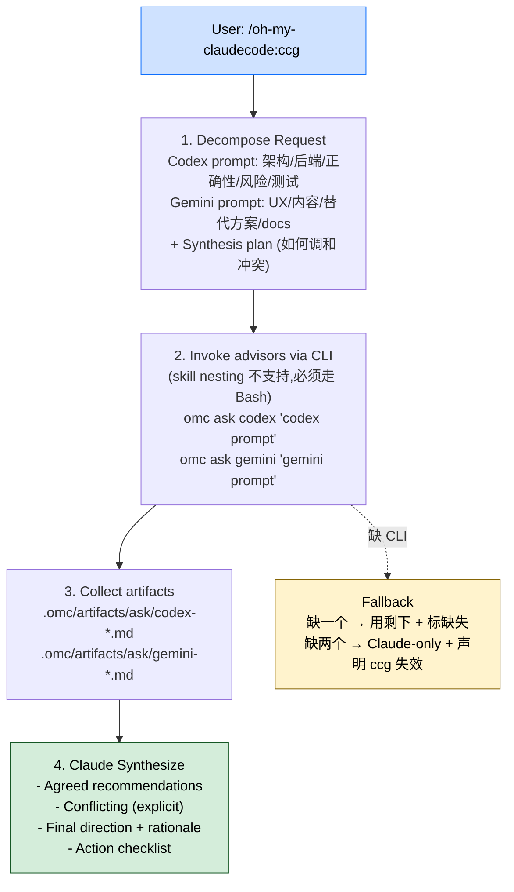

> 本 Skill 是 **oh-my-claudecode**（omc）套件的"三模型快速咨询"模块，与 [autopilot](/articles/omc-autopilot) / [ralph](/articles/omc-ralph) / [ultrawork](/articles/omc-ultrawork) / [deep-interview](/articles/omc-deep-interview) / [team](/articles/omc-team) / [ask](/articles/omc-ask) / [autoresearch](/articles/omc-autoresearch) 共同构成 omc 的"长跑式"自治矩阵。完整工作流见 [oh-my-claudecode 个人工作流总览](/articles/oh-my-claudecode-workflow)。

## 一句话简介

`ccg` 是 Yeachan-Heo 在 omc 里的 **L5 级**三模型咨询 Skill：把用户请求拆成两份 advisor prompt，并行调 `omc ask codex` 和 `omc ask gemini` 拿到 Codex（架构 / 后端 / 风险向）和 Gemini（UX / 文档 / 替代方案向）两份独立外部意见，artifact 自动落到 `.omc/artifacts/ask/`，最后由 Claude 把两份输出综合成一个统一答案（含一致 / 冲突 / 终选方向 / 行动 checklist）。

## 它解决什么问题

不同于 `team` 那种"启动 tmux team worker 长跑"或 `ask` 那种"单次问一个 advisor"，ccg 解决的是"**不想起 team runtime，但想要并行外部多视角**"的场景。SKILL.md "When to Use" 段直接列了 4 类典型场景：

- **当一个请求同时跨 backend/analysis 和 frontend/UI 的时候**——SKILL.md "When to Use" 第 1 条：Codex 接架构 / 后端 / 测试策略，Gemini 接 UX / 内容清晰度 / docs / 备选方案。
- **当你要从多视角做 code review（架构 + 设计 / UX）的时候**——SKILL.md "When to Use" 第 2 条：架构看一遍 + UX 看一遍，避免一个模型的盲区。
- **当你想拿 Codex 和 Gemini 做交叉验证、看它们会不会出现分歧的时候**——SKILL.md "When to Use" 第 3 条：cross-validation 是 ccg 的核心价值，分歧会被显式标出。
- **当你要 advisor 级 fast input 但不想启动 tmux team 那一套 runtime 的时候**——SKILL.md "When to Use" 第 4 条 + 顶部 "without launching tmux team workers" 明示 ccg 是 team 的轻量替代。
- **当某个 advisor CLI 不可用、需要在缺一个 provider 的情况下继续工作的时候**——SKILL.md "Requirements" + "Fallbacks" 段定义了优雅降级：缺一个就用剩下那个 + Claude 综合，并 explicitly note 缺失视角。
- **当你不想自己手撸 codex/gemini CLI 调用、想让 artifact 自动按时间戳落盘可复盘的时候**——SKILL.md 第 3 步明示 artifact 落 `.omc/artifacts/ask/codex-*.md` 和 `gemini-*.md`，文件命名自带时间。

## 安装方法

SKILL.md "Requirements" 段直接给了 3 个依赖：

| 依赖 | 安装命令 |
|---|---|
| Codex CLI | `npm install -g @openai/codex` |
| Gemini CLI | `npm install -g @google/gemini-cli` |
| `omc ask` 命令 | 来自同 plugin 的 [`ask`](/articles/omc-ask) Skill 背后的 CLI |

如果某个 CLI 不可用，SKILL.md 明示："continue with whichever provider is available and note the limitation"——不阻塞主流程，但要标出来。

> SKILL.md frontmatter 没有 `argument-hint` 字段，但底部 "Invocation" 段给了用法：`/oh-my-claudecode:ccg <task description>`。

## 核心机制 / 流程逐项解释

整套 Skill 是一个 4 步固定协议：分解 → 并行调 advisor → 收 artifact → Claude 综合。



### Step 1 - Decompose Request

Claude 必须先把用户请求拆成三块：

| 块 | 内容 |
|---|---|
| Codex prompt | 架构 / 正确性 / 后端 / 风险 / 测试策略 |
| Gemini prompt | UX / 内容清晰度 / 备选方案 / edge-case 可用性 / docs polish |
| Synthesis plan | 如何 reconcile conflicts |

**关键洞察**：两个 advisor 不能拿同一份 prompt——必须按它们各自擅长方向裁剪问题。

### Step 2 - Invoke advisors via CLI（重要约束）

SKILL.md 顶部和 Step 2 反复强调一个限制：

> Skill nesting (invoking a skill from within an active skill) is not supported in Claude Code. Always use the direct CLI path via Bash tool.

也就是说**不能**在 ccg Skill 内部用 Skill tool 调 `ask` Skill，**必须**用 Bash 直接跑 CLI：

```bash
omc ask codex "<codex prompt>"
omc ask gemini "<gemini prompt>"
```

这条限制是 Claude Code 平台级的约束，不是 ccg 的设计偏好。

### Step 3 - Collect artifacts

两个 advisor 的输出会自动按时间戳落到：

```text
.omc/artifacts/ask/codex-*.md
.omc/artifacts/ask/gemini-*.md
```

Claude 在 Step 4 读最新的两个 artifact 做综合。

### Step 4 - Synthesize

最终返回 4 块结构化内容：

1. **Agreed recommendations**——两个 advisor 都同意的
2. **Conflicting recommendations**——必须显式标出，不能藏
3. **Chosen final direction + rationale**——Claude 给出的最终选择和理由
4. **Action checklist**——具体可执行清单

### Fallbacks（容错策略）

| 情况 | 行为 |
|---|---|
| 一个 provider 不可用 | 用可用的那个 + Claude 综合；明确写出缺哪个视角和带来的风险 |
| 两个 provider 都不可用 | 回退到 Claude-only 答案；明确声明 ccg 外部 advisor 都没拿到 |

## 实战 demo

SKILL.md "Invocation" 段给的示例：

```bash
/oh-my-claudecode:ccg Review this PR - architecture/security via Codex and UX/readability via Gemini
```

**Skill 内部活动**（基于源契约展开示意）：

```text
Step 1 - Decompose
  Codex prompt:
    "Review the following PR diff. Focus on: architectural soundness, security risks
     (input validation, auth boundaries), correctness, error handling, test coverage gaps.
     Output: bullet list of issues with severity (P0/P1/P2)."
  Gemini prompt:
    "Review the following PR diff. Focus on: API DX, naming consistency, readability of
     change-set, edge cases user might hit, doc/changelog completeness, alternative approaches.
     Output: bullet list of suggestions."
  Synthesis plan:
    "If Codex flags security P0 → blocks merge; Gemini DX suggestions categorized as nice-to-have
     unless they contradict Codex architecture call. Conflicts on naming → explain both, pick by
     project convention."

Step 2 - Invoke (Bash)
  omc ask codex  "..."
  omc ask gemini "..."

Step 3 - 落 artifact
  .omc/artifacts/ask/codex-2026-06-02T14-21-08.md
  .omc/artifacts/ask/gemini-2026-06-02T14-21-09.md

Step 4 - 综合输出
  ## Agreed
  - 缺少对 X 输入的 sanitization (Codex + Gemini 都点出)
  - changelog 缺一行
  ## Conflicting
  - Codex 建议拆服务,Gemini 建议保持单文件再做接口隔离
    → 选 Gemini 路线 (项目当前规模不撑两个服务)
  ## Final Direction
  ...
  ## Action Checklist
  - [ ] 补 sanitization (PR 内修)
  - [ ] 加 changelog 行
  - [ ] 后续 issue: 跟踪服务拆分时机
```

## 与其他官方 Skills 的搭配建议

SKILL.md 多处直接点名了同 plugin 内的依赖：

- [`omc-ask`](/articles/omc-ask) — **源文件明示**（"Requirements" + Step 2）：ccg 完全是 `omc ask codex` + `omc ask gemini` 这两条 CLI 调用的薄编排层，ask Skill 是它的底层。
- [`omc-team`](/articles/omc-team) — **源文件明示**（顶部 "without launching tmux team workers" + "When to Use" 第 4 条）：ccg 是 team 的轻量替代，不需要长跑 runtime 就能拿多视角。
- [`omc-ralph`](/articles/omc-ralph) — **源文件未直接点名**，但 ralph 的 `--critic=codex` 选项也走 `omc ask codex`，与 ccg 在 CLI 层共享同一底层。
- [`omc-autopilot`](/articles/omc-autopilot) / [`omc-ultrawork`](/articles/omc-ultrawork) / [`omc-deep-interview`](/articles/omc-deep-interview) / [`omc-autoresearch`](/articles/omc-autoresearch) — sibling skills，**非源文件明示**搭配。

> 反幻觉提示：本节只有 `ask` 和 `team` 是源文件明示的关系，其它兄弟 Skill 的搭配基于 plugin 整体定位反推，已逐条标注。

## 常见坑 + 注意事项

源 SKILL.md 没有独立 "Gotchas" 段，以下注意点基于 "Requirements" / "How It Works" / "Fallbacks" 段反推或原文摘录：

1. **不要在 ccg Skill 内部用 Skill tool 调 ask**——Step 2 明示 "Skill nesting is not supported"，必须走 Bash CLI 路径（源明示）
2. **两个 advisor 的 prompt 不能复制粘贴**——必须按各自擅长方向裁剪，否则就退化成"两次问同样问题"（源 Step 1 "Decompose" 段明示）
3. **冲突点必须显式标出**——Step 4 "Conflicting recommendations (explicitly called out)"，不允许藏（源明示）
4. **缺一个 provider 时必须 note 缺失视角**——"Fallbacks" 段明示 "Clearly note missing perspective and risk"（源明示）
5. **缺两个 provider 时必须声明 ccg 失效**——"Fallbacks" 段明示 "Fall back to Claude-only answer and state CCG external advisors were unavailable"（源明示）
6. **artifact 落盘路径固定**——`.omc/artifacts/ask/{codex,gemini}-*.md`，依赖 `omc ask` 的命名约定（源 Step 3 明示）
7. **CLI 安装是用户自己负责**——npm 全局装 `@openai/codex` 和 `@google/gemini-cli`，本 Skill 不会自动装（源 "Requirements" 明示）
8. **本 Skill 不做持久化 / 不做长跑**——是一次性的 advisor 咨询，需要持久化用 ralph、需要长跑团队用 team（基于全文反推，非源原文）

## 适合人群

**适合：**

- 想在 PR review / 架构决策时拿"两个不同模型的独立意见"再综合的人
- 同时要 backend/架构视角和 UX/文档视角的全栈 / 产品 / tech-lead
- 不愿意起 tmux team runtime、只想快速一次咨询的 power user
- 已经装了 Codex CLI 和 Gemini CLI、想充分利用三家模型的 API 用户
- 希望 advisor 输出可复盘（落 artifact）的洁癖工程师

**不适合：**

- 没装 Codex / Gemini CLI 也不打算装的人——ccg 会回退成 Claude-only，等于浪费这个 Skill
- 想做长跑团队协作的人——用 `team`
- 单一视角咨询就够的人——直接用 `ask`（ccg 是 ask 的并行包装）
- 担心多 advisor 调用成本 / 时间的人——三模型并行注定比单模型贵 + 慢一点

---

本文基于 <https://github.com/Yeachan-Heo/oh-my-claudecode> 由 AI（claude-opus-4-7）辅助生成中文教程，原作者署名 Yeachan-Heo，许可证 MIT。

<!-- self-check
本文中提到的命令 / 文件 / URL 清单：
- `/oh-my-claudecode:ccg <task description>` — 源 "Invocation" 段原文
- `omc ask codex "<prompt>"` / `omc ask gemini "<prompt>"` — 源 Step 2 + "How It Works" 段原文
- `.omc/artifacts/ask/codex-*.md` + `.omc/artifacts/ask/gemini-*.md` — 源 Step 3 原文
- `npm install -g @openai/codex` + `npm install -g @google/gemini-cli` — 源 "Requirements" 段原文
- "Skill nesting is not supported" 约束 — 源 Step 2 原文
- Fallbacks 两条 (单 provider / 双 provider 缺失) — 源 "Fallbacks" 段原文
- Synthesize 4 块结构 (Agreed / Conflicting / Final / Checklist) — 源 Step 4 原文
- "When to Use" 4 类场景 — 源 "When to Use" 段原文

场景章节支撑：
- 场景 1 backend + frontend 跨域 — 源 "When to Use" 第 1 条直接支撑
- 场景 2 多视角 review — 源 "When to Use" 第 2 条直接支撑
- 场景 3 cross-validation — 源 "When to Use" 第 3 条直接支撑
- 场景 4 不起 team — 源 "When to Use" 第 4 条直接支撑
- 场景 5 provider 缺失降级 — 源 "Fallbacks" 段直接支撑
- 场景 6 artifact 可复盘 — 源 Step 3 直接支撑

图 / 代码块处理：
- 源文件中无 dot / mermaid;本文新增 1 张 mermaid 把 4 步 + fallback 串成图,节点关键词全部来自源文件原文
- 源文件 "How It Works" + Step 2 bash code block 全部按 v3 规则保留原文
- 实战 demo 中"Review this PR"具体 prompt 内容 (security/DX/naming/changelog 等) 为基于 "Decompose Request" 契约的反推示意,非源文件原文案例

依赖关系（plugin-skill 必填）：
- 兄弟 `omc-ask` — 源 "Requirements" + Step 2 明示，强依赖
- 兄弟 `omc-team` — 源顶部 + "When to Use" 第 4 条明示对比关系
- 兄弟 `omc-ralph` — 源文件未直接点名，文中已标注"未直接点名，但共享 omc ask codex CLI 底层"
- 其他兄弟 (`autopilot` / `ultrawork` / `deep-interview` / `autoresearch`) — 源文件未直接点名搭配关系，文中已逐条标注"非源文件明示"

可疑项：
- 实战 demo 中 Codex/Gemini prompt 的具体内容 (sanitization / changelog / 服务拆分等) 是基于 Decompose Request 契约的反推示意，非源文件原文
- frontmatter `level: 5` 字段未在正文使用其语义；文中只在开头 "L5 级" 一处出现
-->
