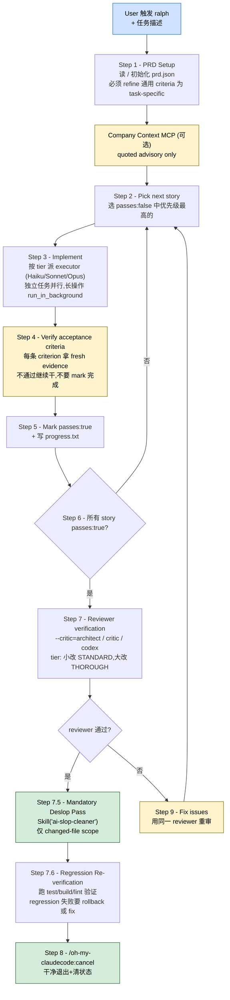

> 本 Skill 是 **oh-my-claudecode**（omc）套件的"PRD 驱动长跑引擎"，是 [autopilot](/articles/omc-autopilot) Phase 2 的实际执行底座，与 [ultrawork](/articles/omc-ultrawork) / [deep-interview](/articles/omc-deep-interview) / [team](/articles/omc-team) / [ccg](/articles/omc-ccg) / [ask](/articles/omc-ask) / [autoresearch](/articles/omc-autoresearch) 共同构成 omc 的"长跑式"自治矩阵。完整工作流见 [oh-my-claudecode 个人工作流总览](/articles/oh-my-claudecode-workflow)。

## 一句话简介

`ralph` 是 Yeachan-Heo 在 omc 里的 **L4 级**长跑 Skill：把任务拆成 `prd.json` 里一个个 user story（带可测的 acceptance criteria），按"挑下一个未完成 story → 实现 → 用 fresh evidence 验收 → 标 `passes: true` → 全部完成后过 reviewer → 强制 ai-slop-cleaner 清理 → 回归再验 → `/cancel` 干净退出"的契约不停跑，直到所有 story 都被 reviewer-verified；中途任何"polite stop"被显式禁止。

## 它解决什么问题

不同于 `autopilot`（端到端 6 阶段）或 `ultrawork`（纯并行无持久化），ralph 专治"复杂任务静默失败"——部分实现被宣布完成、测试被跳过、edge case 被忘掉。SKILL.md `<Why_This_Exists>` 段直接列了 4 条机制对策。覆盖以下场景：

- **当用户说 "ralph / don't stop / must complete / finish this / keep going until done" 这类要求"必须跑完"的话时**——SKILL.md `<Use_When>` 段第 2 条直接把这些触发词列出来，对应"guaranteed completion with verification"。
- **当任务可能跨多次 iteration、需要在重试之间持久化进度的时候**——SKILL.md `<Use_When>` 第 3 条 + 第 4 条强调 PRD-driven 执行加 reviewer sign-off。
- **当你想强制让 AI 在每个 story 上都拿 fresh evidence 而不是"看上去对"就过的时候**——SKILL.md Step 4 段要求 "For EACH acceptance criterion in the story, verify it is met with fresh evidence"，不通过就继续干，不允许提前 mark 完成。
- **当你担心 LLM 写代码完之后留一堆 AI slop（无用类型测试 / 过度防御 / 注释代码 / console.log）的时候**——SKILL.md Step 7.5 段把 `Skill("ai-slop-cleaner")` 列为 reviewer 通过后的**强制**步骤，除非显式 `--no-deslop`。
- **当你想用不同的 reviewer 兜底（架构向 / 批评向 / Codex 跨模型）的时候**——SKILL.md `<PRD_Mode>` 段允许 `--critic=architect|critic|codex` 三选一；其中 codex 走 `omc ask codex --agent-prompt critic` 调外部 Codex。
- **当你已经在用 Claude Code 原生 `/goal` 但不想让 ralph 和它打架的时候**——SKILL.md `<Do_Not_Use_When>` 第 5 条 + `<Execution_Policy>` 段定了三种冲突策略 `refuse` / `adopt_existing` / `artifact_only`，避免 ralph 和原生 `/goal` 互抢权威。

## 安装方法

SKILL.md 本身只定义 Skill 行为契约，没有给独立安装命令。ralph 通过 `oh-my-claudecode` plugin 分发，仓库主页：<https://github.com/Yeachan-Heo/oh-my-claudecode>。

加载本 Skill 前的**前置 / 配套依赖**（源文件明示）：

1. 当前工作区允许写入 `.omc/state/sessions/{sessionId}/prd.json` 和 `progress.txt`
2. 同 plugin 内的 `ai-slop-cleaner` skill（Step 7.5 强制依赖）
3. 同 plugin 内的 `architect` / `critic` / `executor` subagent（按 reviewer 选择和 tier 路由用）
4. 若用 `--critic=codex`，需要本机能跑 `omc ask codex` CLI（即 `ask` Skill 背后那个 CLI）
5. 可选：`docs/shared/agent-tiers.md` 文档（首次 delegation 前应读，用于挑 tier）

> SKILL.md frontmatter `argument-hint: "[--no-deslop] [--critic=architect|critic|codex] <task description>"`——三个旗标 + 一个任务描述，是允许的全部参数。

## 核心机制 / 流程逐项解释

整套 Skill 是一个固定 9 步的 loop，所有步骤都必须在**同一 turn**里走完（Step 7-8 之间不允许停下来等用户确认）。



### prd.json 是一等公民

SKILL.md `<PRD_Mode>` 段定义了 PRD 的位置和处理规则：

- **位置**：session-scoped `.omc/state/sessions/{sessionId}/prd.json`
- **legacy 兼容**：项目级 `prd.json` 或 `.omc/prd.json` 在启动时会被作为 startup migration input 读入
- **Startup gate**：ralph 启动时**总是**初始化 + 校验 prd.json；老版本的 `--no-prd` 文本会被清理掉（不再 bypass PRD）
- **Scaffold + Refine**：首次启动会生成一个 scaffold，但 acceptance criteria 是 "Implementation is complete" 这种通用废话——**你必须把它替换成 task-specific 可验证的标准**

### Reviewer 三选一（`--critic` 参数）

| 选项 | 实现 | 适用 |
|---|---|---|
| `--critic=architect`（默认） | `Task(subagent_type="oh-my-claudecode:architect")` | 架构 / 安全 / 多系统集成的变更 |
| `--critic=critic` | `Task(subagent_type="oh-my-claudecode:critic")` | 想要"批评向"的 Claude 内部代理 |
| `--critic=codex` | `omc ask codex --agent-prompt critic "..."` | 想跨模型用 Codex 做最终审查 |

`--critic=codex` 的 prompt 必须包含 4 块内容（源 Step 7 明示）：

1. prd.json 完整 acceptance criteria 列表
2. 显式询问"是不是有 meaningfully better approach（更简 / 更快 / 更可维护）"
3. 指令"review all code related to the changes"——包括 caller / callee / shared types / 相邻模块
4. ralph session 内的 changed files 列表（作为上下文）

### Reviewer Tier 选择规则（Step 7）

- 5 个文件以内、100 行以内、带完整测试：STANDARD（architect-medium / Sonnet）
- 标准变更：STANDARD（architect-medium / Sonnet）
- 20+ 文件 或 security/architectural 变更：THOROUGH（architect / Opus）
- **Ralph 地板**：永远至少 STANDARD，再小的改也不允许 LOW

### 强制 Deslop Pass（Step 7.5）

reviewer 通过后**无条件**跑 `Skill("ai-slop-cleaner")`（除非 `--no-deslop`），并且严格约束：

- 只对 ralph session 内 changed files 跑
- 不允许扩展到其它无关文件
- 不允许用 `Task(subagent_type="oh-my-claudecode:ai-slop-cleaner")`——这是 skill 不是 agent，那么调会报 "Agent type not found"
- 如果误调成 agent 报错，**不要替换成 `code-simplifier` 这种"近似名字"的 agent**，要 retry 用 Skill 工具

### Post-Deslop 回归验证（Step 7.6）

deslop 之后必须再跑一遍 test/build/lint，读输出确认 regression run 真的过了。如果回归失败，要么 rollback cleaner 的改动，要么 fix regression，循环直到通过。**只有 regression 通过才能进 Step 8 退出。**

### Step 7 → 8 必须同 turn 完成（反 polite-stop 反模式）

SKILL.md `<Steps>` Step 7 + `<Escalation_And_Stop_Conditions>` 段反复强调：

> Do NOT stop after Step 7 approval. The boulder continues through 7 → 7.5 → 7.6 → 8 in the same turn as a single chain. Step 7 is a checkpoint inside the loop, not a reporting moment.

把 reviewer 通过当成"该向用户报告了"是 anti-pattern——只有 Step 8（成功 cancel）或 Step 9（rejection）才是上报点。

### Execution Policy（一些硬约束）

- **独立 agent 并行 fire**，从不顺序等
- **长操作用 `run_in_background: true`**（install/build/test suite）
- **每次 delegation 必须显式传 `model` 参数**
- **第一次 delegation 前要读 `docs/shared/agent-tiers.md`**
- **绝不交付缩水**——不允许 scope reduction、不允许 partial completion、不允许"删测试让它过"
- **`/goal` 冲突策略**：用 `refuse` / `adopt_existing` / `artifact_only` 三种确定性策略，不允许非确定性 warning 处理

## 实战 demo

下面是 SKILL.md `<Examples>` 段给的 Good case 改写示意（保留源文件 PRD refine 思路）：

**Good Case 1 — PRD Refine**（源原文）：

```text
Auto-generated scaffold has:
  acceptanceCriteria: ["Implementation is complete", "Code compiles without errors"]

After refinement:
  acceptanceCriteria: [
    "Legacy --no-prd text is stripped from the Ralph working prompt",
    "Ralph startup still creates or validates prd.json when legacy --no-prd text is present",
    "TypeScript compiles with no errors (npm run build)"
  ]
```

通用废话被换成 3 条可测的任务级标准——这是 Step 1c "CRITICAL: Refine the scaffold" 的核心动作。

**Good Case 2 — 并行 delegation**（源原文）：

```text
Task(subagent_type="oh-my-claudecode:executor", model="haiku",  prompt="Add type export for UserConfig")
Task(subagent_type="oh-my-claudecode:executor", model="sonnet", prompt="Implement the caching layer for API responses")
Task(subagent_type="oh-my-claudecode:executor", model="opus",   prompt="Refactor auth module to support OAuth2 flow")
```

3 个独立任务按 tier 分模型、同时 fire——这是 `<Execution_Policy>` 第 1 条 + Step 3 tier 路由的合并示例。

**Bad Case — 假完成**（源原文）：

```text
"All the changes look good, the implementation should work correctly. Task complete."
```

为啥坏：用了 "should" / "look good"——没有 fresh evidence、没有 story-by-story 验收、没过 reviewer。

**完整调用示例**（基于源契约）：

```text
# 启动
/ralph --critic=codex "把 user 表 schema 从 v1 迁到 v2，保留 v1 字段做 90 天兼容"

# 期望 Skill 行为
Step 1: 启动检查 .omc/state/sessions/{sid}/prd.json,生成 scaffold,refine 为 5 个 story (备份脚本 / 双写中间件 / API 兼容层 / migration runner / 监控告警)
Step 2-6: 逐 story 实现 + 验收,每个 story 用 fresh test 输出验证 acceptance criteria,记进 progress.txt
Step 7: --critic=codex → 跑 omc ask codex --agent-prompt critic "..."(prompt 含 prd.json criteria + 文件清单 + 最优性问题 + 相关代码范围)
Step 7.5: Skill("ai-slop-cleaner") 对 changed files 跑一遍清理
Step 7.6: 跑 npm test + npm run build + lint,确认 regression 全过
Step 8: /oh-my-claudecode:cancel,清 .omc/state 干净退出
```

## 与其他官方 Skills 的搭配建议

SKILL.md 多个段直接点名了同 plugin 内的搭配关系：

- [`omc-autopilot`](/articles/omc-autopilot) — **源文件明示**（`<Do_Not_Use_When>` 第 1 条 + Why-this-exists 反向引用）：autopilot 是"想法到代码全流水线"，ralph 是"PRD 驱动持久长跑"，互为更细 / 更全的两层。
- [`omc-ultrawork`](/articles/omc-ultrawork) — **源文件明示**（Purpose 段 "wraps ultrawork's parallel execution"）：ralph 把 ultrawork 的并行执行包了一层 session 持久 / 自动重试 / 结构化 story / 强制验证。
- `oh-my-claudecode:ai-slop-cleaner` skill — **源文件明示**（Step 7.5 + `<Tool_Usage>`）：reviewer 通过后强制 deslop。
- `oh-my-claudecode:architect` / `oh-my-claudecode:critic` / `oh-my-claudecode:executor` subagent — **源文件明示**（`<Tool_Usage>` 段）：reviewer 三选一 + executor tier 路由。
- [`omc-ask`](/articles/omc-ask)（背后的 `omc ask codex` CLI）— **源文件明示**（Step 7 `--critic=codex`）：codex critic 路径走的就是 ask 那个 CLI。
- Claude Code 原生 `/goal` — **源文件明示**（`<Do_Not_Use_When>` 第 5 条 + `<Execution_Policy>`）：冲突时按 refuse/adopt_existing/artifact_only 三策略处理。
- [`omc-deep-interview`](/articles/omc-deep-interview) / [`omc-team`](/articles/omc-team) / [`omc-ccg`](/articles/omc-ccg) / [`omc-autoresearch`](/articles/omc-autoresearch) — sibling skills，**非源文件明示**搭配，定位不同。

## 常见坑 + 注意事项

源 SKILL.md `<Escalation_And_Stop_Conditions>` + `<Final_Checklist>` + Examples Bad case 段给的注意点：

1. **不要让 PRD acceptance criteria 停在通用文案**——Step 1c + Examples Bad 第 3 条明示这是 "PRD theater"（源明示）
2. **不要顺序跑独立任务**——`<Execution_Policy>` 第 1 条 + Examples Bad 第 2 条明示要并行 fire（源明示）
3. **不要在 Step 7 reviewer 通过后停下来等用户确认**——Step 7 + `<Escalation_And_Stop_Conditions>` 段两处反复强调这是 polite-stop anti-pattern（源明示）
4. **不要把 ai-slop-cleaner 当成 agent 调**——`<Tool_Usage>` 段明示如果报 "Agent type not found"，retry 用 Skill 工具，不要换成 `code-simplifier`（源明示）
5. **不要 broaden deslop scope 到无关文件**——Step 7.5 明示只对 changed-file set 跑（源明示）
6. **不要跳过 Post-Deslop Regression**——Step 7.6 明示必须再跑一遍 test/build/lint 拿输出确认通过（源明示）
7. **不要为了过测试删测试**——`<Execution_Policy>` 段 "no deleting tests to make them pass"（源明示）
8. **不要把 `/goal` 的 evaluator 当成 ralph reviewer 的替代**——`<Execution_Policy>` 段明示 "do not treat evaluator success as a substitute for Ralph reviewer verification"（源明示）
9. **同一问题连续 3+ iteration 反复出现 → 报告 fundamental issue**——`<Escalation_And_Stop_Conditions>` 第 5 条明示（源明示）
10. **`--no-deslop` 是逃生口，慎用**——`<PRD_Mode>` 段 "Use this only when the cleanup pass is intentionally out of scope"（源明示）

## 适合人群

**适合：**

- 有明确 PRD / user story 习惯、可以把任务拆成可测 acceptance criteria 的工程师
- 不接受 LLM 用 "should" / "looks good" 糊弄完成、要 fresh evidence 验证每一步的人
- 想用 Codex 跨模型 critic 兜底质量、给 PR 多一层独立审视的人
- 写完代码必清 slop（无用类型测试 / 注释代码 / 过度防御）的洁癖型开发者
- 已经在 omc 全套里跑 autopilot 全流水线、想理解 Phase 2 的实际执行底座的用户

**不适合：**

- 想"端到端从一句话到代码"自治的人——直接用 `autopilot`，ralph 是它的 Phase 2 引擎
- 想"探索 / 头脑风暴"再决定怎么做的人——用 `plan` skill 或对话
- 想"一次性 quick fix"的人——直接派 executor agent
- 想自己手动控制每一步何时完成的人——用 `ultrawork` 直接调
- 已经在跑 Claude Code 原生 `/goal` loop 又不愿意按三策略协调的人——用 `artifact_only` 模式或干脆只跑 `/goal`

---

本文基于 <https://github.com/Yeachan-Heo/oh-my-claudecode> 由 AI（claude-opus-4-7）辅助生成中文教程，原作者署名 Yeachan-Heo，许可证 MIT。

<!-- self-check
本文中提到的命令 / 文件 / URL 清单：
- `.omc/state/sessions/{sessionId}/prd.json` — 源 `<PRD_Mode>` + Step 1 明示
- `.omc/prd.json` / 项目级 `prd.json` (legacy) — 源 `<PRD_Mode>` + Step 1a 明示
- `progress.txt` — 源 Step 1d + Step 5 明示
- `--no-deslop` / `--critic=architect|critic|codex` 参数 — 源 `<PRD_Mode>` + Step 7 明示
- `Skill("ai-slop-cleaner")` — 源 Step 7.5 + `<Tool_Usage>` 明示
- `Task(subagent_type="oh-my-claudecode:architect|critic|executor")` — 源 `<Tool_Usage>` + Examples 明示
- `omc ask codex --agent-prompt critic "..."` — 源 Step 7 + `<Tool_Usage>` 明示
- `/oh-my-claudecode:cancel` — 源 Step 8 + `<Escalation_And_Stop_Conditions>` 明示
- `state_write` / `state_read` — 源 `<Tool_Usage>` 明示
- `docs/shared/agent-tiers.md` — 源 `<Execution_Policy>` 第 4 条明示
- `docs/company-context-interface.md` + `.claude/omc.jsonc` + `~/.config/claude-omc/config.jsonc` + `companyContext.tool` / `onError` — 源 Step 1e 明示
- Claude Code 原生 `/goal` 三冲突策略 (`refuse` / `adopt_existing` / `artifact_only`) — 源 `<Do_Not_Use_When>` + `<Execution_Policy>` 明示
- `run_in_background: true` — 源 `<Execution_Policy>` 第 2 条 + `<Advanced>` 段明示

场景章节支撑：
- 场景 1 触发词 — 源 `<Use_When>` 第 2 条直接支撑
- 场景 2 跨 iteration 持久化 — 源 `<Use_When>` 第 3 条直接支撑
- 场景 3 fresh evidence 验收 — 源 Step 4 直接支撑
- 场景 4 强制 deslop — 源 Step 7.5 直接支撑
- 场景 5 reviewer 三选一 — 源 `<PRD_Mode>` + Step 7 直接支撑
- 场景 6 `/goal` 冲突协调 — 源 `<Do_Not_Use_When>` 第 5 条 + `<Execution_Policy>` 直接支撑

图 / 代码块处理：
- 源文件中无 dot / mermaid 流程图;本文新增 1 张 mermaid 图把 9 步 + reviewer/deslop/regress 链全部串起来,节点关键词来自源文件原文
- Examples 段 Good Case 1 (PRD refine 前后对照) + Good Case 2 (并行 Task) + Bad Case (假完成) 按 v3 规则保留原文
- 实战 demo "调用 ralph 做 user 表 schema 迁移" 中的具体 5 个 story (备份/双写/兼容/runner/告警) 为示意反推,非源文件原文,用于说明 PRD refine 的可能形状

依赖关系（plugin-skill 必填）：
- 兄弟 `omc-autopilot` — 源 `<Do_Not_Use_When>` 第 1 条明示
- 兄弟 `omc-ultrawork` — 源 Purpose 段明示
- 兄弟 skill `ai-slop-cleaner` (同 plugin) — 源 Step 7.5 明示
- subagent `architect` / `critic` / `executor` — 源 `<Tool_Usage>` 段明示
- 兄弟 `omc-ask` (背后的 omc ask codex CLI) — 源 Step 7 `--critic=codex` 明示
- 其他兄弟 (`deep-interview` / `team` / `ccg` / `autoresearch`) — 源文件未直接点名搭配关系,文中已逐条标注"非源文件明示"

可疑项：
- 实战 demo 中 user 表 schema 迁移的 5 个 story 是基于 PRD refine 契约的反推示意,非源文件案例
- 文章开头开场行 [RALPH + ULTRAWORK - ITERATION ...] 是源文件每次迭代的注入提示,不是 Skill 静态行为,正文未照搬此行避免误导读者
-->
