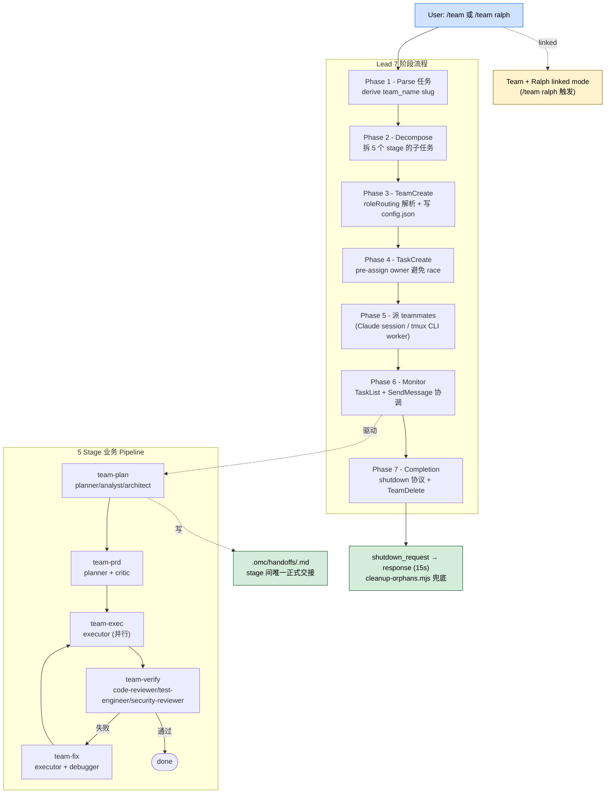

> 本 Skill 是 **oh-my-claudecode**（omc）套件的"多 agent 团队编排"模块，基于 Claude Code 原生 `TeamCreate` / `TaskCreate` / `SendMessage` 等工具搭建 staged pipeline；与 [autopilot](/articles/omc-autopilot) / [ralph](/articles/omc-ralph) / [ultrawork](/articles/omc-ultrawork) / [deep-interview](/articles/omc-deep-interview) / [ccg](/articles/omc-ccg) / [ask](/articles/omc-ask) / [autoresearch](/articles/omc-autoresearch) 共同构成 omc 的"长跑式"自治矩阵。完整工作流见 [oh-my-claudecode 个人工作流总览](/articles/oh-my-claudecode-workflow)。

## 一句话简介

`team` 是 Yeachan-Heo 在 omc 里的多 agent 团队 Skill：基于 Claude Code 平台原生的 `TeamCreate` / `TaskCreate` / `TaskUpdate` / `SendMessage` / `TeamDelete` 工具，把任务拆成 staged pipeline（`team-plan` → `team-prd` → `team-exec` → `team-verify` → `team-fix` 循环），按 canonical role（planner / executor / critic / code-reviewer / test-engineer 等）创建多个 Claude / Codex / Gemini worker 同时干活，stage 之间用 `.omc/handoffs/<stage>.md` 交接，最后由 lead 走 shutdown 协议清场。

## 它解决什么问题

不同于 `ultrawork`（一次性派并行 task）或 `ralph`（单 agent 持久长跑），team 解决的是"**多个长生命周期 agent 协作 + 阶段化交接**"的场景。SKILL.md 顶部段 + Comparison 表直接列了适用面：

- **当任务大到需要多个 agent 各司其职（planner + executor + critic + reviewer）的时候**——SKILL.md "Stage Agent Routing" 表把 5 个 stage 的 required/optional 角色全部固化，是 team 的核心契约。
- **当你想跨 provider（Claude + Codex + Gemini）让不同 worker 用不同模型的时候**——SKILL.md "Per-Role Provider & Model Routing" 段允许 `critic=codex` / `code-reviewer=gemini` 这种角色级 provider 绑定。
- **当你需要 worker 之间用 `SendMessage` 互发消息（DM / broadcast / shutdown）的时候**——SKILL.md "Communication" 段 + Comparison 表把 SendMessage 作为 team 区别于 legacy swarm 的核心能力。
- **当你想让多 agent 走 staged pipeline（计划 → PRD → 执行 → 验证 → 修复）而不是一次性 fire 的时候**——SKILL.md 顶部 "staged pipeline" 段 + "Stage Entry/Exit Criteria" 段把 5 个 stage 的入口出口条件固化。
- **当你想把 team 套在 ralph 里跑（`/team ralph` 关键字）做"team pipeline + ralph 外层持久"组合的时候**——SKILL.md "Team + Ralph Composition" 段定义了 linked mode 的执行顺序和 cancellation 联动。
- **当你需要 graceful shutdown（worker 收到 `shutdown_request` 自己结束）而不是 kill -9 的时候**——SKILL.md "Cancellation" + "Shutdown" 协议给了 15s 超时的请求-响应模式 + `cleanup-orphans.mjs` 兜底扫描。

## 安装方法

SKILL.md 本身只定义 Skill 行为契约，不给独立安装命令。team 通过 `oh-my-claudecode` plugin 分发，仓库主页：<https://github.com/Yeachan-Heo/oh-my-claudecode>。

加载本 Skill 前的**前置 / 配套依赖**（源文件明示）：

1. Claude Code 原生 team 工具集：`TeamCreate` / `TaskCreate` / `TaskUpdate` / `TaskList` / `SendMessage` / `TeamDelete`
2. 可写入 `~/.claude/teams/{team_name}/`（config）和 `~/.claude/tasks/{team_name}/`（task 文件）
3. 可选 provider CLI：`codex` / `gemini`（角色级 routing 用，不装会 fallback 到 Claude）
4. 可选配置文件：`.claude/omc.jsonc`（project）或 `~/.config/claude-omc/config.jsonc`（user）
5. `omc doctor --team-routing` 用于体检 provider 可用性（源 "Per-Role Provider & Model Routing" 段明示）
6. orphan 扫描脚本 `cleanup-orphans.mjs`（shutdown 后兜底清理用）
7. 可选 env：`OMC_RUNTIME_V2=1`（事件驱动 runtime）/ `OMC_TEAM_SCALING_ENABLED=1`（mid-session 扩缩容）/ `OMC_TEAM_ROLE_OVERRIDES`（角色 routing 覆盖）

> SKILL.md 顶部给的触发方式：`/team <task description>` 或 `/team N:role <task>`（N 是该角色 worker 数），也接受 `/team ralph <task>` 触发 linked mode。

## 核心机制 / 流程逐项解释

整套 Skill 是"7 阶段 lead 流程"叠"5 stage 业务 pipeline"的两层结构。



### Staged Pipeline（5 个 stage）

SKILL.md "Stage Agent Routing" 表 + "Stage Entry/Exit Criteria" 段给的固定流水线：

| Stage | 必备角色 | 可选角色 | 出口条件 |
|---|---|---|---|
| `team-plan` | planner | analyst / architect | 写 `.omc/handoffs/team-plan.md`，含范围 + 高层方案 |
| `team-prd` | planner | critic | 写 `.omc/handoffs/team-prd.md`，含可测 acceptance criteria |
| `team-exec` | executor（N 个并行） | architect / explore | 所有 task 标 done；写 `.omc/handoffs/team-exec.md` |
| `team-verify` | code-reviewer / test-engineer | security-reviewer | 全部 check pass，或显式 fail（触发 team-fix） |
| `team-fix` | executor | debugger | fix loop 通过后回 team-exec / team-verify 复跑 |

**关键约束**：stage 之间只能通过 `.omc/handoffs/<stage>.md` 交接，不允许直接修改下游 stage 的输入产物（源 "Stage Entry/Exit Criteria" 段明示）。

### Lead 的 7 阶段流程

| Phase | 动作 |
|---|---|
| 1 Parse | 从用户输入提任务描述，按 "fix TypeScript errors" → `fix-ts-errors` 这样的规则生成 team_name slug |
| 2 Decompose | 把任务按 5 个 stage 拆成子任务，决定每个 stage 需要哪些角色和多少 worker |
| 3 CreateTeam | 调 `TeamCreate`，解析 `roleRouting` 写 `resolved_routing` 快照到 `config.json`，团队生命周期内不再变 |
| 4 CreateTasks | 调 `TaskCreate` 写所有任务（含 owner 预分配 + `blocks`/`blockedBy` 依赖） |
| 5 SpawnTeammates | 按 config 派 Claude session（带 worker preamble）或 tmux CLI worker（codex/gemini） |
| 6 Monitor | 定时调 `TaskList` 看状态，用 `SendMessage` 协调，处理 stuck/failed/crashed worker |
| 7 Completion | 走 shutdown 协议（请求 → 等 15s 响应 → `TeamDelete` → orphan 扫描） |

### Per-Role Provider & Model Routing

SKILL.md "Per-Role Provider & Model Routing" 段允许给每个 canonical role 绑定 provider + model：

```jsonc
{
  "team": {
    "roleRouting": {
      "orchestrator": { "model": "inherit" },
      "planner":      { "provider": "claude", "model": "HIGH" },
      "analyst":      { "provider": "claude", "model": "HIGH" },
      "executor":     { "provider": "claude", "model": "MEDIUM" },
      "critic":       { "provider": "codex" },
      "code-reviewer":{ "provider": "gemini" },
      "test-engineer":{ "provider": "gemini", "model": "MEDIUM" }
    }
  }
}
```

**Routing 决议**：team 创建时**一次性**解析并持久化到 `TeamConfig.resolved_routing`，团队整个生命周期内 spawn / scale-up / restart 都读这个快照——保证 worker 的 CLI 和 model 在生命周期内不变。

**Canonical roles**（源段明示完整清单）：
`orchestrator` / `planner` / `analyst` / `architect` / `executor` / `debugger` / `critic` / `code-reviewer` / `security-reviewer` / `test-engineer` / `designer` / `writer` / `code-simplifier` / `explore` / `document-specialist`。

**优先级**（源段明示）：`OMC_TEAM_ROLE_OVERRIDES` > `.claude/omc.jsonc` (project) > `~/.config/claude-omc/config.jsonc` (user) > built-in 默认。

**Fallback**：configured provider 的 CLI 不在 PATH 时，runtime 会显式 SendMessage 警告，按 `buildResolvedRoutingSnapshot` 预算的同 tier + 同 agent 但 `provider: "claude"` 兜底——**silent fallback 是 test failure**。

### Communication（`SendMessage` 三种模式）

| Mode | 用途 |
|---|---|
| `message`（DM） | 默认；lead → 某一 teammate；自动作为对方的新 conversation turn 投递 |
| `broadcast` | 给所有 teammate 一份；**贵**——每个 teammate 一条独立 message，源 Gotcha 第 10 条警告慎用 |
| `shutdown_request` | 走 shutdown 协议；teammate 必须用同一 `request_id` 回 `shutdown_response` |

### Cancellation + Shutdown 协议

SKILL.md "Cancellation" + Gotcha 第 8 条段给的协议：

1. `state_read(mode="team")` 拿 `team_name` 和 `linked_ralph`
2. 给所有 active teammate 发 `shutdown_request`
3. 每个 teammate 15s 内回 `shutdown_response`（必须带原 `request_id`，伪造会 silent fail）
4. 调 `TeamDelete` 删 `~/.claude/teams/{team_name}/` 和 `~/.claude/tasks/{team_name}/`
5. `state_clear(mode="team")`；若 linked_ralph，再 `state_clear(mode="ralph")`

**Linked mode（`/team ralph`）取消顺序**：
- 从 Ralph 上下文触发：先停 team（graceful 关 worker），再清 ralph
- 从 Team 上下文触发：先清 team state，再标 ralph cancelled，stop hook 检测到没 team 后停 loop
- `--force`：无条件清两边 state

### Team + Ralph linked mode

SKILL.md "Team + Ralph Composition" 段定义了组合执行流：

1. Ralph 外层 loop iteration 1
2. Team pipeline 跑 `team-plan → team-prd → team-exec → team-verify`
3. `team-verify` 通过 → Ralph 跑 architect 验证（至少 STANDARD tier）
4. Architect 通过 → 两边都完成，跑 `/oh-my-claudecode:cancel`
5. `team-verify` 失败或 architect 拒绝 → team 进 `team-fix`，回到 `team-exec → team-verify`
6. fix loop 超过 `max_fix_loops` → Ralph 递增 iteration 重跑完整 pipeline
7. Ralph 超过 `max_iterations` → terminal `failed`

### Worker Preamble + CLI Worker

- **Claude teammate**：spawn 时携带 worker preamble（自我身份 + 团队 task ID + 通信规则）；可用 `TaskList` / `TaskUpdate` / `SendMessage` 全套
- **CLI worker**（tmux 内的 codex/gemini）：源 Gotcha 第 11 条明示 "**one-shot, not persistent**"——有完整文件系统访问能写代码，但**不能**调 TaskList/TaskUpdate/SendMessage；lead 负责 write `prompt_file` → spawn → read `output_file` → 标 task complete

### 与 legacy swarm 的对比（why team wins）

SKILL.md "Comparison: Team vs Legacy Swarm" 表的关键差异：

| 维度 | Team | Legacy Swarm |
|---|---|---|
| 存储 | `~/.claude/teams/` JSON | `.omc/state/swarm.db` SQLite |
| 依赖 | 无 native | 需 `better-sqlite3` |
| 通信 | `SendMessage` | 无（fire-and-forget） |
| Task 依赖 | 内置 `blocks` / `blockedBy` | 不支持 |
| Shutdown | request/response 协议 | 信号杀进程 |
| Atomic 抢任务 | 无（靠 lead pre-assign 避 race） | SQLite 事务 |

源 "When to use Team over Swarm" 段直接说：**新工作永远优先用 `/team`**。

## 实战 demo

**示例 1 — 单纯 team 编排**（基于源契约示意）：

```bash
/team Build a REST API for user management with auth + tests
```

期望 Skill 行为：

```text
Phase 1: team_name = "build-user-api"
Phase 2: 拆 5 stage:
  team-plan: planner 出 ADR + 模块拆分
  team-prd:  planner+critic 出可测 acceptance criteria
  team-exec: executor x3 并行 (model+routes+tests)
  team-verify: code-reviewer + test-engineer + security-reviewer
  team-fix:  executor+debugger (失败时启)
Phase 3: TeamCreate (resolved_routing 持久化)
Phase 4: TaskCreate (pre-assign owner,设 blocks/blockedBy)
Phase 5: spawn 6 个 worker (1 planner + 1 critic + 3 executor + 1 reviewer)
Phase 6: Monitor — TaskList 轮询; SendMessage 协调
Phase 7: 所有 stage 出口达成 → shutdown_request → response → TeamDelete
```

**示例 2 — Team + Ralph linked mode**（源 "Team + Ralph Composition" 段示例代码）：

```bash
/team ralph Build a REST API for user management with auth + tests
```

源段给的 state link 示例：

```text
state_write(mode="ralph", { linked_team: "build-user-api" })
state_write(mode="team",  { team_name: "build-user-api", linked_ralph: true })
```

Linked mode 下 Ralph 是外层持久 loop，每轮调 team pipeline 跑一遍；team-verify 后 ralph 再过 architect；任一失败回退到 team-fix → 重跑。

**示例 3 — 角色级 provider routing**（基于源 "Per-Role Provider & Model Routing" 配置示例）：

`.claude/omc.jsonc` 配置后，`/team` 内部的 critic worker 自动走 codex CLI，code-reviewer worker 走 gemini CLI，executor 还是 Claude Sonnet。一次 `/team` 调用就能拉起跨 3 家 provider 的混合编队，且整团队生命周期内 routing 不变。

## 与其他官方 Skills 的搭配建议

SKILL.md 多处直接点名了同 plugin 内的搭配：

- [`omc-ralph`](/articles/omc-ralph) — **源文件明示**（"Team + Ralph Composition" 整段）：通过 `/team ralph <task>` 触发 linked mode，ralph 外层持久 + team 内层 staged pipeline；取消和状态联动有专门协议。
- [`omc-autopilot`](/articles/omc-autopilot) — sibling skill，**非源文件明示直接搭配**；autopilot 的 6 阶段中 Phase 2 默认走 ralph，但理论上也可拼成 ralph+team 链路。
- [`omc-ultrawork`](/articles/omc-ultrawork) — sibling skill，**非源文件明示**；定位互补——team 是固定 N 个 worker 跑 staged pipeline，ultrawork 是按需 fire 并行任务，不长生命周期 worker。
- [`omc-ccg`](/articles/omc-ccg) — **源文件明示对比**（ccg SKILL.md 顶部 "without launching tmux team workers"）：ccg 是 team 的轻量替代，只要外部 advisor 意见不需要 team runtime 时用 ccg。
- [`omc-ask`](/articles/omc-ask) — sibling skill，**非源文件明示**；ask 是 single advisor 咨询，team 是多 agent 协作，无直接依赖关系（但 critic role 实质上走的也是 codex CLI，与 ask 的 codex 路径共享底层）。
- [`omc-deep-interview`](/articles/omc-deep-interview) / [`omc-autoresearch`](/articles/omc-autoresearch) — sibling skills，**非源文件明示**搭配。
- Claude Code 原生 team 工具（`TeamCreate` / `TaskCreate` / `TaskUpdate` / `TaskList` / `SendMessage` / `TeamDelete`）— **源文件全程依赖**，是 team Skill 的执行底座。
- Claude Code 原生 `/goal` — **源文件明示**（与 ralph 同款的 refuse / adopt_existing / artifact_only 三策略冲突处理逻辑同样适用）。

## 常见坑 + 注意事项

源 SKILL.md "Gotchas" 段（11 条原文）+ "Important Notes" + 各 stage 注意点：

1. **Internal task 会污染 TaskList**——teammate spawn 时系统自动创建带 `metadata._internal: true` 的内部任务，计真实进度时要过滤掉（源 Gotcha 1）
2. **No atomic claiming**——两个 teammate 可能同时抢一个 task；lead 必须 `TaskUpdate(taskId, owner)` 预分配（源 Gotcha 2）
3. **Task ID 是字符串**——`"1"` / `"2"`，不是 int（源 Gotcha 3）
4. **TeamDelete 要求 empty team**——所有 teammate 必须先 shutdown，lead 自己不算（源 Gotcha 4）
5. **Broadcast 很贵**——每个 teammate 一条独立 message，默认用 DM，只在真·全队 critical alert 时 broadcast（源 Gotcha 10）
6. **Shutdown response 必须带原 `request_id`**——格式 `shutdown-{timestamp}@{worker-name}`，伪造会 silent fail（源 Gotcha 8）
7. **CLI worker 是 one-shot 不是 persistent**——tmux 内的 codex/gemini worker 不能用 TaskList/TaskUpdate/SendMessage，lead 必须用 prompt_file/output_file 管它们的生命周期（源 Gotcha 11）
8. **Teammate prompt 存在 config.json**——不要往 prompt 里塞 secret（源 Gotcha 6）
9. **Members shutdown 后自动从 config 移除**——不要重读 config 期望找到已 shutdown 的 member（源 Gotcha 7）
10. **Team name 必须是合法 slug**——小写字母 + 数字 + 连字符（源 Gotcha 9）
11. **Resolved routing 是不可变的**——团队生命周期内修改配置不影响运行中的 team；要换 routing 必须新建一个 team（源 "Stickiness" 段明示）
12. **CLI 不在 PATH 时会 fallback 到 Claude 并大声警告**——silent fallback 是 test failure（源 "Fallback when a CLI is missing" 段明示）
13. **Worktree 仅在 team shutdown 时清理**——单个 worker shutdown 不会清，方便 post-mortem 检查（源 "Git Worktree Integration / Important Notes" 段明示）
14. **TeamDelete 仅清 Claude Code 原生 state**——OMC state 要额外 `state_clear(mode="team")`；linked 还要 `state_clear(mode="ralph")`（源 "State Cleanup" 段明示）
15. **Idempotent recovery**——lead 崩溃后再启动应该 detect 已有 team 并 resume monitor，不要创建重复 team（源 "Idempotent Recovery" 段明示）

## 适合人群

**适合：**

- 想跑 multi-agent 长生命周期协作、希望 worker 之间能互发消息的工程师
- 希望按角色选 provider（critic 用 codex / reviewer 用 gemini）控成本和质量的 power user
- 喜欢 staged pipeline（计划 → PRD → 执行 → 验证 → 修复）的工程过程派
- 想把 team 和 ralph 拼成"team pipeline + ralph 持久"linked mode 跑大型项目的人
- 不愿意装 `better-sqlite3`、想用 Claude Code 原生 team 基础设施的人

**不适合：**

- 只想一次 fire 几个并行 task 的人——直接用 `ultrawork`
- 想单 agent 持久长跑、不需要多 worker 的人——直接用 `ralph`
- 想做"想法到代码"全自治的人——用 `autopilot`
- 没装 codex / gemini CLI 又想用混合 routing 的人——会全部 fallback 到 Claude，等于浪费 routing 配置
- 团队任务小到一个 agent 就能搞定的人——team runtime overhead 不划算

---

本文基于 <https://github.com/Yeachan-Heo/oh-my-claudecode> 由 AI（claude-opus-4-7）辅助生成中文教程，原作者署名 Yeachan-Heo，许可证 MIT。

<!-- self-check
本文中提到的命令 / 文件 / URL 清单：
- `/team <task>` + `/team N:role <task>` + `/team ralph <task>` — 源顶部 + "Team + Ralph Composition" 段明示
- 原生工具 `TeamCreate` / `TaskCreate` / `TaskUpdate` / `TaskList` / `SendMessage` / `TeamDelete` — 源 "Comparison" + 各 Phase 段全程明示
- 5 stage pipeline `team-plan / team-prd / team-exec / team-verify / team-fix` — 源 "Stage Agent Routing" + "Stage Entry/Exit Criteria" 段明示
- `.omc/handoffs/<stage>.md` — 源 "Stage Entry/Exit Criteria" 段明示
- `~/.claude/teams/{team_name}/` + `~/.claude/tasks/{team_name}/` — 源 "Comparison" + "State Cleanup" 段明示
- `.claude/omc.jsonc` + `~/.config/claude-omc/config.jsonc` + `OMC_TEAM_ROLE_OVERRIDES` — 源 "Per-Role Provider & Model Routing" 段明示
- `cleanup-orphans.mjs` — 源 shutdown 相关段明示
- `omc doctor --team-routing` — 源 "Fallback when a CLI is missing" 段明示
- `state_read(mode="team")` / `state_write` / `state_clear(mode="team"|"ralph")` — 源 "Cancellation" + "Team + Ralph Composition" 段明示
- 15 个 canonical roles 清单 — 源 "Canonical roles" 段原文
- `OMC_RUNTIME_V2=1` / `OMC_TEAM_SCALING_ENABLED=1` — 源 "Runtime V2" + "Dynamic Scaling" 段明示
- Worker preamble + tmux CLI worker (prompt_file/output_file) — 源 worker 派生 + Gotcha 11 段明示
- shutdown_request → shutdown_response (15s timeout, request_id format) — 源 "Cancellation" + Gotcha 8 段明示

场景章节支撑：
- 场景 1 多 agent 各司其职 — 源 "Stage Agent Routing" 表直接支撑
- 场景 2 跨 provider routing — 源 "Per-Role Provider & Model Routing" 段直接支撑
- 场景 3 SendMessage 通信 — 源 "Communication" 段 + "Comparison" 表直接支撑
- 场景 4 staged pipeline — 源 "Stage Entry/Exit Criteria" 段直接支撑
- 场景 5 linked mode — 源 "Team + Ralph Composition" 整段直接支撑
- 场景 6 graceful shutdown — 源 "Cancellation" + Gotcha 8 段直接支撑

图 / 代码块处理：
- 源文件中无 dot / mermaid 流程图; 本文新增 1 张 mermaid 把 Lead 7 阶段 + 5 stage pipeline + handoff + shutdown 串成图, 节点关键词全部来自源文件原文
- 源文件 "Per-Role Provider & Model Routing" 段的 jsonc 配置示例 + linked mode state_write 示例按 v3 规则保留原文
- 实战 demo 中 "Build a REST API for user management" 任务 (源 "Team + Ralph Composition" 段示例) 及其拆解为 5 stage 是基于该示例任务 + 5 stage 契约的反推示意, 具体 worker 数量 (3 executor 等) 为示意

依赖关系（plugin-skill 必填）：
- 兄弟 `omc-ralph` — 源 "Team + Ralph Composition" 段明示, 强依赖 (linked mode)
- 兄弟 `omc-ccg` — 源 ccg SKILL.md 顶部 "without launching tmux team workers" 反向引用 team
- 兄弟 `omc-ask` — 源文件未直接点名 team↔ask 关系, 但 critic role 走 codex 实质上与 ask 共享底层 CLI 路径
- 其他兄弟 (`autopilot` / `ultrawork` / `deep-interview` / `autoresearch`) — 源文件未直接点名搭配关系, 文中已逐条标注 "非源文件明示"
- 原生 team 工具 (TeamCreate/TaskCreate 等) — 源文件全程依赖

可疑项：
- 实战 demo 示例 1 中具体 worker 数量 (1 planner + 1 critic + 3 executor + 1 reviewer = 6 个) 是基于 "Build a REST API" 例任务 + 5 stage 契约的反推示意, 非源文件原文
- "Communication" 表中 message/broadcast/shutdown_request 三种模式的"贵 / 默认 / 协议必须带 request_id" 注解综合自源 "Communication" + Gotcha 8/10 段
-->
