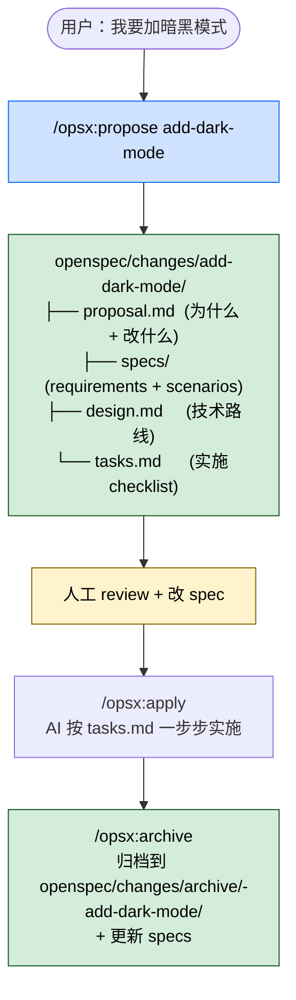

## 一句话简介

`OpenSpec` 是 Fission AI 出品的 spec-driven 开发框架，通过 `npm install -g @fission-ai/openspec` 全局安装，配合 `/opsx:propose`、`/opsx:apply`、`/opsx:archive` 三条 slash command，让 AI 编码 agent 在动手写任何代码之前先和你把规格（proposal / specs / design / tasks）对齐——把"先 spec 再 code"轻量化、可迭代、能用在 brownfield 项目上、覆盖 25+ 主流 AI 工具。

## 它解决什么问题

不同于"丢一句 prompt 给 AI 让它猜"或者"Spec Kit / Kiro 那种重 ceremony" 的 spec 框架，OpenSpec 解决的是 "AI coding agent 在长任务里会因为'需求只在 chat 历史里'而漂移、产出不可预测" 的核心问题。README 段 `Why OpenSpec?` 段直接给出问题陈述："AI coding assistants are powerful but unpredictable when requirements live only in chat history. OpenSpec adds a lightweight spec layer so you agree on what to build before any code is written."。覆盖以下场景：

- **当你给 AI 一个新功能 idea，但担心它直接动手前没把"为什么做 / 改什么 / 怎么验证"对清楚的时候**——README "See it in action" 段给的样例就是 `/opsx:propose add-dark-mode` → AI 在 `openspec/changes/add-dark-mode/` 目录下产出 `proposal.md`（为什么 + 改什么）、`specs/`（requirements + scenarios）、`design.md`（技术路线）、`tasks.md`（实施 checklist），让你先 review 再 implement。
- **当你已经在做一个老项目（brownfield）、希望加新功能时仍能 spec-first、但不想把现有代码推倒重来的时候**——README 顶部 philosophy 段明示「built for brownfield not just greenfield」。
- **当你不想被某个 IDE 锁死、希望 spec 流程在 Claude / Cursor / Codex / Continue 等多个工具间通用的时候**——README "How we compare" 段明示对比 Kiro：「Kiro (AWS) — Powerful but you're locked into their IDE and limited to Claude models. OpenSpec works with the tools you already use.」；README "Supported Tools" 段指出支持 25+ 工具。
- **当你试过 GitHub Spec Kit 但被它 rigid phase gate + 大量 Markdown + Python setup 劝退的时候**——README "How we compare" 段明示对比 Spec Kit：「Spec Kit (GitHub) — Thorough but heavyweight. Rigid phase gates, lots of Markdown, Python setup. OpenSpec is lighter and lets you iterate freely.」。
- **当一个团队需要让人和 AI 在写代码前就对 spec 达成一致、但又不想把 spec 工具变成"水落水"型瀑布流程的时候**——README philosophy 段写明 5 条核心理念：fluid not rigid / iterative not waterfall / easy not complex / built for brownfield not just greenfield / scalable from personal projects to enterprises。
- **当你已经熟悉 OpenSpec 基础流程、想用更完整的扩展工作流（new / continue / ff / verify / bulk-archive / onboard）的时候**——README "Quick Start" 段明示扩展 profile：「If you want the expanded workflow (`/opsx:new`, `/opsx:continue`, `/opsx:ff`, `/opsx:verify`, `/opsx:bulk-archive`, `/opsx:onboard`), select it with `openspec config profile` and apply with `openspec update`.」

## 安装方法

README "Quick Start" 段官方安装命令（**需要 Node.js 20.19.0 或更高**）：

```bash
# 1. 全局安装 OpenSpec CLI
npm install -g @fission-ai/openspec@latest

# 2. 进入你的项目目录初始化
cd your-project
openspec init

# 3. 在你的 AI 工具里发起 propose
# /opsx:propose <what-you-want-to-build>
```

如果要切到扩展工作流（包含 `/opsx:new`、`/opsx:continue`、`/opsx:ff`、`/opsx:verify`、`/opsx:bulk-archive`、`/opsx:onboard`）：

```bash
openspec config profile     # 选 profile
openspec update             # 应用变更并重新生成 AI 工具的指令文件
```

README 还提到 OpenSpec 兼容 pnpm / yarn / bun / nix（详情见 `docs/installation.md`）。每次升级也是一样的命令 + 一个 `openspec update`：

```bash
npm install -g @fission-ai/openspec@latest
openspec update             # 在每个项目里跑，重新生成 AI 指令 + 激活最新 slash command
```

## 核心命令 / 流程逐项解释

OpenSpec 的核心工作流就是 3 条 slash command：propose → apply → archive。



### `/opsx:propose <idea>` — 起 spec

README "See it in action" 段给的样例：

```text
You: /opsx:propose add-dark-mode
AI:  Created openspec/changes/add-dark-mode/
     ✓ proposal.md — why we're doing this, what's changing
     ✓ specs/       — requirements and scenarios
     ✓ design.md    — technical approach
     ✓ tasks.md     — implementation checklist
     Ready for implementation!
```

每个 change 都有自己独立的目录，4 类文件分工明确：

| 文件 | 内容 |
|---|---|
| `proposal.md` | 为什么做这件事、改了什么 |
| `specs/` | requirements + scenarios |
| `design.md` | technical approach |
| `tasks.md` | implementation checklist |

### `/opsx:apply` — 让 AI 实施

```text
You: /opsx:apply
AI:  Implementing tasks...
     ✓ 1.1 Add theme context provider
     ✓ 1.2 Create toggle component
     ✓ 2.1 Add CSS variables
     ✓ 2.2 Wire up localStorage
     All tasks complete!
```

AI 按 `tasks.md` 一步步实施，所有任务带 checkpoint 标记。

### `/opsx:archive` — 归档 + 更新 spec

```text
You: /opsx:archive
AI:  Archived to openspec/changes/archive/2025-01-23-add-dark-mode/
     Specs updated. Ready for the next feature.
```

归档把这次 change 移到 `openspec/changes/archive/<date>-<change-name>/`，并把它沉淀进项目的长期 specs，下次 propose 时 AI 能基于既有 spec 上下文继续工作。

### 扩展 slash command（profile 切换后启用）

README "Quick Start" 段明示扩展工作流，每条的作用按命名意图推断（**README 没给详细 docstring，需以 `docs/commands.md` 为准**）：

| Slash 命令 | 名义用途 |
|---|---|
| `/opsx:new` | 新建任意类型的 change（README 未展开） |
| `/opsx:continue` | 继续未完成的 change（README 未展开） |
| `/opsx:ff` | "Fast-forward" 加速流程（README 未展开） |
| `/opsx:verify` | 校验 change / spec（README 未展开） |
| `/opsx:bulk-archive` | 批量归档（README 未展开） |
| `/opsx:onboard` | 入门 / 初始化（README 未展开） |

### 4 条产品价值

README "Why OpenSpec?" 段列了 4 条卖点：

- **Agree before you build** — 人和 AI 在写任何代码之前先就 spec 达成一致
- **Stay organized** — 每个 change 有自己的目录，proposal / specs / design / tasks 各司其职
- **Work fluidly** — 任何 artifact 随时可改，没有 rigid phase gate
- **Use your tools** — 通过 slash command 接入 20+ AI 助手

### Model 选择与 context hygiene

README "Usage Notes" 段两条工程建议：

- **Model selection**：OpenSpec 在 high-reasoning 模型上表现最好，README 明确推荐 **Codex 5.5** 和 **Opus 4.7** 用于 planning 和 implementation。
- **Context hygiene**：OpenSpec 受益于"干净的 context window"——开始实施前清一下 context、整个 session 保持良好的 context hygiene。

### 第三方 community schemas

README "Community schemas" 段：第三方 schema bundle 通过独立仓库分发，提供 opinionated 工作流，把 OpenSpec 接到其他工具上（类比 GitHub spec-kit 的 extensions catalog）。详细目录在 `docs/customization.md#community-schemas`。

### Telemetry / 关闭遥测

README "Telemetry" 段：OpenSpec 收集匿名使用统计（只有命令名 + 版本，没有参数 / 路径 / 内容 / PII），CI 环境自动关闭。两种 opt-out：

```bash
export OPENSPEC_TELEMETRY=0
# 或
export DO_NOT_TRACK=1
```

## 实战 demo

按 README "See it in action" 段直接照搬一条完整链路：

**用户请求**：

> 给项目加暗黑模式。

**Step 1 — propose**：

> `/opsx:propose add-dark-mode`

AI 创建 `openspec/changes/add-dark-mode/`，4 件套全部生成。这时候用户要**先 review + 改 spec**——这是 OpenSpec 的核心价值，"在写任何代码之前对齐"。如果 `proposal.md` 里"切换是放 navbar 还是 settings 页"没说清楚，现在改 spec 比写完代码再返工便宜得多。

**Step 2 — apply**：

> `/opsx:apply`

AI 按 `tasks.md` 一步步实施：

```
✓ 1.1 Add theme context provider
✓ 1.2 Create toggle component
✓ 2.1 Add CSS variables
✓ 2.2 Wire up localStorage
All tasks complete!
```

每完成一个 task 标 ✓，跑完所有 task 就算实施完。

**Step 3 — archive**：

> `/opsx:archive`

AI 把这次 change 归档到 `openspec/changes/archive/<date>-add-dark-mode/`，并更新项目长期 specs。下次再 propose 别的功能（比如 "add-system-theme-detection"），AI 会基于"项目已有 dark mode"这个 spec 上下文继续。

整条流程对开发者来说就是：propose 拿到 spec → review → apply 让 AI 实现 → archive 沉淀进 spec。任何中间步骤都可以来回改，没有 phase gate 卡你。

## 常见坑 + 注意事项

1. **Node.js 必须 ≥ 20.19.0**——README "Quick Start" 段明示，旧版会装不上或行为异常。
2. **没跑 `openspec init` 时 slash command 没法用**——README 流程顺序是先全局装、再进项目 `openspec init`、才能在 AI 工具里发 `/opsx:propose`，跳步会失败。
3. **OpenSpec 升级以后必须在每个项目里跑 `openspec update`**——README "Updating OpenSpec" 段明示"Run this inside each project to regenerate AI guidance and ensure the latest slash commands are active"。否则你看到的 slash 还是旧版。
4. **基础流程之外的命令需要切 profile**——README "Quick Start" 段明示 `/opsx:new` `/opsx:continue` `/opsx:ff` `/opsx:verify` `/opsx:bulk-archive` `/opsx:onboard` 需要先 `openspec config profile` 选扩展 profile，再 `openspec update` 应用。
5. **OpenSpec 不替代 Code Review**——README 明示它解决的是"开干前对齐 spec"；apply 之后跑出来的代码该 review 还得 review，不要把"AI 按 tasks.md 跑完 == 验收完成"画等号。
6. **Context hygiene 是软性建议但很重要**——README "Usage Notes" 段明示"clear your context before starting implementation"，否则 `/opsx:apply` 可能被无关历史污染。
7. **想关 telemetry 直接 `OPENSPEC_TELEMETRY=0` / `DO_NOT_TRACK=1`**——README "Telemetry" 段提供 opt-out。

## 适合人群

**适合：**

- 希望 AI 编程不再 "猜需求"、想在写代码前先和 AI 在 spec 上达成一致的产品 / 工程团队
- 老项目 (brownfield) 的开发者——OpenSpec philosophy 段明示"built for brownfield not just greenfield"
- 跨工具用户：同时用 Claude Code、Cursor、Codex、Continue 等 25+ AI 工具，不想被某个 IDE 锁死
- 试过 Spec Kit / Kiro 但嫌重的 spec-driven 开发拥护者，喜欢 "fluid / iterative / easy" 的轻量哲学
- 推荐用 Codex 5.5 或 Opus 4.7 这种 high-reasoning 模型的人

**不适合：**

- 团队完全不写 spec、追求纯 vibe coding 的小项目——OpenSpec 的整套价值就是"先 spec 再 code"
- 用 Node ≤ 20.19.0、又不能升级 Node 的项目
- 不愿意每次升级都在每个项目里跑一次 `openspec update` 的人
- 只用单一 IDE 且其内置 spec 工具已经够用（比如已经深度绑定 Kiro），不需要再加一层
- 希望 spec 流程有强制 phase gate / 必须经过审批才能进下一步的合规重场景——OpenSpec 故意没设这种 gate

---

本文基于 <https://github.com/Fission-AI/OpenSpec> 由 AI（claude-opus-4-7）辅助生成中文教程，原作者署名 Fission AI，许可证 MIT。

<!-- self-check
本文中提到的命令 / 文件 / URL 清单：
- `npm install -g @fission-ai/openspec@latest` — 源 README "Quick Start" + "Updating OpenSpec" 段明示
- `openspec init` / `openspec update` / `openspec config profile` — 源 README "Quick Start" 段明示
- `/opsx:propose <idea>` / `/opsx:apply` / `/opsx:archive` — 源 README "See it in action" + "Quick Start" 段明示
- 扩展 slash: `/opsx:new` / `/opsx:continue` / `/opsx:ff` / `/opsx:verify` / `/opsx:bulk-archive` / `/opsx:onboard` — 源 README "Quick Start" 段明示
- `openspec/changes/<change-name>/` 目录结构 (proposal.md / specs/ / design.md / tasks.md) — 源 README "See it in action" 块明示
- `openspec/changes/archive/<date>-<change-name>/` — 源 README "See it in action" 块明示
- `OPENSPEC_TELEMETRY=0` / `DO_NOT_TRACK=1` 关 telemetry — 源 README "Telemetry" 段明示
- Node.js ≥ 20.19.0 要求 — 源 README "Quick Start" 段明示
- 推荐模型 Codex 5.5 + Opus 4.7 — 源 README "Usage Notes" 段明示
- 包管理器兼容 pnpm / yarn / bun / nix + `docs/installation.md` — 源 README "Quick Start" NOTE 块明示
- 25+ supported tools + `docs/supported-tools.md` — 源 README "Quick Start" NOTE 块明示
- `docs/customization.md#community-schemas` — 源 README "Community schemas" 段明示

场景章节支撑：
- 场景 1 "新功能想 spec-first" — 源 README "See it in action" 直接支撑
- 场景 2 "brownfield 老项目" — 源 README philosophy 段 "built for brownfield" 直接支撑
- 场景 3 "跨工具 / 不被 IDE 锁死" — 源 README "How we compare" vs Kiro 直接支撑
- 场景 4 "比 Spec Kit 更轻" — 源 README "How we compare" vs Spec Kit 直接支撑
- 场景 5 "人 + AI 在 spec 上对齐 + 反对水落水瀑布" — 源 README philosophy 段 5 条理念直接支撑
- 场景 6 "扩展 workflow" — 源 README "Quick Start" 段直接支撑

图 / 代码块处理：
- 源 README 含 `text` 代码块（See it in action）按规则原样保留并节选引用
- 源 README "Quick Start" 中的 bash 代码块按规则原样保留
- 新增 1 张 mermaid 流程图把 propose → bundle → review → apply → archive 串成一张图，节点关键词全部出自 README "See it in action" 段
- 源 README 4 条 "Why OpenSpec?" 段 + 5 条 philosophy 段以列表形式照译

依赖关系：
- 不适用，source_type = single-skill (kind=framework), sibling_skills 为空

可疑项：
- 扩展 slash 命令（new / continue / ff / verify / bulk-archive / onboard）README 只列了名字，没有给每条的详细 docstring，本文按命名意图"反推"了名义用途，已在表格上方标注 "README 没给详细 docstring，需以 docs/commands.md 为准"。
- 描述按任务要求使用 yaml 的 description_en (OpenSpec is a spec-driven development framework...) 作为核心定位；与 README 自述高度一致。
- 归档目录样例 `2025-01-23-add-dark-mode` 来自 README "See it in action" 块原文，未改日期；该日期是 README 写作时的样例，不是本文 2026-06-02 实际归档日。
-->
