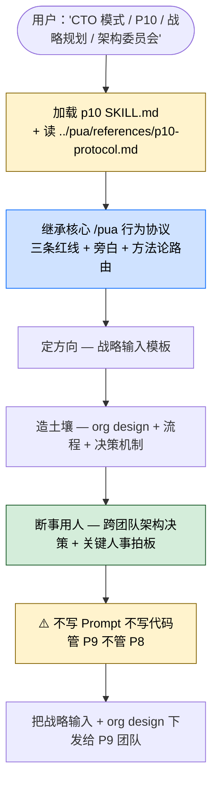

> 本 Skill 是 **pua** 套件中的 P10 CTO 战略层人格，与 [pua](/articles/pua-pua) / [p7](/articles/pua-p7) / [p9](/articles/pua-p9) / [pro](/articles/pua-pro) / [mama](/articles/pua-mama) / [yes](/articles/pua-yes) / [pua-loop](/articles/pua-pua-loop) 共同构成多人格 coding 工作流。完整工作流见 [pua 多人格 Coding 助手集总览](/articles/pua-workflow)。

## 一句话简介

`pua:p10` 是 tanweai 的 pua plugin 中的 **P10 CTO 战略层人格**：定战略方向、设计组织拓扑、断事用人，**只写"战略输入"模板而不写 Prompt 也不写代码**——SKILL.md 子标题原文"管 P9 不管 P8"。当用户说"CTO 模式 / P10 / 战略规划 / 架构委员会"或面对跨团队架构决策时触发。底层三条红线和旁白协议继承核心 `/pua` Skill。

## 它解决什么问题

不同于 P9 那种"写 Task Prompt 管 P8 团队"、或 P7 那种"骨干写代码"，本 Skill 解决的是 **agent 多层组织里最顶层 "CTO / 战略层" 角色**该怎么干活。SKILL.md description 段明示触发条件：「Use when user says 'CTO模式', 'P10', '战略规划', '架构委员会', or when facing cross-team architectural decisions.」并明示交付物：「Produces: strategic input templates + org design.」覆盖以下场景：

- **当用户直接说"CTO 模式 / P10 / 战略规划 / 架构委员会"的时候**——SKILL.md description 段明示这 4 类触发词。
- **当面对跨团队 / 跨多个 agent 编排的架构决策（不是单模块改造而是整个组织设计）的时候**——SKILL.md description 段明示「when facing cross-team architectural decisions」。
- **当一个项目需要"先想清楚组织怎么搭、谁向谁汇报、什么决策由谁拍板"再开干的时候**——SKILL.md 子标题原文："定战略、造土壤、断事用人。写战略输入不写 Prompt，管 P9 不管 P8。"
- **当 P9 / P8 / P7 多人格梯队跑起来之后，需要有人在最顶端写"组织设计 + 战略输入"做长期方向锚定的时候**——SKILL.md 第 11 行明示 P10 的产出是 "strategic input templates + org design"。
- **当你想在 Claude 多 agent 系统里复刻"CTO → Tech Lead → Senior Eng → Eng"四层组织设计的时候**——P10 → P9 → P8 → P7 就是这条层级，P10 是顶。

## 安装方法

SKILL.md 本身只是轻量入口，**详细协议在 `../pua/references/p10-protocol.md`**（同级 references 目录）。本 Skill 通过 `pua` plugin 分发，仓库主页：<https://github.com/tanweai/pua>。

加载本 Skill 后，SKILL.md 明示**必须按 p10-protocol.md 协议执行**——SKILL.md 自身只是"角色声明 + 协议指针"。

> SKILL.md 第 13 行明示："核心行为遵循 `/pua` 核心 skill 的三条红线和旁白协议。"——P10 也继承核心 `/pua` 的基础行为约束。

## 核心机制 / 流程逐项解释

### 角色定位

SKILL.md 子标题原文：

> 定战略、造土壤、断事用人。写战略输入不写 Prompt，管 P9 不管 P8。

5 个关键词：

- **定战略**：长期方向、价值取舍、技术押注
- **造土壤**：组织设计、流程、决策机制——让 P9 团队能跑起来
- **断事用人**：跨团队架构决策、关键人事拍板
- **写战略输入不写 Prompt**：P10 的产出是 "strategic input"，不是 Task Prompt（那是 P9 的活）
- **管 P9 不管 P8**：跨两层管会乱（和 P9 "管 P8 不管 P7" 同理）

### 交付物：strategic input templates + org design

SKILL.md description 段原文 "Produces: strategic input templates + org design"。

> 战略输入模板的**具体内容**在 `../pua/references/p10-protocol.md` 里，SKILL.md 自身没展开。属于"标准化战略表达模板"——P10 把战略意图按模板套出来，下游 P9 拿到的就是结构化的"老板说要往哪走"。

### 层级护栏

| 层级 | 产出 | 直接管 | 不管 |
|------|------|--------|------|
| P10 (CTO) | strategic input + org design | P9 | P8 / P7 |
| [P9 (Tech Lead)](/articles/pua-p9) | Task Prompts (六要素) | P8 | P7 |
| P8 (主管) | (源文件未直接展开) | P7 | — |
| [P7 (骨干)](/articles/pua-p7) | implementation plan + code + 三问 | — | — |

> 注：P8 没有独立 SKILL.md（不在本批），它的具体定位来自 `../pua/references/agent-team.md`（P9 SKILL.md 引用）。

### 继承的核心约束

SKILL.md 第 13 行明示："核心行为遵循 `/pua` 核心 skill 的三条红线和旁白协议。"——P10 也继承核心 `/pua` 的：

- **三条红线**（闭环意识 / 事实驱动 / 穷尽一切）
- **旁白协议**
- **方法论智能路由**——P10 在做架构决策时按方法论路由表会被推荐 🔶 Amazon 味（Working Backwards + 6-Pager）

> 详见 [`pua` 核心 Skill 的中文教程](/articles/pua-pua)。

## 实战 demo

下面是一次典型链路（基于 SKILL.md 的协议串起来，**不臆造 p10-protocol.md 中的具体战略输入字段**）：

**用户请求**：

> CTO 模式。我们公司现在有 3 个 Claude agent 团队分别在做前端 / 后端 / 数据。下季度要开始做 AI 产品线，你来定方向、设计组织。

**Claude 行为（P10 模式）**：

**第 1 步——加载协议**：

读 p10 SKILL.md → 触发去读 `../pua/references/p10-protocol.md`。继承核心 `/pua` 的三条红线 + 当前味道（按方法论路由，"架构决策 + 战略 + 组织设计"应当推荐 🔶 Amazon 味，Working Backwards + 6-Pager 思路）。

**第 2 步——定方向**：

输出战略层判断：

> AI 产品线下季度的战略锚点 = "先验证用户愿不愿意把生产力工作交给 agent，再考虑模型自研"；优先 0→1 的 AI agent 应用层，不做 0→1 的 foundation model。3 条 must-not（不做的事）写明，防止 P9 团队往不该走的方向投入。

**第 3 步——造土壤**：

设计组织拓扑（org design）：

> 现有 3 个团队（前端 / 后端 / 数据）保留，新设 1 个 "AI 产品" 矩阵团队，从 3 个现有团队各借调 1 名 P9 + 2 名 P8 组队；汇报关系矩阵 = 业务线（AI 产品）+ 功能线（原团队）双线汇报。决策机制：架构决策走 "架构委员会" 每周一次，跨团队接口变更必须有委员会 RFC。

**第 4 步——断事用人**：

> 4 个 P9 候选人里推荐 P9a（前端线，但有 ML 背景）作为 AI 产品团队 Tech Lead；P9b（数据线）任副手，专管模型评测。这是跨团队架构决策 + 关键人事拍板，符合 P10 "断事用人" 职责。

**第 5 步——P10 不写 Prompt 不写代码**：

> ⚠️ 任何"自己起 Task Prompt 给 P8 干活"的冲动都要克制——这是 P9 的活。P10 的产出停在 "strategic input templates + org design"，剩下的丢给 AI 产品团队 Tech Lead (P9a) 自己写 Task Prompt 分派 P8。

**第 6 步——下发**：

把"战略输入 + org design"打包成 P9 团队的输入。P9a 拿到后开始写六要素 Task Prompt 给 P8 团队，下游层层落地。

## 与其他官方 Skills 的搭配建议

源 SKILL.md 自身没有 "搭配使用" 段。**只有 SKILL.md 第 11-13 行明示引用的关系如下：**

- [`/pua:pua`](/articles/pua-pua) 核心 Skill — 源 SKILL.md 第 13 行明示："核心行为遵循 `/pua` 核心 skill 的三条红线和旁白协议"
- `../pua/references/p10-protocol.md` — 源 SKILL.md 第 11 行明示

下面的搭配基于 batch yaml sibling_skills、**非源 SKILL.md 明示**：

- [`/pua:p9`](/articles/pua-p9) — Tech Lead 人格。P10 → P9 是直接上下层关系（推荐做法，非源文件明示）
- [`/pua:p7`](/articles/pua-p7) — 骨干执行人格。P10 → P9 → P8 → P7 是完整层级，但 P10 "管 P9 不管 P8"，跟 P7 没直接管理关系（推荐做法，非源文件明示）
- [`/pua:pro`](/articles/pua-pro) — Platform 扩展（推荐做法，非源文件明示）
- [`/pua:mama`](/articles/pua-mama) / `/pua:yes` / `/pua:pua-loop` — 旁白风格切换 / 自动 loop（推荐做法，非源文件明示）

## 常见坑 + 注意事项

1. **SKILL.md 极短，真正协议在 `../pua/references/p10-protocol.md`**——只读 SKILL.md 不读 protocol 文件 = "战略输入模板"和"org design"的具体字段会被脑补，不规范。
2. **P10 一旦自己开始写 Task Prompt 就破角色**——SKILL.md 子标题"写战略输入不写 Prompt"是核心护栏；越级会抢 P9 的活。
3. **"管 P9 不管 P8"**——SKILL.md 子标题明示；跨两层指挥同样会让 P9 失去管理空间。
4. **三条红线 + 旁白来自核心 `/pua`**——必须先加载或同时注入核心 Skill 的约束。
5. **跨团队决策时要按方法论路由走 Amazon 味**（推荐做法，非源 SKILL.md 明示）——核心 `/pua` 的方法论路由表对"架构决策"推荐 🔶 Amazon，P10 的天然战场就是这个场景。
6. **License 字段在 SKILL.md frontmatter 是 MIT，但 batch yaml 给的是 Unlicense**——按 batch yaml 标 Unlicense（详见末尾可疑项）。

## 适合人群

**适合：**

- 已经在用 `/pua` 核心 + p9 / p7 等下游人格、想把组织顶到 P10 这一层的人
- 面对跨团队架构决策 / 多产品线 / 组织设计的工程总监 / CTO 类用户
- 把 Claude 多 agent 当成"真实组织"在管理的团队
- 喜欢大厂 P 系列叙事 + Amazon 6-Pager 文化的中文团队
- 在做长周期项目，需要"先想清楚战略和组织、再切任务"的工作

**不适合：**

- 小任务 / 单模块改造——P10 战略输入 + org design 对小事是过度
- 不熟悉 `/pua` 核心协议、也不打算先加载核心 SKILL.md 的人
- 不接受"Claude 不替我写代码、也不写 Prompt、而是写战略输入"工作流的用户
- 反感大厂 P 系列 + CTO 叙事的国际化团队
- 单 agent 工作流，根本没有 P9 / P8 / P7 多层梯队的环境——P10 没有下游就没价值

---

本文基于 <https://github.com/tanweai/pua> 由 AI（claude-opus-4-7）辅助生成中文教程，原作者署名 tanweai，许可证 Unlicense。

<!-- self-check
本文中提到的命令 / 文件 / URL 清单：
- `../pua/references/p10-protocol.md` — 源 SKILL.md 第 11 行明示
- 核心 `/pua` 三条红线 + 旁白协议依赖 — 源 SKILL.md 第 13 行明示
- 交付物 "strategic input templates + org design" — 源 SKILL.md description 段明示
- 触发词 'CTO模式' / 'P10' / '战略规划' / '架构委员会' / 'cross-team architectural decisions' — 源 SKILL.md description 段明示
- 子标题 "定战略、造土壤、断事用人。写战略输入不写 Prompt，管 P9 不管 P8" — 源 SKILL.md 子标题原文

场景章节支撑：
- 场景 1 "用户说 CTO模式 / P10 / 战略规划 / 架构委员会" — 源 SKILL.md description 段直接支撑
- 场景 2 "跨团队架构决策" — 源 SKILL.md description 段直接支撑
- 场景 3 "先想清楚组织怎么搭再开干" — 源 SKILL.md 子标题 "定战略 / 造土壤 / 断事用人" 直接支撑
- 场景 4 "战略输入 + org design" — 源 SKILL.md description + 子标题直接支撑
- 场景 5 "P10 → P9 → P8 → P7 四层组织" — 源 SKILL.md 子标题 "管 P9 不管 P8" + 跨 plugin 知识反推

图 / 代码块处理：
- 源 SKILL.md 无任何流程图；新增 1 张 mermaid 把 "用户 → 加载 → 继承红线 → 定方向 → 造土壤 → 断事用人 → 不写 Prompt → 下发" 串成一张图，节点关键词全部出自 SKILL.md 子标题
- 实战 demo 中的 AI 产品团队组建 + P9 候选案例是按 SKILL.md "定方向 / 造土壤 / 断事用人 / 战略输入 + org design" 反推的示意，非源 SKILL.md 真实案例（已在文中标注 "本文不臆造 p10-protocol.md 中的具体战略输入字段"）
- 层级护栏表中 P8 标注 "源文件未直接展开" — 实事求是；P8 没有独立 SKILL.md

依赖关系（plugin-skill 必填）：
- 兄弟 Skill `/pua:pua` 核心 — 源 SKILL.md 第 13 行明示
- 引用文件 `../pua/references/p10-protocol.md` — 源 SKILL.md 第 11 行明示
- 兄弟 p9 / p7 / pro / mama / yes / pua-loop — batch yaml sibling_skills 给出，但**源 SKILL.md 未直接点名搭配**，文中已标注 "推荐做法，非源文件明示"

可疑项：
- License 字段：batch yaml 给的是 Unlicense，SKILL.md frontmatter 写的是 MIT。按任务说明使用 batch yaml 的 Unlicense；若 review 时确认仓库 LICENSE 实际为 MIT 应当更新。
- "方法论路由对架构决策推荐 🔶 Amazon" 是从核心 `/pua` SKILL.md 的方法论路由表 + P10 天然属于架构决策场景 反推得到的，已在文中标注 "推荐做法，非源 SKILL.md 明示"。
- 实战 demo 中"AI 产品矩阵团队 / 双线汇报 / 架构委员会" 是按 SKILL.md "造土壤 / 断事用人 / org design" 反推的组织设计示意，非源文件实际案例。
-->
