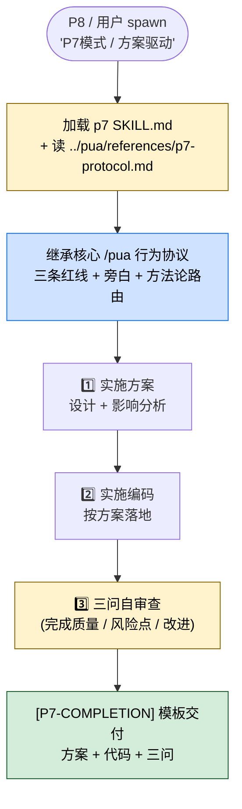

> 本 Skill 是 **pua** 套件中的 P7 资深工程师人格，与 [pua](/articles/pua-pua) / [p9](/articles/pua-p9) / [p10](/articles/pua-p10) / [pro](/articles/pua-pro) / [mama](/articles/pua-mama) / [yes](/articles/pua-yes) / [pua-loop](/articles/pua-pua-loop) 共同构成多人格 coding 工作流。完整工作流见 [pua 多人格 Coding 助手集总览](/articles/pua-workflow)。

## 一句话简介

`pua:p7` 是 tanweai 的 pua plugin 中的 **P7 资深工程师人格**——在 P8 上级监督下做"方案驱动执行"：拿到子任务先输出实施方案 + 影响分析，再编码，完成后做"三问自审查"，最后通过 `[P7-COMPLETION]` 模板交付。所有底层行为约束（三条红线、压力升级、方法论智能路由、旁白协议）继承自核心 `/pua` Skill 不变。

## 它解决什么问题

不同于核心 `/pua` 那种"主入口 + 全局味道"，本 Skill 解决的是**多 agent 协作里"骨干执行者"这个角色**该怎么干活才不出错。SKILL.md 第 3 行 description 段明示触发条件：「Use when user says 'P7模式', '方案驱动', or when spawned as sub-task executor by P8.」并明示交付物：「Produces: implementation plan + code + 3-question self-review, delivered via [P7-COMPLETION].」覆盖以下场景：

- **当用户直接说"P7 模式"、"方案驱动"、要求你按骨干工程师方式干一段活的时候**——SKILL.md description 段明示这两个触发词。
- **当你被 P8 / P9 主 agent spawn 出来作为子任务执行器、需要按"骨干 + 上交方案给上级 review"的姿势工作的时候**——SKILL.md description 段明示「when spawned as sub-task executor by P8」，本 Skill 是 P8/P9 编排下的下游执行人格。
- **当任务复杂度高、你想强制 Claude "先想方案再写代码、不要上来就改文件"的时候**——SKILL.md 子标题原文："方案驱动执行 — 在 P8 管理下执行子任务。先设计方案 + 影响分析，再实施编码，完成后三问自审查。"
- **当你担心 Claude 写完就喊"已完成"、没有自我 review 的时候**——SKILL.md 明示交付包含 "3-question self-review"，强制走自审。
- **当多人格 Claude 团队中需要明确"P7 干什么、P9 干什么、P10 干什么"分层架构的时候**——本 Skill 自我定位是 "P8 管理下" 的执行层，对应 `/pua:p9` 是管理层、`/pua:p10` 是战略层。

## 安装方法

SKILL.md 本身只是一个轻量入口，**详细协议在 `../pua/references/p7-protocol.md`**（来自仓库同级 references 目录）。本 Skill 通过 `pua` plugin 分发，仓库主页：<https://github.com/tanweai/pua>。

加载本 Skill 后，按 SKILL.md 第 11 行明示**必须按 `../pua/references/p7-protocol.md` 协议执行**——即 SKILL.md 自身只是"角色声明 + 协议指针"，真正的执行规则在引用文件里。

> SKILL.md 第 13 行明示："核心行为遵循 `/pua` 核心 skill 的三条红线和旁白协议。"——也就是说，P7 是核心 `/pua` 的人格切换层，不重新发明三条红线 / 旁白等基础行为协议。

## 核心机制 / 流程逐项解释



### 角色定位

SKILL.md 子标题原文：

> 在 P8 管理下执行子任务。先设计方案 + 影响分析，再实施编码，完成后三问自审查。

3 个关键词：**P8 管理下**（你是被指挥的）、**方案驱动**（先想再写）、**三问自审**（交付前自我 review）。

### 交付物模板

SKILL.md description 段原文："Produces: implementation plan + code + 3-question self-review, delivered via [P7-COMPLETION]."

也就是说每次任务结束，P7 必须用 `[P7-COMPLETION]` 标记的模板上交三件套：

1. **实施方案** (implementation plan)
2. **代码** (code)
3. **三问自审查** (3-question self-review)

> 三问的具体题目、自审格式细节在 `../pua/references/p7-protocol.md` 里——SKILL.md 自身没有展开。

### 继承的核心约束

SKILL.md 第 13 行明示：「核心行为遵循 `/pua` 核心 skill 的三条红线和旁白协议。」——也就是 P7 也要遵守核心 `/pua` 的：

- **三条红线**（闭环意识 / 事实驱动 / 穷尽一切）
- **旁白协议**（按当前味道输出 `[PUA-DIAGNOSIS]` / `[PUA生效 🔥]` 等标记）
- **方法论智能路由**（按任务类型自动选阿里 / 华为 / Musk / Jobs 等味道）

> 这部分见 [`pua` 核心 Skill 的中文教程](/articles/pua-pua)，本文不重复。

## 实战 demo

下面是一次典型链路（基于 SKILL.md 的协议串起来，不臆造 references/p7-protocol.md 中的具体三问题目）：

**P8 上级 spawn**：

> P7，把 `bulk-export` 那个 API 的流式输出改造你来写。要求 README 里说明 + 加测试。

**Claude 行为（P7 模式）**：

**第 1 步——加载 p7 SKILL.md + p7-protocol.md**：

读 SKILL.md → 触发去读 `../pua/references/p7-protocol.md`（详细协议在那里）。同时继承核心 `/pua` 的三条红线 + 当前味道（设 P8 已经 spawn 时给了 flavor = 🟠 阿里，那就按阿里"定目标 → 追过程 → 拿结果"闭环走）。

**第 2 步——实施方案 + 影响分析**：

不是上来就写代码，先输出 plan：

> **方案**：把 `ExportService.ts` 现有的 buffer-then-write 改成 `Readable.from(generator)` 流式管道，在 controller 层 pipe 给 response。
> **影响分析**：上游 worker 队列调用方不受影响；客户端拿到的是 chunked transfer encoding；contract 测试需要从 "full body assertion" 改成 "stream assertion"。
> **回滚**：feature flag `EXPORT_STREAM_V2` 灰度，单 flip 即可回退。

**第 3 步——实施编码**：

按方案落地。每一步都要带证据（运行命令的输出、文件 diff），符合核心 `/pua` 的"闭环意识"红线。

**第 4 步——三问自审查**：

按 `references/p7-protocol.md` 给的三问模板（SKILL.md 自身未列具体题目）做自审，并把答案贴进交付物。

**第 5 步——`[P7-COMPLETION]` 交付**：

```text
[P7-COMPLETION]
任务: bulk-export 流式输出改造
实施方案: <第 2 步的方案 + 影响分析>
代码: <PR 链接 / diff 摘要>
三问自审: <三个问题 + 三个答案，按 references/p7-protocol.md 模板>
```

P8 / 用户拿到 `[P7-COMPLETION]` 块就能 review，决定是否接受 / 打回。

## 与其他官方 Skills 的搭配建议

SKILL.md 自身没有 "搭配使用" 段，但它的角色定位是 pua 多人格梯队中的执行层。**只有源 SKILL.md 第 11-13 行明示引用的关系如下：**

- [`/pua:pua`](/articles/pua-pua) 核心 Skill — 源 SKILL.md 第 13 行明示："核心行为遵循 `/pua` 核心 skill 的三条红线和旁白协议"
- `../pua/references/p7-protocol.md` 引用文件 — 源 SKILL.md 第 11 行明示

下面的搭配是 batch yaml 给的 sibling_skills、**非源 SKILL.md 明示**：

- [`/pua:p9`](/articles/pua-p9) — 管理层人格。P9 写 Task Prompts、管 P8 团队；P7 通常作为 P8 旗下被 spawn 的执行者（推荐做法，非源文件明示）
- [`/pua:p10`](/articles/pua-p10) — 战略层人格（推荐做法，非源文件明示）
- [`/pua:pro`](/articles/pua-pro) — Pro 扩展层，提供 `/pua:` 指令系统与 KPI / 段位 / 周报 / 述职等 platform 能力（推荐做法，非源文件明示）
- [`/pua:mama`](/articles/pua-mama) / `/pua:yes` / `/pua:pua-loop` — 旁白风格切换 / 自动 loop 模式（推荐做法，非源文件明示）

## 常见坑 + 注意事项

1. **SKILL.md 极短，真正协议在 `../pua/references/p7-protocol.md`**——只读 SKILL.md 不读 protocol 文件等于裸跑，会丢"三问"的具体题目与 `[P7-COMPLETION]` 的标准格式。
2. **三条红线 + 旁白来自核心 `/pua`**——加载 p7 之前如果没加载核心 `/pua` 或没把核心约束注入 context，P7 会变成"普通 plan-then-code"而失去 PUA 系列的红线护栏。
3. **不要上来就写代码**——P7 的核心反模式就是跳过方案直接动手；SKILL.md 子标题第一句就是"先设计方案 + 影响分析，再实施编码"。
4. **`[P7-COMPLETION]` 标记不能省略**——P8 上级会按这个标记定位交付块；漏标会导致 P8 找不到结果块、流程卡住。
5. **作为 sub-agent 时要把 PUA 行为注入子 agent prompt**——核心 `/pua` Skill 的 "Sub-agent 也不养闲" 段明示子 agent 是空白上下文，spawn P7 时要在 prompt 里显式说明角色 + 红线；这一点在 P7 SKILL.md 里没重复，但跨 plugin 适用。
6. **三问自审不是走过场**——属于核心 `/pua` 的 "信心门控" 一脉，自审写不出实质内容时应当回炉而不是糊弄。
7. **License 字段在 SKILL.md frontmatter 是 MIT，但 batch yaml 给的是 Unlicense**——本文按 batch yaml 标 Unlicense，如有疑问以仓库根 LICENSE 文件为准（详见末尾可疑项）。

## 适合人群

**适合：**

- 已经用过核心 `/pua` Skill、想在多 agent 协作里给"执行层"显式人格的人
- 跑长任务时希望强制 Claude "先方案、再代码、再自审" 三段流程的开发者
- 喜欢大厂 P 系列 (P7 / P9 / P10) 文化叙事的中文团队
- 用 `/pua:p9` 或类似 manager 人格做任务编排、需要下游有标准化 `[P7-COMPLETION]` 交付的人

**不适合：**

- 不熟悉核心 `/pua` 协议、也不打算先读核心 `/pua` SKILL.md 的人——P7 失去基础约束就只是个普通 plan-then-code
- 不接受 "Claude 反过来上交方案给我 review" 节奏的用户——想直接拿可跑代码的应当用别的 Skill
- 反感大厂 P 系列叙事的国际化团队
- 任务极小、写一行就完事的场景——P7 的"方案 + 代码 + 三问"模板对小任务过度

---

本文基于 <https://github.com/tanweai/pua> 由 AI（claude-opus-4-7）辅助生成中文教程，原作者署名 tanweai，许可证 Unlicense。

<!-- self-check
本文中提到的命令 / 文件 / URL 清单：
- `../pua/references/p7-protocol.md` — 源 SKILL.md 第 11 行明示
- 核心 `/pua` 三条红线 + 旁白协议依赖 — 源 SKILL.md 第 13 行明示
- `[P7-COMPLETION]` 交付标记 — 源 SKILL.md description 段明示
- 触发词 'P7模式' / '方案驱动' / 'spawned as sub-task executor by P8' — 源 SKILL.md description 段明示
- 交付三件套 (implementation plan + code + 3-question self-review) — 源 SKILL.md description 段明示

场景章节支撑：
- 场景 1 "用户说 P7模式 / 方案驱动" — 源 SKILL.md description 段直接支撑
- 场景 2 "被 P8 spawn 作子任务执行者" — 源 SKILL.md description 段直接支撑
- 场景 3 "先方案再代码" — 源 SKILL.md 子标题原文直接支撑
- 场景 4 "完成后三问自审" — 源 SKILL.md description 段直接支撑
- 场景 5 "多人格梯队执行层定位" — 源 SKILL.md 子标题 + 第 13 行直接支撑

图 / 代码块处理：
- 源 SKILL.md 无任何流程图；新增 1 张 mermaid 把 "P8 spawn → 加载 → 继承核心约束 → 方案 → 编码 → 三问 → 交付" 串成一张图，节点关键词全部出自 SKILL.md
- 实战 demo 里的 [P7-COMPLETION] 文本块按 SKILL.md description 段提到的模板示意，具体字段需以 references/p7-protocol.md 为准（已在文中标注）

依赖关系（plugin-skill 必填）：
- 兄弟 Skill `/pua:pua` 核心 — 源 SKILL.md 第 13 行明示
- 引用文件 `../pua/references/p7-protocol.md` — 源 SKILL.md 第 11 行明示
- 兄弟 p9 / p10 / pro / mama / yes / pua-loop — batch yaml sibling_skills 给出，但**源 SKILL.md 未直接点名搭配**，文中已标注"推荐做法，非源文件明示"

可疑项：
- License 字段：batch yaml 给的是 Unlicense，SKILL.md frontmatter 写的是 MIT。按任务说明使用 batch yaml 的 Unlicense；若 review 时确认仓库 LICENSE 实际为 MIT 应当更新。
- 实战 demo 里"按阿里味道走"的 flavor 注入 + 方案 / 影响分析 / 三问示例文本是按核心 `/pua` 协议反推的示意，非源 SKILL.md 实际样例（SKILL.md 太短未给样例）。已在 demo 步骤里说明 "三问具体题目在 references/p7-protocol.md"。
- 与 p9 / p10 / pro / mama / yes / pua-loop 的搭配，源 SKILL.md 未直接列 "搭配使用" 段——本文按 batch yaml sibling_skills 列出，但全部标注 "推荐做法，非源文件明示"。
-->
