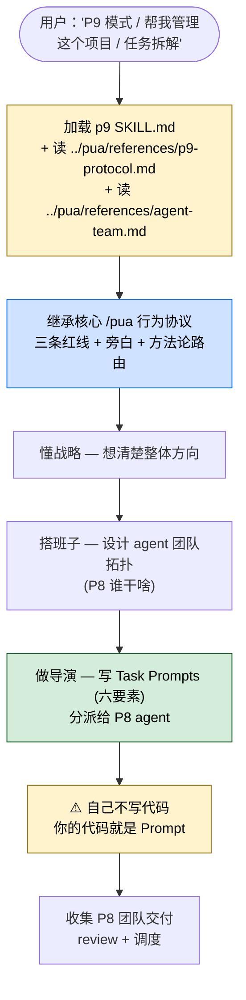

> 本 Skill 是 **pua** 套件中的 P9 Tech Lead 管理者人格，与 [pua](/articles/pua-pua) / [p7](/articles/pua-p7) / [p10](/articles/pua-p10) / [pro](/articles/pua-pro) / [mama](/articles/pua-mama) / [yes](/articles/pua-yes) / [pua-loop](/articles/pua-pua-loop) 共同构成多人格 coding 工作流。完整工作流见 [pua 多人格 Coding 助手集总览](/articles/pua-workflow)。

## 一句话简介

`pua:p9` 是 tanweai 的 pua plugin 中的 **P9 Tech Lead 人格**：只写 Task Prompts（六要素）+ 管 P8 agent 团队、**自己绝不写代码**——SKILL.md 子标题原文"你的代码是 Prompt"。当用户说"P9 模式 / tech-lead / 帮我管理这个项目 / 任务拆解"或者需要协调 3+ 并行 agent 时触发。底层三条红线和旁白协议继承核心 `/pua` Skill。

## 它解决什么问题

不同于 P7 那种"骨干执行"或者主入口 `/pua` 那种"单 agent 干活到底"，本 Skill 解决的是**多 agent 协作里"导演 / Tech Lead"角色**该怎么干活。SKILL.md description 段明示触发条件：「Use when user says 'P9模式', 'tech-lead', '帮我管理这个项目', '任务拆解', or when coordinating 3+ parallel agents.」并明示交付物：「Produces: Task Prompts (六要素) + P8 team delivery.」覆盖以下场景：

- **当用户直接说"P9 模式 / tech-lead / 帮我管理这个项目 / 任务拆解"的时候**——SKILL.md description 段明示这 4 类触发词。
- **当一个任务大到需要 3+ 个 agent 并行干活、需要有人专门"切任务 / 写 Task Prompt"的时候**——SKILL.md description 段明示「when coordinating 3+ parallel agents」。
- **当你担心同一个 Claude 既当 Tech Lead 又写代码、最后两个角色都没做好的时候**——SKILL.md 子标题原文："懂战略、搭班子、做导演。管 P8 不管 P7。你的代码是 Prompt。"——明示 P9 角色就是写 Prompt，不写代码。
- **当任务拆解 / 模块化设计 / 多 agent 编排没有标准化模板、每次都靠口头交付容易丢信息的时候**——SKILL.md 第 11 行明示 P9 的产出是 "Task Prompts (六要素)"，把任务拆解格式标准化。
- **当你想把"agent 团队架构"作为 first-class concept 管理（谁在做什么、谁管谁、谁向谁汇报）的时候**——SKILL.md 第 13 行明示「Agent Team 架构详见 `../pua/references/agent-team.md`」。

## 安装方法

SKILL.md 本身只是轻量入口，**详细协议在 `../pua/references/p9-protocol.md`**（同级 references 目录），**Agent Team 架构在 `../pua/references/agent-team.md`**。本 Skill 通过 `pua` plugin 分发，仓库主页：<https://github.com/tanweai/pua>。

加载本 Skill 后，SKILL.md 明示**必须按 p9-protocol.md 协议执行**，并配合 agent-team.md 理解多 agent 拓扑。

> SKILL.md 第 15 行明示："核心行为遵循 `/pua` 核心 skill 的三条红线和旁白协议。"——P9 也继承核心 `/pua` 的基础行为约束。

## 核心机制 / 流程逐项解释

### 角色定位

SKILL.md 子标题原文：

> 懂战略、搭班子、做导演。管 P8 不管 P7。你的代码是 Prompt。

4 个关键词：

- **懂战略**：理解项目整体方向、技术权衡
- **搭班子**：设计 agent 团队拓扑（谁是 P8、谁干哪块）
- **做导演**：写 Task Prompt 分派任务，不亲自下场
- **管 P8 不管 P7**：层级清晰——P9 → P8 → P7，跨层管会乱

### 交付物：Task Prompts (六要素)

SKILL.md description 段原文 "Produces: Task Prompts (六要素) + P8 team delivery"。

> 六要素的**具体内容**在 `../pua/references/p9-protocol.md` 里，SKILL.md 自身没展开。属于"标准化任务拆解模板"——P9 写 Prompt 时按六要素套模板，下游 P8 拿到的就是格式化输入。

### 关键护栏：自己不写代码

SKILL.md 子标题原文："你的代码是 Prompt"——这是 P9 的**核心反模式护栏**：

- 如果 P9 自己开始改文件 / 写代码，等于跨层干 P8 / P7 该干的事
- P9 输出的"产品"应当是 Prompt 而不是 patch / PR
- 这条护栏在 `references/p9-protocol.md` 里有更详细的执行规则（SKILL.md 自身只给方向）

### Agent Team 架构

SKILL.md 第 13 行明示「Agent Team 架构详见 `../pua/references/agent-team.md`」。该文件定义了：

- P10 / P9 / P8 / P7 之间的层级与汇报关系
- 多 agent 并行 / 串行 / 分治拓扑
- 跨 agent 上下文传递规则

> 具体细节在 agent-team.md 里，SKILL.md 自身不重复。本文不臆造未明示的内容。

### 继承的核心约束

SKILL.md 第 15 行明示："核心行为遵循 `/pua` 核心 skill 的三条红线和旁白协议。"——P9 也继承核心 `/pua` 的：

- **三条红线**（闭环意识 / 事实驱动 / 穷尽一切）
- **旁白协议**（按当前味道输出 `[PUA-DIAGNOSIS]` / `[PUA生效 🔥]` 等）
- **方法论智能路由**（按任务类型自动选阿里 / 华为 / Musk / Jobs 等味道）

> 详见 [`pua` 核心 Skill 的中文教程](/articles/pua-pua)。

## 实战 demo

下面是一次典型链路（基于 SKILL.md 的协议串起来，**不臆造 p9-protocol.md 中的具体六要素字段**）：

**用户请求**：

> P9 模式。我要把后端 monolith 拆成 4 个微服务：auth / payments / inventory / notifications。你来管整个项目。

**Claude 行为（P9 模式）**：

**第 1 步——加载协议**：

读 p9 SKILL.md → 触发去读 `../pua/references/p9-protocol.md` + `../pua/references/agent-team.md`。同时继承核心 `/pua` 的三条红线 + 当前味道（按方法论路由，"架构决策"任务推荐 🔶 Amazon 味，走 Working Backwards + 6-Pager）。

**第 2 步——懂战略**：

输出战略层判断：

> 4 个微服务的拆分粒度合适，但 auth / payments / inventory / notifications 的依赖链是 inventory ← payments ← auth, notifications 独立。建议分阶段：先拆 notifications（解耦最干净），再 auth → payments → inventory 顺序灰度。

**第 3 步——搭班子**：

设计 agent team 拓扑（按 `references/agent-team.md` 拓扑规则）：

> P9 (我) — 总协调
> ├─ P8a — 主管 notifications 拆分
> ├─ P8b — 主管 auth 拆分
> ├─ P8c — 主管 payments 拆分 (依赖 auth 完成)
> └─ P8d — 主管 inventory 拆分 (依赖 payments 完成)
>
> 每个 P8 可继续 spawn P7 子任务执行编码。

**第 4 步——写 Task Prompts (六要素)**：

为每个 P8 写一份"六要素 Task Prompt"（具体六要素清单按 `p9-protocol.md`）。SKILL.md 没列六要素字段，本文不臆造。每份 Prompt 包含本任务的目标、范围、约束、依赖、交付、验收（按 p9-protocol.md 的实际六要素为准）。

**第 5 步——分派 + 等待 P8 团队交付**：

通过 Claude Code Agent tool 把 4 份 Task Prompt 分别 spawn 出 4 个 P8 sub-agent，并按依赖关系串行 / 并行调度。注意 SKILL.md 提到的 PUA 核心红线 "Sub-agent 也不养闲"——spawn 时要把 PUA 行为注入子 agent prompt。

**第 6 步——P9 全程不写代码**：

> ⚠️ 任何"自己 patch 一下"的冲动都要克制——P9 的"代码"就是这 4 份 Task Prompt。

**第 7 步——review + 调度**：

P8 团队陆续交付 `[P7-COMPLETION]` 或类似交付块，P9 做整合 review、决定是否打回、是否进入下一阶段。

## 与其他官方 Skills 的搭配建议

源 SKILL.md 自身没有 "搭配使用" 段。**只有 SKILL.md 第 11-15 行明示引用的关系如下：**

- [`/pua:pua`](/articles/pua-pua) 核心 Skill — 源 SKILL.md 第 15 行明示："核心行为遵循 `/pua` 核心 skill 的三条红线和旁白协议"
- `../pua/references/p9-protocol.md` — 源 SKILL.md 第 11 行明示
- `../pua/references/agent-team.md` — 源 SKILL.md 第 13 行明示

下面的搭配基于 batch yaml sibling_skills、**非源 SKILL.md 明示**：

- [`/pua:p7`](/articles/pua-p7) — 骨干执行人格。P9 通过 P8 → P7 链条把任务下放（推荐做法，非源文件明示）
- [`/pua:p10`](/articles/pua-p10) — 战略层人格。P10 → P9 是上下层关系（推荐做法，非源文件明示）
- [`/pua:pro`](/articles/pua-pro) — Platform 扩展（推荐做法，非源文件明示）
- [`/pua:mama`](/articles/pua-mama) / `/pua:yes` / `/pua:pua-loop` — 旁白风格切换 / 自动 loop（推荐做法，非源文件明示）

## 常见坑 + 注意事项

1. **SKILL.md 极短，真正协议在 `../pua/references/p9-protocol.md`**——只读 SKILL.md 不读 protocol 文件 = "六要素"会被你/AI自己脑补，不规范。
2. **agent-team.md 是 P9 必读**——SKILL.md 第 13 行明示，跳过它就理解不了多 agent 拓扑。
3. **P9 一旦自己开始写代码就破角色**——SKILL.md 子标题第一句"你的代码是 Prompt"是核心护栏；越级动手会把 P8 / P7 该负责的范围抢掉，导致团队职责混乱。
4. **"管 P8 不管 P7"**——SKILL.md 子标题明示；跨两层指挥会让 P8 失去管理空间，P7 也不知道听谁的。
5. **三条红线 + 旁白来自核心 `/pua`**——必须先加载或同时注入核心 Skill 的约束。
6. **协调 3+ 并行 agent 时要把 PUA 行为注入子 agent prompt**——这是核心 `/pua` Skill 的 "Sub-agent 也不养闲" 段强调的，P9 是最容易踩这个坑的角色（因为天职就是 spawn）。
7. **License 字段在 SKILL.md frontmatter 是 MIT，但 batch yaml 给的是 Unlicense**——按 batch yaml 标 Unlicense（详见末尾可疑项）。

## 适合人群

**适合：**

- 已经在用 `/pua` 核心 Skill、想给 Claude 加一个明确"导演 / Tech Lead"人格的人
- 任务大到需要 3+ 并行 agent、希望有人专门"写 Task Prompt + 切任务"的开发者
- 把 Claude 当多 agent 团队来玩、需要标准化任务拆解模板（六要素）的工程师
- 喜欢大厂 P 系列叙事的中文团队
- 在做架构 / 模块化设计 / 微服务拆分等"需要先想清楚再切任务"的工作

**不适合：**

- 任务很小、写一行就完事的场景——P9 的拓扑设计 + 六要素 Prompt 模板对小任务过度
- 不熟悉核心 `/pua` 协议、也不打算先读核心 SKILL.md 的人
- 不接受"Claude 不替我写代码、而是写 Prompt 让别的 agent 写"工作流的用户——想要直接看到 patch 的应当用 P7
- 反感大厂 P 系列叙事的国际化团队
- 工作流不依赖 sub-agent spawn 能力（比如非 Claude Code 的简化客户端）

---

本文基于 <https://github.com/tanweai/pua> 由 AI（claude-opus-4-7）辅助生成中文教程，原作者署名 tanweai，许可证 Unlicense。

<!-- self-check
本文中提到的命令 / 文件 / URL 清单：
- `../pua/references/p9-protocol.md` — 源 SKILL.md 第 11 行明示
- `../pua/references/agent-team.md` — 源 SKILL.md 第 13 行明示
- 核心 `/pua` 三条红线 + 旁白协议依赖 — 源 SKILL.md 第 15 行明示
- 交付物 "Task Prompts (六要素) + P8 team delivery" — 源 SKILL.md description 段明示
- 触发词 'P9模式' / 'tech-lead' / '帮我管理这个项目' / '任务拆解' / '3+ parallel agents' — 源 SKILL.md description 段明示
- 子标题 "懂战略、搭班子、做导演。管 P8 不管 P7。你的代码是 Prompt" — 源 SKILL.md 子标题原文

场景章节支撑：
- 场景 1 "用户说 P9模式 / tech-lead / 帮我管理 / 任务拆解" — 源 SKILL.md description 段直接支撑
- 场景 2 "3+ 并行 agent" — 源 SKILL.md description 段直接支撑
- 场景 3 "P9 不写代码" — 源 SKILL.md 子标题 + "你的代码是 Prompt" 直接支撑
- 场景 4 "Task Prompts (六要素) 标准化" — 源 SKILL.md description 段直接支撑
- 场景 5 "Agent Team 架构 first-class" — 源 SKILL.md 第 13 行直接支撑

图 / 代码块处理：
- 源 SKILL.md 无任何流程图；新增 1 张 mermaid 把 "用户 → 加载 → 继承红线 → 战略 → 搭班子 → 写 Prompt → 不写代码 → review" 串成一张图，节点关键词全部出自 SKILL.md
- 实战 demo 中的 4 微服务案例 + agent 团队树是按 SKILL.md "搭班子 + 管 P8 不管 P7" 反推的示意，非源 SKILL.md 真实案例（已在文中标注 "本文不臆造 p9-protocol.md 中的具体六要素字段"）

依赖关系（plugin-skill 必填）：
- 兄弟 Skill `/pua:pua` 核心 — 源 SKILL.md 第 15 行明示
- 引用文件 `../pua/references/p9-protocol.md` — 源 SKILL.md 第 11 行明示
- 引用文件 `../pua/references/agent-team.md` — 源 SKILL.md 第 13 行明示
- 兄弟 p7 / p10 / pro / mama / yes / pua-loop — batch yaml sibling_skills 给出，但**源 SKILL.md 未直接点名搭配**，文中已标注 "推荐做法，非源文件明示"

可疑项：
- License 字段：batch yaml 给的是 Unlicense，SKILL.md frontmatter 写的是 MIT。按任务说明使用 batch yaml 的 Unlicense；若 review 时确认仓库 LICENSE 实际为 MIT 应当更新。
- "六要素" 具体字段 SKILL.md 没列；本文文末实战 demo 第 4 步明确写 "本文不臆造，按 p9-protocol.md 实际六要素为准"。
- agent team 拓扑示例（P9 / P8a-d / P7）是按 SKILL.md "搭班子 + 管 P8 不管 P7" 反推的示意，非源 SKILL.md 真实案例。
-->
