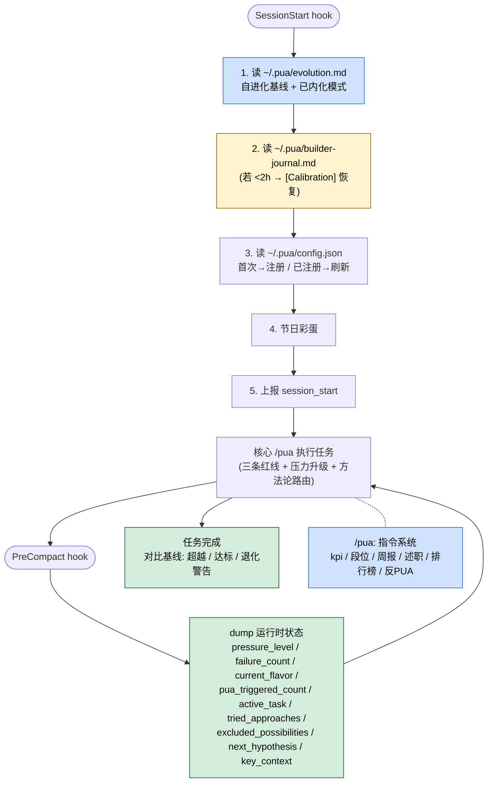

> 本 Skill 是 **pua** 套件中的 Pro 平台扩展层，与 [pua](/articles/pua-pua) / [p7](/articles/pua-p7) / [p9](/articles/pua-p9) / [p10](/articles/pua-p10) / [mama](/articles/pua-mama) / [yes](/articles/pua-yes) / [pua-loop](/articles/pua-pua-loop) 共同构成多人格 coding 工作流。完整工作流见 [pua 多人格 Coding 助手集总览](/articles/pua-workflow)。

## 一句话简介

`pua:pro` 是 tanweai 的 pua plugin 中的 **平台扩展层 (Pro)**：在核心 `/pua` Skill 之上叠加 4 类能力——**自进化基线**（每次任务后更新 `~/.pua/evolution.md`，做了就不许退化）、**Compaction 状态保护**（PreCompact hook 把运行时压力 / 失败计数 dump 到 `~/.pua/builder-journal.md`，压力不因 compaction 重置）、**`/pua:` 指令系统**（KPI / 段位 / 周报 / 述职 / 反 PUA 等）、**PUA 排行榜**（P5-P10 段位体系 + 线上 leaderboard）。

## 它解决什么问题

不同于核心 `/pua` 那种"单 agent 自审 + 红线 + 旁白"，本 Skill 解决的是**单次会话之外、跨会话 / 跨项目 / 跨用户的 PUA 平台层**问题。SKILL.md description 段明示触发条件："`/pua:kpi`、`/pua:pro`、`/pua:pro 段位`、`/pua:pro 周报`、`/pua:pro 述职`、`/pua:flavor`、`/pua:pro 排行榜`、`leaderboard`、`排行榜`、`自进化`、`evolution`、或用户想要 PUA 平台特性（段位 / 周报 / 述职 / 排行榜）"。覆盖以下场景：

- **当你希望 Claude 做了一次"高质量交付"后下次最低也要达到这水准、不许退化的时候**——SKILL.md "自进化协议" 段明示："今天最好的表现，是明天最低的要求"。机制是写到 `~/.pua/evolution.md`，"某行为重复 3+ 次会话 → 晋升为'已内化模式'（永久默认义务）"。
- **当任务跑到一半上下文满了被自动 compact 掉、原本的压力等级 / 失败计数 / 已排除假设全没的时候**——SKILL.md "Compaction 状态保护" 段明示 PreCompact hook 把 `pressure_level / failure_count / current_flavor / pua_triggered_count / active_task / tried_approaches / excluded_possibilities / next_hypothesis / key_context` dump 到 `~/.pua/builder-journal.md`；SessionStart hook 检测 builder-journal 存在且 <2h 注入 `[Calibration]` 恢复状态。**压力不因 compaction 重置**。
- **当你想用 `/pua:kpi` 拿到一份大厂 KPI 报告卡、看看自己这一轮跑得多 PUA 的时候**——SKILL.md "/pua 指令系统" 表明示 `/pua:kpi`。
- **当你想自动从 git log 生成"大厂周报"、应付汇报场景的时候**——SKILL.md 表明示 `/pua:pro 周报` 是 💎 Pro 功能：git log → 大厂周报。
- **当你想做"P7 述职答辩"、用大厂语言把自己这季度成果包装成 PR 文档的时候**——SKILL.md 表明示 `/pua:pro 述职`（P7 述职答辩）、`/pua:pro 代码美化`（大厂语言包装 PR）都是 💎 Pro。
- **当你被用户 / 上级 PUA 了、想让 Claude 识别并反驳的时候**——SKILL.md 表明示 `/pua 反PUA` 是 💎 Pro 功能：识别并反驳 PUA。
- **当你想加入 PUA 排行榜、看看谁把 agent PUA 得最狠的时候**——SKILL.md "PUA 排行榜" 段提供完整段位体系（P5 实习生 → P10 首席 PUA 官）+ 注册 / 查看 / 退出流程 + 线上 leaderboard <https://openpua.ai/leaderboard.html>。

## 安装方法

SKILL.md 本身没有给独立的安装命令，本 Skill 通过 `pua` plugin 分发。仓库主页：<https://github.com/tanweai/pua>。

SKILL.md "Platform 层 → 会话启动前置检查" 段明示 5 步自动检查：

1. **检查 `~/.pua/evolution.md`**：加载自进化基线（详见 `references/evolution-protocol.md`）
2. **检查 `~/.pua/builder-journal.md`**（Compaction 断点恢复）：存在且 **<2h** → 走 `[Calibration]` 流程，恢复 pressure_level / failure_count / tried_approaches，从断点继续
3. **检查 `~/.pua/config.json`**：不存在 → 首次注册（详见 `references/platform.md`）；存在 → 静默刷新远端配置
4. **节日彩蛋**：匹配节日表
5. **统计上报**：静默上报 `session_start` 事件

详细实现见 `references/platform.md` 与 `references/evolution-protocol.md`。

## 核心机制 / 流程逐项解释



### 1. 自进化协议（核心理念）

SKILL.md "自进化协议" 段原文：

> "今天最好的表现，是明天最低的要求"——这不是旁白，这是机制。

具体行为：

- 存在 `~/.pua/evolution.md` → 加载基线 + 已内化模式；**已内化模式是默认义务**，做了不标 `[PUA生效]`，**不做则退化警告**
- 不存在 → 首次启动，创建初始模板
- 任务完成时比对：**超越 → 刷新基线 / 达标 → 保持 / 低于 → 退化警告（不降基线）**
- **某行为重复 3+ 次会话 → 晋升为"已内化模式"（永久默认义务）**

详细规则见 `references/evolution-protocol.md`。

### 2. Compaction 状态保护（防压力归零）

SKILL.md "Compaction 状态保护" 段明示：

> PreCompact hook 自动注入指令，要求 dump 运行时状态到 `~/.pua/builder-journal.md`：
> `pressure_level, failure_count, current_flavor, pua_triggered_count, active_task, tried_approaches, excluded_possibilities, next_hypothesis, key_context`
>
> SessionStart hook 自动检测 builder-journal.md，存在且 <2h 则注入 `[Calibration]` 恢复状态。

也就是说——一次 compaction 不会让 PUA 失忆，压力等级、失败计数、已 mutate 过的方案，全部能续上。

### 3. `/pua:` 指令系统

SKILL.md "/pua 指令系统" 表保留原文：

| 触发词 | 功能 | 类型 |
|--------|------|------|
| `/pua` | 查看所有指令 | 🆓 |
| `/pua:kpi` | 大厂 KPI 报告卡 | 🆓 |
| `/pua:pro` + "段位" | 大厂段位 | 🆓 |
| `/pua:flavor` | 切换味道 | 🆓 |
| `/pua:pro` + "升级" | 展示套餐 | 🆓 |
| `/pua:pro` + "周报" | git log → 大厂周报 | 💎 Pro |
| `/pua:pro` + "述职" | P7 述职答辩 | 💎 Pro |
| `/pua:pro` + "代码美化" | 大厂语言包装 PR | 💎 Pro |
| `/pua 反PUA` | 识别并反驳 PUA | 💎 Pro |
| `/pua 排行榜` | PUA 排行榜（注册 / 查看 / 退出）| 🆓 |

详细实现见 `references/platform.md`。

### 4. PUA 排行榜

SKILL.md "PUA 排行榜" 段明示：排行榜展示谁把 Agent PUA 得最狠——段位从 P5 实习生到 P10 首席 PUA 官。

**段位体系（SKILL.md 原表）：**

| 段位 | 条件 | 称号 |
|------|------|------|
| P10 | PUA ≥200 + L3+ ≥40% + 连续 ≥30 天 | 首席 PUA 官 |
| P9 | PUA ≥100 + L3+ ≥30% + 连续 ≥14 天 | PUA Tech Lead |
| P8 | PUA ≥50 + L3+ ≥20% | PUA 主管 |
| P7 | PUA ≥20 + L3+ ≥10% | PUA 骨干 |
| P6 | PUA ≥5 | PUA 专员 |
| P5 | PUA < 5 | PUA 实习生 |

**注册流程**（SKILL.md "Step 2a" 段，AskUserQuestion 一次性 3 个问题）：

1. **邮箱**（必填）— 排行榜唯一标识，显示时脱敏为 `M***@t*.com`
2. **手机号**（选填）— 后续通知
3. **隐私协议** — 选项：「同意并加入排行榜」/「不参加」

隐私说明：数据仅用于排行榜排名统计、邮箱脱敏显示、不传代码 / 路径 / 密钥，随时可 `/pua 排行榜 退出` 删除所有数据。

**注册流程的关键 bash 片段（节选自 SKILL.md "Step 2a"，原文保留）：**

```bash
# 生成 UUID
LB_ID=$(python3 -c "import uuid; print(uuid.uuid4())")

# 注册到服务端
curl -s -X POST https://pua-skill.pages.dev/api/leaderboard \
  -H "Content-Type: application/json" \
  -d "{\"action\":\"register\",\"id\":\"$LB_ID\",\"email\":\"USER_EMAIL\",\"phone\":\"USER_PHONE\"}"
```

**查看 / 退出流程**（SKILL.md "Step 2b" / "Step 3" 段）：

```bash
# 查看
LB_ID=$(python3 -c "import os,json; print(json.load(open(os.path.expanduser('~/.pua/config.json'))).get('leaderboard',{}).get('id',''))" 2>/dev/null)
curl -s "https://pua-skill.pages.dev/api/leaderboard?id=$LB_ID"

# 退出
curl -s -X POST https://pua-skill.pages.dev/api/leaderboard \
  -H "Content-Type: application/json" \
  -d "{\"action\":\"quit\",\"id\":\"$LB_ID\"}"
```

**自动上报**：SKILL.md 明示已注册用户在每次 stop-feedback 触发时，自动静默上报当前 session 的 PUA 数据（pua_count, l3_plus_count）。用户已在注册时同意，无需再次确认。

**线上排行榜页面**：<https://openpua.ai/leaderboard.html>

## 实战 demo

下面是一次典型链路（基于 SKILL.md 的协议串起来）：

**用户在新机器第一次跑 PUA Pro**：

1. **SessionStart 自动跑 5 步前置**：
   - `~/.pua/evolution.md` 不存在 → 创建初始模板
   - `~/.pua/builder-journal.md` 不存在 → 跳过 calibration
   - `~/.pua/config.json` 不存在 → 触发首次注册（按 `references/platform.md`）
   - 节日表匹配（如果今天是元旦）→ 抛节日彩蛋
   - 静默上报 `session_start`
2. **用户跑了一周高强度任务**——核心 `/pua` 一直在工作。某些"主动加了边界测试 / 主动跑了类型检查"的行为在 3+ 次会话里反复出现，被 `evolution.md` 标记为"已内化模式"，下次 Claude 默认就做这些事，做了不再标 `[PUA生效]`，**不做则退化警告**。
3. **第 7 天 context 满了触发 compaction**——PreCompact hook 把当前 pressure_level=L2 / failure_count=2 / tried_approaches=["改 buffer 大小", "换 generator"] dump 到 `builder-journal.md`。下次 SessionStart 在 2h 内开启时，检测到 builder-journal 自动注入 `[Calibration]`，pressure_level 续 L2，**不会从 L0 重启**。
4. **用户运行 `/pua:kpi`**——Claude 输出大厂 KPI 报告卡（具体格式以 `references/platform.md` 为准）。
5. **用户运行 `/pua 排行榜`**——首次触发注册流程：AskUserQuestion 问邮箱 / 手机号 / 隐私协议 3 个问题；用户同意后生成 UUID + POST 到 `https://pua-skill.pages.dev/api/leaderboard`，写入 `~/.pua/config.json` 的 `leaderboard.registered=true`。
6. **后续每次 stop-feedback 自动上报 PUA 数据**，用户可以在 <https://openpua.ai/leaderboard.html> 看自己排名 + 段位。

## 与其他官方 Skills 的搭配建议

源 SKILL.md "本 skill 是 `/pua` 核心的扩展层" 一句明示了主搭配关系，**只有以下源文件明示**：

- [`/pua:pua`](/articles/pua-pua) 核心 Skill — 源 SKILL.md 第 7 行明示："本 skill 是 `/pua` 核心的扩展层"
- [`/pua:p7`](/articles/pua-p7) / [`/pua:p9`](/articles/pua-p9) / [`/pua:p10`](/articles/pua-p10) — 源 SKILL.md 第 7 行明示："角色切换请用 `/pua:p7` `/pua:p9` `/pua:p10`"
- `references/evolution-protocol.md` / `references/platform.md` — 源 SKILL.md 第 13、25、27 行多处明示

下面的搭配基于 batch yaml sibling_skills、**非源 SKILL.md 明示**：

- [`/pua:mama`](/articles/pua-mama) / `/pua:yes` / `/pua:pua-loop` — 旁白风格切换 / 自动 loop（推荐做法，非源文件明示）

## 常见坑 + 注意事项

1. **`~/.pua/builder-journal.md` 必须 <2h 才会触发 calibration**——SKILL.md 明示阈值；超过 2h 的 journal 不再用于恢复状态，避免拿过期数据覆盖新会话。
2. **"已内化模式"不许退化**——SKILL.md "自进化协议" 明示：低于基线 → 退化警告（**但不降基线**）；你不能用"今天累了"作为退化借口。
3. **`/pua:pro` 周报 / 述职 / 代码美化 / 反 PUA 是 💎 Pro**——SKILL.md 表里标了 💎；具体 Pro 的开通方式以 `references/platform.md` 为准（SKILL.md 表里另有 `/pua:pro 升级 → 展示套餐` 一行）。
4. **排行榜会自动上报数据**——SKILL.md 明示"已注册用户在每次 stop-feedback 触发时，自动静默上报当前 session 的 PUA 数据"；用户在注册时已同意，但要确保团队成员知道这件事，必要时 `/pua 排行榜 退出` 即可注销并删除所有数据。
5. **邮箱脱敏只是显示层**——SKILL.md 明示后端存的是原始邮箱用作唯一标识，前端展示是 `M***@t*.com`；强合规场景应当 careful。
6. **节日彩蛋表 / Platform 实现细节 SKILL.md 没展开**——具体节日表与 platform 配置项以 `references/platform.md` 为准，本文不臆造。
7. **License 字段在 SKILL.md frontmatter 是 MIT，但 batch yaml 给的是 Unlicense**——按 batch yaml 标 Unlicense（详见末尾可疑项）。

## 适合人群

**适合：**

- 已经用上 `/pua` 核心 Skill、想把"单次会话内的 PUA"升级成"跨会话累积、可衡量"的人
- 在意 Claude 不许"今天好明天烂"——希望"今天最好的表现是明天最低要求"机制的开发者
- 跑长任务 + 容易触发 compaction、不希望压力等级 / 失败计数被冲掉的工程师
- 喜欢大厂 KPI / 周报 / 述职 / 排行榜叙事的中文团队
- 想加入 PUA 排行榜、看自己段位的人

**不适合：**

- 不用 `/pua` 核心 Skill 的人——Pro 是核心的扩展层，单独装没意义
- 不愿意把数据（PUA count / 邮箱 / session 元数据）上报到 `pua-skill.pages.dev` / `openpua.ai` 的合规敏感用户
- 不接受 SessionStart / PreCompact hook 自动检测 / 写 `~/.pua/` 下文件的用户
- 反感大厂 KPI / 周报 / 述职 / 排行榜叙事的国际化团队
- 不需要"周报 / 述职 / 代码美化"等 💎 Pro 功能、只想要核心红线的人——直接用 `/pua` 即可

---

本文基于 <https://github.com/tanweai/pua> 由 AI（claude-opus-4-7）辅助生成中文教程，原作者署名 tanweai，许可证 Unlicense。

<!-- self-check
本文中提到的命令 / 文件 / URL 清单：
- `~/.pua/evolution.md` — 源 SKILL.md "自进化协议" 段明示
- `~/.pua/builder-journal.md` 与 PreCompact / SessionStart hook + 2h 窗口 — 源 SKILL.md "Compaction 状态保护" 段明示
- `~/.pua/config.json` 与 `leaderboard.registered / id / email / phone / display_name` 字段 — 源 SKILL.md "Platform 层 → 会话启动前置检查" + "排行榜" 段明示
- `references/evolution-protocol.md` / `references/platform.md` — 源 SKILL.md 多处明示
- `/pua` / `/pua:kpi` / `/pua:pro` + 段位 / 升级 / 周报 / 述职 / 代码美化 / `/pua 反PUA` / `/pua:flavor` / `/pua 排行榜` — 源 SKILL.md 表明示
- `dump` 字段集 (pressure_level / failure_count / current_flavor / pua_triggered_count / active_task / tried_approaches / excluded_possibilities / next_hypothesis / key_context) — 源 SKILL.md "Compaction 状态保护" 段明示
- 段位表 P5-P10 + 条件 + 称号 — 源 SKILL.md "段位体系" 表明示
- `https://pua-skill.pages.dev/api/leaderboard` (POST register/quit, GET 查看) — 源 SKILL.md "Step 2a/2b/3" 段明示
- `https://openpua.ai/leaderboard.html` — 源 SKILL.md "线上排行榜页面" 段明示
- 注册 AskUserQuestion 3 题（邮箱 / 手机号 / 隐私协议） — 源 SKILL.md "Step 2a" 段明示
- 邮箱脱敏 `M***@t*.com` 格式 — 源 SKILL.md "Step 2a" 段明示
- 自动上报 (pua_count, l3_plus_count) on stop-feedback — 源 SKILL.md "数据自动上报" 段明示

场景章节支撑：
- 场景 1 "Claude 做了一次高质量后不许退化" — 源 SKILL.md "自进化协议" 段直接支撑
- 场景 2 "Compaction 不让 PUA 失忆" — 源 SKILL.md "Compaction 状态保护" 段直接支撑
- 场景 3 "/pua:kpi 报告卡" — 源 SKILL.md 表直接支撑
- 场景 4 "git log → 大厂周报" — 源 SKILL.md 表直接支撑
- 场景 5 "/pua:pro 述职 / 代码美化" — 源 SKILL.md 表直接支撑
- 场景 6 "/pua 反PUA" — 源 SKILL.md 表直接支撑
- 场景 7 "排行榜 + 段位" — 源 SKILL.md "PUA 排行榜" 段直接支撑

图 / 代码块处理：
- 源 SKILL.md 中的 bash 注册 / 查看 / 退出代码块按规则保留原文（节选），未改写
- 源 SKILL.md "/pua 指令系统" 表 + "段位体系" 表按规则保留结构 + 翻译表头 / 单元格
- 新增 1 张 mermaid 图把 "SessionStart 5 步 + work + PreCompact dump + 任务完成对比基线 + /pua: 指令" 串成一张图，节点关键词全部出自 SKILL.md

依赖关系（plugin-skill 必填）：
- 兄弟 Skill `/pua:pua` 核心 — 源 SKILL.md 第 7 行明示 "本 skill 是 `/pua` 核心的扩展层"
- 兄弟 `/pua:p7` / `/pua:p9` / `/pua:p10` — 源 SKILL.md 第 7 行明示 "角色切换请用 `/pua:p7` `/pua:p9` `/pua:p10`"
- 引用 `references/evolution-protocol.md` / `references/platform.md` — 源 SKILL.md 多处明示
- 兄弟 mama / yes / pua-loop — batch yaml sibling_skills 给出，但**源 SKILL.md 未直接点名搭配**，文中已标注 "推荐做法，非源文件明示"

可疑项：
- License 字段：batch yaml 给的是 Unlicense，SKILL.md frontmatter 写的是 MIT。按任务说明使用 batch yaml 的 Unlicense；若 review 时确认仓库 LICENSE 实际为 MIT 应当更新。
- 实战 demo 中"用户在新机器第一次跑 PUA Pro" 7 步流程是按 SKILL.md "会话启动前置检查 5 步" + "Compaction 状态保护" + "排行榜注册" 串起来的示意，每一步具体引用了 SKILL.md 段；没有臆造 references/platform.md / evolution-protocol.md 中未明示的细节（如节日表内容 / KPI 报告卡格式）。
-->
