> 本 Skill 是 **pua** 套件中的自治执行 SKILL，与 [pua](/articles/pua-pua) / [p7](/articles/pua-p7) / [p9](/articles/pua-p9) / [p10](/articles/pua-p10) / [pro](/articles/pua-pro) / [mama](/articles/pua-mama) / [yes](/articles/pua-yes) 共同构成多人格 coding 工作流。完整工作流见 [pua 多人格 Coding 助手集总览](/articles/pua-workflow)。

## 一句话简介

`pua-pua-loop` 是 tanweai 的"自动迭代 + 门控协议 + PUA 质量引擎"Skill：借鉴 karpathy/autoresearch 的 5 个设计模式（Oracle Isolation / 二阶 Gate / ASI 失败记忆 / Stall Detection / 无限迭代），让 Claude 跑一个**无上限自动循环**——Claude 自己说"完成了"不算数，**Stop Hook 独立运行 verify_command 通过才算**，Claude 无法修改这个验证命令。

## 它解决什么问题

不同于普通的 "agent loop" 或 "self-refine"，`pua-loop` 解决的是 LLM 在长任务里"自欺欺人 / 改测试通过 / 假装完成 / 跑两轮就摆烂"的系统性问题。SKILL.md 开篇把核心命题写得很硬："**Claude 说『完成了』不算数，verify_command 说了才算。**"覆盖以下场景：

- **当你想 Claude 把一组 failing tests 全修绿、又不信它"嘴上说修好了"的时候**——SKILL.md "启动方式" 段示范："用户说 `Fix all tests` → `--verify 'npm test'`"。Stop Hook 会在 Claude 输出 `<promise>LOOP_DONE</promise>` 时独立跑 `npm test`，exit 0 才接受，否则把验证输出喂回 Claude，loop 继续。
- **当你想让 Claude 把一个 REST API 实现到 health check 能 curl 通、希望验证完全脱离 Claude 自检的时候**——SKILL.md 示范："`Build a REST API` → `--verify 'curl -sf http://localhost:3000/health'`"。Oracle Isolation 保证 verify_command 在 frontmatter 里**Claude 无法修改**——这是 autoresearch 中"agent 不能修改评估函数"原则的实现。
- **当你担心 Claude 在长 loop 里反复尝试同一个失败方案、原地打转的时候**——SKILL.md "模式 3: ASI（失败记忆）"段把每次迭代结果追加到 `.claude/pua-loop-history.jsonl`，包含 `verify_exit` / `verify_tail` / `rejections` 计数；"Claude 每轮读取此文件，避免重复失败方案。"Git revert 会撤代码，但 history.jsonl 不受影响。
- **当 Claude 连续被 Oracle 拒绝、需要强制反思而不是继续微调的时候**——SKILL.md "模式 4: Stall Detection（连败强制反思）"段给出 3 档行为：1-2 次提醒、3-4 次 REASSESS 强制"重读验证输出，列 3 个不同假设"、5+ 次强制转向"你在解决错误的问题。退回需求本身"。
- **当你想让 Claude 跑真正无人值守的长任务、不希望它中途调 AskUserQuestion 打断你的时候**——SKILL.md "核心规则"段第 2 条直接禁止："禁止调用 AskUserQuestion——loop 模式下不打断用户，所有决策自主完成。"第 3 条也明示："禁止说『我无法解决』——在 loop 里没有退出权，穷尽一切才能输出完成信号。"
- **当你要跑一个跨小时 / 跨会话的长任务、希望中途能 pause 续跑的时候**——SKILL.md "人工介入信号"段定义了 `<loop-pause>` 暂停信号：状态保留、新会话自动恢复，输出前先写进度到 `.claude/pua-loop-context.md`；`<loop-abort>` 用于真不可能完成时终止。

## 安装方法

SKILL.md 本身没有给出独立的安装命令，本 Skill 通过 `pua` plugin 分发。仓库主页：<https://github.com/tanweai/pua>。

启动 loop 的标准入口（SKILL.md "Step 1: 启动 PUA Loop"段）：

```bash
bash "${CLAUDE_PLUGIN_ROOT}/scripts/setup-pua-loop.sh" "$ARGUMENTS" --completion-promise "LOOP_DONE"
```

如果任务描述里能推断出可验证的命令，自动追加 `--verify '命令'`：

| 用户输入 | 自动追加的 verify |
|---------|------------------|
| Fix all tests | `--verify 'npm test'` |
| Build a REST API | `--verify 'curl -sf http://localhost:3000/health'` |
| Optimize bundle size | 无明确 verify，不追加（退回 honor system） |

> SKILL.md 强调："如果不确定，不追加（退回 honor system）。"——不要为了凑 verify 而编造一个验证命令。

启动后给用户的标准告知文案（SKILL.md "Step 2"段照搬）：

```text
▎ [PUA Loop] 自动迭代模式启动。无上限，跑到 Oracle 验证通过为止。
▎ 完成条件：<promise>LOOP_DONE</promise>（Oracle 独立验证）
▎ 取消方式：Ctrl+C / /cancel-pua-loop
▎ 因为信任所以简单——但 Oracle 不信任你。
```

## 门控协议（核心机制）

借鉴 autoresearch 的 5 个设计模式，逐项展开。

### 模式 1: Oracle Isolation（评估者隔离）

SKILL.md 原文 ASCII 流程图（按 v3 规则保留原文）：

```text
                Claude 输出 <promise>LOOP_DONE</promise>
                             │
                             ▼
                ┌─── Stop Hook (Oracle) ───┐
                │                          │
                │  运行 verify_command      │
                │  （Claude 无法修改此命令）  │
                │                          │
                │  exit 0 ──→ ✅ 接受       │
                │  exit ≠0 ──→ 🚫 拒绝      │
                │    → 将验证输出喂回 Claude  │
                │    → loop 继续             │
                └──────────────────────────┘
```

**verify_command 由用户在启动时设定，嵌入在状态文件 frontmatter 中，Claude 无法修改。** 这是 autoresearch 中 "agent 不能修改评估函数" 原则的实现。

### 模式 2: 二阶 Gate

| 阶段 | 位置 | 作用 |
|------|------|------|
| Phase 1 | in-prompt | Claude 自己跑 build/test，判断是否完成 |
| Phase 2 | in-hook | Hook 独立运行 verify_command，确认或拒绝 |

两阶段分离。即使 Claude 在 Phase 1 自欺欺人，Phase 2 的 Oracle 会拦住。下图把模式 1 + 模式 2 + 模式 3 串成一张完整流：

```mermaid
flowchart TB
    iter(["第 N 轮迭代开始"]):::user
    work["Claude 干活<br/>读 history.jsonl 避重<br/>git log 看上轮改动<br/>执行任务"]
    phase1["Phase 1: in-prompt<br/>Claude 自跑 build/test<br/>判断是否完成"]:::primary
    self{"自检通过？"}:::warn
    promise["Claude 输出<br/>&lt;promise&gt;LOOP_DONE&lt;/promise&gt;"]:::primary
    stop["Stop Hook 拦截<br/>(Oracle)"]
    phase2["Phase 2: in-hook<br/>独立运行 verify_command<br/>(Claude 无法修改)"]:::primary
    exit{"exit code"}:::warn
    accept["✅ 接受<br/>status: complete<br/>loop 终止"]:::done
    reject["🚫 拒绝<br/>verify_tail 喂回 Claude<br/>rejections += 1"]:::warn
    history[(".claude/pua-loop-history.jsonl<br/>每轮追加 status / verify_exit /<br/>verify_tail / rejections<br/>git revert 不影响)]:::artifact
    stall{"rejections 计数"}:::warn
    remind["1-2: 提醒<br/>'上次 promise 被 Oracle 拒绝'"]
    reassess["3-4: REASSESS<br/>'重读验证输出<br/>列 3 个不同假设'"]:::warn
    pivot["5+: 强制转向<br/>'你在解决错误的问题<br/>退回需求本身'"]:::warn

    iter --> work --> phase1 --> self
    self -- "否" --> work
    self -- "是" --> promise --> stop --> phase2 --> exit
    exit -- "0" --> accept
    exit -- "≠ 0" --> reject --> history --> stall
    stall -- "1-2" --> remind --> iter
    stall -- "3-4" --> reassess --> iter
    stall -- "5+" --> pivot --> iter
    accept --> history

    classDef user fill:#e8d5f5,stroke:#333,color:#000
    classDef primary fill:#fff3cd,stroke:#856404,color:#000
    classDef warn fill:#ffe0b3,stroke:#cc6600,color:#000
    classDef done fill:#90ee90,stroke:#333,color:#000
    classDef artifact fill:#e2e3e5,stroke:#6c757d,color:#000
```

**关键设计**：`verify_command` 由用户在启动时设定，嵌入状态文件 frontmatter——**Claude 无法修改**。这是 autoresearch 中"agent 不能修改评估函数"原则的硬实现。

### 模式 3: ASI（失败记忆）

每次迭代的结果追加到 `.claude/pua-loop-history.jsonl`：

```json
{"iteration":0,"status":"init","verify_command":"npm test","timestamp":"..."}
{"iteration":1,"status":"continue","timestamp":"..."}
{"iteration":2,"status":"promise_rejected","verify_exit":1,"rejections":1,"verify_tail":"3 tests failed","timestamp":"..."}
{"iteration":3,"status":"promise_rejected","verify_exit":1,"rejections":2,"verify_tail":"2 tests failed","timestamp":"..."}
{"iteration":4,"status":"complete","promise_rejections":2,"timestamp":"..."}
```

Git revert 会撤代码，但 history.jsonl 不受影响。Claude 每轮读取此文件，避免重复失败方案。

### 模式 4: Stall Detection（连败强制反思）

| promise_rejections | Hook 行为 |
|-------------------|-----------|
| 1-2 | 提醒："上次 promise 被 Oracle 拒绝" |
| 3-4 | REASSESS："重读验证输出，列 3 个不同假设" |
| 5+ | 强制转向："你在解决错误的问题。退回需求本身" |

### 模式 5: 无限迭代

默认 `max_iterations: 0`（无限）。循环永远不会因为"跑了太多轮"而停止，**只有以下条件能终止**：

1. `<promise>` 被 Oracle 验证通过
2. `<loop-abort>` 人工终止信号
3. `max_iterations` 达到（如果用户显式设定）
4. 用户 Ctrl+C

### 迭代压力升级（按轮次）

| 迭代轮次 | 行为要求 |
|---------|---------|
| 1-3 | 稳步推进，建立 baseline |
| 4-7 | 换方案，别原地打转 |
| 8-15 | git log + history.jsonl 回顾，分析根因 |
| 16-30 | 穷尽了吗？git diff 确认没在重复 |
| 31-50 | 停下来重新审视根因，用完全不同的思路 |
| 51-100 | 退回去从需求本身重新质疑 |
| 100+ | 诚实评估：如果真的不可能，`<loop-abort>` |

### 核心规则（4 条硬约束）

1. **加载 `pua:pua` 核心 skill 的全部行为协议** — 三条红线、方法论、压力升级照常执行
2. **禁止调用 AskUserQuestion** — loop 模式下不打断用户，所有决策自主完成
3. **禁止说"我无法解决"** — 在 loop 里没有退出权，穷尽一切才能输出完成信号
4. **每次迭代**：读 history.jsonl → git log → 检查上次改动 → 执行 → 验证 → repeat

## 完成条件 + 拒绝处理

输出 `<promise>LOOP_DONE</promise>` 前，必须满足：

1. 任务的核心功能已实现
2. 自己先运行验证命令确认通过（Phase 1）
3. 知道 Oracle 会独立再跑一遍验证（Phase 2）
4. 同类问题已扫描

**如果 Oracle 拒绝了你的 promise：**

1. 读取 hook 返回的验证输出
2. 修复验证失败的原因
3. 再次自己运行验证确认通过
4. 再输出 `<promise>`

## 人工介入信号

| 信号 | 用途 | 副作用 |
|------|------|--------|
| `<loop-abort>` | 真不可能完成（需外部权限 / 根本性需求变更） | 删除状态文件，loop 终止 |
| `<loop-pause>` | 需要用户补全配置 | 状态保留，新会话自动恢复；输出前先写进度到 `.claude/pua-loop-context.md` |

**禁止**：

- 不要用 `<loop-abort>` 逃避困难——只有真正无法自动化才用
- 不要因为 Oracle 拒绝了就 abort——修复验证问题

## 实战 demo

下面是一次典型的 pua-loop 触发链路（基于 SKILL.md 的协议，不臆造具体命令）。整条 8 轮迭代链如下图——前 6 轮自检不过不发 promise；第 7 轮自检过但被 Oracle 拒；第 8 轮修验证问题、Oracle 通过：

```mermaid
flowchart TB
    user(["/pua:pua-loop<br/>'把所有 failing tests 修绿'"]):::user
    start["Step 1 启动<br/>setup-pua-loop.sh<br/>--verify 'npm test'<br/>--completion-promise LOOP_DONE"]:::primary
    notice["Step 2 告知文案<br/>'[PUA Loop] 自动迭代模式启动…<br/>因为信任所以简单——但 Oracle 不信任你'"]
    iter1["迭代 1-3 (建立 baseline)<br/>跑 npm test 看到 5 红<br/>[PUA-DIAGNOSIS] 第一组修 3 个<br/>自检还剩 2 红 → 不发 promise"]
    iter4["迭代 4 (换方案)<br/>读 pua-loop-history.jsonl<br/>避免重复前几轮失败<br/>剩 2 case 换思路修"]:::warn
    iter7["迭代 7 (自检通过 提交 promise)<br/>自跑 npm test 全绿<br/>输出 &lt;promise&gt;LOOP_DONE&lt;/promise&gt;"]:::primary
    oracle1{"Stop Hook (Phase 2 Oracle)<br/>独立跑 npm test"}:::warn
    rej["环境问题 1 case 红<br/>verify_exit=1<br/>rejections=1<br/>tail 喂回 Claude"]:::warn
    history1[(history.jsonl 追加：<br/>status: promise_rejected<br/>verify_tail:<br/>'1 test failed: timeout in<br/>flaky-network.test.ts')]:::artifact
    iter8["迭代 8 (修验证问题)<br/>加 retry / 调 timeout<br/>再自检通过<br/>再发 &lt;promise&gt;"]:::primary
    oracle2{"Stop Hook 再跑 npm test"}:::warn
    done["✅ exit 0<br/>status: complete<br/>promise_rejections: 1<br/>loop 结束"]:::done
    history2[(history.jsonl 追加：<br/>status: complete)]:::artifact

    user --> start --> notice --> iter1 --> iter4 --> iter7 --> oracle1
    oracle1 -- "exit 1" --> rej --> history1 --> iter8 --> oracle2
    oracle2 -- "exit 0" --> done --> history2

    classDef user fill:#e8d5f5,stroke:#333,color:#000
    classDef primary fill:#fff3cd,stroke:#856404,color:#000
    classDef warn fill:#ffe0b3,stroke:#cc6600,color:#000
    classDef done fill:#90ee90,stroke:#333,color:#000
    classDef artifact fill:#e2e3e5,stroke:#6c757d,color:#000
```



**用户请求**：

> `/pua:pua-loop "把所有 failing tests 修绿"`

**Step 1 — 启动**：Claude 推断出可验证命令 `npm test`，运行：

```bash
bash "${CLAUDE_PLUGIN_ROOT}/scripts/setup-pua-loop.sh" \
  "把所有 failing tests 修绿" --completion-promise "LOOP_DONE" --verify 'npm test'
```

输出告知文案：

```text
▎ [PUA Loop] 自动迭代模式启动。无上限，跑到 Oracle 验证通过为止。
▎ 完成条件：<promise>LOOP_DONE</promise>（Oracle 独立验证）
▎ 取消方式：Ctrl+C / /cancel-pua-loop
▎ 因为信任所以简单——但 Oracle 不信任你。
```

**迭代 1（轮次 1-3，建立 baseline）**：跑 `npm test` 看到 5 个红，按 PUA 主 Skill 的"诊断先行"输出 `[PUA-DIAGNOSIS]`，第一组失败修了 3 个。自己跑 `npm test` 还剩 2 红，**没有**输出 `<promise>`，进入下一轮。

**迭代 4（换方案）**：剩下 2 个 case 跟之前修过的不一样，读 `.claude/pua-loop-history.jsonl` 看到前几轮的尝试，避免重复方案。

**迭代 7（自检通过，提交 promise）**：自己跑 `npm test` 全绿，输出：

```text
<promise>LOOP_DONE</promise>
```

**Stop Hook 介入（Phase 2 Oracle）**：独立跑 `npm test`，恰好遇到环境问题 1 个 case 红——`verify_exit=1`，把 tail 喂回 Claude，`rejections=1`。

```jsonl
{"iteration":7,"status":"promise_rejected","verify_exit":1,"rejections":1,"verify_tail":"1 test failed: timeout in flaky-network.test.ts","timestamp":"..."}
```

**迭代 8（修验证问题）**：Claude 看到 Oracle 输出，加上 retry / 调 timeout，再次自检通过，再发 `<promise>`。这次 Oracle exit 0：

```jsonl
{"iteration":8,"status":"complete","promise_rejections":1,"timestamp":"..."}
```

整个 loop 结束。**关键点**：Claude 全程没有 AskUserQuestion 打断、没有说"我无法解决"、没有改 `npm test` 自己 mock 一个通过——这是 Oracle Isolation 强制的。

## 与其他官方 Skills 的搭配建议

SKILL.md "核心规则"段第 1 条明示强制依赖：

- [`/pua`](/articles/pua-pua) — **核心 skill 的全部行为协议必须加载**（三条红线、方法论、压力升级照常执行）。这是 SKILL.md 明示的唯一硬依赖。

SKILL.md "与 autoresearch 的关系"段对比了同类项目 karpathy/autoresearch，但这是**项目对比表**，不是搭配关系：

| 维度 | karpathy/autoresearch | PUA Loop |
|------|----------------------|----------|
| Oracle | evaluate_bpb() 物理隔离 | verify_command 在 frontmatter，Claude 不可修改 |
| Gate 层数 | 1 层（metric only） | 2 层（Claude 自验 + hook Oracle） |
| 失败记忆 | results.tsv | pua-loop-history.jsonl（ASI 模式） |
| Stall 检测 | 无 | promise_rejections 计数 + 强制 REASSESS |
| 回滚 | git reset --hard | PUA 方法论切换（不回滚，换方向） |
| 终止 | NEVER STOP | NEVER STOP（Oracle 验证通过除外） |
| 质量引擎 | 无 | PUA 三条红线 + 压力升级 |

> 下列为同 plugin 内的兄弟 Skill，**SKILL.md 本身未在搭配关系中点名**，仅列供 plugin-overview 视角参考：
>
> - [`/pua:pro`](/articles/pua-pro) / [`/pua:p7`](/articles/pua-p7) / [`/pua:p9`](/articles/pua-p9) / [`/pua:p10`](/articles/pua-p10) — 角色定位 Skill
> - [`/pua:mama`](/articles/pua-mama) / [`/pua:yes`](/articles/pua-yes) — 旁白风格 Skill
>
> 跨 plugin（如 superpowers）的搭配在 SKILL.md 未提，遵循 v3 规则不臆造。

## 常见坑 + 注意事项

SKILL.md 没有独立 "Gotchas" 段，下列 6 条整合自 "核心规则" / "完成条件" / "人工介入信号" / "禁止" 等段：

1. **不要用 `<loop-abort>` 逃避困难**——SKILL.md "禁止"段第 1 条："只有真正无法自动化才用。"AskUserQuestion 也被禁了，唯一退出口是 abort，不要轻易用。
2. **不要因为 Oracle 拒绝了就 abort**——SKILL.md "禁止"段第 2 条："修复验证问题。"Oracle 拒绝是常态，按拒绝处理 4 步走。
3. **verify_command 不要事后改**——Oracle Isolation 的核心是"agent 不能修改评估函数"，启动时设的 verify 在 frontmatter 里，**Claude 无法改**，事后想换验证逻辑只能重启 loop。
4. **不确定的任务不要硬加 --verify**——SKILL.md "启动方式"段明示："如果不确定，不追加（退回 honor system）。"瞎写一个 verify 命令会让整个 loop 不停打转。
5. **暂停前必须先写进度到 `.claude/pua-loop-context.md`**——SKILL.md "人工介入信号"段对 `<loop-pause>` 的明示要求，否则新会话恢复时丢上下文。
6. **同类问题扫描是完成条件之一**——SKILL.md "完成条件"段第 4 条：修完一个 case 还要扫描同类，不要"修了 A 留下相同模式的 B"。

## 适合人群

**适合：**

- 已经熟悉 [pua 主 Skill](/articles/pua-pua) 的三条红线 / 信心门控、想进一步把"完成判定"完全外部化的开发者
- 跑 CI 修复 / bulk refactor / 批量 lint 修复这类**有明确 verify 命令**的任务，希望无人值守跑到通过为止的人
- 看过 karpathy/autoresearch、对 Oracle Isolation 设计有共鸣的工程师
- 愿意付出多轮 token 成本换"确定性完成"的团队（loop 跑得越久越值钱）

**不适合：**

- 需求模糊、没有可执行 verify 命令的任务（如设计 / 文案 / 调研）——loop 没有 Oracle 等于跑空
- 需要 Claude 中途和你来回讨论、调整方向的探索性任务——AskUserQuestion 被禁了
- token 预算极紧的项目——无限迭代意味着可能跑几十轮才通过
- 任务涉及外部权限 / 真人审批 / 生产数据库 / 真支付链路的场景——loop 自治会绕过你期望的人工 gate

---

本文基于 <https://github.com/tanweai/pua> 由 AI（claude-opus-4-7）辅助生成中文教程，原作者署名 tanweai，许可证 Unlicense。

<!-- self-check
本文中提到的命令 / 文件 / URL 清单：
- `bash "${CLAUDE_PLUGIN_ROOT}/scripts/setup-pua-loop.sh" "$ARGUMENTS" --completion-promise "LOOP_DONE"` — 源 SKILL.md "Step 1: 启动 PUA Loop" 段原文
- `--verify 'npm test'` / `--verify 'curl -sf http://localhost:3000/health'` — 源 SKILL.md "Step 1" 段示例明示
- `.claude/pua-loop-history.jsonl` — 源 SKILL.md "模式 3: ASI（失败记忆）" 段明示
- `.claude/pua-loop-context.md` — 源 SKILL.md "人工介入信号" `<loop-pause>` 段明示
- `<promise>LOOP_DONE</promise>` / `<loop-abort>` / `<loop-pause>` 信号 — 源 SKILL.md "模式 5" "人工介入信号" 段明示
- `/pua:pua-loop` / `/cancel-pua-loop` — 源 SKILL.md "Step 2 告知文案" 段明示
- `max_iterations: 0`（默认无限） — 源 SKILL.md "模式 5" 段明示
- 4 个终止条件（Oracle 通过 / abort / max_iterations / Ctrl+C） — 源 SKILL.md "模式 5" 段明示
- 4 条核心规则 — 源 SKILL.md "核心规则" 段原文
- 4 步完成条件 + 4 步拒绝处理 — 源 SKILL.md "完成条件" 段原文
- 迭代压力升级 7 档（1-3 / 4-7 / 8-15 / 16-30 / 31-50 / 51-100 / 100+） — 源 SKILL.md "迭代压力升级" 段原文
- Stall Detection 3 档（1-2 / 3-4 / 5+） — 源 SKILL.md "模式 4" 段原文
- 7 维度与 autoresearch 对比表 — 源 SKILL.md "与 autoresearch 的关系" 段原文

场景章节支撑：
- 场景 1 "Fix all tests 不信 Claude 自检" — 源 SKILL.md "Step 1" 段 `Fix all tests → --verify 'npm test'` 直接支撑
- 场景 2 "REST API 用 curl 验证完全脱离 Claude 自检" — 源 SKILL.md "Step 1" 段 `Build a REST API → --verify 'curl -sf http://localhost:3000/health'` 直接支撑
- 场景 3 "反复尝试同一个失败方案 原地打转" — 源 SKILL.md "模式 3: ASI" 段 直接支撑
- 场景 4 "连续被 Oracle 拒绝 强制反思" — 源 SKILL.md "模式 4: Stall Detection" 段 直接支撑
- 场景 5 "无人值守不希望 AskUserQuestion 打断" — 源 SKILL.md "核心规则" 第 2 条 + 第 3 条 直接支撑
- 场景 6 "跨小时长任务希望 pause 续跑" — 源 SKILL.md "人工介入信号" `<loop-pause>` 段 直接支撑

图 / 代码块处理：
- 源 SKILL.md "模式 1" 的 ASCII 流程图按 v3 规则原文保留（非 dot，但同类图形化结构，保留原文最稳）
- 源 SKILL.md "模式 3" 的 jsonl 示例代码块按 "JSON/YAML/shell 禁止改写" 规则原文保留
- 源 SKILL.md "模式 4" "迭代压力升级" "与 autoresearch 的关系" 的 markdown 表格按 v3 规则保留结构
- 源 SKILL.md "Step 2" 告知文案代码块原文保留
- 新增 1 张 "二阶 Gate" 小表格、1 张 "verify 推断" 小表格、1 张 "loop 信号" 小表格，所有字段均出自源 SKILL.md "模式 2" / "Step 1" / "人工介入信号" 段
- 实战 demo 中的 npm test 5 个红 / flaky-network.test.ts 是演示用例，非源 SKILL.md 实际案例，用于说明 Oracle 拒绝后的 rejection 流程

依赖关系（plugin-skill 必填）：
- 兄弟 Skill `/pua` 核心 — 源 SKILL.md "核心规则" 第 1 条 "加载 pua:pua 核心 skill 的全部行为协议" 明示
- 其他 sibling（p7/p9/p10/pro/mama/yes）— 源 SKILL.md 未直接点名，文中已明确标注"未在搭配关系中点名"，未臆造

可疑项：
- License 字段：batch yaml 给的是 Unlicense，SKILL.md frontmatter 写的是 MIT。按任务说明使用 batch yaml 的 Unlicense；若 review 时确认仓库 LICENSE 实际为 MIT 应更新。
- 实战 demo 中具体 5 个 failing test / flaky-network.test.ts / timeout 修复是演示用任务，非源 SKILL.md 实际案例。
- karpathy/autoresearch 项目本身的描述（630 行 Python + Oracle 验证、一夜跑 100 个实验）来自源 SKILL.md 开篇引文，未引用 autoresearch 仓库原文。
- 已检查全文所有编号列表 / 'first X then Y' / 'phase 1→2→3' 表达，均已转 mermaid 或保留源 ASCII 图（模式 1 ASCII 图保留为源文；二阶 Gate 完整 Oracle 流 + 实战 demo 8 轮链均已补 mermaid）
-->
