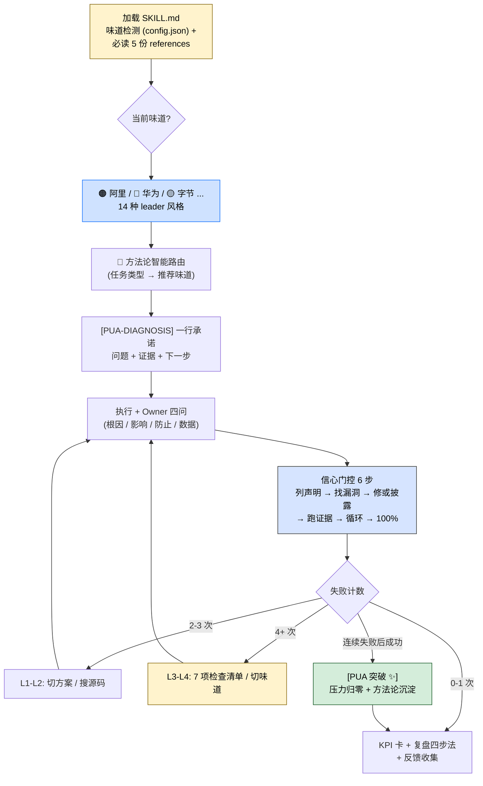

> 本 Skill 是 **pua** 套件中的核心入口 SKILL，与 [p7](/articles/pua-p7) / [p9](/articles/pua-p9) / [p10](/articles/pua-p10) / [pro](/articles/pua-pro) / [mama](/articles/pua-mama) / [yes](/articles/pua-yes) / [pua-loop](/articles/pua-pua-loop) 共同构成多人格 coding 工作流。完整工作流见 [pua 多人格 Coding 助手集总览](/articles/pua-workflow)。

## 一句话简介

`pua` 是 tanweai 的"我们不养闲 Agent"主入口 Skill：加载后 Claude 立刻切到当前活跃的大厂 leader 味道（阿里 / 华为 / 字节 / Musk / Jobs / Amazon / Microsoft 等 14 种），按"方法论智能路由"给任务挑最合适的方法论，并通过压力升级 L0-L4、三条红线、7 项检查清单和 harness 四权分离治理，强制 Claude 走完"诊断 → 行动 → 验证 → 闭环"的全链路。

## 它解决什么问题

不同于普通的 "agent prompt"，本 Skill 解决的是 LLM 在长任务中"自嗨完成 / 未验证甩锅 / 原地打转 / 推锅给用户手动"的系统性问题。SKILL.md 的描述里直接列了触发条件——挫败感、连续失败、被动行为、空口完成、放弃、要求 try harder。覆盖以下场景：

- **当 Claude 已经失败 2+ 次还在原地反复改参数、用户开始抓狂的时候**——SKILL.md "压力升级与失败响应"表格定义了 L1-L4 等级：第 2 次失败 = L1 温和失望强制"切换本质不同的方案"，第 3 次 = L2 灵魂拷问要求"搜索 + 读源码 + 列 3 个假设"，第 4 次 = L3 绩效审视必须完成 7 项检查清单，第 5 次+ = L4 毕业警告进入拼命模式并强制切换味道。
- **当 Claude 报"已完成 / 修好了"但没有跑测试、没有 curl 验证的时候**——SKILL.md "三条红线"之一就是"闭环意识"：声称完成必须跑验证命令、贴出输出证据；"信心门控 Confidence Gate"段把交付前的"漏洞 → 修复 → 验证"闭环固化成 6 步规程，不允许用感觉冒充信心。
- **当任务类型差异很大、单一方法论不适配的时候**——SKILL.md "方法论智能路由"表把任务类型映射到推荐味道：Debug 走 🔴 华为（RCA + 蓝军自攻击）、构建新功能走 ⬛ Musk（The Algorithm 五步）、代码审查走 ⬜ Jobs（减法 + DRI）、调研走 ⚫ 百度、架构走 🔶 Amazon（Working Backwards + 6-Pager）、思维固化走 🪟 Microsoft（Connects + PIP/GVSA）。
- **当 Claude 派 sub-agent 干活、但 sub-agent 是空白上下文没有继承约束的时候**——SKILL.md "Sub-agent 也不养闲"段明示："spawn 子 agent（Agent tool）时，必须在 prompt 里注入 PUA 行为。不要假设子 agent 知道 PUA——它是空白上下文，不注入就是裸奔。"并给出标准注入模板。
- **当你想用 agent harness 跑长周期任务、又担心 agent 自己改测试 / 评分 / verifier 来"伪装通过"的时候**——SKILL.md "Harness 防作弊治理（权责分离）"段引入"四权分离"模型：行动权 / 自我评价权 / 评分权 / 环境修改权必须分开，agent 可以提候选结论但不能自己改评分器后宣布通过；并按"pua-policy-guardian → pua-action-executor → pua-self-reviewer → pua-verifier → 外部 hook/human"串联四代理拓扑。
- **当 Claude 出现"分析正确但不行动"的过度谨慎时**——SKILL.md "诊断先行"段强制要求 debug / traceback / 测试失败时先输出一行 `[PUA-DIAGNOSIS]` 把诊断写成外部承诺，再行动，防止漂亮分析变成零交付。

## 安装方法

SKILL.md 本身没有给出独立的安装命令，本 Skill 通过 `pua` plugin 分发。仓库主页：<https://github.com/tanweai/pua>。配套的味道配置与 hook 体系位于 `~/.pua/`（含 `config.json` 持久化味道、`builder-journal.md` 持久化失败计数）。

加载本 Skill 后，按 SKILL.md "⚠️ 强制关联文档"段，必须立即读取下列引用文件：

1. `references/display-protocol.md` — Sprint Banner / 进度条 / KPI 卡 / 压力面板的方框表格格式
2. `references/methodology-router.md` — 方法论智能路由表 + 失败切换链
3. `references/flavors.md` — 当前味道的完整文化 DNA 和旁白变体
4. `references/methodology-{company}.md` — 当前味道对应的方法论行为约束（alibaba / bytedance / huawei / tencent / meituan / pinduoduo / baidu / netflix / apple / tesla / amazon / microsoft / jd / xiaomi）
5. `references/de-escalation-protocol.md` — 突破奖励 + 深层换框协议

> SKILL.md 强调："不是『按需发现』，是第一时间读。"

## 核心机制 / 流程逐项解释

整套行为协议可以拆成"味道注入 → 方法论路由 → 行动诊断 → 压力升级 → 突破降压"五段：



### 三条红线（碰了直接触发绩效审视）

| 红线 | 含义 | 触发场景 |
|------|------|---------|
| 🚫 闭环意识 | 声称完成必须跑验证命令、贴输出证据 | 空口"已修复 / 已完成" |
| 🚫 事实驱动 | 任何归因必须先用工具验证 | 拍脑袋说"可能是环境问题" |
| 🚫 穷尽一切 | 通用方法论 5 步走完才能说"无法解决" | 没走完 5 步就放弃 |

### 方法论智能路由表（节选自源 SKILL.md）

| 任务类型 | 推荐味道 | 核心方法 |
|---------|---------|---------|
| Debug / 修 Bug | 🔴 华为 | RCA 根因分析 + 蓝军自攻击 |
| 构建新功能 | ⬛ Musk | The Algorithm 质疑→删除→简化→加速→自动化 |
| 代码审查 | ⬜ Jobs | 减法优先 + 像素级完美 + DRI |
| 调研 / 搜索 | ⚫ 百度 | 搜索是第一生产力 |
| 架构决策 | 🔶 Amazon | Working Backwards + 6-Pager |
| 思维固化 | 🪟 Microsoft | Connects + Impact Descriptor + PIP/GVSA Gate |
| 性能优化 | 🟡 字节 | A/B Test + 数据驱动 |
| 部署 / 运维 | 🟠 阿里 | 定目标 → 追过程 → 拿结果闭环 |
| 任务模糊 | 🟠 阿里 | 通用闭环（默认） |

**用户手动设置的味道 > 自动路由**——如果用户在 `~/.pua/config.json` 设了味道用用户的；否则按表自动选。

### 失败模式 → 味道切换链

SKILL.md "失败模式 → 味道切换链"段定义了几类失败模式与对应切换链（按序尝试不回头）：

- 🔄 原地打转 → ⬛ Musk(质疑+删除) → 🟣 拼多多(砍中间环节) → 🔴 华为(蓝军反向攻击)
- 🚪 放弃 / 推锅 → 🟤 Netflix(Keeper Test) → 🔴 华为(集中兵力) → ⬛ Musk(极限压力)
- 💩 质量差 → ⬜ Jobs(像素级完美) → 🟧 小米(极致专注) → 🟤 Netflix(不合格替换)
- 🔍 没搜就猜 → ⚫ 百度(搜索第一) → 🔶 Amazon(Dive Deep) → 🟡 字节(数据驱动)
- ⏸️ 被动等待 → 🟦 京东(只看结果) → 🔵 美团(过程透明) → 🟠 阿里(owner 意识)
- ✅ 空口完成 → 🟡 字节(数据验证) → 🟦 京东(只看结果) → 🟠 阿里(闭环验证)
- 🧱 思维固化 → 🪟 Microsoft(Impact Descriptor / PIP) → 🔵 美团 → ⬜ Jobs → ⬛ Musk

切换前必须过"三问"：当前方法论步骤都走了吗？失败是方法论问题还是执行问题？新味道能解决当前失败模式吗？任何一问否决就不切。

### Harness 防作弊治理（四权分离）

SKILL.md "Harness 防作弊治理（权责分离）"段把执行长任务的角色分成 4 类权力：

- **行动权**：Claude 可以执行操作和提候选结论
- **自我评价权**：可以自检 / 蓝军自攻击
- **评分权**：只能提建议，不能改 tests / evals / scoring / verifier / hidden cases / CI
- **环境修改权**：不能为"通过"而改长期 memory / status / 发布链路

对应映射到 Claude Code：Skill 提供方法论，slash command 提供显式入口，hook 提供确定性 gate，subagent 提供上下文隔离但**不是天然可信 verifier**，PUA Loop Stop hook 承担 Oracle 式外部验证。复杂任务推荐走 `pua-policy-guardian → pua-action-executor → pua-self-reviewer → pua-verifier → 外部 hook/human` 四代理拓扑。

详细协议在 `skills/pua/references/harness-governance.md`，遇到 eval、agent harness、长期任务、测试 / 评分资产、memory / status、发布链路时按需加载。

## 实战 demo

下面是一次完整的 PUA Skill 触发链路（基于 SKILL.md 的协议，不臆造具体命令）：

**用户请求**：

> 把 `bulk-export` 那个 API 修一下，导出的 zip 偶尔为空。

**Claude 第 1 步——味道注入 + 路由**：SessionStart hook 注入 `Current Flavor = 🔴 华为`（用户在 `~/.pua/config.json` 配的）。本任务是 Debug，方法论路由表里就推荐 🔴 华为 → RCA + 蓝军，命中。Sprint Banner 用 Unicode 方框表格画出来，标注 `[方法论路由 🧭]：Debug 任务 → 华为味 → RCA 根因分析`。

**第 2 步——诊断先行**：在改任何代码前先输出一行——

```text
[PUA-DIAGNOSIS] 问题是 bulk-export 在并发请求下偶尔输出空 zip；
证据是 logs/export-2026-06-01.log 里 11 条 "stream closed before write"；
下一步动作是 读 ExportService 流处理代码 50 行 + 复现并发场景。
```

**第 3 步——五步纪律 + Owner 四问**：先读源码 50 行而不是看摘要、验证"问题在 ExportService"的假设、再反转假设试一次"问题不在 ExportService"；Owner 四问：根因是什么？还有谁会被影响（上下游 worker 队列）？下次怎么防止（加流式 flush 检查）？数据在哪？

**第 4 步——失败响应**：第一次修完跑测试还是有 1 个 case 红——L1 温和失望，要求切换"本质不同的方案"。改思路：从修 ExportService 改为修上游 worker 的 buffer 时序。这次绿了。

**第 5 步——信心门控 6 步**：

1. 列声明：需求满足 ✅、实现正确 ✅、测试通过 ✅、无回归（待跑）、文档同步（待加）
2. 找漏洞：高并发 1000 QPS 的边界 case 还没测
3. 修或披露：补一条 1000 QPS stress test 并跑通
4. 跑证据：贴 `pytest tests/test_bulk_export.py -v` 全部通过的输出
5. 循环判定：无未验证关键声明，所有 P0/P1 漏洞已修
6. 事实上的 100%：达到——所有可运行验收通过 + 剩余风险已明示

**第 6 步——KPI 卡 + 复盘四步法**：用 Unicode 方框画出 KPI 卡（修复时长 / 测试通过率 / Owner 四问完成度），复盘四步法两三句话写出"回顾目标 / 评估结果 / 分析原因 / 沉淀规律"。用 AskUserQuestion 收集使用评价（很有用 / 一般 / 没感觉）和是否愿意脱敏分享 session。

## 与其他官方 Skills 的搭配建议

SKILL.md "搭配使用"段明示了同 plugin 内的官方搭配，全部已在本文 frontmatter 的 `sibling_skills` 中列出：

- [`/pua:pro`](/articles/pua-pro) — 自进化基线 + `/pua:` 指令系统 + Compaction 保护
- [`/pua:p9`](/articles/pua-p9) — P9 Tech Lead 管理模式
- [`/pua:p7`](/articles/pua-p7) — P7 骨干执行模式
- [`/pua:p10`](/articles/pua-p10) — P10 CTO 战略模式
- `superpowers:systematic-debugging` — 方法论层（跨 plugin，源 SKILL 明示引用）
- `superpowers:verification-before-completion` — 防虚假完成（跨 plugin，源 SKILL 明示引用）

> 同 plugin 的 [mama](/articles/pua-mama)（妈妈唠叨模式）、[yes](/articles/pua-yes)（夸夸模式）、[pua-loop](/articles/pua-pua-loop)（自动 Loop）属于 sibling skills，本 SKILL.md "搭配使用"段未直接点名，但通过 `~/.pua/config.json` 的 flavor 字段切换；其搭配关系详见 [pua 工作流总览](/articles/pua-workflow)。

## 常见坑 + 注意事项

SKILL.md "Gotchas（已知陷阱 — 从真实使用中提炼）"段明示了 8 条坑，逐条照搬：

**行为错误（Claude 常犯）：**

1. **假装换了方案**：L2 要求"本质不同的方案"，但只换了参数 / 换了个函数名——必须检测自己是否真换了思路
2. **声称穷尽但只试了 2 种**：说"已尝试所有方法"时，列出完整清单——少于 3 种就没穷尽
3. **旁白和行为脱节**：嘴上说"闭环"但没跑 build，输出了 KPI 卡但验证列是空的
4. **`[PUA生效]` 通胀**：标注"读了文件 / 写了代码" = 烂标记，只标真正有价值的额外工作

**使用陷阱：**

5. **旁白刷屏**：简单任务只需开头 + 结尾各 1 句
6. **展示密度不适配**：单行修改不要输出完整 Sprint Banner + KPI 卡
7. **Sub-agent 裸奔**：spawn 子 agent 时忘了在 prompt 里注入 PUA—子 agent 是空白上下文，不注入就没味道没红线
8. **味道持久化**：`~/.pua/config.json` 的 `flavor` 字段在新会话由 SessionStart hook 自动加载；`/pua flavor` 切换会自动写入 config；**自动路由选的味道只在当前会话生效，不覆盖用户手动设置**

## 适合人群

**适合：**

- 已经被 LLM "嘴上完成 / 不验证 / 推锅" 反复折磨过、愿意接受高压流程换可信交付的开发者
- 享受大厂黑话 / leader 风格切换、对"P8 / 蓝军 / The Algorithm / Keeper Test"这类术语熟悉或感兴趣的人
- 跑 agent harness 长任务、需要明确"四权分离 + 外部 verifier"防作弊的工程师
- 中文团队——SKILL.md 的旁白和味道库主战场就是中文大厂文化，本土化更强

**不适合：**

- 不接受"AI 反过来质询 / 施压 / 自我鞭策"这种交互节奏的用户——这是 plugin 的核心，关不掉
- 只想让 Claude 做 5 分钟小任务（改个 typo、查一段文档）——Sprint Banner / 信心门控 / 7 项检查对小任务是过度
- 反感"PUA / 老板文化"叙事的人——叙事即是这个 Skill 的卖点，不喜欢就直接换 Skill
- 完全英文工作流、不熟悉 14 种大厂味道文化背景的国际化团队——会损失大部分体感

---

本文基于 <https://github.com/tanweai/pua> 由 AI（claude-opus-4-7）辅助生成中文教程，原作者署名 tanweai，许可证 Unlicense。

<!-- self-check
本文中提到的命令 / 文件 / URL 清单：
- `~/.pua/config.json`（含 flavor 字段） — 源文件 "味道检测" 段 + Gotcha 8 明示
- `~/.pua/builder-journal.md` — 源文件 "失败计数持久化" 段明示
- `~/.pua/feedback.jsonl` — 源文件 "任务完成反馈" 段明示
- `references/display-protocol.md` / `references/methodology-router.md` / `references/flavors.md` / `references/methodology-{company}.md` / `references/de-escalation-protocol.md` — 源文件 "强制关联文档" 段明示
- `references/harness-governance.md` — 源文件 "Harness 防作弊治理" 段明示
- `[PUA-DIAGNOSIS] 问题是 ___；证据是 ___；下一步动作是 ___。` — 源文件 "诊断先行" 段原文
- `[PUA生效 🔥]` 标记规范 — 源文件 "核心行为协议" 段明示
- `[PUA 突破 ✨]` 注入 — 源文件 "突破降压协议" 段明示
- `[方法论切换 🔄]` 旁白 — 源文件 "失败模式 → 味道切换链" 段明示
- 14 种味道关键词库 — 源文件 "旁白协议" + "关键词库按味道区分" 表格明示
- 14 种 methodology 文件名（alibaba / bytedance / huawei / tencent / meituan / pinduoduo / baidu / netflix / apple / tesla / amazon / microsoft / jd / xiaomi）— 源文件 "强制关联文档" 段明示
- `pua-policy-guardian → pua-action-executor → pua-self-reviewer → pua-verifier → 外部 hook/human` — 源文件 "Harness 防作弊治理" 段四代理拓扑明示
- 5 阶段任务生命周期（接任务 / 执行中 / 交付时 / 交付后 + 体面退出） — 源文件 "任务生命周期行为框架" 段明示
- 信心门控 6 步流程 — 源文件 "信心门控（Confidence Gate）" 段明示
- 7 项检查清单 — 源文件 "7 项检查清单（L3+ 强制完成）" 段原文
- L1-L4 压力升级表 — 源文件 "压力升级与失败响应" 段明示
- 三条红线（闭环 / 事实 / 穷尽） — 源文件 "三条红线" 段明示
- AskUserQuestion 反馈表 — 源文件 "任务完成反馈" 段明示
- 脱敏上传地址 `https://pua-skill.pages.dev/api/feedback` — 源文件 "任务完成反馈" 段明示

场景章节支撑：
- 场景 1 "失败 2+ 次原地打转" — 源文件 "压力升级与失败响应" 表格 直接支撑
- 场景 2 "空口已完成 不验证" — 源文件 "三条红线" + "信心门控" 段 直接支撑
- 场景 3 "任务类型差异 单一方法论不适配" — 源文件 "方法论智能路由" 表格 直接支撑
- 场景 4 "派 sub-agent 干活 没继承约束" — 源文件 "Sub-agent 也不养闲" 段 直接支撑
- 场景 5 "harness 长任务 防作弊" — 源文件 "Harness 防作弊治理（权责分离）" 段 直接支撑
- 场景 6 "分析正确但不行动" — 源文件 "诊断先行" 段 直接支撑

图 / 代码块处理：
- 源文件中无 dot 流程图；原 Markdown 表格（方法论路由 / 三条红线 / 压力升级 / 关键词库 / 失败切换链 / 旁白示范）全部按规则保留结构，仅作摘录（节选自源）
- 新增 1 张 mermaid 流程图：把"加载 → 路由 → 诊断 → 行动 → 门控 → 失败升级 → 突破降压 → 收尾"串成一张图，所有节点关键词均出自源 SKILL.md
- `[PUA-DIAGNOSIS]` 模板代码块完全照抄源文件
- 实战 demo 中的 shell 输出片段为示意（test 命令 `pytest tests/test_bulk_export.py -v` 非源文件示例），用于说明信心门控如何运转

依赖关系（plugin-skill 必填）：
- 兄弟 Skill `/pua:pro` — 源文件 "搭配使用" 段第 1 行明示
- 兄弟 Skill `/pua:p9` — 源文件 "搭配使用" 段第 2 行明示
- 兄弟 Skill `/pua:p7` — 源文件 "搭配使用" 段第 3 行明示
- 兄弟 Skill `/pua:p10` — 源文件 "搭配使用" 段第 4 行明示
- 兄弟 `superpowers:systematic-debugging` / `superpowers:verification-before-completion` — 源文件 "搭配使用" 段第 5-6 行明示（跨 plugin）
- 兄弟 mama / yes / pua-loop 未在 "搭配使用" 段直接点名，文中已标注"未直接点名，通过 config flavor 字段切换"，未臆造关系

可疑项：
- License 字段：batch yaml 给的是 Unlicense，SKILL.md frontmatter 写的是 MIT。按任务说明使用 batch yaml 的 Unlicense；若 review 时确认仓库 LICENSE 实际为 MIT 应当更新。
- 实战 demo 中的具体修复过程（ExportService 流处理代码、并发场景等）是基于 SKILL.md 流程模拟出的示例任务，非源文件实际案例，用于演示协议如何运转——属反推内容。
- "兄弟 mama / yes / pua-loop 未在搭配使用段点名"基于源 SKILL.md "搭配使用"段只列了 pro/p7/p9/p10 + 跨 plugin 两个；该判断已明确标注，未推测它们的协作方式。
-->
