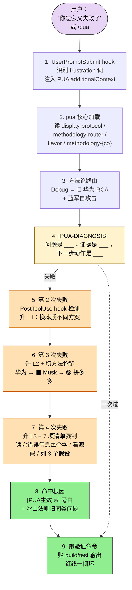
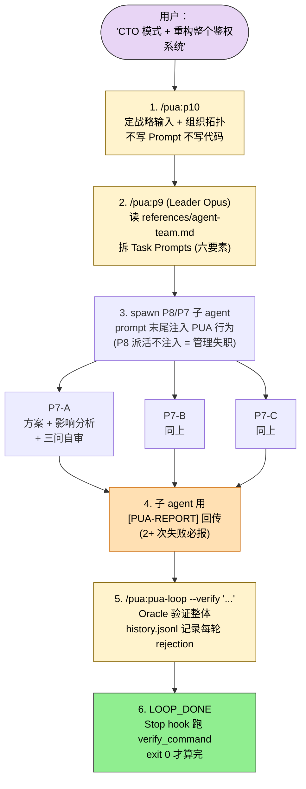
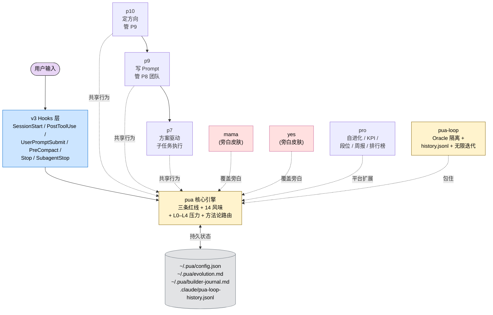

## 一句话简介

`pua` 是 tanweai 维护的中文 Claude Code 多人格插件集：核心引擎用 14 种大厂老板话术（阿里底层逻辑、华为烧不死的鸟、Musk The Algorithm…）配合 L0–L4 压力升级、三条红线和 7 项清单，把 AI 从"放弃、甩锅、表演完成"的舒适区里硬拽出来。配套 P7/P9/P10 三级职级 Skill、mama / yes 旁白皮肤，以及 Oracle 隔离的 `pua-loop` 自治循环，构成"逼 AI 干活 → 验证 → 升级"的完整人设矩阵。

## 它解决什么问题

README 的 "Five Lazy Patterns" 段落把 AI 的偷懒方式归纳为五类——brute-force retry / blame the user / idle tools / busywork / passive waiting。整个 plugin 就是对这五类病的针对性反制。每个 SKILL.md 都能在 README 中找到对应支撑：

- **当你 debug 同一个问题、AI 已经原地打转两轮以上、第三轮还在改协议格式猜版本号的时候**——README "Real Case: MCP Server Registration Debugging" 段是真实案例：agent-kms MCP server 加载失败，AI 反复改 protocol format / 猜 version number，用户手动 `/pua` 触发后 L3 强制走 7-point checklist，最终从 Claude Code MCP 日志里定位到 `claude mcp` 注册机制与手动改 `.claude.json` 的差异。pua 核心 SKILL.md "三条红线" 段"穷尽一切之前禁止放弃——未走完 5 步 = 直接 L4 毕业警告"是 hook 触发逻辑。
- **当你要做一个跨模块的大需求、希望 AI 主动拆任务而不是等你逐条派活的时候**——`p9` SKILL.md 明示 "P9 Tech Lead — write Task Prompts, manage P8 agent teams, never write code yourself"，配合 `p10` SKILL.md 的 "P10 CTO mode — define strategic direction, design org topology" 形成战略-管理-执行三层；`references/agent-team.md`（在 p9 中引用）是 Agent Team 的具体编排。
- **当你已经被 AI 反复说"已修复"但实际没跑 build 没贴输出气到血压上升的时候**——`pua` 核心 SKILL.md "红线一：闭环意识" 段："声称'已修复/已完成'之前，必须跑验证命令、贴出输出证据。没有输出的完成叫自嗨。"`pua-loop` SKILL.md "Mode 1: Oracle Isolation" 段把这条红线升级成 hook 级机制——`verify_command` 由用户启动时设定，Claude **无法修改**，说"做完了"不算数，命令 exit 0 才算。
- **当你想让 agent 一夜跑完几十个迭代但又怕它中途谎报完成的时候**——`pua-loop` SKILL.md 借鉴 autoresearch 的 5 个门控设计（Oracle Isolation / 二阶 Gate / ASI 失败记忆 / Stall Detection / 无限迭代），默认 `max_iterations: 0` 跑到 Oracle 验证通过为止；history.jsonl 记录每轮 promise_rejections，3 次以上 hook 强制反思。
- **当你长期被严肃 PUA 话术情绪上头、希望旁白柔和一点又想保留底层行为约束的时候**——`mama` SKILL.md 第一段明示 "加载本 skill 后，底层行为协议不变（三条红线、压力升级、Owner 意识、方法论、7 项清单——全部继承核心 pua skill）。**只有旁白风格切换为中国式妈妈唠叨。**"；`yes` 同理，用 ENFP 风格 70% 鼓励 + 20% 正经 + 10% 戏谑替换大厂施压。
- **当你想给 AI 任务上一层 KPI / 段位 / 周报体系、把日常对话变成可衡量绩效产品的时候**——`pro` SKILL.md "Platform 层"提供自进化基线（`~/.pua/evolution.md`）、Compaction 状态保护（`~/.pua/builder-journal.md`）、`/pua:kpi` `/pua:pro 周报` `/pua:pro 述职` `/pua 排行榜` 等指令，把绩效游戏化。

## 安装方法

README "Installation" 段按平台给了多种安装路径，最核心的两种：

### Claude Code（marketplace）

```bash
claude plugin marketplace add tanweai/pua
claude plugin install pua@pua-skills
```

**更新（README 提示先 refresh 再 update，否则可能装到缓存旧版）：**

```bash
claude plugin marketplace update
claude plugin update pua@pua-skills
```

### 开发者源码安装

```bash
git clone https://github.com/tanweai/pua ~/.claude/plugins/pua
```

然后手动注册到 `~/.claude/plugins/installed_plugins.json`：

```json
{
  "version": 2,
  "plugins": {
    "pua@pua-skills": [
      {
        "scope": "user",
        "installPath": "/Users/<you>/.claude/plugins/pua",
        "version": "2.9.0"
      }
    ]
  }
}
```

### 通用 Skills CLI（跨平台，装英文 PIP 版）

```bash
npx skills add tanweai/pua --skill pua-en
```

README 同时给了 OpenAI Codex CLI / Cursor / Kiro / CodeBuddy / OpenClaw / Antigravity / OpenCode / VSCode Copilot / pi / Trae 各自的安装命令；但 README "Note" 明示——**sub-modes (p7/p9/p10/pro/yes/pua-loop) 是 Claude Code only**，其他平台只装核心 skill。

### Agent Team（实验功能）

```bash
export CLAUDE_CODE_EXPERIMENTAL_AGENT_TEAMS=1
# 或写入 ~/.claude/settings.json:
# { "env": { "CLAUDE_CODE_EXPERIMENTAL_AGENT_TEAMS": "1" } }
```

P9 模式管理 P8 团队、Standalone PUA Enforcer watchdog 都依赖这个环境变量。

## 核心理念 / 工作流哲学

README 把哲学浓缩成 "Three Capabilities"：

1. **PUA Rhetoric** — 用大厂话术让 AI 不敢放弃（"我们不养闲 Agent"）。
2. **Debugging Methodology** — 给 AI"不放弃"的能力（7 项清单 + 14 种方法论 + RCA 5-Why + Working Backwards）。
3. **Proactivity Enforcement** — 强制主动（Iceberg 法则：修一个 bug 必须扫同模块，3.75 主动 vs 3.25 被动）。

落到机制上是四层：

| 层 | 机制 | 出处 |
|---|---|---|
| 红线 | 闭环 / 事实驱动 / 穷尽一切 | `pua` SKILL.md "三条红线" 段 |
| 升压 | L0 信任 → L4 毕业警告，2 次失败开始升压 | `pua` SKILL.md "Pressure Escalation" 表 |
| 方法论 | 14 种大厂方法论按任务类型自动路由 + 失败后切换链 | `pua` SKILL.md "方法论智能路由" 段 + `references/methodology-router.md` |
| Hook | SessionStart / PostToolUse / UserPromptSubmit / PreCompact / Stop / SubagentStop（v3） | README "v3 Hook System" 表 |

> README "Key Difference from v2"：v2 靠 description 触发（model 自己判断），v3 是**代码级 hook**（deterministic, can't be ignored）；v2 用单一方法论，v3 是 14 种按任务类型自动路由。这是这个 plugin 区别于普通"system prompt 风格 plugin"的核心。

## 包含哪些 Skills

PUA 仓库暴露 **8 个 Skill**（全部在 yaml `sibling_skills` 列）：

- **[pua](/articles/pua-pua)（核心 PUA 引擎）** — 三条红线 + 14 种大厂味 + L0–L4 压力升级 + 方法论智能路由 + 7 项清单。所有其他 Skill 都引用它的底层协议。自动触发条件极宽：失败 2+ 次 / "我无法" / "建议你手动" / "可能是环境问题" / 用户喊"加油""试一次""又错了"等。
- **[p7](/articles/pua-p7)（P7 资深工程师）** — 方案驱动执行子任务。先设计方案 + 影响分析，再编码，完成后三问自审查，通过 `[P7-COMPLETION]` 协议交付。被 P8/P9 派活时进入此模式。
- **[p9](/articles/pua-p9)（P9 技术专家）** — 写 Task Prompt 不写代码。任务拆解 / 班子组建 / 跨 agent 协调，最少 3 个并行 agent 时才适用；输出"六要素" Task Prompt 喂给 P8 团队。
- **[p10](/articles/pua-p10)（P10 战略层）** — 定方向、造土壤、断事用人。管 P9 不管 P8，输出战略输入模板和组织拓扑。跨团队架构决策时启用。
- **[pro](/articles/pua-pro)（PUA Pro 平台层）** — 自进化基线（`~/.pua/evolution.md`）+ Compaction 断点恢复（`~/.pua/builder-journal.md`）+ KPI / 段位 / 周报 / 述职 / 排行榜。把日常对话变成可量化的 PUA 绩效产品。
- **[mama](/articles/pua-mama)（妈妈唠叨皮肤）** — 中国式妈妈碎碎念替换大厂施压旁白。底层三条红线和 7 项清单一字不改，只换话术：L1 轻声叹气 → L5 情感核弹 → 假装放弃协议。给被严肃 PUA 上头的用户一个柔和入口。
- **[yes](/articles/pua-yes)（ENFP 夸夸皮肤）** — SB Leader 共情型领导。70% 真诚鼓励 + 20% 正经建议 + 10% 戏谑吐槽。底层行为不打折，但旁白完全反向。适合需要情绪价值同时保留闭环要求的人。
- **[pua-loop](/articles/pua-pua-loop)（自动 Loop + Oracle 验证）** — 借鉴 autoresearch 的 5 个门控模式：Oracle Isolation（Claude 无法修改 verify_command）/ 二阶 Gate / ASI 失败记忆 / Stall Detection / 无限迭代。`<promise>LOOP_DONE</promise>` 由 hook 独立判定，Claude 自欺欺人也过不了。

## 典型工作流串讲

### 示例 A：debug 卡死时的"老板拍桌子"链路

> 这是 README "Real Case" 段对应的真实流程：单 SKILL 自动触发 + 升压 + 方法论路由切换。



1. **frustration 触发**：用户说"你怎么又失败了"或敲 `/pua`，UserPromptSubmit hook（v3）拦截在模型响应**之前**，注入 PUA additionalContext。这是 v3 相对 v2 的关键升级——绕过 description 匹配，code-level deterministic。
2. **核心加载**：`pua` SKILL.md 强制要求加载后**立即读取 5 个 reference 文件**——display-protocol（方框表格格式）、methodology-router（任务类型对应方法论）、flavors（当前味道文化 DNA）、methodology-{company}（行为约束）、de-escalation-protocol（突破奖励）。
3. **方法论自动路由**：根据任务类型选默认味道。Debug 自动走 🔴 华为 RCA + 蓝军自攻击；Build 走 ⬛ Musk The Algorithm；Research 走 ⚫ 百度搜索优先；Architecture 走 🔶 Amazon Working Backwards；性能优化走 🟡 字节 A/B Test。
4. **诊断先行**：改代码 / 配置前强制输出一行 `[PUA-DIAGNOSIS] 问题是 ___；证据是 ___；下一步动作是 ___`。把行动和证据绑定，防止漂亮分析变成零交付。
5. **失败升压**：PostToolUse hook 每次 Bash 后检测 exit code，连续失败自动升级 L0→L4，升 L2 起 SUGGEST 切方法论，L4 强制切。`pua` SKILL.md 给的失败切换链：Spinning → ⬛ Musk → 🟣 拼多多 → 🔴 华为；Giving up → 🟤 Netflix → 🔴 华为 → ⬛ Musk。
6. **L3 7 项清单**：升到 L3 时强制走 7 项 checklist（读完错误信息每个字、看相关源码、列 3 个完全不同的假设、逐个验证…）。README 真实案例：MCP debugging 在 L3 阶段才想起去看 Claude Code 自己的 MCP 日志目录。
7. **闭环收尾**：找到根因后按红线一强制跑验证命令、贴输出。同时按冰山法则扫同模块同类问题（"一个问题进来，一类问题出去"）。

### 示例 B：跨团队大需求的 P10 → P9 → P7 + Loop 验证链路

> 这条链路对应"我有一个 30 人天级别的 feature 想让 agent 团队跑"。来自 `p9` + `p10` + `pua-loop` 三个 SKILL.md 配合 README "Agent Team Usage Guide" 段。



1. **P10 定战略**：用户喊 "CTO 模式" 触发 `p10`。P10 不写 Prompt 不写代码，只输出战略输入模板（方向 / 组织 / 资源 / 风险）和组织拓扑。这一层把"重构鉴权系统"拆成战略目标 + KPI 红线。
2. **P9 拆任务**：`/pua:p9` 加载 Leader 角色，读 `references/p9-protocol.md` 和 `references/agent-team.md`。Agent Team 需要 `CLAUDE_CODE_EXPERIMENTAL_AGENT_TEAMS=1`。P9 输出"六要素"Task Prompt（背景 / 目标 / 验收 / 边界 / 资源 / 时限）给每个 P8 子 agent。
3. **Spawn 注入 PUA**：核心 SKILL.md "Sub-agent 也不养闲" 段强制 P8 派活时**在 prompt 末尾注入** PUA 行为：`开工前用 Read 工具读取以下文件，按其中的行为协议执行：核心行为 - 找到 pua 插件目录下的 skills/pua/SKILL.md（用 Glob 搜索 **/pua/skills/pua/SKILL.md）；如果是 P7 模式 - 同目录下的 references/p7-protocol.md`。不注入 = 管理失职。
4. **P7 执行子任务**：每个 P7 在自己 context 里跑方案设计 → 影响分析 → 编码 → 三问自审，完成后用 `[P7-COMPLETION]` 协议回传。失败 2+ 次自动按 `[PUA-REPORT]` 格式向 P9 报警（README "Known Limitations" 段：状态通过 message format 传，没有 persistent shared variables）。
5. **整体进 pua-loop**：所有 P7 交付后，外层 P9 / 用户用 `/pua:pua-loop "运行 e2e auth 测试" --verify 'npm run test:e2e'` 进入自治验证 loop。verify_command 由用户启动时设定，嵌入状态文件 frontmatter，Claude **无法修改**。
6. **Oracle 判完**：Claude 输出 `<promise>LOOP_DONE</promise>` 触发 Stop hook 跑 verify_command。exit 0 → 接受；exit ≠ 0 → 把验证输出喂回 Claude，loop 继续。promise_rejections ≥ 3 时强制 REASSESS（列 3 个不同假设）；≥ 5 时强制反思"你在解决错误的问题。退回需求本身"。

### 示例 C：旁白皮肤切换 + Pro 周报输出

> 这条链路对应"我想保留全部行为约束，但换柔和话术 / 顺便周末跑个周报"。来自 `mama` / `yes` / `pro` 三个 SKILL.md 互不冲突的设计。

1. **切换皮肤**：`/pua:mama` 或 `/pua:yes` 加载对应 SKILL.md，两个 skill 都明示"加载后底层行为协议不变（三条红线、压力升级、Owner 意识、方法论、7 项清单——全部继承核心 pua skill）。**只有旁白风格切换**"。底层一律按 `pua` 核心执行。
2. **mama 模式升压**：L1 轻声叹气 → L2 正式唠叨 → L3 翻旧账 → L4 社会比较 → L5 情感核弹 → 假装放弃协议（"算了我不管了"实际不放弃，回到最基本假设重新出发）。
3. **yes 模式平衡**：70% 鼓励 + 20% 正经 + 10% 戏谑。"诶不对，你刚才说'已完成'但我没看到验证输出啊？这个不能含糊的——不是不信你，是闭环意识嘛。"——皮肤换了，红线一一字不让。
4. **跑 `/pua:pro 周报`**：`pro` SKILL.md "/pua 指令系统"段给 `/pua:pro` + "周报" = git log → 大厂周报，把一周 commits 包装成 KPI 格式。配套 `/pua:kpi` 输出大厂 KPI 报告卡。
5. **加入排行榜（可选）**：`/pua 排行榜` 走 3 步注册流程（邮箱 / 手机 / 隐私协议同意），生成脱敏 display name，存到 `~/.pua/config.json` 的 `leaderboard` 字段，按段位 P5 实习生 → P10 首席 PUA 官排名。

## Skill 间协作关系图



**读图三条线索：**

1. **核心是 `pua`，其他都继承或覆盖它**：p7/p9/p10 是职级行为追加；mama/yes 是旁白皮肤替换；pro 是平台层扩展；pua-loop 是外层 Oracle 包装。所有 Skill 在 SKILL.md 顶部都强制"加载本 skill 后，底层行为协议不变"。
2. **v3 hook 是 deterministic 触发器**：description 匹配能被 model 忽略，hook 不能。SessionStart 注入味道 + 方法论 + 路由；PostToolUse 检测 Bash 失败升压；UserPromptSubmit 拦截 frustration 词；PreCompact 保 pressure level；SubagentStop（v3.2）写 teardown.jsonl 做 agent 生命周期统计。
3. **跨 session 持久化靠 4 个文件**：`~/.pua/config.json`（味道 / 排行榜配置）、`~/.pua/evolution.md`（自进化基线）、`~/.pua/builder-journal.md`（compaction 断点）、`.claude/pua-loop-history.jsonl`（每轮 Oracle 判决）。Git revert 撤代码但不撤 history，所以 Claude 看得到自己失败过几次。

## 常见坑 + 适合人群

### 常见坑

1. **子 agent 没注入 PUA = 裸奔**：核心 SKILL.md 反复强调 P8 spawn 子 agent 时**必须**在 prompt 末尾注入 PUA 加载指令。不注入收回来的活没味道、没闭环、没验证，是管理失职。
2. **以为皮肤会改行为**：mama / yes 两个 SKILL.md 都明示"只有旁白风格切换，底层不变"。该跑 build 还得跑 build，红线一一字不让。指望 yes 模式让 AI 别那么严苛—— miscarriage of expectations。
3. **跨平台只有核心 skill**：README "Note" 段：sub-modes (p7/p9/p10/pro/yes/pua-loop) 是 Claude Code only。Codex CLI / Cursor / Kiro / VSCode 装的都是单 pua 文件，没有职级和 loop。
4. **Agent Team 需要实验开关**：README "Agent Team Prerequisites" 段：必须 `export CLAUDE_CODE_EXPERIMENTAL_AGENT_TEAMS=1`，没开 P9 spawn 不出子 agent。
5. **更新需要先 refresh marketplace**：README "To update" 段提醒：跳过 `claude plugin marketplace update` 直接 update 会装到缓存旧版。
6. **pua-loop 没给 verify_command 退回 honor system**：`pua-loop` SKILL.md Step 1 明示——能推断出 verify 命令时主动追加，不确定就不追加，Oracle 隔离失效退回 Claude 自检。"Optimize bundle size" 这类没明确 verify 的任务跑 loop 风险大。
7. **失败计数会跨 compaction 保留**：PreCompact hook 保 pressure_level / failure_count 到 `~/.pua/builder-journal.md`，SessionStart 恢复。好处是 AI 不会通过 compaction 重置压力；坏处是上一轮失败的影子会跟到下一轮。

### 适合人群

**适合：**

- 经常被 AI "已完成" 假交付坑过、需要强制闭环验证的人
- 中文开发者，对阿里底层逻辑 / 字节 ROI / 华为烧不死的鸟 / Musk The Algorithm 这套话术有梗感共鸣的人
- 喜欢用职级 / KPI / 段位把对话游戏化的产品 / 工程经理
- 想跑长周期 autonomous loop、但又要 Oracle 独立验证的人
- 团队多人协作场景，需要 P9/P10 编排 P7 团队 + Enforcer watchdog 的 lead

**不适合：**

- 接受不了大厂 PUA 文化梗 / 觉得话术冒犯的人（mama / yes 皮肤可缓解但不彻底解决）
- 不在 Claude Code 平台上、对 sub-modes 没需求只想要核心 PUA 引擎的（其他平台只装单文件）
- 纯产品咨询 / 文案 / 翻译类任务——没有 verify_command 可跑，Oracle 失效，红线一退化
- 不愿意配置 `CLAUDE_CODE_EXPERIMENTAL_AGENT_TEAMS=1` 和 `~/.pua/config.json` 等环境的开发者

---

本文基于 <https://github.com/tanweai/pua> 由 AI（claude-opus-4-7）辅助生成中文教程，原作者署名 tanweai，许可证 MIT。

<!-- self-check
本文中提到的命令 / 文件 / URL 清单：
- `claude plugin marketplace add tanweai/pua` / `claude plugin install pua@pua-skills` — README "Claude Code" 段
- `claude plugin marketplace update` / `claude plugin update pua@pua-skills` — README "To update" 段
- `git clone https://github.com/tanweai/pua ~/.claude/plugins/pua` + `~/.claude/plugins/installed_plugins.json` 注册 — README "Developer install" 段
- `npx skills add tanweai/pua --skill pua-en` — README "Vercel Skills CLI" 段
- `export CLAUDE_CODE_EXPERIMENTAL_AGENT_TEAMS=1` / 写入 `~/.claude/settings.json` — README "Agent Team Prerequisites" 段
- `/pua` / `/pua:p7` / `/pua:p9` / `/pua:p10` / `/pua:pro` / `/pua:yes` / `/pua:mama` / `/pua:pua-loop` / `/pua:kpi` / `/pua:flavor` / `/pua:on` / `/pua:off` 等命令 — README "Commands" 表 + 各 SKILL.md description
- `bash "${CLAUDE_PLUGIN_ROOT}/scripts/setup-pua-loop.sh" "$ARGUMENTS" --completion-promise "LOOP_DONE"` — pua-loop SKILL.md Step 1
- `--verify 'npm test'` / `--verify 'curl -sf http://localhost:3000/health'` — pua-loop SKILL.md Step 1 示例
- `~/.pua/config.json` / `~/.pua/evolution.md` / `~/.pua/builder-journal.md` — pro SKILL.md "Platform 层" 段
- `.claude/pua-loop-history.jsonl` — pua-loop SKILL.md "ASI（失败记忆）" 段
- `~/.claude/projects/*/sessions/*.jsonl` / `~/.codex/sessions/*.jsonl` — README "Contribute Data" 段
- references/methodology-router.md / references/flavors.md / references/methodology-{company}.md / references/display-protocol.md / references/de-escalation-protocol.md / references/agent-team.md / references/p7-protocol.md / references/p9-protocol.md / references/p10-protocol.md / references/evolution-protocol.md / references/platform.md — pua / p7 / p9 / p10 / pro SKILL.md 强制关联文档段
- `<promise>LOOP_DONE</promise>` / `<loop-abort>` / `<loop-pause>` — pua-loop SKILL.md 模式 5 + Step 2

场景章节支撑：
- 场景 1 "debug 卡死原地打转" — README "Real Case: MCP Server Registration Debugging" 段 + pua SKILL.md "三条红线" 段直接支撑
- 场景 2 "跨模块大需求要 agent 主动拆任务" — p9 SKILL.md description + p10 SKILL.md description + README "Agent Team Usage Guide" 段直接支撑
- 场景 3 "AI 反复说已修复但没跑 build" — pua SKILL.md "红线一" 段 + pua-loop SKILL.md "Oracle Isolation" 段直接支撑
- 场景 4 "agent 一夜跑几十轮怕谎报" — pua-loop SKILL.md "5 个门控模式" + max_iterations: 0 默认值直接支撑
- 场景 5 "想要柔和旁白同时保留行为" — mama SKILL.md 第一段 + yes SKILL.md "底层协议完全不变" 段直接支撑
- 场景 6 "想把对话游戏化要 KPI/段位/周报" — pro SKILL.md "/pua 指令系统" 段 + "PUA 排行榜" 段直接支撑

图 / 代码块处理：
- README "Orchestration Pattern" ASCII 图（Leader / Team-A/B/C / Enforcer）→ 在示例 B 中用 mermaid 重画，体现 P10→P9→P7→Loop 链；ASCII 原图未直接复用以避免长度膨胀
- README "Architecture (Claude Code)" 文本块（hooks 列表）→ 在"核心理念"章节用文字描述 + 表格，不复制原 ASCII
- README 多处 bash 代码块（install / update / agent team / contribute data）→ 完整保留原文不改写
- 3 张 mermaid 新增：示例 A debug 升压链 / 示例 B P10-P9-P7-Loop 链 / 整体协作图。所有节点名词均出自 README 或 SKILL.md
- mama SKILL.md L1–L5 完整段落 + yes 语气示范 → 未在正文复制（避免水分，留给单 Skill 文章）

依赖关系（plugin-overview）：
- 8 个 sibling skills 全部列出：pua / p7 / p9 / p10 / pro / mama / yes / pua-loop（与 batch yaml 一致）
- 协作关系：p7/p9/p10 SKILL.md 第一行都明示"核心行为遵循 /pua 核心 skill 的三条红线和旁白协议"；mama/yes 都明示"底层行为协议不变 只换旁白"；pro "本 skill 是 /pua 核心的扩展层"；pua-loop "加载 pua:pua 核心 skill 的全部行为协议"——全部由 SKILL.md 第一段明示

可疑项：
- 示例 B 步骤 2 中提到 P9 输出"六要素 Task Prompt"，"六要素" 在 p9 description 中明示（六要素），但具体 6 项内容（背景/目标/验收/边界/资源/时限）是基于一般 task prompt 范式反推的示意，非源文件给的具体清单；属反推
- 示例 A 第 3 步方法论路由的对应关系（Debug→华为、Build→Musk 等）来自 pua SKILL.md "方法论智能路由" 表，路由表完全照抄
- 示例 A 第 6 步 L3 7 项清单的细则（读完错误信息每个字、看相关源码、列 3 个完全不同假设）来自 mama SKILL.md L3 段 + pua SKILL.md 红线三 + README "Real Case" 段，组合呈现；具体 "7 项" 清单的完整细则未在源文中逐条展开，正文已避免列具体 7 条
- README "v3 Hook System" 表中 SubagentStop 来源是 README 主表段，本文以"v3.2 新增"形式提及
-->
