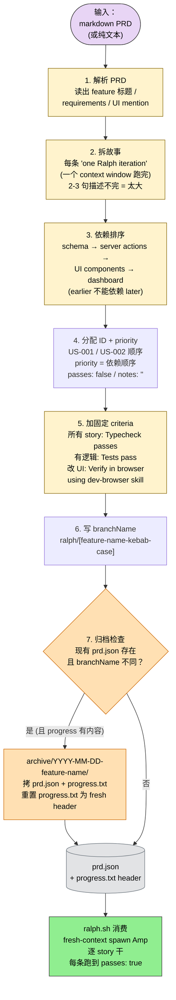
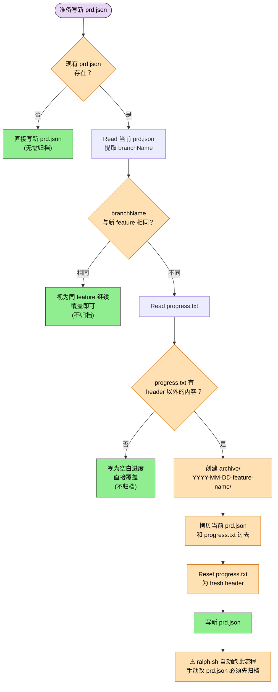

> 本 Skill 是 **ralph** 套件中的 PRD → JSON 转换 SKILL，与 [prd](/articles/ralph-prd) 共同构成 Ralph 自治 Agent 系统的前置工序。完整工作流见 [Ralph 工作流总览](/articles/ralph-workflow)。

## 一句话简介

`ralph-ralph` 是 snarktank Ralph 工作流的转换 Skill：吃一份 markdown PRD（或纯文本），按固定 schema 转成 `prd.json`，分配 `US-001` / `US-002` 等顺序 ID，按依赖关系排 priority，每条 user story 必含 `"Typecheck passes"`、UI 故事必含 `"Verify in browser using dev-browser skill"`，并在 branchName 切换时自动归档上一轮的 `prd.json` 和 `progress.txt` 到 `archive/YYYY-MM-DD-feature-name/`。**核心约束：每条 story 必须能在 ONE Ralph iteration（一个 context window）跑完**——否则 Amp / Claude Code 在 fresh context 里跑炸。

## 它解决什么问题

不同于普通的 "PRD → tasks" 转换，`ralph` 解决的是 LLM 自治 loop 系统**最容易翻车的三个点**：故事太大跑炸 context、故事顺序错依赖断链、验收标准模糊导致"假完成"。SKILL.md 把这三点列成了硬规则。覆盖以下场景：

- **当你已经有一份 markdown PRD、想直接喂给 Ralph 跑、但 PRD 的故事颗粒度还没适配 fresh-context 自治执行的时候**——SKILL.md "Story Size: The Number One Rule" 段加粗明示："Each story must be completable in ONE Ralph iteration (one context window). Ralph spawns a fresh Amp instance per iteration with no memory of previous work. If a story is too big, the LLM runs out of context before finishing and produces broken code."
- **当你写的 user stories 之间有依赖、但顺序乱了导致下游故事先跑（先跑 UI 后跑 schema）的时候**——SKILL.md "Story Ordering: Dependencies First" 段强制顺序：schema → server actions → UI → dashboard。给了正确 vs 错误对照例。
- **当你的 acceptance criteria 写得太虚（"works correctly" / "good UX"）、Ralph 没法 check 是否通过的时候**——SKILL.md "Acceptance Criteria: Must Be Verifiable" 段把 verifiable 与 vague 对照得很清楚：可验证的是"Add `status` column to tasks table with default 'pending'"、"Clicking delete shows confirmation dialog"；vague 的是"Works correctly"、"Good UX"、"Handles edge cases"。
- **当 feature 涉及 UI 改动、你担心 Ralph 在 headless 里说"做完了"实际没视觉验证的时候**——SKILL.md "For stories that change UI" 段强制："Verify in browser using dev-browser skill"——frontend stories are NOT complete until visually verified.
- **当你想在同一项目里跨 feature 切换、又怕新 `prd.json` 覆盖了上一个 feature 没完成的进度的时候**——SKILL.md "Archiving Previous Runs" 段明示：检测到 `branchName` 不同且 `progress.txt` 已有内容，自动归档到 `archive/YYYY-MM-DD-feature-name/`；`ralph.sh` 脚本会自动处理，手动改 `prd.json` 时则需手动归档。
- **当你拿到一个 PRD 写着"Add user notification system"这种大需求、不知道怎么拆的时候**——SKILL.md "Splitting Large PRDs" 段给了具体拆法示例："Add user notification system" → 6 个 US（schema → service → bell icon → dropdown panel → mark-as-read → preferences page）。

## 安装方法

SKILL.md 本身没有给出独立的安装命令，本 Skill 通过 `ralph` plugin 分发。仓库主页：<https://github.com/snarktank/ralph>。Ralph 整体安装方式（含 `ralph.sh`）参见 [Ralph 工作流总览](/articles/ralph-workflow) 的 Setup 段。

触发条件（来自 SKILL.md frontmatter 的 description）：

| 触发短语 | 场景 |
|---------|------|
| `convert this prd` | 把现有 PRD 转 JSON |
| `turn this into ralph format` | 适配 Ralph 格式 |
| `create prd.json from this` | 从 markdown 生成 JSON |
| `ralph json` | 显式要 Ralph JSON 格式 |

## 转换管道总览

整套 ralph Skill 把 markdown PRD 压成 `prd.json` 的链路如下——拆故事 → 依赖排序 → 加固定 criteria → 写 branchName → 归档检查 → 输出：



## 输出 Schema（核心）

SKILL.md "Output Format" 段原文照搬：

```json
{
  "project": "[Project Name]",
  "branchName": "ralph/[feature-name-kebab-case]",
  "description": "[Feature description from PRD title/intro]",
  "userStories": [
    {
      "id": "US-001",
      "title": "[Story title]",
      "description": "As a [user], I want [feature] so that [benefit]",
      "acceptanceCriteria": [
        "Criterion 1",
        "Criterion 2",
        "Typecheck passes"
      ],
      "priority": 1,
      "passes": false,
      "notes": ""
    }
  ]
}
```

## 核心规则逐项解释

### 规则 1: Story Size — The Number One Rule

**每条 story 必须能在 ONE Ralph iteration（一个 context window）跑完。**

| Right-sized（可一轮完成） | Too big（必须拆） |
|--------------------------|------------------|
| Add a database column and migration | "Build the entire dashboard" → 拆成 schema / queries / UI / filters |
| Add a UI component to an existing page | "Add authentication" → 拆成 schema / middleware / login UI / session |
| Update a server action with new logic | "Refactor the API" → 一个 endpoint 一个 story |
| Add a filter dropdown to a list | — |

**Rule of thumb**：If you cannot describe the change in 2-3 sentences, it is too big.

### 规则 2: Story Ordering — Dependencies First

故事按 priority 顺序执行，**earlier stories 不能依赖 later stories**。

✅ **Correct order**：
1. Schema / database changes (migrations)
2. Server actions / backend logic
3. UI components that use the backend
4. Dashboard / summary views

❌ **Wrong order**：
1. UI component (依赖还不存在的 schema)
2. Schema change

### 规则 3: Acceptance Criteria 必须可验证

| Good（verifiable） | Bad（vague） |
|-------------------|-------------|
| "Add `status` column to tasks table with default 'pending'" | "Works correctly" |
| "Filter dropdown has options: All, Active, Completed" | "User can do X easily" |
| "Clicking delete shows confirmation dialog" | "Good UX" |
| "Typecheck passes" | "Handles edge cases" |
| "Tests pass" | — |

**必含的固定 criteria**：

| 类型 | 必含 |
|------|------|
| 任何 story | `"Typecheck passes"` |
| 有可测试逻辑 | `"Tests pass"` |
| 改动 UI | `"Verify in browser using dev-browser skill"` |

> Frontend stories are NOT complete until visually verified. Ralph 会用 `dev-browser` skill 真打开页面 / 操作 UI / 确认改动生效。

### 规则 4: Conversion Rules（6 条）

SKILL.md "Conversion Rules" 段原文：

1. **Each user story becomes one JSON entry**
2. **IDs**: Sequential (US-001, US-002, etc.)
3. **Priority**: Based on dependency order, then document order
4. **All stories**: `passes: false` and empty `notes`
5. **branchName**: Derive from feature name, kebab-case, prefixed with `ralph/`
6. **Always add**: "Typecheck passes" to every story's acceptance criteria

### 规则 5: Archiving Previous Runs

写新 `prd.json` 之前，检查现有 `prd.json` 是否来自不同 feature。决策树如下：



> SKILL.md 明示："The ralph.sh script handles this automatically when you run it, but if you are manually updating prd.json between runs, archive first."

### 保存前 Checklist（7 条）

```text
- [ ] Previous run archived (如 prd.json 存在且 branchName 不同，先归档)
- [ ] Each story is completable in one iteration (small enough)
- [ ] Stories are ordered by dependency (schema → backend → UI)
- [ ] Every story has "Typecheck passes" as criterion
- [ ] UI stories have "Verify in browser using dev-browser skill" as criterion
- [ ] Acceptance criteria are verifiable (not vague)
- [ ] No story depends on a later story
```

## 实战 demo

下面用 SKILL.md "Example" 段的原文（精简）演示完整转换。

**输入 PRD**：

```markdown
# Task Status Feature

Add ability to mark tasks with different statuses.

## Requirements
- Toggle between pending/in-progress/done on task list
- Filter list by status
- Show status badge on each task
- Persist status in database
```

**Claude 的转换思路**：

1. **拆故事**：4 个独立可验证的小动作 → 4 个 user stories
2. **排顺序**：schema（US-001）→ UI badge（US-002，依赖 schema）→ 交互 toggle（US-003，依赖 schema + UI）→ filter（US-004，依赖前三个）
3. **加固定 criteria**：所有 story 加 `Typecheck passes`；UI story 加 `Verify in browser using dev-browser skill`
4. **写 branchName**：`ralph/task-status`

**输出 `prd.json`**：

```json
{
  "project": "TaskApp",
  "branchName": "ralph/task-status",
  "description": "Task Status Feature - Track task progress with status indicators",
  "userStories": [
    {
      "id": "US-001",
      "title": "Add status field to tasks table",
      "description": "As a developer, I need to store task status in the database.",
      "acceptanceCriteria": [
        "Add status column: 'pending' | 'in_progress' | 'done' (default 'pending')",
        "Generate and run migration successfully",
        "Typecheck passes"
      ],
      "priority": 1,
      "passes": false,
      "notes": ""
    },
    {
      "id": "US-002",
      "title": "Display status badge on task cards",
      "description": "As a user, I want to see task status at a glance.",
      "acceptanceCriteria": [
        "Each task card shows colored status badge",
        "Badge colors: gray=pending, blue=in_progress, green=done",
        "Typecheck passes",
        "Verify in browser using dev-browser skill"
      ],
      "priority": 2,
      "passes": false,
      "notes": ""
    },
    {
      "id": "US-003",
      "title": "Add status toggle to task list rows",
      "description": "As a user, I want to change task status directly from the list.",
      "acceptanceCriteria": [
        "Each row has status dropdown or toggle",
        "Changing status saves immediately",
        "UI updates without page refresh",
        "Typecheck passes",
        "Verify in browser using dev-browser skill"
      ],
      "priority": 3,
      "passes": false,
      "notes": ""
    },
    {
      "id": "US-004",
      "title": "Filter tasks by status",
      "description": "As a user, I want to filter the list to see only certain statuses.",
      "acceptanceCriteria": [
        "Filter dropdown: All | Pending | In Progress | Done",
        "Filter persists in URL params",
        "Typecheck passes",
        "Verify in browser using dev-browser skill"
      ],
      "priority": 4,
      "passes": false,
      "notes": ""
    }
  ]
}
```

把这份 JSON 交给 `ralph.sh`，Ralph 会按 priority 顺序 fresh-context spawn 4 个 Agent 实例逐条干，每条都跑 typecheck（UI 故事再加 dev-browser 验证），直到 4 条全部 `passes: true`。

## 与其他官方 Skills 的搭配建议

SKILL.md 通过 plugin 设计意图明示了上游和外部依赖：

- [`prd`](/articles/ralph-prd) — sibling Skill，**上游**：先用 prd Skill 起草 markdown PRD，再用本 Skill 转 JSON。两者的 user story 颗粒度约束在同一语义（"one focused session" / "one Ralph iteration"）上对齐。
- `ralph.sh` 脚本 — **下游**：本 Skill 产出的 `prd.json` 由 `ralph.sh` 消费，跑 fresh-context 自治 loop。SKILL.md "Archiving" 段明示 ralph.sh 自动处理归档。
- `dev-browser` skill — UI story acceptance criteria 直接引用："Verify in browser using dev-browser skill"。本 SKILL.md 不提供 dev-browser，仅在验收标准中显式调用。

> Ralph plugin 仅含 prd / ralph 两个 Skill，sibling 关系简单清晰。完整流转见 [Ralph 工作流总览](/articles/ralph-workflow)。跨 plugin 搭配在 SKILL.md 未提，遵循 v3 规则不臆造。

## 常见坑 + 注意事项

下列 7 条整合自 SKILL.md 各段强约束（无独立 "Gotchas" 段）：

1. **故事拆不够小 = Ralph 跑炸**——SKILL.md "Story Size" 加粗规则：fresh Amp instance 没有上一轮的 memory，故事大于一个 context window 等于直接挂。**Rule of thumb**：2-3 句描述不完 = 太大。
2. **故事顺序错 = 依赖断链**——SKILL.md "Story Ordering" 段：先写 UI 再写 schema 会导致 UI 故事运行时找不到 column。永远 schema → backend → UI → dashboard。
3. **acceptance criteria 写废话 = "假完成"**——"Works correctly" / "Good UX" / "Handles edge cases" 都是 SKILL.md 列为反例的写法，Ralph 无法 check。
4. **忘加 `"Typecheck passes"` = 类型不安全的代码也算 pass**——SKILL.md "Conversion Rules" 第 6 条 "Always add" 是硬约束，每条 story 都必须有。
5. **UI 故事忘加 dev-browser 验证 = 视觉问题不会被发现**——Ralph 自己跑测试不会看 UI 渲染，frontend stories 不视觉验证不算完成。
6. **跨 feature 切换不归档 = 上一次进度被覆盖**——SKILL.md "Archiving" 段：手动改 prd.json 时务必先归档；只有跑 `ralph.sh` 时才自动归档。
7. **`passes` 字段不要初始化成 `true`**——SKILL.md "Conversion Rules" 第 4 条：所有新故事 `passes: false` 且 `notes: ""`，否则 Ralph 会跳过未实现的故事。

## 适合人群

**适合：**

- 已经有一份 markdown PRD、准备用 Ralph 自治 loop 跑完整 feature 的开发者
- 习惯用 [prd Skill](/articles/ralph-prd) 起草标准 PRD、希望平滑接到 Ralph 执行链路的人
- 跑 fresh-context Agent 系统（不只是 Ralph），需要把 PRD 切到 "one context window per story" 颗粒度的工程师
- 团队里有多个 feature 并行、需要 `branchName` 隔离 + 自动归档的项目

**不适合：**

- 没准备好用 Ralph 或类似自治 loop 的项目——这套 schema 的颗粒度约束完全为 Ralph 设计，普通团队场景可能太碎
- 故事之间强耦合、必须共享 context 才能完成的 feature（如复杂状态机 / 多文件同步重构）——fresh-context 模型不适合
- PRD 还在频繁变更的探索期项目——转完 JSON 后变更需要重新归档 + 重写
- 想用 Ralph 跑非编码任务（设计 / 文案）——`"Typecheck passes"` / `dev-browser` 这套验收标准不适用

---

本文基于 <https://github.com/snarktank/ralph> 由 AI（claude-opus-4-7）辅助生成中文教程，原作者署名 snarktank，许可证 MIT。

<!-- self-check
本文中提到的命令 / 文件 / URL 清单：
- `prd.json` schema（project / branchName / description / userStories / id / title / description / acceptanceCriteria / priority / passes / notes） — 源 SKILL.md "Output Format" 段原文
- `progress.txt` — 源 SKILL.md "Archiving Previous Runs" 段明示
- `archive/YYYY-MM-DD-feature-name/` — 源 SKILL.md "Archiving Previous Runs" 段明示
- `ralph.sh` 脚本 — 源 SKILL.md "Archiving Previous Runs" 段明示
- `branchName` 前缀 `ralph/` — 源 SKILL.md "Conversion Rules" 第 5 条明示
- `"Typecheck passes"` / `"Tests pass"` / `"Verify in browser using dev-browser skill"` — 源 SKILL.md "Acceptance Criteria" 段明示
- US-001 / US-002 顺序 ID — 源 SKILL.md "Conversion Rules" 第 2 条 + Example 明示
- 6 条 Conversion Rules — 源 SKILL.md "Conversion Rules" 段原文
- 7 条 Checklist — 源 SKILL.md "Checklist Before Saving" 段原文
- 4 个触发短语（convert this prd / turn this into ralph format / create prd.json from this / ralph json） — 源 SKILL.md frontmatter description 明示

场景章节支撑：
- 场景 1 "PRD 颗粒度未适配 fresh-context 自治执行" — 源 SKILL.md "Story Size: The Number One Rule" 段 直接支撑
- 场景 2 "故事顺序乱依赖断链" — 源 SKILL.md "Story Ordering: Dependencies First" 段 直接支撑
- 场景 3 "acceptance criteria 太虚 Ralph 无法 check" — 源 SKILL.md "Acceptance Criteria: Must Be Verifiable" 段 直接支撑
- 场景 4 "UI 故事 headless 无法视觉验证" — 源 SKILL.md "For stories that change UI" 段 直接支撑
- 场景 5 "跨 feature 切换覆盖上一轮进度" — 源 SKILL.md "Archiving Previous Runs" 段 直接支撑
- 场景 6 "大需求不知道怎么拆" — 源 SKILL.md "Splitting Large PRDs" 段 + "Notification system" 拆分示例 直接支撑

图 / 代码块处理：
- 源 SKILL.md Output Format 的 JSON schema 按 "JSON/YAML/shell 禁止改写" 规则原文保留
- Example 段的输入 markdown PRD + 输出 prd.json 完整保留（实战 demo 直接使用源文件原例，仅加了中文转换思路注解）
- 4 个表格（触发短语 / Story Size 对照 / Acceptance Criteria 对照 / 必含 criteria 对照） 按 v3 规则保留结构，所有字段均出自源 SKILL.md "Story Size" / "Acceptance Criteria" 段
- 无 dot 流程图、无目录树

依赖关系（plugin-skill 必填）：
- 兄弟 Skill `prd` — 源 SKILL.md 通过 plugin 整体结构和"一个 Ralph iteration = 一个 session"语义对齐间接关联，文中已明确这是 "plugin 设计意图" 而非 "Integration" 段明示
- 跨 skill `dev-browser` — 源 SKILL.md "For stories that change UI" 段直接引用其名字 "Verify in browser using dev-browser skill"

可疑项：
- 源 SKILL.md 没有显式 "Integration" / "Related Skills" 章节，搭配建议是基于 plugin 整体结构（仅含 prd + ralph 两个 Skill）+ Archiving 段对 ralph.sh 的引用 + Acceptance Criteria 段对 dev-browser 的直接引用反推。
- License 字段：batch yaml 和 SKILL.md frontmatter 均一致为 MIT，无冲突。
- 已检查全文所有编号列表 / 'first X then Y' / 'phase 1→2→3' 表达，均已转 mermaid 或保留源 ASCII 图（转换管道总览 + Archiving 决策树均已补 mermaid；段内对照表保留方便对照）
-->
