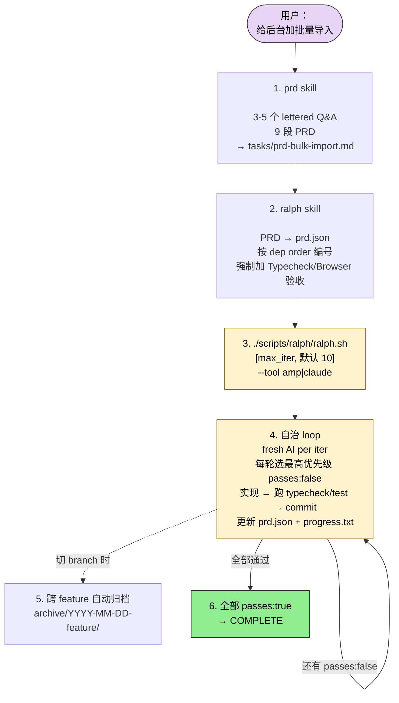
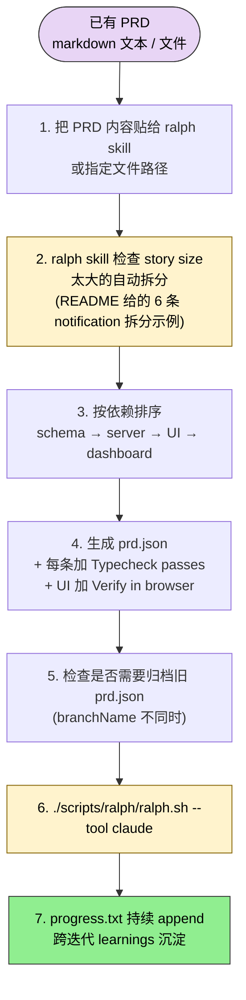
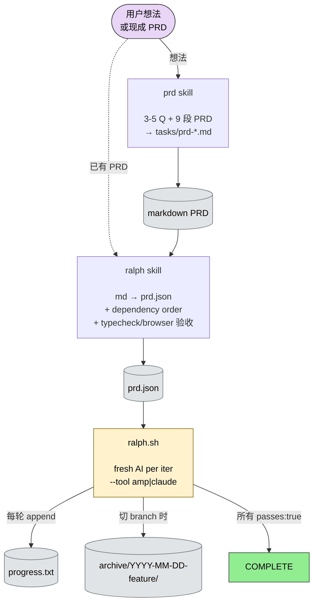

## 一句话简介

`ralph` 是 snarktank 维护的自治 AI Agent loop 系统：一边吃 PRD，一边在 fresh context 里反复 spawn 新的 AI 实例（Amp 或 Claude Code），逐条挑出 `passes: false` 的 user story 实现、跑 typecheck/test、commit、回写 `prd.json`，直到所有故事都通过才停。配套两个 Skill `prd`（起草 PRD）和 `ralph`（PRD → prd.json）作为前置工序，构成"想法 → PRD → JSON → 自治执行"的完整链路。

## 它解决什么问题

不同于"一次性指令 + 等结果"的 agent 模式，Ralph 解决的是 LLM 在长任务里"context 用完就崩 / 改完忘记自己改过什么 / 改完一处忘记同模块还有同类"的系统性问题。README 与配套 SKILL.md 覆盖了几个典型痛点：

- **当你有一个 feature 想完整交付、但单次 context window 装不下整套实现的时候**——README "Each Iteration = Fresh Context" 段明示："Each iteration spawns a **new AI instance** (Amp or Claude Code) with clean context."只有 git history、`progress.txt`、`prd.json` 三样东西作为跨迭代记忆，任何 LLM 都不会因为 context 涨满而崩。
- **当你已经有一份 markdown PRD 想直接灌进 agent 自动跑、但 PRD 的颗粒度还不适合自治执行的时候**——`ralph` SKILL.md "Story Size: The Number One Rule" 段明示："Each story must be completable in ONE Ralph iteration (one context window)."并给出右尺寸 vs 太大尺寸的对照清单（"加一个 DB column 和 migration" ✅；"Build the entire dashboard" ❌）。
- **当你想从零起一个新 feature、但没耐心手写 user stories + 验收标准的时候**——`prd` SKILL.md 强制走"3-5 个 lettered clarifying questions → 9 段标准 PRD（Introduction / Goals / User Stories / Functional Requirements / Non-Goals / Design / Technical / Success Metrics / Open Questions）→ 存 `tasks/prd-[feature-name].md`"的固定流程。
- **当你想让 agent 实现 UI 改动、但担心它说"做完了"实际却跑不起来的时候**——`prd` 和 `ralph` 两个 SKILL.md 都强制要求"For any story with UI changes: Always include 'Verify in browser using dev-browser skill' as acceptance criteria"，frontend stories 不视觉验证不算完成。
- **当你想跑一个跨 feature 切换的长项目、又怕 PRD 和 progress 互相覆盖的时候**——README "Archiving" 段：Ralph 在检测到不同 `branchName` 时自动归档到 `archive/YYYY-MM-DD-feature-name/`；`ralph` SKILL.md "Archiving Previous Runs" 段也给了手动归档的标准动作。

## 安装方法

README 给了 3 种官方安装路径（按 README "Setup" 段原文照搬）：

### 选项 1：复制到项目内

```bash
# From your project root
mkdir -p scripts/ralph
cp /path/to/ralph/ralph.sh scripts/ralph/

# Copy the prompt template for your AI tool of choice:
cp /path/to/ralph/prompt.md scripts/ralph/prompt.md    # For Amp
# OR
cp /path/to/ralph/CLAUDE.md scripts/ralph/CLAUDE.md    # For Claude Code

chmod +x scripts/ralph/ralph.sh
```

### 选项 2：把两个 Skill 装到全局（Amp / Claude Code）

```bash
# For AMP
cp -r skills/prd ~/.config/amp/skills/
cp -r skills/ralph ~/.config/amp/skills/

# For Claude Code (manual)
cp -r skills/prd ~/.claude/skills/
cp -r skills/ralph ~/.claude/skills/
```

### 选项 3：通过 Claude Code marketplace 安装

```bash
/plugin marketplace add snarktank/ralph
/plugin install ralph-skills@ralph-marketplace
```

安装后可用：

- `/prd` — Generate Product Requirements Documents
- `/ralph` — Convert PRDs to prd.json format

### 环境依赖（README "Prerequisites"）

- 任一 AI coding tool：[Amp CLI](https://ampcode.com)（默认） 或 [Claude Code](https://docs.anthropic.com/en/docs/claude-code)（`npm install -g @anthropic-ai/claude-code`）
- `jq` 已安装（`brew install jq` on macOS）
- 一个 git 仓库

### 可选：Amp 自动 handoff

```json
{
  "amp.experimental.autoHandoff": { "context": 90 }
}
```

写入 `~/.config/amp/settings.json`，当 context 填满 90% 时自动 handoff，让 Ralph 能处理超出单 context window 的大故事。

## 核心理念 / 工作流哲学

README "Critical Concepts" 段把 Ralph 的设计哲学浓缩为 5 条：

1. **每次迭代 = Fresh Context** — 每次 spawn 全新 AI 实例，唯一跨迭代记忆是 git history、`progress.txt`、`prd.json`。这是 Ralph 能跑很长很长任务的根本。
2. **Small Tasks** — 每条 PRD item 必须小到能在一个 context window 里跑完；太大 LLM 会跑到一半 context 耗尽产烂代码。`ralph` SKILL.md 的 rule of thumb："If you cannot describe the change in 2-3 sentences, it is too big."
3. **AGENTS.md 更新很关键** — 每次迭代后 Ralph 会更新相关 `AGENTS.md`，记录发现的 pattern、gotcha、context，未来迭代和未来人类开发者都能直接读到。
4. **Feedback Loops** — 只有 typecheck、test、CI 都能给信号，Ralph 才能跑下去；broken code 会跨迭代累积放大。
5. **Browser Verification for UI Stories** — frontend stories 必须包含 "Verify in browser using dev-browser skill" 作为验收，Ralph 会用 dev-browser skill 导航页面、交互、确认改动。

跨迭代的"停"条件极简：当所有 stories 的 `passes: true` 时，Ralph 输出 `<promise>COMPLETE</promise>` 并退出 loop。

> 灵感来源：[Geoffrey Huntley 的 Ralph pattern](https://ghuntley.com/ralph/)（README 第 1 行明示）。

## 包含哪些 Skills

Ralph 仓库只暴露 **2 个独立 Skill**（不含 ralph.sh 本身——那是 bash 循环不是 Skill）：

- **[prd](/articles/ralph-prd)（PRD 起草助手）** — 接到 feature 描述后问 3-5 个 lettered clarifying questions（A/B/C/D 选项），然后生成 9 段标准 PRD（Introduction / Goals / User Stories / Functional Requirements / Non-Goals / Design / Technical / Success Metrics / Open Questions）存到 `tasks/prd-[feature-name].md`。Trigger 词：`create a prd` / `write prd for` / `plan this feature` / `requirements for` / `spec out`。SKILL.md 强调："Do NOT start implementing. Just create the PRD."
- **[ralph](/articles/ralph-ralph)（PRD 转 Ralph JSON）** — 把已有 markdown PRD 转成 `prd.json`，按 dependency order 编号 user stories（schema 类排前面、UI 类排后面），每条强制加 "Typecheck passes"，UI 类强制加 "Verify in browser using dev-browser skill"，所有 story 初始 `passes: false`。Trigger 词：`convert this prd` / `turn this into ralph format` / `create prd.json from this` / `ralph json`。

> Ralph 仓库本身 sibling skills 字段只有 `prd` 和 `ralph` 两个，没有更多兄弟 Skill（README "Key Files" 段确认仓库结构里只有这两个 Skill 目录）。

## 典型工作流串讲

### 示例 A：从一个 feature 想法到全部 user stories 自动实现

> 这是 README "Workflow" 段第 1-3 步明示的主链路：先 `/prd` 起 PRD → `/ralph` 转 prd.json → `ralph.sh` 跑 loop 直到 COMPLETE。



1. **`/prd` 起 PRD**：用户说"我想给后台加批量导入"。`prd` SKILL.md 强制问 3-5 个 lettered Q：A 是导入 CSV、B 是导入 Excel、C 是导入 JSON、D 是其他；目标用户是 A 管理员 / B 全员 / C 仅特定角色；scope 是 A MVP / B 全功能 / C 仅后端 API。用户回答 "1A, 2A, 3A" 后输出 9 段标准 PRD 到 `tasks/prd-bulk-import.md`。
2. **`/ralph` 转 JSON**：读 `tasks/prd-bulk-import.md`，按 dependency order 排出 US-001（schema/migration）→ US-002（server action）→ US-003（UI 表单）→ US-004（结果列表）。每条加 `"Typecheck passes"`；UI 类（US-003、US-004）再加 `"Verify in browser using dev-browser skill"`；所有 `passes: false`；`branchName: ralph/bulk-import`。
3. **跑 `ralph.sh`**：

   ```bash
   # Using Amp (default)
   ./scripts/ralph/ralph.sh 10
   # Using Claude Code
   ./scripts/ralph/ralph.sh --tool claude 10
   ```

4. **自治 loop**：Ralph 按 README "Run Ralph" 段的 7 步循环：①创建 feature branch（从 PRD `branchName`） ②挑最高优先级 `passes: false` ③实现该 story ④跑 typecheck/test ⑤通过则 commit ⑥更新 `prd.json` 把这条标为 `passes: true` ⑦把 learnings append 到 `progress.txt`。fresh context per iter，对 LLM 是干净开始；UI story 自动用 dev-browser 验证。
5. **归档（自动）**：下次跑不同 feature 时 ralph.sh 自动归档当前 `prd.json` + `progress.txt` 到 `archive/YYYY-MM-DD-bulk-import/`。
6. **停止条件**：所有 stories `passes: true`，Ralph 输出 `<promise>COMPLETE</promise>` 并 exit loop。

### 示例 B：已经有外部 PRD，直接接入 Ralph 自治

> 这条链路对应"你已经在 Notion / Linear / Confluence 写好了 PRD，不想再重写一次"。README "Workflow" 第 2 步 + `ralph` SKILL.md 整篇支持这条路径。



1. **直接喂给 `/ralph`**：把已有 PRD markdown 内容粘贴给 ralph skill（或指定文件路径）。skill 不需要走 `/prd` 的 3-5 个 Q&A 流程，它的职责就是"PRD → prd.json"转换。
2. **故事大小自检**：ralph SKILL.md "Splitting Large PRDs" 段给了具体例子——"Add user notification system" → 拆成 6 条：US-001 notifications table、US-002 notification service、US-003 bell icon、US-004 dropdown panel、US-005 mark-as-read、US-006 preferences page。
3. **依赖排序**：ralph SKILL.md "Story Ordering" 段明示正确顺序：schema → server actions → UI components → dashboard/summary。错的顺序会让 UI story 依赖还不存在的 schema。
4. **生成 prd.json**：按标准格式输出，每条 story 都有 `id` / `title` / `description` / `acceptanceCriteria` / `priority` / `passes: false` / `notes: ""` 七个字段；`branchName: ralph/[feature-name-kebab-case]`。
5. **归档检查**：ralph SKILL.md "Archiving Previous Runs" 段：写新 prd.json 前先检查现存的——`branchName` 不同 + `progress.txt` 非空时，创建 `archive/YYYY-MM-DD-feature-name/`，把旧 `prd.json` + `progress.txt` 移过去，重置 `progress.txt`。`ralph.sh` 跑的时候会自动做，但手动改 prd.json 时要先归档。
6. **跑 ralph.sh**：同示例 A。
7. **跨迭代沉淀**：`progress.txt` 是 append-only learnings，跨迭代的"项目记忆"全靠它 + git history + `prd.json` 三件套。

## Skill 间协作关系图

Ralph 仓库的协作关系本身极简，全部由 README "Workflow" 段 + 两份 SKILL.md 明示：



**读图三条线索：**

1. **两条入口**：要么从想法走 `/prd → markdown PRD → /ralph → prd.json`；要么已有 PRD 直接喂 `/ralph` 跳过第一步。
2. **三个 artifact**：`prd.json`（任务清单）/ `progress.txt`（跨迭代记忆）/ `archive/`（跨 feature 隔离）。
3. **一个执行器**：`ralph.sh` 是唯一的 loop，本身不是 Skill，靠 `--tool amp|claude` 切换底层 AI。

## 常见坑 + 适合人群

### 常见坑

1. **Story 拆得不够小**：README + ralph SKILL.md 都强调 "Right-sized story" 必须能在一个 context window 跑完。"Build the entire dashboard" "Add authentication" "Refactor the API" 三类典型太大，都要拆。
2. **Story 依赖反了**：UI story 排在 schema 之前，Ralph 会卡在第一条 UI story 上反复失败——schema 还不存在。
3. **没有 feedback loop**：README "Feedback Loops" 段明示——typecheck / test / CI 任一坏掉，broken code 会跨迭代复合放大。Ralph 只在测试能给信号时才有效。
4. **UI story 忘记加 `Verify in browser`**：frontend stories 不视觉验证就不算完成，会被反复打回。
5. **不同 feature 之间没归档**：跨 feature 切换前一定要让 ralph.sh 自动归档（或手动归档），否则旧 `progress.txt` 会污染新 feature 的 learnings。
6. **prompt 模板没本地化**：README "Customizing the Prompt" 段建议把 `prompt.md`（Amp）或 `CLAUDE.md`（Claude Code）按项目改——加项目的 quality check 命令、codebase 约定、stack 特有 gotcha。

### 适合人群

**适合：**

- 已经在用 Amp 或 Claude Code、想把 feature 级开发交给 agent 自治跑的人
- 团队已有 typecheck + test + CI 基础设施，能给 Ralph 提供可靠 feedback loop 的项目
- 喜欢"PRD-driven"而不是"chat-driven"工作流的产品 / 工程师——所有需求先落到 markdown 再 JSON 再执行
- 想做 long-running autonomous tasks（README："Claude can work autonomously for a couple hours at a time" 类似场景）但又要 checkpoint 而非黑盒输出的开发者

**不适合：**

- 没有自动化测试 / typecheck 的项目——Ralph 没有 feedback loop 就跑不下去，会越改越烂
- 只想做 5 分钟原型脚本的快手——`prd` 的 3-5 个 Q&A + 9 段 PRD 是过度
- 不愿意接受 "fresh context per iter" 这种偶尔需要在 progress.txt / AGENTS.md 重复说明的开销
- 既不用 Amp 也不用 Claude Code 的人——README 明示这是底层 AI tool 二选一，其他工具未支持

---

本文基于 <https://github.com/snarktank/ralph> 由 AI（claude-opus-4-7）辅助生成中文教程，原作者署名 snarktank，许可证 MIT。

<!-- self-check
本文中提到的命令 / 文件 / URL 清单：
- `mkdir -p scripts/ralph` / `cp /path/to/ralph/ralph.sh scripts/ralph/` / `chmod +x scripts/ralph/ralph.sh` — README "Option 1: Copy to your project" 段原文
- `cp /path/to/ralph/prompt.md scripts/ralph/prompt.md` / `cp /path/to/ralph/CLAUDE.md scripts/ralph/CLAUDE.md` — README "Option 1" 段原文
- `cp -r skills/prd ~/.config/amp/skills/` / `cp -r skills/ralph ~/.config/amp/skills/` — README "Option 2 (Amp)" 段原文
- `cp -r skills/prd ~/.claude/skills/` / `cp -r skills/ralph ~/.claude/skills/` — README "Option 2 (Claude Code manual)" 段原文
- `/plugin marketplace add snarktank/ralph` / `/plugin install ralph-skills@ralph-marketplace` — README "Option 3" 段原文
- `/prd` / `/ralph` slash 命令 — README "Available skills after installation" 段明示
- `./scripts/ralph/ralph.sh [max_iterations]` / `./scripts/ralph/ralph.sh --tool claude [max_iterations]` — README "Run Ralph" 段原文
- `~/.config/amp/settings.json` 中的 `amp.experimental.autoHandoff.context: 90` — README "Configure Amp auto-handoff" 段原文
- `tasks/prd-[feature-name].md` 路径 — prd SKILL.md "Output" 段明示 + 仓库 prd 文件第 4/139 行
- `prd.json` / `prd.json.example` / `progress.txt` / `ralph.sh` / `prompt.md` / `CLAUDE.md` / `skills/prd/` / `skills/ralph/` / `.claude-plugin/` / `flowchart/` — README "Key Files" 表格
- `archive/YYYY-MM-DD-feature-name/` — README "Archiving" 段 + ralph SKILL.md "Archiving Previous Runs" 段
- `<promise>COMPLETE</promise>` — README "Stop Condition" 段明示
- `npm install -g @anthropic-ai/claude-code` / `brew install jq` — README "Prerequisites" 段明示
- `cat prd.json | jq '.userStories[] | {id, title, passes}'` / `cat progress.txt` / `git log --oneline -10` — README "Debugging" 段原文（未在正文中列出但属源文件已知命令）
- AGENTS.md 概念 — README "AGENTS.md Updates Are Critical" 段明示
- `dev-browser skill` — README "Browser Verification for UI Stories" 段 + 两份 SKILL.md 明示

场景章节支撑：
- 场景 1 "单 context window 装不下" — README "Each Iteration = Fresh Context" 段直接支撑
- 场景 2 "已有 PRD 颗粒度不适合自治" — ralph SKILL.md "Story Size: The Number One Rule" 段 + "Splitting Large PRDs" 段直接支撑
- 场景 3 "从零起 feature 没耐心写 user stories" — prd SKILL.md "Step 1: Clarifying Questions" + "Step 2: PRD Structure" 段直接支撑
- 场景 4 "UI 改动说做完实际跑不起来" — 两份 SKILL.md 均明示 "Verify in browser using dev-browser skill" 强制项
- 场景 5 "跨 feature 切换怕互相覆盖" — README "Archiving" + ralph SKILL.md "Archiving Previous Runs" 段直接支撑

图 / 代码块处理：
- README "Key Files" markdown 表格 → 未直接复用，在文中以"3 个 artifact + 1 个执行器"的语言概括，避免与"包含哪些 Skills"段重复
- README 多处 bash 代码块（install / run / debug）→ 完整保留原文，不改写（仅添加中文上下文说明）
- README 有一处 prd.json shell 调试命令 → 列入 self-check，但未在正文摊开（避免水分）
- 新增 3 张 mermaid 图：示例 A 主链路 / 示例 B 已有 PRD 链路 / Skill 间协作总图。所有节点名词均出自 README 或 SKILL.md
- ralph SKILL.md 的 prd.json JSON 代码块和 prd SKILL.md 的 lettered Q 代码块 → 未在正文重复（避免水分，单 Skill 文章再展开）

依赖关系（plugin-overview 必填）：
- sibling skills 全部列出：prd / ralph（仅 2 个，与 batch yaml 一致；README "Key Files" 段确认 skills/ 目录下只有这两个 Skill）
- 协作关系：prd → markdown → ralph → prd.json → ralph.sh，全部由 README "Workflow" 段第 1-3 步 + 两份 SKILL.md 整体明示

可疑项：
- "Skills are automatically invoked when you ask Claude to..." 在 README 中明示了 trigger 词，本文已在 prd / ralph 段照搬，未臆造其他 trigger
- prd skill 在仓库中独立存在并通过 marketplace 暴露为 /prd，但 SKILL.md 中并未直接引用 ralph skill（只是 README 把两者串起来）；ralph SKILL.md 同理。本文把"prd → ralph → ralph.sh"作为主链路是来自 README "Workflow" 段，非两份 SKILL.md 互相 import。
- 实战示例中的具体 user story 列表（US-001 schema/migration → US-004 结果列表）是基于 ralph SKILL.md "Story Ordering" 段（schema → server → UI → dashboard）反推的示意，非源文件给的具体案例；属反推内容用以演示流程。
- 示例 A/B 步骤里出现的 "/prd" "ralph skill" 调用方式，README 同时提到 "Load the prd skill" 自然语言触发 + marketplace 装完后 /prd slash 调用，本文交替使用两种说法，与源一致。
-->
