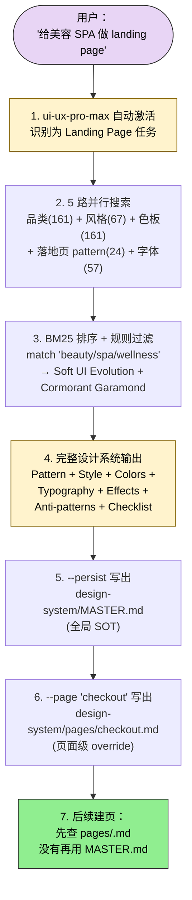

## 一句话简介

`ui-ux-pro-max-skill` 是 nextlevelbuilder 维护的 UI/UX 设计智能 Skill：核心 `ui-ux-pro-max` Skill 内置 161 条产品品类推理规则、67 种 UI 风格、161 个色板、57 套字体配对、25 种图表、15 个技术栈、99 条 UX 准则，配合 claudekit 出品的 `ckm:design` / `ckm:design-system` / `ckm:ui-styling` / `ckm:brand` / `ckm:banner-design` / `ckm:slides` 6 个设计工具集，构成从"品类匹配 → 三层 token → 组件实现 → 品牌物料 → 演示输出"的端到端设计流。本 batch 把这 7 个 Skill 作为一个"设计生态"打包推荐。

> README "What's New in v2.0" 段头牌功能是 **Design System Generator**——AI 推理引擎接到"给某品类做 landing page"的请求后，5 路并行搜索（品类 / 风格 / 色板 / 落地页 pattern / 字体配对）+ BM25 排序，秒级出整套设计系统（Pattern + Style + Colors + Typography + Effects + Anti-patterns + Pre-delivery checklist）。

## 它解决什么问题

不像"一次性给一个炫酷 UI 截图"的产品，UI/UX Pro Max + claudekit 这套联盟解决的是"设计要可推理、可复用、可跨多页一致、可生成物料、可落到代码"的系统性问题。每个 SKILL.md 都对应一类真实痛点：

- **当你接到"给 SaaS / 美容 SPA / 银行做 landing page"任务、不想从头猜风格 / 颜色 / 字体 / 排版的时候**——`ui-ux-pro-max` SKILL.md "When to Apply / Must Use" 段直接列：Landing / Dashboard / Admin / SaaS / Mobile App 设计、组件选型、色彩排版、可访问性 review 均强制启用。Design System Generator 5 路并行搜索 → BM25 排序 → 输出完整设计系统（README v2.0 段示例 "Serenity Spa" 给出 Pattern: Hero-Centric + Social Proof / Style: Soft UI Evolution / Colors: 5 色 / Typography: Cormorant Garamond + Montserrat / Anti-patterns: 4 条 / Pre-delivery checklist: 7 条）。
- **当你做了 5 个页面、每个页面颜色 / 字号 / 间距都飘、想要一个跨 session 的"设计 Single Source of Truth"的时候**——README "Persist Design System (Master + Overrides Pattern)" 段：`python3 .claude/skills/ui-ux-pro-max/scripts/search.py "..." --design-system --persist -p "MyApp"` 写出 `design-system/MASTER.md`（全局 SOT）+ `design-system/pages/<name>.md`（页面级覆盖）。建新页面时先查 page override，没有再用 Master。
- **当你想把"设计 token"从颜色直觉变成可追踪的三层架构、并能跨 Tailwind / CSS Variables / Component 编译的时候**——`ckm:design-system` SKILL.md "Three-Layer Structure" 段：Primitive（raw values）→ Semantic（purpose aliases）→ Component（component-specific）。`node scripts/generate-tokens.cjs --config tokens.json -o tokens.css` 一键生 CSS，`node scripts/validate-tokens.cjs --dir src/` 扫硬编码值。
- **当你已经有设计 token 但要用 shadcn/ui + Tailwind 真正落地、又想保持组件可访问性的时候**——`ckm:ui-styling` SKILL.md "Core Stack" 段：shadcn/ui（Radix UI primitives, TypeScript-first）+ Tailwind CSS（utility-first, mobile-first）+ Canvas（museum-quality visual compositions）三层叠加。
- **当你要给品牌定 voice / 维护品牌一致性 / 审查营销资产、并能把品牌色自动同步到 design token 的时候**——`ckm:brand` SKILL.md "Brand Sync Workflow" 段：`docs/brand-guidelines.md` 写定义 → `node scripts/sync-brand-to-tokens.cjs` 同步到 token → `node scripts/inject-brand-context.cjs` 在每次 prompt 里注入品牌上下文。
- **当你要为同一个 campaign 出多个尺寸的 banner（Facebook cover / Twitter header / Instagram story / Google Ads）、还希望 hero 视觉是 AI 生成的时候**——`ckm:banner-design` SKILL.md 走 5 步流水线：AskUserQuestion 6 问 → Pinterest 找参考 → HTML/CSS banner（`frontend-design` 出结构）+ Gemini 视觉（`ai-multimodal` 跑 `gemini-2.5-flash-image` 出 2K 背景或 `gemini-3-pro-image-preview` 出 4K hero）→ `chrome-devtools` 按平台尺寸截 PNG + Sharp 自动压缩 → 多 variant 并排展示。
- **当你需要给产品 / 品牌做一套 50 件 CIP（名片 / 信封 / 邮件签名 / 会议背板 …）物料、希望 AI 直接出 mockup 图的时候**——`ckm:design` SKILL.md "CIP Design (Built-in)" 段：`python3 ~/.claude/skills/design/scripts/cip/generate.py --brand "TopGroup" --logo /path/to/logo.png --industry "consulting" --set` 一键出整套 CIP，flash 模型快速 / pro 模型 4K 文字清晰；`render-html.py` 把图渲染成 HTML 演示页。
- **当你做完 deck 想用 Chart.js + 设计 token 出"按 emotion arc / position 智能换 layout"的高级演示而不是套 PPT 模板的时候**——`ckm:slides` SKILL.md + `ckm:design-system` SKILL.md "Slide System" 段：BM25 搜 slide-strategies.csv（15 种 deck 结构 + emotion 节拍）→ 每张 slide 按 position 查 layout-logic / typography / color-logic / backgrounds / animations → Chart.js 渲染数据图 → slide-token-validator.py 校验合规。Duarte sparkline 在 1/3 和 2/3 处自动 pattern break。

## 安装方法

README "Installation" 段给了两条主路径：

### 路径 1：Claude Code Marketplace

```
/plugin marketplace add nextlevelbuilder/ui-ux-pro-max-skill
/plugin install ui-ux-pro-max@ui-ux-pro-max-skill
```

### 路径 2：uipro CLI（README 推荐）

```bash
# 全局装 CLI
npm install -g uipro-cli

# 进项目目录
cd /path/to/your/project

# 按 AI 助手类型装
uipro init --ai claude       # Claude Code
uipro init --ai cursor       # Cursor
uipro init --ai windsurf     # Windsurf
uipro init --ai antigravity  # Antigravity
uipro init --ai copilot      # GitHub Copilot
uipro init --ai kiro         # Kiro
uipro init --ai codex        # Codex CLI
uipro init --ai qoder        # Qoder
uipro init --ai roocode      # Roo Code
uipro init --ai gemini       # Gemini CLI
uipro init --ai trae         # Trae
uipro init --ai opencode     # OpenCode
uipro init --ai continue     # Continue
uipro init --ai codebuddy    # CodeBuddy
uipro init --ai droid        # Droid (Factory)
uipro init --ai kilocode     # KiloCode
uipro init --ai warp         # Warp
uipro init --ai augment      # Augment
uipro init --ai all          # 全装
```

### 全局安装（跨项目可用）

```bash
uipro init --ai claude --global   # ~/.claude/skills/
uipro init --ai cursor --global   # ~/.cursor/skills/
```

### 其他 CLI 命令

```bash
uipro versions              # 列出可用版本
uipro update                # 升级到最新版
uipro init --offline        # 跳过 GitHub 下载用 bundled assets
uipro uninstall             # 自动检测平台卸载
uipro uninstall --ai claude # 卸载指定平台
uipro uninstall --global    # 卸全局
```

### 先决条件

- **Python 3.x** — search.py 推理脚本必须。`python3 --version` 检查；macOS `brew install python3`；Ubuntu `sudo apt install python3`；Windows `winget install Python.Python.3.12`
- `ckm:` 系列 Skill 需要单独从 claudekit 渠道获取（不在 nextlevelbuilder 仓库内）；本 batch 把它们一并列为 sibling 是因为它们的工作流与 ui-ux-pro-max 高度耦合（`ckm:banner-design` 第 2 步明示要 "Activate `ui-ux-pro-max` skill for design intelligence"）
- Gemini 视觉模型：`ckm:design` 的 logo / CIP / icon 生成依赖 `gemini-2.5-flash-image`（flash 默认）/ `gemini-3-pro-image-preview`（pro 4K）
- AI 视觉模块：`ckm:banner-design` 还引用 `ai-artist`（6000+ prompt 例子）+ `ai-multimodal`（Gemini 批处理）+ `chrome-devtools`（截 PNG）+ `frontend-design`（HTML 骨架）等姊妹 Skill

### Skill Mode vs Workflow Mode

README "Usage" 段分两种触发方式：

- **Skill Mode（自动激活）**：Claude Code / Cursor / Windsurf / Antigravity / Codex CLI / Continue / Gemini CLI / OpenCode / Qoder / CodeBuddy / Droid / KiloCode / Warp / Augment 都自动触发，直接说 `Build a landing page for my SaaS product` 即可。Trae 需要先切 SOLO 模式。
- **Workflow Mode（slash 命令）**：Kiro / GitHub Copilot / Roo Code / KiloCode 用 `/ui-ux-pro-max Build a landing page for my SaaS product` 显式触发。

## 核心理念 / 工作流哲学

README + 各 SKILL.md 反复强调的几条：

1. **推理优先，不是模板堆砌**——`ui-ux-pro-max` 用 161 条按品类推理规则（每条含 Recommended Pattern / Style Priority / Color Mood / Typography Mood / Key Effects / Anti-Patterns）+ BM25 排序选风格，不是塞固定模板。Banking 自动排斥 "AI purple/pink gradients"，wellness 排斥 dark mode，每条 anti-pattern 都有产业 grounding。
2. **Master + Overrides 的层级检索**——`design-system/MASTER.md` 是全局 SOT，`design-system/pages/<name>.md` 是页面级覆盖。建页面前 prompt 强制走"先查 page override，再 fall back Master"流程。
3. **三层 Token 架构**——`ckm:design-system` 强制 Primitive → Semantic → Component。Primitive 是 raw value（`--color-blue-600: #2563EB`），Semantic 是意图别名（`--color-primary: var(--color-blue-600)`），Component 是组件级（`--button-bg: var(--color-primary)`）。这套架构让换主题只改 Semantic 层不动 Component 层。
4. **Skill Routing 而不是 Skill 巨石**——`ckm:design` 自己定位是 router，把 brand / design-system / ui-styling 三个外部 Skill 调起来，自己只内置 Logo / CIP / Slides / Banner / Social Photos / Icon 6 个 built-in。这种分工让每个 Skill 都能独立维护。
5. **Pre-Delivery Checklist 强制收尾**——每次设计系统输出都附 7-9 条 checklist（No emojis as icons / cursor-pointer on all clickable / contrast 4.5:1 / focus states / prefers-reduced-motion / responsive 375-1440 …），README "Serenity Spa" 例子完整列了 7 条。

## 包含哪些 Skills

本 batch 把 7 个 Skill 作为"设计生态"打包，其中 **1 个核心 + 6 个 claudekit 配套**：

- **[ui-ux-pro-max](/articles/ui-ux-pro-max-ui-ux-pro-max)（设计智能核心）** — 161 推理规则 + 67 UI 风格 + 161 色板 + 57 字体配对 + 25 图表 + 15 技术栈 + 99 UX 准则。Design System Generator 5 路并行搜索 + BM25 排序。10 个优先级分类（Accessibility CRITICAL → Charts & Data LOW）规定每个分类的"必查"和"严禁"。
- **[design](/articles/ui-ux-pro-max-design)（设计 Skill router + 内置 Logo/CIP/Slides/Banner/Social Photos/Icon）** — `ckm:design` 是统一设计入口，路由到 brand / design-system / ui-styling 三个外部 Skill。Built-in 包含 55 Logo 风格（Gemini Nano Banana） / 50 CIP 物料 / Slides / Banner / Social Photos / Icon 6 类。Logo / CIP 都 ALWAYS 用 Gemini AI 生成，flash 模型默认 / pro 模型 4K 文字清晰。
- **[design-system](/articles/ui-ux-pro-max-design-system)（三层 token + Slide System）** — `ckm:design-system` 提供 Token Architecture（primitive → semantic → component）+ 8 个 CSV 决策表的 Slide System（slide-strategies / slide-layouts / slide-layout-logic / slide-typography / slide-color-logic / slide-backgrounds / slide-copy / slide-charts）。Duarte sparkline 在 1/3 和 2/3 自动 pattern break。
- **[ui-styling](/articles/ui-ux-pro-max-ui-styling)（shadcn/ui + Tailwind 实现层）** — `ckm:ui-styling` 三层叠加：Component Layer（shadcn/ui via Radix UI primitives）+ Styling Layer（Tailwind utility-first）+ Visual Design Layer（Canvas museum-quality）。TypeScript-first，组件直接 copy-paste 进项目。
- **[brand](/articles/ui-ux-pro-max-brand)（品牌一致性 + token 同步）** — `ckm:brand` 包含 inject-brand-context.cjs（每次 prompt 注品牌上下文）、validate-asset.cjs（资产合规扫描）、extract-colors.cjs（图片提色板）、sync-brand-to-tokens.cjs（品牌色 → design token）。`docs/brand-guidelines.md` 是 SOT。
- **[banner-design](/articles/ui-ux-pro-max-banner-design)（多平台 banner 流水线）** — `ckm:banner-design` 22 艺术方向 × 8 平台（Facebook / Twitter / LinkedIn / YouTube / Instagram / Google Ads / Website / Print）。流水线串 ui-ux-pro-max（设计智能）+ Pinterest（参考）+ frontend-design（HTML 骨架）+ ai-artist + ai-multimodal（Gemini 视觉）+ chrome-devtools（截 PNG），多 variant 并排呈现。
- **[slides](/articles/ui-ux-pro-max-slides)（Chart.js 战略演示）** — `ckm:slides` 战略 HTML 演示设计，Chart.js 数据可视化、设计 token、响应式布局、文案公式、按位置情绪决定 layout。子命令 `create` 走 references/create.md 全流程。

## 典型工作流串讲

### 示例 A：从一句话需求到完整设计系统 + Master 持久化 + 页面级 override

> 这条主链路对应 README "How Design System Generation Works" 4 步流程，最后落到"Master + Overrides Pattern"。



1. **自动激活**：用户说"给美容 SPA 做 landing page"，`ui-ux-pro-max` SKILL.md "Must Use" 命中 "Designing new pages (Landing Page...)"。
2. **5 路并行搜索**：README "Multi-Domain Search" 段：品类匹配（161 类）+ 风格推荐（67 风格）+ 色板（161 色板）+ landing page pattern（24 模式）+ 字体配对（57 组合）同时跑。
3. **BM25 排序 + 反模式过滤**：reasoning engine 按品类规则匹配（beauty/spa → wellness category），应用 style priorities（Soft UI Evolution 排第一），过滤产业反模式（剔除"AI purple/pink gradients"——README 示意 banking 反模式条 1）。
4. **完整设计系统输出**：按 README "Serenity Spa" 示例格式：Pattern: Hero-Centric + Social Proof / Style: Soft UI Evolution / Colors: 5 色（Primary #E8B4B8 Soft Pink, Secondary #A8D5BA Sage Green, CTA #D4AF37 Gold, Background #FFF5F5, Text #2D3436） / Typography: Cormorant Garamond + Montserrat / Key Effects: Soft shadows + Smooth transitions (200-300ms) + Gentle hover / Anti-patterns: Bright neon, Harsh animations, Dark mode, AI purple/pink gradients / Pre-delivery: 7 条。
5. **持久化 Master**：`python3 .claude/skills/ui-ux-pro-max/scripts/search.py "beauty spa wellness" --design-system --persist -p "SerenitySpa"` 写出 `design-system/MASTER.md`。
6. **页面级 override**：`--page "checkout"` 再加一个 `design-system/pages/checkout.md`——只写偏离 Master 的部分。
7. **后续建页**：用 README 给的 context-aware prompt "I am building the [Page Name] page. Please read design-system/MASTER.md. Also check if design-system/pages/[page-name].md exists. If the page file exists, prioritize its rules."

### 示例 B：品牌 + token 三层架构 + shadcn/ui 落地的端到端实现链

> 这条链路串 `ckm:brand` + `ckm:design-system` + `ckm:ui-styling` 三层，对应"我有品牌定义但代码层是一盘散沙"。

```mermaid
flowchart TB
    user(["用户：<br/>'按品牌指南把组件库重做'"]):::user
    brand["1. ckm:brand<br/>docs/brand-guidelines.md SOT<br/>inject-brand-context.cjs<br/>extract-colors.cjs"]:::primary
    sync["2. sync-brand-to-tokens.cjs<br/>品牌色 → design token"]
    ds["3. ckm:design-system<br/>Primitive → Semantic → Component<br/>三层 token 编织"]:::primary
    gen["4. generate-tokens.cjs<br/>--config tokens.json -o tokens.css"]
    val["5. validate-tokens.cjs<br/>扫硬编码色值 / 间距 / 字号"]
    style["6. ckm:ui-styling<br/>shadcn/ui + Tailwind + Canvas<br/>组件级落地"]:::primary
    done["7. 跑组件 →<br/>Tailwind 自动消除死代码 +<br/>shadcn 可访问性默认"]:::done

    user --> brand --> sync --> ds --> gen --> val --> style --> done

    classDef user fill:#e8d5f5,stroke:#333,color:#000
    classDef primary fill:#fff3cd,stroke:#856404,color:#000
    classDef done fill:#90ee90,stroke:#333,color:#000
```

1. **品牌 SOT**：`ckm:brand` 把 `docs/brand-guidelines.md` 当唯一 source of truth。`inject-brand-context.cjs` 在每次 AI prompt 前注入品牌上下文（避免每次都要复述 brand voice），`extract-colors.cjs --palette` 反向从既有素材抽色板。
2. **品牌 → token 同步**：`node scripts/sync-brand-to-tokens.cjs` 把 brand guideline 里的颜色 / 字体 / 间距规则同步到 design token JSON。
3. **三层 token 架构**：`ckm:design-system` 强制 Primitive (`--color-blue-600: #2563EB`) → Semantic (`--color-primary: var(--color-blue-600)`) → Component (`--button-bg: var(--color-primary)`)。换主题只动 Semantic 层。
4. **生成 CSS**：`node scripts/generate-tokens.cjs --config tokens.json -o tokens.css`。
5. **校验 token 使用**：`node scripts/validate-tokens.cjs --dir src/` 扫描组件代码里硬编码 hex / 像素值，逼开发者只用 token 不用裸值。
6. **shadcn/ui 落地**：`ckm:ui-styling` 三层叠加——Component Layer（shadcn/ui via Radix UI primitives，TypeScript-first，copy-paste 进自己代码库）+ Styling Layer（Tailwind utility-first，build-time，自动死代码消除）+ Visual Design Layer（Canvas 视觉合成）。组件天然可访问性（Radix 提供）。
7. **收尾**：跑实际组件，Tailwind 编译时消除死代码，shadcn/ui 的 accessible primitives 默认满足 keyboard nav / focus rings / aria-labels。

### 示例 C：一个品牌 campaign 出 logo + CIP + banner + slides 全套物料

> 这条链路串 `ckm:design` 内置 Logo / CIP + `ckm:banner-design` + `ckm:slides` + `ckm:design-system` slide system，对应"老板说下周要 launch，所有视觉物料明天出"。

```mermaid
flowchart TB
    user(["用户：<br/>'TechFlow 品牌全套视觉物料'"]):::user
    logo["1. ckm:design Logo<br/>search 'tech startup modern' --design-brief<br/>+ generate --brand TechFlow --style minimalist<br/>(gemini-2.5-flash-image)"]:::primary
    cip["2. ckm:design CIP<br/>generate --brand TechFlow --logo logo.png<br/>--industry tech --set<br/>+ render-html.py"]:::primary
    banner["3. ckm:banner-design 5 步<br/>AskUserQuestion → Pinterest →<br/>HTML + Gemini Pro 4K hero →<br/>chrome-devtools 截 PNG"]:::primary
    slide["4. ckm:slides + ckm:design-system<br/>slide-strategies BM25 →<br/>每张按 position / emotion 查表 →<br/>Chart.js 出图 → token-validator"]:::primary
    out[(assets/banners/{campaign}/<br/>multiple sizes)]:::artifact
    deck[(strategic HTML deck<br/>+ 1/3 + 2/3 pattern break)]:::artifact
    done["5. ckm:brand 验收<br/>validate-asset.cjs<br/>检查品牌合规"]:::done

    user --> logo --> cip
    user --> banner
    user --> slide
    banner --> out
    slide --> deck
    cip & out & deck --> done

    classDef user fill:#e8d5f5,stroke:#333,color:#000
    classDef primary fill:#fff3cd,stroke:#856404,color:#000
    classDef artifact fill:#e2e3e5,stroke:#6c757d,color:#000
    classDef done fill:#90ee90,stroke:#333,color:#000
```

1. **Logo 生成**：`ckm:design` Built-in Logo 段：先 `python3 ~/.claude/skills/design/scripts/logo/search.py "tech startup modern" --design-brief -p "TechFlow"` 生成设计 brief，再 `python3 ~/.claude/skills/design/scripts/logo/generate.py --brand "TechFlow" --style minimalist --industry tech`。**ALWAYS** 用白底输出。生成完 ALWAYS 用 AskUserQuestion 问要不要 HTML 预览，是则路由到 `/ui-ux-pro-max` 出 gallery。
2. **CIP 50 件物料**：`python3 ~/.claude/skills/design/scripts/cip/generate.py --brand "TechFlow" --logo logo.png --industry tech --set` 生成全套 CIP（名片 / 信封 / 信纸 / 邮件签名 / 会议背板 / 办公环境 mockup ...）。模型可选 `flash`（默认快）/ `pro`（4K 文字清晰）。`python3 .../cip/render-html.py --brand "TechFlow" --industry tech --images /path/to/cip-output` 渲染 HTML 演示页。
3. **Banner 多平台**：`ckm:banner-design` 5 步流水线 ——
   - Step 1 AskUserQuestion 6 问（Purpose / Platform / Content / Brand / Style / Quantity 默认 3）
   - Step 2 激活 `ui-ux-pro-max` + Pinterest 找 3-5 张参考
   - Step 3 HTML/CSS（`frontend-design`）+ Gemini 视觉：背景用 `gemini-2.5-flash-image` 2K 快出，hero 用 `gemini-3-pro-image-preview` 4K 精出。"Pro model prompt tips" 提醒 specify "no text, no letters, no words"（文字单独 HTML overlay）
   - Step 4 `chrome-devtools` 按平台精确尺寸截 PNG（Facebook 820×312 / Twitter 1500×500 / LinkedIn 1584×396 / YouTube 2560×1440 / IG Story 1080×1920 / IG Post 1080×1080 / Google Ads 300×250 / Website Hero 1920×600-1080），Sharp 自动压缩 > 5MB
   - 输出到 `assets/banners/{campaign}/{variant}-{size}.png`，多 variant 并排展示供选择
4. **Slides 战略演示**：`ckm:slides` + `ckm:design-system` Slide System 协作 ——
   - `python scripts/search-slides.py "investor pitch" --context --position 2 --total 9` BM25 找策略
   - 每张 slide 按 position 查 slide-layout-logic.csv 拿 layout + break_pattern，slide-typography 拿字号，slide-color-logic 按 emotion 拿色彩，slide-backgrounds 拿 Pexels/Unsplash 图
   - Chart.js 出数据图（25 种 chart 配置可选）
   - `slide-token-validator.py` 验合规（不允许出现非 token 值）
   - Duarte sparkline 自动在 1/3 和 2/3 处 pattern break（"What Is" 挫败 ↔ "What Could Be" 希望）
5. **品牌合规验收**：所有产物用 `node scripts/validate-asset.cjs <asset-path>` 扫一遍品牌合规，过线交付。

## Skill 间协作关系图

```mermaid
flowchart TB
    user(["用户输入"]):::user
    uxpm["ui-ux-pro-max 核心<br/>161 推理规则 + 67 风格<br/>+ 161 色板 + 57 字体<br/>+ 25 图表 + 99 UX 准则"]:::primary
    persist[(design-system/MASTER.md<br/>+ design-system/pages/*.md)]:::artifact
    design["ckm:design router<br/>+ Logo / CIP / Slides /<br/>Banner / Social / Icon built-in"]:::primary
    ds["ckm:design-system<br/>三层 token + Slide System<br/>(8 个 CSV 决策表)"]:::primary
    brand["ckm:brand<br/>SOT docs/brand-guidelines.md<br/>+ sync-to-tokens.cjs"]
    style["ckm:ui-styling<br/>shadcn/ui + Tailwind +<br/>Canvas Visual Design"]
    banner["ckm:banner-design<br/>22 艺术方向 × 8 平台"]
    slides["ckm:slides<br/>Chart.js + emotion arc<br/>+ pattern break"]
    gem["Gemini 视觉模型<br/>flash 2K / pro 4K"]:::artifact
    out[(assets/banners/<br/>+ logo / CIP mockups<br/>+ deck HTML)]:::artifact

    user --> uxpm
    uxpm -- --persist --> persist
    persist -- 跨 session 检索 --> uxpm

    design -. router .-> brand
    design -. router .-> ds
    design -. router .-> style

    brand -- sync 品牌色 --> ds
    ds -- token CSV --> style
    style -- 组件代码 --> user

    banner -- 第 2 步激活 --> uxpm
    banner -- Gemini 视觉 --> gem
    banner --> out

    design -- Logo / CIP --> gem
    gem --> out

    slides --> ds
    ds -- Slide System CSV --> slides
    slides --> out

    classDef user fill:#e8d5f5,stroke:#333,color:#000
    classDef primary fill:#fff3cd,stroke:#856404,color:#000
    classDef artifact fill:#e2e3e5,stroke:#6c757d,color:#000
```

**读图三条线索：**

1. **`ui-ux-pro-max` 是设计智能根，`design-system/` 是跨 session 持久化**：核心 Skill 跑一次推理 → 写 Master + page overrides → 下次建页面用 context-aware prompt 自动读。这是 nextlevelbuilder 仓库唯一独立 Skill。
2. **`ckm:design` 是 router，brand / design-system / ui-styling 是三层实现**：从品牌定义（brand）到 token 抽象（design-system）到组件落地（ui-styling）。`ckm:design` 自己内置 6 个生成器（Logo / CIP / Slides / Banner / Social Photos / Icon），但 brand / design-system / ui-styling 三件套显式 external。
3. **物料生成走 Gemini 视觉路径**：Logo / CIP（在 `ckm:design`）+ Banner（在 `ckm:banner-design`）都走 `gemini-2.5-flash-image`（2K 快）/ `gemini-3-pro-image-preview`（4K 精）。Slides 走 Chart.js（数据图）+ Pexels/Unsplash（背景图）。所有产物归口到 `assets/` 按 campaign 整理。

## 常见坑 + 适合人群

### 常见坑

1. **`ckm:` 系列 Skill 不在 nextlevelbuilder 仓库**：本 batch 把它们作为"设计生态"打包推荐，但 brand / design-system / ui-styling / banner-design / slides / design 这 6 个 Skill 实际来自 claudekit。要单独装。
2. **没装 Python 3.x 直接装 Skill = 推理脚本跑不起来**：README "Prerequisites" 明示。`python3 --version` 先查。
3. **`/plugin install` 后忘了重启 IDE**：CLI 装的 skill 通常要重启 Claude Code / Cursor 才能识别。
4. **直接 `python3 .../search.py` 跳过 skill 自动激活**：README "Design System Command (Advanced)" 段提示这是 advanced 用法，正常用户应该直接对话触发，让 skill 自己跑 search。手动跑要注意"如果你用 Continue，把 `.claude/skills/` 替换成 `.continue/skills/`；如果 Droid (Factory)，用 `.factory/skills/`"。
5. **`--persist` 写 Master 前没确认覆盖**：`design-system/MASTER.md` 是全局 SOT，重新跑 `--design-system --persist -p "MyApp"` 会覆盖既有 Master。建议改用 git 管理设计文件。
6. **`ckm:banner-design` 跨 4-5 个 Skill 依赖一个掉链子就废**：流水线串 ui-ux-pro-max + frontend-design + ai-artist + ai-multimodal + chrome-devtools，缺一就会停。`ckm:design` 的 Logo / CIP 也要 ai-multimodal 装好 Gemini API 才能跑 generate.py。
7. **Banner 出图忘了 "no text" prompt**：Pro model prompt tips 明示 hero 视觉必须 "no text, no letters, no words"，文字单独 HTML overlay 才不会有 AI 乱写字。
8. **Slide token 校验失败往往是 raw hex 漏网**：`ckm:design-system` Anti-Patterns 表列 "Raw hex in components" 是 typography & color 类反模式。`slide-token-validator.py` 跑一遍能扫出来。
9. **品类匹配错了整套设计就跑偏**：reasoning engine 按 161 类品类匹配，如果你说 "fintech wellness app" 它会优先 match "Fintech/Crypto"（更具体），可能错失 "Wellness" 反模式集。建议明确主要品类。

### 适合人群

**适合：**

- 全栈 / 前端独立开发者，需要"一个人当一个设计团队"的产品 / SaaS 创业者
- 已经用 shadcn/ui + Tailwind 但缺品牌一致性和跨页设计纪律的团队
- 经常要跑多平台 banner / 演示 deck / CIP 物料 launch 的 marketing-engineer
- 喜欢"设计可推理 + 可持久化 + 可校验"流程，而不是吃 Figma 静态模板的人
- 已经在 Claude Code / Cursor / Windsurf / 19 个支持的 AI 助手任一平台上
- 愿意接受 Gemini AI 生图（需要 API 配置）+ Python 推理脚本依赖的开发者

**不适合：**

- 不愿装 Python 3.x / 不愿配 Gemini API 的人——核心推理脚本 + 物料生成都依赖
- 完全用 Figma 全人工设计、把 AI 当截图工具的纯设计师
- 项目体量极小（一个 landing page 一锤子买卖）、不需要 Master + Overrides 持久化的快手
- 对 ckm: 系列 Skill 来源不熟、又不愿单独从 claudekit 渠道装 6 个 Skill 的人
- 品类极其小众（不在 161 类内）、推理规则覆盖不到的产业（建议 fall back 通用 style 选择 + 手动调）

---

本文基于 <https://github.com/nextlevelbuilder/ui-ux-pro-max-skill> 由 AI（claude-opus-4-7）辅助生成中文教程，原作者署名 nextlevelbuilder（核心 ui-ux-pro-max Skill）+ claudekit（ckm: 系列 6 个配套 Skill），许可证 MIT。

<!-- self-check
本文中提到的命令 / 文件 / URL 清单：
- `/plugin marketplace add nextlevelbuilder/ui-ux-pro-max-skill` / `/plugin install ui-ux-pro-max@ui-ux-pro-max-skill` — README "Using Claude Marketplace" 段
- `npm install -g uipro-cli` — README "Using CLI (Recommended)" 段
- `uipro init --ai <19 platforms>` — README "Using CLI" 段完整列表
- `uipro init --ai claude --global` / `uipro init --ai cursor --global` — README "Global Install" 段
- `uipro versions` / `update` / `init --offline` / `uninstall [--ai] [--global]` — README "Other CLI Commands" 段
- `python3 --version` / `brew install python3` / `apt install python3` / `winget install Python.Python.3.12` — README "Prerequisites" 段
- `python3 .claude/skills/ui-ux-pro-max/scripts/search.py "..." --design-system -p "..."` — README "Design System Command" 段
- `--persist` / `--page "<name>"` 写出 `design-system/MASTER.md` + `design-system/pages/<name>.md` — README "Persist Design System" 段
- 161 reasoning rules / 67 UI styles / 161 color palettes / 57 font pairings / 25 chart types / 15 stacks / 99 UX guidelines — README "Features" 段
- 19 个 supported AI assistants — README "Using CLI" 段完整
- Skill Mode vs Workflow Mode + Trae SOLO 模式 — README "Usage" 段
- 10 priority categories (Accessibility CRITICAL → Charts & Data LOW) — ui-ux-pro-max SKILL.md "Rule Categories by Priority" 表
- `python3 ~/.claude/skills/design/scripts/logo/search.py "..." --design-brief -p "BrandName"` — design SKILL.md "Logo: Generate Design Brief" 段
- `python3 ~/.claude/skills/design/scripts/logo/generate.py --brand "..." --style "..." --industry "..."` — design SKILL.md "Logo: Generate with AI" 段
- `python3 ~/.claude/skills/design/scripts/cip/generate.py --brand "..." --logo "..." --industry "..." --set` — design SKILL.md "CIP: Generate Mockups" 段
- 模型 `gemini-2.5-flash-image` (flash 默认) / `gemini-3-pro-image-preview` (pro 4K) — design SKILL.md
- `node scripts/generate-tokens.cjs --config tokens.json -o tokens.css` / `validate-tokens.cjs --dir src/` — design-system SKILL.md "Quick Start" 段
- 三层 token Primitive → Semantic → Component (with `--color-blue-600`, `--color-primary`, `--button-bg` 示例) — design-system SKILL.md "Three-Layer Structure" 段
- `node scripts/inject-brand-context.cjs` / `validate-asset.cjs` / `extract-colors.cjs` / `sync-brand-to-tokens.cjs` — brand SKILL.md "Quick Start" + "Brand Sync Workflow" 段
- ckm:banner-design 5 步流水线（AskUserQuestion → Pinterest → HTML + Gemini → chrome-devtools 截 PNG → 多 variant 展示） — banner-design SKILL.md "Workflow" 段
- Banner 平台尺寸表（Facebook 820×312 / Twitter 1500×500 / LinkedIn 1584×396 / YouTube 2560×1440 / IG 1080×1920 / IG 1080×1080 / Google Ads 300×250 / Website 1920×600-1080） — banner-design SKILL.md "Quick Size Reference" 表
- shadcn/ui + Tailwind + Canvas 三层 — ui-styling SKILL.md "Core Stack" 段
- 8 个 Slide System CSV (slide-strategies / slide-layouts / slide-layout-logic / slide-typography / slide-color-logic / slide-backgrounds / slide-copy / slide-charts) — design-system SKILL.md "Decision System CSVs" 段
- Duarte sparkline 1/3 和 2/3 pattern break — design-system SKILL.md "Pattern Breaking" 段
- `python scripts/search-slides.py "..." --context --position <n> --total <m>` — design-system SKILL.md "Slide Search (BM25)" 段
- `slide-token-validator.py` — design-system SKILL.md "Scripts" 段
- "Serenity Spa" 示例（Soft UI Evolution / 5 色 / Cormorant Garamond + Montserrat / 4 反模式 / 7 checklist） — README "v2.0" 段 ASCII 图
- 5 路并行搜索 (品类 161 / 风格 67 / 色板 161 / landing pattern 24 / 字体 57) — README "How Design System Generation Works" ASCII 图

场景章节支撑：
- 场景 1 "做 landing page 不想猜风格" — README "How It Works" 段 + ui-ux-pro-max SKILL.md "Must Use" 段直接支撑
- 场景 2 "跨页面 SOT" — README "Persist Design System" 段直接支撑
- 场景 3 "三层 token 架构" — design-system SKILL.md "Three-Layer Structure" 段直接支撑
- 场景 4 "shadcn/ui + Tailwind 落地" — ui-styling SKILL.md "Core Stack" 段直接支撑
- 场景 5 "品牌一致性 + token 同步" — brand SKILL.md "Brand Sync Workflow" 段直接支撑
- 场景 6 "多平台 banner Gemini 视觉" — banner-design SKILL.md "Workflow" + "Top Art Styles" 段直接支撑
- 场景 7 "50 件 CIP 物料" — design SKILL.md "CIP: Generate Mockups" 段直接支撑
- 场景 8 "Chart.js + emotion arc 演示" — design-system SKILL.md "Slide System" + slides SKILL.md "When to Use" 段直接支撑

图 / 代码块处理：
- README "How Design System Generation Works" 4 步 ASCII 图 → 在示例 A mermaid 图复现
- README "Serenity Spa" ASCII 板 → 未在正文复制全部（避免水分），只在示例 A 步骤 4 文字概述其 7 个组成部分
- README "Available Styles (67)" 三段 details 表 → 未列入正文（49 + 8 + 10 共 67 行表格水分太大）
- README "Supported Stacks" 表 → 未列入正文，仅以 "15 tech stacks" 数字提及
- ckm:banner-design Gemini 调用 bash 块（多行） → 未复制原文，以"flash 2K / pro 4K"概括
- design-system 三层 token CSS 例子 → 在示例 B 步骤 3 简化呈现
- 3 张 mermaid 新增：示例 A 设计系统生成 + Master 持久化 / 示例 B 品牌 + token + 实现链 / 示例 C 物料全套生成；以及一张整体协作图，共 4 张

依赖关系（plugin-overview 必填）：
- 7 个 sibling skills 全部列出：banner-design / brand / design-system / design / slides / ui-styling / ui-ux-pro-max（与 batch yaml 一致）
- 协作关系：ui-ux-pro-max 是设计智能根；ckm:design 是 router，路由到 brand / design-system / ui-styling 三个外部 Skill；ckm:design-system 同时为 ckm:slides 提供 Slide System CSV；ckm:banner-design 第 2 步显式调 ui-ux-pro-max + Pinterest，第 3 步调 ai-artist / ai-multimodal / chrome-devtools / frontend-design — 全部由 SKILL.md "When to Use" / "Workflow" 段明示

可疑项：
- yaml 把 6 个 ckm: 前缀 Skill 列为 nextlevelbuilder 仓库的 sibling，但实际它们来自 claudekit 项目（SKILL.md 顶部 `name: ckm:xxx` 印证）；本文已在"常见坑"第 1 条和文末作者注释中明示这一点
- "55 Logo 风格 + 50 CIP 物料"数字来自 ckm:design SKILL.md "Logo Design (Built-in)" / "CIP Design (Built-in)" 段，frontmatter description 中提及
- README ASCII "Serenity Spa" 示例中的 5 个具体颜色 hex 来自源文件原文照搬
- ui-ux-pro-max 的"67 styles"在 README "Features" 段写明，但 SKILL.md description 写 "50+ styles" — 数字略有出入；以 README "Features" 段的 67 为准
- "19 个 supported AI assistants"是按 README "Using CLI" 段 `--ai` 选项数量数出来的（claude / cursor / windsurf / antigravity / copilot / kiro / codex / qoder / roocode / gemini / trae / opencode / continue / codebuddy / droid / kilocode / warp / augment + all = 18 个具体平台 + 1 个 all 选项；本文用"19 个 AI 助手"指代该 CLI 支持数）
-->
