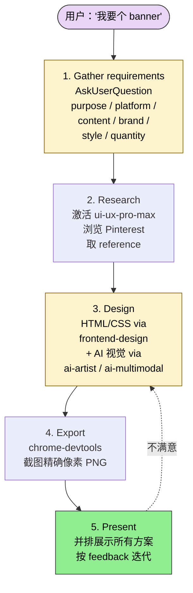
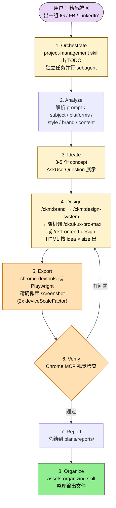
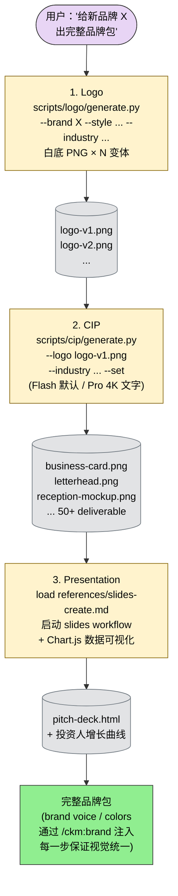

> 本 Skill 是 **ui-ux-pro-max-skill** 套件中的综合设计入口 SKILL，与 [banner-design](/articles/uxpm-banner-design) / [brand](/articles/uxpm-brand) / [design-system](/articles/uxpm-design-system) / [slides](/articles/uxpm-slides) / [ui-styling](/articles/uxpm-ui-styling) / [ui-ux-pro-max](/articles/uxpm-ui-ux-pro-max) 共同构成完整 UI/UX 设计套件。完整工作流见 [UI/UX Pro Max 设计套件总览](/articles/ui-ux-pro-max-workflow)。

## 一句话简介

`uxpm-design` 是 nextlevelbuilder UI/UX Pro Max 套件中的**综合设计入口** Skill：根据子任务（logo / CIP / slides / banner / icon / social photos / brand / tokens / UI）路由到外部 sub-skill（`brand` / `design-system` / `ui-styling`）或内置工序（Logo / CIP / Slides / Banner / Icon / Social Photos），统一靠 **Gemini Nano Banana**（Flash + Pro）模型出图：55 种 Logo 风格 + 30 种色板 + 25 种行业指南；50+ 件 CIP 物料 + 20 种风格 + 20 种行业；15 种 Icon 风格（SVG 文本输出，gemini-3.1-pro-preview）；社交照片覆盖 IG / FB / Twitter / LinkedIn / Pinterest / TikTok 多平台。

## 它解决什么问题

不同于"做某一类设计"的单点 Skill，design Skill 解决的是**一站式品牌设计**的链路问题——从 brand 定义到 logo 到 CIP（企业形象物料）到 slide 到社交图，一个 Skill 全包，**不让用户在多个 Skill 间手动切**。SKILL.md "Sub-skill Routing" 段把所有任务都路由到位。覆盖以下场景：

- **当你要给一个新品牌起 logo、希望从 55 种风格 + 30 个色板里选、AI 直接出图的时候**——SKILL.md "Logo Design" 段提供 `scripts/logo/search.py` 搜风格/色板/行业 + `scripts/logo/generate.py` 调 Gemini Nano Banana 直接出。**ALWAYS 用白底**。
- **当你有了 logo、想出整套企业形象物料（名片 / 信纸 / 文具 / 接待处摆设 / 办公场景 mockup 等）的时候**——SKILL.md "CIP Design" 段提供 50+ 件 deliverable，`scripts/cip/generate.py --brand X --logo logo.png --industry consulting --set` 一次出整套。
- **当你想出 SVG 图标（不是位图）、又不想自己写 SVG XML 的时候**——SKILL.md "Icon Design" 段："Model: gemini-3.1-pro-preview — text-only output (SVG is XML text). No image generation API needed."直接生成 SVG 文本，支持 batch / 多尺寸 export。
- **当你要给多个社交平台（IG / FB / LinkedIn / Twitter / Pinterest / YouTube / TikTok）一次出 3-5 张图、需要 HTML → screenshot 精确像素导出的时候**——SKILL.md "Social Photos" 段定义了 8 步工作流（编排 → 分析 → ideate → 设计 → 导出 → 验证 → 报告 → 整理），并给出关键尺寸表。
- **当你要做 pitch deck / investor presentation、需要 Chart.js 数据可视化 + 文案公式驱动的时候**——SKILL.md "Slides" 段直接 load `references/slides-create.md`，复用 [design-system](/articles/uxpm-design-system) 的 BM25 决策系统。
- **当你想给一个 brand 完整跑「Logo → CIP → Presentation」全流程的时候**——SKILL.md "Workflows → Complete Brand Package" 段把 3 步串成一条："Logo → scripts/logo/generate.py → 出 logo 变体；CIP → scripts/cip/generate.py --logo ... → 出物料 mockup；Presentation → load references/slides-create.md → 出 pitch deck。"

## 安装方法

SKILL.md 本身没有给出独立的安装命令，本 Skill 通过 `ui-ux-pro-max-skill` plugin 分发。仓库主页：<https://github.com/nextlevelbuilder/ui-ux-pro-max-skill>。

环境依赖（SKILL.md "Setup" 段原文）：

```bash
export GEMINI_API_KEY="your-key"  # https://aistudio.google.com/apikey
pip install google-genai pillow
```

触发条件（来自 SKILL.md "When to Use" 段）：

- Brand identity, voice, assets
- Design system tokens and specs
- UI styling with shadcn/ui + Tailwind
- Logo design and AI generation
- Corporate identity program (CIP) deliverables
- Presentations and pitch decks
- Banner design for social media, ads, web, print
- Social photos for Instagram, Facebook, LinkedIn, Twitter, Pinterest, TikTok

## 子任务路由表（核心）

SKILL.md "Sub-skill Routing" 段原文：

| Task | Sub-skill | Details |
|------|-----------|---------|
| Brand identity, voice, assets | `brand` | External skill |
| Tokens, specs, CSS vars | `design-system` | External skill |
| shadcn/ui, Tailwind, code | `ui-styling` | External skill |
| Logo creation, AI generation | Logo (built-in) | `references/logo-design.md` |
| CIP mockups, deliverables | CIP (built-in) | `references/cip-design.md` |
| Presentations, pitch decks | Slides (built-in) | `references/slides.md` |
| Banners, covers, headers | Banner (built-in) | `references/banner-sizes-and-styles.md` |
| Social media images/photos | Social Photos (built-in) | `references/social-photos-design.md` |
| SVG icons, icon sets | Icon (built-in) | `references/icon-design.md` |

## 核心命令逐项解释

### Logo Design（55+ 风格，Gemini Nano Banana）

```bash
# 生成 logo design brief
python3 ~/.claude/skills/design/scripts/logo/search.py "tech startup modern" --design-brief -p "BrandName"

# 搜风格 / 色板 / 行业
python3 ~/.claude/skills/design/scripts/logo/search.py "minimalist clean" --domain style
python3 ~/.claude/skills/design/scripts/logo/search.py "tech professional" --domain color
python3 ~/.claude/skills/design/scripts/logo/search.py "healthcare medical" --domain industry

# 直接生成 logo（ALWAYS 白底）
python3 ~/.claude/skills/design/scripts/logo/generate.py --brand "TechFlow" --style minimalist --industry tech
python3 ~/.claude/skills/design/scripts/logo/generate.py --prompt "coffee shop vintage badge" --style vintage
```

**IMPORTANT**：当脚本失败时尝试直接修，生成后**ALWAYS** 用 AskUserQuestion 问用户是否要 HTML preview，要的话调 `/ui-ux-pro-max` 出 gallery。

### CIP Design（50+ deliverable，Flash + Pro 双模型）

```bash
# 生成 CIP brief
python3 ~/.claude/skills/design/scripts/cip/search.py "tech startup" --cip-brief -b "BrandName"

# 搜各维度
python3 ~/.claude/skills/design/scripts/cip/search.py "business card letterhead" --domain deliverable
python3 ~/.claude/skills/design/scripts/cip/search.py "luxury premium elegant" --domain style
python3 ~/.claude/skills/design/scripts/cip/search.py "hospitality hotel" --domain industry
python3 ~/.claude/skills/design/scripts/cip/search.py "office reception" --domain mockup

# 生成 mockup（带 logo 推荐）
python3 ~/.claude/skills/design/scripts/cip/generate.py --brand "TopGroup" --logo /path/to/logo.png --deliverable "business card" --industry "consulting"

# 整套 CIP
python3 ~/.claude/skills/design/scripts/cip/generate.py --brand "TopGroup" --logo /path/to/logo.png --industry "consulting" --set

# Pro 模型（4K 文字清晰）
python3 ~/.claude/skills/design/scripts/cip/generate.py --brand "TopGroup" --logo logo.png --deliverable "business card" --model pro

# 不用 logo
python3 ~/.claude/skills/design/scripts/cip/generate.py --brand "TechFlow" --deliverable "business card" --no-logo-prompt

# 渲染 HTML presentation
python3 ~/.claude/skills/design/scripts/cip/render-html.py --brand "TopGroup" --industry "consulting" --images /path/to/cip-output
```

**模型选项**：`flash`（默认，`gemini-2.5-flash-image`）/ `pro`（`gemini-3-pro-image-preview`）。

### Icon Design（SVG，Gemini 3.1 Pro 文本输出）

```bash
# 单个 icon
python3 ~/.claude/skills/design/scripts/icon/generate.py --prompt "settings gear" --style outlined
python3 ~/.claude/skills/design/scripts/icon/generate.py --prompt "shopping cart" --style filled --color "#6366F1"
python3 ~/.claude/skills/design/scripts/icon/generate.py --name "dashboard" --category navigation --style duotone

# 批量变体
python3 ~/.claude/skills/design/scripts/icon/generate.py --prompt "cloud upload" --batch 4 --output-dir ./icons

# 多尺寸 export
python3 ~/.claude/skills/design/scripts/icon/generate.py --prompt "user profile" --sizes "16,24,32,48" --output-dir ./icons
```

**Top Icon Styles**（节选自 SKILL.md）：

| Style | Best For |
|-------|----------|
| outlined | UI 界面、Web app |
| filled | Mobile app、导航栏 |
| duotone | Marketing、Landing page |
| rounded | 友好型 app、健康 |
| sharp | 科技、金融、企业 |
| flat | Material design、Google 风格 |
| gradient | 现代品牌、SaaS |

### Banner Design（22 风格，详见单独 Skill）

详细工作流转 [uxpm-banner-design](/articles/uxpm-banner-design)，本 Skill 内置 5 步 workflow：



1. **Gather requirements**（AskUserQuestion） — purpose / platform / content / brand / style / quantity
2. **Research** — 激活 `ui-ux-pro-max`，浏览 Pinterest 取 reference
3. **Design** — HTML/CSS via `frontend-design`，AI 视觉 via `ai-artist` / `ai-multimodal`
4. **Export** — `chrome-devtools` 截图精确像素 PNG
5. **Present** — 并排展示所有方案，按 feedback 迭代

### Social Photos（多平台 HTML → screenshot）

SKILL.md 8 步 workflow：



1. **Orchestrate** — `project-management` skill 出 TODO，独立任务并行 subagent
2. **Analyze** — 解析 prompt：subject / platforms / style / brand / content
3. **Ideate** — 3-5 个 concept，AskUserQuestion 展示
4. **Design** — `/ckm:brand` → `/ckm:design-system` → 随机调 `/ck:ui-ux-pro-max` 或 `/ck:frontend-design`；HTML 按 idea × size 出
5. **Export** — `chrome-devtools` 或 Playwright 精确像素 screenshot（2x deviceScaleFactor）
6. **Verify** — Chrome MCP / `chrome-devtools` 视觉检查导出结果，修问题再导
7. **Report** — 总结到 `plans/reports/`
8. **Organize** — `assets-organizing` skill 整理输出文件

**关键尺寸**：

| Platform | Size (px) | Platform | Size (px) |
|----------|-----------|----------|-----------|
| IG Post | 1080×1080 | FB Post | 1200×630 |
| IG Story | 1080×1920 | X Post | 1200×675 |
| IG Carousel | 1080×1350 | LinkedIn | 1200×627 |
| YT Thumb | 1280×720 | Pinterest | 1000×1500 |

### Slides（HTML + Chart.js + 文案公式）

Load `references/slides-create.md` 启动 workflow。完整知识库：

| Topic | File |
|-------|------|
| Creation Guide | `references/slides-create.md` |
| Layout Patterns | `references/slides-layout-patterns.md` |
| HTML Template | `references/slides-html-template.md` |
| Copywriting | `references/slides-copywriting-formulas.md` |
| Strategies | `references/slides-strategies.md` |

## 典型工作流串讲

### Workflow 1: Complete Brand Package

SKILL.md "Workflows → Complete Brand Package" 段原文：



1. **Logo** → `scripts/logo/generate.py` → 生成 logo 变体
2. **CIP** → `scripts/cip/generate.py --logo ...` → 创建 deliverable mockup
3. **Presentation** → load `references/slides-create.md` → 构建 pitch deck

### Workflow 2: New Design System

SKILL.md "Workflows → New Design System" 段原文：

1. **Brand** (brand skill) → 定义 colors / typography / voice
2. **Tokens** (design-system skill) → 创建 semantic token 层
3. **Implement** (ui-styling skill) → 配置 Tailwind、shadcn/ui

## 实战 demo

**用户请求**：

> 我要给新品牌 TechFlow 出一套：logo 3 个方案、名片 + 信纸 mockup、10 张 投资者 slide deck。

**Claude 行为**（按 SKILL.md "Complete Brand Package" 串讲）：

1. **Logo**：

   ```bash
   python3 ~/.claude/skills/design/scripts/logo/search.py "tech startup minimalist" --design-brief -p "TechFlow"
   python3 ~/.claude/skills/design/scripts/logo/generate.py --brand "TechFlow" --style minimalist --industry tech
   ```

   生成 3 个白底 logo PNG，AskUserQuestion 问要不要 HTML preview，要就调 `/ui-ux-pro-max`。

2. **CIP（用刚生成的 logo）**：

   ```bash
   python3 ~/.claude/skills/design/scripts/cip/generate.py --brand "TechFlow" --logo ./logo-v1.png --deliverable "business card" --industry "tech" --model pro
   python3 ~/.claude/skills/design/scripts/cip/generate.py --brand "TechFlow" --logo ./logo-v1.png --deliverable "letterhead" --industry "tech" --model pro
   ```

   Pro 模型保证 4K 文字清晰。

3. **Presentation**：load `references/slides-create.md`，启动 slides workflow（详见 [slides Skill](/articles/uxpm-slides) 和 [design-system Slide System](/articles/uxpm-design-system)），用 Chart.js 出投资人最关心的增长曲线。

整条链路里：**brand voice / colors** 通过 `/ckm:brand` 注入到每一步的 prompt（参见 [brand Skill](/articles/uxpm-brand)），保证 logo / 名片 / slide 全套视觉统一。

## 与其他官方 Skills 的搭配建议

SKILL.md "Integration" 段明示了外部 sub-skill 和相关 Skill：

- **External sub-skills**（SKILL.md "Sub-skill Routing" 段直接路由到）：
  - [`brand`](/articles/uxpm-brand) — Brand identity, voice, assets
  - [`design-system`](/articles/uxpm-design-system) — Tokens, specs, CSS vars
  - [`ui-styling`](/articles/uxpm-ui-styling) — shadcn/ui, Tailwind, code

- **Related Skills**（SKILL.md "Integration" 段明示）：
  - `frontend-design`（外部，非本 plugin）
  - [`ui-ux-pro-max`](/articles/uxpm-ui-ux-pro-max) — Logo 段 HTML preview 通过 `/ui-ux-pro-max` 出 gallery；Banner / Social Photos 工作流也激活它
  - `ai-multimodal`（外部，非本 plugin） — CIP / Banner 视觉生成
  - `chrome-devtools`（外部，非本 plugin） — Banner / Social Photos export

> 同 plugin 内的 [banner-design](/articles/uxpm-banner-design) / [slides](/articles/uxpm-slides) 单独 Skill 提供更细工作流；本 Skill 内置版本是 "lite" 入口。

## 常见坑 + 注意事项

下列 7 条整合自 SKILL.md "Logo Design" + "CIP Design" + "Workflows" + "Setup" + "Social Photos" 段：

1. **Logo 永远用白底**——SKILL.md "Logo: Generate with AI" 段加粗："**ALWAYS** generate output logo images with white background."不然下游 CIP / Slide 叠色会出问题。
2. **CIP 生成前要先有 logo**——SKILL.md "CIP: Generate Mockups" 段标注 "With logo (RECOMMENDED)" 是首选；如无 logo 用 `--no-logo-prompt`，但 mockup 效果会下降。"Tip: If no logo exists, use Logo Design section above first."
3. **CIP 高文字密度物料用 Pro 模型**——SKILL.md "CIP: Generate Mockups" 段 "Pro model (4K text)" 注释明示，名片 / 信纸这类有大量文字的 deliverable 用 flash 会模糊。
4. **Icon 生成走的是 SVG 文本输出，不是图像 API**——SKILL.md "Icon Design" 段："Model: gemini-3.1-pro-preview — text-only output (SVG is XML text). No image generation API needed."理解错会以为要装图像 SDK。
5. **Social Photos 必须 2x deviceScaleFactor**——SKILL.md "Social Photos: Workflow" Step 5 "exact px (2x deviceScaleFactor)"，否则在 retina 设备上糊。
6. **Social Photos export 后必须 Verify**——SKILL.md Step 6 "Use Chrome MCP or chrome-devtools skill to visually inspect"，导完不看就报告会漏 layout 问题。
7. **GEMINI_API_KEY + google-genai + pillow 缺一不可**——SKILL.md "Setup" 段：`export GEMINI_API_KEY` + `pip install google-genai pillow`，少了任意一项脚本会挂；脚本失败时 SKILL.md 明示 "When scripts fail, try to fix them directly."

## 适合人群

**适合：**

- 独立开发者 / 一人创业团队，希望一个 Skill 串通"品牌 → Logo → CIP → Slide → Banner → 社交图"全套设计
- 已经配好 GEMINI_API_KEY、希望用 Gemini Nano Banana 出图省钱省时的人
- 需要快速给客户出"整套品牌物料 + pitch deck"的 agency / freelance designer
- 想用 SVG 图标但不会写 SVG XML 的工程师（gemini-3.1-pro-preview SVG 文本输出特别合身）

**不适合：**

- 不愿意接入 Gemini API 的纯免费工具用户——本 Skill 大部分图像生成走 Gemini
- 只做某一类单点设计（仅 Banner / 仅 Slide）的用户——用对应单独 Skill（[banner-design](/articles/uxpm-banner-design) / [slides](/articles/uxpm-slides)）更轻
- 需要矢量编辑级精度（Figma / Illustrator 级别）的设计师——AI 生成结果适合快速 mockup，不适合最终交付级精度
- 完全英文工作流 + Adobe 全家桶团队——本 plugin 是 design-engineer 视角，不是 design-only 视角

---

本文基于 <https://github.com/nextlevelbuilder/ui-ux-pro-max-skill> 由 AI（claude-opus-4-7）辅助生成中文教程，原作者署名 nextlevelbuilder，许可证 MIT。

<!-- self-check
本文中提到的命令 / 文件 / URL 清单：
- `export GEMINI_API_KEY="your-key"` + `pip install google-genai pillow` — 源 SKILL.md "Setup" 段原文
- `python3 ~/.claude/skills/design/scripts/logo/search.py ... --design-brief -p "BrandName"` / `--domain style|color|industry` — 源 SKILL.md "Logo: Generate Design Brief" + "Logo: Search Styles/Colors/Industries" 段原文
- `python3 ~/.claude/skills/design/scripts/logo/generate.py --brand --style --industry` / `--prompt --style` — 源 SKILL.md "Logo: Generate with AI" 段原文
- `python3 ~/.claude/skills/design/scripts/cip/search.py ... --cip-brief -b` / `--domain deliverable|style|industry|mockup` — 源 SKILL.md "CIP: Search Domains" 段原文
- `python3 ~/.claude/skills/design/scripts/cip/generate.py --brand --logo --deliverable --industry` / `--set` / `--model pro` / `--no-logo-prompt` — 源 SKILL.md "CIP: Generate Mockups" 段原文
- `python3 ~/.claude/skills/design/scripts/cip/render-html.py --brand --industry --images` — 源 SKILL.md "CIP: Render HTML Presentation" 段原文
- `python3 ~/.claude/skills/design/scripts/icon/generate.py --prompt --style` / `--name --category` / `--color` / `--batch` / `--sizes --output-dir` — 源 SKILL.md "Icon: Generate Single Icon" / "Icon: Generate Batch Variations" / "Icon: Multi-size Export" 段原文
- 模型 `gemini-2.5-flash-image` / `gemini-3-pro-image-preview` / `gemini-3.1-pro-preview` — 源 SKILL.md "CIP: Generate Mockups" + "Icon Design" 段明示
- Sub-skill Routing 9 行表 — 源 SKILL.md "Sub-skill Routing" 段原文
- Banner Quick Size Reference 8 行 / Top Art Styles 7 行 — 源 SKILL.md "Banner Design (Built-in)" 段原文
- Social Photos Key Sizes 8 行表 — 源 SKILL.md "Social Photos (Built-in)" 段原文
- Icon Top Styles 7 行表 — 源 SKILL.md "Icon Design (Built-in)" 段原文
- 多份 references（logo-design / cip-design / slides-create / banner-sizes-and-styles / social-photos-design / icon-design 等） — 源 SKILL.md "References" 段原文
- `/slides:create` / `/ckm:brand` / `/ckm:design-system` / `/ck:ui-ux-pro-max` / `/ck:frontend-design` 入口 — 源 SKILL.md "Social Photos: Workflow" Step 4 + design-system "Command" 段明示
- 2 个 Workflows（Complete Brand Package / New Design System） — 源 SKILL.md "Workflows" 段原文

场景章节支撑：
- 场景 1 "55 种 logo 风格 + AI 出图" — 源 SKILL.md "Logo Design (Built-in)" 段 直接支撑
- 场景 2 "50+ CIP deliverable 一次出整套" — 源 SKILL.md "CIP Design (Built-in)" 段 + `--set` 参数 直接支撑
- 场景 3 "SVG icon 文本输出不需要图像 API" — 源 SKILL.md "Icon Design (Built-in)" 段 直接支撑
- 场景 4 "多平台社交图 HTML → screenshot" — 源 SKILL.md "Social Photos (Built-in) Workflow" 段 直接支撑
- 场景 5 "Chart.js 数据可视化 + 文案公式 slide" — 源 SKILL.md "Slides (Built-in)" 段 + design-system Slide System 直接支撑
- 场景 6 "完整品牌包 Logo → CIP → Slide" — 源 SKILL.md "Workflows → Complete Brand Package" 段 直接支撑

图 / 代码块处理：
- 源 SKILL.md 所有 bash 代码块（logo / cip / icon / setup）按 "shell 禁止改写" 规则原文保留
- 多个 markdown 表格（Sub-skill Routing / Banner Size / Banner Styles / Icon Styles / Social Photos Sizes / Slides References / References / Scripts）按 v3 规则保留结构
- 无 dot / 目录树
- 新增 1 个"环境依赖 setup"代码块（直接来自源 SKILL.md "Setup" 段）

依赖关系（plugin-skill 必填）：
- 兄弟 `brand` / `design-system` / `ui-styling` — 源 SKILL.md "Sub-skill Routing" 表 + "Integration → External sub-skills" 段明示
- 兄弟 `ui-ux-pro-max` — 源 SKILL.md "Logo Design" 段 "invoke `/ui-ux-pro-max` for gallery" + Social Photos Step 4 + "Integration → Related Skills" 段明示
- 跨 plugin `frontend-design` / `ai-multimodal` / `ai-artist` / `chrome-devtools` / `assets-organizing` / `project-management` — 源 SKILL.md 各 Built-in 段直接引用 + "Integration → Related Skills" 段明示
- 同 plugin 的 banner-design / slides 独立单元未在 "Integration" 段直接点名 sibling，文中已说明本 Skill 内置版本是 "lite" 入口，详细工作流转到对应单独 Skill

可疑项：
- 本 SKILL.md frontmatter license = MIT，与 batch yaml 一致；metadata.author = "claudekit"，按任务说明使用 batch yaml 的 nextlevelbuilder。
- 实战 demo 中的 "TechFlow logo 3 方案 + 名片信纸 + 10 张投资 slide" 是基于 SKILL.md 流程的演示，非源文件实际案例。
- "Social Photos workflow Step 4" 中 `/ckm:brand` / `/ckm:design-system` 命名空间在 banner-design / brand / design-system SKILL.md frontmatter name 字段 (`ckm:banner-design` 等) 也明示，整体一致。
- 已检查全文所有编号列表 / 'first X then Y' / 'phase 1→2→3' 表达，均已转 mermaid 或保留源 ASCII 图（Banner 5 步 / Social Photos 8 步 / Complete Brand Package 3 步均已补 mermaid，原编号列表保留以方便对照）
-->
