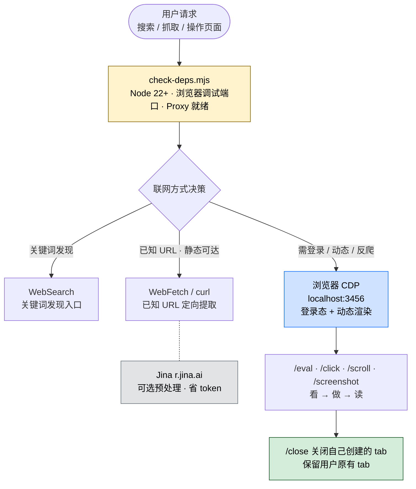

## 一句话简介

`web-access` 是 eze-is 维护的 Claude Code Skill，把所有联网动作（搜索、抓取、登录后操作、动态渲染页面、社交媒体内容获取）统一收口到一个 Skill，并通过 CDP Proxy 直连用户本机的日常浏览器（Chrome / Edge），天然带登录态，无需另起独立浏览器实例。

## 它解决什么问题

不同于 `WebSearch` / `WebFetch` 这种通用工具的"开箱即用"，联网任务的真正难点是反爬、登录态、动态渲染、信息真伪。SKILL.md 的 description 段把适用场景写得很直接，覆盖以下痛点：

- **当你想让 Claude 操作小红书、微信公众号、微博这类静态层无效的平台的时候**——SKILL.md "联网工具选择"表格里明确写："非公开内容，或已知静态层无效的平台（小红书、微信公众号等公开内容也被反爬限制）→ 浏览器 CDP（直接，跳过静态层）"。普通 fetch / curl 拿不到正文，CDP 直接以用户身份打开页面就能读到 DOM。
- **当你需要 Claude 完成"登录后才能做"的操作的时候**——SKILL.md "登录判断"段强调"用户日常浏览器天然携带登录态"，CDP Proxy 复用用户已登录的 session，遇到未登录的情况会让 Claude 提示用户去自己的浏览器登录后再继续，全程不存任何账号密码。
- **当用户提到"我之前看过的那个文章"、"公司内部的 XX 系统"这种公网搜不到的目标的时候**——SKILL.md "本地浏览器资源"段提供 `find-url.mjs` 脚本，按关键词检索本地 Chrome / Edge 的书签和历史，支持 `--only`、`--since`、`--sort` 等参数。
- **当你要做信息核实、需要找一手来源而不是二手转载的时候**——SKILL.md "信息核实类任务"段写明"核实的目标是一手来源，而非更多的二手报道。多个媒体引用同一个错误会造成循环印证假象"，配套给出了政策法规、企业公告、学术声明、工具能力的一手来源对照表。
- **当任务需要并行调研多个独立目标（N 个项目、N 个来源）的时候**——SKILL.md "并行调研：子 Agent 分治策略"段给出了适合分治 vs 不适合分治的判断标准，并说明所有子 Agent 共享同一个浏览器实例、通过不同 targetId 操作不同 tab，无竞态风险。

## 安装方法

SKILL.md 本身没有给出独立的安装命令，仓库主页：<https://github.com/eze-is/web-access>。按 Claude Code 通用约定，从仓库获取后放到 Claude Code 识别的 Skill 路径即可（具体路径以你本地配置为准，本 SKILL.md 未指定）。

运行环境硬要求来自 SKILL.md "前置检查"段：

- **Node.js 22+**（CDP Proxy 使用原生 WebSocket）
- 一台已登录常用网站的 **Chrome 或 Edge**

首次使用时 Claude 会先跑：

```bash
node "${CLAUDE_SKILL_DIR}/scripts/check-deps.mjs"
```

按脚本退出码处理：`exit 0` 继续，`exit 2` 询问用户偏好并写入 `${CLAUDE_SKILL_DIR}/config.env` 的 `WEB_ACCESS_BROWSER`，`exit 1` 按 stdout 的"Agent 处理顺序"自动尝试。

## 核心组件与工作流

整个 Skill 的内部结构可以拆成"选工具 → 启 Proxy → 操作 → 收尾"四段：



### 浏览哲学

SKILL.md "浏览哲学"段把工作方式定为"像人一样思考"：拿到请求先定义成功标准 → 选最可能直达的方式作为第一步 → 每一步结果都是证据、用来更新对目标的判断 → 对照成功标准确认完成才停。**遇到弹窗、登录墙、反爬时不在同一方式上反复重试**——内容可能已在 DOM 中，交互只是展示手段。

### 工具选择表（源 SKILL.md 原表）

| 场景 | 工具 |
|------|------|
| 搜索摘要或关键词结果，发现信息来源 | **WebSearch** |
| URL 已知，需要从页面定向提取特定信息 | **WebFetch** |
| URL 已知，需要原始 HTML 源码（meta、JSON-LD 等） | **curl** |
| 非公开 / 静态层无效（小红书、微信公众号等） | **浏览器 CDP** |
| 需要登录态、交互操作，或需要像人一样在浏览器内导航 | **浏览器 CDP** |

**Jina** 是可选预处理层：调用方式 `r.jina.ai/example.com`（URL 前加前缀，不保留 http），限 20 RPM，适合文章/博客/文档/PDF 等以正文为核心的页面；商品页、数据面板不适合。

### CDP Proxy API（curl 调用）

CDP Proxy 启动在 `localhost:3456`，所有操作走 HTTP API。SKILL.md "Proxy API"段完整列出，下面节选核心命令：

```bash
# 列出用户已打开的 tab
curl -s http://localhost:3456/targets

# 创建新后台 tab（URL 走 POST body）
curl -s -X POST --data-raw 'https://example.com' http://localhost:3456/new

# 执行任意 JS — 读写 DOM、提取数据、操控元素
curl -s -X POST "http://localhost:3456/eval?target=ID" -d 'document.title'

# 点击（JS el.click(), 简单快速）
curl -s -X POST "http://localhost:3456/click?target=ID" -d 'button.submit'

# 真实鼠标点击 — CDP Input.dispatchMouseEvent, 算用户手势
curl -s -X POST "http://localhost:3456/clickAt?target=ID" -d 'button.upload'

# 文件上传 — 直接 set file input, 绕过对话框
curl -s -X POST "http://localhost:3456/setFiles?target=ID" \
  -d '{"selector":"input[type=file]","files":["/path/to/file.png"]}'

# 滚动触发懒加载
curl -s "http://localhost:3456/scroll?target=ID&direction=bottom"

# 关闭自己创建的 tab
curl -s "http://localhost:3456/close?target=ID"
```

> **v2.5.3 迁移提示**：旧脚本若使用 `GET /new?url=...` 或 `/navigate?target=...&url=...`，会收到迁移指引，按 `references/migration-2.5.3.md` 改为 POST body 即可。

## 实战 demo

下面是一个典型链路（基于 SKILL.md 的流程示例，不臆造具体页面命令）：

**用户请求**：

> 帮我看看 https://www.xiaohongshu.com/explore/<某条笔记 id> 这条笔记的正文和评论。

**Claude 行为**：

1. **前置检查**：跑 `node "${CLAUDE_SKILL_DIR}/scripts/check-deps.mjs"`，确认 Node 22+ 与浏览器调试端口可用，Proxy 自动启动。
2. **选工具**：小红书属于"已知静态层无效"的平台，按工具选择表直走浏览器 CDP，跳过 curl / WebFetch。
3. **打开页面**：`curl -s -X POST --data-raw '<原始链接，含完整参数>' http://localhost:3456/new`，拿到 target ID。
4. **看 DOM**：用 `/eval` 取笔记标题、正文、图片 URL；如果评论默认折叠，用 `/click` 展开，或 `/scroll` 触发懒加载。
5. **读图**：如果正文有图，先从 DOM 直接拿图片 URL 而不是全页截图——SKILL.md "媒体资源提取"段明确建议这么做更精准。
6. **收尾**：`curl -s "http://localhost:3456/close?target=ID"` 关闭自己创建的 tab，保留用户原有 tab 不动。

整个过程对用户来说就是"开一下 Claude，几分钟拿到笔记内容"，没有账号密码交付、没有第三方爬虫服务、没有截图 OCR——Claude 用的就是用户自己登录过的 Chrome。

## 常见坑 + 注意事项

1. **切换浏览器要先杀 Proxy**——SKILL.md "前置检查"段明示："切换浏览器时，proxy 是长驻进程，需先 `pkill -f cdp-proxy.mjs` 再重跑 check-deps。"
2. **不要主动操作用户已有 tab**——SKILL.md 明示"若无用户明确要求，不主动操作用户已有 tab，所有操作都在自己创建的后台 tab 中进行"。
3. **URL 必须保留完整参数**——很多网站链接含会话 token，"提取 URL 时应保留完整地址，不要裁剪或省略参数"，URL 通过 POST body 原样传入 `/new` 或 `/navigate`。
4. **登录判断只问"目标内容拿到了吗"**——SKILL.md 给出标准话术："当前页面在未登录状态下无法获取[具体内容]，请在你的浏览器中登录 [网站名]，完成后告诉我继续。"登录完成后无需重启，刷新页面即可。
5. **平台返回"内容不存在"不一定真不存在**——SKILL.md "技术事实"段提醒："平台返回的'内容不存在''页面不见了'等提示不一定反映真实状态，也可能是访问方式的问题（如 URL 缺失必要参数、触发反爬）而非内容本身的问题。"
6. **子 Agent prompt 用目标导向、避免暗示手段**——SKILL.md "并行调研"段警告："『搜索 xx』会把子 Agent 锚定到 WebSearch"，主 Agent 应描述目标（"获取""调研"），避免"搜索""抓取""爬取"这种动词暗示。
7. **必须向用户出示风险提示**——前置检查通过后，SKILL.md 要求 Claude 必须在回复中直接展示"温馨提示：部分站点对浏览器自动化操作检测严格，存在账号封禁风险..."这段文字再启动 Proxy。
8. **批量打开 tab 会触发风控**——SKILL.md "技术事实"段："短时间内密集打开大量页面（如批量 `/new`）可能触发网站的反爬风控。"

## 适合人群

**适合：**

- 经常让 Claude 抓小红书、微博、推特、微信公众号、动态渲染 SPA 内容，被 WebFetch / curl "拿到空 HTML" 坑过的人
- 需要 Claude 完成"登录后才能做"的任务（看后台数据、提交表单、内部系统取数）、不想交付账号密码的人
- 做信息核实、希望 AI 助手强制走"一手来源优先于二手报道"的研究者
- 希望在多目标调研时让 Claude 主动用 sub-agent 并行、节省主 Agent context 的开发者

**不适合：**

- 不愿意把自己日常浏览器（Chrome / Edge）暴露给 CDP 调试端口的人——这是这个 Skill 的核心机制，关不掉
- 只跑公开静态文档、`WebFetch` 已经够用的轻量场景——CDP Proxy 是长驻进程，对简单任务是过度
- 受限于 Node.js 22+ 无法升级运行环境的项目
- 把所有联网动作严格走公司代理 / 审计网关、不允许浏览器直连的合规环境

---

本文基于 <https://github.com/eze-is/web-access> 由 AI（claude-opus-4-7）辅助生成中文教程，原作者署名 eze-is，许可证 Unlicense。

<!-- self-check
本文中提到的命令 / 文件 / URL 清单：
- `node "${CLAUDE_SKILL_DIR}/scripts/check-deps.mjs"` — 源文件 "前置检查" 段明示
- `${CLAUDE_SKILL_DIR}/config.env` 与 `WEB_ACCESS_BROWSER` — 源文件 "前置检查" 段明示
- `pkill -f cdp-proxy.mjs` — 源文件 "前置检查" 段明示
- `node "${CLAUDE_SKILL_DIR}/scripts/find-url.mjs" [关键词...] [--only ...] [--browser ...] [--limit N] [--since ...] [--sort ...]` — 源文件 "本地浏览器资源" 段明示
- `r.jina.ai/example.com`（前缀写法 + 20 RPM 限制） — 源文件 "联网工具选择" 段明示
- `http://localhost:3456` 上的 `/targets` `/new` `/info` `/eval` `/screenshot` `/navigate` `/back` `/click` `/clickAt` `/setFiles` `/scroll` `/close` — 源文件 "Proxy API" 段明示
- `references/migration-2.5.3.md` 与 v2.5.3 迁移提示 — 源文件 "页面内导航" 段明示
- `references/cdp-api.md` 与 `references/site-patterns/{domain}.md` — 源文件 "References 索引" 段明示

场景章节支撑：
- 场景 1 "操作小红书 / 微信公众号 / 微博" — 源文件 "联网工具选择" 表格 + "技术事实" 段反爬说明 直接支撑
- 场景 2 "登录后才能做的操作" — 源文件 "登录判断" 段 + "浏览器 CDP 模式" 段 直接支撑
- 场景 3 "用户引用本人访问过页面 / 公司内部系统" — 源文件 "补充：本地浏览器资源" 段 直接支撑
- 场景 4 "信息核实 + 一手来源" — 源文件 "信息核实类任务" 段 直接支撑
- 场景 5 "并行调研 N 个目标" — 源文件 "并行调研：子 Agent 分治策略" 段 直接支撑

图 / 代码块处理：
- 原文 Proxy API shell 代码块 → 节选保留原文（按规则 JSON/YAML/shell 禁止改写）
- 原文 "联网工具选择" 表格 → 保留并翻译表头（5 列以下，未破坏对齐）
- 增加 1 张 mermaid 流程图概览四段："选工具 → 启 Proxy → 操作 → 收尾"（参照 algorithmic-art.md 风格，节点用源文件出现的名词）

依赖关系：
- 不适用，source_type = single-skill, sibling_skills 为空

可疑项：
- License 字段：batch yaml 给的是 Unlicense，SKILL.md frontmatter 写的是 MIT。按任务说明使用 batch yaml 的 Unlicense；若 review 时确认实际 LICENSE 文件为 MIT 应当更新。
- Author 字段：batch yaml 给的是 "eze-is"（GitHub 账号名），SKILL.md metadata 写的是 "一泽Eze"（实际作者署名）。按任务说明使用 batch yaml 的 "eze-is"；正文未提作者中文名。
- "Claude Code 通用约定" 的安装路径未在 SKILL.md 中明示，已按 v3 规则标注"具体路径以你本地配置为准，本 SKILL.md 未指定"。
-->
