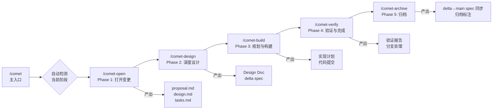
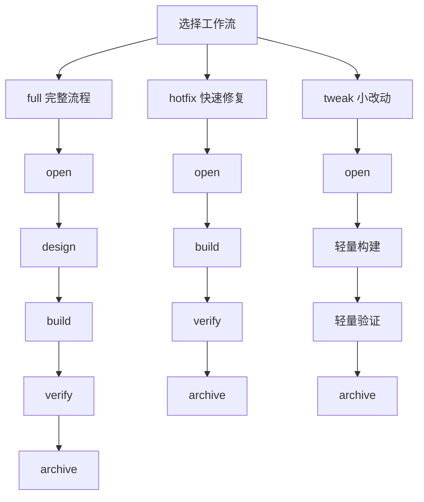
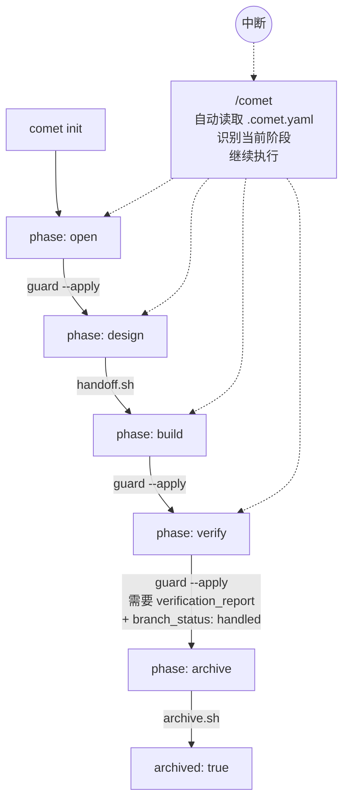
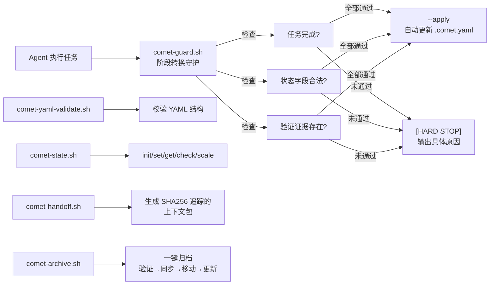
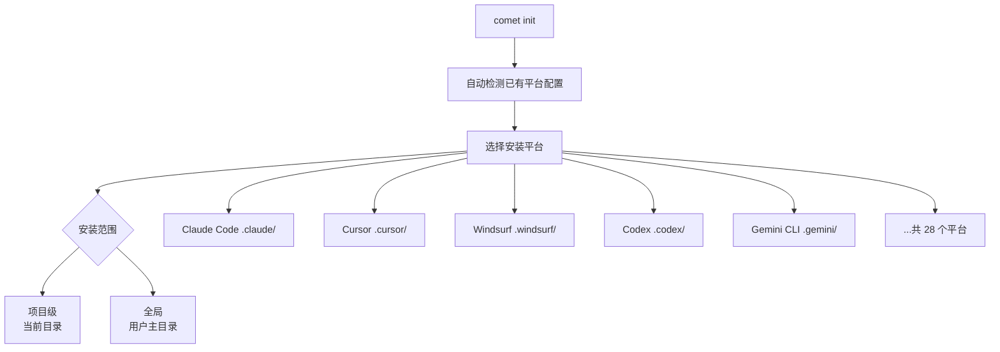
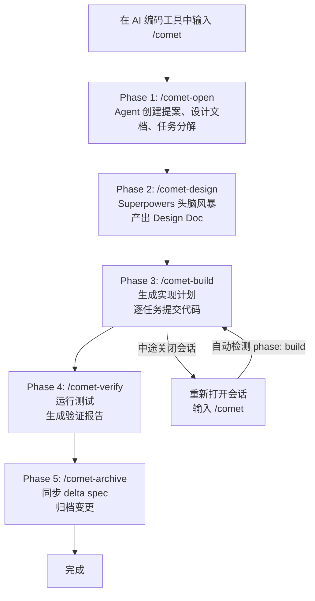

# Comet：把 OpenSpec + Superpowers 串成一条自动化流水线

## 一句话简介

Comet 是一个将 OpenSpec（需求管理）和 Superpowers（技术执行）组合成五阶段自动化流水线的 Skill 编排工具（785+ stars），支持 28 个 AI 编码平台，一条 `/comet` 命令从创意到归档。

## 它解决什么问题

1. **当你同时用 OpenSpec 和 Superpowers 但两边文档总是脱节的时候**——OpenSpec 擅长管需求、写提案、管 Spec 生命周期，但提案和任务细节不如 Superpowers 头脑风暴那样深入。Superpowers 的设计文档做完后又没有状态化管理，Agent 断点恢复时只能重新翻文档猜进度。Comet 把两者的强项合并，用 `.comet.yaml` 状态机串联全流程，中断后 `/comet` 一键继续。

2. **当你需要 Agent 真正触发 Skill 而不是"模仿触发"的时候**——很多 Skill 组合方案依赖 Agent 根据文档描述"模拟"执行（比如写了看起来像 Skill 产出的文件），但实际上没有真正调用 Skill。Comet 的 Prompt 设计确保 Agent 真正触发嵌套 Skill，CC 上会有明确的 Skill 触发打印。

3. **当你想让多阶段工作流自动流转、不用反复提醒 Agent 的时候**——"记得更新 design doc""记得同步 spec""记得归档 change"——这些重复提示消耗大量精力。Comet 把 handoff、状态更新、校验和归档同步放进脚本化流程，核心流程自动推进。

4. **当你需要跨平台使用统一工作流的时候**——Comet 支持 28 个 AI 编码平台（Claude Code / Cursor / Windsurf / Codex / Gemini CLI / Cline 等），一次 `comet init` 自动安装 OpenSpec + Superpowers + Comet 三套技能到选定平台。

5. **当你想学习如何编排和组合 Skill 的时候**——Comet 本身就是一个 Skill 组合的实战参考，展示了嵌套触发、多阶段自动流转、可恢复状态机、守护条件设计、跨平台分发等核心模式。

## 安装方法

```bash
# 全局安装
npm install -g @rpamis/comet

# 在项目中初始化
cd your-project
comet init
```

`comet init` 会自动完成：
- 检测已有 AI 平台配置
- 安装 OpenSpec + Superpowers 技能
- 部署 Comet 技能（支持中文/英文选择）
- 创建工作目录 `docs/superpowers/specs/` 和 `docs/superpowers/plans/`

### 环境要求

| 项目 | 要求 |
|------|------|
| Node.js | 20+ |
| npm/npx | 随 Node.js |
| Git | 任意版本 |
| Shell | Bash 兼容（Windows 用 Git Bash） |

## 核心机制

### 五阶段流水线



Comet 的核心是把 OpenSpec（管 WHAT）和 Superpowers（管 HOW）串联成一条完整的流水线：

| 阶段 | 命令 | 归属 | 产出物 |
|------|------|------|--------|
| 1. Open | `/comet-open` | OpenSpec | proposal.md、design.md、tasks.md |
| 2. Deep Design | `/comet-design` | Superpowers | Design Doc、delta spec |
| 3. Plan & Build | `/comet-build` | Superpowers | 实现计划、代码提交 |
| 4. Verify & Finish | `/comet-verify` | Both | 验证报告、分支处理 |
| 5. Archive | `/comet-archive` | OpenSpec | delta→main spec 同步、归档 |

### 三种工作流模式



| 工作流 | 适用场景 | 跳过阶段 |
|--------|----------|----------|
| `full` | 新功能、重构、架构变更 | 无（完整五阶段） |
| `hotfix` | Bug 修复 | 跳过头脑风暴 |
| `tweak` | 文案调整、配置修改、Prompt 优化 | 跳过头脑风暴和完整计划 |

### 状态机与断点恢复



Comet 使用解耦状态架构：

| 文件 | 归属 | 用途 |
|------|------|------|
| `.openspec.yaml` | OpenSpec | Spec 生命周期、变更元数据 |
| `.comet.yaml` | Comet | 工作流阶段、执行模式、验证状态 |

`.comet.yaml` 的关键字段：

```yaml
workflow: full          # 工作流类型
phase: build            # 当前阶段
build_mode: subagent-driven-development  # 构建模式
isolation: branch       # 隔离方式
verify_result: pending  # 验证结果
archived: false         # 是否已归档
```

### 守护脚本体系



Comet 不靠 Agent 自己说"完成了"来推进阶段，而是通过脚本硬性检查：

| 脚本 | 用途 |
|------|------|
| `comet-guard.sh` | 阶段转换守护，`--apply` 自动更新状态 |
| `comet-yaml-validate.sh` | 校验 `.comet.yaml` 结构和字段值 |
| `comet-state.sh` | 统一状态管理接口（init/set/get/check/scale） |
| `comet-handoff.sh` | 设计交接，生成带 SHA256 追踪的上下文包 |
| `comet-archive.sh` | 一键归档：验证→同步→移动→更新 |
| `comet-env.sh` | 脚本发现助手，导出内置脚本路径 |

### 28 平台支持



支持的主要平台包括：Claude Code、Cursor、Windsurf、Codex、Cline、RooCode、GitHub Copilot、Gemini CLI、Amazon Q Developer、Qwen Code、Kiro、Trae 等 28 个 AI 编码平台。

## 实战 Demo

### 场景一：新项目初始化

```bash
# 安装 Comet
npm install -g @rpamis/comet

# 进入项目目录
cd my-project

# 初始化（交互式选择平台、范围、语言）
comet init

# 非交互模式（自动检测平台）
comet init --yes
```

初始化完成后，三套技能（OpenSpec + Superpowers + Comet）自动安装到选定平台的 `skills/` 目录。

### 场景二：完整开发工作流



在 Claude Code / Cursor / Windsurf 中输入 `/comet`，Agent 自动识别当前阶段并执行。中途关闭会话后重新输入 `/comet`，自动从断点继续。

### 场景三：快速 Bug 修复

```bash
# 在 AI 编码工具中使用 /comet-hotfix
# 跳过头脑风暴，直接进入构建阶段
# open → build → verify → archive
```

### 场景四：检查工作流状态

```bash
# CLI 方式查看状态
comet status

# JSON 输出
comet status --json

# 诊断安装健康状态
comet doctor
```

### 场景五：更新 Comet

```bash
# 更新 npm 包 + 刷新已安装技能
comet update

# 或直接 npm 更新
npm install -g @rpamis/comet@latest
```

## 项目结构

```
your-project/
├── .claude/skills/              # 平台技能目录
│   ├── comet/SKILL.md           # Comet 主入口
│   │   └── scripts/             # 守护与自动化脚本
│   ├── comet-*/SKILL.md         # 各阶段子技能
│   ├── openspec-*/SKILL.md      # OpenSpec 技能
│   └── brainstorming/SKILL.md   # Superpowers 技能
├── openspec/                    # OpenSpec 制品
│   ├── config.yaml
│   └── changes/<name>/
│       ├── .openspec.yaml       # OpenSpec 状态
│       ├── .comet.yaml          # Comet 工作流状态
│       ├── proposal.md / design.md / tasks.md
│       └── specs/<capability>/spec.md
└── docs/superpowers/            # Superpowers 制品
    ├── specs/                   # 设计文档
    └── plans/                   # 实现计划
```

## 与其他方案对比

| 方案 | Skill 嵌套触发 | 自动阶段流转 | 断点恢复 | 守护脚本 | 多平台 |
|------|---------------|-------------|----------|---------|--------|
| **Comet** | ✅ 真正触发 | ✅ 五阶段自动 | ✅ .comet.yaml 状态机 | ✅ guard/validate/state | ✅ 28 平台 |
| 单独用 OpenSpec | ✅ | ❌ 手动 | 部分 | ❌ | 有限 |
| 单独用 Superpowers | ✅ | ❌ 手动 | ❌ 无状态化 | ❌ | 有限 |
| 手动组合 Skill | ❌ 易"模拟触发" | ❌ 手动 | ❌ 靠 Agent 记忆 | ❌ | 取决于 Skill |

## 适合谁用

### 适合

- 同时使用 OpenSpec 和 Superpowers 但苦于文档脱节的开发者
- 需要结构化、可恢复开发工作流的团队
- 想学习 Skill 编排和组合最佳实践的 Skill 开发者
- 使用多个 AI 编码平台、需要统一工作流的开发者
- 做中大型功能开发、需要从需求到归档全流程管理的场景

### 不太适合

- 只用单个 Skill 就够用的简单项目
- 不使用 OpenSpec 或 Superpowers 的用户（Comet 建立在两者之上）
- 只做快速原型、不需要 Spec 管理的场景（直接用 Superpowers 更轻量）

## 常见坑

1. **Windows 用户必须用 Git Bash**：Comet 的守护脚本依赖 Bash 环境，PowerShell / CMD 不行
2. **首次 `comet init` 需要网络**：需要从 npm 下载 OpenSpec 和 Superpowers 技能包
3. **不要手动编辑 `.comet.yaml`**：所有状态操作应通过 `comet-state.sh` 进行，手动编辑可能导致状态机异常
4. **`build_pause: plan-ready` 不是 `build_mode`**：它只是暂停标记，不要误写进 `build_mode` 字段
5. **`verify-pass` 有硬性前提**：必须有 `verification_report` 文件存在 + `branch_status: handled`，不能跳过
6. **平台目录差异**：部分平台的项目级和全局目录不同（如 Antigravity 全局用 `.gemini/antigravity`），`comet init` 会自动处理

## 关键链接

| 资源 | 链接 |
|------|------|
| GitHub 仓库 | https://github.com/rpamis/comet |
| npm 包 | https://www.npmjs.com/package/@rpamis/comet |
| DeepWiki 文档 | https://deepwiki.com/rpamis/comet |
| Bilibili 视频教程 | https://www.bilibili.com/video/BV1y4Gi6CEo1 |
| 项目路线图 | https://github.com/orgs/rpamis/projects/1 |
| OpenSpec | https://github.com/Fission-AI/OpenSpec |
| Superpowers | https://github.com/obra/superpowers |
