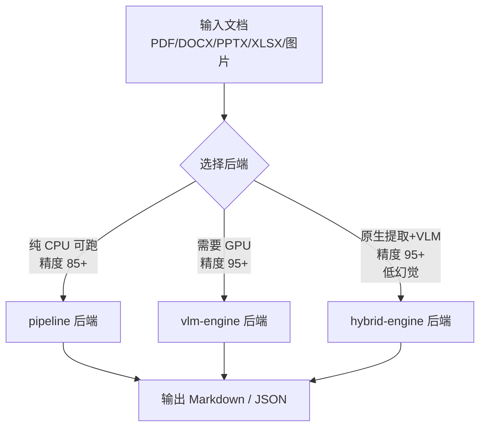
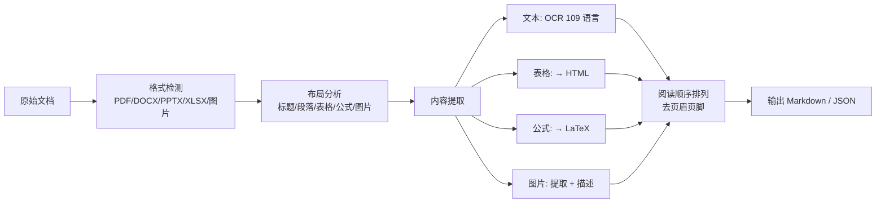
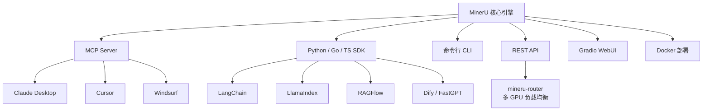
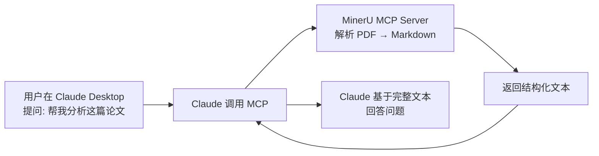

# MinerU：把复杂文档变成 LLM 能吃的结构化数据

## 一句话简介

MinerU 是 OpenDataLab 开源的高精度文档解析引擎（66k+ stars），能把 PDF、DOCX、PPTX、XLSX、图片转成结构化的 Markdown / JSON，专为 RAG、Agent、数据预训练等 LLM 工作流设计。

## 它解决什么问题

1. **当你在搭 RAG 系统但 PDF 解析质量惨不忍睹的时候**——表格变乱码、公式消失、多栏布局错位、扫描件直接空白。MinerU 提供 VLM + OCR 双引擎，在 OmniDocBench v1.6 上拿到 95+ 的端到端评分，表格输出 HTML、公式输出 LaTeX，按人类阅读顺序排列文本，自动去掉页眉页脚。

2. **当你要处理的不止 PDF 的时候**——3.1.0 版本起原生支持 DOCX / PPTX / XLSX 解析，不需要先转 PDF 再解析（那种方式速度慢几十倍且引入幻觉）。五种格式一条命令搞定。

3. **当你需要在 Claude Code / Cursor / Windsurf 里直接调用文档解析的时候**——MinerU 内置 MCP Server，支持 Claude Desktop、Cursor、Windsurf 等 AI 编码工具直接调用。

4. **当你需要离线部署、保护数据隐私的时候**——MinerU 完全可以离线运行。`pipeline` 后端甚至支持纯 CPU 推理（4GB 显存或无 GPU 均可），不需要联网、不需要把文件传到第三方服务。

5. **当你要批量处理海量文档的时候**——`mineru-router` 支持多 GPU 负载均衡，`mineru-api` 提供异步任务队列，3.0.0 引入滑动窗口机制让万页长文档不再爆内存。

## 安装方法

```bash
# 最简安装（推荐）
pip install --upgrade pip
pip install uv
uv pip install -U "mineru[all]"

# 从源码安装
git clone https://github.com/opendatalab/MinerU.git
cd MinerU
uv pip install -e .[all]
```

Docker 部署（仅 Linux / Windows WSL2）：

```bash
# 详见官方文档
# https://opendatalab.github.io/MinerU/quick_start/docker_deployment/
```

### 环境要求

| 项目 | 要求 |
|------|------|
| Python | 3.10 - 3.13 |
| 操作系统 | Linux / Windows / macOS 14+ |
| 内存 | 最低 16GB，推荐 32GB |
| GPU | 可选（pipeline 后端支持纯 CPU） |
| 最低显存 | pipeline 4GB / vlm-engine 8GB |
| 磁盘 | 最低 20GB，推荐 SSD |

## 核心机制

### 三种解析后端

MinerU 提供三种后端，精度和资源消耗不同：



| 后端 | 精度 (OmniDocBench) | GPU 要求 | 特点 |
|------|---------------------|---------|------|
| `pipeline` | 85+ | 不需要（纯 CPU 可跑） | 快速稳定，无幻觉 |
| `vlm-engine` | 95+ | 8GB+ 显存 | 高精度，支持 vLLM / LMDeploy / mlx |
| `hybrid-engine` | 95+ | 8GB+ 显存 | 原生文本提取 + VLM 视觉理解，幻觉最低 |

### 解析流水线



### 集成生态



## 实战 Demo

### 场景一：命令行解析 PDF

```bash
# GPU 加速（默认 vlm-engine）
mineru -p paper.pdf -o output/

# 纯 CPU 运行
mineru -p paper.pdf -o output/ -b pipeline

# 解析整个目录
mineru -p ./documents/ -o output/
```

输出结构：

```
output/
├── paper/
│   ├── paper.md          # Markdown 正文
│   ├── paper.json        # JSON 结构化数据
│   └── images/           # 提取的图片
│       ├── img_0.png
│       └── img_1.png
```

### 场景二：解析 Word/PPT/Excel

```bash
# DOCX — 原生解析，比 PDF 转换快几十倍
mineru -p report.docx -o output/

# PPTX
mineru -p slides.pptx -o output/

# XLSX
mineru -p data.xlsx -o output/
```

### 场景三：Python SDK 调用

```python
from mineru import MinerU

mu = MinerU()
result = mu.parse("paper.pdf")
print(result.markdown)
```

### 场景四：通过 MCP Server 在 Claude Desktop 中使用



在 Claude Desktop 的 MCP 配置中添加 MinerU Server 后，Claude 可以直接读取和解析你本地的 PDF / Word 文件。

### 场景五：部署高并发解析服务

```bash
# 启动 API 服务
mineru-api --host 0.0.0.0 --port 8000

# 启动多 GPU 路由（生产部署）
mineru-router --services http://gpu1:8000 http://gpu2:8000

# 提交异步任务
curl -X POST http://localhost:8000/tasks \
  -F "file=@paper.pdf"
```

## 与同类工具对比

| 工具 | 开源 | 表格→HTML | 公式→LaTeX | 多格式 | OCR 语言 | MCP |
|------|------|-----------|-----------|--------|---------|-----|
| **MinerU** | ✅ | ✅ | ✅ | PDF/DOCX/PPTX/XLSX/图片 | 109 | ✅ |
| PyMuPDF / pdfplumber | ✅ | ❌ | ❌ | 仅 PDF | — | ❌ |
| Unstructured.io | ✅ | 部分 | ❌ | 多格式 | 有限 | ❌ |
| Mathpix | ❌（商用） | ✅ | ✅ | PDF/图片 | 多 | ❌ |

## 适合谁用

### 适合

- 搭 RAG 系统、需要高质量文档解析的工程师
- 做数据清洗、预训练数据准备的 AI 研究员
- 需要离线 / 私有化部署的企业
- 用 Claude Code / Cursor 想直接解析文档的开发者
- 批量处理大量 PDF / Office 文档的场景

### 不太适合

- 只需要简单提取纯文本（用 `pdfplumber` 或 `python-docx` 更轻量）
- 需要编辑 PDF（MinerU 是解析工具，不是编辑器）
- 内存 < 16GB 且无 GPU 的低配机器（pipeline 后端勉强能跑，但体验差）

## 常见坑

1. **Windows 下 CUDA 加速不生效**：需要手动安装 CUDA 版本的 PyTorch，参考 [FAQ](https://opendatalab.github.io/MinerU/faq/#windows-cuda-acceleration)
2. **macOS 版本要求**：必须 14.0+，更老的系统无法安装
3. **Docker 不支持 macOS**：macOS 用户必须用 pip / uv 安装
4. **大文档内存爆炸**：3.0.0 之前版本处理万页文档可能 OOM，升级到 3.0+ 后使用滑动窗口机制已修复
5. **VLM 后端首次启动慢**：需要下载模型（~1.2B 参数），首次运行耐心等待
6. **API 和 CLI 架构变化**：3.0.0 起 `mineru` CLI 底层走 `mineru-api`，不指定 `--api-url` 时自动启动本地临时服务

## 关键链接

| 资源 | 链接 |
|------|------|
| GitHub 仓库 | https://github.com/opendatalab/MinerU |
| 官方文档 | https://opendatalab.github.io/MinerU/ |
| 在线 Demo（官方） | https://mineru.net |
| HuggingFace Demo | https://huggingface.co/spaces/opendatalab/MinerU |
| ModelScope Demo | https://www.modelscope.cn/studios/OpenDataLab/MinerU |
| 技术报告 | https://arxiv.org/abs/2509.22186 |
| Discord 社区 | https://discord.gg/Tdedn9GTXq |
| PyPI | https://pypi.org/project/mineru/ |
