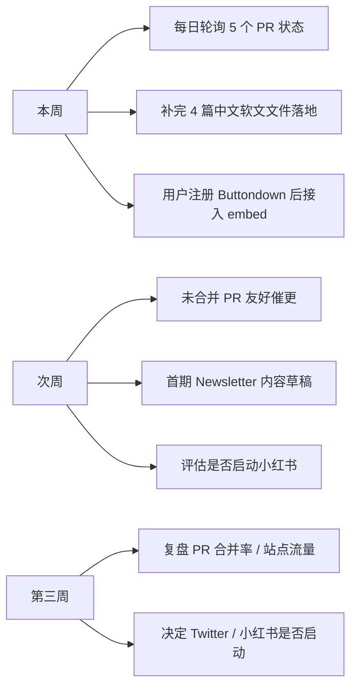

# 已投放渠道追踪表

> Claude Skills 中文市集 (claudeskill.me) — W4 冷启动投放状态
>
> 最后更新: 2026-06-03

---

## 1. GitHub Awesome Lists（已投放 ✅）

5 个 PR 已提交，等待维护者 review 合并。

| # | 仓库 | Stars | 投放形式 | PR 链接 | 状态 |
|---|------|-------|---------|---------|------|
| 1 | [helloianneo/awesome-claude-code-skills](https://github.com/helloianneo/awesome-claude-code-skills) | 205 | 表格行（合集/导航站） | [#33](https://github.com/helloianneo/awesome-claude-code-skills/pull/33) | 🟡 待 review |
| 2 | [LangGPT/awesome-claude-code](https://github.com/LangGPT/awesome-claude-code) | 246 | 表格行（Guides & Docs） | [#83](https://github.com/LangGPT/awesome-claude-code/pull/83) | 🟡 待 review |
| 3 | [karanb192/awesome-claude-skills](https://github.com/karanb192/awesome-claude-skills) | 363 | 表格行（Skill Collections） | [#103](https://github.com/karanb192/awesome-claude-skills/pull/103) | 🟡 待 review |
| 4 | [travisvn/awesome-claude-skills](https://github.com/travisvn/awesome-claude-skills) | **13.1k** | bullet 块（Collections & Libraries） | [#802](https://github.com/travisvn/awesome-claude-skills/pull/802) | 🟡 待 review |
| 5 | [webfuse-com/awesome-claude](https://github.com/webfuse-com/awesome-claude) | 1.5k | bullet（Community Curated Lists） | [#249](https://github.com/webfuse-com/awesome-claude/pull/249) | 🟡 待 review |

**总曝光潜力**: 约 15.4k stars 量级的 awesome list 覆盖。

**Review 跟进策略**:
- 每周一查一次 PR 状态（`gh pr list --author fanshanhong`）
- 超过 14 天无回应 → 在 PR 下补一条友好评论
- 合并后立刻记录到下方"已合并"区

### 已合并 ✅

_暂无_

---

## 2. 中文社区软文（话术已就绪，待用户手动发布 🟠）

平台政策不允许 Agent 自动登录发帖，需要本人手动操作。

| 平台 | 话术状态 | 文件位置 | 发布状态 | 备注 |
|------|---------|---------|---------|------|
| V2EX | ✅ 已起草 | [`marketing/copy/v2ex.md`](./copy/v2ex.md) | ⬜ 未发 | 节点：分享创造 / 周二或周四 10-11 点 |
| 即刻 | ✅ 已起草 | [`marketing/copy/jike.md`](./copy/jike.md) | ⬜ 未发 | 圈子：AI 探索站 / 配 3 张图 |
| 少数派 | ✅ 已起草 | [`marketing/copy/sspai.md`](./copy/sspai.md) | ⬜ 未发 | 矩阵：效率工具 / 1500 字复盘式 |
| 掘金 | ✅ 已起草 | [`marketing/copy/juejin.md`](./copy/juejin.md) | ⬜ 未发 | 分类：AI / 主打工程实践 |

---

## 3. Twitter / X（暂缓 ⏸）

用户决定"稍后再说"，暂不投放。

---

## 4. 小红书（暂缓 ⏸）

视觉化平台，需要先准备配图后再启动。当前优先级低于 GitHub awesome 渠道。

---

## 5. Newsletter（基础设施待搭建 🟠）

| 项 | 选型 / 状态 | 备注 |
|----|------------|------|
| 服务商 | **Buttondown**（用户已选） | 印度开发者友好，免费层够用 |
| 账号注册 | ⬜ 待用户完成 | 预计 5 分钟 |
| 落地页 | ⬜ 待 embed URL 提供后接入 | 集成到 `web/src/pages/` |
| 首期内容 | ⬜ 未规划 | 建议：精选 5 篇高质量 skill 解析 |

---

## 6. Custom Domain（基本就绪 ✅，收尾项 🟠）

| 项 | 状态 | 备注 |
|----|------|------|
| `claudeskill.me` Active | ✅ | CF Workers 已绑定，HTTPS 200 |
| DNS NS 迁移（阿里云 → CF） | ✅ | 已验证（dig @8.8.8.8 / @1.1.1.1） |
| `www.claudeskill.me` 重定向 | ⬜ 待用户在 CF 添加 | 建议 301 → apex |
| Always Use HTTPS 开关 | ⬜ 待用户在 CF SSL/TLS 启用 | 防止 http 裸访问 |

---

## 跟进节奏

---

## 数据回填位

合并后在这里记录效果数据，用于 ROI 复盘。

| 渠道 | 合并日期 | 当周新增 referrer 流量 | 当周 GitHub stars 增量 |
|------|---------|----------------------|----------------------|
| _待填_ | _待填_ | _待填_ | _待填_ |
